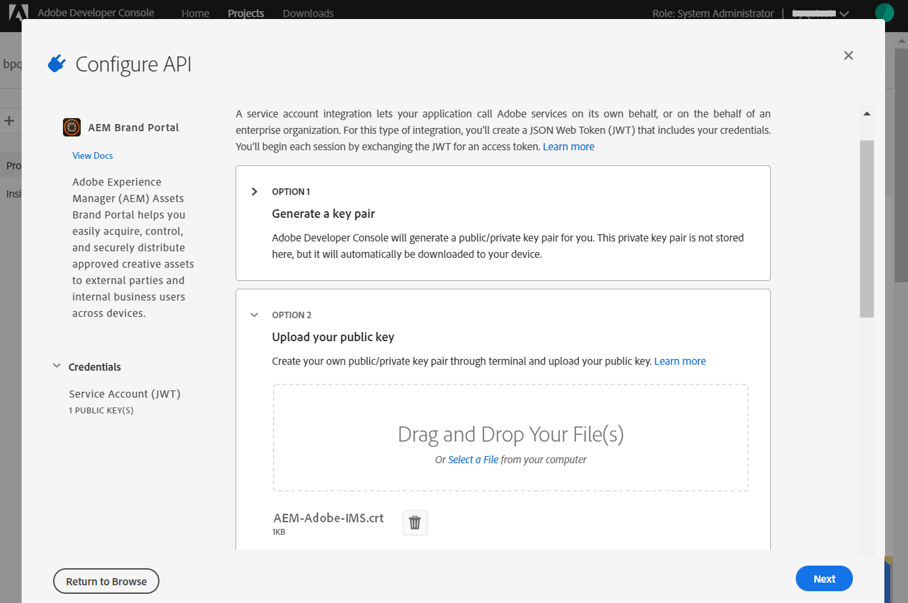

# Brand Portal を使用した Experience Manager Assets 設定 {#configure-aem-assets-with-brand-portal}

<table>
    <tr>
        <td>
            <i> 新規 </i>Dynamic Media Prime<a href="/help/assets/dynamic-media/dm-prime-ultimate.md"><b>Ultimate</b></a>
        </td>
        <td>
            <i> 新規 </i> <a href="/help/assets/assets-ultimate-overview.md"><b>AEM AssetsUltimate</b></a>
        </td>
        <td>
            <i> 新規 </i> <a href="/help/assets/integrate-aem-assets-edge-delivery-services.md"><b>AEM AssetsとEdge Delivery Servicesの統合 </b></a>
        </td>
        <td>
            <i> 新規 </i><a href="/help/assets/aem-assets-view-ui-extensibility.md"><b>UI 拡張機能 </b></a>
        </td>
          <td>
            <i>Dynamic Media Prime</i>Ultimateの新 <a href="/help/assets/dynamic-media/enable-dynamic-media-prime-and-ultimate.md"><b> 能 </b></a>
        </td>
    </tr>
    <tr>
        <td>
            <a href="/help/assets/search-best-practices.md"><b>検索のベストプラクティス</b></a>
        </td>
        <td>
            <a href="/help/assets/metadata-best-practices.md"><b>メタデータのベストプラクティス</b></a>
        </td>
        <td>
            <a href="/help/assets/product-overview.md"><b>コンテンツハブ</b></a>
        </td>
        <td>
            <a href="/help/assets/dynamic-media-open-apis-overview.md"><b>OpenAPI 機能を備えた Dynamic Media</b></a>
        </td>
        <td>
            <a href="https://developer.adobe.com/experience-cloud/experience-manager-apis/"><b>AEM Assets 開発者向けドキュメント</b></a>
        </td>
    </tr>
</table>

| バージョン | 記事リンク |
| -------- | ---------------------------- |
| AEM 6.5 | [ここをクリックしてください](https://experienceleague.adobe.com/docs/experience-manager-65/assets/brandportal/configure-aem-assets-with-brand-portal.html?lang=ja) |
| AEM as a Cloud Service | この記事 |

Adobe Experience Manager Assets Brand Portal を設定すると、承認済みのブランドアセットを Adobe Experience Manager Assets as a [!DNL Cloud Service] インスタンスから Brand Portal に公開し、Brand Portal ユーザーに配信できます。

## Cloud Manager を使用して Brand Portal をアクティベート {#activate-brand-portal}

Cloud Manager ユーザーは、Experience Manager Assets as a [!DNL Cloud Service] インスタンス用の Brand Portal をアクティブ化します。アクティブ化のワークフローでは、必要な設定（認証トークン、IMS 設定および Brand Portal クラウドサービス）がバックエンドで作成され、Cloud Manager の Brand Portal テナントのステータスが反映されます。Brand Portal をアクティブ化すると、Experience Manager Assets のユーザーが Brand Portal にアセットを公開して、Brand Portal ユーザーに配布できるようになります。

**前提条件**

Experience Manager Assets as a [!DNL Cloud Service] インスタンスで Brand Portal をアクティブ化するには、次のものが必要です。

* 稼働中の Experience Manager Assets as a [!DNL Cloud Service] インスタンス。
* Cloud Manager 製品のプロファイルに割り当てられている、Cloud Manager にアクセスできるユーザー。詳しくは、[Cloud Manager へのアクセス](https://experienceleague.adobe.com/docs/experience-manager-cloud-service/security/ims-support.html?lang=ja#accessing-cloud-manager)を参照してください。

>[!NOTE]
>
>Brand Portal テナントに接続するには、Experience Manager Assets as a [!DNL Cloud Service] インスタンスに設定済みの実稼動環境が必要です。

**Brand Portal をアクティブ化する手順**

Brand Portal のライセンス認証は、Experience Manager Assets as a [!DNL Cloud Service] インスタンス用の実稼動環境を作成する際に行うことも、別個に行うこともできます。環境が既に作成されており、Brand Portal をライセンス認証する必要があるとします。

1. Adobe Cloud Manager にログインし、**[!UICONTROL 環境]**&#x200B;に移動します。

   **[!UICONTROL 環境]**&#x200B;ページには、既存の環境のリストが表示されます。

1. 環境の詳細を表示するリストから環境を（1 つずつ）選択します。

   Brand Portal には利用可能な環境のうちいずれかの権利が付与され、**[!UICONTROL 環境情報]**&#x200B;に反映されます。

   Brand Portal に関連付けられている環境を見つけたら、「**[!UICONTROL Brand Portal のライセンス認証]**」ボタンをクリックして、アクティベーションワークフローを開始します。

   

1. アクティベーションワークフローがバックエンドで必要な設定を作成するので、Brand Portal テナントのライセンス認証に数分かかります。Brand Portal テナントがライセンス認証されると、ステータスが「アクティベート済み」に変わります。

   

>[!NOTE]
>
>Brand Portal は、Experience Manager Assets as [!DNL Cloud Service] インスタンスと同じ IMS 組織でアクティブ化する必要があります。
>
>IMS 組織（org1-existing）の Brand Portal クラウド設定が既にあり（[Adobe Developer Console](#manual-configuration) を使用して手動で設定）、Experience Manager Assets as a [!DNL Cloud Service] インスタンスが別の IMS 組織（org2-new）に設定されている場合、Cloud Manager から Brand Portal をアクティブ化すると Brand Portal の IMS 組織は `org2-new` にリセットされます。`org1-existing` で手動で設定したクラウド設定は、Experience Manager Assets のオーサーインスタンスに表示されますが、Cloud Manager で Brand Portal をアクティブ化すると使用されなくなります。
>
>既存の Brand Portal クラウド設定と Experience Manager Assets as a [!DNL Cloud Service] インスタンスが同じ IMS 組織（org1）を使用している場合は、Cloud Manager から Brand Portal をアクティブ化するだけで済みます。
>
>自動生成された設定は変更しないでください。

**関連トピック**：

* [Experience Manager Assets as a Cloud Service へのユーザーと役割の追加](https://experienceleague.adobe.com/docs/experience-manager-cloud-manager/using/requirements/setting-up-users-and-roles.html?lang=ja)

* [Cloud Manager での環境の管理](https://experienceleague.adobe.com/docs/experience-manager-cloud-service/implementing/using-cloud-manager/manage-environments.html?lang=ja#adding-environments)

**Brand Portal テナントにログイン**：

Cloud Manager で Brand Portal テナントをライセンス認証した後、Admin Console から、またはテナント URL を直接使用して、Brand Portal にログインできます。

Brand Portal テナントのデフォルト URL は `https://<tenant-id>.brand-portal.adobe.com/` です。

ここで、テナント ID は IMS 組織です。

ブランドポータルの URL が不明な場合は、次の手順を実行します。

1. [Admin Console](https://adminconsole.adobe.com/) にログインし、**[!UICONTROL 製品]**&#x200B;に移動します。
1. 左パネルの「**[!UICONTROL Adobe Experience Manager Brand Portal - Brand Portal]**」を選択します。
1. 「**[!UICONTROL Brand Portal に移動]**」をクリックして、ブラウザーで直接 Brand Portal を開きます。

   または、**[!UICONTROL Brand Portal へ移動]**&#x200B;リンクから Brand Portal テナント URL をコピーし、ブラウザーに貼り付けて Brand Portal インターフェイスを開きます。

   

**接続をテストします。**

Experience Manager Assets as a [!DNL Cloud Service] インスタンスと Brand Portal テナントとの接続を検証するには、次の手順を実行します。

1. Experience Manager Assets にログインします。

1. **ツール**&#x200B;パネルで、**[!UICONTROL デプロイメント]**／**[!UICONTROL 配布]**&#x200B;に移動します。

   

   Brand Portal 配布エージェント（**[!UICONTROL bpdistributionagent0]**）は、「**[!UICONTROL Brand Portal に公開]**」の下に作成されます。

   

1. 「**[!UICONTROL Brand Portal に公開]**」をクリックして、配布エージェントを開きます。

   「**[!UICONTROL ステータス]**」タブに配布キューが表示されます。

   配布エージェントには、次の 2 つのキューが含まれます。
   * **processing-queue**：Brand Portal へのアセット配布用。

   * **error-queue**：配布が失敗したアセット用。

   >[!NOTE]
   >
   >エラーを確認し、**error-queue** を定期的に消去することをお勧めします。

   

1. Experience Manager Assets as a [!DNL Cloud Service] と Brand Portal との接続を確認するには、「**[!UICONTROL 接続をテスト]**」アイコンをクリックします。

   

   *テストパッケージが正常に配信された*&#x200B;ことを示すメッセージが表示されます。

   >[!NOTE]
   >
   >配布エージェントを無効にしないでください。無効にすると、（実行中のキュー内の）アセットの配布が失敗する可能性があります。

Experience Manager Assets as a [!DNL Cloud Service] インスタンスと Brand Portal テナントとの接続を確認するには、Experience Manager Assets から Brand Portal にアセットを公開します。接続に成功すると、公開されたアセットが Brand Portal インターフェイスに表示されます。

次の操作が可能になっています。

* [Experience Manager Assets から Brand Portal へのアセットの公開](publish-to-brand-portal.md)
* [Experience Manager Assets から Brand Portal へのフォルダーの公開](publish-to-brand-portal.md#publish-folders-to-brand-portal)
* [Experience Manager Assets から Brand Portal へのコレクションの公開](publish-to-brand-portal.md#publish-collections-to-brand-portal)
* [Brand Portal から Experience Manager Assets へのアセットの公開](https://experienceleague.adobe.com/docs/experience-manager-brand-portal/using/asset-sourcing-in-brand-portal/brand-portal-asset-sourcing.html?lang=ja) - Brand Portal でのアセットソーシング
* [Brand Portal へのプリセット、スキーマ、ファセットの公開](https://experienceleague.adobe.com/docs/experience-manager-brand-portal/using/publish/publish-schema-search-facets-presets.html?lang=ja)
* [Brand Portal へのタグの公開](https://experienceleague.adobe.com/docs/experience-manager-brand-portal/using/publish/brand-portal-publish-tags.html?lang=ja)

詳しくは、 [Brand Portal ドキュメント](https://experienceleague.adobe.com/docs/experience-manager-brand-portal/using/home.html?lang=ja) を参照してください。

**配布ログ**

配布エージェントのログで、アセット発行ワークフローを監視できます。

Experience Manager Assets から Brand Portal にアセットを公開して、ログを確認しましょう。

1. 「**設定のテスト**」節で示した手順（1 ～ 4）に従い、配布エージェントページに移動します。
1. 「**[!UICONTROL ログ]**」をクリックして、処理ログとエラーログを表示します。

   

配布エージェントは次のログを生成します。

* 情報：これは、配布エージェントの構成が正常に完了したときにトリガーされるシステムが生成するログです。
* DSTRQ1（リクエスト 1）：テスト接続時にトリガーされます。

アセットの公開時に、次の要求および応答ログが生成されます。

**配布エージェントの要求**：

* DSTRQ2（リクエスト 2）：アセットの公開リクエストがトリガーされます。
* DSTRQ3（リクエスト 3）：システムは、アセットが存在する Experience Manager Assets フォルダーを公開する別のリクエストをトリガーし、そのフォルダーを Brand Portal に複製します。

**配布エージェントの応答**：

* queue-bpdistributionagent0（DSTRQ2）：アセットが Brand Portal に公開されます。
* queue-bpdistributionagent0（DSTRQ3）：システムは、アセットを含んだ Experience Manager Assets フォルダーを Brand Portal に複製します。

上記の例では、追加の要求と応答がトリガーされます。アセットが初めて公開されたため、システムは Brand Portal で親フォルダー（パスの追加）を見つけることができず、アセットが公開されている Brand Portal で同じ名前の親フォルダーを作成する追加リクエストをトリガーしました。

>[!NOTE]
>
>親フォルダーが Brand Portal に存在しない場合や Experience Manager Assets で変更された場合には、追加のリクエストが生成されます。

Experience Manager Assets as a [!DNL Cloud Service] で Brand Portal をアクティブ化する自動処理ワークフロー以外に、Adobe Developer Console を使用して Experience Manager Assets as a [!DNL Cloud Service] と Brand Portal の連携を手動で設定する方法もありますが、こちらの方法はお勧めしません。

>[!NOTE]
>
>Brand Portal テナントのライセンス認証中に問題が発生した場合は、カスタマーサポートにお問い合わせください。

## Adobe Developer Console を使用した手動設定 {#manual-configuration}

>[!NOTE]
>
> 2024年6月以降は、新しい JWT 資格情報を作成できません。今後は、OAuth 資格情報のみが作成されます。
> 詳しくは、[OAuth 設定の作成](https://experienceleague.adobe.com/ja/docs/experience-manager-cloud-service/content/security/setting-up-ims-integrations-for-aem-as-a-cloud-service#creating-oauth-configuration:~:text=For%20example%3A-,Creating%20an%20OAuth%20configuration,-To%20create%20a)を参照してください。

次の節では、Adobe Developer Console を使用して Experience Manager Assets as a [!DNL Cloud Service] と Brand Portal の連携を手動で設定する方法について説明します。

以前は、Experience Manager Assets as a [!DNL Cloud Service] と Brand Portal の連携は Adobe Developer Console を介して手動で設定されており、Brand Portal テナントの認証のために Adobe Identity Management Services（IMS）アカウントトークンを入手していました。それには、Experience Manager Assets と Adobe Developer Console の両方で設定を行う必要があります。

<!--1. In Experience Manager Assets, create an IMS account and generate a public key (certificate).-->
<!--1. Under the project, configure an API using the public key to create a service account connection.
1. Get the service account credentials and JSON Web Token (JWT) payload information.
1. In Experience Manager Assets, configure the IMS account using the service account credentials and JWT payload.-->
1. Adobe 開発者コンソールで、Brand Portal テナント（組織）用のプロジェクトを作成します。
1. Experience Manager Assets で、IMS アカウントと Brand Portal エンドポイント（組織 URL）を使用して Brand Portal クラウドサービスを設定します。
1. Experience Manager Assets から Brand Portal にアセットを公開して、設定をテストします。

>[!NOTE]
>
>Experience Manager Assets as a [!DNL Cloud Service] インスタンスは、1 つの Brand Portal テナントに対してのみ設定される必要があります。

**前提条件**

Experience Manager Assets と Brand Portal の連携を設定するには、以下が必要です。

* 稼働中の Experience Manager Assets as a [!DNL Cloud Service] インスタンス
* Brand Portal テナント URL
* Brand Portal テナントの IMS 組織に対するシステム管理者権限を持つユーザー

## 設定の作成 {#create-new-configuration}

指定した順序で次の手順を実行して、Brand Portal で Experience Manager Assets を設定します。

1. [Adobe Developer Console で OAuth 資格情報を設定](#config-oauth)
1. [OAuth を使用して新しい Adobe IMS 統合を作成](#create-ims-account-configuration)
1. [Cloud Service の設定](#configure-cloud-service)
   <!--1. [Obtain public certificate](#public-certificate)-->
<!--1. [Create service account (JWT) connection](#createnewintegration) 
1. [Configure IMS account](#create-ims-account-configuration)-->

<!--
### Create IMS configuration {#create-ims-configuration}

The IMS configuration authenticates your Experience Manager Assets as a [!DNL Cloud Service] instance with the Brand Portal tenant. 

IMS configuration includes two steps:

* [Obtain public certificate](#public-certificate) 
* [Configure IMS account](#create-ims-account-configuration)
-->
<!--

### Obtain public certificate {#public-certificate}

The public key (certificate) authenticates your profile on Adobe Developer Console.

1. Login to Experience Manager Assets.
1. From the **Tools** panel, navigate to **[!UICONTROL Security]** > **[!UICONTROL Adobe IMS Configurations]**.
1. In Adobe IMS Configurations page, click **[!UICONTROL Create]**. It will redirect to the **[!UICONTROL Adobe IMS Technical Account Configuration]** page. By default, the **Certificate** tab opens.
1. Select **[!UICONTROL Adobe Brand Portal]** in the **[!UICONTROL Cloud Solution]** drop-down list.  
1. Select the **[!UICONTROL Create new certificate]** check box and specify an **alias** for the public key. The alias serves as name of the public key. 
1. Click **[!UICONTROL Create certificate]**. Then, click **[!UICONTROL OK]** to generate the public key.

   

1. Click the **[!UICONTROL Download Public Key]** icon and save the public key (CRT) file on your machine.

   The public key is used later to configure API for your Brand Portal tenant and generate service account credentials in Adobe Developer Console.  

   

1. Click **[!UICONTROL Next]**.

    In the **Account** tab, Adobe IMS account is created which requires the service account credentials that are generated in Adobe Developer Console. Keep this page open for now.

    Open a new tab and [create a service account (JWT) connection in Adobe Developer Console](#createnewintegration) to get the credentials and JWT payload for configuring the IMS account. 
-->
<!--

### Create service account (JWT) connection {#createnewintegration}

In Adobe Developer Console, projects and APIs are configured at Brand Portal tenant (organization) level. Configuring an API creates a service account (JWT) connection. There are two methods to configure API, by generating a key pair (private and public keys) or by uploading a public key. To configure Experience Manager Assets with Brand Portal, you must generate a public key (certificate) in Experience Manager Assets and create credentials in Adobe Developer Console by uploading the public key. These credentials are required to configure the IMS account in Experience Manager Assets. Once the IMS account is configured, you can configure the Brand Portal cloud service in Experience Manager Assets.

Perform the following steps to generate the service account credentials and JWT payload:

1. Login to Adobe Developer Console with system administrator privileges on the IMS organization (Brand Portal tenant). The default URL is [https://www.adobe.com/go/devs_console_ui](https://www.adobe.com/go/devs_console_ui).

   >[!NOTE]
   >
   >Ensure that you have selected the correct IMS organization (Brand Portal tenant) from the drop-down (organization) list located at the upper-right corner.

1. Click **[!UICONTROL Create new project]**. A blank project with a system-generated name is created for your organization. 

   Click **[!UICONTROL Edit project]** to update the **[!UICONTROL Project Title]** and **[!UICONTROL Description]**, and click **[!UICONTROL Save]**.
   
1. In the **[!UICONTROL Project overview]** tab, click **[!UICONTROL Add API]**.

1. In the **[!UICONTROL Add an API window]**, select **[!UICONTROL AEM Brand Portal]** and click **[!UICONTROL Next]**. 

   Ensure that you have access to the Experience Manager Brand Portal service.

1. In the **[!UICONTROL Configure API]** window, click **[!UICONTROL Upload your public key]**. Then, click **[!UICONTROL Select a File]** and upload the public key (.crt file) that you have downloaded in the [obtain public certificate](#public-certificate) section. 

   Click **[!UICONTROL Next]**.

   

1. Verify the public key and click **[!UICONTROL Next]**.

1. Select **[!UICONTROL Assets Brand Portal]** as the default product profile and click **[!UICONTROL Save configured API]**. 

   

1. Once the API is configured, you are redirected to the API overview page. From the left navigation under **[!UICONTROL Credentials]**, click the **[!UICONTROL Service Account (JWT)]** option.

   >[!NOTE] 
   >
   >* You can view the credentials and perform actions such as generate JWT tokens, copy credential details, retrieve client secret, and so on.
   >* Currently, only the Adobe's Developer Console Service Account (JWT) credential type is supported. Do not use the `OAuth Server-to-Server` credential type until it is supported in mid-April. Read more at [JWT Credentials Deprecation in Adobe Developer Console](https://experienceleague.adobe.com/docs/experience-manager-cloud-service/content/security/jwt-credentials-deprecation-in-adobe-developer-console.html).

1. From the **[!UICONTROL Client Credentials]** tab, copy the **[!UICONTROL client ID]**. 

   Click **[!UICONTROL Retrieve Client Secret]** and copy the **[!UICONTROL client secret]**.

   

1. Navigate to the **[!UICONTROL Generate JWT]** tab and copy the **[!UICONTROL JWT Payload]** information. 

You can now use the client ID (API key), client secret, and JWT payload to [configure the IMS account](#create-ims-account-configuration) in Experience Manager Assets.
-->
<!--
1. Click **[!UICONTROL Create Integration]**.

1. Select **[!UICONTROL Access an API]**, and click **[!UICONTROL Continue]**.

   

1. Create an integration page. 
   
   Select your organization from the drop-down list.

   In **[!UICONTROL Experience Cloud]**, Select **[!UICONTROL AEM Brand Portal]** and click **[!UICONTROL Continue]**. 

   If the Brand Portal option is disabled for you, ensure that you have selected correct organization from the drop-down box above the **[!UICONTROL Adobe Services]** option. If you do not know your organization, contact your administrator.

   

1. Specify a name and description for the integration. Click **[!UICONTROL Select a File from your computer]** and upload the `AEM-Adobe-IMS.crt` file downloaded in the [obtain public certificates](#public-certificate) section.

1. Select the profile of your organization. 

   Or, select the default profile **[!UICONTROL Assets Brand Portal]** and click **[!UICONTROL Create Integration]**. The integration is created.

1. Click **[!UICONTROL Continue to integration details]** to view the integration information. 

   Copy the **[!UICONTROL API Key]** 
   
   Click **[!UICONTROL Retrieve Client Secret]** and copy the Client Secret key.

   

1. Navigate to **[!UICONTROL JWT]** tab, and copy the **[!UICONTROL JWT payload]**.

   The API Key, Client Secret key, and JWT payload information is used to create IMS account configuration.

-->

### Adobe Developer Console で OAuth 資格情報を設定 {#config-oauth}

[Adobe Developer Console で OAuth 資格情報を設定](https://experienceleague.adobe.com/ja/docs/experience-manager-cloud-service/content/security/setting-up-ims-integrations-for-aem-as-a-cloud-service#credentials-in-the-developer-console)し、「Brand Portal API」を選択します。

### OAuth を使用して新しい Adobe IMS 統合を作成 {#create-ims-account-configuration}

[OAuth を使用して新しい Adobe IMS 統合を作成](https://experienceleague.adobe.com/ja/docs/experience-manager-cloud-service/content/security/setting-up-ims-integrations-for-aem-as-a-cloud-service#creating-oauth-configuration)し、クラウドソリューションの下のドロップダウンから「Brand Portal」を選択します。

<!--
Ensure that you have performed the following steps:

* [Obtain public certificate](#public-certificate)
* [Create service account (JWT) connection](#createnewintegration)
-->

<!--1. Open the IMS Configuration and navigate to the **[!UICONTROL Account]** tab. Keep the page open while [obtaining the public certificate](#public-certificate).

1. Specify a **[!UICONTROL Title]** for the IMS account.

   In the **[!UICONTROL Authorization Server]** field, specify the URL: [https://ims-na1.adobelogin.com/](https://ims-na1.adobelogin.com/)  
-->
<!--
1. Complete the configuration based on details from the [Developer Console](https://developer.adobe.com/developer-console/docs/guides/authentication/ServerToServerAuthentication/implementation/). Click **[!UICONTROL Create]**.
-->
<!--Specify client ID in the **[!UICONTROL API key]** field, **[!UICONTROL Client Secret]**, and **[!UICONTROL Payload]** (JWT payload) that you have copied while [creating the service account (JWT) connection](#createnewintegration).

   The IMS account is configured. 

   

 <!--  
1. Select the IMS account configuration and click **[!UICONTROL Check Health]**.

   Click **[!UICONTROL Check]** in the dialog box. On successful configuration, a message appears that the *Token is retrieved successfully*.

   
-->
<!--
>[!CAUTION]
>
>You must have only one IMS configuration.
>
>Ensure that the IMS configuration passes the health check. If the configuration does not pass the health check, it is invalid. You must delete it and create another valid configuration.
-->

### Cloud Service の設定 {#configure-cloud-service}

Brand Portal Cloud Service を設定するには、次の手順を実行します。

1. Experience Manager Assets にログインします。

1. **ツール**&#x200B;パネルで、**[!UICONTROL クラウドサービス]**／**[!UICONTROL AEM Brand Portal]** に移動します。

1. Brand Portal の設定ページで、「**[!UICONTROL 作成]**」をクリックします。

1. 設定の&#x200B;**[!UICONTROL タイトル]**&#x200B;を入力します。

   [IMS アカウントの設定](#create-ims-account-configuration) 時に作成した IMS 設定を選択します。

   「**[!UICONTROL サービス URL]**」に、Brand Portal テナント（組織）URL を入力します。

   

1. 「**[!UICONTROL 保存して閉じる]**」をクリックします。クラウド設定が作成されます。

   これで、Experience Manager Assets as [!DNL Cloud Service] インスタンスが Brand Portal で設定されました。

これで、配信エージェントを確認し、Brand Portal にアセットを公開することで、設定をテストできます。

**セキュアプレビューが有効な場合は、SPS でエグレス IP を許可リストに登録する**
 （会社に対して[セキュアプレビューが有効](#https://experienceleague.adobe.com/docs/dynamic-media-classic/using/upload-publish/testing-assets-making-them-public.html?lang=en)な状態で）Dynamic Media - Scene7 を使用する場合は、Scene7 会社管理者が SPS（Scene7 Publishing System）Flash UI を使用して、それぞれの地域の[公開エグレス IP を許可リストに登録する](#https://experienceleague.adobe.com/docs/dynamic-media-classic/using/upload-publish/testing-assets-making-them-public.html?lang=en#testing-the-secure-testing-service)ことをお勧めします。
エグレス IP は次のとおりです。

| **地域** | **エグレス IP** |
|--- |--- |
| 該当なし | 130.248.160.68、20.94.203.130 |
| EMEA | 51.132.146.75, 130.248.244.202, 130.248.244.203, 130.248.244.204, 130.248.244.210, 130.248.244.211, 130.248.244.212 |
| APAC | 63.140.44.54 |

<!--
### Test configuration {#test-configuration}

Perform the following steps to validate the configuration:

1. Login to AEM Assets.

1. From the **Tools** panel, navigate to **[!UICONTROL Deployment]** > **[!UICONTROL Distribution]**.

    

   A Brand Portal distribution agent (**[!UICONTROL bpdistributionagent0]**) is created under **[!UICONTROL Publish to Brand Portal]**.

   

1. Click **[!UICONTROL Publish to Brand Portal]** to open the distribution agent. 

   You can see the distribution queues under the **[!UICONTROL Status]** tab. 
   
   A distribution agent contains two queues: 
   * **processing-queue**: for the distribution of assets to Brand Portal. 

   * **error-queue**: for the assets where distribution has failed. 
   
   >[!NOTE]
   >
   >It is recommended to review the failures and  clear the **error-queue** periodically.  

   

1. To verify the connection between AEM Assets as a [!DNL Cloud Service] and Brand Portal, click the **[!UICONTROL Test Connection]** icon.

   

   A message appears that your *test package is successfully delivered*.

   >[!NOTE]
   >
   >Avoid disabling the distribution agent, as it can cause the distribution of the assets (running-in-queue) to fail.

You can now:

* [Publish assets from AEM Assets to Brand Portal](publish-to-brand-portal.md)
* [Publish folders from AEM Assets to Brand Portal](publish-to-brand-portal.md#publish-folders-to-brand-portal)
* [Publish collections from AEM Assets to Brand Portal](publish-to-brand-portal.md#publish-collections-to-brand-portal)
* [Publish assets from Brand Portal to AEM Assets](https://experienceleague.adobe.com/docs/experience-manager-brand-portal/using/asset-sourcing-in-brand-portal/brand-portal-asset-sourcing.html) - Asset Sourcing in Brand Portal
* [Publish presets, schemas, and facets to Brand Portal](https://experienceleague.adobe.com/docs/experience-manager-brand-portal/using/publish/publish-schema-search-facets-presets.html)
* [Publish tags to Brand Portal](https://experienceleague.adobe.com/docs/experience-manager-brand-portal/using/publish/brand-portal-publish-tags.html)

See [Brand Portal documentation](https://experienceleague.adobe.com/docs/experience-manager-brand-portal/using/home.html) for more information.

## Distribution logs {#distribution-logs}

You can monitor the distribution agent logs for the asset publishing workflow. 

For example, we have published an asset from AEM Assets to Brand Portal to validate the configuration. 

1. Follow the steps (from 1 to 4) as shown in the [Test Configuration](#test-configuration) section and navigate to the distribution agent page.
1. Click **[!UICONTROL Logs]** to view the processing and error logs.

   

The distribution agent has generated the following logs:

* INFO: This is a system-generated log that triggers on successful configuration of the distribution agent. 
* DSTRQ1 (Request 1): Triggers on test connection.

On publishing the asset, the following request and response logs are generated:

**Distribution agent request**:

* DSTRQ2 (Request 2): The asset publishing request is triggered.
* DSTRQ3 (Request 3): The system triggers another request to publish the AEM Assets folder (in which the asset exists) and replicates the folder in Brand Portal.

**Distribution agent response**:

* queue-bpdistributionagent0 (DSTRQ2): The asset is published to Brand Portal.
* queue-bpdistributionagent0 (DSTRQ3): The system replicates the AEM Assets folder (containing the asset) in Brand Portal.

In the above example, an additional request and response is triggered. The system could not find the parent folder (Add Path) in Brand Portal because the asset was published for the first time, therefore, it triggered an additional request to create a parent folder with the same name in Brand Portal where the asset is published.  

>[!NOTE]
>
>Additional request is generated in case the parent folder does not exist in Brand Portal or has been modified in AEM Assets. 
-->

<!--

## Additional information {#additional-information}

Go to `/system/console/slingmetrics` for statistics related to the distributed content:

1. **Counter metrics**
   * sling: `mac_sync_request_failure`
   * sling: `mac_sync_request_received`
   * sling: `mac_sync_request_success`

1. **Time metrics**
   * sling: `mac_sync_distribution_duration`
   * sling: `mac_sync_enqueue_package_duration`
   * sling: `mac_sync_setup_request_duration`

-->

<!--
   Comment Type: draft

   <li> </li>
   -->

<!--
   Comment Type: draft

   <li>Step text</li>
-->

**関連情報**

* [アセットを翻訳](translate-assets.md)
* [Assets HTTP API](mac-api-assets.md)
* [AEM Assets as a Cloud Service でサポートされているファイル形式](file-format-support.md)
* [アセットを検索](search-assets.md)
* [接続されたアセット](use-assets-across-connected-assets-instances.md)
* [アセットレポート](asset-reports.md)
* [メタデータスキーマ](metadata-schemas.md)
* [アセットをダウンロード](download-assets-from-aem.md)
* [メタデータを管理](manage-metadata.md)
* [検索ファセット](search-facets.md)
* [コレクションを管理](manage-collections.md)
* [メタデータの一括読み込み](metadata-import-export.md)
* [AEM および Dynamic Media へのアセットの公開](/help/assets/publish-assets-to-aem-and-dm.md)
