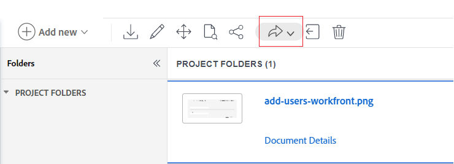
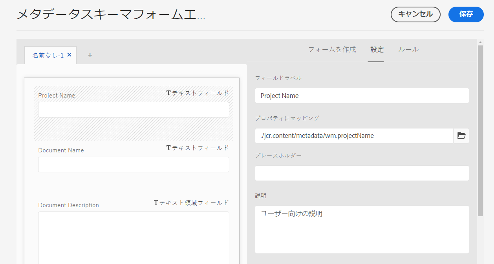

# Adobe Workfront と Experience Manager Assets 間のアセットメタデータのマッピング設定 {#asset-metadata-mapping-workfront-aem-assets}

<table>
    <tr>
        <td>
            <i> 新規 </i>Dynamic Media Prime<a href="/help/assets/dynamic-media/dm-prime-ultimate.md"><b>Ultimate</b></a>
        </td>
        <td>
            <i> 新規 </i> <a href="/help/assets/assets-ultimate-overview.md"><b>AEM AssetsUltimate</b></a>
        </td>
        <td>
            <i> 新規 </i> <a href="/help/assets/integrate-aem-assets-edge-delivery-services.md"><b>AEM AssetsとEdge Delivery Servicesの統合 </b></a>
        </td>
        <td>
            <i> 新規 </i><a href="/help/assets/aem-assets-view-ui-extensibility.md"><b>UI 拡張機能 </b></a>
        </td>
          <td>
            <i>Dynamic Media Prime</i>Ultimateの新 <a href="/help/assets/dynamic-media/enable-dynamic-media-prime-and-ultimate.md"><b> 能 </b></a>
        </td>
    </tr>
    <tr>
        <td>
            <a href="/help/assets/search-best-practices.md"><b>検索のベストプラクティス</b></a>
        </td>
        <td>
            <a href="/help/assets/metadata-best-practices.md"><b>メタデータのベストプラクティス</b></a>
        </td>
        <td>
            <a href="/help/assets/product-overview.md"><b>コンテンツハブ</b></a>
        </td>
        <td>
            <a href="/help/assets/dynamic-media-open-apis-overview.md"><b>OpenAPI 機能を備えた Dynamic Media</b></a>
        </td>
        <td>
            <a href="https://developer.adobe.com/experience-cloud/experience-manager-apis/"><b>AEM Assets 開発者向けドキュメント</b></a>
        </td>
    </tr>
</table>

Adobe Workfrontと Experience Manager as a Cloud Service のアプリケーション間でアセットメタデータのフィールドをマッピングできます。 メタデータフィールドをマッピングした結果、アセットを Workfront から Experience Manager Assets に送信すると、マッピングされたアセットメタデータを Experience Manager Assets で表示できます。

例えば、画像を Experience Manager Assets に送信する際に、画像の名前、説明、画像が属するプロジェクトなど、画像のメタデータフィールドを Workfront で保持する必要がある場合は、これらのフィールドを設定して Experience Manager Assets プロパティにマッピングします。

**ユースケース**

画像 `add-users-workfront.png` は Adobe Workfront アプリケーションの `Metadata Syncs` プロジェクトにあります。その画像を、次のメタデータを使用して Experience Manager Assets as a Cloud Service に送信する必要があります。

* プロジェクト名

* ドキュメント名

* ドキュメントの説明

## 前提条件 {#prerequisites}

* Workfront および Experience Manager Assets as a Cloud Service アプリケーションへの管理者アクセス。

* [Workfront と Experience Manager Assets as a Cloud Service アプリケーション](https://experienceleague.adobe.com/docs/workfront/using/administration-and-setup/configure-integrations/setup-asset-essentials.html?lang=ja)の統合。

## Workfront でのメタデータマッピングの設定 {#set-up-metadata-mapping}

Workfront で「プロジェクト名」、「ドキュメント名」および「ドキュメントの説明」フィールドのメタデータマッピングを設定するには、次の手順に従います。

1. Adobe Workfront アプリケーションの右上隅にある「メインメニュー」アイコン（）をクリックし、「**[!UICONTROL 設定]**」をクリックします。

1. 左側のパネルで「**[!UICONTROL ドキュメント]**」を選択し、「**[!UICONTROL Experience Manager Assets]**」を選択します。

1. Experience Manager Assets 統合を選択し、「**[!UICONTROL 編集]**」をクリックします。

1. 「**[!UICONTROL メタデータ]**」をクリックします。 「**[!UICONTROL Assets]**」タブで、[!UICONTROL プロジェクト]／[!UICONTROL 名前] Workfront フィールドを `wm:projectName`Experience Manager Assets フィールドにマッピングします。 完全に一致するものが見つからない場合、アドビでは、一番よく一致している Workfront と Experience Manager Assets のフィールドを探してマッピングすることをお勧めします。様々なデータタイプのフィールドをマッピングするのを避けることができます。 例えば、Workfront の日付フィールドを Assets の説明フィールドにマッピングするとします。
1. [!UICONTROL ドキュメント]／[!UICONTROL 名前] Workfront フィールドを `wm:documentName`Experience Manager Assets フィールドにマッピングします。

   

1. [!UICONTROL ドキュメント]／[!UICONTROL 説明] Workfront フィールドを `dc:description`Experience Manager Assets フィールドにマッピングします。

   >[!VIDEO](https://video.tv.adobe.com/v/344255)

## Workfront から Experience Manager Assets への画像の送信 {#send-image-workfront-assets}

Workfront から Experience Manager Assets に画像を送信するには：

1. Adobe Workfront アプリケーションの右上隅にある「メインメニュー」アイコン（）をクリックし、「**[!UICONTROL プロジェクト]**」をクリックします。

1. 「**[!UICONTROL 新規プロジェクト]**」をクリックして、プロジェクトを作成します。

1. 左側のウィンドウに表示されている「**[!UICONTROL ドキュメント]**」オプションをクリックし、Experience Manager Assets に送信する必要のある画像をドラッグして選択します。

1. 「**[!UICONTROL 送信先]**」をクリックし、Experience Manager Assets Essentials 統合の名前を選択します。

   

1. アセットの保存先フォルダーを選択し、「**[!UICONTROL フォルダーを選択]**」をクリックします。

1. 「**[!UICONTROL 保存]**」をクリックします。

## Experience Manageras a Cloud Service でのアセットメタデータのマッピング設定 {#metadata-mapping-aem}

[Adobe Workfront でアセットメタデータのマッピングを設定](#set-up-metadata-mapping)した後、Experience Manager Assets as a Cloud Service アプリケーションで同じマッピングを使用して、画像に適したメタデータの結果を表示する必要があります。

Experience Manager Assets のメタデータスキーマを使用して、メタデータのマッピングを実行します。 新しく追加したメタデータスキーマフォームまたは既存のメタデータスキーマフォームを編集できます。メタデータスキーマフォームには、タブとタブ内のフォーム項目が含まれています。これらのフォーム項目を CRX リポジトリーのメタデータノード内のフィールドにマップしたり、フォーム項目を設定したりできます。タブまたはフォーム項目をメタデータスキーマフォームに追加できます。詳しくは、[メタデータスキーマ](metadata-schemas.md)を参照してください。

Experience Manager Assets as a Cloud Service で、新しいメタデータフォームを使用してメタデータのマッピングを設定するには：

1. **[!UICONTROL ツール]**／**[!UICONTROL アセット]**／**[!UICONTROL メタデータスキーマ]**&#x200B;に移動します。

1. ツールバーから「**[!UICONTROL 作成]**」をクリックします。ダイアログで、スキーマフォームのタイトルを入力して「**[!UICONTROL 作成]**」をクリックし、フォーム作成プロセスを完了します。

1. スキーマフォームを選択し、「**[!UICONTROL 編集]**」をクリックします。

1. （オプション）メタデータスキーマのフォームエディターで `+` をクリックし、Workfront フィールド用のタブを作成します。

1. 「**[!UICONTROL フォームを作成]**」タブをクリックし、**[!UICONTROL 1 行のテキスト]**&#x200B;コンポーネントをフォームにドラッグします。フォームのコンポーネントをクリックします。「**[!UICONTROL フォームを作成]**」タブで、次の手順に従います。

   1. `Project Name` を&#x200B;**[!UICONTROL フィールドラベル]**&#x200B;フィールドに入力します。

   1. `./jcr:content/metadata/wm:projectName` を&#x200B;**[!UICONTROL プロパティにマッピング]**フィールドに入力します。ガイドラインとして、次のテンプレートを使用して Experience Manager Assets のフィールドマッピングを定義します。
      `./jcr:content/metadata/<mapping defined for the field in workfront>`。

      Workfront でマッピングを設定する際に、`wm:projectName` Experience Manager Assets フィールドをプロジェクト／名前 Workfront フィールドにマッピングしました。

      `wm` は名前空間名を指し、`projectName` はプロパティのタイトルを指します。`namespace:propertyTitle` 形式を使用して、メタデータフィールドのマッピングを定義します。

      

1. 「**[!UICONTROL フォームを作成]**」タブをクリックし、**[!UICONTROL 1 行のテキスト]**&#x200B;コンポーネントをフォームにドラッグします。フォームのコンポーネントをクリックします。「**[!UICONTROL フォームを作成]**」タブで、次の手順に従います。

   1. `Document Name` を&#x200B;**[!UICONTROL フィールドラベル]**&#x200B;フィールドに入力します。

   1. `./jcr:content/metadata/wm:documentName` を&#x200B;**[!UICONTROL プロパティにマッピング]**フィールドに入力します。
Workfront でマッピングを設定する際に、`wm:documentName` Experience Manager Assets フィールドをドキュメント／名前 Workfront フィールドにマッピングしました。

1. 「**[!UICONTROL フォームを作成]**」タブをクリックし、**[!UICONTROL 複数行テキスト]**&#x200B;コンポーネントをフォームにドラッグします。フォームのコンポーネントをクリックします。「**[!UICONTROL フォームを作成]**」タブで、次の手順に従います。

   1. `Document Description` を&#x200B;**[!UICONTROL フィールドラベル]**&#x200B;フィールドに入力します。

   1. `./jcr:content/metadata/dc:description` を&#x200B;**[!UICONTROL プロパティにマッピング]**フィールドに入力します。
Workfront でマッピングを設定する際に、`dc:description` Experience Manager Assets フィールドをドキュメント／説明 Workfront フィールドにマッピングしました。

1. 「**[!UICONTROL 保存]**」をクリックして、変更を保存します。

   >[!VIDEO](https://video.tv.adobe.com/v/344314)

## 画像フォルダーへのメタデータ設定の適用 {#apply-metadata-settings-image-folder}

Experience Manager as a Cloud Service アプリケーションでメタデータ設定を行った後、それらの設定を [Workfront アプリケーションから送信された画像を含むフォルダー](#send-image-workfront-assets)に適用します。

画像フォルダーにメタデータ設定を適用するには：

1. **[!UICONTROL ツール]**／**[!UICONTROL Assets]**／**[!UICONTROL メタデータスキーマ]**&#x200B;に移動します。

1. 使用可能なリストからメタデータスキーマを選択し、「**[!UICONTROL フォルダーに適用]**」をクリックします。

1. [Adobe Workfront アプリケーションから画像が送信される](#send-image-workfront-assets)宛先フォルダーを選択し、「**[!UICONTROL 適用]**」をクリックします。

Experience Manager Assets の画像に移動すると、その画像に関連付けられているメタデータを表示できます。 画像を選択して「**[!UICONTROL プロパティ]**」をクリックし、画像のメタデータを表示します。

**関連情報**

* [アセットを翻訳](translate-assets.md)
* [Assets HTTP API](mac-api-assets.md)
* [AEM Assets as a Cloud Service でサポートされているファイル形式](file-format-support.md)
* [アセットを検索](search-assets.md)
* [接続されたアセット](use-assets-across-connected-assets-instances.md)
* [アセットレポート](asset-reports.md)
* [メタデータスキーマ](metadata-schemas.md)
* [アセットをダウンロード](download-assets-from-aem.md)
* [メタデータを管理](manage-metadata.md)
* [検索ファセット](search-facets.md)
* [コレクションを管理](manage-collections.md)
* [メタデータの一括読み込み](metadata-import-export.md)
* [AEM および Dynamic Media へのアセットの公開](/help/assets/publish-assets-to-aem-and-dm.md)
