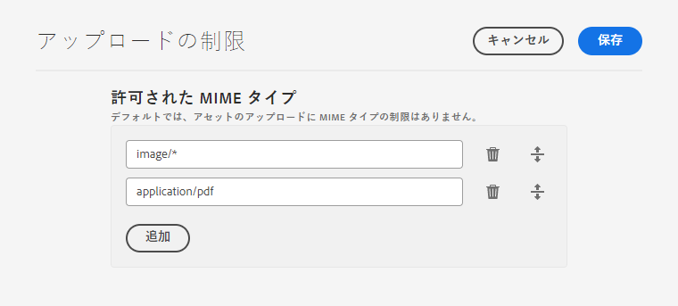
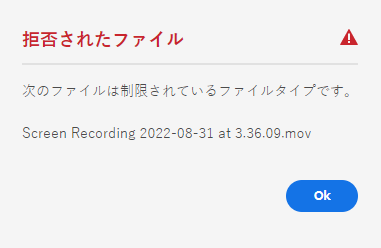
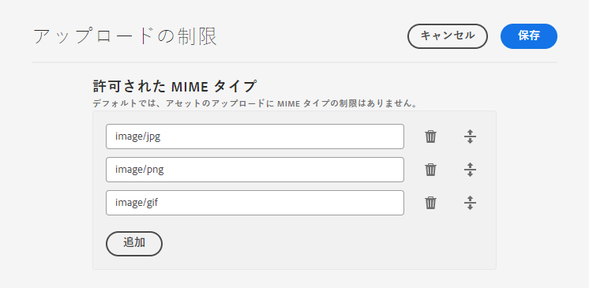

# アセットのアップロード制限を設定する {#configure-asset-upload-restrictions}

Adobe Experience Manager Assets を設定して、ユーザーがアップロードできるアセットのタイプを MIME タイプに基づいて制限することができます。

>[!IMPORTANT]
>
>デフォルトでは、Experience Manager Assets はユーザーに対して、すべての MIME タイプのアセットのアップロードを許可します。ただし設定を構成して、ユーザーが特定の MIME タイプのファイルのみをアップロードできるように制限することができます。

## 前提条件 {#prerequisites-asset-upload-restrictions}

アセットのアップロード制限を設定するには、管理者権限が必要です。

## アセットのアップロードに制限を適用する {#apply-restrictions-asset-uploadsssssss}

ユーザーによる特定の MIME タイプのファイルのアップロードを制限するように [!DNL Experience Manager] を設定するには、以下のようにします：

1. **[!UICONTROL ツール／アセット／アセット設定]**&#x200B;に移動します。

1. **[!UICONTROL 制限をアップロード]**&#x200B;をクリックます。

1. 「**[!UICONTROL 追加]**」をクリックして、許可される MIME タイプを定義します。

1. テキストボックスに MIME タイプを指定します。 「**[!UICONTROL 追加]**」をもう一度クリックして、その他の許可される MIME タイプをさらに指定することができます。また、「」をクリックして、MIME タイプをリストから削除することもできます。

1. 「**[!UICONTROL 保存]**」をクリックします。

**例 1：Experience Manager Assets へのすべての画像と PDF ファイルのアップロードを許可する**

すべての形式の画像と PDF ファイルを Experience Manager Assets にアップロードできるようにするには、次の設定を行います：

`image/*` を MIME タイプとして使用すると、すべての形式の画像をアップロードすることができます。 `application/pdf` を MIME タイプとして使用すると、PDF ファイルを Experience Manager Assets にアップロードすることができます。

許可されている MIME タイプのリストに含まれていないファイルをアップロードしようとすると、Experience Manager Assets には次のエラーメッセージが表示されます。

`Screen Recording 2022-08-31 at 3.36.09 PM.mov` は、許可されている MIME タイプに含まれていないファイル名を参照します。

**例 2：特定の画像形式の Experience Manager Assets へのアップロードを許可**

許可する MIME タイプに特定の画像形式を追加し、その他すべてのアセット形式のアップロードを制限するには、次の設定を実行します：

画像に表示されている設定に基づいて、.JPG、.PNG、および .GIF 形式の画像を Experience Manager Assets にアップロードすることができます。

**関連情報**

* [アセットを翻訳](translate-assets.md)
* [Assets HTTP API](mac-api-assets.md)
* [AEM Assets as a Cloud Service でサポートされているファイル形式](file-format-support.md)
* [アセットを検索](search-assets.md)
* [接続されたアセット](use-assets-across-connected-assets-instances.md)
* [アセットレポート](asset-reports.md)
* [メタデータスキーマ](metadata-schemas.md)
* [アセットをダウンロード](download-assets-from-aem.md)
* [メタデータを管理](manage-metadata.md)
* [検索ファセット](search-facets.md)
* [コレクションを管理](manage-collections.md)
* [メタデータの一括読み込み](metadata-import-export.md)
* [AEM および Dynamic Media へのアセットの公開](/help/assets/publish-assets-to-aem-and-dm.md)
