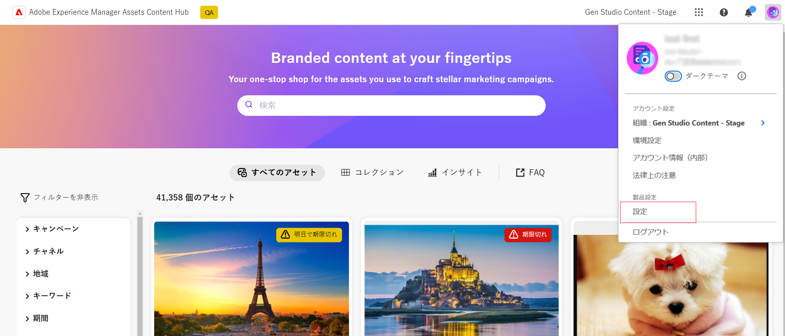
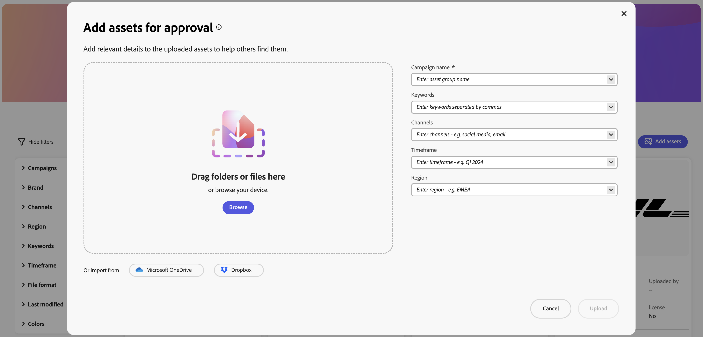
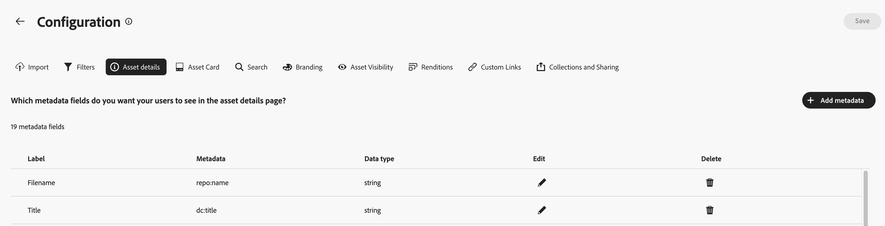
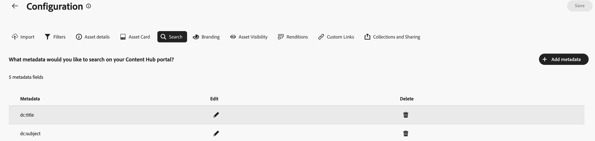
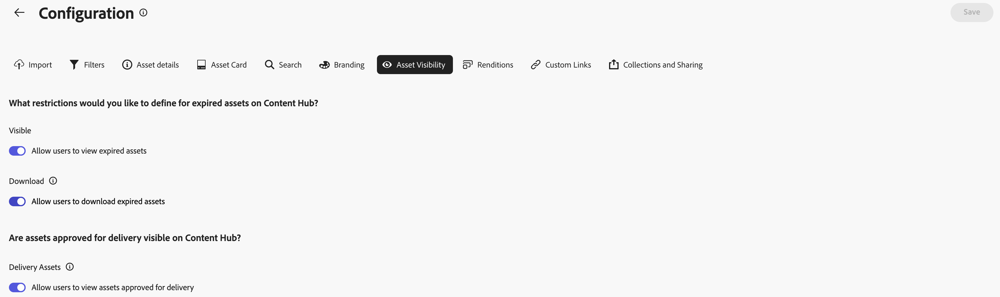
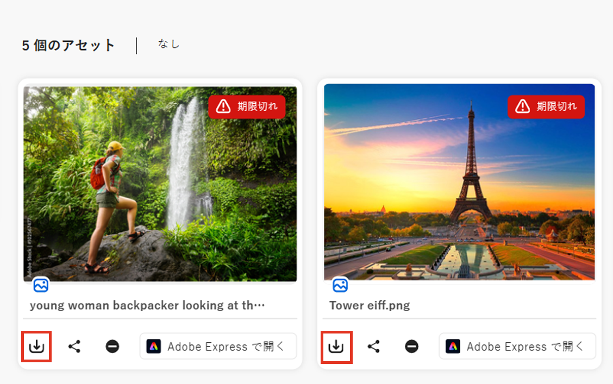
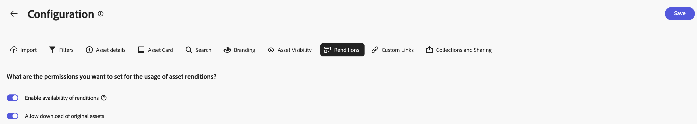
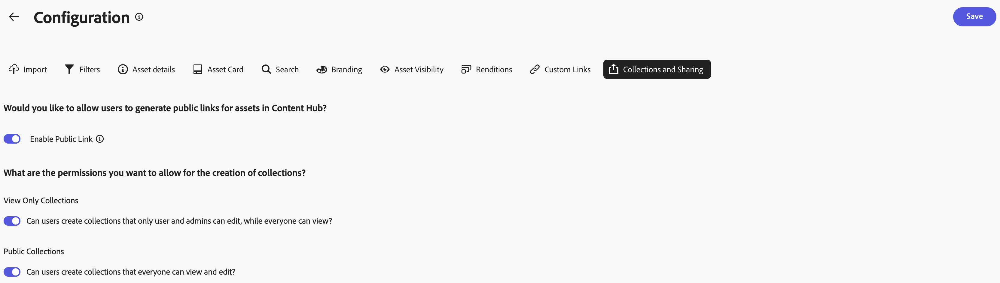
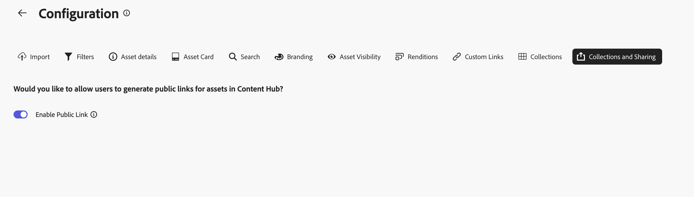

# コンテンツハブユーザーインターフェイスの設定 {#configure-content-hub-user-interface}

>[!CONTEXTUALHELP]
>id="configure_content_hub"
>title="コンテンツハブユーザーインターフェイスの設定"
>abstract="Experience Manager Assets を使用すると、管理者はコンテンツハブユーザーインターフェイスで使用可能なオプションを設定できます。管理者が選択した設定オプションに基づいて、コンテンツハブユーザーはコンテンツハブのフィールドを表示できます。設定オプションには、アセットの読み込み時のメタデータ、フィルター、アセットのプロパティ、アセットの検索時のメタデータ、パーソナライズされたブランディング、任意のカスタムリンクが含まれます。"
>additional-url="https://images-tv.adobe.com/mpcv3/4477/74a81d1c-0cfe-41f4-8a06-18ff70604e45_1732023385.854x480at800_h264.mp4" text="ビデオを観る"

<!--  -->

Experience Manager Assets を使用すると、管理者はコンテンツハブユーザーインターフェイスで使用可能なオプションを設定できます。管理者が選択した設定オプションに基づいて、コンテンツハブユーザーはコンテンツハブのフィールドを表示できます。設定オプションには次のものが含まれます。

* アセットの検索中にユーザーが使用できるフィルター。

* 各アセットで使用できるアセットの詳細またはプロパティ。

* コンテンツハブへのアセットの追加中にユーザーが使用できるメタデータフィールド。

* コンテンツハブで検索できるアセットメタデータフィールド。

* 組織に表示する必要があるブランディングコンテンツ。

* アセット、コレクション、インサイトに加えて、コンテンツハブに含める必要があるカスタムリンク。

## 前提条件 {#prerequisites-configuration-ui}

[コンテンツハブ管理者](/help/assets/deploy-content-hub.md#step-3-onboard-content-hub-administrator)は、組織内の他のユーザーの設定オプションを設定できます。

## コンテンツハブの設定オプションへのアクセス {#access-configuration-options-content-hub}

コンテンツハブの設定オプションにアクセスするには：

1. 右側のパネルでユーザーアイコンをクリックします。

1. 「**[!UICONTROL 製品設定]**」セクションで、「**[!UICONTROL 設定]**」を選択します。

   

## コンテンツハブの設定オプションの管理 {#manage-configuration-options}

管理者として、ユーザーの次の設定オプションを管理します。

* [読み込み](#configure-import-options-content-hub)

* [フィルター](#configure-filters-content-hub)

* [アセットの詳細](#configure-asset-details-content-hub)
* [アセットカード](#asset-card)

* [検索](#configure-metadata-search-content-hub)

* [ブランディング](#configure-branding-content-hub)

* [有効期限切れのアセット](#expired-assets-content-hub)

* [レンディション](#renditions-content-hub)

* [カスタムリンク](#configure-custom-links-content-hub)

* [コレクションと共有](#configure-collections-content-hub)

<!--* [Enable public link sharing](#enable-public-link-sharing)-->

### 読み込み {#configure-import-options-content-hub}

コンテンツハブポータルへのアセットのアップロードまたは読み込み中にユーザーに表示されるキャンペーン名、キーワード、チャネル、期間、地域などのメタデータフィールドを設定できます。これを行うには、次の手順を実行します。

1. [設定](#access-configuration-options-content-hub)ユーザーインターフェイスで、「**[!UICONTROL 読み込み]**」をクリックします。

1. 「**[!UICONTROL メタデータを追加]**」をクリックします。

1. プロパティのラベルを指定し、「**[!UICONTROL メタデータ]**」フィールドを使用してプロパティにマッピングし、新しいアセットメタデータの入力タイプを選択します。

1. **[!UICONTROL 必須フィールド]**&#x200B;切替スイッチをクリックすると、新しいアセットのアップロード中にユーザーが新しいメタデータフィールドを指定することが必須になります。

1. 「**[!UICONTROL 確認]**」をクリックします。新しいメタデータが、既存のアセットプロパティのリストに表示されます。

1. 「**[!UICONTROL 保存]**」をクリックして、変更内容を適用します。

同様に、使用可能な各プロパティの横にある  をクリックしてラベルを編集したり、**[!UICONTROL 必須フィールド]**&#x200B;切替スイッチを使用してアセットのアップロード中にこれらのフィールドをユーザーに対して必須または非必須にしたり、削除アイコンをクリックしてメタデータプロパティを削除したりできます。

Experience Manager Assets リポジトリに追加するすべてのアセットを自動承認して、コンテンツハブですぐに使用できるようにする必要がある場合は、**[!UICONTROL 自動承認]**&#x200B;切替スイッチをクリックします。それ以外の場合は、DAM 作成者または管理者がアセットを手動で承認して、コンテンツハブで使用できるようにする必要があります。切替スイッチは、デフォルトでオフの状態に設定されます。

すべての変更を行ったら、「**[!UICONTROL 保存]**」をクリックして、変更を適用します。

設定ユーザーインターフェイスで有効にしたメタデータは、アセットのアップロードページに表示されます。

### フィルター {#configure-filters-content-hub}

コンテンツハブを使用すると、管理者はアセットの検索中に表示されるフィルターを設定できます。新しいフィルターを追加するには、次の手順を実行します。

1. [設定](#access-configuration-options-content-hub)ユーザーインターフェイスで、「**[!UICONTROL フィルター]**」をクリックします。

1. 「**[!UICONTROL フィルターを追加]**」をクリックします。

1. フィルターのラベルを指定し、「**[!UICONTROL メタデータ]**」フィールドを使用してプロパティにマッピングし、新しいフィルターの入力タイプを選択します。
1. 「**[!UICONTROL 確認]**」をクリックします。新しいフィルターが、既存のフィルターのリストに表示されます。

1. 「**[!UICONTROL 保存]**」をクリックして変更を適用し、アセットのフィルタリング中に新しいフィルターが検索ページに表示されるようにします。

   >[!NOTE]
   >
   >新しいフィルターは、リポジトリ内にフィルター条件に一致するアセットが 1 つ以上ある場合にのみ、検索ページに表示されます。

同様に、使用可能な各フィルターの横にある  をクリックしてラベルを編集したり、削除アイコンをクリックして既存のフィルターを削除したりできます。すべての変更を行ったら、「**[!UICONTROL 保存]**」をクリックして、変更を適用します。

設定ユーザーインターフェイスで有効になっているフィルターは、検索ページに表示されます。

### アセットの詳細 {#configure-asset-details-content-hub}

ファイル名、タイトル、形式、サイズなど、各アセットに表示されるアセットプロパティを設定することもできます。これを行うには、次の手順を実行します。

1. [設定](#access-configuration-options-content-hub)ユーザーインターフェイスで、「**[!UICONTROL アセットの詳細]**」をクリックします。

1. 「**[!UICONTROL メタデータを追加]**」をクリックします。

1. プロパティのラベルを指定し、「**[!UICONTROL メタデータ]**」フィールドを使用してプロパティにマッピングし、新しいアセットメタデータの入力タイプを選択します。
1. 「**[!UICONTROL 確認]**」をクリックします。新しいメタデータが、既存のアセットプロパティのリストに表示されます。

1. 「**[!UICONTROL 保存]**」をクリックして変更を適用し、新しいプロパティがアセットの詳細ページに表示されるようにします。

同様に、使用可能な各プロパティの横にある  をクリックしてラベルを編集したり、削除アイコンをクリックして既存のアセットの詳細を削除したりできます。すべての変更を行ったら、「**[!UICONTROL 保存]**」をクリックして、変更を適用します。

設定ユーザーインターフェイスで有効になっているプロパティは、アセットの詳細ページに表示されます。

### アセットカード {#asset-card}

**アセットカード** に表示する必要がある主要なメタデータプロパティを、最大 6 つのフィールドまで設定できます。

次の手順を実行して、メタデータプロパティを設定し、**[!UICONTROL アセットカード]** に表示します。

1. [設定](#access-configuration-options-content-hub)ユーザーインターフェイスで、「**アセットカード**」をクリックします。
2. 「**メタデータを追加**」をクリックします。**アセットカードメタデータを追加**&#x200B;ダイアログボックスが表示されます。
3. 「**ラベル**」フィールドでメタデータ名を指定し、「**メタデータ**」フィールドでメタデータプロパティを選択します。
4. 「**確認**」をクリックし、「**保存**」をクリックして変更を適用し、新しいプロパティがアセットの詳細ページに表示されるようにします。
   
同様に、使用可能な各プロパティの横にある「」をクリックして必要な変更を加えるか、「」をクリックして既存のメタデータプロパティを削除します。 すべての変更を行ったら、「**保存**」をクリックして、変更を適用します。

### 検索 {#configure-metadata-search-content-hub}

管理者は、ユーザーがコンテンツハブで検索条件を指定した際に検索されるメタデータフィールドを定義できます。次の手順を実行します。

1. [設定](#access-configuration-options-content-hub)ユーザーインターフェイスで、「**[!UICONTROL メタデータを追加]**」をクリックします。

1. メタデータフィールドを指定し、「**[!UICONTROL 確認]**」をクリックします。

1. 「**[!UICONTROL 保存]**」をクリックして変更を適用し、新しいメタデータプロパティがメタデータフィールドのリストに表示されるようにします。

同様に、使用可能な各メタデータプロパティの横にある  をクリックしてプロパティを編集したり、削除アイコンをクリックして既存のプロパティを削除したりできます。すべての変更を行ったら、「**[!UICONTROL 保存]**」をクリックして、変更を適用します。

### ブランディング {#configure-branding-content-hub}

管理者は、ブランディング要件に合わせて [!DNL Content Hub] ポータルをカスタマイズします。

**[!UICONTROL ブランディング]** ページでは、**[!UICONTROL バナー]**、**[!UICONTROL カラー]** および **[!UICONTROL バナー画像]** の各セクションを使用して、次のカスタマイズを実行します。

1. [「[!UICONTROL バナー画像]」セクションからバナー画像を変更する](#Change-the-banner-image)
1. [バナーのタイトルと本文を更新し、「[!UICONTROL バナー]」セクションからテキストカラーを変更します](#Add-title-and-body-text-to-your-banner-and-change-the-text-color)
1. [「[!UICONTROL カラー]」セクションでプライマリカラーとセカンダリカラーを変更して、ブランドのテーマに合ったカラースキームを適用します](#Change-the-primary-and-secondary-color)

「**[!UICONTROL デフォルトにリセット]**」オプションを選択して変更を元に戻し、デフォルトのテーマに戻します。

#### バナー画像の変更{#Change-the-banner-image}

 **[!UICONTROL ブランディング]** ページで次の手順を実行して、[!DNL Content Hub] デプロイメントのバナー画像を変更します。

1.  **[!UICONTROL ギャラリーから選択]**&#x200B;をクリックし、アセットセレクターダイアログボックスを使用してバナー画像を選択します。アセットセレクターには、承認済みの画像のみが表示されます。
1. 画像を選択し、**[!UICONTROL 選択]**、**[!UICONTROL 保存]**&#x200B;の順にクリックして、[!DNL Content Hub] デプロイメントのバナー画像として表示します。
   

#### タイトルと本文をバナーに追加し、テキストカラーを変更します{#Add-title-and-body-text-to-your-banner-and-change-the-text-color}

 **[!UICONTROL ブランディング]** ページで、「**[!UICONTROL バナー]**」セクションの各フィールドを使用して、タイトルと本文をバナーに追加します。
**[!UICONTROL バナーテキストのカラー]** の横にある正方形ボックスをクリックして、バナーテキストのカラーピッカーからテキストカラーを選択するか、カラーピッカーの正方形ボックスの横のフィールドにカラーの 16 進コードを指定します。

#### プライマリカラーとセカンダリカラーの変更{#Change-the-primary-and-secondary-color}

 **[!UICONTROL ブランディング]** ページでは、「**[!UICONTROL カラー]**」セクションを使用して、カラーピッカーを使用して選択するか、カラーの 16 進数コードを定義することによって、プライマリカラーとセカンダリカラーを設定します。これらのカラーは、UI 要素の背景、テキスト、アイコンのカラーを設定して、[!DNL Content Hub] UI をブランドのテーマに合わせます。

**[!UICONTROL プライマリの色 ]:** プライマリの色の設定は、ホーム ページおよび [!DNL Content Hub] 構成 [!DNL Content Hub] ページを含む [!UICONTROL  ージ全体で、選択アクション、チェックボックスなどのインタラクティブ要素、検索バー、およびトグル スイッチ ] 適用されます。 また、**[!UICONTROL すべてのアセット]**&#x200B;ページや&#x200B;**[!UICONTROL コレクション]**&#x200B;ページで使用できるオプションなど、プライマリ [!DNL Content Hub] インターフェイスで使用できるアクションオプションにも適用されます。

**[!UICONTROL セカンダリカラー]：**[!DNL Content Hub] ホームページでは、ダイアログボックス内で使用可能な UI オプションおよび入力フィールドにセカンダリカラースキームが適用されます。選択アクション、チェックボックス、検索バー、切り替えスイッチを除く、[!UICONTROL 設定]ページで使用可能なすべての設定メニューオプションに適用されます。

### アセットの表示{#asset-visibility-content-hub}

管理者は、有効期限切れのアセットをコンテンツハブに表示する必要があるかどうかを制御できます。有効期限切れのアセットを表示する場合は、ユーザーがこれらをダウンロードできるかどうかも定義できます。

有効期限切れのアセットは、デフォルトではコンテンツハブに表示されません。

これを行うには、次の手順を実行します。

1. [ 設定 ](#access-configuration-options-content-hub) ユーザーインターフェイスで、「**[!UICONTROL アセットの表示]**」をクリックします。

1. 「**[!UICONTROL 表示]**」セクションで、「**[!UICONTROL ユーザーが有効期限切れのアセットを表示することを許可]**」切替スイッチを有効にし、有効期限切れのアセットがすべてコンテンツハブに表示されるようにします。

1. アセットの表示を有効にした後、「**[!UICONTROL ユーザーが有効期限切れのアセットをダウンロードすることを許可]**」切替スイッチを使用して、有効期限切れのアセットをダウンロードする機能を有効または無効にすることができます。
1. **[!UICONTROL 配信の承認されたアセットの表示をユーザーに許可]** を有効にして、Content Hubで配信の承認されたすべてのアセットを表示するように切り替えます。
1. 「**[!UICONTROL 保存]**」をクリックして、変更内容を適用します。

   

アセットの表示を有効にすると、次の画像に示すように、コンテンツハブで有効期限切れのアセットを表示できます。

管理者がダウンロードを有効にしている場合は、画像でハイライト表示されているように、コンテンツハブユーザーもダウンロードできます。

有効期限切れのアセットの表示が有効になっている場合、コンテンツハブはアセットカードの `Expiring in n days` メッセージを使用して、今後 15 日以内に有効期限切れになるアセットもハイライト表示します。

### レンディション {#renditions-content-hub}

レンディションは、画像やドキュメントなどのデジタルアセットのカスタマイズバージョンで、最適なパフォーマンスを確保するために、様々なデバイスやプラットフォーム向けに設計されています。詳しくは、[Adobe Experience Manager Assets のレンディション](https://experienceleague.adobe.com/ja/docs/experience-manager-cloud-service/content/assets/assets-view/renditions)を参照してください。

これを行うには、次の手順を実行します。

[設定](#access-configuration-options-content-hub)ユーザーインターフェイスで、「**[!UICONTROL レンディション]**」をクリックします。以下のオプションが利用できます。

* 「[!UICONTROL レンディションの可用性を有効にする]」切替スイッチを有効にして、すべてのレンディションをコンテンツハブで表示します。

* 「**[!UICONTROL ユーザーに元のアセットのダウンロードを許可]**」切替スイッチを有効または無効にして、元のアセットをダウンロードできるかどうかを制御します。

  

コンテンツハブでレンディションを表示およびダウンロードする方法について詳しくは、[コンテンツハブでのアセットのダウンロード](/help/assets/download-assets-content-hub.md)を参照してください。

### カスタムリンク {#configure-custom-links-content-hub}

コンテンツハブポータルのバナーのすぐ下にある標準の「**[!UICONTROL すべてのアセット]**」タブ、「**[!UICONTROL コレクション]**」タブ、「**[!UICONTROL インサイト]**」タブに加えて、カスタムタブを追加することもできます。これを行うには、次の手順を実行します。

1. [設定](#access-configuration-options-content-hub)ユーザーインターフェイスで、「**[!UICONTROL カスタムリンク]**」をクリックします。

1. 「**[!UICONTROL リンクを追加]**」をクリックします。

1. 「**[!UICONTROL ラベル]**」フィールドと「**[!UICONTROL URL]**」フィールドにテキストを指定します。定義したラベルはタブとして表示され、ラベルをクリックすると、「**[!UICONTROL URL]**」フィールドで定義した URL に移動します。

1. 「**[!UICONTROL 確認]**」をクリックします。

1. 「**[!UICONTROL 保存]**」をクリックして、変更内容を適用します。

同様に、各 URL の横にある  をクリックしてリンクを編集したり、削除アイコンをクリックして既存の URL を削除したりできます。すべての変更を行ったら、「**[!UICONTROL 保存]**」をクリックして、変更を適用します。

カスタムリンクは、Content Hub ホームページで「インサイト」タブの横に新しいタブとして表示されます。

### コレクションと共有 {#configure-collections-content-hub}

管理者は、コレクションの作成時にユーザー権限を定義できます。 これらの設定を有効にするには、次の手順に従います。

1. [ 設定 ](#access-configuration-options-content-hub) ユーザーインターフェイスで、「**[!UICONTROL コレクション]**」をクリックします。

1. **[!UICONTROL 公開リンクを有効にする]** 切替スイッチを有効にして、外部ユーザーがContent Hubにログインせずにアセットにアクセスしてダウンロードするために使用できる公開リンクの作成を許可します。

1. **[!UICONTROL コレクションのみを表示]** 切替スイッチを有効にして、すべてのユーザーがアクセスできるが、作成者と管理者のみが編集できるコレクションを許可します。

1. **[!UICONTROL 公開コレクション]** 切替スイッチを有効にして、すべてのユーザーがアクセスおよび編集できるコレクションを許可します。 **[!UICONTROL コレクションのみを表示]** および **[!UICONTROL 公開コレクション]** の切り替えが無効になっている場合、デフォルトでは、管理者以外のユーザーは非公開コレクションのみを作成できます。

1. 「**[!UICONTROL 保存]**」をクリックして、変更内容を適用します。

   

<!--
### Enable public link sharing {#enable-public-link-sharing}

Enable the following setting on the Configurations user interface to allow Content Hub users to generate a public link:

1. On the [Configurations](#access-configuration-options-content-hub) user interface, click **[!UICONTROL Collections and Sharing]**.

1. Enable the **[!UICONTROL Enable Public Link]** toggle and click **[!UICONTROL Save]** to apply the changes.

    

-->

詳しくは、[ [!DNL Content Hub]](share-assets-content-hub.md) でのアセットの共有を参照してください。
