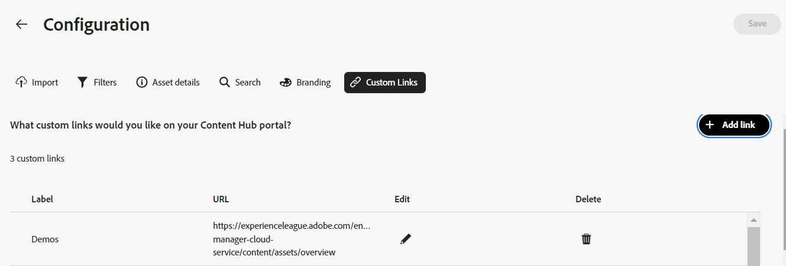

# コンテンツハブユーザーインターフェイスの設定 {#configure-content-hub-user-interface}

| [検索のベストプラクティス](/help/assets/search-best-practices.md) | [メタデータのベストプラクティス](/help/assets/metadata-best-practices.md) | [コンテンツハブ](/help/assets/product-overview.md) | [OpenAPI 機能を備えた Dynamic Media](/help/assets/dynamic-media-open-apis-overview.md) | [AEM Assets 開発者向けドキュメント](https://developer.adobe.com/experience-cloud/experience-manager-apis/) |
| ------------- | --------------------------- |---------|----|-----|

>[!CONTEXTUALHELP]
>id="configure_content_hub"
>title="コンテンツハブユーザーインターフェイスの設定"
>abstract="Experience Manager Assets を使用すると、管理者はコンテンツハブユーザーインターフェイスで使用可能なオプションを設定できます。管理者が選択した設定オプションに基づいて、コンテンツハブユーザーはコンテンツハブのフィールドを表示できます。設定オプションには、アセットの読み込み時のメタデータ、フィルター、アセットのプロパティ、アセットの検索時のメタデータ、パーソナライズされたブランディング、任意のカスタムリンクが含まれます。"
>additional-url="https://images-tv.adobe.com/mpcv3/4477/98bce651-721c-442e-98b8-c43e7708e44c_1698834577.854x480at800_h264.mp4" text="ビデオを見る"

<!--  -->

>[!AVAILABILITY]
>
>Content Hub ガイドがPDF形式で利用できるようになりました。 ガイド全体をダウンロードし、Adobe Acrobat AI アシスタントを使用して質問に答えます。
>
>[!BADGE Content Hub ガイドのPDF]{type=Informative url="https://helpx.adobe.com/content/dam/help/en/experience-manager/aem-assets/content-hub.pdf"}

Experience Manager Assets を使用すると、管理者はコンテンツハブユーザーインターフェイスで使用可能なオプションを設定できます。管理者が選択した設定オプションに基づいて、コンテンツハブユーザーはコンテンツハブのフィールドを表示できます。設定オプションは次のとおりです。

* アセットの検索中にユーザーが使用できるフィルター。

* 各アセットで使用できるアセットの詳細またはプロパティ。

* Content Hubへのアセットの追加中にユーザーが使用できるメタデータフィールド。

* Content Hubで検索できるアセットメタデータフィールド。

* 組織に表示する必要があるブランディングコンテンツ。

* アセット、コレクション、インサイトに加えて、Content Hubに含める必要のあるカスタムリンク。

## 前提条件 {#prerequisites-configuration-ui}

[Content Hub管理者 ](/help/assets/deploy-content-hub.md#step-3-onboard-content-hub-administrator) は、組織内の他のユーザーに対して設定オプションを指定できます。

## Content Hubの設定オプションへのアクセス {#access-configuration-options-content-hub}

Content Hubの設定オプションにアクセスするには：

1. 右側のパネルでユーザーアイコンをクリックします。

1. 「**[!UICONTROL 製品設定]**」セクションで、「**[!UICONTROL 設定]**」を選択します。

   

## Content Hubで設定オプションを管理する {#manage-configuration-options}

管理者として、ユーザーの次の設定オプションを管理します。

* [import](#configure-import-options-content-hub)

* [フィルター](#configure-filters-content-hub)

* [アセットの詳細](#configure-asset-details-content-hub)
* [アセットカード](#asset-card)

* [検索](#configure-metadata-search-content-hub)

* [ブランディング](#configure-branding-content-hub)

* [有効期限切れのアセット](#expired-assets-content-hub)

* [カスタムリンク](#configure-custom-links-content-hub)

### import {#configure-import-options-content-hub}

Content Hub ポータルへのアセットのアップロードまたはインポート時にユーザーに表示されるメタデータフィールド（キャンペーン名、キーワード、チャネル、期間、地域など）を設定できます。 これを行うには、次の手順を実行します。

1. [ 設定 ](#access-configuration-options-content-hub) ユーザーインターフェイスで、「**[!UICONTROL 読み込み]**」をクリックします。

1. **[!UICONTROL メタデータを追加]** をクリックします。

1. プロパティのラベルを指定し、「**[!UICONTROL メタデータ]**」フィールドを使用してプロパティにマッピングし、新しいアセットメタデータの入力タイプを選択します。

1. **[!UICONTROL 必須フィールド]** 切替スイッチをクリックして、新しいアセットのアップロード時に、ユーザーの新しいメタデータフィールドの指定を必須にします。

1. **[!UICONTROL 確認]** をクリックします。 新しいメタデータが、既存のアセットプロパティのリストに表示されます。

1. 「**[!UICONTROL 保存]**」をクリックして、変更内容を適用します。

同様に、使用可能な各プロパティの横にある  をクリックして、ラベルを編集したり、**[!UICONTROL 必須フィールド]** 切替スイッチを使用してアセットをアップロードする際にユーザーにこれらのフィールドを必須または非必須にしたり、削除アイコンをクリックしてメタデータプロパティを削除したりできます。

Experience Manager Assets リポジトリーに追加するすべてのアセットを自動承認して、Content Hubですぐに使用できるようにする必要がある場合は、「**[!UICONTROL 自動承認]**」切替スイッチをクリックします。 それ以外の場合は、DAM 作成者または管理者が手動でアセットを承認して、Content Hubで使用できるようにする必要があります。 切り替えは、デフォルトでオフ状態に設定されています。

すべての変更を加えた後で **[!UICONTROL 保存]** をクリックして、変更を適用します。

設定ユーザーインターフェイスで有効にしたメタデータは、アセットのアップロードページに表示されます。

### フィルター {#configure-filters-content-hub}

Content Hubでは、管理者がアセットの検索時に表示するフィルターを設定できます。 新しいフィルターを追加するには、次の手順を実行します。

1. [ 設定 ](#access-configuration-options-content-hub) ユーザーインターフェイスで、「**[!UICONTROL フィルター]**」をクリックします。

1. 「**[!UICONTROL フィルターを追加]**」をクリックします。

1. フィルターのラベルを指定し、「**[!UICONTROL メタデータ]**」フィールドを使用してプロパティにマッピングし、新しいフィルターの入力タイプを選択します。
1. **[!UICONTROL 確認]** をクリックします。 新しいフィルターが既存のフィルターのリストに表示されます。

1. 「**[!UICONTROL 保存]**」をクリックして変更を適用し、アセットのフィルタリング中に新しいフィルターが検索ページに表示されるようにします。

   >[!NOTE]
   >
   新しいフィルターは、フィルター条件に一致するアセットがリポジトリー内に最後に 1 つ存在する場合にのみ、検索ページに表示されます。

同様に、使用可能な各フィルターの横にある  をクリックしてラベルを編集したり、削除アイコンをクリックして既存のフィルターを削除したりできます。 すべての変更を加えた後で **[!UICONTROL 保存]** をクリックして、変更を適用します。

設定ユーザーインターフェイスで有効になっているフィルターは、検索ページに表示されます。

### アセットの詳細 {#configure-asset-details-content-hub}

また、ファイル名、タイトル、形式、サイズなど、各アセットに対して表示されるアセットプロパティを設定することもできます。 これを行うには、次の手順を実行します。

1. [ 設定 ](#access-configuration-options-content-hub) ユーザーインターフェイスで、「**[!UICONTROL アセットの詳細]**」をクリックします。

1. **[!UICONTROL メタデータを追加]** をクリックします。

1. プロパティのラベルを指定し、「**[!UICONTROL メタデータ]**」フィールドを使用してプロパティにマッピングし、新しいアセットメタデータの入力タイプを選択します。
1. **[!UICONTROL 確認]** をクリックします。 新しいメタデータが、既存のアセットプロパティのリストに表示されます。

1. 「**[!UICONTROL 保存]**」をクリックして変更を適用し、新しいプロパティがアセットの詳細ページに表示されるようにします。

同様に、使用可能な各プロパティの横にある  をクリックしてラベルを編集したり、削除アイコンをクリックして既存のアセットの詳細を削除したりできます。 すべての変更を加えた後で **[!UICONTROL 保存]** をクリックして、変更を適用します。

設定ユーザーインターフェイスで有効にしたプロパティがアセットの詳細ページに表示されます。

### アセットカード {#asset-card}

**アセットカード** に表示する必要がある主要なメタデータフィールドを、最大 6 つのフィールドまで設定できます。 これを行うには、次の手順を実行します。

1. [ 設定 ](#access-configuration-options-content-hub) ユーザーインターフェイスで、「**アセットカード**」をクリックします。
2. **メタデータを追加** をクリックします。 **アセットカードメタデータを追加** ダイアログボックスが表示されます。
3. 「**ラベル**」フィールドにメタデータ名を指定し、「**メタデータ**」フィールドにメタデータプロパティを選択します。
4. 「**確認**」をクリックし、次に「**保存**」をクリックして変更を適用し、新しいプロパティがアセットの詳細ページに表示されるようにします。
   

同様に、使用可能な各プロパティの横にある「」をクリックして必要な変更を加えるか、「」をクリックして既存のメタデータプロパティを削除します。 すべての変更を加えた後で **保存** をクリックして、変更を適用します。

### 検索 {#configure-metadata-search-content-hub}

管理者は、ユーザーがContent Hubで検索条件を指定した際に検索されるメタデータフィールドを定義できます。 次の手順を実行します。

1. [ 設定 ](#access-configuration-options-content-hub) ユーザーインターフェイスで、「**[!UICONTROL メタデータを追加]**」をクリックします。

1. メタデータフィールドを指定し、「**[!UICONTROL 確認]**」をクリックします。

1. 「**[!UICONTROL 保存]**」をクリックして、新しいメタデータプロパティがメタデータフィールドのリストに表示されるように変更を適用します。

同様に、使用可能な各メタデータプロパティの横にある  をクリックしてプロパティを編集するか、削除アイコンをクリックして既存のプロパティを削除できます。 すべての変更を加えた後で **[!UICONTROL 保存]** をクリックして、変更を適用します。

### ブランディング {#configure-branding-content-hub}

また、管理者は、ブランディング要件に従って、Content Hub ポータルのバナーに表示されるタイトルと本文をパーソナライズすることもできます。 これを行うには、次の手順を実行します。

1. [ 設定 ](#access-configuration-options-content-hub) ユーザーインターフェイスで、「**[!UICONTROL ブランディング]**」をクリックします。

1. 「**[!UICONTROL バナーのタイトルテキスト]**」フィールドと「**[!UICONTROL バナーの本文テキスト]**」フィールドにテキストを指定します。

1. 「**[!UICONTROL 保存]**」をクリックして、変更内容を適用します。

設定ユーザーインターフェイスで有効にしたブランディングのアップデートは、Content Hub ポータルバナーに表示されます。

### 有効期限切れのアセット{#expired-assets-content-hub}

管理者は、期限切れのアセットをContent Hubに表示する必要があるかどうかを制御できます。 有効期限切れのアセットを表示する場合は、ユーザーがこれらをダウンロードできるかどうかも定義できます。

期限切れのアセットは、デフォルトではContent Hubに表示されません。

これを行うには、次の手順を実行します。

1. [ 設定 ](#access-configuration-options-content-hub) ユーザーインターフェイスで、「**[!UICONTROL 期限切れのAssets]**」をクリックします。

1. 「**[!UICONTROL 表示]**」セクションで、「**[!UICONTROL 期限切れアセットの表示をユーザーに許可]** 切替スイッチを有効にして、期限切れのすべてのアセットをContent Hubに表示します。

1. アセットの表示を有効にした後、「ユーザーが期限切れアセットをダウンロードできるようにする **[!UICONTROL 切替スイッチを使用して、期限切れアセットをダウンロードする機能を有効または無効にでき]** す。

1. 「**[!UICONTROL 保存]**」をクリックして、変更内容を適用します。

   

アセットの表示を有効にすると、次の図に示すように、Content Hubで期限切れのアセットを確認できます。

管理者がダウンロードを有効にしている場合は、図でハイライト表示されているように、Content Hub ユーザーもダウンロードできます。

有効期限切れのアセットの表示が有効になっている場合、Content Hubでは、今後 15 日以内に期限切れになるアセットもアセットカードの `Expiring in n days` メッセージで強調表示します。

### カスタムリンク {#configure-custom-links-content-hub}

バナーのすぐ下のContent Hub ポータルで、標準の **[!UICONTROL すべてのAssets]**、**[!UICONTROL コレクション]**、**[!UICONTROL インサイト]** タブに加えて、カスタムタブを追加することもできます。 これを行うには、次の手順を実行します。

1. [ 設定 ](#access-configuration-options-content-hub) ユーザーインターフェイスで、「**[!UICONTROL カスタムリンク]**」をクリックします。

1. **[!UICONTROL リンクを追加]** をクリックします。

1. **[!UICONTROL ラベル]** および **[!UICONTROL URL]** フィールドにテキストを指定します。 定義するラベルはタブとして表示され、ラベルをクリックすると、「**[!UICONTROL URL]**」フィールドで定義した URL に移動します。

1. 「**[!UICONTROL 確認]**」をクリックします。

1. 「**[!UICONTROL 保存]**」をクリックして、変更内容を適用します。

同様に、各 URL の横にある  をクリックしてリンクを編集するか、削除アイコンをクリックして既存の URL を削除できます。 すべての変更を加えた後で **[!UICONTROL 保存]** をクリックして、変更を適用します。

カスタムリンクは、Content Hub ホームページで「インサイト」タブの横に新しいタブとして表示されます。

