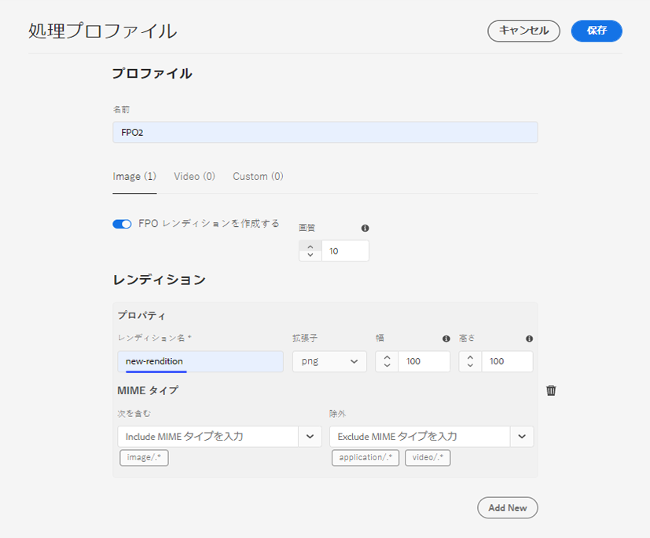
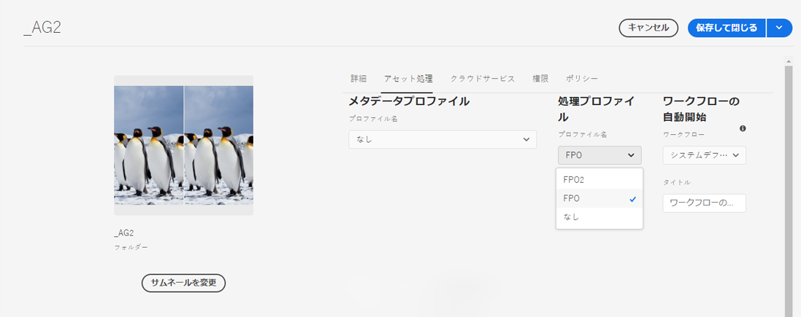
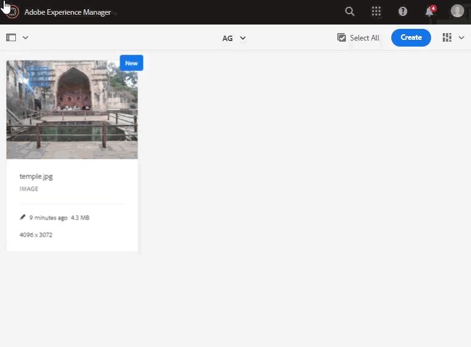
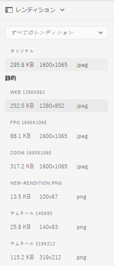

# Adobe InDesign 用のプレースメント専用レンディションの生成 {#fpo-renditions}

| バージョン | 記事リンク |
| -------- | ---------------------------- |
| AEM 6.5 | [ここをクリックしてください](https://experienceleague.adobe.com/ja/docs/experience-manager-65/content/assets/administer/configure-fpo-renditions) |
| AEM as a Cloud Service | この記事 |

Adobe Experience Manager の大きいサイズのアセットを Adobe InDesign ドキュメントに配置する場合、クリエイティブプロフェッショナルは、[アセットを配置](https://helpx.adobe.com/jp/indesign/using/placing-graphics.html)してからかなりの時間待つ必要があります。一方、ユーザーは InDesign の使用をブロックされます。これにより、クリエイティブの流れが中断され、ユーザーエクスペリエンスに悪影響が出ます。そこで、最初に小さいサイズのレンディションを InDesign ドキュメントに一時的に配置できるようになっています。印刷ワークフローや公開ワークフローなど、最終的な出力が必要な場合は、バックグラウンドの一時レンディションが元のフル解像度のアセットに置き換えられます。このバックグラウンドでの非同期更新により、設計プロセスが迅速化されて生産性が向上する一方、クリエイティブプロセスが妨げられることはありません。

Assets には、プレースメント専用（FPO）のレンディションが用意されています。これらの FPO レンディションは、ファイルサイズは小さいですが、縦横比は同じです。FPO レンディションがアセットに使用できない場合、Adobe InDesign は元のアセットを代わりに使用します。このフォールバックメカニズムにより、クリエイティブワークフローは中断することなく確実に続行されます。

Adobe Experience Manager as a Cloud Service は、FPO レンディションを生成するためのクラウドネイティブなアセット処理機能を提供します。レンディションの生成には、アセットマイクロサービスを使用します。新しくアップロードしたアセットと Experience Manager に存在するアセットのレンディション生成を設定できます。

FPO レンディションを生成する手順は次のとおりです。

1. [処理プロファイルを作成](#create-processing-profile)します。

1. このプロファイルを使用して[新しいアセットを処理](#generate-renditions-of-new-assets)するように Experience Manager を設定します。
1. プロファイルを使用して、[既存のアセットを処理](#generate-renditions-of-existing-assets)します。

## 処理プロファイルの作成 {#create-processing-profile}

FPO レンディションを生成するには、**[!UICONTROL 処理プロファイル]**&#x200B;を作成します。プロファイルでは、処理にクラウドネイティブなアセットマイクロサービスを使用します。手順については、[アセットマイクロサービスの処理プロファイルの作成](asset-microservices-configure-and-use.md)を参照してください。

「**[!UICONTROL FPO レンディションを作成する]**」を選択して、FPO レンディションを生成します。必要に応じて、「**[!UICONTROL 新規追加]**」をクリックして、同じプロファイルに別のレンディション設定を追加します。

## 新しいアセットのレンディションの生成 {#generate-renditions-of-new-assets}

新しいアセットの FPO レンディションを生成するには、フォルダープロパティのフォルダーに&#x200B;**[!UICONTROL 処理プロファイル]**&#x200B;を適用します。フォルダーのプロパティページで、「**[!UICONTROL アセット処理]**」タブをクリックし、**[!UICONTROL 処理プロファイル]**&#x200B;として「**[!UICONTROL FPO プロファイル]**」を選択して、変更内容を保存します。このフォルダーにアップロードされた新しいアセットはすべて、このプロファイルを使用して処理されます。

## 既存アセットのレンディションの生成 {#generate-renditions-of-existing-assets}

レンディションを生成するには、アセットを選択し、次の手順に従います。

## FPO レンディションの表示 {#view-fpo-renditions}

ワークフローが完了したら、生成された FPO レンディションを確認できます。Experience Manager Assets ユーザーインターフェイスで、アセットをクリックして大きいプレビューを開きます。左パネルを開き、「**[!UICONTROL レンディション]**」を選択します。または、プレビューが開いたときに、キーボードショートカット `Alt + 3` を使用します。

「**[!UICONTROL FPO レンディション]**」をクリックして、プレビューを読み込みます。オプションで、レンディションを右クリックしてファイルシステムに保存できます。左パネルで、使用可能なレンディションを確認します。

**関連情報**

* [アセットを翻訳](translate-assets.md)
* [Assets HTTP API](mac-api-assets.md)
* [AEM Assets as a Cloud Service でサポートされているファイル形式](file-format-support.md)
* [アセットを検索](search-assets.md)
* [接続されたアセット](use-assets-across-connected-assets-instances.md)
* [アセットレポート](asset-reports.md)
* [メタデータスキーマ](metadata-schemas.md)
* [アセットをダウンロード](download-assets-from-aem.md)
* [メタデータを管理](manage-metadata.md)
* [検索ファセット](search-facets.md)
* [コレクションを管理](manage-collections.md)
* [メタデータの一括読み込み](metadata-import-export.md)
* [AEM および Dynamic Media へのアセットの公開](/help/assets/publish-assets-to-aem-and-dm.md)