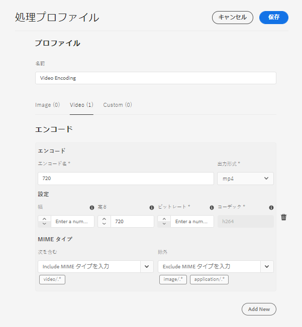

# [!DNL Experience Manager Assets] のトランスクリプションの設定 {#configure-transcription-service}

トランスクリプションとは、音声認識技術を使用して、オーディオまたはビデオファイル内の音声をテキストに変換するプロセス（音声テキスト変換）です。
[!DNL Adobe Experience Manager Assets] には、[!DNL Azure Media Services] 設定されています。このサービスは、サポートされているオーディオまたはビデオファイルに含まれている音声言語のテキストトランスクリプトを WebVTT（.vtt）形式で自動的に生成します。オーディオまたはビデオアセットが [!DNL Experience Manager Assets] で処理される際に、トランスクリプションサービスによって、オーディオまたはビデオアセットのテキストトランスクリプトレンディションが自動的に生成され、オリジナルのアセットが存在する Assets リポジトリー内の場所に保存されます。[!DNL Experience Manager Assets] トランスクリプションサービスを使用すると、マーケターは、テキストコンテンツの検索効率を高めてオーディオおよびビデオコンテンツを効果的に管理できるほか、アクセシビリティやローカライゼーションに対応することで、これらのアセットの ROI を向上できます。

トランスクリプトは、音声コンテンツのテキストバージョンです。一例として、OTT プラットフォームで視聴される映画があります。このような映画には、多くの場合、アクセシビリティや他の言語でのコンテンツ利用に役立つキャプションがあります。または、マーケティング、学習、エンターテイメントの目的で使用されるオーディオやビデオファイルもその例です。これらのエクスペリエンスは、トランスクリプションで始まり、必要に応じて書式設定や翻訳が行われます。オーディオやビデオのトランスクリプションは、手動で行うと非常に時間がかかりエラーが発生しやすいプロセスです。また、オーディオ／ビデオコンテンツのニーズが絶え間なく変化することを考えると、手動プロセスで規模を拡大することは困難でもあります。[!DNL Experience Manager Assets] では、Azure の AI ベースのトランスクリプションを使用して、オーディオアセットおよびビデオアセットを大規模に処理し、テキストトランスクリプト（.vtt ファイル）をタイムスタンプの詳細と共に生成します。トランスクリプション機能は、Assets と共に Dynamic Media でもサポートされています。

トランスクリプション機能は、[!DNL Experience Manager Assets] でコストをかけずに利用できます。ただし、管理者が [!DNL Experience Manager Assets] でトランスクリプションサービスを設定するには、ユーザーの Azure 資格情報が必要です。また、Microsoft®から[体験版資格情報を取得して](https://azure.microsoft.com/ja-jp/pricing/details/media-services/)、Assets のオーディオまたはビデオトランスクリプション機能を試すこともできます。

## トランスクリプションの前提条件 {#prerequisites}

1. 実行中の [!DNL Experience Manager Assets as a Cloud Service] インスタンス。
1. [!DNL Experience Manager Assets] での設定に 次の Azure 資格情報が必要です。

   * クライアント ID（API キー）
   * クライアント秘密鍵
   * テナントエンドポイント（ドメイン）
   * メディアアカウント
   * リソースグループ
   * サブスクリプション ID

   Azure Media Services API にアクセスするための資格情報を取得するには、[Azure のドキュメント](https://docs.microsoft.com/ja-jp/azure/media-services/latest/access-api-howto?tabs=portal)を参照してください。

1. 新しいリクエストを処理するのに十分なクレジットが Azure アカウントにあることを確認します。

## [!DNL Experience Manager Assets] のトランスクリプションの設定 {#configure-transcription}

[!DNL Experience Manager Assets] でトランスクリプション機能を有効にするために必要な設定は次のとおりです。

1. [Azure Media Services の設定](#configure-azure-media-service)
1. [オーディオ／ビデオトランスクリプションの処理プロファイルの設定](#configure-processing-profile-for-transcription)

### Azure Media Services の設定 {#configure-azure-media-services}

[!DNL Experience Manager Assets] では [!DNL Azure Media Services] を使用して、[サポートされているオーディオまたはビデオファイル](#supported-file-formats-for-transcription)に含まれている音声言語のテキストトランスクリプトを WebVTT（.vtt）形式で自動的に生成します。管理者は、Azure の資格情報を使用して [!DNL Experience Manager Assets] の [!DNL Azure Media Services] を設定できます。この設定に必要な [!DNL Azure] 資格情報の一覧を[トランスクリプションの前提条件](#transcription-prerequisites)に示してあります。[!DNL Azure] アカウントおよび資格情報がない場合は、[Azure Media Services ドキュメント](https://azure.microsoft.com/ja-jp/pricing/details/media-services/)を参照して体験版資格情報を取得します。

**[!UICONTROL ツール]**／**[!UICONTROL クラウドサービス]**／**[!UICONTROL Azure Media Services の設定]**&#x200B;に移動します。左側のパネルからフォルダー（場所）を選択し、「[!UICONTROL 作成]」ボタンをクリックして、お使いの [!DNL Azure] アカウントとの接続を設定します。このフォルダーは、[!DNL Azure] クラウド設定が Experience Manager Assets に保存される場所となります。[!DNL Azure] 資格情報を入力して、「**[!UICONTROL 保存して閉じる]**」をクリックします。

### トランスクリプションの処理プロファイルの設定 {#configure-processing-profile}

[!DNL Azure Media Services] を Experience Manager Assets に設定したら、次に、オーディオおよびビデオアセットの AI ベースのトランスクリプションを生成するためのアセット処理プロファイルを作成します。AI ベースの処理プロファイルは、[サポートされているオーディオまたはビデオアセット](#supported-file-formats-for-transcription)のトランスクリプトを Experience Manager Assets にレンディションとして生成し、オリジナルアセットが存在するフォルダーにトランスクリプト（.vtt ファイル）を保存します。したがって、ユーザーはアセットとそのトランスクリプトレンディションを簡単に探して見つけることができます。

**[!UICONTROL ツール]**／**[!UICONTROL アセット]**／**[!UICONTROL 処理プロファイル]**&#x200B;に移動し、「**[!UICONTROL 作成]**」ボタンをクリックして、オーディオとビデオのファイルのトランスクリプションを生成するための AI ベースの処理プロファイルを作成します。デフォルトでは、処理プロファイルページには 3 つのタブ（「画像」、「ビデオ」、「カスタム」）のみ表示されます。ただし、お使いの [!DNL Experience Manager Assets] インスタンスに [!DNL Azure Media Services] を設定してある場合は、「**[!UICONTROL コンテンツ AI]**」タブも表示されます。処理プロファイルの作成時に「**[!UICONTROL コンテンツ AI]**」タブが表示されない場合は、[!DNL Azure] 資格情報を確かめてください。

「**[!UICONTROL コンテンツ AI]**」タブで「**[!UICONTROL 新規追加]**」ボタンをクリックして、トランスクリプションを設定します。ここでは、ドロップダウンリストからファイルタイプを選択して、トランスクリプトを生成するためのファイル形式（MIME タイプ）を含めたり除外したりすることができます。次の図では、サポートされているオーディオおよびビデオファイルがすべて含まれ、テキストファイルは除外されています。

「**[!UICONTROL 同じディレクトリに VTT トランスクリプトを作成]**」トグルを有効にして、トランスクリプトレンディション（.vtt ファイル）がオリジナルアセットが存在するフォルダーに作成、保存されるようにします。他のレンディションも、この設定に関係なく、デフォルトの DAM アセット処理ワークフローで生成されます。

次の図は、Experience Manager Assets で作成されるカスタムビデオプロファイルの詳細を示しています。

ビデオプロファイルには、次のカスタム設定も含まれています。カスタム処理プロファイルの作成方法について詳しくは、[処理プロファイルのドキュメント](/help/assets/asset-microservices-configure-and-use.md)を参照してください。

それでは、このビデオプロファイルのトランスクリプションを設定しましょう。「**[!UICONTROL コンテンツ AI]**」タブに移動し、「**[!UICONTROL 新規追加]**」ボタンをクリックします。すべてのオーディオおよびビデオファイルを含め、画像およびアプリケーションファイルを除外します。「**[!UICONTROL 同じディレクトリに VTT トランスクリプトを作成]**」トグルを有効にして、設定を保存します。

オーディオおよびビデオファイルのトランスクリプション用に処理プロファイルを設定したら、次のいずれかの方法を使用して、この処理プロファイルをフォルダーに適用できます。

* **[!UICONTROL ツール]**／**[!UICONTROL アセット]**／**[!UICONTROL 処理プロファイル]**&#x200B;で処理プロファイルの定義を選択し、「**[!UICONTROL プロファイルをフォルダーに適用]**」アクションを使用します。コンテンツブラウザーを使用すると、特定のフォルダーに移動し、フォルダーを選択して、プロファイルの適用を確定できます。
* Assets ユーザーインターフェイスでフォルダーを選択し、「**[!UICONTROL プロパティ]**」アクションをクリックして、フォルダーのプロパティを開きます。「**[!UICONTROL アセット処理]**」タブをクリックし、そのフォルダーに適した処理プロファイルを「**[!UICONTROL 処理プロファイル]**」リストから選択します。変更を保存するには、「**[!UICONTROL 保存して閉じる]**」をクリックします。

  

* Assets ユーザーインターフェイスでフォルダーまたは特定のアセットを選択して処理プロファイルを適用したあと、上部にあるオプションから「**[!UICONTROL アセットを再処理]**」オプションを選択できます。

>[!TIP]
>1 つのフォルダーに適用できる処理プロファイルは 1 つだけです。
>
>処理プロファイルがフォルダーに適用されると、このフォルダーまたはその任意のサブフォルダー内でアップロード（または更新）された新しいアセットはすべて、設定された追加の処理プロファイルを使用して処理されます。この処理は、標準のデフォルトプロファイルによる処理に加えて行われます。

>[!NOTE]
>
>フォルダーに適用された処理プロファイルはツリー全体で機能しますが、サブフォルダーに適用された別のプロファイルでオーバーライドすることができます。
>
>アセットがフォルダーにアップロードされると、Experience Manager はそのフォルダーのプロパティと通信して、処理プロファイルを特定します。何も適用されない場合は、適用する処理プロファイルが階層内の親フォルダーで確認されます。

## オーディオまたはビデオアセットのトランスクリプションの生成 {#generate-transcription}

ビデオアセットの処理時に、[AI ベースの処理プロファイル](#configure-processing-profile-for-transcription) は、オリジナルアセットと同じフォルダーにトランスクリプト（.vtt ファイル）をレンディションとして自動的に生成します。

また、オリジナルビデオアセットのレンディションにアクセスして、トランスクリプトレンディションを確認することもできます。**[!UICONTROL レンディション]**&#x200B;パネルにアクセスするには、オリジナルビデオアセットを選択し、左側のパネルを開きます。**[!UICONTROL TRANSCRIPT.VTT]** 見出しの下にトランスクリプトレンディション（.vtt ファイル）が表示されているのがわかります。

トランスクリプト（.vtt テキストファイル）は、別のアセットレンディションとしてフォルダーから直接ダウンロードすることもできますし、オリジナルアセットの&#x200B;**[!UICONTROL レンディション]**&#x200B;パネル内からダウンロードする（アセットのすべてのレンディションをダウンロードする）こともできます。

現在、Experience Manager では、VTT ファイルの全文プレビューや編集をネイティブにはサポートしていません。ただし、トランスクリプトレンディションをダウンロードし、任意のテキストエディターを使用して、トランスクリプトを編集したり確認したりすることはできます。トランスクリプトは、ビデオ内の指定されたタイムスタンプにおける音声言語を、トランスクリプションの信頼性スコア（精度）と共にテキストとして表すものです。

## Dynamic Media でのトランスクリプションの使用 {#using-transcription-in-dynamic-media}

お使いの Experience Manager Assets インスタンスに [Dynamic Media が設定されている](/help/assets/dynamic-media/config-dm.md)場合は、アセット（オーディオまたはビデオファイル）とそのトランスクリプト（.vtt ファイル）を Dynamic Media に公開できます。その場合は、オリジナルアセット（オーディオまたはビデオファイル）とそのトランスクリプトレンディション（.vtt ファイル）が、Dynamic Media の同じフォルダー内で公開されます。Dynamic Media 管理者は、トランスクリプトレンディション（.vtt ファイル）を使用してオーディオまたはビデオファイルの [CC クローズドキャプションエクスペリエンスを有効にする](/help/assets/dynamic-media/video.md#adding-captions-to-video)ことができます。

関連トピック：

* [Dynamic Media ビデオに CC クローズドキャプションを追加する方法に関するビデオチュートリアル](https://experienceleague.adobe.com/docs/experience-manager-learn/assets/dynamic-media/dynamic-media-overview-feature-video-use.html?lang=ja#add-cc-closed-captioning-to-dynamic-media-video)
* [YouTube への Dynamic Media ビデオの公開](/help/assets/dynamic-media/video.md#publishing-videos-to-youtube)

次の図の URL は、トランスクリプト（.vtt ファイル）を参照するキャプション部分を表しています。このビデオでは、ビデオ内の指定されたタイムスタンプにおける音声言語（トランスクリプトテキスト）を&#x200B;**[!UICONTROL クローズドキャプション]**&#x200B;として表示しています。ユーザーは、「**[!UICONTROL CC]**」ボタンを使用して、キャプションを有効または無効にすることができます。

## トランスクリプションでサポートされているファイル形式 {#supported-file-format}

次のオーディオおよびビデオファイル形式がトランスクリプションでサポートされています。

| サポートされているオーディオ／ビデオ形式 | 拡張子 |
|----|----|
| FLV（H.264 および AAC コーデックを使用） | （.flv） |
| MXF | （.mxf） |
| MPEG2-PS、MPEG2-TS、3GP | （.ts、.ps、.3gp、.3gpp、.mpg） |
| Windows メディアビデオ（WMV）／ASF | （.wmv、.asf） |
| AVI（非圧縮 8 ビット／10 ビット） | （.avi） |
| MP4 | （.mp4、.m4a、.m4v） |
| Microsoft®デジタルビデオ録画（DVR-MS） | （.dvr-ms） |
| Matroska／WebM | （.mkv） |
| WAVE／WAV | （.wav） |
| QuickTime | （.mov） |

>[!NOTE]
>
>アプリケーションタイプのアセット（オーディオまたはビデオファイル）は、トランスクリプションでサポートされていません。

## 既知の制限事項 {#known-limitations}

* トランスクリプション機能は、10 分までのビデオに対応しています。
* ビデオタイトルは 80 文字以下にする必要があります。
* サポートされているファイルサイズは最大 15 GB です。
* サポートされている最大処理時間は 60 分です。
* [!DNL Azure] の有料アカウントでは、1 分あたり最大 50 本のムービーをアップロードできます。一方、体験版アカウントでは、1 分あたり最大 5 本のムービーをアップロードできます。

## トラブルシューティングのヒント {#troubleshooting}

（設定に使用した資格情報と）同じ資格情報で [!DNL Azure Media Services] アカウントにログインして、リクエストのステータスを確認します。リクエストが正常に処理されない場合は、[!DNL Azure] サポートにお問い合わせください。

**関連情報**

* [アセットを翻訳](translate-assets.md)
* [Assets HTTP API](mac-api-assets.md)
* [AEM Assets as a Cloud Service でサポートされているファイル形式](file-format-support.md)
* [アセットを検索](search-assets.md)
* [接続されたアセット](use-assets-across-connected-assets-instances.md)
* [アセットレポート](asset-reports.md)
* [メタデータスキーマ](metadata-schemas.md)
* [アセットをダウンロード](download-assets-from-aem.md)
* [メタデータを管理](manage-metadata.md)
* [検索ファセット](search-facets.md)
* [コレクションを管理](manage-collections.md)
* [メタデータの一括読み込み](metadata-import-export.md)
* [AEM および Dynamic Media へのアセットの公開](/help/assets/publish-assets-to-aem-and-dm.md)
