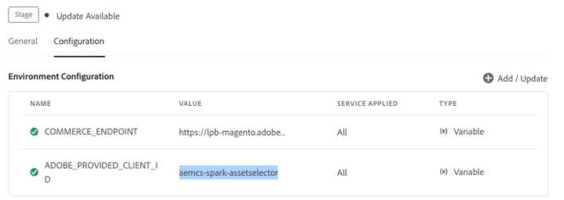

# Content Advisorのインストールとプロパティ {#content-advisor-installation-properties}

Content Advisorは、Adobe以外（サードパーティ）のアプリケーションとの統合も可能で、Adobeのアプリケーションに留まらず、インテリジェントなアセット検索を実現します。 AIを活用した検索、コンテキストに応じたレコメンデーション、キャンペーン概要ベースの検索、Dynamic Media レンディションへのアクセス、コンテンツフラグメントの検索、フィルター、アセットメタデータなど、同じ豊富な機能セットをサードパーティ統合でサポートしています。

## 前提条件{#prereqs}

次の通信方法を確保する必要があります。

* ホストアプリケーションは HTTPS で実行されている。
* アプリケーションは `localhost` で実行できない。 コンテンツアドバイザーをローカルマシンに統合する場合は、`[https://<your_campany>.localhost.com:<port_number>]`などのカスタムドメインを作成し、このカスタムドメインを`redirectUrl list`に追加する必要があります。
* それぞれの `imsClientId` を使用して、clientID を AEM Cloud Service 環境変数に設定および追加できる。
<!--
* You can configure and add `ADOBE_PROVIDED_CLIENT_ID` into the AEM Cloud Service environment variable with the respective `imsClientId`.

-->
* IMS 範囲のリストは、環境設定で定義する必要がある。
* アプリケーションの URL は、IMS クライアントのリダイレクト URL の許可リストにある。
* IMS ログインフローは、web ブラウザーのポップアップを使用して設定およびレンダリングされる。 そのため、ターゲットブラウザーでポップアップを有効または許可する必要があります。

Content AdvisorのIMS認証ワークフローが必要な場合は、上記の前提条件を使用します。 または、IMS ワークフローで既に認証されている場合は、代わりに IMS 情報を追加できます。

>[!IMPORTANT]
>
> このリポジトリは、Content Advisorを統合するための使用可能なAPIと使用例を説明する補足ドキュメントとして機能することを目的としています。 Content Advisorをインストールまたは使用する前に、Experience Manager Assets as a Cloud Service プロファイルの一部としてContent Advisorへのアクセスがプロビジョニングされていることを確認してください。 プロビジョニングされていない場合、これらのコンポーネントを統合または使用することはできません。 プロビジョニングをリクエストするには、プログラム管理者が Admin Console から P2 としてマークされたサポートチケットを発行し、次の情報を含める必要があります。
>
>* 統合アプリケーションがホストされるドメイン名。
>* プロビジョニング後、組織には、Content Advisorの設定に不可欠な環境に対応する`imsClientId`、`imsScope`および`redirectUrl`が提供されます。 これらの有効なプロパティがないと、インストール手順を実行できません。

## インストール {#content-advisor-installation}

Content Advisorは、ESM CDN （例：[esm.sh](https://esm.sh/)/[skypack](https://www.skypack.dev/)）と[UMD](https://github.com/umdjs/umd) バージョンの両方で利用できます。

**UMD バージョン**&#x200B;を使用しているブラウザー（推奨）：

```
<script src="https://experience.adobe.com/solutions/CQ-assets-selectors/static-assets/resources/assets-selectors.js"></script>

<script>
  const { renderAssetSelector } = PureJSSelectors;
</script>
```

**ESM CDN バージョン**&#x200B;を使用している `import maps` 対応ブラウザー：

```
<script type="module">
  import { AssetSelector } from 'https://experience.adobe.com/solutions/CQ-assets-selectors/static-assets/resources/@assets/selectors/index.js'
</script>
```

**ESM CDN バージョン**&#x200B;を使用している Deno/Webpack Module Federation：

```
import { AssetSelector } from 'https://experience.adobe.com/solutions/CQ-assets-selectors/static-assets/resources/@assets/selectors/index.js'
```

## Content Advisor プロパティ {#content-advisor-propertiess}

コンテンツアドバイザーのプロパティを使用して、コンテンツアドバイザーのレンダリング方法をカスタマイズできます。 次の表に、Content Advisorのカスタマイズと使用に使用できるプロパティを示します。

| Property | 種類 | 必須 | デフォルト | 説明 |
|---|---|---|---|---|
| *rail* | ブーリアン | いいえ | False | `true`とマークされている場合、Content Advisorは左側のパネル表示でレンダリングされます。 `false`とマークされている場合、コンテンツアドバイザーはモーダルビューでレンダリングされます。 |
| *imsOrg* | 文字列 | はい | | [!DNL Adobe Experience Manager] as a [!DNL Cloud Service] を組織にプロビジョニングする場合に割り当てられる Adobe Identity Management System（IMS）の ID です。 `imsOrg` キーは、アクセスしようとしている組織が Adobe IMS 内にあるかどうかを認証するために必要です。 |
| *imsToken* | 文字列 | いいえ | | 認証に使用される IMS ベアラートークンです。 統合に [!DNL Adobe] アプリケーションを使用している場合、`imsToken` は必須です。 |
| *apiKey* | 文字列 | いいえ | | AEM Discovery サービスへのアクセスに使用する API キーです。 [!DNL Adobe] アプリケーション統合を使用している場合、`apiKey` は必須です。 |
| *externalBrief* | 文字列 | いいえ | | 検索キーワードを手動で入力することなく、キャンペーン概要ドキュメントをアップロードして関連アセットを見つけることができます。 Content Advisorは、施策概要の情報を分析し、施策の意図を把握して、AEM Assetsで利用可能な関連アセットを提案します。 |
| *filterSchema* | 配列 | いいえ | | フィルタープロパティの設定に使用するモデルです。 これは、Content Advisorの特定のフィルターオプションを制限する場合に便利です。 |
| *filterFormProps* | オブジェクト | いいえ | | 検索を絞り込むために使用する必要があるフィルタープロパティを指定します。 （ 例：MIME タイプの JPG、PNG、GIF） |
| *selectedAssets* | 配列 `<Object>` | いいえ |                 | Content Advisorのレンダリング時に、選択したAssetsを指定します。 アセットの ID プロパティを含むオブジェクトの配列が必要です。 （例：`[{id: 'urn:234}, {id: 'urn:555'}]`）アセットは、現在のディレクトリで使用できる必要があります。 別のディレクトリを使用する必要がある場合は、`path` プロパティの値も指定します。 |
| *acvConfig* | オブジェクト | いいえ | | デフォルトを上書きするカスタム設定が含まれているオブジェクトを含む、アセットコレクション表示プロパティです。 また、このプロパティは、アセットビューアのパネルビューを有効にするために `rail` プロパティと共にに使用されます。 |
| *i18nSymbols* | `Object<{ id?: string, defaultMessage?: string, description?: string}>` | いいえ |                 | OOTB 翻訳がアプリケーションのニーズを満たさない場合は、独自のローカライズされたカスタム値を `i18nSymbols` プロップ経由で渡すことができるインターフェイスを表示できます。 このインターフェイスを介して値を渡すと、提供されたデフォルトの翻訳が上書きされ、代わりに独自の翻訳が使用されます。 上書きを実行するには、上書きしたい `i18nSymbols` のキーに有効な[メッセージ記述子](https://formatjs.io/docs/react-intl/api/#message-descriptor)オブジェクトを渡す必要があります。 |
| *intl* | オブジェクト | いいえ | | Content AdvisorはデフォルトのOOTB翻訳を提供します。 `intl.locale` プロップを介して有効なロケール文字列を指定することで、翻訳言語を選択できます。 例：`intl={{ locale: "es-es" }}` </br></br> サポートされているロケール文字列は、言語標準の名前を表す[ISO 639 - コード ](https://www.iso.org/iso-639-language-codes.html)に従っています。</br></br> サポートされているロケールのリスト：英語 – &#39;en-us&#39; （デフォルト） スペイン語 – &#39;es-es&#39; ドイツ語 – &#39;de&#39;フランス語 – &#39;fr-fr&#39; イタリア語 – &#39;it-it&#39;日本語 – &#39;ja-jp&#39;韓国語 – &#39;ko-kr&#39; ポルトガル語 – &#39;pt-br&#39;中国語（繁体字） - &#39;zh-cn&#39;中国語（台湾） - &#39;zh-tw&#39; |
| *repositoryId* | 文字列 | いいえ | &#39;&#39; | コンテンツアドバイザーがコンテンツを読み込むリポジトリ。 |
| *additionalAemSolutions* | `Array<string>` | いいえ | [ ] | 追加の AEM リポジトリのリストを追加できます。 このプロパティで情報が指定されない場合、メディアライブラリまたは AEM Assets リポジトリのみが考慮されます。 |
| *hideTreeNav* | ブーリアン | いいえ |  | アセットツリーのナビゲーションサイドバーを表示するか非表示にするかを指定します。 このプロパティはモーダルビューでのみ使用されるので、パネルビューではこのプロパティの影響はありません。 |
| *onDrop* | 関数 | いいえ | | オンドロップ機能は、アセットをドラッグして指定されたドロップ領域にリリースするために使用されます。 アセットをシームレスに移動および処理できる、インタラクティブなユーザーインターフェイスを提供します。 |
| *dropOptions* | `{allowList?: Object}` | いいえ | | 「allowList」を使用してドロップオプションを設定します。 |
| *テーマ* | 文字列 | いいえ | デフォルト | `default`から`express`の間でContent Advisor アプリケーションにテーマを適用します。 また、`@react-spectrum/theme-express` もサポートしています。 |
| *handleSelection* | 関数 | いいえ | | アセットが選択され、モーダルの `Select` ボタンがクリックされた場合に、アセットの項目の配列と一緒に呼び出されます。 この関数は、モーダルビューでのみ呼び出されます。 パネルビューの場合は、`handleAssetSelection` 関数または `onDrop` 関数を使用します。 例： <pre>handleSelection=(assets: Asset[])=> {...}</pre> 詳しくは、[アセットの選択](/help/assets/content-advisor-customization.md#selection-of-assets)を参照してください。 |
| *handleAssetSelection* | 関数 | いいえ | | アセットが選択または選択解除されたときに、項目の配列と一緒に呼び出されます。 これは、ユーザーがアセットの選択時にアセットをリッスンする場合に役立ちます。 例： <pre>handleAssetSelection=（assets: Asset[]）=> {...}</pre> 詳しくは、[アセットの選択](/help/assets/content-advisor-customization.md#selection-of-assets)を参照してください。 |
| *onClose* | 関数 | いいえ | | モーダルビューで `Close` ボタンが押された際に呼び出されます。 これは、`modal` ビューでのみ呼び出され、`rail` ビューでは無視されます。 |
| *onFilterSubmit* | 関数 | いいえ | | ユーザーが別のフィルター条件を変更したときに、フィルター項目と一緒に呼び出されます。 |
| *selectionType* | 文字列 | いいえ | シングル | 一度にアセットを `single` 選択または `multiple` 選択するための設定です。 |
| *dragOptions.allowList* | ブーリアン | 不要 | | プロパティは、選択できないアセットのドラッグを許可または拒否するために使用されます。 詳しくは、[dragOptions プロパティ](/help/assets/content-advisor-customization.md#drag-options-property)を参照してください。 |
| *aemTierType* | 文字列 | いいえ |  | 配信層、作成者層、またはその両方のアセットを表示するかどうかを選択できます。<br><br> 構文：`aemTierType: "author"  "delivery"` <br><br>例えば、両方の`["author","delivery"]`が使用されている場合、リポジトリスイッチャーにはオーサーと配信の両方のオプションが表示されます。 |
| *handleNavigateToAsset* | 関数 | いいえ | | アセットの選択を処理するコールバック関数です。 |
| *noWrap* | ブーリアン | いいえ | | *noWrap* プロパティは、コンテンツ アドバイザーがダイアログにラップされるのを防ぎます。 このプロパティを指定しない場合、デフォルトで&#x200B;*ダイアログビュー*&#x200B;がレンダリングされます。 |
| *dialogSize* | S、M、L、フルスクリーン、フルスクリーンテイクオーバー | String | オプション | 指定されたオプションを使用してサイズを指定することで、レイアウトを制御できます。 |
| *colorScheme* | 文字列（ライト、ダーク） | いいえ | | このプロパティは、Content Advisor アプリケーションのテーマを設定するために使用されます。 テーマは、ライトテーマとダークテーマから選択できます。 |
| *filterRepoList* | 関数 | いいえ | | リポジトリリストを受け取り、フィルタリングされたリストを返す関数。 |
| *expiryOptions* | 関数 | | | 次の 2 つのプロパティ間で使用できます。**getExpiryStatus** では、有効期限切れのアセットのステータスが表示されます。 関数は、指定したアセットの有効期限に基づいて、`EXPIRED`、`EXPIRING_SOON` または `NOT_EXPIRED` を返します。 [有効期限切れのアセットのカスタマイズ](/help/assets/content-advisor-customization.md#customize-expired-assets)を参照してください。 さらに、**allowSelectionAndDrag** を使用できます。この場合、関数の値は `true` または `false` のいずれかになります。 値が `false` に設定されている場合、有効期限切れのアセットはキャンバス上で選択またはドラッグできません。 |
| *showToast* | | いいえ | | これにより、Content Advisorは、期限切れのアセットに対してカスタマイズされたトーストメッセージを表示できます。 |
| *uploadConfig* | オブジェクト | | | これは、アップロード用にカスタマイズされた設定を含むオブジェクトです。 ユーザビリティについては、[設定のアップロード](#content-advisor-customization.md#upload-config)を参照してください。 |
| *uploadConfig* > *metadataSchema* | 配列 | いいえ | | このプロパティは、`uploadConfig`プロパティの下にネストされています。 ユーザーからメタデータを収集するのに指定するフィールドの配列を追加します。 このプロパティを使用すると、アセットに自動的に割り当てられるが、ユーザーには表示されない非表示のメタデータも使用できます。 |
| *uploadConfig* > *onMetadataFormChange* | コールバック関数 | いいえ | | このプロパティは、`uploadConfig`プロパティの下にネストされています。 これは、`property` と `value` から構成されます。 `Property` は、値を更新する *metadataSchema* から渡されたフィールドの *mapToProperty* と等しくなります。 一方、`value` は、入力として指定する新しい値と等しくなります。 |
| *uploadConfig* > *targetUploadPath* | 文字列 |  | `"/content/dam"` | このプロパティは、`uploadConfig`プロパティの下にネストされています。 ファイルのターゲットアップロードパスで、デフォルトは、アセットリポジトリのルートです。 |
| *uploadConfig* > *hideUploadButton* | ブーリアン | | False | これは、内部アップロードボタンを非表示にするかどうかを確認します。 このプロパティは、`uploadConfig`プロパティに関連付けられています。 |
| *uploadConfig* > *onUploadStart* | 関数 | いいえ |  | これは、Dropbox、OneDrive、ローカル間でアップロードソースを渡すのに使用されるコールバック関数です。 構文は `(uploadInfo: UploadInfo) => void` です。 このプロパティは、`uploadConfig` プロパティの下にネストされています。 |
| *uploadConfig* > *importSettings* | 関数 | | | これにより、サードパーティソースからのアセットの読み込みのサポートが有効になります。 `sourceTypes` は、有効にする読み込みソースの配列を使用します。 サポートされているソースは、Onedrive と Dropbox です。 構文は `{ sourceTypes?: ImportSourceType[]; apiKey?: string; }` です。 さらに、このプロパティは、`uploadConfig` プロパティの下にネストされています。 |
| *uploadConfig* > *onUploadComplete* | 関数 | いいえ | | これは、成功、失敗、重複の中からファイルアップロードステータスを渡すのに使用されるコールバック関数です。 構文は `(uploadStats: UploadStats) => void` です。 さらに、このプロパティは、`uploadConfig` プロパティの下にネストされています。 |
| *uploadConfig* > *onFilesChange* | 関数 | いいえ | | このプロパティは、`uploadConfig`プロパティの下にネストされています。 これは、ファイルを変更した際のアップロードの動作を示すのに使用されるコールバック関数です。 アップロード保留中のファイルの新しい配列とアップロードのソースタイプを渡します。 エラーの場合、ソースタイプは null になることがあります。 構文は `(newFiles: File[], uploadType: UploadType) => void` です。 |
| *uploadConfig* > *ploadingPlaceholder* | 文字列 | | | これは、アセットのアップロードを開始した際にメタデータフォームを置き換えるプレースホルダー画像です。 構文は `{ href: string; alt: string; }` です。さらに、このプロパティは、`uploadConfig` プロパティの下にネストされています。 |
| *featureSet* | 配列 | 文字列 | | `featureSet:[ ]` プロパティは、Content Advisor アプリケーションで特定の機能を有効または無効にするために使用されます。 コンポーネントまたは機能を有効にするには、配列内に文字列値を渡すか、配列を空のままにして追加された機能を無効にし、ベース機能だけを使用します。 例えば、コンテンツアドバイザーでアップロード機能を有効にする場合は、構文`featureSet:["upload"]`を使用します。 同様に、`featureSet:["content-fragments"]`を使用して、コンテンツアドバイザーでコンテンツフラグメントを有効にできます。 複数の機能を一緒に使用するには、構文はfeatureSet:[&quot;upload&quot;、&quot;content-fragments&quot;]です。 |

<!--
| *selectedRendition* | Object | | | This property allows users to define and control which renditions of an asset are displayed when the panel is accessed. This customization enhances user experience by filtering out unnecessary renditions and showcasing only the most relevant renditions. For example, `CopyUrlHref` allows you to use Dynamic Media renditions in your Asset Selector application (delivery URL). |
| *featureSet* | Array | String | | The `featureSet:[ ]` property is used to enable or disable a particular functionaly in the Asset Selector application. To enable the component or a feature, you can pass a string value in the array or leave the array empty to disable that component. For example, you want to enable upload functionality in the Asset Selector, use the syntax `featureSet:[0:"upload"]`. Similarly, you can use `featureSet:[0:"collections"]` to enable collections in the Asset Selector. Addidionally, use `featureSet:[0:"detail-panel"]` to enable [details panel](overview-asset-selector.md#asset-details-and-metadata) of an asset. Also, `featureSet:[0:"dm-renditions"]` to show Dynamic Media renditions of an asset.|
| *rootPath* | String | No | /content/dam/ | Folder path from which Asset Selector displays your assets. `rootPath` can also be used in the form of encapsulation. For example, given the following path, `/content/dam/marketing/subfolder/`, Asset Selector does not allow you to traverse through any parent folder, but only displays the children folders. |
| *path* | String | No | | Path that is used to navigate to a specific directory of assets when the Asset Selector is rendered. |
| *expirationDate* | Function | No | | This function is used to set the usability period of an asset. |
| *disableDefaultBehaviour* | Boolean | No | False | It is a function that is used to enable or disable the selection of an expired asset. You can customize the default behavior of an asset that is set to expire. See [customize expired assets](/help/assets/asset-selector-customization.md#customize-expired-assets). |
-->

### ImsAuthProps {#ims-auth-props}

`ImsAuthProps` プロパティは、Content Advisorが`imsToken`を取得するために使用する認証情報とフローを定義します。 これらのプロパティを設定すると、認証フローの動作を制御し、様々な認証イベントのリスナーを登録できます。

| プロパティ名 | 説明 |
|---|---|
| `imsClientId` | 認証目的で使用される IMS クライアント ID を表す文字列値。 この値はアドビが指定し、アドビの AEM CS 組織に固有です。 |
| `imsScope` | 認証で使用されるスコープについて説明します。 スコープは、組織のリソースに対するアプリケーションのアクセスレベルを決定します。 複数のスコープは、コンマで区切ることができます。 |
| `redirectUrl` | 認証後にユーザーがリダイレクトされる URL を表します。 この値は通常、アプリケーションの現在の URL に設定されます。 `redirectUrl` を指定していない場合、`ImsAuthService` は `imsClientId` の登録に使用した redirectUrl を使用します。 |
| `modalMode` | 認証フローをモーダル（ポップアップ）に表示するかどうかを示すブール値。 `true` に設定すると、認証フローがポップアップで表示されます。 `false` に設定すると、認証フローはページ全体をリロードして表示されます。 メモ：:_UX を向上させるには、ユーザーがブラウザーのポップアップを無効にしていると、この値を動的に制御できます。 |
| `onImsServiceInitialized` | Adobe IMS 認証サービスを初期化する際に呼び出されるコールバック関数。 この関数は、Adobe IMS サービスを表すオブジェクトである `service` という 1 つのパラメーターを受け取ります。 詳しくは、[`ImsAuthService`](#imsauthservice-ims-auth-service) を参照してください。 |
| `onAccessTokenReceived` | Adobe IMS 認証サービスから `imsToken` を受信する際に呼び出されるコールバック関数。 この関数は、アクセストークンを表す文字列である `imsToken` という 1 つのパラメーターを受け取ります。 |
| `onAccessTokenExpired` | アクセストークンの有効期限が切れる際に呼び出されるコールバック関数。 この関数は通常、新しい認証フローをトリガーして新しいアクセストークンを取得するために使用されます。 |
| `onErrorReceived` | 認証中にエラーが発生する際に呼び出されるコールバック関数。 この関数は、エラータイプとエラーメッセージという 2 つのパラメーターを受け取ります。 エラータイプはエラータイプを表す文字列で、エラーメッセージはエラーメッセージを表す文字列です。 |

### ImsAuthService {#ims-auth-service}

`ImsAuthService` クラスは、Content Advisorの認証フローを処理します。 これは、Adobe IMS 認証サービスから `imsToken` を取得する役割を果たします。 `imsToken` は、ユーザーを認証し、[!DNL Adobe Experience Manager] as a [!DNL Cloud Service] アセットリポジトリへのアクセスを認証するために使用されます。 ImsAuthService は、`ImsAuthProps` プロパティを使用して認証フローを制御し、様々な認証イベントのリスナーを登録します。 便利な[`registerAssetsSelectorsAuthService`](#purejsselectorsregisterassetsselectorsauthservice)関数を使用して、_ImsAuthService_ インスタンスをContent Advisorに登録できます。 `ImsAuthService` クラスでは、次の関数を使用できます。 ただし、_registerAssetsSelectorsAuthService_ 関数を使用している場合は、これらの関数を直接呼び出す必要はありません。

| 関数名 | 説明 |
|---|---|
| `isSignedInUser` | ユーザーが現在サービスにログインしているかどうかを判断し、それに応じてブール値を返します。 |
| `getImsToken` | 現在ログインしているユーザーの認証 `imsToken` を取得します。これは、asset _rendition の生成など、他のサービスへのリクエストを認証するために使用できます。 |
| `signIn` | ユーザーのログインプロセスを開始します。 この関数は、`ImsAuthProps` を使用して、ポップアップまたはページ全体のリロードで認証を表示します。 |
| `signOut` | ユーザーをサービスからログアウトし、認証トークンを無効にし、保護されたリソースにアクセスするには再度ログインするようにリクエストします。 この関数を呼び出すと、現在のページがリロードされます。 |
| `refreshToken` | 現在ログインしているユーザーの認証トークンを更新して、トークンの有効期限切れを防ぎ、保護されたリソースに中断なくアクセスできるようになります。 後続のリクエストに使用できる新しい認証トークンを返します。 |

### contentFragmentSelectorProps {#content-fragment-selector-properties}

`contentFragmentSelectorProps`を使用すると、コンテンツアドバイザー内でコンテンツフラグメントにアクセスして表示する方法を設定できます。 `featureSet`でコンテンツフラグメント機能を有効にし、必要な設定を指定すると、コンテンツフラグメントの選択をアセットとシームレスに統合できます。 これにより、ユーザーは同じ統合インターフェイス内でコンテンツフラグメントを参照、検索、選択できるようになり、アセットや構造化されたコンテンツをまたいで、一貫性のあるコンテンツ選択エクスペリエンスを実現できます。

```
const assetSelectorProps = {
     featureSet: [
       'upload',            /* Include upload or other featureSet values to ensure no missing functionality */
       'content-fragments', /* Content Fragments pill will be shown */
     ],
     contentFragmentSelectorProps: {
       /* Configures the Content Fragments Pill experience */
       /* ...props @aem-sites/content-fragment-selector MFE supports */
    }
}

<AssetSelector {...assetSelectorProps} />
```

`contentFragmentSelectorProps`では、[ コンテンツフラグメントセレクターのプロパティ ](/help/headless/content-fragment-selector/properties.md)で利用可能なプロパティのいずれかをメンションできます。

Content AdvisorをAngular、React、およびJavaScript アプリケーションと統合する方法については、[Content Advisorの統合例](https://github.com/adobe/aem-assets-selectors-mfe-examples/tree/consolidate-docs-to-experience-league/examples)を参照してください。


**関連情報**

* [アセットを翻訳](/help/assets/translate-assets.md)
* [Assets HTTP API](/help/assets/mac-api-assets.md)
* [AEM Assets as a Cloud Service でサポートされているファイル形式](/help/assets/file-format-support.md)
* [アセットを検索](/help/assets/search-assets.md)
* [接続されたアセット](/help/assets/use-assets-across-connected-assets-instances.md)
* [アセットレポート](/help/assets/asset-reports.md)
* [メタデータスキーマ](/help/assets/metadata-schemas.md)
* [アセットをダウンロード](/help/assets/download-assets-from-aem.md)
* [メタデータを管理](/help/assets/manage-metadata.md)
* [Dynamic Media テンプレートの管理](/help/assets/dynamic-media/manage-dynamic-media-templates.md)
* [レポートの管理](/help/assets/manage-reports-assets-view.md)
* [検索ファセット](/help/assets/search-facets.md)
* [コレクションを管理](/help/assets/manage-collections.md)
* [メタデータの一括読み込み](/help/assets/metadata-import-export.md)
* [AEM および Dynamic Media へのアセットの公開](/help/assets/publish-assets-to-aem-and-dm.md)

