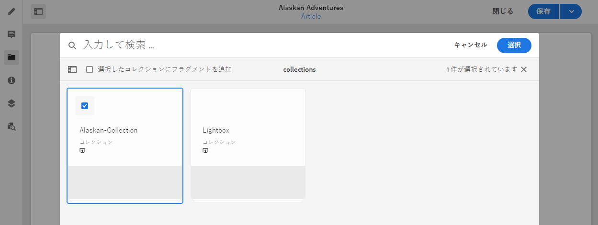

# 関連コンテンツ{#associated-content}

Adobe Experience Manager(AEM) のコンテンツフラグメントas a Cloud Serviceの場合、関連するコンテンツ機能（元のエディターで使用可能）が接続を提供し、アセットをフラグメントと共に使用する場合もあります。 これにより、次のような柔軟性が得られます。 [コンテンツフラグメントを使用する際にアクセスできる様々なアセットの提供](/help/assets/content-fragments/content-fragments.md#using-associated-content)を使用すると、適切なアセットの検索に必要な時間を短縮できます。 この機能は、ヘッドレスコンテンツ配信とページオーサリングの両方に使用できます。

>[!NOTE]
>
>コンテンツフラグメントは Sites 機能ですが、 **Assets**.
>
>コンテンツフラグメントをオーサリングするためのエディターは 2 つあります。この節では、主に **Assets** コンソール。

## 関連コンテンツの追加 {#adding-associated-content}

>[!NOTE]
>
>[ビジュアルアセット（画像など）](/help/assets/content-fragments/content-fragments.md#fragments-with-visual-assets)をフラグメントやページに追加するための様々な方法があります。

関連付けを作成するには、最初に[メディアアセットをコレクションに追加](/help/assets/manage-collections.md)する必要があります。それが完了した後で以下を実行できます。

1. フラグメントを開き、サイドパネルから「**関連コンテンツ**」を選択します。

   

1. コレクションが既に関連付けられているかどうかに応じて、次のいずれかを選択します。

   * **コンテンツを関連付け** - これが最初に関連付けられるコレクションになります
   * **コレクションを関連付け** - 関連付けられたコレクションが既に設定されています

1. 必要なコレクションを選択します。

   選択したコレクションにフラグメント自体をオプションで追加できます。これにより追跡が可能になります。

   

1. 確定します（「**選択**」を使用）。コレクションが関連付けられて表示されます。

   

## 関連コンテンツの編集 {#editing-associated-content}

コレクションを関連付けると、次の操作を実行できます。

* 関連付けの&#x200B;**削除**
* コレクションへの&#x200B;**アセットの追加**
* 追加のアクションを実行するアセットの選択
* アセットの編集
