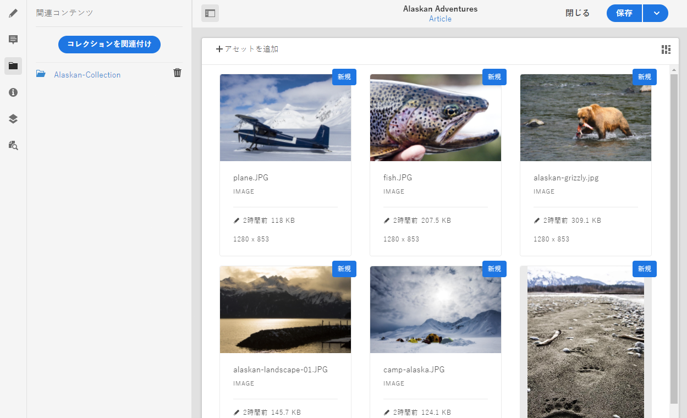

# 関連コンテンツ{#associated-content}

Adobe Experience Manager（AEM）as a Cloud Service のコンテンツフラグメントの関連コンテンツ機能（元のエディターで使用可能）では、オプションとしてアセットをフラグメントと共に使用できるよう、接続を提供します。これにより、[コンテンツフラグメントを使用する際に広範なアセットにアクセスでき](/help/assets/content-fragments/content-fragments.md#using-associated-content)、同時に適切なアセットの検索に必要な時間も短縮されて柔軟性がもたらされます。この機能は、ヘッドレスコンテンツ配信とページオーサリングの両方に使用できます。

>[!NOTE]
>
>コンテンツフラグメントは Sites 機能ですが、**Assets** として保存されます。
>
>コンテンツフラグメントのオーサリングには 2 つのエディターがあります。基本機能は同じですが、いくつかの違いがあります。 この節では、主に **Assets** コンソールから主にアクセスされるエディターについて説明します。

## 関連コンテンツの追加 {#adding-associated-content}

>[!NOTE]
>
>[ビジュアルアセット（画像など）](/help/assets/content-fragments/content-fragments.md#fragments-with-visual-assets)をフラグメントやページに追加するための様々な方法があります。

関連付けを行うには、最初に[メディアアセットをコレクションに追加する](/help/assets/manage-collections.md)必要があります。それが完了した後で以下を実行できます。

1. フラグメントを開き、サイドパネルから「**関連コンテンツ**」を選択します。

   

1. コレクションが既に関連付けられているかどうかに応じて、次のいずれかを選択します。

   * **コンテンツを関連付け** - これが最初に関連付けられるコレクションになります
   * **コレクションを関連付け** - 関連付けられたコレクションが既に設定されています

1. 必要なコレクションを選択します。

   選択したコレクションにフラグメント自体をオプションで追加できます。これにより追跡が可能になります。

   

1. 確定します（「**選択**」を使用）。コレクションが関連付けられて表示されます。

   

## 関連コンテンツの編集 {#editing-associated-content}

コレクションを関連付けると、次の操作を実行できます。

* 関連付けの&#x200B;**削除**
* コレクションへの&#x200B;**アセットの追加**
* 追加のアクションを実行するアセットの選択
* アセットの編集
