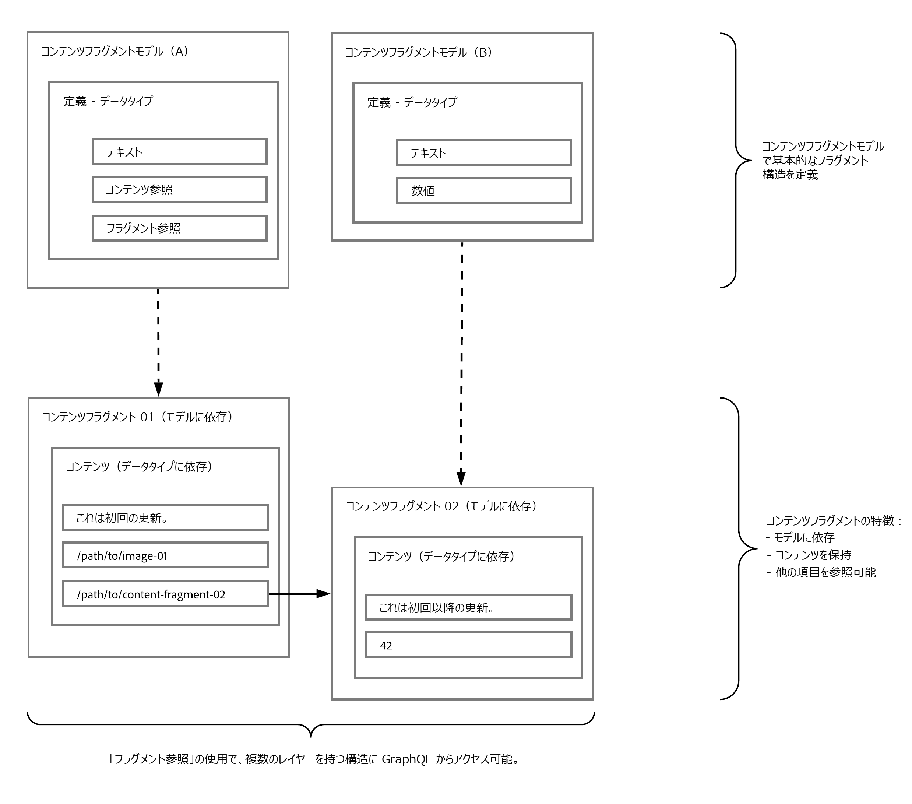

# GraphQLでコンテンツフラグメントを使用したヘッドレスコンテンツ配信{#headless-content-delivery-using-content-fragments-with-graphQL}

>[!CAUTION]
>
>AEM GraphQL API(コンテンツフラグメント配信用)は、2021年の初めにリリースされます。
>
>関連ドキュメントは、既にプレビュー目的でご利用いただけます。

Adobe Experience Manager(AEM)をCloud Serviceとして使用すると、AEM GraphQL API（標準GraphQLに基づくカスタマイズされた実装）と共にコンテンツフラグメントを使用して、アプリケーションで使用する構造化されたコンテンツを配信できます。

## ヘッドレスCMS {#headless-cms}

ヘッドレスコンテンツ管理システム(CMS)は次のとおりです。

* &quot;*ヘッドレスコンテンツ管理システム（ヘッドレスCMS）は、バックエンド専用のコンテンツ管理システム(CMS)で、API経由でコンテンツにアクセスし、任意のデバイスに表示できます。*

   *「ヘッドレス」という用語は、「ボディ」（コンテンツリポジトリなどのバックエンド）から「ヘッド」（Webサイトの前端）を切り刻むという概念から来ています。*&quot;

   [Wikipedia](https://en.wikipedia.org/wiki/Headless_content_management_system)を参照してください。

AEMのコンテンツフラグメントのオーサリングに関しては、次のことを意味します。

* コンテンツフラグメントを使用すると、主に形式設定されたページに直接公開することを目的としていない(1:1)コンテンツを作成できます。

* コンテンツフラグメントのコンテンツは、コンテンツフラグメントモデルに従って、あらかじめ決められた方法で構造化されます。 これにより、アプリケーションへのアクセスが簡素化され、コンテンツの処理がさらに進みます。

>[!NOTE]
>
>Cloud ServiceとしてのAEM Sites向けヘッドレス開発の紹介は、[ヘッドレスとAEM](/help/implementing/developing/headless/introduction.md)を参照。

## GraphQL — 概要{#graphql-overview}

GraphQLは次のようになります。

* &quot;*...APIのクエリ言語と、既存のデータを使用してこれらのクエリを満たすランタイムです。 GraphQLは、APIのデータの完全で理解可能な説明を提供し、クライアントに何が必要で何も必要でないかを正確に尋ねる力を与え、APIの時間の経過と共に発展させ、強力な開発ツールを有効にします。*&quot;

   [GraphQL.org](https://graphql.org)を参照

* &quot;*...柔軟なAPIレイヤー用にオープンな仕様。 GraphQLを既存のバックエンドに重ね合わせて、以前に比べて迅速に製品を構築….*&quot;.

   「[GraphQLの探索](https://www.graphql.com)」を参照してください。 「*GraphQLの探索はアポロチームが管理している。 私たちの目標は、GraphQL.*&#x200B;を理解し、導入するために必要なツールを世界中の開発者や技術リーダーに全て提供することです。

[AEM GraphQL API](#aem-graphql-api)を使用すると、[コンテンツフラグメント](/help/assets/content-fragments/content-fragments.md)で（複雑な）クエリを実行できます。の各クエリは、特定のモデルタイプに従っています。 返されたコンテンツは、アプリケーションで使用できます。

### GraphQLの用語{#graphql-terminology}

GraphQLでは次を使用します。

* **[クエリ](https://graphql.org/learn/queries/)**

* **[スキーマとタイプ](https://graphql.org/learn/schema/)**  — これらを使用して、GraphQLはAEMでGraphQLを実装する際に許可されるタイプと操作を示します。

* **[フィールド](https://graphql.org/learn/queries/#fields)**

* **GraphQL Endpoint**  - GraphQLスキーマに応答し、GraphQLクエリへのアクセスを提供するAEM内のパス。

[ベストプラクティス](https://graphql.org/learn/best-practices/)を含む包括的な詳細については、[(GraphQL.org)「GraphQL](https://graphql.org/learn/)の概要」を参照してください。

### GraphQLクエリタイプ{#graphql-query-types}

GraphQLでは、次のいずれかに対してクエリを実行できます。

* **単一エントリ**

* **[エントリのリスト](https://graphql.org/learn/schema/#lists-and-non-null)**

## AEM GraphQL API {#aem-graphql-api}

クラウドエクスペリエンスとしてのアドビエクスペリエンスには、標準のGraphQL API[のカスタマイズ実装が実装されています。](/help/assets/content-fragments/graphql-api-content-fragments.md)

AEM GraphQL APIの実装は、[GraphQL Javaライブラリ](https://graphql.org/code/#java)に基づいています。

## AEM GraphQL API {#content-fragments-use-with-aem-graphql-api}で使用するコンテンツフラグメント

[コンテンツ](#content-fragments) フラグメントは、AEMクエリのGraphQLの基盤として次のように使用できます。

* ページに依存しないコンテンツをデザイン、作成、キュレーションおよび公開できます。
* [コンテンツフラグメントモデル](#content-fragments-models)は、定義されたデータ型を使用して、必要な構造を提供します。
* モデルの定義時に使用できる[フラグメント参照](#fragment-references)を使用して、構造の追加のレイヤーを定義できます。

### コンテンツフラグメント {#content-fragments}

コンテンツフラグメント:

* 構造化コンテンツを含みます。

* これらは、[コンテンツフラグメントモデル](#content-fragments-models)に基づいており、結果のフラグメントの構造を事前に定義します。

### コンテンツフラグメントモデル {#content-fragments-models}

次の[コンテンツフラグメントモデル](/help/assets/content-fragments/content-fragments-models.md):

* GraphQLに必要なデータタイプとフィールドを指定します。 アプリケーションが可能なもののみを要求し、期待されるものを受け取るようにします。

* データ型&#x200B;**[フラグメント参照](#fragment-references)**&#x200B;は、別のコンテンツフラグメントを参照するためにモデル内で使用できるので、構造のレベルを追加します。

### フラグメント参照{#fragment-references}

**[フラグメント参照](/help/assets/content-fragments/content-fragments-models.md#fragment-reference-nested-fragments)**:

* は、GraphQLとの関連で特に興味を持ちます。

* は、コンテンツフラグメントモデルの定義時に使用できる特定のデータ型です。

* 特定のコンテンツフラグメントモデルに依存する別のフラグメントを参照します。

* 構造化データを取得できます。

   * **マルチフィード**&#x200B;として定義した場合、複数のサブフラグメントをプライムフラグメントで参照（取得）できます。

### JSONプレビュー{#json-preview}

コンテンツフラグメントモデルの設計と開発に役立つように、[JSON出力](/help/assets/content-fragments/content-fragments-json-preview.md)をプレビューできます。

## AEMでのGraphQLの使用方法 — サンプルコンテンツとクエリ{#learn-graphql-with-aem-sample-content-queries}

AEM GraphQL APIの使い方の紹介は、[AEMでのGraphQLの使い方の学習 — サンプルコンテンツとクエリ](/help/assets/content-fragments/content-fragments-graphql-samples.md)を参照してください。