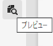
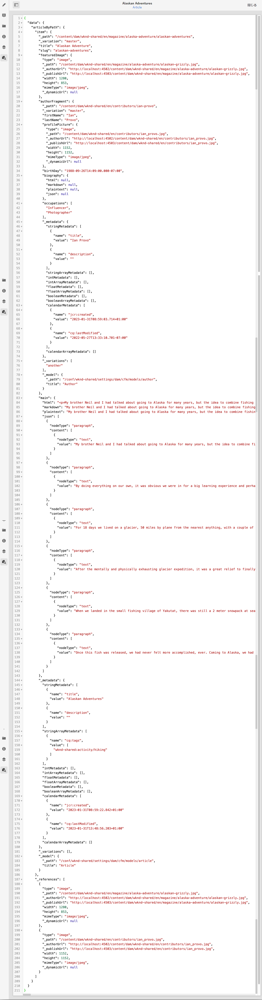

# プレビュー- JSON表現{#preview-json-representation}

>[!CAUTION]
>
>AEM GraphQL API(コンテンツフラグメント配信用)は、2021年の初めにリリースされます。
>
>関連ドキュメントは、既にプレビュー目的でご利用いただけます。

コンテンツフラグメントのモデルを開発する場合、コンテンツフラグメントのサンプルJSON出力を、モデルに基づいて表示することができます。 例えば、最終的な出力がどのように見えるかを調べるには、次のように記述します。 これは、モデルのJSON構造を検証する場合に便利です。データタイプごとのデフォルトのサンプルコンテンツを使用する場合もあります。

**プレビュー**&#x200B;アイコンを使用して、次の操作を行います。

現在のフラグメントのJSON表現を表示できます。 次に例を示します。

