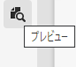
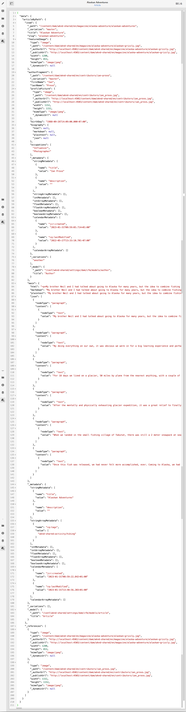

# プレビュー - JSON 表現 {#preview-json-representation}

AEM ヘッドレス実装の一環としてコンテンツフラグメントのモデルを開発する際に、コンテンツフラグメントのサンプル JSON 出力を、モデルに基づいて表示するとよい場合があります。例えば、最終的な出力がどのように見えるかを知るためにです。これは、モデルの JSON 構造を検証する場合に便利です。データタイプごとのデフォルトのサンプルコンテンツを使用する場合もあります。

>[!NOTE]
>
>コンテンツフラグメントは Sites 機能ですが、**Assets** として保存されます。
>
>コンテンツフラグメントをオーサリングするエディターは 2 つあります。基本機能は同じですが、いくつか違いがあります。この節では、**Assets** コンソールから主にアクセスされるエディターを説明します。（主に&#x200B;**コンテンツフラグメント**&#x200B;コンソールからアクセスされる）新しいエディターについて詳しくは、Sites のドキュメントの[コンテンツフラグメント - オーサリング](/help/sites-cloud/administering/content-fragments/authoring.md)を参照してください。

**プレビュー**&#x200B;アイコンを使用すると

現在のフラグメントの JSON 表現を表示できます。例：

<!--
**Copy URL** lets you copy to clipboard the URL for either author or publish.
-->