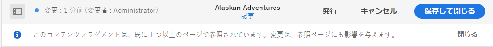

# コンテンツフラグメントの管理 {#managing-content-fragments}

ヘッドレスコンテンツの基礎として、またはページオーサリング用として AEM コンテンツフラグメントを Assets コンソールを使用して管理する方法について説明します。

[コンテンツフラグメントモデル](#creating-a-content-model)を定義した後、それらを使用して[コンテンツフラグメントを作成](#creating-a-content-fragment)できます。

[コンテンツフラグメントエディター](#opening-the-fragment-editor)には、次の操作を行うための様々な[モード](#modes-in-the-content-fragment-editor)が用意されています。

* [コンテンツの編集](#editing-the-content-of-your-fragment)と[バリエーションの管理](#creating-and-managing-variations-within-your-fragment)
* [フラグメントへの注釈の付加](/help/assets/content-fragments/content-fragments-variations.md#annotating-a-content-fragment)
* [コンテンツとフラグメントの関連付け](#associating-content-with-your-fragment)
* [メタデータの設定](#viewing-and-editing-the-metadata-properties-of-your-fragment)
* [構造ツリーの表示](/help/assets/content-fragments/content-fragments-structure-tree.md)
* [JSON 表現のプレビュー](/help/assets/content-fragments/content-fragments-json-preview.md)

>[!NOTE]
>
>コンテンツフラグメントは次に使用できます。
>
>* ページのオーサリング時 -「[コンテンツフラグメントを使用したページオーサリング](/help/sites-cloud/authoring/fragments/content-fragments.md)」を参照してください。
>* [GraphQL でコンテンツフラグメントを使用するヘッドレスコンテンツ配信用。](/help/assets/content-fragments/content-fragments-graphql.md)

>[!NOTE]
>
>コンテンツフラグメントは **Sites** 機能ですが、**Assets** として保存されます。
>
>引き続き **[Assets](/help/sites-cloud/administering/content-fragments/overview.md#content-fragments-console)** コンソールから管理できますが、主に **[コンテンツフラグメント](/help/assets/content-fragments/content-fragments-managing.md)** コンソールで管理します。
>
>コンテンツフラグメントのオーサリングには、新しいエディターと元のエディターの 2 つのエディターがあります。 新しいエディターがデフォルトです。 基本機能は同じですが、いくつかの違いがあります。
>
>この節では、元のエディターについて説明します。
>
>[ コンテンツフラグメント – オーサリング ](/help/sites-cloud/administering/content-fragments/authoring.md) のデフォルトのエディターは、**コンテンツフラグメント** コンソールと **Assets** コンソールの両方からアクセスできる新しいエディターです。 新しいエディターについて詳しくは、Sites のドキュメント [ コンテンツフラグメント – オーサリング ](/help/sites-cloud/administering/content-fragments/authoring.md) を参照してください。
>
>[ 元のエディター ](/help/assets/content-fragments/content-fragments-variations.md) を使用するには、まず新しいエディターを開いてから **新しいエディター** スイッチを非アクティブにします。
>
>どちらのエディターも、上部のツールバーに切り替えスイッチを使用して、他のエディターにすばやくアクセスできます。

## コンテンツフラグメントの作成 {#creating-content-fragments}

### コンテンツモデルの作成 {#creating-a-content-model}

構造化コンテンツを含むコンテンツフラグメントを作成する前に、[コンテンツフラグメントモデル](/help/assets/content-fragments/content-fragments-models.md)を有効にして作成できます。

### コンテンツフラグメントの作成 {#creating-a-content-fragment}

コンテンツフラグメントの作成方法は次のとおりです。

1. フラグメントを作成する **Assets** フォルダーに移動します。
1. 「**作成**」を選択し、「**コンテンツフラグメント**」を選択して、ウィザードを開きます。
1. ウィザードの最初の手順では、新しいフラグメントの基盤を指定することを求められます。

   * [モデル](/help/assets/content-fragments/content-fragments-models.md) - **アドベンチャー**&#x200B;モデルなど、構造化コンテンツを必要とするフラグメントの作成に使用されます

      * 使用可能なすべてのモデルが表示されます。

   選択した後、「**次へ**」を使用して続けます。

   

1. 「**プロパティ**」の手順で次を指定します。

   * **基本**

      * **タイトル**

        フラグメントタイトル。

        必須です。

      * **説明**

      * **タグ**

   * **詳細**

      * **名前**

        URL の作成に使用される名前です。

        必須。タイトルから自動的に派生しますが、変更が可能です。

1. 「**作成**」を選択して操作を完了してから、編集するためにフラグメントを&#x200B;**開く**&#x200B;か、「**完了**」でコンソールに戻ります。

   >[!NOTE]
   >コンソールの&#x200B;**リスト**&#x200B;モードでは、**表示設定**&#x200B;を更新して「**コンテンツフラグメントモデル**」列を有効にできます。

## Assets コンソールでコンテンツフラグメントに対して使用できるアクション {#actions-for-a-content-fragment-assets-console}

**Assets** コンソールでは、次のいずれかからコンテンツフラグメントに対して様々なアクションを使用できます。

* ツールバーから。フラグメントを選択すると、該当するすべてのアクションを使用できるようになります。
* [クイックアクション](/help/sites-cloud/authoring/basic-handling.md#quick-actions)として。個別のフラグメントカードに使用可能なアクションのサブセット。

フラグメントを選択して、次の適用可能なアクションを含むツールバーを表示します。

* **アセットを再処理**
* **作成**
* **ダウンロード**

   * フラグメントを ZIP ファイルとして保存します。要素、バリエーション、メタデータを含めるかどうかを定義できます。

* **チェックアウト**
* **プロパティ**

   * フラグメントのメタデータを表示、編集、またはその両方を行います。

* **編集**

   * フラグメントの要素、バリエーション、および関連付けられているコンテンツやメタデータと共に、[コンテンツを編集するためにフラグメントを開く](/help/assets/content-fragments/content-fragments-variations.md)ことができます。

* **クイック公開**
* **公開を管理**
* **タグを管理**
* **コレクションに追加**
* **コピー**（&amp; **ぺースト**）
* **移動**
* **削除**

>[!NOTE]
>
>これらの多くは、[Assets](/help/assets/manage-digital-assets.md) や [AEM デスクトップアプリケーション](https://helpx.adobe.com/jp/experience-manager/desktop-app/aem-desktop-app.html)に対する標準的なアクションです。

## フラグメントエディターを開く {#opening-the-fragment-editor}

編集用のフラグメントを元のエディターで開くには：

>[!CAUTION]
>
>コンテンツフラグメントを編集するには、[適切な権限](/help/implementing/developing/extending/content-fragments-customizing.md#asset-permissions)が必要になります。問題が発生している場合は、システム管理者にお問い合わせください。

1. コンテンツフラグメントの場所に移動します。

1. 編集するフラグメントを開きます。

1. フラグメントが新しいエディターで開きます。 **新規エディター** スイッチ（右上）を非アクティブにして、元のエディターを開きます。

   

1. 必要に応じて変更を加えます。

1. 準備ができたら、必要に応じて **保存**、**保存して閉じる** または **閉じる** を使用します。

   >[!NOTE]
   >
   >「**保存して閉じる**」は、**保存**&#x200B;ドロップダウンリストから選択できます。

   >[!NOTE]
   >
   >「**保存して閉じる**」と「**閉じる**」のどちらをクリックした場合も、エディターが終了します。様々なオプションがコンテンツフラグメントにどのように動作するかについて詳しくは、[保存、閉じる、バージョン](#save-close-and-versions)を参照してください。

## コンテンツフラグメントエディターのモードとアクション {#modes-actions-content-fragment-editor}

コンテンツフラグメントエディターからは、様々なモードとアクションを使用できます。

### コンテンツフラグメントエディターのモード {#modes-in-the-content-fragment-editor}

サイドパネルのアイコンを使用して、様々なモード間を移動できます。

* バリエーション：[コンテンツの編集](#editing-the-content-of-your-fragment)と[バリエーションの管理](#creating-and-managing-variations-within-your-fragment)

* [注釈](/help/assets/content-fragments/content-fragments-variations.md#annotating-a-content-fragment)
* [関連コンテンツ](#associating-content-with-your-fragment)
* [メタデータ](#viewing-and-editing-the-metadata-properties-of-your-fragment)
* [構造ツリー](/help/assets/content-fragments/content-fragments-structure-tree.md)
* [プレビュー](/help/assets/content-fragments/content-fragments-json-preview.md)

### コンテンツフラグメントエディターのツールバーアクション {#toolbar-actions-in-the-content-fragment-editor}

上部のツールバーには、複数のモードから使用できる機能があります。

* フラグメントがコンテンツページで既に参照されている場合は、メッセージが表示されます。このメッセージは&#x200B;**閉じる**&#x200B;ことができます。

* **サイドパネルを切り替え**&#x200B;アイコンを使用してサイドパネルを非表示／表示できます。

* フラグメント名の下に、現在のフラグメントの作成に使用された[コンテンツフラグメントモデル](/help/assets/content-fragments/content-fragments-models.md)の名前が表示されます。

   * また、この名前はモデルエディターを開くリンクです。

* 例えば、フラグメントの作成、変更、公開の日時については、フラグメントのステータスを参照してください。また、ステータスは次のように色分けもされています。

   * **新規**：灰色
   * **ドラフト**：青
   * **公開済み**：緑
   * **変更**：オレンジ
   * **アクティベートを解除済み**：赤

* ボタンを使用すると、[コンテントフラグメントコンソール](/help/sites-cloud/administering/content-fragments/overview.md#content-fragments-console)からアクセスできる&#x200B;*新しい*[コンテントフラグメントエディター](/help/sites-cloud/administering/content-fragments/authoring.md)を直接開くことにより&#x200B;**新しいエディターを使える**&#x200B;ようになります。

  >[!WARNING]
  >
  >新しいエディターが同じタブで開きます。両方のエディターを同時に開くことはお勧めしません。

* 「**保存**」から、「**保存して閉じる**」オプションにアクセスできます。

* 3 つのドット（**...**）ドロップダウンから、以下の追加アクションにアクセスできます。
   * **ページ参照を更新**
      * すべてのページ参照が更新されます。
   * **[クイック公開](#publishing-and-referencing-a-fragment)**
   * **[公開を管理](#publishing-and-referencing-a-fragment)**

<!--
This updates any page references and ensures that the Dispatcher is flushed as required. -->

## 保存、閉じる、バージョン {#save-close-and-versions}

>[!NOTE]
>
>バージョン[を作成／比較したり元に戻したりする操作は、タイムラインから](/help/assets/content-fragments/content-fragments-managing.md#timeline-for-content-fragments)も行えます。

エディターには、次のような様々なオプションがあります。

* 「**保存**」と「**保存して閉じる**」

   * 「**保存**」を選択すると、最新の変更が保存され、その後もエディターは開いたままです。
   * 「**保存して閉じる**」を選択すると、最新の変更が保存された後、エディターが終了します。

  >[!CAUTION]
  >
  >コンテンツフラグメントを編集するには、[適切な権限](/help/implementing/developing/extending/content-fragments-customizing.md#asset-permissions)が必要になります。問題が発生している場合は、システム管理者にお問い合わせください。

  >[!NOTE]
  >
  >エディターを開いたまま、一連の変更を加えてから保存することもできます。

  >[!CAUTION]
  >
  >これらの操作では、変更を保存するだけでなく、参照もすべて更新し、Dispatcher が必要に応じてフラッシュされます。これらの変更の処理には時間がかかる場合があります。このため、大きなシステムや複雑なシステム、高負荷のシステムのパフォーマンスに影響することがあります。
  >
  >「**保存して閉じる**」を使用する際はこのプロセスを考慮し、フラグメントエディターをすぐに開いて、さらに変更を加え保存してください。

* **閉じる**

  最新の変更（前回の「**保存**」操作以降に行った変更）を保存せずにエディターを終了します。

コンテンツフラグメントを編集するとき、AEM によって自動的にバージョンが作成されます。これにより、（保存せずに「**閉じる**」を使用して）変更内容を取り消した場合でも、以前のコンテンツを復元できるようになります。

1. コンテンツフラグメントを開いて編集しようとすると、AEM は&#x200B;*編集セッション*&#x200B;が存在しているかどうかを示す cookie ベースのトークンの存在を確認します。

   1. トークンが見つかると、そのフラグメントは既存の編集セッションの一部であると見なされます。
   2. トークンがないときにユーザーが編集を開始すると、バージョンが作成され、この新しい編集セッションのトークンがクライアントに送られ、cookie に保存されます&#x200B;*。*

2. アクティブな編集セッションがあるとき、編集中のコンテンツは自動的に 600 秒ごとに保存されます（デフォルト）*。*

   >[!NOTE]
   >
   >自動保存間隔は `/conf` メカニズムを使用して設定できます。
   >
   >デフォルト値については、以下を参照してください。
   >  `/libs/settings/dam/cfm/jcr:content/autoSaveInterval`

3. ユーザーが編集をキャンセルした場合は、編集セッションの開始時に作成されたバージョンが復元され、トークンが削除されて編集セッションが終了します。
4. ユーザーが編集内容の「**保存**」を選択すると、更新された要素とバリエーションが保存され、トークンが削除されて編集セッションが終了します。

## フラグメントのコンテンツの編集 {#editing-the-content-of-your-fragment}

フラグメントを開いたら、「[バリエーション](/help/assets/content-fragments/content-fragments-variations.md)」タブを使用してコンテンツをオーサリングできます。

## フラグメント内のバリエーションの作成と管理 {#creating-and-managing-variations-within-your-fragment}

プライマリコンテンツを作成したら、そのコンテンツの[バリエーション](/help/assets/content-fragments/content-fragments-variations.md)を作成して管理できます。

## コンテンツとフラグメントの関連付け {#associating-content-with-your-fragment}

フラグメントに[コンテンツを関連付ける](/help/assets/content-fragments/content-fragments-assoc-content.md)こともできます。これにより関連性を付加して、フラグメントをコンテンツページに追加するときに、アセット（画像など）を（オプションで）フラグメントと一緒に使用できるようになります。

## フラグメントのメタデータ（プロパティ）の表示と編集 {#viewing-and-editing-the-metadata-properties-of-your-fragment}

「[メタデータ](/help/assets/content-fragments/content-fragments-metadata.md)」タブを使用し、フラグメントのプロパティを表示して編集できます。

## コンテンツフラグメントのタイムライン {#timeline-for-content-fragments}

[タイムライン](/help/assets/manage-digital-assets.md#timeline)では標準のオプションに加え、コンテンツフラグメントに固有の情報とアクションの両方が提供されます。

* バージョン、コメント、注釈に関する情報の表示
* バージョンに対するアクション

   * **[このバージョンに戻る](#reverting-to-a-version)**（既存のフラグメントを選択してから特定のバージョンを選択）

   * **[現在のバージョンと比較](#comparing-fragment-versions)**（既存のフラグメントを選択してから特定のバージョンを選択）

   * **ラベル**&#x200B;や&#x200B;**コメント**&#x200B;の追加（既存のフラグメントを選択してから特定のバージョンを選択）

   * **バージョンとして保存**（既存のフラグメントを選択してから、タイムラインの下部にある上向き矢印を選択）

* 注釈に関するアクション

   * **削除**

>[!NOTE]
>
>コメントは次のとおりです。
>
>* すべてのアセットの標準機能
>* タイムラインで作成
>* フラグメントアセットに関連付けられる
>
>注釈（コンテンツフラグメント用）は次のとおりです。
>
>* フラグメントエディターで入力
>* フラグメント内の選択されたテキストセグメントに固有
>
>どちらも、新しい[コンテンツフラグメントエディター](/help/sites-cloud/administering/content-fragments/authoring.md#commenting-on-your-fragment)に入力したコメントは表示されません。

次に例を示します。

## フラグメントのバージョンの比較 {#comparing-fragment-versions}

特定のバージョンを選択したら、「[タイムライン](/help/assets/content-fragments/content-fragments-managing.md#timeline-for-content-fragments)」から「**現在のバージョンと比較**」アクションを利用できるようになります。

これにより次が開きます。

* **現在**（最新）のバージョン（左）

* 選択されたバージョン **v&lt;*x.y*>**（右）

これらは左右に並んで表示されます。この画面について以下で説明します。

* すべての相違点がハイライト表示されます

   * 削除されたテキスト - 赤
   * 挿入されたテキスト - 緑
   * 置き換えられたテキスト - 青

* 全画面表示アイコンを使用すると、いずれかのバージョンで開いた後で、並列表示に切り替えることができます
* 特定のバージョンに&#x200B;**戻す**&#x200B;ことができます
* 「**完了**」を選択すると、コンソールに戻ります

>[!NOTE]
>
>フラグメントの比較中にフラグメントコンテンツを編集することはできません。

## 特定のバージョンへの復帰   {#reverting-to-a-version}

次の方法で特定のバージョンのフラグメントに戻すことができます。

* 直接[タイムライン](/help/assets/content-fragments/content-fragments-managing.md#timeline-for-content-fragments)から。

  必要なバージョンを選択した後、「**このバージョンに戻す**」アクションを選択します。

* [あるバージョンと現在のバージョンを比較](/help/assets/content-fragments/content-fragments-managing.md#comparing-fragment-versions)し、選択したバージョンに&#x200B;**戻す**&#x200B;ことができます。

## フラグメントの公開と参照 {#publishing-and-referencing-a-fragment}

>[!CAUTION]
>
>フラグメントがモデルに基づいている場合、その[モデルが公開されている](/help/assets/content-fragments/content-fragments-models.md#publishing-a-content-fragment-model)ことを確認してください。
>
>まだ公開されていないモデルのコンテンツフラグメントを公開すると、選択リストにそのことが示され、モデルがフラグメントと共に公開されます。

コンテンツフラグメントをパブリッシュ環境で使用するには、公開する必要があります。これは、Assets の標準機能を使用して行います。

* [クイック公開](/help/assets/manage-publication.md#quick-publish)
* [公開を管理](/help/assets/manage-publication.md#manage-publication)

これは次の方法でアクセスできます。

* 作成後、[Assets コンソールで使用可能なアクション](#actions-for-a-content-fragment-assets-console)を使用して。
* [コンテンツフラグメントエディター](#toolbar-actions-in-the-content-fragment-editor)から。

さらに、[フラグメントを使用するページを公開](/help/sites-cloud/authoring/fragments/content-fragments.md#publishing)するとき。フラグメントはページ参照にリスト表示されます。

>[!CAUTION]
>
>フラグメントが公開または参照（あるいは両方）された後に、作成者がフラグメントを開いて編集しようとすると警告が表示され、フラグメントを変更すると、参照されているページにも影響が及ぶことが警告されます。

## フラグメントの削除 {#deleting-a-fragment}

レポートを削除する手順は次のとおりです。

1. **Assets** コンソールで、コンテンツフラグメントの場所に移動します。
2. フラグメントを選択します。

   >[!NOTE]
   >
   >**削除**&#x200B;アクションは、クイックアクションとしては実行できません。

3. ツールバーから「**削除**」を選択します。
4. 「**削除**」アクションを確認します。

   >[!CAUTION]
   >
   >フラグメントが既にページで参照されている場合は、警告メッセージが表示されます。「**削除を強制**」を選択して続行を確認する必要があります。フラグメントは、そのコンテンツフラグメントコンポーネントと一緒に、すべてのコンテンツページから削除されます。
