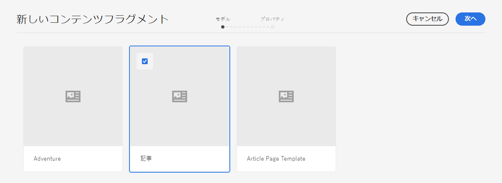
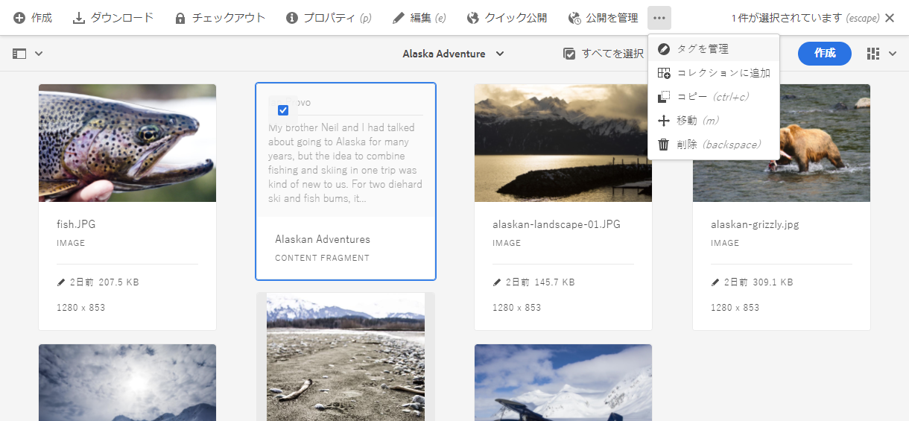
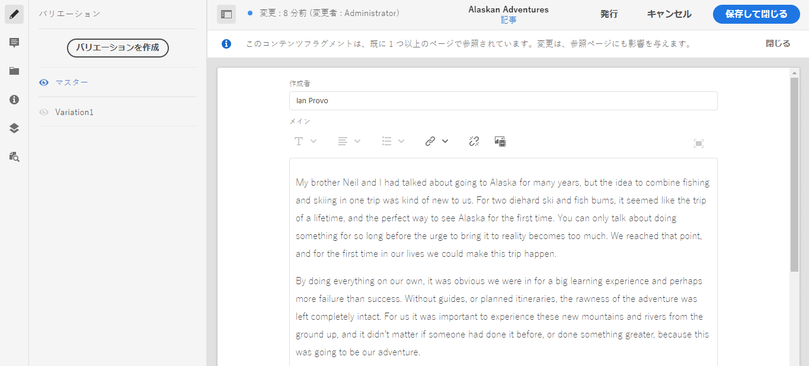
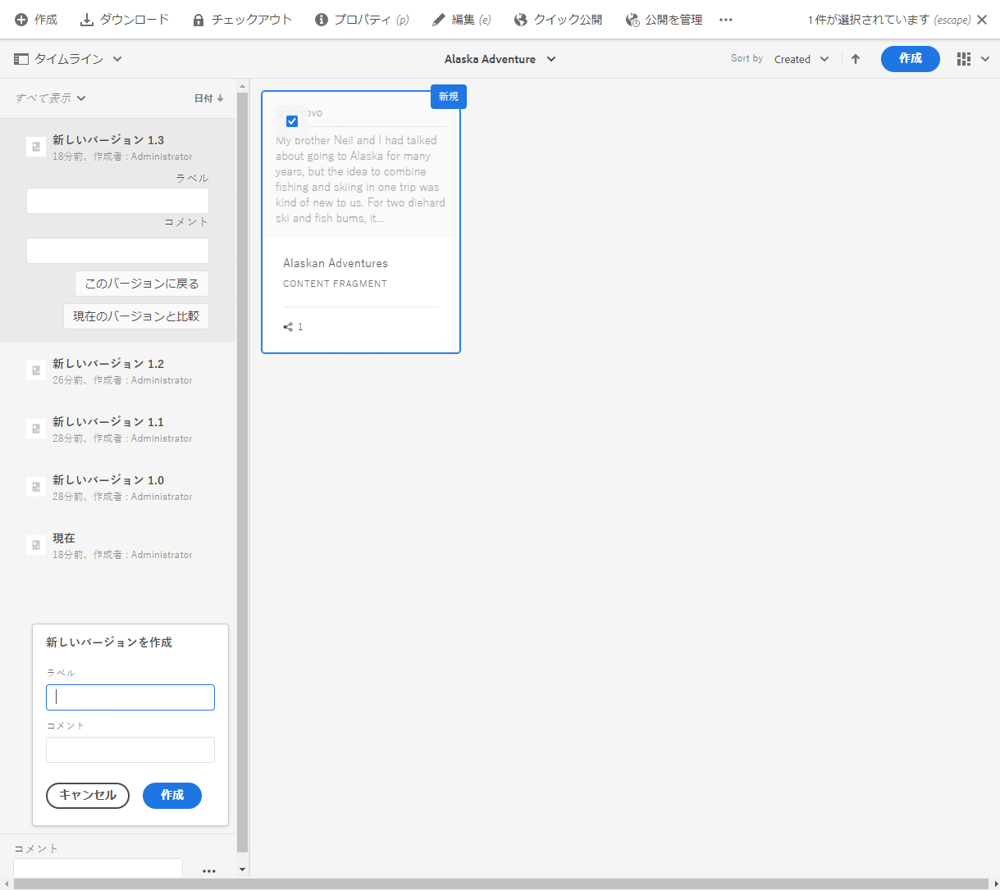
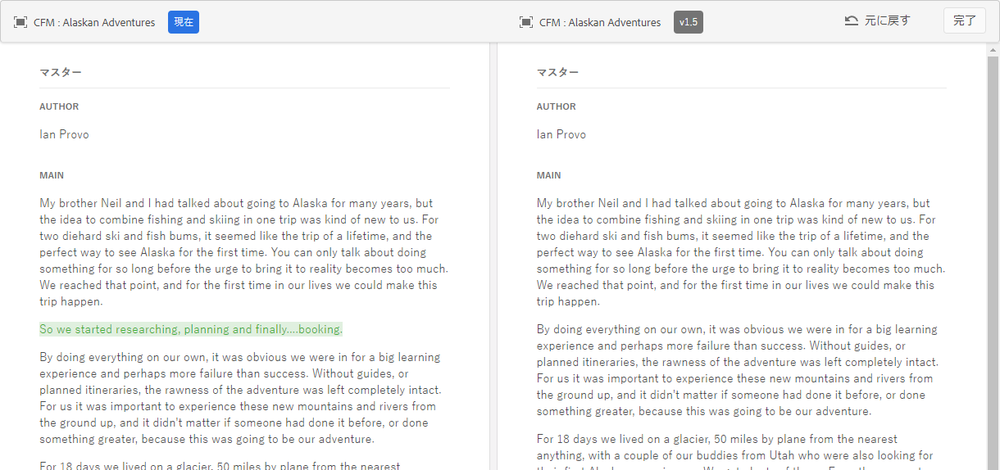

# コンテンツフラグメントの管理{#managing-content-fragments}

コンテンツフラグメントは **Assets** として保存されるので、主に **Assets** コンソールから管理します。

>[!NOTE]
>
>コンテンツフラグメントは、ページのオーサリングで使用します。[コンテンツフラグメントを使用したページのオーサリング](/help/sites-cloud/authoring/fundamentals/content-fragments.md)を参照してください。

## コンテンツフラグメントの作成 {#creating-content-fragments}

### コンテンツモデルの作成 {#creating-a-content-model}

構造化コンテンツを含むコンテンツフラグメントを作成する前に、[コンテンツフラグメントモデル](/help/assets/content-fragments/content-fragments-models.md)を有効にして作成できます。

### コンテンツフラグメントの作成 {#creating-a-content-fragment}

コンテンツフラグメントの作成方法は次のとおりです。

1. フラグメントを作成する **Assets** フォルダーに移動します。
2. 「**作成**」を選択し、「**コンテンツフラグメント**」を選択して、ウィザードを開きます。
3. ウィザードの最初の手順では、新しいフラグメントの基盤を指定することを求められます。

   * [モデル](/help/assets/content-fragments/content-fragments-models.md) - **アドベンチャー**&#x200B;モデルなど、構造化コンテンツを必要とするフラグメントの作成に使用されます

      * 使用可能なすべてのモデルが表示されます。

   選択した後、「**次へ**」を使用して続けます。

   

4. 「**プロパティ**」の手順で次を指定します。

   * **基本**

      * **タイトル**

          フラグメントタイトル。

          必須です。

      * **説明**

      * **タグ**
   * **アドバンス**

      * **名前**

         URL の作成に使用される名前です。

          必須。タイトルから自動的に派生しますが、変更が可能です。

5. 「**作成**」を選択して操作を完了してから、編集するためにフラグメントを&#x200B;**開く**&#x200B;か、「**完了**」でコンソールに戻ります。

## コンテンツフラグメントのアクション {#actions-for-a-content-fragment}

**Assets** コンソールでは、次のいずれかからコンテンツフラグメントに対して様々なアクションを使用できます。

* ツールバーから。フラグメントを選択すると、該当するすべてのアクションを使用できるようになります。
* [クイックアクション](/help/sites-cloud/authoring/getting-started/basic-handling.md#quick-actions)として。個別のフラグメントカードに使用可能なアクションのサブセット。

フラグメントを選択して、次の適用可能なアクションを含むツールバーを表示します。

* **作成**
* **ダウンロード**

   * フラグメントを ZIP ファイルとして保存します。要素、バリエーション、メタデータを含めるかどうかを定義できます。

* **チェックアウト**
* **プロパティ**

   * フラグメントのメタデータを表示したり、編集したりできます。

* **編集**

   * フラグメントの要素、バリエーション、および関連付けられているコンテンツやメタデータと共に[コンテンツを編集するためにフラグメントを開く](/help/assets/content-fragments/content-fragments-variations.md)ことができます。

* **タグを管理**
* **コレクションに追加**

   * フラグメントをコレクションに追加します。
   * これは、[コレクションをフラグメントと関連付ける](/help/assets/content-fragments/content-fragments-assoc-content.md#adding-associated-content)際に実行できます。

* **コピー**／**貼り付け**

* **移動**
* **クイック公開**
* **公開を管理**
* **削除**

>[!NOTE]
>
>これらの多くは、[Assets](/help/assets/manage-digital-assets.md) や [AEM デスクトップアプリケーション](https://helpx.adobe.com/jp/experience-manager/desktop-app/aem-desktop-app.html)に対する標準的なアクションです。

## フラグメントエディターを開く {#opening-the-fragment-editor}

編集するためにフラグメントを開くには：

>[!CAUTION]
>
>コンテンツフラグメントを編集するには、[適切な権限](/help/implementing/developing/extending/content-fragments-customizing.md#asset-permissions)が必要になります。問題が発生している場合は、システム管理者にお問い合わせください。

>[!CAUTION]
>
>コンテンツフラグメントを編集するには、適切な権限が必要になります。問題が発生している場合は、システム管理者にお問い合わせください。

1. **Assets** コンソールを使用して、コンテンツフラグメントの場所に移動します。
2. フラグメントを開いて編集するには、以下のいずれかを実行します。

   * フラグメントまたはフラグメントリンクをクリック／タップ（これはコンソールビューによって異なります）。
   * フラグメントを選択してから、ツールバーの「**編集**」を選択。

   フラグメントエディターが開きます。

   

   >[!NOTE]
   >
   >1. フラグメントがコンテンツページで既に参照されている場合は、メッセージが表示されます。
   >2. **サイドパネルを切り替え**&#x200B;アイコンを使用してサイドパネルを非表示／表示できます。

3. サイドパネルのアイコンを使用して、3 つのモデル間を移動します。

   * バリエーション：[コンテンツの編集](#editing-the-content-of-your-fragment)と[バリエーションの管理](#creating-and-managing-variations-within-your-fragment)

   * [注釈](/help/assets/content-fragments/content-fragments-variations.md#annotating-a-content-fragment)
   * [関連コンテンツ](#associating-content-with-your-fragment)
   * [メタデータ](#viewing-and-editing-the-metadata-properties-of-your-fragment)

   

4. 変更を加えた後、必要に応じて「**保存**」または「**キャンセル**」をクリックします。

   >[!NOTE]
   >
   >「**保存**」または「**キャンセル**」のどちらをクリックした場合も、エディターが終了します。これらの両方のオプションがコンテンツフラグメントにどのように動作するかについて詳しくは、[保存、キャンセルおよびバージョン](#save-cancel-and-versions)を参照してください。

## 保存、キャンセルおよびバージョン {#save-cancel-and-versions}

>[!NOTE]
>
>バージョン[を作成／比較したり元に戻したりする操作は、タイムラインから](/help/assets/content-fragments/content-fragments-managing.md#timeline-for-content-fragments)もおこなえます。

エディターには次の 2 つのオプションがあります。

* **保存**

   最後の変更を保存し、エディターを終了します。

   >[!CAUTION]
   >
   >コンテンツフラグメントを編集するには、[適切な権限](/help/implementing/developing/extending/content-fragments-customizing.md#asset-permissions)が必要になります。問題が発生している場合は、システム管理者にお問い合わせください。

   >[!NOTE]
   >
   >エディターを開いたまま、一連の変更を加えてから「**保存**」を選択することもできます。

   >[!CAUTION]
   >
   >「**保存**」では、変更を保存するだけでなく、参照を更新し、必要に応じて Dispatcher がフラッシュされます。これらの変更が処理されるまでに時間がかかることがあります。このため、大きなシステムや複雑なシステム、高負荷のシステムのパフォーマンスに影響することがあります。
   >
   >
   >「**保存**」を使用する際はこの点に留意し、フラグメントエディターを迅速に開いて、変更をおこない、保存してください。

* **キャンセル**

   最後の変更を保存せずにエディターを終了します。

コンテンツフラグメントを編集する際には、AEM によって自動的にバージョンが作成されます。これにより、変更内容を&#x200B;**キャンセル**&#x200B;しても以前のコンテンツを復元できるようになります。

1. コンテンツフラグメントを開いて編集しようとすると、AEM は&#x200B;*編集セッション*&#x200B;が存在しているかどうかを示す cookie ベースのトークンの存在を確認します。

   1. トークンが見つかると、そのフラグメントは既存の編集セッションの一部であると見なされます。
   2. トークンが&#x200B;**&#x200B;ないときにユーザーが編集を開始すると、バージョンが作成され、この新しい編集セッションのトークンがクライアントに送られ、cookie に保存されます。

2. **&#x200B;アクティブな編集セッションがあるとき、編集中のコンテンツは自動的に 600 秒ごとに保存されます（デフォルト）。

   >[!NOTE]
   >
   >自動保存間隔は `/conf` メカニズムを使用して設定できます。
   >
   >デフォルト値については、以下を参照してください。
   >  `/libs/settings/dam/cfm/jcr:content/autoSaveInterval`

3. ユーザーが「**キャンセル**」を選択して編集をキャンセルすると、編集セッションの開始時に作成されたバージョンが復元され、トークンが削除されて編集セッションが終了します。
4. ユーザーが編集内容の「**保存**」を選択すると、更新された要素とバリエーションが保存され、トークンが削除されて編集セッションが終了します。

## フラグメントのコンテンツの編集 {#editing-the-content-of-your-fragment}

フラグメントを開いたら、「[バリエーション](/help/assets/content-fragments/content-fragments-variations.md)」タブを使用してコンテンツをオーサリングできます。

## フラグメント内のバリエーションの作成と管理 {#creating-and-managing-variations-within-your-fragment}

マスターコンテンツを作成したら、そのコンテンツの[バリエーション](/help/assets/content-fragments/content-fragments-variations.md)を作成して管理できます。

## コンテンツをフラグメントと関連付ける {#associating-content-with-your-fragment}

フラグメントに[コンテンツを関連付ける](/help/assets/content-fragments/content-fragments-assoc-content.md)こともできます。これにより関連性を付加して、フラグメントをコンテンツページに追加するときに、アセット（画像など）を（オプションで）フラグメントと一緒に使用できるようになります。

## フラグメントのメタデータ（プロパティ）の表示と編集 {#viewing-and-editing-the-metadata-properties-of-your-fragment}

「[メタデータ](/help/assets/content-fragments/content-fragments-metadata.md)」タブを使用し、フラグメントのプロパティを表示して編集できます。

## コンテンツフラグメントのタイムライン {#timeline-for-content-fragments}

[タイムライン](/help/assets/manage-digital-assets.md#timeline)では標準のオプションに加え、コンテンツフラグメントに固有の情報とアクションの両方が提供されます。

* バージョン、コメントおよび注釈に関する情報の表示
* バージョンに関するアクション

   * **[このバージョンに戻す](#reverting-to-a-version)**（既存のフラグメントを選択してから特定のバージョンを選択）

   * **[現在のバージョンと比較](#comparing-fragment-versions)**（既存のフラグメントを選択してから特定のバージョンを選択）

   * **ラベル**&#x200B;や&#x200B;**コメント**&#x200B;の追加（既存のフラグメントを選択してから特定のバージョンを選択）

   * **バージョンとして保存**（既存のフラグメントを選択してからタイムライン下部の上矢印を選択）

* 注釈に関するアクション

   * **削除**

>[!NOTE]
>
>コメントは次のとおりです。
>* すべてのアセットの標準機能
>* タイムラインで追加
>* フラグメントアセットに関連付けられる

注釈（コンテンツフラグメント用）は次のとおりです。
* フラグメントエディターで入力
* フラグメント内の選択されたテキストセグメントに固有

次に例を示します。

## フラグメントのバージョンの比較 {#comparing-fragment-versions}

特定のバージョンを選択したら、「[タイムライン](/help/assets/content-fragments/content-fragments-managing.md#timeline-for-content-fragments)」から「**現在のバージョンと比較**」アクションを利用できるようになります。

これにより、次の情報が表示されます。

* **現在**（最新）のバージョン（左）

* 選択されたバージョン **v&lt;*x.y*>**（右）

これらは左右に並んで表示されます。この画面について以下で説明します。

* すべての相違点がハイライト表示されます

   * 削除されたテキスト - 赤
   * 挿入されたテキスト - 緑
   * 置き換えられたテキスト - 青

* 全画面表示アイコンを使用すれば、どちらかのバージョンで開いた後で、並列表示に切り替えることができます
* 特定のバージョンに&#x200B;**戻す**&#x200B;ことができます
* 「**完了**」を選択すると、コンソールに戻ります

>[!NOTE]
>
>フラグメントの比較中にフラグメントコンテンツを編集することはできません。

## 特定のバージョンに戻す  {#reverting-to-a-version}

次の方法で特定のバージョンのフラグメントに戻すことができます。

* 直接[タイムライン](/help/assets/content-fragments/content-fragments-managing.md#timeline-for-content-fragments)から。

   必要なバージョンを選択した後、「**このバージョンに戻す**」アクションを選択します。

* [あるバージョンと現在のバージョンを比較](/help/assets/content-fragments/content-fragments-managing.md#comparing-fragment-versions)し、選択したバージョンに&#x200B;**戻す**&#x200B;ことができます。

## フラグメントの公開と参照 {#publishing-and-referencing-a-fragment}

>[!CAUTION]
>
>フラグメントがモデルに基づいている場合、その[モデルが公開されている](/help/assets/content-fragments/content-fragments-models.md#publishing-a-content-fragment-model)ことを確認してください。
>まだ公開されていないモデルのコンテンツフラグメントを公開すると、選択リストにそのことが示され、モデルがフラグメントと共に公開されます。

コンテンツフラグメントを使用するには、パブリッシュ環境で公開する必要があります。次の方法で公開できます。

* 作成後に **Assets** コンソールから。
* [フラグメントを使用するページを公開](/help/sites-cloud/authoring/fundamentals/content-fragments.md#publishing)するとき。フラグメントはページ参照にリスト表示されます。

>[!CAUTION]
>
>フラグメントが公開または参照（あるいは両方）された後に、作成者がフラグメントを開いて編集しようとすると警告が表示され、フラグメントを変更すると、参照されているページにも影響が及ぶことが警告されます。

## フラグメントの削除 {#deleting-a-fragment}

フラグメントを削除するには：

1. **Assets** コンソールで、コンテンツフラグメントの場所に移動します。
2. フラグメントを選択します。

   >[!NOTE]
   >
   >**削除**&#x200B;アクションはクイックアクションとして実行できません。

3. ツールバーから「**削除**」を選択します。
4. 「**削除**」アクションを確認します。

   >[!CAUTION]
   >
   >フラグメントが既にページで参照されている場合は、警告メッセージが表示されます。「**削除を強制**」を選択して続行を確認する必要があります。フラグメントはコンテンツフラグメントコンポーネントと一緒に、すべてのコンテンツページから削除されます。
