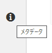
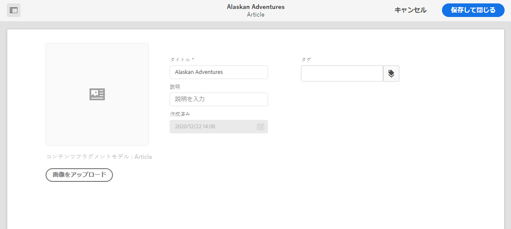

# メタデータ - フラグメントのプロパティ{#metadata-fragment-properties}

## プロパティ／メタデータの編集 {#editing-properties-meta-data}

コンテンツフラグメントのメタデータ（プロパティ）を表示して編集できます。

1. **アセット**&#x200B;コンソールで、コンテンツフラグメントの場所に移動します。
2. 以下のどちらかの操作をおこないます。

   * [**「プロパティを表示**」を選択してダイアログを開きます](/help/assets/manage-digital-assets.md#editing-properties)。開いて表示されたら、編集することもできます。
   * [編集するコンテンツフラグメント](/help/assets/content-fragments/content-fragments-managing.md#opening-the-fragment-editor)を開き、サイドパネルから「**メタデータ**」を選択します。

   

3. 「**基本**」タブに、表示または編集が可能なオプションが表示されます。

   * 「**画像をアップロード**」の対象となるサムネール
   * **タイトル**
   * **説明**
   * **タグ**
   * 作成済み（表示のみ）
   
