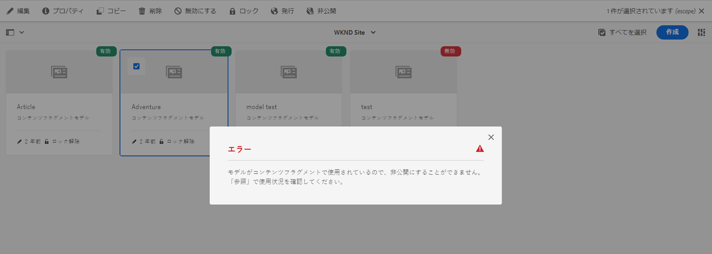
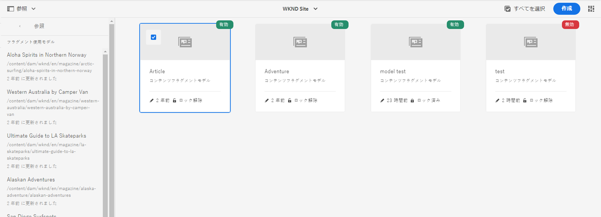
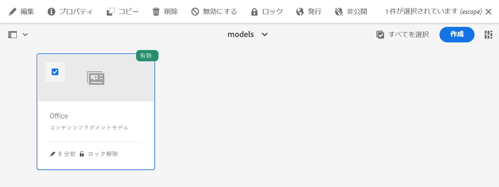
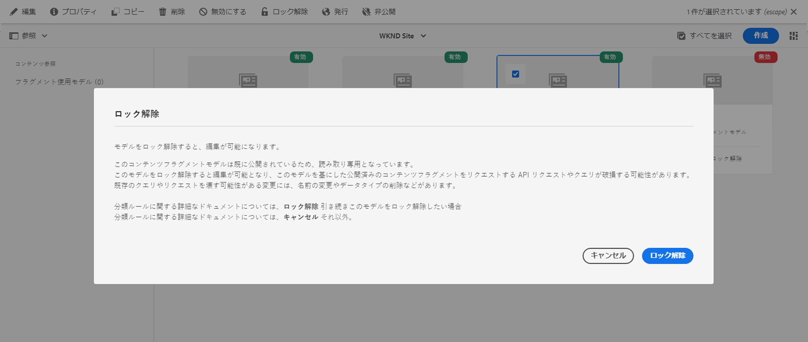
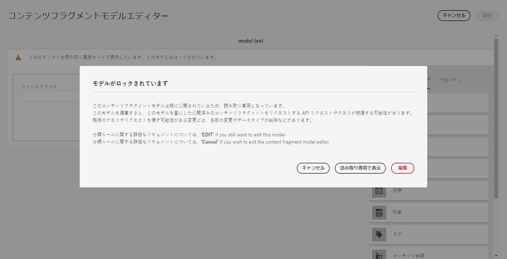
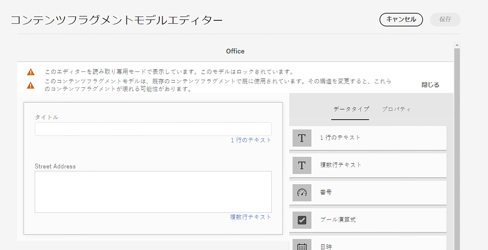
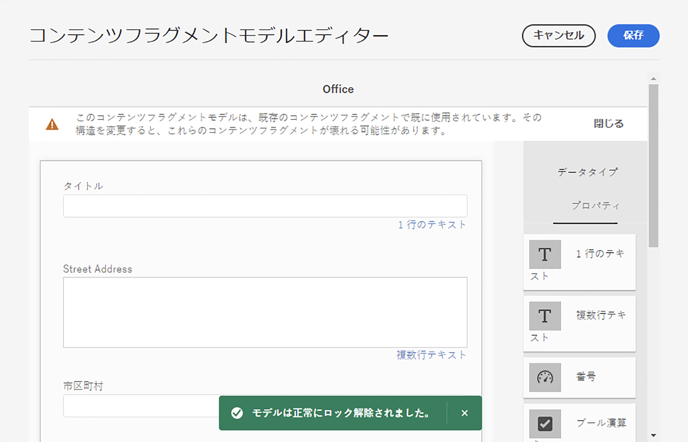

# コンテンツフラグメントモデル {#content-fragment-models}

AEM のコンテンツフラグメントモデルは、[コンテンツフラグメント](/help/assets/content-fragments/content-fragments.md)のコンテンツ構造を定義するもので、ヘッドレスコンテンツの基盤となります。

コンテンツフラグメントモデルを使用するには、以下を行います。

1. [インスタンスに対するコンテンツフラグメントモデル機能の有効化](/help/assets/content-fragments/content-fragments-configuration-browser.md)
1. コンテンツフラグメントモデルの[作成](#creating-a-content-fragment-model)と[設定](#defining-your-content-fragment-model)
1. コンテンツフラグメントの作成時に使用するために、[コンテンツフラグメントモデルを有効にする](#enabling-disabling-a-content-fragment-model)
1. **ポリシー**&#x200B;の設定による[必要なアセットフォルダーに対するコンテンツフラグメントモデルの許可](#allowing-content-fragment-models-assets-folder)

>[!NOTE]
>
>コンテンツフラグメントは Sites 機能ですが、**Assets** として保存されます。
>
>コンテンツフラグメントとコンテンツフラグメントモデルは、主に&#x200B;**[コンテンツフラグメント](/help/sites-cloud/administering/content-fragments/overview.md#content-fragments-console)**&#x200B;コンソールで管理されるようになりましたが、コンテンツフラグメントは **Assets** コンソールから、コンテンツフラグメントモデルは **Tools** コンソールから引き続き管理できます。この節では、**Assets** コンソールと **Tools** コンソールでの管理について説明します。

>[!NOTE]
>
>[ 新規モデルエディター ](/help/sites-cloud/administering/content-fragments/content-fragment-models.md) でモデルを作成した場合は、常にモデルにそのエディターを使用する必要があります。
>
>この（元の）モデルエディターでモデルを開くと、次のメッセージが表示されます。
>
>* 「このモデルには、カスタム UI スキーマが設定されています。 この UI に表示されるフィールドの順序は、UI スキーマと一致しない場合があります。 UI スキーマに合わせてフィールドを表示するには、新しいコンテンツフラグメントエディターに切り替える必要があります。」

## コンテンツフラグメントモデルの作成 {#creating-a-content-fragment-model}

1. **ツール**／**一般**&#x200B;に移動し、**コンテンツフラグメントモデル**&#x200B;を開きます。
1. [設定またはサブ設定](/help/assets/content-fragments/content-fragments-configuration-browser.md)に適したフォルダーに移動します。
1. 「**作成**」を使用してウィザードを開きます。

   >[!CAUTION]
   >
   >[コンテンツフラグメントモデルの使用が有効になっていない](/help/assets/content-fragments/content-fragments-configuration-browser.md)場合、「**作成**」オプションは使用できません。

1. **モデルタイトル**を指定します。
また、様々なプロパティを定義することもできます。例えば、「**タグ**」、「**説明**」を追加し、必要に応じて「**モデルを有効化**」を選択して[モデルを有効に](#enabling-disabling-a-content-fragment-model)します。

   >[!NOTE]
   >
   >**デフォルトのプレビュー URL パターン**&#x200B;について詳しくは、[コンテンツフラグメントモデル - プロパティ](#content-fragment-model-properties)を参照してください。

   

1. 「**作成**」を使用して、空のモデルを保存します。アクションの成功を示すメッセージが表示され、「**開く**」を選択して、モデルを直ちに編集するか、「**完了**」でコンソールに戻ります。

## コンテンツフラグメントモデルの定義 {#defining-your-content-fragment-model}

コンテンツフラグメントモデルは、**[データタイプ](#data-types)**&#x200B;の選択を使用して、結果として得られるコンテンツフラグメントの構造を効果的に定義します。モデルエディターを使用して、データタイプのインスタンスを追加し、それらを設定して必須フィールドを作成できます。

>[!CAUTION]
>
>既存のコンテンツフラグメントモデルを編集すると、依存するフラグメントが影響を受ける可能性があります。

1. **ツール**／**一般**&#x200B;に移動し、**コンテンツフラグメントモデル**&#x200B;を開きます。

1. コンテンツフラグメントモデルが含まれているフォルダーに移動します。
1. 必要なモデルを **編集** 用に開きます。クイック操作を使用するか、モデルを選択してツールバーから操作を選択します。

   モデルを開くと、モデルエディターに以下の情報が表示されます。

   * 左：フィールドが既に定義されています
   * 右：フィールドの作成に使用できる&#x200B;**データタイプ**（およびフィールドの作成後に使用する&#x200B;**プロパティ**）
   * トップ：[ 新規エディター ](/help/sites-cloud/administering/content-fragments/content-fragment-models.md) を試すオプション

   >[!NOTE]
   >
   >あるフィールドを&#x200B;**必須**&#x200B;として指定した場合、左側のウィンドウに表示される&#x200B;**ラベル**&#x200B;にアスタリスク（**&#42;**）が付きます。


1. **フィールドを追加するには**

   * 必要なデータタイプをフィールドの必要な場所にドラッグします。

     

   * フィールドがモデルに追加されると、その特定のデータタイプに対して定義できる&#x200B;**プロパティ**&#x200B;が右側のパネルに表示されます。ここで、そのフィールドに必要な項目を定義することができます。

      * 多くのプロパティは自明です。詳しくは「[プロパティ](#properties)」を参照してください。
      * 「**フィールドラベル**」を入力すると、「**プロパティ名**」が空欄の場合は自動入力され、後で手動で更新できます。

        >[!CAUTION]
        >
        >データタイプの「**プロパティ名**」プロパティを手動で更新する場合、名前には、A～Z、a～z、0～9 および特殊文字のアンダースコア「_」のみを使用できます。
        >
        >以前のバージョンの AEM で作成されたモデルに不正な文字が含まれている場合は、それらの文字を削除または更新します。

     例：

     

1. **フィールドを削除するには**

   必須フィールドを選択し、ごみ箱アイコンを選択します。アクションの確認が求められます。

   

1. すべての必須フィールドを追加し、必要に応じて関連するプロパティを定義します。例：

   

1. 「**保存**」を選択して、定義を保持します。

## データタイプ {#data-types}

モデルの定義には、次のデータタイプを選択できます。

* **1 行のテキスト**
   * 1 行のテキストのフィールドを追加（最大長は定義可能）
   * フィールドは、フラグメント作成者がフィールドの新しいインスタンスを作成できるように設定可能

* **複数行テキスト**
   * リッチテキスト、プレーンテキストまたはマークダウンのテキストエリア
   * フィールドは、フラグメント作成者がフィールドの新しいインスタンスを作成できるように設定可能

  >[!NOTE]
  >
  >テキストエリアがリッチテキスト、プレーンテキストまたはマークダウンのどれであるかは、モデル内で、プロパティの&#x200B;**デフォルトのタイプ**&#x200B;によって定義されます。
  >
  >この形式は、[コンテンツフラグメントエディター](/help/sites-cloud/administering/content-fragments/authoring.md)から変更はできませんが、モデルからのみ変更できます。

* **数値**
   * 数値フィールドを追加
   * フィールドは、フラグメント作成者がフィールドの新しいインスタンスを作成できるように設定可能

* **ブール型**
   * ブール型チェックボックスを追加

* **日時**
   * 日付／時間フィールドを追加

* **列挙**
   * チェックボックス、ラジオボタン、ドロップダウンフィールドのセットを追加
      * フラグメント作成者が使用できるオプションを指定可能

* **タグ**
   * フラグメント作成者がタグの領域にアクセスして選択できるようにする

* **フラグメント参照**
   * 他のコンテンツフラグメントの参照を[ネストされたコンテンツの作成](#using-references-to-form-nested-content)に使用可能
   * このデータタイプは、フラグメント作成者が次の操作を行えるように設定可能です。
      * 参照先フラグメントの直接編集
      * 適切なモデルに基づいた新しいコンテンツフラグメントの作成
      * フィールドの新しいインスタンスの作成
   * 参照は、参照先リソースへのパスを指定します。例：`/content/dam/path/to/resource`

* **フラグメント参照（UUID）**
   * 他のコンテンツフラグメントの参照を[ネストされたコンテンツの作成](#using-references-to-form-nested-content)に使用可能
   * このデータタイプは、フラグメント作成者が次の操作を行えるように設定可能です。
      * 参照先フラグメントの直接編集
      * 適切なモデルに基づいた新しいコンテンツフラグメントの作成
      * フィールドの新しいインスタンスの作成
   * エディターでは、参照は参照先リソースへのパスを指定します。内部的には、参照はリソースを参照する Universally Unique ID（UUID）として保持されます
      * UUID を知らなくても、フラグメントエディターで必要なフラグメントを参照できます

  >[!NOTE]
  >
  >UUID はリポジトリに固有です。[コンテンツのコピーツール](/help/implementing/developing/tools/content-copy.md)を使用してコンテンツフラグメントをコピーすると、ターゲット環境で UUID が再計算されます。

* **コンテンツ参照**
   * 任意のタイプの他のコンテンツの参照を[ネストされたコンテンツの作成](#using-references-to-form-nested-content)に使用可能
   * 画像が参照されている場合は、サムネールを表示するように選択可能
   * フィールドは、フラグメント作成者がフィールドの新しいインスタンスを作成できるように設定可能
   * 参照は、参照先リソースへのパスを指定します。例：`/content/dam/path/to/resource`

* **コンテンツ参照（UUID）**
   * 任意のタイプの他のコンテンツの参照を[ネストされたコンテンツの作成](#using-references-to-form-nested-content)に使用可能
   * 画像が参照されている場合は、サムネールを表示するように選択可能
   * フィールドは、フラグメント作成者がフィールドの新しいインスタンスを作成できるように設定可能
   * エディターでは、参照は参照先リソースへのパスを指定します。内部的には、参照はリソースを参照する Universally Unique ID（UUID）として保持されます
      * UUID を知らなくても、フラグメントエディターで必要なアセットリソースを参照できます

  >[!NOTE]
  >
  >UUID はリポジトリに固有です。[コンテンツのコピーツール](/help/implementing/developing/tools/content-copy.md)を使用してコンテンツフラグメントをコピーすると、ターゲット環境で UUID が再計算されます。

* **JSON オブジェクト**
   * コンテンツフラグメントの作成者がフラグメントの対応する要素に JSON 構文を入力できます。
      * 別のサービスからコピー＆ペーストした JSON を AEM に直接保存できるようにします。
      * JSON が渡され GraphQL で JSON として出力されます。
      * コンテンツフラグメントエディターに JSON 構文のハイライト表示機能、オートコンプリートおよびエラーのハイライト表示機能が含まれています。

* **タブプレースホルダー**
   * コンテンツフラグメントコンテンツの編集時に使用するタブを導入を許可します。
      * モデルエディターで区切りとして表示され、コンテンツデータタイプのリストをセクションに分割します。各インスタンスは、新しいタブの開始を表します。
      * フラグメントエディターでは、各インスタンスがタブとして表示されます。

     >[!NOTE]
     >
     >このデータタイプは書式設定にのみ使用され、AEM GraphQL スキーマでは無視されます。

## プロパティ {#properties}

多くのプロパティは一目瞭然です。プロパティによっては、次に示す追加の詳細情報があります。

* **プロパティ名**

  データタイプのこのプロパティを手動で更新する場合、名前には、A～Z、a～z、0～9 および特殊文字としてアンダースコア「_」*のみを*&#x200B;使用する&#x200B;**必要があります**。

  >[!CAUTION]
  >
  >以前のバージョンの AEM で作成されたモデルに不正な文字が含まれている場合は、それらの文字を削除または更新します。

* **レンダリング時の名前**
フラグメント内のフィールドを実現／レンダリングするための様々なオプション。多くの場合、このプロパティを使用すると、作成者がフィールドのインスタンスを 1 つ表示するか、複数のインスタンスを作成できるかを定義できます。**複数フィールド**&#x200B;を使用すると、項目の最小数と最大数を定義できます。詳しくは、[検証](#validation)を参照してください。

* **フィールドラベル**
**フィールドラベル**&#x200B;を入力すると、**プロパティ名**&#x200B;を自動生成し、必要に応じて手動で更新できます。

* **検証**基本検証は、
**必須**&#x200B;プロパティなどのメカニズムで使用できます。一部のデータ型には、追加の検証フィールドがあります。詳しくは、「[検証](#validation)」を参照してください。

* データタイプが&#x200B;**複数行テキスト**&#x200B;の場合、「**デフォルトの種類**」を次のいずれかとして定義できます。

   * **リッチテキスト**
   * **Markdown**
   * **プレーンテキスト**

  指定しなかった場合は、デフォルト値の&#x200B;**リッチテキスト**&#x200B;がこのフィールドで使用されます。

  コンテンツフラグメントモデルで「**デフォルトの種類**」を変更した場合、その影響が既存の関連コンテンツフラグメントに及ぶのは、そのフラグメントがエディターで開かれて保存された後です。

* **一意**：
（特定のフィールドの）コンテンツは、現在のモデルから作成されたすべてのコンテンツフラグメントで一意である必要があります。

  これにより、同じモデルの別のフラグメントに既に追加されているコンテンツをコンテンツ作成者が繰り返し作成できないようになります。

  例えば、コンテンツフラグメントモデルの **1 行のテキスト**&#x200B;フィールド `Country` は、2 つの依存するコンテンツフラグメントで同じ `Japan` 値を持つことはできません。2 つ目のインスタンスが試行された場合、警告が表示されます。

  >[!NOTE]
  >
  >言語ルートごとに一意性が確保されます。

  >[!NOTE]
  >
  >バリエーションは、同じフラグメントのバリエーションと同じ&#x200B;*一意の*&#x200B;値を持つことができますが、他のフラグメントのバリエーションで使用されている値とは異なります。

  >[!CAUTION]
  >
  >（コンテンツフラグメントのコピーを作成する）MSM を使用する場合は、それぞれのコンテンツフラグメントモデルで使用されているすべてのデータタイプから&#x200B;**一意**&#x200B;の制約を削除する必要があります。

* 特定のデータタイプとそのプロパティについて詳しくは、**[コンテンツ参照](#content-reference)**&#x200B;を参照してください。

* 特定のデータタイプとそのプロパティについて詳しくは、**[フラグメント参照（ネストされたフラグメント）](#fragment-reference-nested-fragments)**&#x200B;を参照してください。

* **変換可能**

  コンテンツフラグメントモデルエディターのフィールドの「**翻訳可能**」チェックボックスをオンにした場合：

   * フィールドのプロパティ名がまだ存在しない場合は、翻訳設定のコンテキスト `/content/dam/<sites-configuration>` に確実に追加されます。
   * GraphQL の場合：「コンテンツフラグメント」フィールドの `<translatable>` プロパティを `yes` に設定して、変換可能なコンテンツのみを含む JSON を出力するための GraphQL クエリフィルターを許可します。

## 検証 {#validation}

様々なデータ型に、結果のフラグメントにコンテンツが入力される際の検証要件を定義できるようになりました。

* **1 行のテキスト**
   * 事前定義された正規表現と比較します。
* **数値**
   * 特定の値を確認します。
* **コンテンツ参照**
   * 特定のタイプのコンテンツをテストします。
   * 指定したファイルサイズ以下のアセットのみを参照できます。
   * 定義済みの幅または高さ（ピクセル単位）の範囲に収まる画像のみを参照できます。
* **フラグメント参照**
   * 特定のコンテンツフラグメントモデルをテストします。
* **最小項目数**／**最大項目数**

  **複数フィールド**&#x200B;として定義されているフィールド（**レンダリング形式**&#x200B;で設定）には、次のオプションがあります。

   * **最小項目数**
   * **最大項目数**

  次の項目が検証されます。

   * 最大値は、[元のコンテンツフラグメントエディター](/help/assets/content-fragments/content-fragments-variations.md)で検証されます。
   * 両方とも、[コンテンツフラグメントエディター](/help/sites-cloud/administering/content-fragments/authoring.md)で検証されます。

## 参照の使用によるネストされたコンテンツの作成 {#using-references-to-form-nested-content}

コンテンツフラグメントは、次のいずれかのデータタイプを使用して、ネストされたコンテンツを作成できます。

* [コンテンツ参照](#content-reference)
   * 他のコンテンツへの単純な参照（任意のタイプ）を提供します。
   * データタイプによって提供されるものは次のとおりです。
      * **コンテンツ参照** - パスベース
      * **コンテンツ参照（UUID）** - UUID ベース
   * （結果のフラグメント内で）1 つまたは複数の参照に対して設定できます。

* [フラグメント参照](#fragment-reference-nested-fragments)（ネストされたフラグメント）
   * 指定した特定のモデルに応じて、他のフラグメントを参照します。
   * データタイプによって提供されるものは次のとおりです。
      * **フラグメント参照** - パスベース
      * **フラグメント参照（UUID）** - UUID ベース
   * 構造化データを包含／取得できます。

     >[!NOTE]
     >
     >このメソッドは、[GraphQL でコンテンツフラグメントを使用したヘッドレスコンテンツ配信](/help/sites-cloud/administering/content-fragments/content-delivery-with-graphql.md)を使用する場合、特に重要になります。

   * （結果のフラグメント内で）1 つまたは複数の参照に対して設定できます。

>[!NOTE]
>
>コンテンツ／フラグメント参照およびコンテンツ／フラグメント参照（UUID）と、UUID ベースのデータタイプへのアップグレードについて詳しくは、[UUID 参照用のコンテンツフラグメントのアップグレード](/help/headless/graphql-api/uuid-reference-upgrade.md)を参照してください。

>[!NOTE]
>
>AEM では次のものの繰り返しを防止できます。
>
>* コンテンツ参照
>  これにより、現在のフラグメントへの参照を追加できなくなります。その結果、空のフラグメント参照選択ダイアログが表示される場合があります。
>
>* GraphQL のフラグメント参照
>  相互に参照される複数のコンテンツフラグメントを返すディープクエリを作成する場合、最初に null が返されます。

### コンテンツ参照 {#content-reference}

**コンテンツ参照**&#x200B;および&#x200B;**コンテンツ参照（UUID）**&#x200B;データタイプを使用すると、別のソース（例：画像、ページまたはエクスペリエンスフラグメント）からコンテンツをレンダリングできます。

標準プロパティに加えて、以下を指定できます。

* 参照される任意のコンテンツの&#x200B;**ルートパス**
* 参照可能なコンテンツタイプ
* ファイルサイズの制限
* 画像が参照されている場合：
   * サムネールを表示
   * 画像の高さと幅の制限


### フラグメント参照（ネストされたフラグメント） {#fragment-reference-nested-fragments}

**フラグメント参照**&#x200B;および&#x200B;**フラグメント参照（UUID）**&#x200B;データタイプは、1 つ以上のコンテンツフラグメントを参照できます。 複数のレイヤーを持つ構造化データを取得できるようになるので、アプリで使用するコンテンツを取得する場合、この機能は特に重要になります。

例：

* 従業員の詳細を定義するモデルです。以下が含まれます。
   * 事業主（会社）を定義するモデルへの参照

```xml
type EmployeeModel {
    name: String
    firstName: String
    company: CompanyModel
}

type CompanyModel {
    name: String
    street: String
    city: String
}
```

>[!NOTE]
>
>これは、[GraphQL でコンテンツフラグメントを使用したヘッドレスコンテンツ配信](/help/assets/content-fragments/content-fragments-graphql.md)との関連で特に重要になります。

標準プロパティに加えて、次のものを定義できます。

* **レンダリング時の名前**:

   * **multifield** - フラグメント作成者は個別の参照を複数作成できます。

   * **fragmentreference** - フラグメント作成者はフラグメントへの 1 つの参照を選択できます。

* **モデルタイプ**：
複数のモデルを選択できます。コンテンツフラグメントの作成時には、これらのモデルを使用して参照先のフラグメントが既に作成されている必要があります。

* **ルートパス**：
任意の参照先フラグメントのルートパスを指定します。

* **フラグメントの作成を許可**

  これにより、フラグメント作成者は、適切なモデルに基づいてフラグメントを作成できるようになります。

   * **fragmentreferencecomposite** - フラグメント作成者が複数のフラグメントを選択して複合フラグメントを作成できるようになります。

  

>[!NOTE]
>
>繰り返し防止メカニズムが設定されます。これにより、フラグメント参照で現在のコンテンツフラグメントを選択できなくなります。この結果、空のフラグメント参照選択ダイアログが表示される場合があります。
>
>GraphQL にも、フラグメント参照の繰り返し防止機能があります。相互に参照する 2 つのコンテンツフラグメントにわたるディープクエリを作成すると、null が返されます。

## コンテンツフラグメントモデル - プロパティ {#content-fragment-model-properties}

コンテンツフラグメントモデルの下記の&#x200B;**プロパティ**&#x200B;を編集できます。

* **基本**
   * **モデルタイトル**
   * **タグ**
   * **説明**
   * **画像をアップロード**
   * **デフォルトのプレビュー URL パターン**

     >[!NOTE]
     >
     >これは、*新規*&#x200B;コンテンツフラグメントエディターのみで使用されます。詳しくは、[コンテンツフラグメントモデル](/help/sites-cloud/administering/content-fragments/content-fragment-models.md#content-fragment-model-properties)を参照してください。


## コンテンツフラグメントモデルの有効化または無効化 {#enabling-disabling-a-content-fragment-model}

コンテンツフラグメントモデルの使用を完全に制御するために、設定できるステータスがあります。

### コンテンツフラグメントモデルの有効化 {#enabling-a-content-fragment-model}

モデルが作成された場合、次の処理ができるように有効にする必要があります。

* コンテンツフラグメントの作成時に選択できます。
* コンテンツフラグメントモデル内から参照する
* GraphQL で使用する（スキーマが生成される）

次のいずれかとしてフラグ付けされたモデルを有効にするには

* **ドラフト**：新規（無効）
* **無効**：明示的に無効化されている

**「**&#x200B;有効化」オプションは、次のいずれかから使用します。

* 上部のツールバー（必要なモデルが選択されている場合）
* 対応するクイックアクション（必要なモデルにマウスを移動）


### コンテンツフラグメントモデルの無効化 {#disabling-a-content-fragment-model}

モデルを無効にすると、以下のようになります。

* このモデルは、*新しい*&#x200B;コンテンツフラグメントを作成する際の基盤としては使用できなくなります。
* ただし、
   * GraphQL スキーマは生成され続け、スキーマのクエリも引き続き可能です（JSON API への影響を回避するため）。
   * モデルに基づくコンテンツフラグメントは、引き続き GraphQL エンドポイントからクエリして返すことができます。
* モデルは参照できなくなりますが、既存の参照は変更されず、引き続き GraphQL エンドポイントからクエリして返すことができます。

「**有効**」としてフラグ付けされたモデルを無効にするには、次のいずれかの「**無効化**」オプションを使用します。

* 上部のツールバー（必要なモデルが選択されている場合）
* 対応するクイックアクション（必要なモデルにマウスを移動）


## アセットフォルダーでのコンテンツフラグメントモデルの許可 {#allowing-content-fragment-models-assets-folder}

コンテンツのガバナンスを実装するには、アセットフォルダーに&#x200B;**ポリシー**&#x200B;を設定して、そのフォルダーでのフラグメント作成に使用可能なコンテンツフラグメントモデルを管理します。

>[!NOTE]
>
>このメカニズムは、ページの高度なプロパティでページとその子に対して[ページテンプレートを許可する](/help/sites-cloud/authoring/page-editor/templates.md#allowing-a-template-author)ことに似ています。

**許可されているコンテンツフラグメントモデル**&#x200B;に&#x200B;**ポリシー**&#x200B;を設定するには：

1. 必要なアセットフォルダーの&#x200B;**プロパティ**&#x200B;を開きます。

1. 「**ポリシー**」タブを開き、以下を設定します。

   * **継承元`<folder>`**

     ポリシーは、新しい子フォルダーの作成時に自動的に継承されます。サブフォルダーで親フォルダーとは異なるモデルを許可する必要がある場合は、ポリシーを再設定（継承を解除）できます。

   * **許可されているコンテンツフラグメントモデルパス (パス別)**

     複数のモデルを許可できます。

   * **許可されているコンテンツフラグメントモデルタグ (タグ別)**

     複数のモデルを許可できます。

   

1. 変更内容を&#x200B;**保存**&#x200B;します。

フォルダーに対して許可されるコンテンツフラグメントモデルは、次の順序で解決されます。

* **許可されているコンテンツフラグメントモデル**&#x200B;の&#x200B;**ポリシー**。
* 空の場合は、継承ルールを使用してポリシーの決定を試みます。
* 継承チェーンを使用しても結果が得られない場合は、そのフォルダーの **Cloud Services** 設定を調べます（最初は直接、次に継承を使用して調べます）。
* 上記のいずれでも結果が得られない場合、そのフォルダーに許可されるモデルはありません。

## コンテンツフラグメントモデルの削除 {#deleting-a-content-fragment-model}

>[!CAUTION]
>
>コンテンツフラグメントモデルを削除すると、依存するフラグメントに影響を与える場合があります。

コンテンツフラグメントモデルを削除するには、次の操作を実行します。

1. **ツール**／**一般**&#x200B;に移動し、**コンテンツフラグメントモデル**&#x200B;を開きます。

1. コンテンツフラグメントモデルが含まれているフォルダーに移動します。
1. モデルを選択し、次にツールバーの「**削除**」を選択します。

   >[!NOTE]
   >
   >モデルを参照している場合は、警告が表示されます。適切なアクションを実行します。

## コンテンツフラグメントモデルの公開 {#publishing-a-content-fragment-model}

コンテンツフラグメントモデルは、そのモデルに依存するコンテンツフラグメントの公開時または公開前に公開する必要があります。

コンテンツフラグメントモデルを公開するには、次の操作を実行します。

1. **ツール**／**一般**&#x200B;に移動し、**コンテンツフラグメントモデル**&#x200B;を開きます。

1. コンテンツフラグメントモデルが含まれているフォルダーに移動します。
1. モデルを選択し、次にツールバーの「**公開**」を選択します。公開ステータスがコンソールに表示されます。

   >[!NOTE]
   >
   >まだ公開されていないモデルのコンテンツフラグメントを公開すると、選択リストにそのことが示され、モデルがフラグメントと共に公開されます。

## コンテンツフラグメントモデルを非公開にする {#unpublishing-a-content-fragment-model}

コンテンツフラグメントモデルがフラグメントによって参照されていない場合は、そのモデルを非公開にできます。

コンテンツフラグメントモデルを非公開するには、次の操作を実行します。

1. **ツール**／**一般**&#x200B;に移動し、**コンテンツフラグメントモデル**&#x200B;を開きます。

1. コンテンツフラグメントモデルが含まれているフォルダーに移動します。
1. モデルを選択し、次にツールバーの「**非公開**」を選択します。
公開ステータスがコンソールに表示されます。

1 つまたは複数のフラグメントで現在使用されているモデルを非公開にしようとすると、エラーメッセージが表示されて通知されます（下図を参照）。



また、メッセージは、[参照](/help/sites-cloud/authoring/basic-handling.md#references)パネルを確認して詳細を調べるように促します。



## ロック済み（公開済み）コンテンツフラグメントモデル {#locked-published-content-fragment-models}

この機能は、公開済みのコンテンツフラグメントモデルに対するガバナンスを提供します。

### 課題 {#the-challenge}

* コンテンツフラグメントモデルは、AEM における GraphQL クエリのスキーマを決定します。

   * AEM GraphQL スキーマは、コンテンツフラグメントモデルが作成されると同時に作成され、オーサー環境とパブリッシュ環境の両方に存在できます。

   * 公開上のスキーマは、JSON 形式のコンテンツフラグメントコンテンツをライブ配信する場合の基盤となるので、非常に重要です。

* コンテンツフラグメントモデルが変更つまり編集された場合には、問題が発生する可能性があります。つまり、スキーマの変更が既存の GraphQL クエリに影響を与える可能性があります。

* コンテンツフラグメントモデルに新しいフィールドを追加する場合は、（通常は）悪影響はありません。ただし、既存のデータフィールド（名前など）を変更したり、フィールド定義を削除したりすると、既存の GraphQL クエリでこれらのフィールドをリクエストする際に、クエリが機能しなくなります。

### 要件 {#the-requirements}

* ライブコンテンツ配信に既に使用されているモデル、つまり公開済みのモデルを編集する際のリスクをユーザーに認識させる。

* 意図しない変更を避ける。

いずれにせよ、変更されたモデルが再公開されると、クエリが機能しなくなる可能性があります。

### 解決策 {#the-solution}

これらの問題に対処するために、コンテンツフラグメントモデルは、公開され次第、オーサー環境では読み取り専用モードに&#x200B;*ロック*&#x200B;されます。下図のように、**ロック済み**&#x200B;と表示されます。



モデルが&#x200B;**ロック済み**（読み取り専用モード）の場合、モデルの内容と構造は表示できますが、モデルを編集することはできません。

**ロック済み**&#x200B;モデルは、コンソールまたはモデルエディターで管理できます。

* コンソール

  コンソールで、ツールバーの「**ロック解除**」および「**ロック**」アクションを使用して、読み取り専用モードを管理できます。

  

   * モデルを&#x200B;**ロック解除**&#x200B;して編集を有効にすることができます。

     「**ロック解除**」を選択した場合、警告が表示されるので、「**ロック解除**」アクションを確定する必要があります。
     

     その後、モデルを編集用に開くことができます。

   * 編集後にまたモデルを&#x200B;**ロック**&#x200B;することもできます。
   * モデルは、再公開されると直ちに&#x200B;**ロック済み**（読み取り専用）モードに戻ります。

* モデルエディター

   * ロックされているモデルを開くと、警告が表示され、「**キャンセル**」「**読み取り専用で表示**」「**編集**」の 3 つのアクションが提示されます。

     

   * 「**読み取り専用で表示**」を選択した場合、モデルの内容と構造が表示されます。

     

   * 「**編集**」を選択した場合は、編集して更新内容を保存できます。

     

     >[!NOTE]
     >
     >まだ上部に警告が表示される場合がありますが、その場合は、モデルが既存のコンテンツフラグメントで既に使用されています。

   * 「**キャンセル**」を選択すると、コンソールに戻ります。
