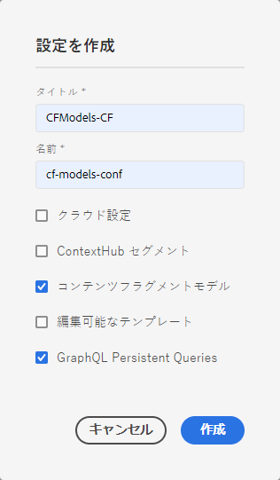

# コンテンツフラグメントモデル{#content-fragment-models}

コンテンツフラグメントモデルは、[コンテンツフラグメント](/help/assets/content-fragments/content-fragments.md)のコンテンツの構造を定義します。

## コンテンツフラグメントモデルの有効化 {#enable-content-fragment-models}

>[!CAUTION]
>
>**コンテンツフラグメントモデル**&#x200B;を有効にしないと、新しいモデルを作成するための「**作成**」オプションを使用できません。

コンテンツフラグメントモデルを有効にするには、次の操作を実行する必要があります。

* Configuration Manager でのコンテンツフラグメントモデル使用の有効化
* アセットフォルダーへの設定の適用

### Configuration Manager でのコンテンツフラグメントモデルの有効化 {#enable-content-fragment-models-in-configuration-manager}

[新しいコンテンツフラグメントモデルを作成する](#creating-a-content-fragment-model)には、最初に設定マネージャーを使用してコンテンツフラグメントモデルを有効にする&#x200B;**必要があります**。

1. **ツール**／**一般**&#x200B;に移動し、**設定ブラウザー**&#x200B;を開きます。
2. Web サイトに適した場所を選択します。
3. 「**作成**」を使用してダイアログを開き、次の操作をおこないます。

   1. 「**タイトル**」を指定します。
   2. 「**コンテンツフラグメントモデル**」を選択して、そのモデルを使用できるようにします。

   

4. 「**作成**」を選択して、定義を保存します。

### アセットフォルダーへの設定の適用 {#apply-the-configuration-to-your-assets-folder}

**グローバル**&#x200B;設定をコンテンツフラグメントモデルに対して有効にした場合、ユーザーが作成したあらゆるモデルを任意のアセットフォルダーで使用できます。

他の設定（グローバル以外）を同等のアセットフォルダーで使用するには、接続を定義する必要があります。そのためには、適切なフォルダーの「**フォルダーのプロパティ**」の「**クラウドサービス**」タブで「**設定**」を適切に選択します。

## コンテンツフラグメントモデルの作成 {#creating-a-content-fragment-model}

1. **ツール**／**アセット**&#x200B;に移動し、**コンテンツフラグメントモデル**&#x200B;を開きます。
1. 目的の[設定](#enable-content-fragment-models)に適したフォルダーに移動します。
1. 「**作成**」を使用してウィザードを開きます。

   >[!CAUTION]
   >
   >[コンテンツフラグメントモデルの使用が有効になっていない](#enable-content-fragment-models)場合、「**作成**」オプションは使用できません。

1. 「**モデルタイトル**」を指定します。必要に応じて、「**説明**」を追加することもできます。

   

1. 「**作成**」を使用して空のモデルを保存します。操作の成功を示すメッセージが表示されます。「**開く**」を選択してモデルをすぐに編集するか、「**完了**」を選択してコンソールに戻ることができます。

## コンテンツフラグメントモデルの定義 {#defining-your-content-fragment-model}

コンテンツフラグメントモデルは、生成されるコンテンツフラグメントの構造を効果的に定義します。モデルエディターを使用して、必要なフィールドを追加および設定できます。

>[!CAUTION]
>
>既存のコンテンツフラグメントモデルを編集すると、依存するフラグメントが影響を受ける可能性があります。

1. **ツール**／**アセット**&#x200B;に移動し、**コンテンツフラグメントモデル**&#x200B;を開きます。

1. コンテンツフラグメントモデルが含まれているフォルダーに移動します。
1. 必要なモデルを&#x200B;**編集**&#x200B;用に開きます。クイック操作を使用するか、モデルを選択してツールバーから操作を選択します。

   モデルを開くと、モデルエディターに次の情報が表示されます。

   * 左：既に定義されているフィールド
   * 右：フィールドの作成に使用できる&#x200B;**データタイプ**（およびフィールドの作成後に使用する&#x200B;**プロパティ**）

   >[!NOTE]
   >
   >あるフィールドを&#x200B;**必須**&#x200B;として指定した場合、左側のウィンドウに表示される&#x200B;**ラベル**&#x200B;にアスタリスク（*****）が付きます。

   

1. **フィールドを追加するには**

   * 必要なデータタイプをフィールドの必要な場所にドラッグします。

   

   * フィールドがモデルに追加されると、その特定のデータタイプに対して定義できる&#x200B;**プロパティ**&#x200B;が右側のパネルに表示されます。ここで、そのフィールドに必要な項目を定義することができます。次に例を示します。

   

   >[!NOTE]
   データタイプが&#x200B;**複数行テキスト**&#x200B;の場合、「**デフォルトの種類**」を次のいずれかとして定義できます。
   * **リッチテキスト**
   * **Markdown**
   * **プレーンテキスト**

   指定しなかった場合は、デフォルト値の&#x200B;**リッチテキスト**&#x200B;がこのフィールドで使用されます。
   コンテンツフラグメントモデルで「**デフォルトの種類**」を変更した場合、その影響が既存の関連コンテンツフラグメントに及ぶのは、そのフラグメントがエディターで開かれて保存された後です。

1. **フィールドを削除するには**

   必要なフィールドを選択し、ごみ箱アイコンをクリックまたはタップします。この操作の確認が求められます。

   

1. 必要なフィールドをすべて追加してプロパティを定義したら、「**保存**」を使用して定義を保存します。次に例を示します。

   

## コンテンツフラグメントモデルの削除 {#deleting-a-content-fragment-model}

>[!CAUTION]
コンテンツフラグメントモデルを削除すると、依存するフラグメントが影響を受ける可能性があります。

コンテンツフラグメントモデルを削除するには：

1. **ツール**／**アセット**&#x200B;に移動し、**コンテンツフラグメントモデル**&#x200B;を開きます。

1. コンテンツフラグメントモデルが含まれているフォルダーに移動します。
1. モデルを選択し、次にツールバーの「**削除**」を選択します。

   >[!NOTE]
   モデルが参照されている場合は、警告が表示されます。適切に対処します。

## コンテンツフラグメントモデルの公開 {#publishing-a-content-fragment-model}

コンテンツフラグメントモデルは、依存するコンテンツフラグメントの公開時または公開前に公開する必要があります。

コンテンツフラグメントモデルを公開するには：

1. **ツール**／**アセット**&#x200B;に移動し、**コンテンツフラグメントモデル**&#x200B;を開きます。

1. コンテンツフラグメントモデルが含まれているフォルダーに移動します。
1. モデルを選択し、次にツールバーの「**公開**」を選択します。

   >[!NOTE]
   まだ公開されていないモデルのコンテンツフラグメントを公開すると、選択リストにそのことが示され、モデルがフラグメントと共に公開されます。
