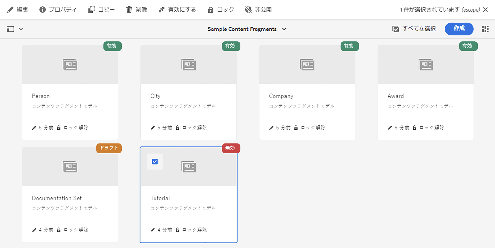
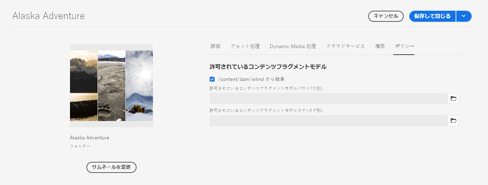

# コンテンツフラグメントモデル {#content-fragment-models}

コンテンツフラグメントモデルは、[コンテンツフラグメント](/help/assets/content-fragments/content-fragments.md)のコンテンツの構造を定義します。

コンテンツフラグメントモデルを使用するには、以下をおこないます。

1. [インスタンスに対するコンテンツフラグメントモデル機能の有効化](/help/assets/content-fragments/content-fragments-configuration-browser.md)
1. コンテンツフラグメントモデルの[作成](#creating-a-content-fragment-model)と[設定](#defining-your-content-fragment-model)
1. コンテンツフラグメントの作成時に使用する[コンテンツフラグメントモデルの有効化](#enabling-disabling-a-content-fragment-model)
1. [ポリシーを設定することで、必要なアセット](#allowing-content-fragment-models-assets-folder) フォルダーに対してコンテンツフラグメントモデルを許可し **ます**。

## コンテンツフラグメントモデルの作成 {#creating-a-content-fragment-model}

1. **ツール**／**アセット**&#x200B;に移動し、**コンテンツフラグメントモデル**&#x200B;を開きます。
1. 目的の[設定](/help/assets/content-fragments/content-fragments-configuration-browser.md)に適したフォルダーに移動します。
1. 「**作成**」を使用してウィザードを開きます。

   >[!CAUTION]
   >
   >[コンテンツフラグメントモデルの使用が有効になっていない](/help/assets/content-fragments/content-fragments-configuration-browser.md)場合、「**作成**」オプションは使用できません。

1. 「**モデルタイトル**」を指定します。また、**タグ**、**説明**&#x200B;を追加し、必要に応じて&#x200B;**モデル**&#x200B;を有効にして[モデル](#enabling-disabling-a-content-fragment-model)を有効にします。

   

1. 「**作成**」を使用して空のモデルを保存します。操作の成功を示すメッセージが表示されます。「**開く**」を選択してモデルをすぐに編集するか、「**完了**」を選択してコンソールに戻ることができます。

## コンテンツフラグメントモデルの定義 {#defining-your-content-fragment-model}

コンテンツフラグメントモデルは、**[データタイプ](#data-types)**&#x200B;の選択を使用して、結果として得られるコンテンツフラグメントの構造を効果的に定義します。モデルエディターを使用して、データ型のインスタンスを追加し、それらを設定して必須フィールドを作成できます。

>[!CAUTION]
>
>既存のコンテンツフラグメントモデルを編集すると、依存するフラグメントが影響を受ける可能性があります。

1. **ツール**／**アセット**&#x200B;に移動し、**コンテンツフラグメントモデル**&#x200B;を開きます。

1. コンテンツフラグメントモデルが含まれているフォルダーに移動します。
1. 必要なモデルを&#x200B;**編集**&#x200B;用に開きます。クイック操作を使用するか、モデルを選択してツールバーから操作を選択します。

   モデルを開くと、モデルエディターに次の情報が表示されます。

   * 左：既に定義されているフィールド
   * 右：フィールドの作成に使用できる&#x200B;**データタイプ**（およびフィールドの作成後に使用する&#x200B;**プロパティ**）

   >[!NOTE]
   >
   >あるフィールドを&#x200B;**必須**&#x200B;として指定した場合、左側のウィンドウに表示される&#x200B;**ラベル**&#x200B;にアスタリスク（*****）が付きます。

   

1. **フィールドを追加するには**

   * 必要なデータタイプをフィールドの必要な場所にドラッグします。

      

   * フィールドがモデルに追加されると、その特定のデータタイプに対して定義できる&#x200B;**プロパティ**&#x200B;が右側のパネルに表示されます。ここで、そのフィールドに必要な項目を定義することができます。

      * 多くのプロパティは自明です。詳しくは「[プロパティ](#properties)」を参照してください。
      * **フィールドラベル**&#x200B;を入力すると、**プロパティ名**&#x200B;が空の場合は自動入力され、後で手動で更新できます。

      次に例を示します。

      


1. **フィールドを削除するには**

   必要なフィールドを選択し、ごみ箱アイコンをクリックまたはタップします。この操作の確認が求められます。

   

1. すべての必須フィールドを追加し、必要に応じて関連するプロパティを定義します。次に例を示します。

   

1. 「**保存**」を選択して、定義を保持します。

## データタイプ {#data-types}

モデルの定義には、次のデータタイプを選択できます。

* **1 行のテキスト**
   * 1 行のテキストのフィールドを 1 つ以上追加（最大長は定義可能）
* **複数行テキスト**
   * リッチテキスト、プレーンテキストまたはマークダウンのテキスト領域
* **番号**
   * 1 つ以上の数値フィールドを追加
* **ブール型**
   * ブール型チェックボックスを追加
* **日時**
   * 日付や時刻を追加
* **列挙**
   * チェックボックス、ラジオボタン、ドロップダウンフィールドのセットを追加
* **タグ**
   * フラグメント作成者がタグの領域にアクセスして選択できるようにする
* **コンテンツ参照**
   * 任意の種類の他のコンテンツを参照し、[ネストされたコンテンツの作成](#using-references-to-form-nested-content)に使用可能
* **フラグメント参照**
   * 他のコンテンツフラグメントを参照します。は、[ネストされたコンテンツ](#using-references-to-form-nested-content)の作成に使用できます。
   * データ型を設定して、フラグメント作成者が次の操作を行えるようにすることができます。
      * 参照先のフラグメントを直接編集します。
      * 適切なモデルに基づいて新しいコンテンツフラグメントを作成する
* **JSON オブジェクト**
   * コンテンツフラグメントの作成者が、フラグメントの対応する要素にJSON構文を入力できるようにします。
      * 別のサービスからコピー&amp;ペーストした直接JSONをAEMに保存できるようにする。
      * JSONが渡され、GraphQLにJSONとして出力されます。
      * コンテンツフラグメントエディターに、JSON構文のハイライト、オートコンプリート、エラーのハイライトが含まれます。

## プロパティ {#properties}

多くのプロパティは自明です。プロパティによっては次に示す追加の詳細情報があります。

* **Render As**
フラグメント内のフィールドを実現／レンダリングするための様々なオプション。多くの場合、これにより、作成者にフィールドの 1 つのインスタンスが表示されるか、作成者が複数のインスタンスを作成できるかを定義できます。

* **フィールドラベル** 
**フィールドラベル**&#x200B;は&#x200B;**プロパティ名**&#x200B;を自動生成します。プロパティ名は必要に応じて手動で更新できます。

* **検証**基本検証は、
**必須**&#x200B;プロパティなどのメカニズムで使用できます。一部のデータ型には、追加の検証フィールドがあります。詳しくは、「[検証](#validation)」を参照してください。

* データタイプが&#x200B;**複数行テキスト**&#x200B;の場合、「**デフォルトの種類**」を次のいずれかとして定義できます。

   * **リッチテキスト**
   * **Markdown**
   * **プレーンテキスト**

   指定しなかった場合は、デフォルト値の&#x200B;**リッチテキスト**&#x200B;がこのフィールドで使用されます。

   コンテンツフラグメントモデルで「**デフォルトの種類**」を変更した場合、その影響が既存の関連コンテンツフラグメントに及ぶのは、そのフラグメントがエディターで開かれて保存された後です。

* ****
UniqueContent（特定のフィールドに対する）は、現在のモデルから作成されるすべてのコンテンツフラグメントで一意である必要があります。

   これは、同じモデルの別のフラグメントに既に追加されているコンテンツを、コンテンツ作成者が繰り返せないようにするために使用します。

   例えば、コンテンツフラグメントモデルの&#x200B;**1行のテキスト**&#x200B;フィールド`Country`は、2つの依存するコンテンツフラグメントに値`Japan`を持つことはできません。 2つ目のインスタンスが試行されると、警告が表示されます。

   >[!NOTE]
   言語ルートごとの一意性が確保されます。

   >[!NOTE]
   バリエーションは、同じフラグメントのバリエーションと同じ&#x200B;*一意の*&#x200B;値を持つことができますが、他のフラグメントのバリエーションで使用される値とは異なります。

* **翻訳可能CFモデルエディターでフィールドの「翻訳可能」チェックボックスをオンにすると、**


   * フィールドのプロパティ名が、まだ存在しない場合は、translation config, context `/content/dam/<tenant>`に追加されていることを確認します。
   * GraphQLの場合：「コンテンツフラグメント」フィールドの`<translatable>`プロパティを`yes`に設定し、変換可能なコンテンツのみを含むJSON出力用のGraphQLクエリフィルターを許可します。

* 特定のデータ型とそのプロパティについて詳しくは、**[フラグメント参照（ネストされたフラグメント）](#fragment-reference-nested-fragments)**&#x200B;を参照してください。

## 検証 {#validation}

様々なデータ型に、結果のフラグメントにコンテンツが入力される際の検証要件を定義できるようになりました。

* **1 行のテキスト**
   * 事前定義された正規表現と比較します。
* **番号**
   * 特定の値を確認します。
* **コンテンツ参照**
   * 特定のタイプのコンテンツをテストします。
   * 指定したファイルサイズ以下のアセットのみを参照できます。
   * 定義済みの幅または高さ（ピクセル単位）の範囲内の画像のみを参照できます。
* **フラグメント参照**
   * 特定のコンテンツフラグメントモデルをテストします。

<!--
  * Only predefined file types can be referenced.
  * No more than the predefined number of assets can be referenced. 
  * No more than the predefined number of fragments can be referenced.
-->

## 参照を使用したネストされたコンテンツのフォーム{#using-references-to-form-nested-content}

コンテンツフラグメントは、次のデータ型のいずれかを使用して、ネストされたコンテンツを形成できます。

* **[コンテンツ参照](#content-reference)**
   * 他のコンテンツへの簡単な参照を提供します。任意のタイプの
   * 1つまたは複数の参照に対して設定できます（結果のフラグメント内）。

* **[フラグメント参照](#fragment-reference-nested-fragments)** （ネストされたフラグメント）
   * 指定した特定のモデルに応じて、他のフラグメントを参照します。
   * 構造化データを含めたり、取得したりできます。

      >[!NOTE]
      この方法は、GraphQL](/help/assets/content-fragments/content-fragments-graphql.md)でのコンテンツフラグメントを使用した[ヘッドレスコンテンツ配信との関連で特に重要です。
   * 1つまたは複数の参照に対して設定できます（結果のフラグメント内）。

>[!NOTE]
AEMでは次の繰り返しを保護しています。
* コンテンツ参照
これにより、現在のフラグメントに参照が追加されなくなります。 これにより、空のフラグメント参照選択ダイアログが表示される場合があります。

* GraphQLのフラグメント参照
相互に参照される複数のコンテンツフラグメントを返すディープクエリを作成する場合、最初にnullが返されます。


### コンテンツ参照 {#content-reference}

コンテンツリファレンスを使用すると、別のソースからコンテンツをレンダリングできます。例えば、画像やコンテンツフラグメントなどです。

標準プロパティに加えて、次を指定できます。

* 参照されるコンテンツの&#x200B;**ルートパス**。
* 参照可能なコンテンツタイプ。
* ファイルサイズの制限事項
* 画像の制限。
   <!-- Check screenshot - might need update -->
   

### フラグメント参照（ネストされたフラグメント） {#fragment-reference-nested-fragments}

フラグメント参照は、1つ以上のコンテンツフラグメントを参照します。 アプリで使用するコンテンツを取得する場合、この特に関心のある機能は、複数のレイヤーを持つ構造化データを取得できる点にあります。

次に例を示します。

* 従業員の詳細を定義するモデル以下が含まれます。
   * 事業主(会社)を定義するモデルへの参照

```xml
type EmployeeModel {
    name: String
    firstName: String
    company: CompanyModel
}

type CompanyModel {
    name: String
    street: String
    city: String
}
```

>[!NOTE]
これは、GraphQL](/help/assets/content-fragments/content-fragments-graphql.md)でのコンテンツフラグメントを使用した[ヘッドレスコンテンツ配信との関連で特に重要です。

標準プロパティに加えて、次のように定義できます。

* **レンダリング時の名前**:

   * **multifield**  — フラグメント作成者は、複数の個別の参照を作成できます。

   * **fragmentreference**  — フラグメント作成者がフラグメントへの1つの参照を選択できるようにします。

* **モデル**
タイプ複数のモデルを選択できます。コンテンツフラグメントをオーサリングする場合、参照フラグメントはこれらのモデルを使用して作成されている必要があります。

* **ルート**
パス参照されるすべてのフラグメントのルートパスを指定します。

* **フラグメントの作成を許可**

   これにより、フラグメント作成者は適切なモデルに基づいて新しいフラグメントを作成できます。

   * **fragmentreferencecomposite**  — 複数のフラグメントを選択して、フラグメント作成者が複合フラグメントを作成できます。

   <!-- Check screenshot - might need update -->
   

>[!NOTE]
繰り返し防止機構が設けられている。 これにより、フラグメント参照でユーザーが現在のコンテンツフラグメントを選択できなくなります。 これにより、空のフラグメント参照選択ダイアログが表示される場合があります。
GraphQLには、フラグメント参照の繰り返し保護もあります。 相互に参照する2つのコンテンツフラグメントに対してディープクエリを作成すると、nullが返されます。

## コンテンツフラグメントモデルの有効化または無効化 {#enabling-disabling-a-content-fragment-model}

コンテンツフラグメントモデルの使用を完全に制御するために、設定できるステータスがあります。

### コンテンツフラグメントモデルの有効化 {#enabling-a-content-fragment-model}

モデルを作成して有効にすると、次が可能になります。

* 新しいコンテンツフラグメントの作成時に選択する
* コンテンツフラグメントモデル内から参照する
* GraphQL で使用する（スキーマが生成される）

次のいずれかとしてフラグ付けされたモデルを有効にするには

* **ドラフト**：新規（無効）
* **無効**：明示的に無効化されている

**「**&#x200B;有効化」オプションは、次のいずれかから使用します。

* 上部のツールバー（必要なモデルが選択されている場合）
* 対応するクイックアクション（必要なモデルにマウスを移動）



### コンテンツフラグメントモデルの無効化 {#disabling-a-content-fragment-model}

モデルを無効にすると、以下のようになります。

* このモデルは、*新しい*&#x200B;コンテンツフラグメントを作成する際の基盤としては使用できなくなります。
* ただし、
   * GraphQL スキーマは生成され続け、クエリも可能です（JSON API への影響を回避するため）。
   * モデルに基づくコンテンツフラグメントは、引き続き GraphQL エンドポイントからクエリして返すことができます。
* モデルは参照できなくなりますが、既存の参照は変更されず、引き続き GraphQL エンドポイントからクエリして返すことができます。

「**有効**」としてフラグ付けされたモデルを無効にするには、次のいずれかの「**無効化**」オプションを使用します。

* 上部のツールバー（必要なモデルが選択されている場合）
* 対応するクイックアクション（必要なモデルにマウスを移動）


## アセットフォルダー{#allowing-content-fragment-models-assets-folder}上でのコンテンツフラグメントモデルの許可

コンテンツガバナンスを実装するには、アセットフォルダーに&#x200B;**ポリシー**&#x200B;を設定して、そのフォルダーでフラグメントの作成に許可するコンテンツフラグメントモデルを制御します。

>[!NOTE]
このメカニズムは、[ページの高度なプロパティで、あるページに対してページテンプレート](/help/sites-cloud/authoring/features/templates.md#allowing-a-template-author)とその子を許可すると似ています。

**ポリシー**&#x200B;を&#x200B;**許可されているコンテンツフラグメントモデル**&#x200B;用に設定するには：

1. 必要なアセットフォルダーの&#x200B;**プロパティ**&#x200B;に移動して開きます。

1. 「**ポリシー**」タブを開き、次の設定を行うことができます。

   * **継承元`<folder>`**

      ポリシーは、新しい子フォルダーの作成時に自動的に継承されます。サブフォルダーで親フォルダーとは異なるモデルを許可する必要がある場合は、ポリシーを再設定（継承を中断）できます。

   * **許可されているコンテンツフラグメントモデルパス (パス別)**

      複数のモデルを使用できます。

   * **タグ別に許可されるコンテンツフラグメントモデル**

      複数のモデルを使用できます。
   

1. **変更を** 保存します。

フォルダーに対して許可されるコンテンツフラグメントモデルは、次のように解決されます。
* ****&#x200B;許可されているコンテンツフラグメントモデル&#x200B;**のポリシー**。
* 空の場合は、継承ルールを使用してポリシーを決定してみてください。
* 継承チェーンが結果を提供しない場合は、そのフォルダーの&#x200B;**Cloud Services**&#x200B;設定を調べます（最初に直接、次に継承を介します）。
* 上記のいずれも結果を出さない場合、そのフォルダーには許可されているモデルはありません。

## コンテンツフラグメントモデルの削除 {#deleting-a-content-fragment-model}

>[!CAUTION]
コンテンツフラグメントモデルを削除すると、依存するフラグメントが影響を受ける可能性があります。

コンテンツフラグメントモデルを削除するには：

1. **ツール**／**アセット**&#x200B;に移動し、**コンテンツフラグメントモデル**&#x200B;を開きます。

1. コンテンツフラグメントモデルが含まれているフォルダーに移動します。
1. モデルを選択し、次にツールバーの「**削除**」を選択します。

   >[!NOTE]
   モデルが参照されている場合は、警告が表示されます。適切に対処します。

## コンテンツフラグメントモデルの公開  {#publishing-a-content-fragment-model}

コンテンツフラグメントモデルは、依存するコンテンツフラグメントの公開時または公開前に公開する必要があります。

コンテンツフラグメントモデルを公開するには：

1. **ツール**／**アセット**&#x200B;に移動し、**コンテンツフラグメントモデル**&#x200B;を開きます。

1. コンテンツフラグメントモデルが含まれているフォルダーに移動します。
1. モデルを選択し、次にツールバーの「**公開**」を選択します。公開ステータスがコンソールに示されます。

   >[!NOTE]
   まだ公開されていないモデルのコンテンツフラグメントを公開すると、選択リストにそのことが示され、モデルがフラグメントと共に公開されます。

## コンテンツフラグメントモデルを非公開にする {#unpublishing-a-content-fragment-model}

コンテンツフラグメントモデルがフラグメントによって参照されていない場合は、そのモデルを非公開にできます。

コンテンツフラグメントモデルを非公開するには、いずれかをおこないます。

1. **ツール**／**アセット**&#x200B;に移動し、**コンテンツフラグメントモデル**&#x200B;を開きます。

1. コンテンツフラグメントモデルが含まれているフォルダーに移動します。
1. モデルを選択し、次にツールバーの「**非公開**」を選択します。公開ステータスがコンソールに示されます。
