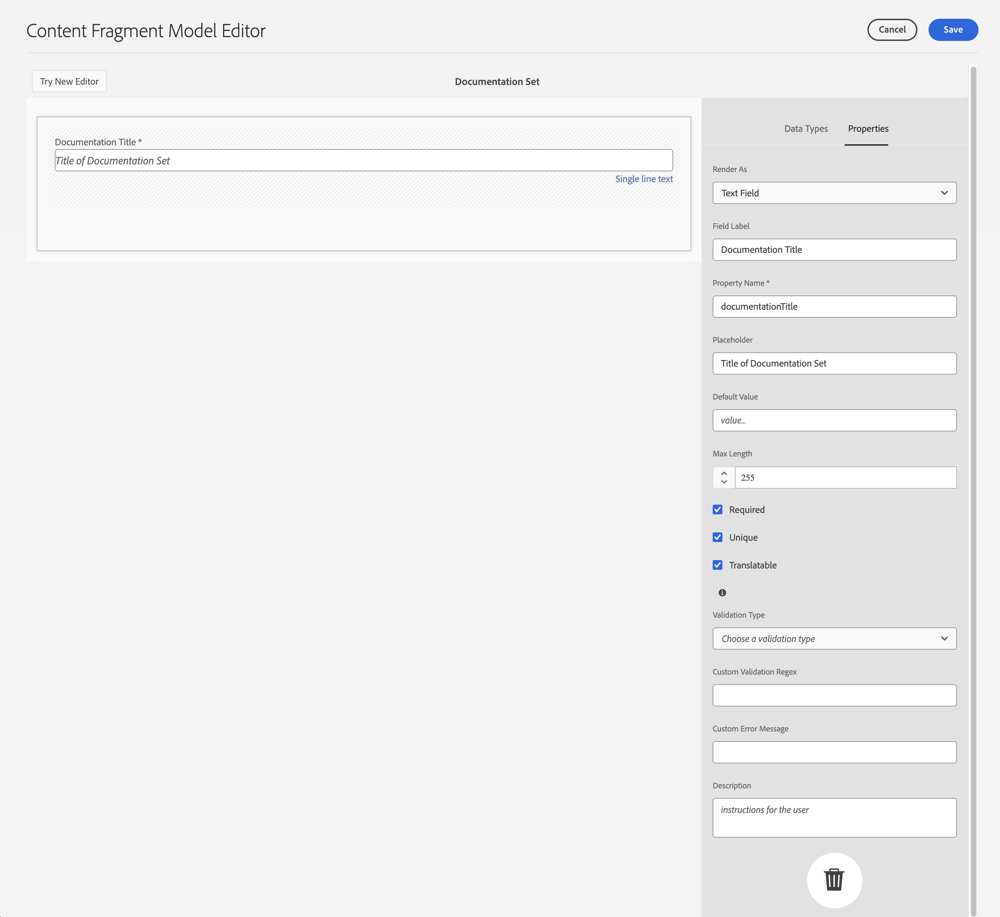
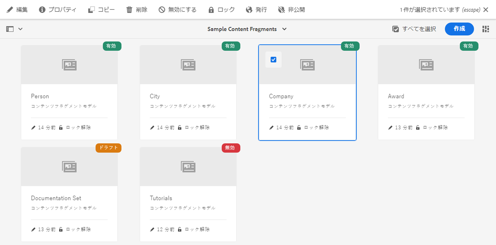

# コンテンツフラグメントモデル {#content-fragment-models}

<!--
>[!CAUTION]
>
>Certain features for Content Fragments will be released in early 2021.
>
>The related documentation is already available for preview purposes.
>
>Please see the [Release Notes](/help/release-notes/release-notes-cloud/release-notes-current.md) for further details.
-->

>[!CAUTION]
>
>AEM GraphQL API(コンテンツフラグメント配信用)は、2021年の初めにリリースされます。
>
>関連ドキュメントは、既にプレビュー目的でご利用いただけます。

コンテンツフラグメントモデルは、[コンテンツフラグメント](/help/assets/content-fragments/content-fragments.md)のコンテンツの構造を定義します。

コンテンツフラグメントモデルを使用するには：

1. [インスタンスに対するコンテンツフラグメントモデル機能の有効化](/help/assets/content-fragments/content-fragments-configuration-browser.md)
1. [コンテンツフラグメントモデルの作成](#creating-a-content-fragment-model)、 [設定](#defining-your-content-fragment-model)、
1. [コンテンツフラグメントの作成時に使用するコンテンツフラグメ](#enabling-disabling-a-content-fragment-model) ントの作成時に使用するコンテンツフラグメントモデルの有効化

## コンテンツフラグメントモデルの作成 {#creating-a-content-fragment-model}

1. **ツール**／**アセット**&#x200B;に移動し、**コンテンツフラグメントモデル**&#x200B;を開きます。
1. 目的の[設定](/help/assets/content-fragments/content-fragments-configuration-browser.md)に適したフォルダーに移動します。
1. 「**作成**」を使用してウィザードを開きます。

   >[!CAUTION]
   >
   >[コンテンツフラグメントモデルの使用が有効になっていない](/help/assets/content-fragments/content-fragments-configuration-browser.md)場合、「**作成**」オプションは使用できません。

1. 「**モデルタイトル**」を指定します。また、必要に応じて&#x200B;**タグ**&#x200B;と&#x200B;**説明**&#x200B;を追加することもできます。

   

1. 「**作成**」を使用して空のモデルを保存します。操作の成功を示すメッセージが表示されます。「**開く**」を選択してモデルをすぐに編集するか、「**完了**」を選択してコンソールに戻ることができます。

## コンテンツフラグメントモデルの定義  {#defining-your-content-fragment-model}

コンテンツフラグメントモデルは、**[データタイプ](#data-types)**&#x200B;の選択を使用して、結果のコンテンツフラグメントの構造を効果的に定義します。 モデルエディターを使用して、データ型のインスタンスを追加し、それらを設定して必須フィールドを作成できます。

>[!CAUTION]
>
>既存のコンテンツフラグメントモデルを編集すると、依存するフラグメントが影響を受ける可能性があります。

1. **ツール**／**アセット**&#x200B;に移動し、**コンテンツフラグメントモデル**&#x200B;を開きます。

1. コンテンツフラグメントモデルが含まれているフォルダーに移動します。
1. 必要なモデルを&#x200B;**編集**&#x200B;用に開きます。クイック操作を使用するか、モデルを選択してツールバーから操作を選択します。

   モデルを開くと、モデルエディターに次の情報が表示されます。

   * 左：既に定義されているフィールド
   * 右：フィールドの作成に使用できる&#x200B;**データタイプ**（およびフィールドの作成後に使用する&#x200B;**プロパティ**）

   >[!NOTE]
   >
   >あるフィールドを&#x200B;**必須**&#x200B;として指定した場合、左側のウィンドウに表示される&#x200B;**ラベル**&#x200B;にアスタリスク（*****）が付きます。

1. **フィールドを追加するには**

   * 必要なデータ型をフィールドの目的の場所にドラッグします。

   * フィールドがモデルに追加されると、その特定のデータタイプに対して定義できる&#x200B;**プロパティ**&#x200B;が右側のパネルに表示されます。ここで、そのフィールドに必要な項目を定義することができます。多くのプロパティは説明がなく、詳しくは[プロパティ](#properties)を参照してください。

1. **フィールドを削除するには**

   必要なフィールドを選択し、ごみ箱アイコンをクリックまたはタップします。この操作の確認が求められます。

1. す追加べての必須フィールドを選択し、必要に応じて関連するプロパティを定義します。

1. 「**保存**」を選択して、定義を保持します。

<!--
## Defining your Content Fragment Model {#defining-your-content-fragment-model}

The content fragment model effectively defines the structure of the resulting content fragments using a selection of **[Data Types](#data-types)**. Using the model editor you can add instances of the data types, then configure them to create the required fields:

>[!CAUTION]
>
>Editing an existing content fragment model can impact dependent fragments.

1. Navigate to **Tools**, **Assets**, then open **Content Fragment Models**.

1. Navigate to the folder holding your content fragment model.
1. Open the required model for **Edit**; use either the quick action, or select the model and then the action from the toolbar.

   Once open the model editor shows:

    * left: fields already defined
    * right: **Data Types** available for creating fields (and **Properties** for use once fields have been created)

   >[!NOTE]
   >
   >When a field as **Required**, the **Label** indicated in the left pane will be marked with an asterix (**&#42;**).

   

1. **To Add a Field**

    * Drag a required data type to the required location for a field:

      

    * Once a field has been added to the model, the right panel will show the **Properties** that can be defined for that particular data type. Here you can define what is required for that field. 
      Many properties are self-explanatory, for additional details see [Properties](#properties).
      For example:

      

1. **To Remove a Field**

   Select the required field, then click/tap the trash-can icon. You will be asked to confirm the action.

   

1. Add all required fields, and define the related properties, as required. For example:

   

1. Select **Save** to persist the definition.
-->

## データタイプ {#data-types}

モデルの定義には、次のデータタイプを選択できます。

* **1 行のテキスト**
   * 追加1行のテキストの1つ以上のフィールド最大長は定義できます
* **複数行テキスト**
   * リッチテキスト、プレーンテキストまたはマークダウンのテキスト領域
* **番号**
   * 数追加値フィールド
* **Boolean**
   * 追加ブール型チェックボックス
* **日時**
   * 日追加時
* **列挙**
   * チェック追加ボックス、ラジオボタン、ドロップダウンフィールドのセット
* **タグ**
   * フラグメント作成者がタグの領域にアクセスして選択できるようにします。
* **コンテンツ参照**
   * 任意の種類の他のコンテンツを参照します。は、[ネストされたコンテンツ](#using-references-to-form-nested-content)の作成に使用できます。

<!--
* **Fragment Reference**
  * References other content fragments; can be used to [create nested content](#using-references-to-form-nested-content)
  * The data type can be configured to allow fragment authors to:
    * Edit the referenced fragment directly.
    * Create a new content fragment, based on the appropriate model  
* **JSON Object**
  * Allows the content fragment author to enter JSON syntax into the corresponding elements of a fragment. 
    * To allow AEM to store direct JSON that you have copy/pasted from another service.
    * The JSON will be passed through, and output as JSON in GraphQL.
    * Includes JSON syntax-highlighting, auto-complete and error-highlighting in the content fragment editor.
-->

## プロパティ {#properties}

多くのプロパティは説明がなく、プロパティによっては次に示す追加の詳細情報があります。

* **Render**
Asフラグメント内のフィールドを実現/レンダリングするための様々なオプション。これにより、作成者に対して、フィールドの1つのインスタンスを表示するか、複数のインスタンスを作成するかを定義できます。

* **フィールド**
ラベル入力 
**フィールド** ラベルは **プロパティ名を自動生成します**。プロパティ名は必要に応じて手動で更新できます。

* **ValidationBasic検証は、**
 **** Requiredプロパティなどのメカニズムで使用できます。一部のデータ型には、追加の検証フィールドがあります。 詳しくは、[検証](#validation)を参照してください。

* データタイプが&#x200B;**複数行テキスト**&#x200B;の場合、「**デフォルトの種類**」を次のいずれかとして定義できます。

   * **リッチテキスト**
   * **Markdown**
   * **プレーンテキスト**

   指定しなかった場合は、デフォルト値の&#x200B;**リッチテキスト**&#x200B;がこのフィールドで使用されます。

   コンテンツフラグメントモデルで「**デフォルトの種類**」を変更した場合、その影響が既存の関連コンテンツフラグメントに及ぶのは、そのフラグメントがエディターで開かれて保存された後です。

<!--
* **Translatable**
  Checking the "Translatable" checkbox on a field in CF model editor will

  * Ensure the field's property name is added in translation config, context `/content/dam/<tenant>`, if not already present. 
  * For GraphQL: set a `<translatable>` property on the Content Fragment field to `yes`, to allow GraphQL query filter for JSON output with only translatable content.

* See **[Fragment Reference (Nested Fragments)](#fragment-reference-nested-fragments)** for more details about that specific data type and its properties.
-->

## 検証 {#validation}

様々なデータ型に、結果のフラグメントにコンテンツが入力される際の検証要件を定義できるようになりました。

* **1 行のテキスト**
   * 事前定義された正規表現と比較します。
* **番号**
   * 特定の値を確認します。

<!--
* **Content Reference**
  * Test for specific types of content.
  * Only images within a predefined range of width and height (in pixels) can be referenced. 
  * Only assets of specified file size or smaller can be referenced. 
  * Only predefined file types can be referenced.
  * No more than the predefined number of assets can be referenced. 
  * No more than the predefined number of fragments can be referenced.
* **Fragment Reference**
  * Test for a specific content fragment model.
-->

<!--
## Using References to form Nested Content {#using-references-to-form-nested-content}

Content Fragments can form nested content, using either of the following data types:

* **[Content Reference](#content-reference)**
  * Provides a simple reference to other content; of any type.
  * Can be configured for a one or multiple references (in the resulting fragment).

* **[Fragment Reference](#fragment-reference-nested-fragments)** (Nested Fragments)
  * References other fragments, dependent on the specific models specified.
  * Allows you to include/retrieve structured data.
    >[!NOTE]
    >
    >This method is of particular interest in conjunction with [Headless Content Delivery using Content Fragments with GraphQL](/help/assets/content-fragments/content-fragments-graphql.md).
  * Can be configured for one or multiple references (in the resulting fragment)..

>[!NOTE]
>
>AEM has a recurrence protection for:
>
>* Content References
>  This prevents the user from adding a reference to the current fragment. This may lead to an empty Fragment Reference picker dialog.
>
>* Fragment References in GraphQL 
>  If you create a deep query that returns multiple Content Fragments referenced by each another, it will return null at first occurence.

### Content Reference {#content-reference}

The Content Reference allows you to render content from another source; for example, image or content fragment.

In addition to standard properties you can specify:

* The **Root Path** for any referenced content.
* The content types that can be referenced.
* Limitations for file sizes.
* Image restraints.
-->

<!-- Check screenshot - might need update

   
-->

<!--
### Fragment Reference (Nested Fragments) {#fragment-reference-nested-fragments}

The Fragment Reference references one, or more, content fragments. This feature of particular interest when retrieving content for use in your app, as it allows you to retrieve structured data with multiple layers.

For example:

* A model defining details for an employee; these include:
  * A reference to the model that defines the employer (company)

```xml
type EmployeeModel {
    name: String
    firstName: String
    company: CompanyModel
}

type CompanyModel {
    name: String
    street: String
    city: String
}
```

>[!NOTE]
>
>This is of particular interest in conjunction with [Headless Content Delivery using Content Fragments with GraphQL](/help/assets/content-fragments/content-fragments-graphql.md).

In addition to standard properties you can define:

* **Render As**:

  * **multifield** - the fragment author can create multiple, individual, references

  * **fragmentreference** - allows the fragment author to select a single reference to a fragment

* **Model Type**
  Multiple models can be selected. When authoring the Content Fragment any referenced fragments must have been created using these models.

* **Root Path**
  This specifies a root path for any fragments referenced.

* **Allow Fragment Creation**

  This will allow the fragment author to create a new fragment based on the appropriate model.
-->

<!--
  * **fragmentreferencecomposite** - allows the fragment author to build a composite, by selecting multiple fragments
-->

<!-- Check screenshot - might need update

   
-->

<!--
>[!NOTE]
>
>A recurrence protection mechanism is in place. It prohibits the user from selecting the current Content Fragment in the Fragment Reference. This may lead to an empty Fragment Reference picker dialog.
>
>There is also a recurrence protection for Fragment References in GraphQL. If you create a deep query across two Content Fragments that reference each other, it will return null.
-->

## コンテンツフラグメントモデルの有効化または無効化{#enabling-disabling-a-content-fragment-model}

コンテンツフラグメントモデルの使用を完全に制御するには、ステータスを設定できます。

### コンテンツフラグメントモデルの有効化{#enabling-a-content-fragment-model}

モデルを作成したら、次の操作を行うために有効にする必要があります。

* は、新しいコンテンツフラグメントの作成時に選択できます。
* コンテンツフラグメントモデル内から参照できます。
* GraphQLで使用可能スキーマが生成されます。

次のいずれかとしてフラグ付けされたモデルを有効にするには：

* **ドラフト** :mew（無効）
* **無効** :は特に無効になっています。

**「**&#x200B;を有効にする」オプションは、次のいずれかから使用します。

* 上部のツールバー（必要なモデルが選択されている場合）。
* 対応するクイックアクション（必要なモデルにマウスを移動）。


### コンテンツフラグメントモデルの無効化{#disabling-a-content-fragment-model}

モデルを無効にして、次の操作を行うこともできます。

* このモデルは、*新しい*&#x200B;コンテンツフラグメントを作成する際の基盤としては使用できなくなりました。
* However:
   * GraphQLスキーマは生成され続け、クエリーも可能です（JSON APIへの影響を回避するため）。
   * モデルに基づくコンテンツフラグメントは、引き続きGraphQLエンドポイントからクエリーおよび返すことができます。
* モデルは参照できなくなりますが、既存の参照は変更されず、引き続きGraphQLエンドポイントからクエリーおよび戻すことができます。

「**有効**」としてフラグ付けされたモデルを無効にするには、次のいずれかの&#x200B;**無効**&#x200B;オプションを使用します。

* 上部のツールバー（必要なモデルが選択されている場合）。
* 対応するクイックアクション（必要なモデルにマウスを移動）。



## コンテンツフラグメントモデルの削除 {#deleting-a-content-fragment-model}

>[!CAUTION]
コンテンツフラグメントモデルを削除すると、依存するフラグメントが影響を受ける可能性があります。

コンテンツフラグメントモデルを削除するには：

1. **ツール**／**アセット**&#x200B;に移動し、**コンテンツフラグメントモデル**&#x200B;を開きます。

1. コンテンツフラグメントモデルが含まれているフォルダーに移動します。
1. モデルを選択し、次にツールバーの「**削除**」を選択します。

   >[!NOTE]
   モデルが参照されている場合は、警告が表示されます。適切に対処します。

## コンテンツフラグメントモデルの公開  {#publishing-a-content-fragment-model}

コンテンツフラグメントモデルは、依存するコンテンツフラグメントの公開時または公開前に公開する必要があります。

コンテンツフラグメントモデルを公開するには：

1. **ツール**／**アセット**&#x200B;に移動し、**コンテンツフラグメントモデル**&#x200B;を開きます。

1. コンテンツフラグメントモデルが含まれているフォルダーに移動します。
1. モデルを選択し、次にツールバーの「**公開**」を選択します。発行済みのステータスがコンソールに示されます。

   >[!NOTE]
   まだ公開されていないモデルのコンテンツフラグメントを公開すると、選択リストにそのことが示され、モデルがフラグメントと共に公開されます。

## コンテンツフラグメントモデルの非公開{#unpublishing-a-content-fragment-model}

コンテンツフラグメントモデルがフラグメントによって参照されていない場合は、そのモデルを非公開にできます。

コンテンツフラグメントモデルを非公開にするには：

1. **ツール**／**アセット**&#x200B;に移動し、**コンテンツフラグメントモデル**&#x200B;を開きます。

1. コンテンツフラグメントモデルが含まれているフォルダーに移動します。
1. モデルを選択し、次にツールバーから&#x200B;**非公開**を選択します。
発行済みのステータスがコンソールに示されます。
