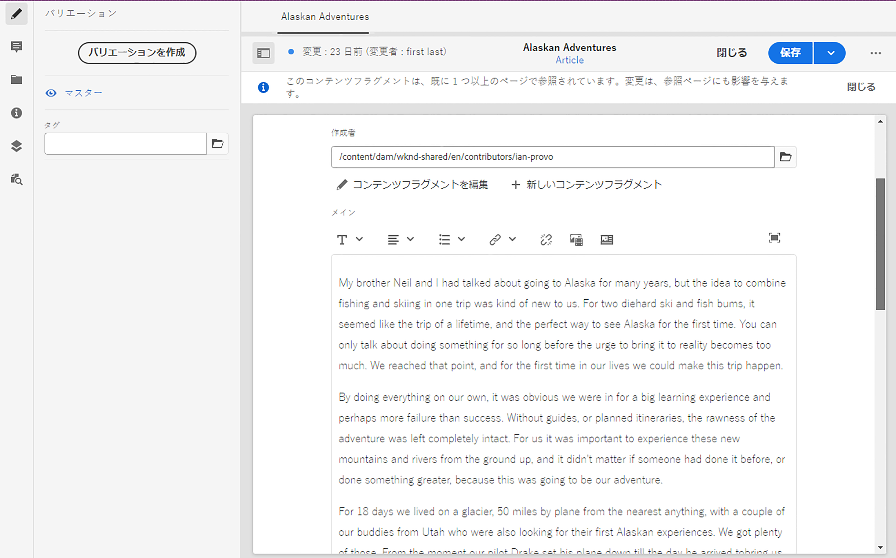
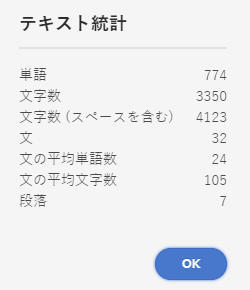
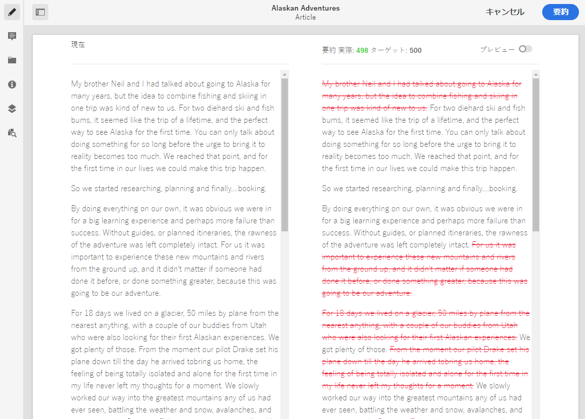
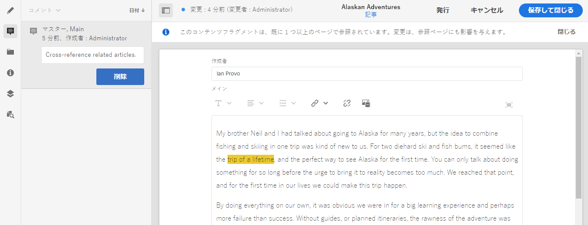
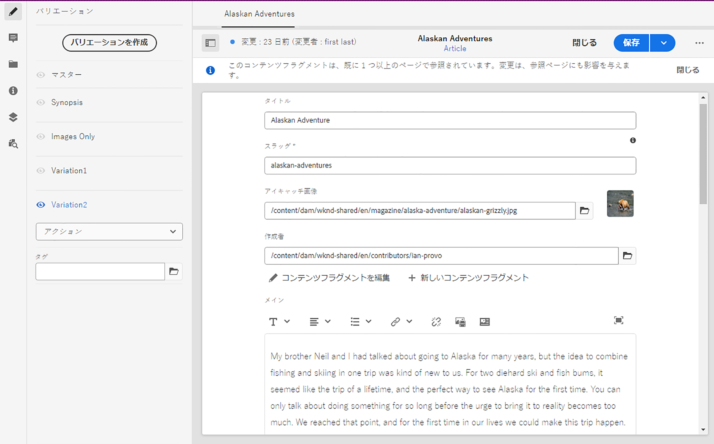
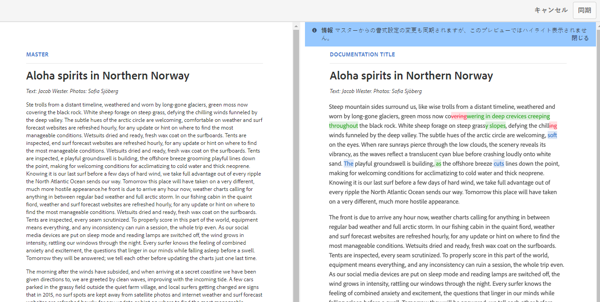

# バリエーション - フラグメントコンテンツのオーサリング{#variations-authoring-fragment-content}

[バリエーション](/help/assets/content-fragments/content-fragments.md#constituent-parts-of-a-content-fragment)は、特定のチャネルやシナリオで使用するためにマスターコンテンツのコピーを作成して編集できる、コンテンツフラグメントの重要な機能です。

「**バリエーション**」タブから、次の操作を実行できます。

* フラグメントの[コンテンツの入力](#authoring-your-content)
* **マスター**&#x200B;コンテンツの[バリエーションの作成および管理](#managing-variations)

編集中のデータタイプに応じて他の様々なアクションを実行します。次に例を示します。

* [フラグメントへのビジュアルアセットの挿入](#inserting-assets-into-your-fragment)（画像）

* 編集する[リッチテキスト](#rich-text)、[プレーンテキスト](#plain-text)および [Markdown](#markdown) の選択

* [コンテンツのアップロード](#uploading-content)

* [重要な統計の表示](#viewing-key-statistics)（複数行テキストについて）

* [テキストの要約](#summarizing-text)

* [バリエーションとマスターコンテンツの同期](#synchronizing-with-master)

>[!CAUTION]
>
>フラグメントが公開または参照（あるいは両方）された後に、作成者がフラグメントを開いて編集しようとすると警告が表示され、フラグメントを変更すると、参照されているページにも影響が及ぶことが警告されます。

## コンテンツのオーサリング {#authoring-your-content}

コンテンツフラグメントを編集用に開くと、デフォルトで「**バリエーション**」タブが開きます。このタブで、マスターまたはバリエーション（ある場合）のコンテンツをオーサリングできます。以下の操作を実行できます。

* 「**バリエーション**」タブで直接編集します。
* [全画面表示エディター](#full-screen-editor)を開いて次のことをおこないます。

   * [形式](#formats)の選択
   * その他の編集オプションの表示（[リッチテキスト](#rich-text)形式の場合）

   * 様々な[アクション](#actions)へのアクセス

次に例を示します。

* 構造化コンテンツを含むフラグメントの編集

   構造化されたフラグメントには、コンテンツモデルで定義された、様々なデータタイプの各種のフィールドが含まれています。複数行フィールドについては、[全画面表示エディター](#full-screen-editor)を使用できます。

   

### 全画面表示エディター {#full-screen-editor}

複数行テキストフィールドの編集時には、全画面表示エディターを開くことができます。実際のテキスト内でタップまたはクリックしてから、次のアクションアイコンを選択します。

全画面表示エディターでは次の情報が表示されます。

* 様々な[アクション](#actions)へのアクセス
* [形式](#formats)に応じた、その他の書式設定オプション（[リッチテキスト](#rich-text)）

### アクション {#actions}

全画面表示エディター（複数行テキスト）を開いている場合は、次のアクションも（すべての[形式](#formats)で）使用できます。

* [形式](#formats)（[リッチテキスト](#rich-text)、[プレーンテキスト](#plain-text)、[Markdown](#markdown)）の選択

* [コンテンツのアップロード](#uploading-content)

* テキストへの[注釈](/help/assets/content-fragments/content-fragments-variations.md#annotating-a-content-fragment)の追加

* [フラグメントへのビジュアルアセットの挿入](#inserting-assets-into-your-fragment)（画像）

* [テキスト統計の表示](#viewing-key-statistics)

* [マスターとの同期](#synchronizing-with-master)（バリエーションの編集時）

* [テキストの要約](#summarizing-text)

### 形式 {#formats}

複数行テキストを編集するためのオプションは、選択した形式によって異なります。

* [リッチテキスト](#rich-text)
* [プレーンテキスト](#plain-text)
* [Markdown](#markdown)

全画面表示エディターでの作業時に形式を選択できます。

### リッチテキスト {#rich-text}

リッチテキストの編集では次の形式を設定できます。

* 太字
* 斜体
* 下線
* 整列：左、中央、右
* 箇条書きリスト
* 番号付きリスト
* インデント：増、減
* ハイパーリンクの作成および解除
* 全画面表示エディターを開く。次の書式設定オプションを使用できます。

   * テキストを貼り付け／Word から貼り付け
   * 表を挿入
   * 段落スタイル：段落、見出し 1/2/3
   * [ビジュアルアセットの挿入](#inserting-assets-into-your-fragment)
   * 検索
   * 検索と置換
   * スペルチェッカー
   * [注釈](/help/assets/content-fragments/content-fragments-variations.md#annotating-a-content-fragment)

[アクション](#actions)は、全画面表示エディターからアクセスすることもできます。

### プレーンテキスト {#plain-text}

プレーンテキストを使用すると、書式設定または Markdown 情報なしでコンテンツをすばやく入力できます。全画面表示エディターを開いて追加の[アクション](#actions)を使用することもできます。

>[!CAUTION]
>
>「**プレーンテキスト**」を選択すると、**リッチテキスト**&#x200B;または **Markdown** に追加した書式、Markdown やアセットは失われます。

### Markdown {#markdown}

>[!NOTE]
>
>詳しくは、[Markdown](/help/assets/content-fragments/content-fragments-markdown.md) の説明を参照してください。

Markdown を使用してテキストの形式を設定できます。次を定義できます。

* 見出し
* 段落と改行
* リンク
* 画像
* ブロック引用
* リスト
* 強調
* コードブロック
* バックスラッシュエスケープ

全画面表示エディターを開いて追加の[アクション](#actions)を使用することもできます。

>[!CAUTION]
>
>**リッチテキスト**&#x200B;と **Markdown** を切り替えると、ブロック引用やコードブロックに予期しない影響が出ることがあります。ブロック引用とコードブロックの 2 つの形式は処理方法が異なる場合があるからです。

### 重要な統計の表示 {#viewing-key-statistics}

全画面表示エディターを開くと、「**テキスト統計**」アクションには、テキストに関する様々な情報が表示されます。

次に例を示します。

### コンテンツのアップロード {#uploading-content}

コンテンツフラグメントのオーサリングのプロセスを簡易化するため、外部エディターで用意したテキストをアップロードしてフラグメントに直接追加できます。

### テキストの要約 {#summarizing-text}

テキストの要約を使用すると、重要ポイントと全体の意味を保ちながら、テキストの長さを規定の単語数に短縮できます。

>[!NOTE]
>
>より技術的に説明すると、特定のアルゴリズムに従って&#x200B;*情報の密度と独自性が最適な比率*&#x200B;であると評価した文章をシステムが保持します。

>[!CAUTION]
>
>コンテンツフラグメントには、親フォルダー（ISO コード）として有効な言語フォルダーが必要です。使用する言語モデルを決定するためにこれが使用されます。
>
>例えば、次のパスの `en/` です。
>
>  `/content/dam/my-brand/en/path-down/my-content-fragment`

>[!CAUTION]
>
>英語版は標準で提供されています。
>他の言語版は、パッケージ共有から言語モデルパッケージとして使用できます。
>* [フランス語（fr）](https://www.adobeaemcloud.com/content/marketplace/marketplaceProxy.html?packagePath=/content/companies/public/adobe/packages/cq630/product/smartcontent-model-fr)
>* [ドイツ語（de）](https://www.adobeaemcloud.com/content/marketplace/marketplaceProxy.html?packagePath=/content/companies/public/adobe/packages/cq630/product/smartcontent-model-de)
>* [イタリア語（it）](https://www.adobeaemcloud.com/content/marketplace/marketplaceProxy.html?packagePath=/content/companies/public/adobe/packages/cq630/product/smartcontent-model-it)
>* [スペイン語（es）](https://www.adobeaemcloud.com/content/marketplace/marketplaceProxy.html?packagePath=/content/companies/public/adobe/packages/cq630/product/smartcontent-model-es)

1. 「**マスター**」または必要なバリエーションを選択します。
2. 全画面表示エディターを開きます。

3. ツールバーの「**テキストを要約**」を選択します。

   

4. ターゲットの単語数を指定し、「**開始**」を選択します。
5. 元のテキストが、提案された要約の横に並んで表示されます。

   * 削除される文には取り消し線が付けられ、赤く表示されます。
   * 強調表示された文をクリックすると、その文書はコンテンツの要約に保持されます。
   * 強調表示されていない文をクリックすると、削除されます。

   

6. 変更を確定するには、「**要約**」を選択します。

### コンテンツフラグメントへの注釈の追加 {#annotating-a-content-fragment}

フラグメントに注釈を追加するには：

1. 「**マスター**」または必要なバリエーションを選択します。
1. 全画面表示エディターを開きます。
1. テキストをどれか選択します。「**注釈**」アイコンが利用可能になります。

   

1. ダイアログが開きます。ここで注釈を入力できます。

1. 全画面表示エディターを閉じ、フラグメントを&#x200B;**保存**&#x200B;します。

### 注釈の表示、編集、削除 {#viewing-editing-deleting-annotations}

注釈：

* エディターの全画面表示モードと通常モードのどちらの場合も、注釈はテキストのハイライトとして示されます。注釈の完全な詳細を表示、編集および削除するには、ハイライト表示されたテキストをクリックします。するとダイアログが再度開きます。

   >[!NOTE]
   >
   >1 つのテキストに複数の注釈が適用されている場合は、ドロップダウンセレクターが表示されます。

* 注釈が適用されたテキスト全体を削除すると、注釈も削除されます。

* 注釈の一覧表示や削除をおこなうには、フラグメントエディターで「**注釈**」タブを選択します。

   

* 選択されたフラグメントの[タイムライン](/help/assets/content-fragments/content-fragments-managing.md#timeline-for-content-fragments)で、注釈の表示や削除をおこなえます。

### フラグメントへのアセットの挿入 {#inserting-assets-into-your-fragment}

コンテンツフラグメントのオーサリングプロセスを容易にするには、[アセット](/help/assets/manage-digital-assets.md)（画像）をフラグメントに直接追加します。

アセットは書式設定なしでフラグメントの段落シーケンスに追加されます。[ページでフラグメントを利用、参照](/help/sites-cloud/authoring/fundamentals/content-fragments.md)する際に書式を設定できます。

>[!CAUTION]
>
>参照ページではこれらのアセットの移動や削除はできません。移動や削除にはフラグメントエディターを使用する必要があります。
>ただし、アセットの書式設定（サイズなど）は、[ページエディター](/help/sites-cloud/authoring/fundamentals/content-fragments.md)でおこなう必要があります。フラグメントエディターでのアセットの表示は、純粋にコンテンツフローのオーサリング用です。

>[!NOTE]
>
>[画像](/help/assets/content-fragments/content-fragments.md#fragments-with-visual-assets)は様々な方法でフラグメントやページに追加できます。

1. 画像を追加したい位置にカーソルを置きます。
2. **アセットを挿入**&#x200B;アイコンを使用して、検索ダイアログを開きます。

   

3. ダイアログでは以下が可能です。

   * DAM で必要なアセットへの移動
   * DAM でアセットの検索

   必要なアセットが見つかったら、サムネールをクリックしてアセットを選択します。

4. 「**選択**」を使用して、コンテンツフラグメント段落システムの現在の位置にアセットを追加します。

   >[!CAUTION]
   >
   >アセットを追加後に形式を変更すると次のようになります。
   >* **プレーンテキスト**：アセットはフラグメントから完全に失われます。
   >* **Markdown**：アセットは表示されなくなりますが、**リッチテキスト**&#x200B;に戻すとアセットがまた表示されます。

## バリエーションの管理 {#managing-variations}

### バリエーションの作成 {#creating-a-variation}

バリエーションでは、**マスター**&#x200B;コンテンツをコピーし、目的に応じて変更を加えることができます（必要な場合）。

新しいバリエーションを作成するには：

1. フラグメントを開き、サイドパネルが表示されていることを確認します。
1. サイドパネルのアイコンバーから「**バリエーション**」を選択します。
1. 「**バリエーションを作成**」を選択します。
1. ダイアログが開きます。新しいバリエーションの&#x200B;**タイトル**&#x200B;と&#x200B;**説明**&#x200B;を指定します。
1. 「**追加**」を選択します。フラグメントの&#x200B;**マスター**&#x200B;が新しいバリエーションにコピーされ、[編集](#editing-a-variation)用に開かれます。

   >[!NOTE]
   >
   >新しいバリエーションを作成すると、常に&#x200B;**マスター**&#x200B;がコピーされます（現在開いているバリエーションではありません）。

### バリエーションの編集 {#editing-a-variation}

以下のいずれかを実行した後に、バリエーションコンテンツを変更できます。

* [バリエーションを作成](#creating-a-variation)する。
* 既存のフラグメントを開いた後、サイドパネルから必要なバリエーションを選択する。

### バリエーションの名前変更 {#renaming-a-variation}

既存のバリエーションの名前を変更するには：

1. フラグメントを開き、サイドパネルから「**バリエーション**」を選択します。
1. 必要なバリエーションを選択します。
1. 「**アクション**」ドロップダウンから「**名前を変更**」を選択します。

1. 表示されたダイアログボックスで新しい「**タイトル**」や「**説明**」を入力します。

1. 「**名前を変更**」アクションを確認します。

>[!NOTE]
>
>この手順はバリエーションの&#x200B;**タイトル**&#x200B;にのみ影響を与えます。

### バリエーションの削除 {#deleting-a-variation}

既存のバリエーションを削除するには：

1. フラグメントを開き、サイドパネルから「**バリエーション**」を選択します。
1. 必要なバリエーションを選択します。
1. 「**アクション**」ドロップダウンから「**削除**」を選択します。

1. ダイアログで「**削除**」アクションを確認します。

>[!NOTE]
>
>**マスター**&#x200B;は削除できません。

### マスターとの同期 {#synchronizing-with-master}

**マスター**&#x200B;はコンテンツフラグメントの必須の部分であり、定義に従ってコンテンツのマスターコピーを保持します。一方、バリエーションはそのコンテンツの更新および適合された個別のバージョンを保持します。マスターを更新した場合、これらの変更はバリエーションにも関連するので、バリエーションに送信する必要があります。

バリエーションの編集時には、バリエーションの現在の要素をマスターと同期させるアクションにアクセスできます。これにより、マスターにおこなわれた変更内容を必要なバリエーションに自動的にコピーできます。

>[!CAUTION]
>
>同期を使用できるのは、変更内容を&#x200B;***マスター**からバリエーションに*&#x200B;コピーする場合のみです。
>バリエーションの現在の要素のみが同期されます。
>同期は、**複数行テキスト**&#x200B;データタイプに対してのみ機能します。
>*バリエーションから&#x200B;**マスター***へ変更内容を転送することはできません。

1. フラグメントエディターでコンテンツフラグメントを開きます。**マスター**&#x200B;が編集されていることを確認します。
1. 特定のバリエーションを選択し、次のいずれかから適切な同期アクションを選択します。

   * 「**アクション**」ドロップダウンセレクター - **現在の要素をマスターと同期**

   * 全画面表示エディターのツールバー - **マスターと同期**

1. マスターとバリエーションが横並びに表示されます。

   * 緑は追加されたコンテンツを示します（バリエーションへの追加）
   * 赤は削除されたコンテンツを示します（バリエーションからの削除）
   * 青は置換されたテキストを示します

   

1. 「**同期**」を選択すると、バリエーションが更新され、表示されます。
