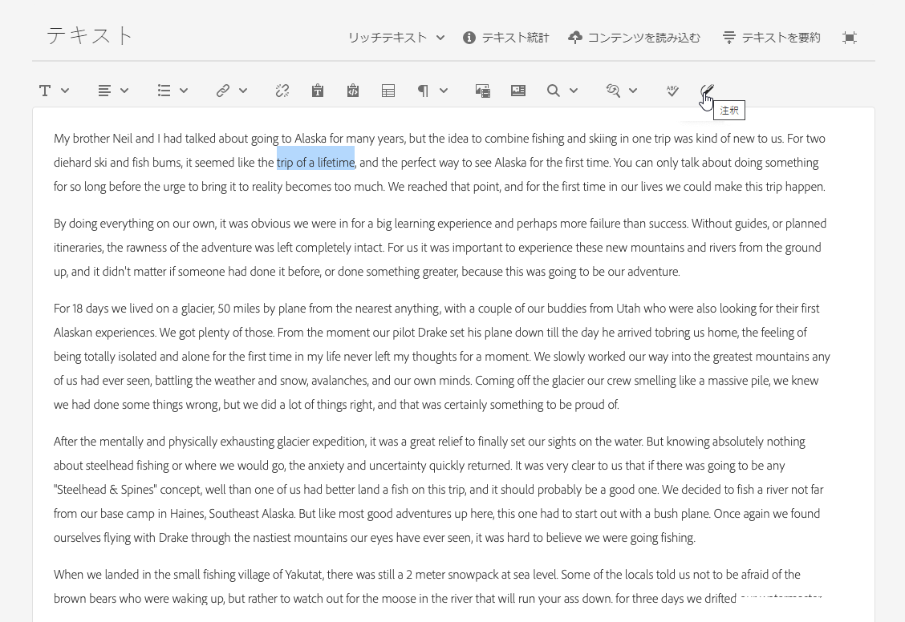
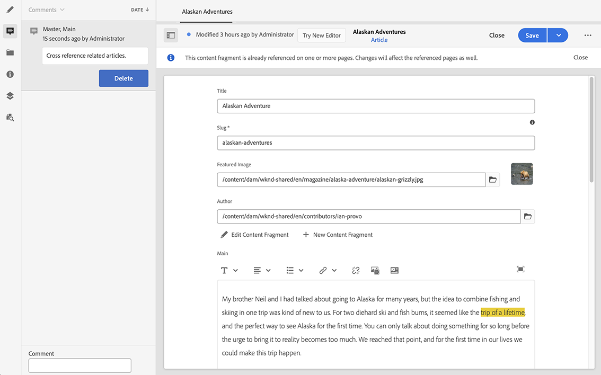

# バリエーション - フラグメントコンテンツのオーサリング{#variations-authoring-fragment-content}

[バリエーション](/help/assets/content-fragments/content-fragments.md#constituent-parts-of-a-content-fragment)は、Adobe Experience Manager（AEM）as a Cloud Service のコンテンツフラグメントの重要な機能です。これは、特定のチャネルやシナリオで使用するために、**マスター**&#x200B;コンテンツのコピーの作成と編集を行えるからです。これにより、特にヘッドレスコンテンツ配信の柔軟性が高まります。

>[!NOTE]
>
>コンテンツフラグメントは Sites 機能ですが、**Assets** として保存されます。
>
>コンテンツフラグメントをオーサリングするエディターは、新しいエディターと元のエディターの 2 つがあります。新しいエディターがデフォルトです。基本機能は同じですが、いくつか違いがあります。
>
>この節では、元のエディターについて説明します。これは、[新しいエディターを通じて開き](/help/assets/content-fragments/content-fragments-managing.md#opening-the-fragment-editor)ます。
>
>新しいエディターについて詳しくは、Sites のドキュメントの[コンテンツフラグメント - オーサリング](/help/sites-cloud/administering/content-fragments/authoring.md)を参照してください。

「**バリエーション**」タブから、次の操作を実行できます。

* フラグメントの[コンテンツの入力](#authoring-your-content)
* **プライマリ**&#x200B;コンテンツの[バリエーションの作成および管理](#managing-variations)

編集中のデータタイプに応じて他の様々なアクションを実行します。次に例を示します。

* [フラグメントへのビジュアルアセットの挿入](#inserting-assets-into-your-fragment)（画像）

* [リッチテキスト](#rich-text)、[プレーンテキスト](#plain-text)および[マークダウン](#markdown)から選択して編集

* [コンテンツのアップロード](#uploading-content)

* [重要な統計の表示](#viewing-key-statistics)（複数行テキストについて）

* [テキストの要約](#summarizing-text)

* [バリエーションとプライマリコンテンツの同期](#synchronizing-with-master)

>[!CAUTION]
>
>フラグメントを公開、参照、または両方の操作が実行された後、作成者が再度編集するためにフラグメントを開くと、AEM で警告が表示されます。これは、フラグメントを変更すると、参照されているページにも影響が及ぶことを警告するものです。

## コンテンツのオーサリング {#authoring-your-content}

コンテンツフラグメントを元のエディターで編集用に開くと、デフォルトで「**バリエーション**」タブが開きます。このタブで、プライマリまたはバリエーション（ある場合）のコンテンツをオーサリングできます。構造化されたフラグメントには、コンテンツモデルで定義された、様々なデータタイプの各種フィールドが含まれています。

次に例を示します。

以下の操作を実行できます。

* 「**バリエーション**」タブでコンテンツを直接編集します。データタイプごとに異なる編集オプションが用意されています。次に例を示します。

   * モデルで（複数として）設定した際、様々なデータタイプを使用して、関連するフィールドのインスタンスを&#x200B;**追加**&#x200B;できます。

   * **複数行テキスト**&#x200B;フィールドの場合は、[全画面表示エディター](#full-screen-editor)を開いて次の操作をおこなうこともできます。

      * [形式](#formats)の選択
      * その他の編集オプションの表示（[リッチテキスト](#rich-text)形式の場合）
      * 様々な[アクション](#actions)へのアクセス

   * **フラグメント参照**&#x200B;フィールドの場合は、モデル定義に応じて、「[コンテンツフラグメントを編集](#fragment-references-edit-content-fragment)」オプションを使用できます。

* **タグ**&#x200B;を現在のバリエーションに割り当てます。タグは、追加、更新、削除できます。

   * [タグ](/help/sites-cloud/authoring/sites-console/tags.md)は、コンテンツの分類に使用できるので、フラグメントを整理する際に特に効果を発揮します。タグを使用して、コンテンツを（タグで）検索したり、一括操作を適用したりできます。

      * タグを検索すると、フラグメントが返され、タグのバリエーションがハイライト表示されます。
      * バリエーション名を使用する代わりに、バリエーションタグを使用して、特定のコンテンツ配信ネットワーク（CDN）プロファイル（CDN キャッシュ用）のバリエーションをグループ化することもできます。

     例えば、関係のあるフラグメントを「クリスマスローンチ」としてタグ付けして、これらのフラグメントだけをサブセットとして閲覧できるようにしたり、今後の別のローンチで使用するために新しいフォルダーにコピーしたりできます。

  >[!NOTE]
  >
  >**タグ**&#x200B;は、[メタデータ](/help/assets/content-fragments/content-fragments-metadata.md)の一部として（**マスター**&#x200B;バリエーションに）追加することもできます

* [マスター](#managing-variations)コンテンツの&#x200B;**バリエーションの作成および管理.**

>[!NOTE]
>
>基になるモデルの定義に応じて、フィールドは特定タイプの[検証](/help/assets/content-fragments/content-fragments-models.md#validation)の対象となる場合があります。

### 全画面表示エディター {#full-screen-editor}

複数行テキストフィールドの編集時には、全画面表示エディターを開くことができます。実際のテキスト内で選択してから、次のアクションアイコンを選択します。

これで全画面表示テキストエディターが開きます。

全画面表示エディターでは次の操作ができます。

* 様々な[アクション](#actions)へのアクセス
* [形式](#formats)に応じた、追加の書式設定オプション（[リッチテキスト](#rich-text)）

### アクション {#actions}

全画面表示エディター（複数行テキスト）を開いている場合は、次のアクションも（すべての[形式](#formats)で）使用できます。

* [形式](#formats)（[リッチテキスト](#rich-text)、[プレーンテキスト](#plain-text)、[マークダウン](#markdown)）の選択

* [コンテンツのアップロード](#uploading-content)

* [テキスト統計の表示](#viewing-key-statistics)

* [プライマリとの同期](#synchronizing-with-master)（バリエーションの編集時）

* [テキストの要約](#summarizing-text)

### 形式 {#formats}

複数行テキストを編集するためのオプションは、選択した形式によって異なります。

* [リッチテキスト](#rich-text)
* [プレーンテキスト](#plain-text)
* [マークダウン](#markdown)

全画面表示エディターでの作業時に形式を選択できます。

### リッチテキスト {#rich-text}

リッチテキストの編集では、以下の書式を設定できます。

* 太字
* 斜体
* 下線
* 整列：左、中央、右
* 箇条書きリスト
* 番号付きリスト
* インデント：増減
* ハイパーリンクの作成および解除
* テキストをペースト／Word からペースト
* 表を挿入
* 段落スタイル：段落、見出し 1/2/3
* [アセットを挿入](#inserting-assets-into-your-fragment)
* 全画面表示エディターを開く。次の書式設定オプションを使用できます。
   * 検索
   * 検索と置換
   * スペルチェッカー
   * [注釈](/help/assets/content-fragments/content-fragments-variations.md#annotating-a-content-fragment)
* [コンテンツフラグメントを挿入](#inserting-content-fragment-into-your-fragment)は、「**複数行テキスト**」フィールドが「**フラグメント参照を許可**」に設定されている場合に使用できます。

[アクション](#actions)は、全画面表示エディターからアクセスすることもできます。

### プレーンテキスト {#plain-text}

プレーンテキストを使用すると、書式設定または Markdown 情報なしでコンテンツをすばやく入力できます。全画面表示エディターを開いて追加の[アクション](#actions)を使用することもできます。

>[!CAUTION]
>
>「**プレーンテキスト**」を選択すると、**リッチテキスト**&#x200B;または **Markdown** に追加した書式、Markdown、およびアセットは失われます。

### マークダウン {#markdown}

>[!NOTE]
>
>詳しくは、[マークダウン](/help/assets/content-fragments/content-fragments-markdown.md)のドキュメントを参照してください。

これにより、マークダウンを使用してテキストを書式設定できます。以下を定義できます。

* 見出し
* 段落と改行
* リンク
* 画像
* ブロック引用
* リスト
* 強調
* コードブロック
* バックスラッシュエスケープ

全画面表示エディターを開いて追加の[アクション](#actions)を使用することもできます。

>[!CAUTION]
>
>**リッチテキスト**&#x200B;と **Markdown** を切り替えると、ブロック引用やコードブロックに予期しない影響が出ることがあります。ブロック引用とコードブロックの 2 つの形式は処理方法が異なる場合があるからです。

### フラグメント参照 {#fragment-references}

コンテンツフラグメントモデルにフラグメント参照が含まれる場合、フラグメント作成者には次の追加オプションがあります。

* [コンテンツフラグメントを編集](#fragment-references-edit-content-fragment)
* [新しいコンテンツフラグメント](#fragment-references-new-content-fragment)

#### コンテンツフラグメントを編集 {#fragment-references-edit-content-fragment}

「**コンテンツフラグメントを編集**」オプションを選択すると、そのフラグメントが新しいエディタータブ（同じブラウザータブ内）で開きます。

元のタブを再度選択すると（例：**Little Pony Inc.**）、このセカンダリタブ（この場合は **Adam Smith**）が閉じます。

#### 新しいコンテンツフラグメント {#fragment-references-new-content-fragment}

「**新しいコンテンツフラグメント**」オプションで、フラグメントを作成できます。このために、コンテンツフラグメント作成ウィザードがエディターで開きます。

**コンテンツフラグメントを作成するには：**

1. 目的のフォルダーに移動して選択します。
1. 「**次へ**」を選択します。
1. プロパティを指定します（例：**タイトル**）
1. 「**作成**」を選択します。
1. 最後に、
   1. **完了**:
      * （元のフラグメントに）戻ります
      * 新しいフラグメントを参照します
   1. **開く**:
      * 新しいフラグメントを参照します
      * 新しいフラグメントを開いて、新しいブラウザータブで編集します

### 重要な統計の表示 {#viewing-key-statistics}

全画面表示エディターを開くと、「**テキスト統計**」アクションには、テキストに関する様々な情報が表示されます。

次に例を示します。

### コンテンツのアップロード {#uploading-content}

コンテンツフラグメントのオーサリングのプロセスを簡易化するため、外部エディターで用意したテキストをアップロードしてフラグメントに直接追加できます。

### テキストの要約 {#summarizing-text}

テキストの要約を使用すると、重要ポイントと全体の意味を保ちながら、テキストの長さを規定の単語数に短縮できます。

>[!NOTE]
>
>より技術的に説明すると、特定のアルゴリズムに従って&#x200B;*情報の密度と独自性が最適な比率*&#x200B;であると評価した文章をシステムが保持します。

>[!CAUTION]
>
>コンテンツフラグメントには、親フォルダー（ISO コード）として有効な言語フォルダーが必要です。使用する言語モデルを決定するためにこれが使用されます。
>
>例えば、次のパスの `en/` です。
>
>  `/content/dam/my-brand/en/path-down/my-content-fragment`

>[!CAUTION]
>
>英語版は標準で提供されています。
>
>他の言語版は、ソフトウェア配布から言語モデルパッケージとして使用できます。
>
>* [フランス語（fr）](https://experience.adobe.com/#/downloads/content/software-distribution/en/aem.html?lang=ja?package=/content/software-distribution/en/details.html/content/dam/aem/public/adobe/packages/cq630/product/smartcontent-model-fr)
>* [ドイツ語（de）](https://experience.adobe.com/#/downloads/content/software-distribution/en/aem.html?lang=ja?package=/content/software-distribution/en/details.html/content/dam/aem/public/adobe/packages/cq630/product/smartcontent-model-de)
>* [イタリア語（it）](https://experience.adobe.com/#/downloads/content/software-distribution/en/aem.html?lang=ja?package=/content/software-distribution/en/details.html/content/dam/aem/public/adobe/packages/cq630/product/smartcontent-model-it)
>* [スペイン語（es）](https://experience.adobe.com/#/downloads/content/software-distribution/en/aem.html?lang=ja?package=/content/software-distribution/en/details.html/content/dam/aem/public/adobe/packages/cq630/product/smartcontent-model-es)
>

1. 「**プライマリ**」または必要なバリエーションを選択します。
1. 全画面表示エディターを開きます。

1. ツールバーの「**テキストを要約**」を選択します。

   

1. ターゲットの単語数を指定し、「**開始**」を選択します。
1. 元のテキストが、提案された要約と並べて表示されます。

   * 削除される文には取り消し線が付き、赤色で表示されます。
   * 強調表示された文をクリックして、要約されたコンテンツに保持できます。
   * 強調表示されていない文をクリックすると、削除できます。

1. 変更を確定するには、「**要約**」を選択します。

1. 元のテキストが、提案された要約と並べて表示されます。

   * 削除される文には取り消し線が付き、赤色で表示されます。
   * 強調表示された文をクリックして、要約されたコンテンツに保持できます。
   * 強調表示されていない文をクリックすると、削除できます。
   * 要約統計（**実際**&#x200B;と&#x200B;**ターゲット**）が表示されます。
   * 変更を&#x200B;**プレビュー**&#x200B;できます。

   

### コンテンツフラグメントへの注釈の追加 {#annotating-a-content-fragment}

フラグメントに注釈を追加するには：

1. 「**プライマリ**」または必要なバリエーションを選択します。

1. 全画面表示エディターを開きます。

1. 上部のツールバーに、**注釈**&#x200B;アイコンが表示されます。必要に応じて、一部のテキストを選択できます。

   

1. ダイアログボックスが開きます。ここで注釈を入力できます。

   

1. ダイアログで「**適用**」をクリックします。

   

   選択したテキストに注釈が適用された場合、そのテキストはハイライト表示されたままになります。

   

1. 全画面表示エディターを閉じても、注釈はハイライト表示されたままです。それを選択するとダイアログボックスが開くので、そこで注釈をさらに編集できます。

1. 「**保存**」を選択します。

1. 全画面表示エディターを閉じても、注釈はハイライト表示されたままです。それを選択するとダイアログボックスが開くので、そこで注釈をさらに編集できます。

   

>[!NOTE]
>
>注釈機能では、新しい[コンテンツフラグメントエディター](/help/sites-cloud/administering/content-fragments/authoring.md#commenting-on-your-fragment)で入力したコメントは表示されません。

### 注釈の表示、編集、削除 {#viewing-editing-deleting-annotations}

注釈：

* エディターの全画面表示モードと通常モードのどちらの場合も、注釈はテキストのハイライトとして示されます。強調表示されたテキストをクリックすると、ダイアログが再度開き、注釈の詳細を表示、編集、削除できます。

  >[!NOTE]
  >
  >1 つのテキストに複数の注釈が適用されている場合は、ドロップダウンセレクターが表示されます。

* 注釈が適用されたテキスト全体を削除すると、注釈も削除されます。

* 注釈の一覧表示や削除を行うには、フラグメントエディターで「**注釈**」タブを選択します。

  

* 選択されたフラグメントの[タイムライン](/help/assets/content-fragments/content-fragments-managing.md#timeline-for-content-fragments)で、注釈の表示や削除をおこなえます。

### アセットをフラグメントに挿入 {#inserting-assets-into-your-fragment}

[アセット](/help/assets/manage-digital-assets.md)（画像）をフラグメントに直接追加して、コンテンツフラグメントのオーサリングプロセスを容易にすることができます。

これらは、書式設定なしでフラグメントの段落シーケンスに追加されます。[フラグメントをページ上で使用または参照](/help/sites-cloud/authoring/fragments/content-fragments.md)する際に書式を設定できます。

>[!CAUTION]
>
>参照ページではこれらのアセットの移動や削除はできません。移動や削除にはフラグメントエディターを使用する必要があります。
>
>ただし、アセットの書式設定（サイズなど）は、[ページエディター](/help/sites-cloud/authoring/fragments/content-fragments.md)で行う必要があります。フラグメントエディターでのアセットの表示は、純粋にコンテンツフローのオーサリング用です。

>[!NOTE]
>
>[画像](/help/assets/content-fragments/content-fragments.md#fragments-with-visual-assets)は様々な方法でフラグメントやページに追加できます。

1. 画像を追加したい位置にカーソルを置きます。
1. **アセットを挿入** アイコンを使用して、検索ダイアログを開きます。

   

1. ダイアログボックスで、DAM 内の必要なアセットに移動するか、DAM 内のアセットを検索します。

   必要なアセットが見つかったら、サムネールをクリックしてアセットを選択します。

1. 「**選択**」を使用して、コンテンツフラグメント段落システムの現在の位置にアセットを追加します。

   >[!CAUTION]
   >
   >アセットを追加した後に形式を次のように変更した場合：
   >
   >* **プレーンテキスト**：アセットはフラグメントから完全に失われます。
   >* **マークダウン**：アセットは表示されなくなりますが、**リッチテキスト**&#x200B;に戻すとアセットがまた表示されます。

### コンテンツフラグメントをフラグメントに挿入 {#inserting-content-fragment-into-your-fragment}

コンテンツフラグメントの作成プロセスを容易にするために、別のコンテンツフラグメントをフラグメントに追加することもできます。

これらは参照として、フラグメント内の現在の場所に追加されます。

>[!NOTE]
>
>このオプションは、「**複数行テキスト**」が「**フラグメント参照を許可**」に設定されている場合に使用できます。

>[!CAUTION]
>
>参照ページではこれらのアセットの移動や削除はできません。移動や削除にはフラグメントエディターを使用する必要があります。
>
>ただし、アセットの書式設定（サイズなど）は、[ページエディター](/help/sites-cloud/authoring/fragments/content-fragments.md)で行う必要があります。フラグメントエディターでのアセットの表示は、純粋にコンテンツフローのオーサリング用です。

>[!NOTE]
>
>[画像](/help/assets/content-fragments/content-fragments.md#fragments-with-visual-assets)は様々な方法でフラグメントやページに追加できます。

1. フラグメントを追加したい位置にカーソルを置きます。
1. **コンテンツフラグメントを挿入** アイコンを使用して、検索ダイアログを開きます。

   

1. ダイアログボックスで、Assets フォルダー内の必要なフラグメントに移動するか、フラグメントを検索します。

   必要なフラグメントが見つかったら、サムネールをクリックしてフラグメントを選択します。

1. 「**選択**」を使用して、選択したコンテンツフラグメントへの参照を現在のコンテンツフラグメント（現在の場所）に追加します。

   >[!CAUTION]
   >
   >別のフラグメントへの参照を追加した後に、形式を変更すると次のようになります。
   >
   >* **プレーンテキスト**：参照はフラグメントから完全に失われます。
   >* **Markdown**：参照は残ります。

## 継承 {#inheritance}

継承とは、コンポーネントからコンポーネントへコンテンツを自動的にプッシュできるメカニズムです。継承されたフィールドとバリエーションは、 [マルチサイト管理](/help/assets/content-fragments/content-fragments-msm.md).

継承はキャンセル（その後再度有効化）できます。フラグメントがライブコピーの一部である場合は、コンテキストに応じて、これをバリエーションに対して使用できます。個々のフィールドに対して使用することもできます。

次に例を示します。

* 継承をキャンセル

  

* 継承を再度有効にする（既に継承がキャンセルされている場合）

  

<!--
* Rollout action is also available in Live Copy source

  
-->

## バリエーションの管理 {#managing-variations}

### バリエーションの作成 {#creating-a-variation}

バリエーションでは、**プライマリ**&#x200B;コンテンツをコピーし、目的に応じて変更を加えることができます（必要な場合）。

**バリエーションを作成するには：**

>[!NOTE]
>
>バリエーションにより、オーサー環境と配信時に、コンテンツフラグメントに処理時間も追加されます。 バリエーションの数は管理可能な最小限に抑えることをお勧めします。
>
>ベストプラクティスは、コンテンツフラグメントあたり 10 個のバリエーションを超えないようにすることです。

1. フラグメントを開き、サイドパネルが表示されていることを確認します。
1. サイドパネルのアイコンバーから「**バリエーション**」を選択します。
1. 「**バリエーションを作成**」を選択します。
1. ダイアログボックスが開き、 **タイトル** および **説明** 新しいバリエーション用。
1. 「**追加**」を選択します。フラグメントの&#x200B;**プライマリ**&#x200B;が新しいバリエーションにコピーされ、[編集](#editing-a-variation)用に開かれます。

   >[!NOTE]
   >
   >新しいバリエーションを作成すると、常に&#x200B;**プライマリ**&#x200B;がコピーされます（現在開いているバリエーションではありません）。

   >[!NOTE]
   >
   >新しいバリエーションを作成すると、**マスター**&#x200B;バリエーションに現在割り当てられているすべての&#x200B;**タグ**&#x200B;が新しいバリエーションにコピーされます。

### バリエーションの編集 {#editing-a-variation}

バリエーションのコンテンツは、次のいずれかの操作の後に変更できます。

* [バリエーションの作成](#creating-a-variation)
* 既存のフラグメントを開いて、サイドパネルから必要なバリエーションを選択

### バリエーションの名前変更 {#renaming-a-variation}

1. フラグメントを開き、サイドパネルから「**バリエーション**」を選択します。
1. 必要なバリエーションを選択します。
1. 「**アクション**」ドロップダウンから「**名前を変更**」を選択します。

1. 表示されたダイアログボックスで新しい「**タイトル**」や「**説明**」を入力します。

1. 「**名前を変更**」アクションを確定します。

>[!NOTE]
>
>これはバリエーションの&#x200B;**タイトル**&#x200B;にのみ影響を与えます。

### バリエーションを削除 {#deleting-a-variation}

1. フラグメントを開き、サイドパネルから「**バリエーション**」を選択します。
1. 必要なバリエーションを選択します。
1. 「**アクション**」ドロップダウンから「**削除**」を選択します。

1. ダイアログで「**削除**」アクションを確認します。

>[!NOTE]
>
>**プライマリ**&#x200B;は削除できません。

### プライマリとの同期 {#synchronizing-with-master}

**マスター** はコンテンツフラグメントの一部で、定義により、コンテンツのマスターコピーが格納されます。 一方、バリエーションには、そのコンテンツの個々の更新済みのカスタマイズされたバージョンが含まれます。 プライマリを更新した場合、これらの変更はバリエーションにも関連するので、バリエーションに伝播させる必要があります。

バリエーションの編集時には、バリエーションの現在の要素をプライマリと同期させるアクションにアクセスできます。これにより、プライマリに行われた変更内容を必要なバリエーションに自動的にコピーできます。

>[!CAUTION]
>
>同期を使用できるのは、変更内容を&#x200B;***プライマリ**&#x200B;からバリエーションに*&#x200B;コピーする場合のみです。
>
>バリエーションの現在の要素のみが同期されます。
>
>同期は、**複数行テキスト**&#x200B;データタイプに対してのみ機能します。
>
>*バリエーションから&#x200B;**プライマリ***へ変更内容を転送することはできません。

1. フラグメントエディターでコンテンツフラグメントを開きます。**プライマリ**&#x200B;が編集されていることを確認します。

1. 特定のバリエーションを選択し、次のいずれかから適切な同期アクションを選択します。

   * **アクション**&#x200B;ドロップダウンセレクター - **現在の要素をマスターと同期**

     

   * 全画面表示エディターのツールバー - **マスターと同期**

     

1. プライマリとバリエーションが横並びに表示されます。

   * 緑は（バリエーションに）追加されたコンテンツを示します
   * 赤は削除されたコンテンツを示します（バリエーションからの削除）
   * 青は置換されたテキストを示します

   

1. 「**同期**」を選択すると、バリエーションが更新され、表示されます。
