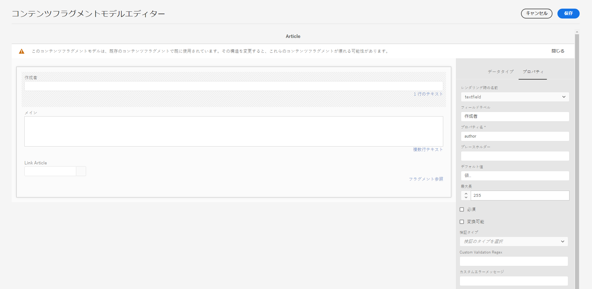

# コンテンツフラグメントと共に使用する AEM GraphQL API {#graphql-api-for-use-with-content-fragments}

Adobe Experience Manager(AEM)のコンテンツフラグメントを、ヘッドレスコンテンツ配信のAEM GraphQL APIとのCloud Serviceとして使用する方法を説明します。

AEMは、コンテンツフラグメントと共に使用されるCloud ServiceGraphQL APIとして、標準のオープンソースのGraphQL APIに大きく基づいています。

AEMでGraphQL APIを使用すると、ヘッドレスCMS実装のJavaScriptクライアントに対して、コンテンツフラグメントを効率的に配信できます。

* REST で API リクエストの反復を回避
* 特定の要件に限定された配信を確保
* 1 つの API クエリへの応答としてレンダリングに必要なものだけを一括配信

>[!NOTE]
>
>GraphQLは現在、Adobe Experience Manager(AEM)の2つの（個別の）シナリオでCloud Serviceとして使用されています。
>
>* [AEMコマースは、GraphQLを介してコマースプラットフォームのデータを使用し](/help/commerce-cloud/integrating/magento.md)、
>* AEMコンテンツフラグメントは、AEM GraphQL API（標準のGraphQLに基づいてカスタマイズされた実装）と連携して、アプリケーションで使用するために構造化されたコンテンツを配信します。


## GraphQL API {#graphql-api}

GraphQL とは次のことを意味します。

* 「*...API のクエリ言語と、既存のデータを使用してこれらのクエリを満たすランタイムです。GraphQL は、API のデータの完全で理解可能な説明を提供し、必要なものを正確に要求する力をクライアントに与え、API の長期的な発展を促し、強力な開発ツールの実現を可能にします。*」

   [GraphQL.org](https://graphql.org) を参照

* 「*...柔軟な API レイヤー用のオープンな仕様。GraphQL を既存のバックエンドに重ね合わせて、以前に比べて迅速に製品を構築…。*」

   「[Explore GraphQL](https://www.graphql.com)」を参照

* *「...2012 年に Facebook 社内で開発されたデータクエリ言語および仕様です。その後、2015 年には公式にオープンソースとなりました。開発者の生産性を高め、転送データの量を最小限に抑えるために、REST ベースのアーキテクチャに代わる手段を提供します。GraphQL は、あらゆる規模の数百の組織により実稼働環境で使用されています...」*

   [GraphQL Foundation](https://foundation.graphql.org/) を参照してください。

<!--
"*Explore GraphQL is maintained by the Apollo team. Our goal is to give developers and technical leaders around the world all of the tools they need to understand and adopt GraphQL.*". 
-->

GraphQL API の詳細については、（多くのリソースの中でも特に）以下を参照してください。

* [graphql.org](https://graphql.org)：

   * [GraphQL の概要](https://graphql.org/learn)

   * [GraphQL の仕様](http://spec.graphql.org/)

* [graphql.com](https://graphql.com)：

   * [ガイド](https://www.graphql.com/guides/)

   * [チュートリアル](https://www.graphql.com/tutorials/)

   * [導入事例](https://www.graphql.com/case-studies/)

AEM 用 GraphQL の実装は、標準の GraphQL Java ライブラリをベースにしています。以下を参照してください。

* [graphQL.org - Java](https://graphql.org/code/#java)

* [GitHub の GraphQL Java](https://github.com/graphql-java)

### GraphQL 用語 {#graphql-terminology}

GraphQL では次を使用します。

* **[クエリ](https://graphql.org/learn/queries/)**

* **[スキーマとタイプ](https://graphql.org/learn/schema/)**：

   * スキーマは、コンテンツフラグメントモデルに基づいて AEM で生成されます。
   * GraphQL では、スキーマを使用して、AEM 用 GraphQL の実装で使用可能なタイプと操作を提供します。

* **[フィールド](https://graphql.org/learn/queries/#fields)**

* **[GraphQL エンドポイント](#graphql-aem-endpoint)**
   * GraphQL クエリに応答し、GraphQL スキーマへのアクセスを提供する AEM 内のパス。

   * 詳しくは、[GraphQL エンドポイントの有効化](#enabling-graphql-endpoint)を参照してください。

[ベストプラクティス](https://graphql.org/learn/best-practices/)を含む包括的な詳細については、「[(GraphQL.org) GraphQL の概要](https://graphql.org/learn/)」を参照してください。

### GraphQL クエリタイプ {#graphql-query-types}

GraphQL では、次のいずれかを返すクエリを実行できます。

* **1 つのエントリ**

* **[エントリのリスト](https://graphql.org/learn/schema/#lists-and-non-null)**

<!--
You can also perform:

* [Persisted Queries, that are cached](#persisted-queries-caching)
-->

## AEM 用 GraphQL のエンドポイント {#graphql-aem-endpoint}

エンドポイントは、AEM 用 GraphQL へのアクセスに使用するパスです。このパスを使用すると、以下が可能になります。

* GraphQL スキーマへのアクセス
* GraphQL クエリの送信
* （GraphQL クエリに対する）応答の受信

AEM 用 GraphQL エンドポイントのリポジトリーパスは次のとおりです。

`/content/cq:graphql/global/endpoint`

アプリは、リクエスト URL で次のパスを使用できます。

`/content/_cq_graphql/global/endpoint.json`

AEM 用 GraphQL のエンドポイントを有効にするには、次の操作が必要です。

>[!CAUTION]
>
>これらの手順は近い将来変更される可能性があります。

* [GraphQL エンドポイントの有効化](#enabling-graphql-endpoint)
* [追加設定の実行](#additional-configurations-graphql-endpoint)

### GraphQL エンドポイントの有効化 {#enabling-graphql-endpoint}

>[!NOTE]
>
>これらの手順を簡単にするためにアドビから提供されるパッケージについて詳しくは、[サポートパッケージ](#supporting-packages)を参照してください。

AEM で GraphQL クエリを有効にするには、`/content/cq:graphql/global/endpoint` にエンドポイントを作成します。

* ノード `cq:graphql` および `global` は `sling:Folder` タイプにする必要があります。
* ノード `endpoint` は `nt:unstructured` タイプで、`graphql/sites/components/endpoint` の `sling:resourceType` を含んでいる必要があります。

>[!CAUTION]
>
>エンドポイントは、すべてのユーザーがアクセスできます。そのため、GraphQL クエリがサーバーに大きな負荷をかける可能性があるので、特にパブリッシュインスタンスでは、セキュリティ上の問題が発生するおそれがあります。
>
>使用例に適した ACL をエンドポイントに設定できます。

>[!NOTE]
>
>エンドポイントはそのままでは機能しません。[GraphQL エンドポイントの追加設定](#additional-configurations-graphql-endpoint)を別途おこなう必要があります。

>[!NOTE]
>また、[GraphiQL IDE](#graphiql-interface) を使用して、GraphQL クエリのテストとデバッグをおこなうこともできます。

### GraphQL エンドポイントの追加設定 {#additional-configurations-graphql-endpoint}

>[!NOTE]
>
>これらの手順を簡単にするためにアドビから提供されるパッケージについて詳しくは、[サポートパッケージ](#supporting-packages)を参照してください。

必要な追加設定は次のとおりです。

* Dispatcher：
   * 必要な URL を許可します
   * 必須
* バニティー URL：
   * エンドポイントの簡略版 URL を割り当てます
   * オプション

### サポートパッケージ {#supporting-packages}

GraphQLエンドポイントの設定を簡単にするために、Adobeは[GraphQL Sample Project (2021.3)](https://experience.adobe.com/#/downloads/content/software-distribution/en/aemcloud.html?package=/content/software-distribution/en/details.html/content/dam/aemcloud/public/aem-graphql/graphql-sample1.zip)パッケージを提供します。

このアーカイブには、[必要な追加設定](#additional-configurations-graphql-endpoint)と [GraphQL エンドポイント](#enabling-graphql-endpoint)の両方が含まれています。プレーン AEM インスタンスにインストールすると、完全に機能する GraphQL エンドポイントが `/content/cq:graphql/global/endpoint` に表示されます。

このパッケージは、独自の GraphQL プロジェクトのブループリントとなることを想定したものです。このパッケージの使用方法について詳しくは、パッケージの **README** を参照してください。

必要な設定を手動で作成する場合に備えて、専用の [GraphQL エンドポイントコンテンツパッケージ](https://experience.adobe.com/#/downloads/content/software-distribution/en/aemcloud.html?package=%2Fcontent%2Fsoftware-distribution%2Fen%2Fdetails.html%2Fcontent%2Fdam%2Faemcloud%2Fpublic%2Faem-graphql%2Fgraphql-global-endpoint.zip)も提供されています。このコンテンツパッケージには、GraphQL エンドポイントのみが含まれ、設定は含まれていません。

## GraphiQL インターフェイス {#graphiql-interface}

<!--
AEM Graph API includes an implementation of the standard [GraphiQL](https://graphql.org/learn/serving-over-http/#graphiql) interface. This allows you to directly input, and test, queries.
-->

標準の [GraphiQL](https://graphql.org/learn/serving-over-http/#graphiql) インターフェイスの実装は、AEM GraphQL で使用できます。これは [AEM と共にインストール](#installing-graphiql-interface)できます。

このインターフェイスを使用すると、クエリを直接入力しテストできます。

例えば、次のようなものです。

* `http://localhost:4502/content/graphiql.html`

構文のハイライト表示機能、オートコンプリート、自動候補表示などの機能と共に、履歴およびオンラインドキュメントが提供されています。


### AEM GraphiQL インターフェイスのインストール {#installing-graphiql-interface}

GraphiQLユーザーインターフェイスは、専用のパッケージを使用してAEMにインストールできます。[GraphiQL Content Package v0.0.6 (2021.3)](https://experience.adobe.com/#/downloads/content/software-distribution/en/aemcloud.html?package=/content/software-distribution/en/details.html/content/dam/aemcloud/public/aem-graphql/graphiql-0.0.6.zip)パッケージ。

<!--
See the package **README** for full details; including full details of how it can be installed on an AEM instance - in a variety of scenarios.
-->

## オーサー環境とパブリッシュ環境の使用例 {#use-cases-author-publish-environments}

使用例は、AEM as a Cloud Service 環境のタイプに応じて異なる場合があります。

* パブリッシュ環境の使用目的：
   * JS アプリケーションのデータのクエリ（標準の使用例）

* オーサー環境の使用目的：
   * 「コンテンツ管理用」のデータのクエリ：
      * AEM as a Cloud Service の GraphQL は現在読み取り専用の API です。
      * CR（U）D 操作には REST API を使用できます。

## 権限 {#permission}

Assets へのアクセスに必要な権限です。

## スキーマ生成 {#schema-generation}

GraphQL は、厳密に型指定された API です。つまり、データは型別に明確に構造化され編成される必要があります。

GraphQL の仕様には、特定のインスタンス上のデータをクエリするための堅牢な API を作成する方法に関する一連のガイドラインが用意されています。そのタスクをおこなうには、クライアントは[スキーマ](#schema-generation)を取得する必要があります。この中には、クエリに必要なすべての型が定義されています。

コンテンツフラグメントの場合、GraphQL スキーマ（構造とタイプ）は、**有効**&#x200B;な[コンテンツフラグメントモデル](/help/assets/content-fragments/content-fragments-models.md)とそれらのデータタイプに基づいています。

>[!CAUTION]
>
>（**有効**&#x200B;になっているコンテンツフラグメントモデルから派生した）すべての GraphQL スキーマは、GraphQL エンドポイントを通じて読み取り可能です。
>
>つまり、漏洩するおそれがあるので、機密データが使用可能になっていないことを確認する必要があります。例えば、これには、モデル定義のフィールド名として存在する可能性のある情報が含まれます。

例えば、ユーザーが `Article` という名前のコンテンツフラグメントモデルを作成した場合、AEMは `ArticleModel` 型のオブジェクト `article` を生成します。この型に含まれるフィールドは、モデルで定義されているフィールドとデータ型に対応しています。

1. コンテンツフラグメントモデル：

   

1. 対応するGraphQLスキーマ（GraphiQLの自動ドキュメントからの出力）:
   

   この図では、生成された型 `ArticleModel` に複数の[フィールド](#fields)が含まれていることがわかります。

   * そのうちの 3 つ（`author`、`main`、`referencearticle`）は、ユーザーが管理しています。

   * その他のフィールド（この例では `_path`、`_metadata`、`_variations`）は AEM によって自動的に追加されたもので、特定のコンテンツフラグメントに関する情報を提供する便利な手段となっています。これらの[ヘルパーフィールド](#helper-fields)は、ユーザーが定義したものと自動生成されたものを区別するために、前に`_`が付いています。

1. ユーザーが Article モデルに基づいてコンテンツフラグメントを作成すると、GraphQL を使用してそれをクエリできます。例については、（[GraphQL で使用するコンテンツフラグメント構造のサンプル](/help/assets/content-fragments/content-fragments-graphql-samples.md#content-fragment-structure-graphql)に基づいた）[サンプルクエリ](/help/assets/content-fragments/content-fragments-graphql-samples.md#graphql-sample-queries)を参照してください。

AEM 用 GraphQL では、スキーマには柔軟性があります。つまり、コンテンツフラグメントモデルを作成、更新、削除するたびに、スキーマが自動生成されます。また、コンテンツフラグメントモデルを更新すると、データスキーマキャッシュも更新されます。

<!--
>[!NOTE]
>
>AEM does not use the concept of namespacing for Content Fragment Models. 
>
>If required, you can edit the **[GraphQL](/help/assets/content-fragments/content-fragments-models.md#content-fragment-model-properties)** properties of a Model to assign specific names.
-->

Sites GraphQL サービスは、コンテンツフラグメントモデルに対する変更を（バックグラウンドで）リッスンします。更新が検出されると、スキーマのその部分だけが再生成されます。この最適化により、時間を節約し、安定性を確保できます。

例えば、次のようになります。

1. `Content-Fragment-Model-1` と `Content-Fragment-Model-2` を含んだパッケージをインストールすると、

   1. `Model-1` と `Model-2` の GraphQL 型が生成されます。

1. 次に `Content-Fragment-Model-2` を変更すると、

   1. `Model-2` GraphQL 型だけが更新されます。

   1. 一方、`Model-1` は同じままです。

>[!NOTE]
>
>REST API を使用してコンテンツフラグメントモデルの一括更新をおこなう場合などには、この点に留意することが大切です。

スキーマは、GraphQL クエリと同じエンドポイントを通じて提供され、クライアントはスキーマが拡張子 `GQLschema` で呼び出されることに対処します。例えば、`/content/cq:graphql/global/endpoint.GQLschema` で単純な `GET` リクエストを実行すると、`text/x-graphql-schema;charset=iso-8859-1` の Content-type を持つスキーマが出力されます。

### スキーマの生成 — 未公開モデル{#schema-generation-unpublished-models}

コンテンツフラグメントがネストされている場合、親のコンテンツフラグメントモデルは発行されるが、参照されているモデルは発行されない可能性があります。

>[!NOTE]
>
>AEM UIはこのような状況を防ぎますが、プログラムやコンテンツパッケージを使用して公開する場合は、この状況が発生する可能性があります。

この場合、AEMは親コンテンツフラグメントモデルに対して&#x200B;*不完全な*&#x200B;スキーマを生成します。 これは、未公開のモデルに依存するフラグメント参照がスキーマから削除されることを意味します。

## フィールド {#fields}

スキーマ内には、次の 2 つの基本的なカテゴリに属する個々のフィールドがあります。

* ユーザーが生成するフィールド

   選択された[フィールドタイプ](#field-types)を使用して、コンテンツフラグメントモデルの設定方法に基づいてフィールドが作成されます。フィールド名は、**データタイプ**&#x200B;の「**プロパティ名**」フィールドから取得されます。

   * また、**レンダリング時の名前**&#x200B;プロパティも考慮する必要があります。ユーザーが特定のデータ型を、例えば、1 行のテキストか複数フィールドのどちらかとして設定できるからです。

* AEM 用 GraphQL が生成する多数の[ヘルパーフィールド](#helper-fields)

   これらは、コンテンツフラグメントを識別するためや、コンテンツフラグメントに関する詳細を取得するために使用されます。

### フィールドタイプ {#field-types}

AEM 用 GraphQL では一連のタイプをサポートしています。サポートされているすべてのコンテンツフラグメントモデルデータ型と、それに対応する GraphQL 型を以下の表に示します。

| コンテンツフラグメントモデル - データ型 | GraphQL の型 | 説明 |
|--- |--- |--- |
| 1行テキスト | String、[String] |  作成者名、場所名などの単純な文字列に使用します。 |
| 複数行テキスト | String |  記事の本文などのテキストを出力するために使用します。 |
| 数値 |  Float、[Float] | 浮動小数点数と整数を表示するために使用します |
| ブール型 |  Boolean |  チェックボックスを表示するために使用します（単純な真／偽のステートメント） |
| 日時 | Calendar |  日時を ISO 8086 形式で表示するために使用します |
| 列挙 |  String |  モデルの作成時に定義されたオプションのリストに含まれるオプションを表示するために使用します |
|  タグ |  [String] |  AEM で使用されているタグを表す文字列のリストを表示するために使用します |
| コンテンツ参照 |  文字列 |  AEM 内の別のアセットへのパスを表示するために使用します |
| フラグメント参照 |  *モデルタイプ* |  特定のモデルタイプの別のコンテンツフラグメントを参照するために使用します（モデルの作成時に定義されます） |

### ヘルパーフィールド {#helper-fields}

ユーザー生成フィールドのデータ型に加えて、AEM 用 GraphQL では、コンテンツフラグメントの識別やコンテンツフラグメントに関する追加情報の提供に役立つ多数の&#x200B;*ヘルパー*&#x200B;フィールドも生成されます。

#### パス {#path}

パスフィールドは、GraphQL で識別子として使用されます。これは、AEM リポジトリー内のコンテンツフラグメントアセットのパスを表します。これをコンテンツフラグメントの識別子として選択した理由は次のとおりです。

* AEM 内で一意である
* 取得しやすい

次のコードでは、コンテンツフラグメントモデル `Person` に基づいて作成されたすべてのコンテンツフラグメントのパスを表示します。

```xml
{
  personList {
    items {
      _path
    }
  }
}
```

特定のタイプのコンテンツフラグメントを 1 つ取得するには、まずそのパスも決定する必要があります。次に例を示します。

```xml
{
  personByPath(_path: "/content/dam/path/to/fragment/john-doe") {
    item {
      _path
      firstName
      name
    }
  }
}
```

[サンプルクエリ - 1 つの特定の都市フラグメント](/help/assets/content-fragments/content-fragments-graphql-samples.md#sample-single-specific-city-fragment)を参照してください。

#### メタデータ {#metadata}

また、AEM では GraphQL を通じて、コンテンツフラグメントのメタデータも公開します。メタデータは、コンテンツフラグメントのタイトル、サムネールパス、コンテンツフラグメントの説明、作成日など、コンテンツフラグメントを説明する情報です。

メタデータはスキーマエディターで生成され、特定の構造を持たないので、コンテンツフラグメントのメタデータを公開するために GraphQL 型 `TypedMetaData` が実装されました。`TypedMetaData` では、次のスカラー型でグループ化された情報を公開します。

| フィールド |
|--- |
| `stringMetadata:[StringMetadata]!` |
| `stringArrayMetadata:[StringArrayMetadata]!` |
| `intMetadata:[IntMetadata]!` |
| `intArrayMetadata:[IntArrayMetadata]!` |
| `floatMetadata:[FloatMetadata]!` |
| `floatArrayMetadata:[FloatArrayMetadata]!` |
| `booleanMetadata:[BooleanMetadata]!` |
| `booleanArrayMetadata:[booleanArrayMetadata]!`  |
| `calendarMetadata:[CalendarMetadata]!` |
| `calendarArrayMetadata:[CalendarArrayMetadata]!` |

各スカラー型は、名前と値の 1 つのペアを表すか、名前と値のペアの配列を表します。このペアの値は、グループ化されたときの型になります。

例えば、コンテンツフラグメントのタイトルを取得する場合は、このプロパティが String 型プロパティであることがわかっているので、すべての String 型メタデータをクエリすることになります。

メタデータをクエリするには、次のようにします。

```xml
{
  personByPath(_path: "/content/dam/path/to/fragment/john-doe") {
    item {
      _path
      _metadata {
        stringMetadata {
          name
          value
        }
      }
    }
  }
}
```

生成された GraphQL スキーマを表示するには、すべてのメタデータ GraphQL 型を表示します。すべてのモデルタイプは同じ `TypedMetaData` を持ちます。

>[!NOTE]
>
>**標準メタデータと配列メタデータの違い**：
>`StringMetadata` と `StringArrayMetadata` はどちらも、リポジトリーに格納されているものについての指定であり、その取得手段についての指定ではありません。
>
>例えば、`stringMetadata` フィールドを呼び出すと、リポジトリーに `String` として格納されているすべてのメタデータの配列を受け取ることになります。一方、`stringArrayMetadata` を呼び出すと、リポジトリーに `String[]` として格納されているすべてのメタデータの配列を受け取ります。

詳しくは、[メタデータのサンプルクエリ - 「GB」という賞のメタデータのリスト](/help/assets/content-fragments/content-fragments-graphql-samples.md#sample-metadata-awards-gb)を参照してください。

#### バリエーション {#variations}

コンテンツフラグメントのバリエーションに対するクエリを簡略化するために、`_variations` フィールドが実装されています。次に例を示します。

```xml
{
  personByPath(_path: "/content/dam/path/to/fragment/john-doe") {
    item {
      _variations
    }
  }
}
```

詳しくは、[サンプルクエリ - 名前付きバリエーションを持つすべての都市](/help/assets/content-fragments/content-fragments-graphql-samples.md#sample-cities-named-variation)を参照してください。

<!--
## Security Considerations {#security-considerations}
-->

## GraphQL 変数 {#graphql-variables}

GraphQL では、クエリに変数を含めることができます。詳しくは、](https://graphql.org/learn/queries/#variables)GraphQL の GraphiQL に関するドキュメント[を参照してください。

例えば、特定のバリエーションを持つ `Article` タイプのコンテンツフラグメントをすべて取得するには、次のように、GraphiQL で変数 `variation` を指定します。


```xml
### query
query GetArticlesByVariation($variation: String!) {
    articleList(variation: $variation) {
        items {
            _path
            author
        }
    }
}
 
### in query variables
{
    "variation": "uk"
}
```

## GraphQL ディレクティブ {#graphql-directives}

GraphQL では、GraphQL ディレクティブ と呼ばれる変数に基づいてクエリを変更する可能性があります。

例えば、変数 `includePrice` に基づいて、すべての `AdventureModels` のクエリに `adventurePrice` フィールドを含めることができます。


```xml
### query
query GetAdventureByType($includePrice: Boolean!) {
  adventureList {
    items {
      adventureTitle
      adventurePrice @include(if: $includePrice)
    }
  }
}
 
### in query variables
{
    "includePrice": true
}
```

## フィルタリング {#filtering}

GraphQL クエリでフィルタリングを使用して、特定のデータを返すこともできます。

フィルタリングでは、論理演算子と論理式に基づいた構文を使用します。

例えば、次の（基本的な）クエリでは、`Jobs` または `Smith` という名前を持つすべての人を抜き出します。

```xml
query {
  personList(filter: {
    name: {
      _logOp: OR
      _expressions: [
        {
          value: "Jobs"
        },
        {
          value: "Smith"
        }
      ]
    }
  }) {
    items {
      name
      firstName
    }
  }
}
```

その他の例については、以下を参照してください。

* [AEM 用 GraphQL の拡張機能](#graphql-extensions)の詳細

* [このサンプルコンテンツおよび構造を使用したサンプルクエリ](/help/assets/content-fragments/content-fragments-graphql-samples.md#graphql-sample-queries-sample-content-fragment-structure)

   * さらに、サンプルクエリ用に準備されている[サンプルコンテンツおよび構造](/help/assets/content-fragments/content-fragments-graphql-samples.md#content-fragment-structure-graphql)

* [WKND プロジェクトに基づいたサンプルクエリ](/help/assets/content-fragments/content-fragments-graphql-samples.md#sample-queries-using-wknd-project)

## AEM 用の GraphQL - 拡張機能の概要 {#graphql-extensions}

AEM 用の GraphQL でのクエリの基本操作は、標準の GraphQL 仕様に従います。AEM での GraphQL クエリには、次のような拡張機能があります。

* 結果が 1 つだけ必要な場合：
   * モデル名（例：city）を使用します

* 結果のリストを想定している場合：
   * モデル名に `List` を付け加えます（例：`cityList`）
   * [サンプルクエリ - すべての都市に関するすべての情報](#sample-all-information-all-cities)を参照してください

* 論理和（OR）を使用する場合：
   * ` _logOp: OR` を使用します
   * [サンプルクエリ - 「Jobs」または「Smith」という名前を持つすべての人物](#sample-all-persons-jobs-smith)を参照してください

* 論理積（AND）も存在しますが、（多くの場合）暗黙的です

* コンテンツフラグメントモデル内のフィールドに対応するフィールド名に対してクエリを実行できます
   * [サンプルクエリ - ある会社の CEO と従業員の詳細](#sample-full-details-company-ceos-employees)を参照してください

* モデルのフィールドに加えて、システム生成フィールドがいくつかあります（前にアンダースコアが付いています）。

   * コンテンツの場合：

      * `_locale`：言語を表示します（言語マネージャーに基づく）
         * [特定ロケールの複数のコンテンツフラグメントのサンプルクエリ](#sample-wknd-multiple-fragments-given-locale)を参照してください
      * `_metadata`：フラグメントのメタデータを表示します
         * [メタデータのサンプルクエリ - 「GB」という賞のメタデータのリスト](#sample-metadata-awards-gb)を参照してください
      * `_model`：コンテンツフラグメントモデル（パスとタイトル）のクエリを許可します
         * [モデルからのコンテンツフラグメントモデルのサンプルクエリ](#sample-wknd-content-fragment-model-from-model)を参照してください
      * `_path` :リポジトリ内のコンテンツフラグメントへのパス
         * [サンプルクエリ - 1 つの特定の都市フラグメント](#sample-single-specific-city-fragment)を参照してください
      * `_reference`：参照（リッチテキストエディターでのインライン参照など）を表示します
         * [プリフェッチされた参照を含んだ複数のコンテンツフラグメントのサンプルクエリ](#sample-wknd-multiple-fragments-prefetched-references)を参照してください
      * `_variation`：コンテンツフラグメント内の特定のバリエーションを表示します
         * [サンプルクエリ - 名前付きバリエーションを持つすべての都市](#sample-cities-named-variation)を参照してください
   * 操作の場合：

      * `_operator`：特定の演算子（`EQUALS`、`EQUALS_NOT`、`GREATER_EQUAL`、`LOWER`、`CONTAINS`）を適用します, `STARTS_WITH`
         * [サンプルクエリ - 「Jobs」という名前を持たないすべての人物](#sample-all-persons-not-jobs)を参照してください
         * [サンプルクエリ — 特定のプレフィックス](#sample-wknd-all-adventures-cycling-path-filter)を持つ`_path`開始が出現するすべての冒険を参照
      * `_apply`：特定の条件（例：`AT_LEAST_ONCE`）を適用します
         * [サンプルクエリ - 少なくとも 1 回は現れる項目を含んだ配列をフィルタリング](#sample-array-item-occur-at-least-once)を参照してください
      * `_ignoreCase`：クエリの実行時に大文字と小文字を区別しません
         * [サンプルクエリ - 名前に SAN が含まれるすべての都市（大文字と小文字を区別しない場合）](#sample-all-cities-san-ignore-case)を参照してください


* GraphQL のユニオン型がサポートされています

   * `... on` を使用します
      * [特定モデルのコンテンツフラグメントのうちコンテンツ参照を含んだものを取得するサンプルクエリ](#sample-wknd-fragment-specific-model-content-reference)を参照してください

<!--
## Persisted Queries (Caching) {#persisted-queries-caching}

After preparing a query with a POST request, it can be executed with a GET request that can be cached by HTTP caches or a CDN.

This is required as POST queries are usually not cached, and if using GET with the query as a parameter there is a significant risk of the parameter becoming too large for HTTP services and intermediates.

Here are the steps required to persist a given query:

>[!NOTE]
>Prior to this the **GraphQL Persistence Queries** need to be enabled, for the appropriate configuration. See [Enable Content Fragment Functionality in Configuration Browser](/help/assets/content-fragments/content-fragments-configuration-browser.md#enable-content-fragment-functionality-in-configuration-browser) for more details.

1. Prepare the query by PUTing it to the new endpoint URL `/graphql/persist.json/<config>/<persisted-label>`.

   For example, create a persisted query:

   ```xml
   $ curl -X PUT \
       -H 'authorization: Basic YWRtaW46YWRtaW4=' \
       -H "Content-Type: application/json" \
       "http://localhost:4502/graphql/persist.json/wknd/plain-article-query" \
       -d \
   '{
     articleList {
       items{
           _path
           author
           main {
               json
           }
       }
     }
   }'
   ```

1. At this point, check the response.

   For example, check for success:

     ```xml
     {
       "action": "create",
       "configurationName": "wknd",
       "name": "plain-article-query",
       "shortPath": "/wknd/plain-article-query",
       "path": "/conf/wknd/settings/graphql/persistentQueries/plain-article-query"
     }
     ```

1. You can then replay the persisted query by GETing the URL `/graphql/execute.json/<shortPath>`.

   For example, use the persisted query:

   ```xml
   $ curl -X GET \
       http://localhost:4502/graphql/execute.json/wknd/plain-article-query
   ```

1. Update a persisted query by POSTing to an already existing query path.

   For example, use the persisted query:

   ```xml
   $ curl -X POST \
       -H 'authorization: Basic YWRtaW46YWRtaW4=' \
       -H "Content-Type: application/json" \
       "http://localhost:4502/graphql/persist.json/wknd/plain-article-query" \
       -d \
   '{
     articleList {
       items{
           _path
           author
           main {
               json
           }
         referencearticle {
           _path
         }
       }
     }
   }'
   ```

1. Create a wrapped plain query.

   For example:

   ```xml
   $ curl -X PUT \
       -H 'authorization: Basic YWRtaW46YWRtaW4=' \
       -H "Content-Type: application/json" \
       "http://localhost:4502/graphql/persist.json/wknd/plain-article-query-wrapped" \
       -d \
   '{ "query": "{articleList { items { _path author main { json } referencearticle { _path } } } }"}'
   ```

1. Create a wrapped plain query with cache control.

   For example:

   ```xml
   $ curl -X PUT \
       -H 'authorization: Basic YWRtaW46YWRtaW4=' \
       -H "Content-Type: application/json" \
       "http://localhost:4502/graphql/persist.json/wknd/plain-article-query-max-age" \
       -d \
   '{ "query": "{articleList { items { _path author main { json } referencearticle { _path } } } }", "cache-control": { "max-age": 300 }}'
   ```

1. Create a persisted query with parameters:

   For example:

   ```xml
   $ curl -X PUT \
       -H 'authorization: Basic YWRtaW46YWRtaW4=' \
       -H "Content-Type: application/json" \
       "http://localhost:4502/graphql/persist.json/wknd/plain-article-query-parameters" \
       -d \
   'query GetAsGraphqlModelTestByPath($apath: String!, $withReference: Boolean = true) {
     articleByPath(_path: $apath) {
       item {
         _path
           author
           main {
           plaintext
           }
           referencearticle @include(if: $withReference) {
           _path
           }
         }
       }
     }'
   ```

1. Executing a query with parameters.

   For example:

   ```xml
   $ curl -X POST \
       -H 'authorization: Basic YWRtaW46YWRtaW4=' \
       -H "Content-Type: application/json" \
       "http://localhost:4502/graphql/execute.json/wknd/plain-article-query-parameters;apath=%2fcontent2fdam2fwknd2fen2fmagazine2falaska-adventure2falaskan-adventures;withReference=false"

   $ curl -X GET \
       "http://localhost:4502/graphql/execute.json/wknd/plain-article-query-parameters;apath=%2fcontent2fdam2fwknd2fen2fmagazine2falaska-adventure2falaskan-adventures;withReference=false"
   ```

1. To execute the query on publish, the related persist tree need to replicated

   * Using a POST for replication:

     ```xml
     $curl -X POST   http://localhost:4502/bin/replicate.json \
       -H 'authorization: Basic YWRtaW46YWRtaW4=' \
       -F path=/conf/wknd/settings/graphql/persistentQueries/plain-article-query \
       -F cmd=activate
     ```

   * Using a package:
     1. Create a new package definition.
     1. Include the configuration (for example, `/conf/wknd/settings/graphql/persistentQueries`).
     1. Build the package.
     1. Replicate the package.

   * Using replication/distribution tool.
     1. Go to the Distribution tool.
     1. Select tree activation for the configuration (for example, `/conf/wknd/settings/graphql/persistentQueries`).

   * Using a workflow (via workflow launcher configuration):
     1. Define a workflow launcher rule for executing a workflow model that would replicate the configuration on different events (for example, create, modify, amongst others).

1. Once the query configuration is on publish, the same principles apply, just using the publish endpoint.

   >[!NOTE]
   >
   >For anonymous access the system assumes that the ACL allows "everyone" to have access to the query configuration.
   >
   >If that is not the case it will not be able to execute.

   >[!NOTE]
   >
   >Any semicolons (";") in the URLs need to be encoded.
   >
   >For example, as in the request to Execute a persisted query:
   >
   >```xml
   >curl -X GET \ "http://localhost:4502/graphql/execute.json/wknd/plain-article-query-parameters%3bapath=%2fcontent2fdam2fwknd2fen2fmagazine2falaska-adventure2falaskan-adventures;withReference=false"
   >```
-->

## 外部 Web サイトからの GraphQL エンドポイントのクエリ {#query-graphql-endpoint-from-external-website}

外部WebサイトからGraphQLエンドポイントにアクセスするには、次の項目を設定する必要があります。

* [CORSフィルター](#cors-filter)
* [転送者フィルタ](#referrer-filter)

### CORSフィルタ{#cors-filter}

>[!NOTE]
>
>AEM での CORS リソース共有ポリシーについて詳しくは、[クロスオリジンリソース共有（CORS）について](https://experienceleague.adobe.com/docs/experience-manager-learn/foundation/security/understand-cross-origin-resource-sharing.html?lang=ja#understand-cross-origin-resource-sharing-(cors))を参照してください。

GraphQLエンドポイントにアクセスするには、お客様のGitリポジトリでCORSポリシーを設定する必要があります。 これは、目的のエンドポイントに適切なOSGi CORS設定ファイルを追加することで行います。

この設定では、アクセスを許可する必要がある信頼できるWebサイト接触チャネル`alloworigin`または`alloworiginregexp`を指定する必要があります。

<!--
For example, to grant access to the GraphQL endpoint and persisted queries endpoint for `https://my.domain` you can use:
-->

例えば、`https://my.domain`のGraphQLエンドポイントへのアクセスを許可するには、次を使用します。

<!--
```xml
{
  "supportscredentials":true,
  "supportedmethods":[
    "GET",
    "HEAD",
    "POST"
  ],
  "exposedheaders":[
    ""
  ],
  "alloworigin":[
    "https://my.domain"
  ],
  "maxage:Integer":1800,
  "alloworiginregexp":[
    ""
  ],
  "supportedheaders":[
    "Origin",
    "Accept",
    "X-Requested-With",
    "Content-Type",
    "Access-Control-Request-Method",
    "Access-Control-Request-Headers"
  ],
  "allowedpaths":[
    "/content/_cq_graphql/global/endpoint.json",
    "/graphql/execute.json/.*"
  ]
}
```
-->

```xml
{
  "supportscredentials":true,
  "supportedmethods":[
    "GET",
    "HEAD",
    "POST"
  ],
  "exposedheaders":[
    ""
  ],
  "alloworigin":[
    "https://my.domain"
  ],
  "maxage:Integer":1800,
  "alloworiginregexp":[
    ""
  ],
  "supportedheaders":[
    "Origin",
    "Accept",
    "X-Requested-With",
    "Content-Type",
    "Access-Control-Request-Method",
    "Access-Control-Request-Headers"
  ],
  "allowedpaths":[
    "/content/_cq_graphql/global/endpoint.json"
  ]
}
```

エンドポイントのバニティパスを設定した場合は、`allowedpaths`でも使用できます。

### 転送者フィルタ{#referrer-filter}

CORSの設定に加えて、サードパーティのホストからのアクセスを許可する転送者フィルターを設定する必要があります。

これは、次の適切なOSGi転送者フィルタ設定ファイルを追加することで行います。

* 信頼できるwebサイトのホスト名を指定します。`allow.hosts`または`allow.hosts.regexp`、
* このホスト名に対するアクセスを許可します。

例えば、転送者`my.domain`を使用してリクエストへのアクセスを許可するには、次の操作を行います。

```xml
{
    "allow.empty":false,
    "allow.hosts":[
      "my.domain"
    ],
    "allow.hosts.regexp":[
      ""
    ],
    "filter.methods":[
      "POST",
      "PUT",
      "DELETE",
      "COPY",
      "MOVE"
    ],
    "exclude.agents.regexp":[
      ""
    ]
}
```

>[!CAUTION]
>
>以下は顧客の責任でおこなう必要があります。
>
>* 信頼できるドメインにのみアクセスを許可する
>* 機密情報が公開されていないことを確認する
>* ワイルドカードの [*] 構文を使用しない。これを使用すると、GraphQL エンドポイントへの認証済みアクセスが無効になり、エンドポイントが世界中に公開されることになります。


>[!CAUTION]
>
>（**有効**&#x200B;になっているコンテンツフラグメントモデルから派生した）すべての GraphQL [スキーマ](#schema-generation)は、GraphQL エンドポイントを通じて読み取り可能です。
>
>つまり、漏洩するおそれがあるので、機密データが使用可能になっていないことを確認する必要があります。例えば、これには、モデル定義のフィールド名として存在する可能性のある情報が含まれます。

## 認証 {#authentication}

[コンテンツフラグメントに対するリモート AEM GraphQL クエリの認証](/help/assets/content-fragments/graphql-authentication-content-fragments.md)を参照してください。

<!-- to be addressed later -->

<!--
## Sorting {#sorting}
-->

<!-- to be addressed later -->

<!--
## Paging {#paging}
-->

## FAQ {#faqs}

次のような質問が寄せられました。

1. **Q**：「*AEM 用 GraphQL API と Query Builder API の違いは何ですか？*」

   * **A**：「AEM GraphQL API *は JSON 出力の完全な制御が可能であり、コンテンツをクエリするための業界標準になっています。今後、AEM GraphQL API への投資が計画されています。*」

## チュートリアル - AEM ヘッドレスおよび GraphQL 入門 {#tutorial}

実践チュートリアルをお探しですか？AEM の GraphQL API を使用し、外部アプリで使用するコンテンツをヘッドレス CMS シナリオで構築して公開する方法を示す「[AEM ヘッドレスと GraphQL をはじめる前に](https://experienceleague.adobe.com/docs/experience-manager-learn/getting-started-with-aem-headless/graphql/overview.html?lang=ja)」のエンドツーエンドのチュートリアルをご覧ください。
