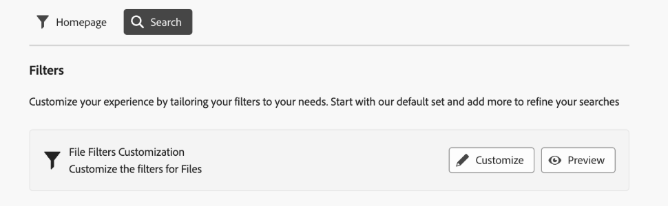

<table>
    <tr>
        <td>
            <i> 新規 </i>Dynamic Media Prime<a href="/help/assets/dynamic-media/dm-prime-ultimate.md"><b>Ultimate</b></a>
        </td>
        <td>
            <i> 新規 </i> <a href="/help/assets/assets-ultimate-overview.md"><b>AEM AssetsUltimate</b></a>
        </td>
        <td>
            <i> 新規 </i> <a href="/help/assets/integrate-aem-assets-edge-delivery-services.md"><b>AEM AssetsとEdge Delivery Servicesの統合 </b></a>
        </td>
        <td>
            <i> 新規 </i><a href="/help/assets/aem-assets-view-ui-extensibility.md"><b>UI 拡張機能 </b></a>
        </td>
          <td>
            <i>Dynamic Media Prime</i>Ultimateの新 <a href="/help/assets/dynamic-media/enable-dynamic-media-prime-and-ultimate.md"><b> 能 </b></a>
        </td>
    </tr>
    <tr>
        <td>
            <a href="/help/assets/search-best-practices.md"><b>検索のベストプラクティス</b></a>
        </td>
        <td>
            <a href="/help/assets/metadata-best-practices.md"><b>メタデータのベストプラクティス</b></a>
        </td>
        <td>
            <a href="/help/assets/product-overview.md"><b>コンテンツハブ</b></a>
        </td>
        <td>
            <a href="/help/assets/dynamic-media-open-apis-overview.md"><b>OpenAPI 機能を備えた Dynamic Media</b></a>
        </td>
        <td>
            <a href="https://developer.adobe.com/experience-cloud/experience-manager-apis/"><b>AEM Assets 開発者向けドキュメント</b></a>
        </td>
    </tr>
</table>

# 検索フィルターのカスタマイズ {#customize-search-filters}

検索フィルターを使用すると、日付、ファイルタイプ、タグ、関連性などの様々なパラメーターに基づいて検索結果を絞り込むことができ、検索クエリの精度を高めることができます。 フィルターを適用すると、最も関連性の高い結果を効率的にすばやく抽出できます。 これにより、時間の節約だけでなく、特定の好みやニーズに合わせて結果を調整することで、検索全体のエクスペリエンスも向上します。
[ 検索 ](search-assets-view.md) の詳細を参照してください。

検索フィルターのカスタマイズ AEM Assetsは、検索可能なプロパティインデックスのエントリにのみマッピングできます。 カスタムフィルターエクスペリエンスを設定する前に、カスタムメタデータが含まれていることを確認してください。 [!DNL Assets view] は、検索フィルターをカスタマイズして検索プロセスを効率化するのに役立ちます。 AEM Assets カスタム検索フィルターをカスタマイズするには、次の手順を実行します。

1. **[!UICONTROL 設定]**／**[!UICONTROL 一般設定]**&#x200B;に移動します。
1. 「**[!UICONTROL 検索]** タブに移動します。 **[!UICONTROL カスタマイズ]** をクリックして、検索フォームを設定します。

   

1. [!UICONTROL  フィルターの設定 ] フォームが表示されます。 テンプレートに変更を加えることができるように、編集モードになっていることを確認します。 [!UICONTROL  プレビューモード ] に切り替えて、既存の検索フォームのプレビューを表示できます。
1. キャンバスの [ カスタムフィルター ](#available-custom-filters) からフィルター要素をドロップします。 必要に応じて、コンポーネントをドラッグ&amp;ドロップして並べ替えることができます。

   >[!VIDEO](https://video.tv.adobe.com/v/3443080)

1. **[!UICONTROL プレビューモード]** をクリックして、変更を確認します。
1. 「**[!UICONTROL 確認]**」をクリックして保存します。

## 使用可能なカスタムフィルター {#available-custom-filters}

Assets ビューには、要件に応じて再設定可能な次のカスタムフィルターが用意されています。

* [要素をフィルター](#filter-elements)
* [事前設定済みフィルター](#preconfigured-filters)

### 要素をフィルター {#filter-elements}

カスタムフィルターAEM Assetsでは、カスタム検索フィルターキャンバスでフィルター要素のコレクションを使用できます。 これらの要素は、検索プロパティ属性の使いやすさに基づいて再設定できます。 ただし、必要に応じて [ フィルタープロパティ ](#filter-properties) をカスタマイズできます。 [!DNL Assets view] では、次のフィルター要素を使用できます。

<table>
    <tr>
        <th>要素をフィルター</th>
        <th>説明</th>
        <th>プロパティ</th>
    </tr>
    <tr>
        <td>テキスト</td>
        <td>テキストフィールドは、フィルターに関連する情報を入力できる入力領域です。</td>
        <td>
            <ul>
                <li>ラベル
                <li>メタデータ
                <li>値
                <li>説明
            </ul>
        </td>
    </tr>
    <tr>
        <td>Options</td>
        <td>オプションは、リストから好みの項目を選択するために使用できる代替値を参照します。</td>
        <td>
            <ul>
                <li>ラベル
                <li>メタデータ
                <li>値
                <li>オプション
                <li>説明
            </ul>
        </td>
    </tr>
    <tr>
        <td>ブール値</td>
        <td>ブール値は 1 つの true 値を表します。 特定のオプションを選択したい場所で使用できます。</td>
        <td>
            <ul>
                <li>ラベル
                <li>メタデータ
                <li>説明
            </ul>
        </td>
    </tr>
    <tr>
        <td>数値</td>
        <td>このフィルター要素を使用して、数値を表します。</td>
        <td>
            <ul>
                <li>ラベル
                <li>メタデータ
                <li>選択タイプ
                <li>ステッパー
                <li>ステッパー値
                <li>説明
            </ul>
        </td>
    </tr>
    <tr>
        <td>ドロップダウン</td>
        <td>オプションのリストに表示される様々なオプションの中から選択する。</td>
        <td>
            <ul>
                <li>ラベル
                <li>メタデータ
                <li>Options
                <li>値
                <li>説明
            </ul>
        </td>
    </tr>
    <tr>
        <td>日付</td>
        <td>日付を指定するために使用されます。</td>
        <td>
            <ul>
                <li>ラベル
                <li>メタデータ
                <li>選択タイプ
                <li>説明
            </ul>
        </td>
    </tr>
    <tr>
        <td>パスブラウザー</td>
        <td>Experience Manager リポジトリ内のファイルまたはフォルダー間を移動するために使用します。</td>
        <td>
            <ul>
                <li>ラベル
                <li>メタデータ
                <li>パスエクスプローラー
                <li>説明
            </ul>
        </td>
    </tr>
    <tr>
        <td>タグ</td>
        <td>使用可能なオプションからタグを選択するために使用します。 タグは、アセットに関するより具体的な情報を提供し、その検出性を向上させます。 選択したアセットに既に適用されているタグが、<b> プロパティ </b> パネルに表示されます。 カスタムメタデータプロパティにタグを保存し、ルートパスを使用して階層に制限する場合は、同じ設定を検索フィルターで利用できます。 関連するタグが見つからない場合は、作成し、選択したアセットに割り当てます。 タグの作成とアセットへの割り当てについて詳しくは、Assets ビュー </a> でのタグの管理に <a href = "tagging-management-assets-view.md"> いて参照してください。</td>
        <td>
            <ul>
                <li>ラベル
                <li>メタデータ
                <li>タグピッカー
                <li>説明
            </ul>
        </td>
    </tr>
    <tr>
        <td>User</td>
        <td>管理者、通常ユーザー、消費者ユーザーの中からユーザーのタイプを指定するために使用します。</td>
        <td>
            <ul>
                <li>ラベル
                <li>メタデータ
                <li>説明
            </ul>
        </td>
    </tr>
</table>

### 事前設定済みフィルター {#preconfigured-filters}

事前設定されたフィルターは、キャンバス上で直接使用できるプリセット設定です。 ただし、必要に応じて [ フィルタープロパティ ](#filter-properties) をカスタマイズできます。 [!DNL Assets view] では、次のフィルターが事前設定されています。

<table>
    <tr>
        <th>事前設定済みフィルター</th>
        <th>説明</th>
        <th>プロパティ</th>
    </tr>
    <tr>
        <td>ファイルタイプ</td>
        <td>サポートされているファイルタイプ（「画像」、「ドキュメント」、「ビデオ」）で検索結果をフィルタリングします。</td>
        <td>
            <ul>
                <li>ラベル
                <li>メタデータ
                <li>選択タイプ
                <li>Options
                <li>値
                <li>説明
            </ul>
        </td>
    </tr>
    <tr>
        <td>ファイル形式</td>
        <td>Assets ビューでは、メタデータのストレージ、アップロード、コピー、移動、削除、追加など、基本サービスを備えた任意のバイナリファイル形式をサポートしています。</td>
        <td>
            <ul>
                <li>ラベル
                <li>メタデータ
                <li>選択タイプ
                <li>説明
            </ul>
        </td>
    </tr>
    <tr>
        <td>画像サイズ</td>
        <td>画像をフィルタリングするための最小サイズと最大サイズのどちらか一方または両方を指定します。 サイズはピクセル単位で指定され、画像のファイルサイズではありません。</td>
        <td>
            <ul>
                <li>ラベル
                <li>メタデータ
                <li>選択タイプ
                <li>ステッパー
                <li>ステッパー値
                <li>説明
            </ul>
        </td>
    </tr>
    <tr>
        <td>画像の幅</td>
        <td>画像の垂直方向の寸法。</td>
        <td>
            <ul>
                <li>ラベル
                <li>メタデータ
                <li>選択タイプ
                <li>ステッパー
                <li>ステッパー値
                <li>説明
            </ul>
        </td>
    </tr>
    <tr>
        <td>画像の高さ</td>
        <td>画像の水平方向の寸法。</td>
        <td>
            <ul>
                <li>ラベル
                <li>メタデータ
                <li>選択タイプ
                <li>ステッパー
                <li>ステッパー値
                <li>説明
            </ul>
        </td>
    </tr>
    <tr>
        <td>作成日</td>
        <td>アセットが作成された日付範囲。</td>
        <td>
            <ul>
                <li>ラベル
                <li>メタデータ
                <li>選択タイプ
                <li>説明
            </ul>
        </td>
    </tr>
    <tr>
        <td>変更日</td>
        <td>アセットが変更された日付範囲。</td>
        <td>
            <ul>
                <li>ラベル
                <li>メタデータ
                <li>選択タイプ
                <li>説明
            </ul>
        </td>
    </tr>
    <tr>
        <td>アセットステータス</td>
        <td>Assets表示を使用すると、リポジトリで使用可能なアセットのステータスを設定できます。 デジタルアセットのダウンストリーム使用をより適切に制御および管理するためのアセットステータスを設定します。 <b> 承認済み、却下、ステータスなし </b> から選択します。</td>
        <td>
            <ul>
                <li>ラベル
                <li>メタデータ
                <li>選択タイプ
                <li>説明
            </ul>
        </td>
    </tr>
    <tr>
        <td>スマートタグ</td>
        <td>Experience Manager リポジトリに追加されたスマートタグを使用してアセットをフィルタリングします。</td>
        <td>
            <ul>
                <li>ラベル
                <li>メタデータ
                <li>選択タイプ
                <li>Delimeter サポート
                <li>説明
            </ul>
        </td>
    </tr>
    <tr>
        <td>Dynamic Media のステータス</td>
        <td>公開済みまたは非公開のアセットのステータスを選択します。</td>
        <td>
            <ul>
                <li>ラベル
                <li>メタデータ
                <li>選択タイプ
                <li>Options
                <li>値
                <li>説明
            </ul>
        </td>
    </tr>
    <tr>
        <td>有効期限</td>
        <td>アセットをフィルタリングします。指定した日付範囲を過ぎると、アセットが有効でなくなったり必要でなくなったりします。 </td>
        <td>
            <ul>
                <li>ラベル
                <li>メタデータ
                <li>選択タイプ
                <li>説明
            </ul>
        </td>
    </tr>
    <tr>
        <td>タグ（分類）</td>
        <td>タグを使用してデジタルアセットを整理、分類するシステムで、基本的にはキーワードの階層構造を作成し、ユーザーがアセットごとに特定のタグを適用することで、関連するコンテンツを簡単に検索できるようにします。 </td>
        <td>
            <ul>
                <li>ラベル
                <li>メタデータ
                <li>タグピッカー
                <li>説明
            </ul>
        </td>
    </tr>
</table>

#### フィルタープロパティ {#filter-properties}

各フィルター要素は、一連のプロパティに関連付けられています。 AEM Assetsのカスタマイズ検索フィルターでは、フィルターの次のプロパティと事前設定済みの要素を使用します。

<table>
    <tr>
        <th>プロパティ</th>
        <th>値</th>
        <th>説明</th>
    </tr>
    <tr>
        <td>ラベル</td>
        <td>テキスト</td>
        <td>使用しているフィルターの識別子です。</td>
    </tr>
    <tr>
        <td>メタデータ</td>
        <td>ドロップダウン</td>
        <td>メタデータプロパティは、Adobe Experience Manager Assets リポジトリから承認されたメタデータのマッピングに使用されます。 フィルター要素を使用して、マッピングする必要があるメタデータ値をドロップダウンメニューから選択できます。 </td>
    </tr>
    <tr>
        <td>選択タイプ</td> 
        <td>単一、複数、正確または範囲 </td>
        <td>
            <ul>
                <li><b> 単一選択 </b> では、一度に 1 つの項目を選択できるので、個別の選択肢に最適です。
                <li><b> 複数選択 </b> 複数の項目を同時に選択できるので、複数のオプションを選択する場合に便利です。 
                <li><b> 正確な選択 </b> 様々なオプションから正確な単一の項目を選択できます。
                <li><b> 範囲選択 </b> 定義された範囲内の値の連続したセットを選択できます。日付や数値の範囲を選択する場合に便利です。
            </ul>
        </td>   
    </tr>
    <tr>
        <td>Options</td>
        <td>手動、JSON パス、または CSV アップロード</td>
        <td>
            <ul>
                <li>オプションを手動で追加する場合は、「<b> 手動 </b>」を選択します。 
                <li><b>JSON パス </b> を選択して、JSON ファイルからオプションを追加します。 
                <li>「<b>CSV アップロード </b>」を選択して、オプションに追加する値を含む CSV ファイルを読み込みます。
            </ul>
        </td>
    </tr>
    <tr>
       <td>値</td>
        <td>追加または編集</td>
        <td>
        <ul>
        <li>「<b> 追加 </b>」をクリックして、新しい値を追加します。 
        <li>✎ をクリックしてラベルを編集します。 
        <li>?? をクリックすると、オプション値が削除されます。 
        <li><b> 編集 </b> をクリックして、編集オプションを変更します。 
        <li>また、オプションのシーケンスを保持して変更することもできます。
        </td>
    </tr>
    <tr>
        <td>Delimeter サポート</td>
        <td>有効または無効</td>
        <td>区切り記号は、テキスト内の個別の要素を区切るために使用される記号です。 例えば、コンマ、スペース、セミコロンです。</td>
    </tr>
    <tr>
        <td>ステッパー</td>
        <td>値</td>
        <td>数値フィールドのステッパーボタンを有効にして、クリックごとに値を増減させます。 </td>
    </tr>
    <tr>
        <td>ステッパー値 </td>
        <td>数値</td>
        <td>ステッパーボタンを使用するときの増分/減分の値を示します。 ステッパーが有効な場合に表示されます。</td>
    </tr>
    <tr>
        <td>説明</td>
        <td>テキスト</td>
        <td>詳細説明を追加して、フィルター要素に関する追加情報を提供します。</td>
    </tr>
</table>

## フィルター要素の削除 {#delete-a-filter-element}

検索フィルターを削除するには、次の手順に従います。

1. **[!UICONTROL 設定]**／**[!UICONTROL 一般設定]**&#x200B;に移動します。
1. 「**[!UICONTROL 検索]** タブに移動します。 **[!UICONTROL カスタマイズ]** をクリックして、検索フォームを設定します。
1. [!UICONTROL  フィルターの設定 ] フォームが表示されます。 テンプレートに変更を加えることができるように、編集モードになっていることを確認します。
1. 削除するフィルター要素を選択します。 例えば、「**[!UICONTROL 画像の高さ]** を選択します。
1. **[!UICONTROL カテゴリを削除]** をクリックして、フィルター要素を削除します。 **[!UICONTROL 画像の高さ]** 要素がキャンバスから削除されます。
1. **[!UICONTROL 確認]**」をクリックして、フォームを保存します。

## カスタム検索フィルターの使用{#using-custom-search-filters}

検索フィルターを設定したら、それらを使用してリポジトリ内のアセットを検索できます。

>[!MORELIKETHIS]
>
>* [アセットの検索](search-assets-view.md)
