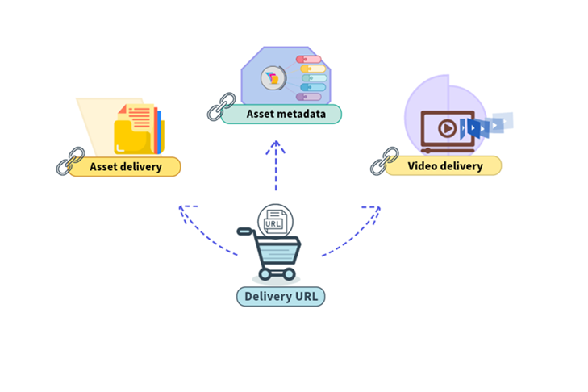

# 配信 API {#delivery-apis}

Experience Manager Assets リポジトリで使用可能なすべての[承認済みアセット](approve-assets.md)を[検索](search-assets-api.md)し、配信 URL を使用して統合されたダウンストリームアプリケーションに配信できます。

バージョンの更新やメタデータの変更など、DAM 内の承認済みアセットに行われた変更は、配信 URL に自動的に反映されます。 CDN 経由のアセット配信に 10 分という短い有効期限（TTL）値を設定すると、更新は 10 分以内にすべてのオーサリングインターフェイスと公開済みインターフェイスに表示されます。

次の画像は、使用可能な配信 URL を示しています。



次の表に、使用可能な様々な配信 API の使用方法を示します。

| 配信 API | 説明 |
|---|---|
| [リクエストされた出力形式でのアセットの web に最適化されたバイナリ表現](https://developer.adobe.com/experience-cloud/experience-manager-apis/api/stable/assets/delivery/#operation/getAssetSeoFormat) | リクエストで送信されたアセット ID に基づいて、リクエストされた出力形式でアセットの web に最適化されたバイナリ表現を返します。 さらに、幅、高さ、回転、反転、画質、切り抜き、形式、[スマート切り抜き](/help/assets/dynamic-media/image-profiles.md)など、様々な画像修飾子を定義できます。 サポートされる形式と画像修飾子について詳しくは、[API の詳細](https://developer.adobe.com/experience-cloud/experience-manager-apis/api/stable/assets/delivery/#operation/getAssetSeoFormat)を参照してください。<br>アドビでは、すべての画像形式タイプにこの API を使用することをお勧めします。 |
| [アセットの web に最適化されたバイナリ表現](https://developer.adobe.com/experience-cloud/experience-manager-apis/api/stable/assets/delivery/#operation/getAsset) | 応答で返されるアセットの web に最適化されたバイナリ表現にデフォルトを適用する便利な API。 デフォルトでは、標準の JPEG／WEBP 形式、画質 => 65、幅 => 1024 が含まれます。 |
| [アセットの元のアップロードされたバイナリ](https://developer.adobe.com/experience-cloud/experience-manager-apis/api/stable/assets/delivery/#operation/getAssetOriginal) | アセットの元のアップロードされたバイナリを返します。 アドビでは、ドキュメント形式タイプと SVG 画像にこの API を使用することをお勧めします。 |
| [AEM Assets オーサリング環境で使用可能なアセットの事前生成済みレンディション](https://developer.adobe.com/experience-cloud/experience-manager-apis/api/stable/assets/delivery/#operation/getAssetRendition) | リクエストで送信されたアセット ID とレンディション名に基づいて、AEM Assets オーサリング環境で使用可能なアセットレンディションのビットストリームを返します。 |
| [アセットのメタデータ](https://developer.adobe.com/experience-cloud/experience-manager-apis/api/stable/assets/delivery/#operation/getAssetMetadata) | タイトル、説明、CreateDate、ModifyDate など、アセットに関連付けられたプロパティを返します。 |
| [ビデオアセットのプレーヤーコンテナ](https://developer.adobe.com/experience-cloud/experience-manager-apis/api/stable/assets/delivery/#operation/videoPlayerDelivery) | ビデオアセットのプレーヤーコンテナを返します。 プレーヤーを iframe HTML 要素に埋め込んでビデオを再生できます。 |
| [選択した出力形式の再生マニフェスト](https://developer.adobe.com/experience-cloud/experience-manager-apis/api/stable/assets/delivery/#operation/videoManifestDelivery) | 指定されたビデオアセットの再生マニフェストファイルを、選択した出力形式で返します。 再生マニフェストファイルを取り込んでビデオを再生するには、HLS または DASH プロトコルを通じてアダプティブストリーミングが可能なカスタムプレーヤーを作成する必要があります。 |

>[!IMPORTANT]
>
>実験的な API から一般に利用できない任意の修飾子をテストできます。 例： [実験的 API](https://developer.adobe.com/experience-cloud/experience-manager-apis/guides/how-to/#experimental-apis) と[修飾子の完全なリスト](https://developer.adobe.com/experience-cloud/experience-manager-apis/)の使用方法について詳しくは、こちらをクリックしてください。

また、OpenAPI 機能を備えた Dynamic Media は、ロングフォームのビデオもサポートしています。 ビデオは、最大 50 GB および 2 時間をサポートできます。

使用可能な Dynamic Media 製品とその機能について詳しくは、[Dynamic Media Prime と Ultimate](/help/assets/dynamic-media/dm-prime-ultimate.md) を参照してください。

>[!NOTE]
>
>DM Prime のお客様は、回転、切り抜き、反転、高さ、幅、画質などの基本的な画像修飾子を使用できます。 スマートイメージングは、DM Prime のお客様に対して AVIF をサポートしていません。

## 配信 API エンドポイント {#delivery-apis-endpoint}

API エンドポイントは、配信 API ごとに異なります。 例えば、`Web-optimized binary representation of the asset in the requested output format` APIのAPI エンドポイントは次のとおりです。

配信ドメインは、Experience Manager オーサー環境のドメインと構造が似ています。 唯一の違いは、`author` という用語を `delivery` に置き換えることです。

`pXXXX` はプログラム ID を参照します。

`eYYYY` は環境 ID を参照します。

詳しくは、[API の詳細](https://developer.adobe.com/experience-cloud/experience-manager-apis/api/stable/assets/delivery/#tag/Assets)を参照してください。

## 配信 API リクエストメソッド {#delivery-api-request-method}

GET

## 配信 API ヘッダー {#deliver-assets-api-header}

配信 API ヘッダーでヘッダーを定義する際には、次の詳細を指定する必要があります。

```java
headers: {
      'If-None-Match': 'string',
      Authorization: 'Bearer <YOUR_JWT_HERE>'
    }
```

配信 API を呼び出すには、制限されたアセットを配信する `Authorization` の詳細に IMS トークンが必要です。 IMS トークンは、テクニカルアカウントから取得されます。 新しいテクニカルアカウントを作成する方法について詳しくは、[AEM as a Cloud Service の資格情報の取得](https://experienceleague.adobe.com/en/docs/experience-manager-cloud-service/content/implementing/developing/generating-access-tokens-for-server-side-apis)を参照してください。 IMS トークンを生成し、配信 API リクエストヘッダーで適切に使用する方法について詳しくは、[アクセストークンの生成](https://experienceleague.adobe.com/en/docs/experience-manager-cloud-service/content/implementing/developing/generating-access-tokens-for-server-side-apis)を参照してください。


リクエストサンプル、応答サンプルおよび応答コードを表示する方法について詳しくは、[配信 API](https://developer.adobe.com/experience-cloud/experience-manager-apis/api/stable/assets/delivery/#operation/getAssetSeoFormat) を参照してください。

## よくある質問 {#delivery-apis-faqs}

### OpenAPI配信APIを備えたDynamic Mediaとは何ですか？それらは何を可能にしますか？ {#delivery-apis-overview}

OpenAPI配信APIを備えたDynamic Mediaを使用すると、Adobe Experience Manager Assetsに保存された承認済みアセットを、配信URLを介して統合されたダウンストリームアプリケーションに配信できます。 画像配信、元のバイナリ配信、事前生成されたレンディション配信、アセットメタデータの取得、ビデオプレーヤーの埋め込み、ビデオ再生マニフェスト配信など、7つの異なるAPIを利用できます。 バージョンの更新やメタデータの変更など、DAM内の承認済みアセットに加えられた変更は、再公開や手作業の介入なしに、配信URLに自動的に反映されます。

### AEM Assetsでの変更後、アセットの更新はDelivery API URLにどのくらい迅速に表示されますか？ {#delivery-api-ttl-updates}

AEM Assetsで承認されたアセットの更新は、オーサリングインターフェイスと公開インターフェイスのすべてに10分以内に表示されます。 OpenAPI配信APIを備えたDynamic Mediaでは、CDNを介したアセット配信用に設定された、10分の短い「運用開始までの時間」値を使用します。 つまり、DAM内の承認済みアセットに対して行われたバージョンの更新、メタデータの変更やその他の変更は、手動でのキャッシュ無効化を必要とせずに、10分以内に配信URLに自動的に反映されます。

### 画像アセットを配信するには、どの配信APIを使用すればよいですか？ {#delivery-api-image-recommendation}

要求された出力形式APIでのアセットのWebに最適化されたバイナリ表現は、すべての画像形式タイプに対して推奨されるAPIです。 このAPIは、リクエストで送信されたアセット IDに基づいて、リクエストされた出力形式でアセットのwebに最適化されたバイナリ表現を返します。 幅、高さ、回転、反転、画質、切り抜き、形式、スマート切り抜きなど、様々な画像修飾子をサポートしています。 ドキュメントフォーマットの種類とSVG画像の場合は、代わりにアセット APIの元のアップロード済みバイナリを使用することをお勧めします。

### Webに最適化されたバイナリ表現配信APIでは、どのような画像修飾子がサポートされていますか？ {#delivery-api-image-modifiers}

Webに最適化された出力形式APIでのアセットのバイナリ表現では、幅、高さ、回転、反転、品質、切り抜き、形式、スマート切り抜きなどの画像修飾子をサポートしています。 これらの修飾子は、配信URL リクエストでパラメーターとして定義して、AEM Assetsに保存されている元のアセットを変更することなく、配信時にアセットを変換できます。

### 利便性の高いWebに最適化されたバイナリ表現の配信APIは、デフォルトで何を返しますか？ {#delivery-api-defaults}

利便性の高いWebに最適化されたアセット APIのバイナリ表現は、応答で返されるアセットにデフォルトが適用されます。 デフォルト値は、JPEGまたはWEBP形式、画質65、幅1024 ピクセルです。 このAPIは、特定の出力形式または修飾子制御が必要なく、標準のwebに最適化されたレンディションがダウンストリームアプリケーションに十分な場合に適しています。

### ドキュメントとSVGの画像に使用する配信APIはどれですか？ {#delivery-api-documents-svg}

アセット APIの元のアップロード済みバイナリは、ドキュメントフォーマットの種類とSVG イメージに推奨されるAPIです。 このAPIは、web最適化変換を適用せずに、アセットに対して最初にアップロードされたバイナリを返します。 その他のすべての画像形式タイプについては、要求された出力形式でWebに最適化されたバイナリ表現APIを使用することをお勧めします。

### 配信APIを使用して、アセットの事前生成レンディションを取得するにはどうすればよいですか？ {#delivery-api-pre-generated-renditions}

AEM Assets オーサリング環境APIで使用可能なアセットの事前生成レンディションは、リクエストで送信されたアセット IDとレンディション名に基づいて、特定のレンディションのビットストリームを返します。 レンディションは、このAPIを使用して取得する前に、AEM Assets オーサリング環境に既に存在している必要があります。 このAPIは、画像修飾子を使用してオンデマンドで出力を生成するweb最適化バイナリ APIとは異なります。

### 配信APIを使用してビデオアセットを埋め込んで再生するにはどうすればよいですか？ {#delivery-api-video-player}

ビデオアセット APIのPlayer コンテナは、ビデオアセットのPlayer コンテナを返します。このビデオアセットは、ページ内のビデオ再生を有効にするためにiframe HTML エレメントに埋め込むことができます。 アダプティブストリーミングでカスタムプレーヤーの実装を必要とするシナリオの場合、選択した出力形式APIで再生マニフェストが表示され、指定したビデオアセットの再生マニフェストファイルがHLSまたはDASH形式で返されます。 HLSまたはDASH プロトコルを介したアダプティブストリーミングが可能なカスタムプレーヤーを構築して、マニフェストファイルを使用し、ビデオを再生する必要があります。

### OpenAPI Delivery APIを使用したDynamic Mediaでサポートされる最大ビデオファイルサイズとデュレーションは何ですか？ {#delivery-api-video-limits}

OpenAPI配信APIを備えたDynamic Mediaは、ファイルサイズが最大50 GB、デュレーションが最大2時間の長編ビデオをサポートします。 これらの制限は、Player コンテナおよびPlayback マニフェスト配信APIを介して配信されるビデオアセットに適用されます。

### 配信API エンドポイント URLはどのように構造化されますか？ {#delivery-api-endpoint-structure}

要求された出力形式のwebに最適化されたバイナリ表現の配信API エンドポイント URLは、次の構造に従います：https://delivery-pXXXX-eYYYY.adobeaemcloud.com/adobe/assets/{assetId}/as/{seoName}.{format}。配信ドメインは、AEM オーサー環境ドメインと同様の構造を持ちます。唯一の違いは、オーサーという用語を配信に置き換えることです。 URLでは、pXXXXはプログラム IDを表し、eYYYYYは環境IDを表します。 すべての配信APIは、HTTP GET リクエストメソッドを使用します。

### OpenAPI Delivery APIでDynamic Mediaを呼び出すにはどのような認証が必要ですか？ {#delivery-api-authentication}

OpenAPI配信APIを使用してDynamic Mediaを呼び出すには、制限されたアセットを配信するために、認証ヘッダーにIMS トークンが必要です。 ヘッダーには、文字列値としてIf-None-Matchと、IMS トークンを含むベアラートークンとしてAuthorizationの2つのフィールドを含める必要があります。 IMS トークンは、AEM as a Cloud Service資格情報ワークフローを使用して作成されたテクニカルアカウントから取得されます。 配信APIを呼び出す前に、テクニカルアカウントを設定し、アクセストークンを生成する必要があります。

### 実験的な配信APIとは何か、どのようにアクセスすればよいですか？ {#delivery-api-experimental}

実験的な配信APIでは、まだ一般的には利用できない画像修飾子をテストできます。 実験的なAPIは、修飾子と有効期限を含むURL パス形式（例：/adobe/experimental/advancemodifiers-expires-YYYMMDD/assets）を使用してアクセスします。 使用可能な実験的修飾子の完全なリストについては、Adobe Developer Consoleに記載されています。 実験APIはテスト目的で作成され、一般公開される前に変更される可能性があります。

### Dynamic Media UltimateとDynamic Media Primeのお客様の間で利用できる画像修飾機能にはどのようなものがありますか？ {#delivery-api-prime-vs-ultimate-modifiers}

Dynamic Media Primeのお客様は、配信APIを使用して、回転、切り抜き、反転、高さ、幅、画質などの基本的な画像修飾子を使用できます。 スマートイメージングは、Dynamic Media PrimeのスマートイメージングではAVIF形式がサポートされていない点を除いて、Dynamic Media Primeのお客様が利用できます。 Dynamic Media Ultimateをご利用のお客様は、AVIF フォーマットのサポートを含む、画像修飾子とスマートイメージング機能の全範囲にアクセスできます。