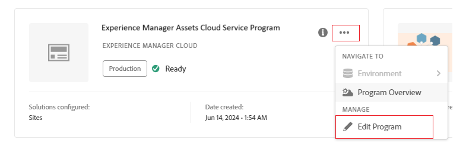
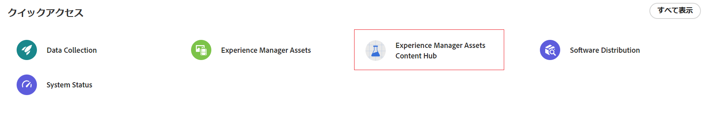

# コンテンツハブのデプロイ {#deploy-content-hub}

コンテンツハブは、Experience Manager Assets as a Cloud Service の一部として使用でき、組織とそのビジネスパートナーがオンブランドのコンテンツに簡単にアクセスできます。

Experience Manager Assets as a Cloud Service で承認済みとしてマークされたアセットは、コンテンツハブでのアセット配布に使用できます。

この記事では、ユーザーのニーズに基づいた権限のバリエーションを含む、ユーザーにコンテンツハブへのアクセスを提供するエンドツーエンドのワークフローについて説明します。

コンテンツハブでの権限のバリエーションには、次が含まれます。

* [コンテンツハブユーザー](#onboard-content-hub-users)：コンテンツハブポータルでブランド承認済みアセットにアクセスできます。

* [コンテンツハブ管理者](#onboard-content-hub-administrator)：ブランド承認済みアセットへのアクセス、コンテンツハブへのアセットのアップロード、Adobe Express 統合による画像編集（Adobe Express 権限がある場合）に加えて、コンテンツハブの[設定ユーザーインターフェイス](/help/assets/configure-content-hub-ui-options.md)にアクセスできます。

* [アセットを追加する権限を持つコンテンツハブユーザー](#onboard-content-hub-users-add-assets)：コンテンツハブポータルでのブランド承認済みアセットへのアクセスに加えて、[コンテンツハブにアセットをアップロード](/help/assets/upload-brand-approved-assets.md)できます。

* [アセットを新しいバリエーションにリミックスする権限を持つコンテンツハブユーザー](#onboard-content-hub-users-remix-assets)：コンテンツハブポータルでのブランド承認済みアセットへのアクセスに加えて、[Adobe Express 統合](/help/assets/edit-images-content-hub.md)（Adobe Express 権限がある場合）も使用できます。

* [Experience Manager Assets ユーザー](#experience-manager-assets-users)：Experience Manager Assets as a Cloud Service でアセットを承認し、コンテンツハブで使用できます。

次の表に、使用可能なコンテンツハブユーザータイプ、そのユーザーが持つ権限、およびこれらの権限を取得するのに必要な製品プロファイルの概要を示します。

| ユーザーの役割 | コンテンツハブユーザー | アセットを追加する権限を持つコンテンツハブユーザー | アセットをリミックスする権限を持つコンテンツハブユーザー | コンテンツハブ管理者 |
|---------------|----------|----------|-------------------------|---|
| **機能** |
| コンテンツハブポータルでブランド承認済みアセットにアクセス | ✓ | ✓ | ✓ | ✓ |
| コンテンツハブポータルからアセットをアップロード | − | ✓ | ✓ | ✓ |
| Adobe Express 統合を使用して画像を編集 | − | − | ✓ | − |
| コンテンツハブ設定 UI にアクセス | − | − | − | ✓ |
| **ユーザーは、次の製品プロファイル（Admin Console）に含まれている必要があります** |
| AEM／配信インスタンス／AEM Assets 制限付きユーザー | ✓ | ✓ | ✓ | ✓ |
| AEM／実稼動オーサーインスタンス／AEM ユーザー | − | ✓ | ✓ | − |
| AEM／実稼動オーサーインスタンス／AEM 管理者 | − | − | − | ✓ |
| Adobe Express | − | − | ✓ | − |
| **詳細情報** | 詳しくは、[コンテンツハブユーザー](#onboard-content-hub-users)を参照してください。 | 詳しくは、[アセットを追加する権限を持つコンテンツハブユーザー](#onboard-content-hub-users-add-assets)を参照してください。 | 詳しくは、[アセットを新しいバリエーションにリミックスする権限を持つコンテンツハブユーザー](#onboard-content-hub-users-remix-assets)を参照してください。 | 詳しくは、[コンテンツハブ管理者](#onboard-content-hub-administrator)を参照してください。 |

>[!NOTE]
>
>[Experience Manager Assets ユーザー](#experience-manager-assets-users)は、Experience Manager Assets as a Cloud Service 環境でアセットを承認し、コンテンツハブで使用できます。これらのユーザーは、Admin Console を使用して、AEM／実稼動オーサーインスタンス／AEM ユーザーの製品プロファイルに追加する必要があります。

## 手順 1：Cloud Manager を使用して Experience Manager Assets のコンテンツハブを有効にする {#enable-content-hub}

コンテンツハブポータルにアクセスするには、管理者はまず Cloud Manager を使用して、Experience Manager Assets as a Cloud Service のコンテンツハブを有効にする必要があります。

### 権限 {#permissions-edit-program}

Cloud Manager でプログラムを編集するには、ビジネスオーナーの役割が必要です。詳しくは、[プログラムの編集](/help/implementing/cloud-manager/getting-access-to-aem-in-cloud/editing-programs.md)を参照してください。

Experience Manager Assets 用のコンテンツハブを有効にするには、以下の手順を実行します。

1. Cloud Manager にログインします。ログイン時に正しい組織を選択していることを確認します。Cloud Manager に、すべてのプログラムがリストされます。

1. Experience Manager Assets as a Cloud Service プログラムに移動し、その他オプションアイコン（…）をクリックし、「**[!UICONTROL プログラムを編集]**」を選択します。

   

1. [!UICONTROL プログラムを編集]ダイアログで、「**[!UICONTROL ソリューションとアドオン]**」タブを選択します。

1. 「**[!UICONTROL アセット]**」を展開し、「**[!UICONTROL コンテンツハブ]**」を選択します。
   

   >[!NOTE]
   >
   >コンテンツハブを選択した後に&#x200B;**[!UICONTROL 更新]**&#x200B;が有効になっていない場合は、プログラムの運用開始設定を指定していることを確認します。

1. 「**[!UICONTROL 更新]**」をクリックします。

これで、コンテンツハブが Experience Manager Assets as a Cloud Service で有効になります。実稼動環境でコンテンツハブを有効にした後は、セルフサービス方式で無効にすることはできません。

>[!NOTE]
>
>最大 250 人のコンテンツハブユーザーがコンテンツハブにアクセスして使用できます。他に質問がある場合は、アドビ担当者にお問い合わせください。

Experience Manager Assets を初めて使用する場合は、「**[!UICONTROL プログラムを追加]**」をクリックし、プログラムの詳細（プログラム名、実稼動用の設定）を入力して、「**[!UICONTROL 続行]**」をクリックします。次に、「**[!UICONTROL ソリューションとアドオン]**」タブで「**[!UICONTROL アセット]**」と「**[!UICONTROL コンテンツハブ]**」を選択できます。

### Admin Console のコンテンツハブのインスタンスと製品プロファイル{#content-hub-instance-product-profile}

[Cloud Manager を使用して Assets as a Cloud Service 用のコンテンツハブを有効](#enable-content-hub)にすると、Admin Console の AEM Assets as a Cloud Service 内に、サフィックスとして `delivery` が付いた新しいインスタンスが作成されます。

>[!NOTE]
>
>2024年8月14日（PT）より前にコンテンツハブをプロビジョニングした場合、新しいインスタンスはサフィックスとして `contenthub` を付けて作成されます。

コンテンツハブのインスタンス名には、`author` または `publish` がありません。

インスタンス名をクリックすると、コンテンツハブ製品プロファイルが表示されます。

>[!NOTE]
>
>2024年8月14日（PT）より前にコンテンツハブをプロビジョニングした場合、コンテンツハブ製品プロファイルには、`delivery` ではなく、`Limited Users` の後に `contenthub` が表示されます。

## 手順 2：コンテンツハブ管理者のオンボード {#onboard-content-hub-administrator}

コンテンツハブ管理者は、ブランド承認済みアセットへのアクセス、コンテンツハブへのアセットのアップロード、Adobe Express 統合による画像編集（Adobe Express 権限がある場合）に加えて、コンテンツハブの[設定ユーザーインターフェイス](/help/assets/configure-content-hub-ui-options.md)にアクセスできます。

コンテンツハブ管理者をオンボードするには：

1. [コンテンツハブユーザー製品プロファイルにアクセスしてクリックします](#content-hub-instance-product-profile)。

1. 「**[!UICONTROL ユーザーを追加]**」をクリックして、製品プロファイルにユーザーまたはユーザーグループを追加します。

1. 「**[!UICONTROL 保存]**」をクリックして、変更を保存します。

1. ユーザーをコンテンツハブ製品プロファイルに追加した後、Admin Console の製品のリストで AEM as a Cloud Service 製品名をクリックして、Experience Manager Assets 製品プロファイルにアクセスします。

1. AEM as a Cloud Service の実稼動オーサーインスタンスをクリックします。
   

   Admin Console には、AEM as a Cloud Service の 2 つの製品プロファイル（管理者とユーザー）が表示されます。
1. 管理者製品プロファイルをクリックし、「**[!UICONTROL ユーザーを追加]**」をクリックして、製品プロファイルにユーザーを追加します。
   

1. 「**[!UICONTROL 保存]**」をクリックして、変更を保存します。

## 手順 3：コンテンツハブユーザーのオンボード {#onboard-content-hub-users}

コンテンツハブユーザーは、ポータルで使用可能なアセットにアクセスできますが、新しいアセットを追加することや既存のアセットを変更できません。

コンテンツハブユーザーをオンボードするには：

1. [コンテンツハブユーザー製品プロファイルにアクセスしてクリックします](#content-hub-instance-product-profile)。

1. 「**[!UICONTROL ユーザーを追加]**」をクリックして、製品プロファイルにユーザーまたはユーザーグループを追加します。

1. 「**[!UICONTROL 保存]**」をクリックして、変更を保存します。

これで、これらのユーザーは、コンテンツハブポータルで使用可能なアセットにアクセスできます。

>[!NOTE]
>
>外部 ID プロバイダーとの同期など、すべての高度なエンタープライズ機能を使用できます。

### コンテンツハブへのアクセス方法 {#access-content-hub}

コンテンツハブには、次の方法でアクセスできます。

* 次のリンクを使用して、コンテンツハブにアクセスします。

  `https://experience.adobe.com/#/assets/contenthub`

* `experience.adobe com` にログオンし、「**[!UICONTROL クイックアクセス]**」セクションで使用可能な「**[!UICONTROL Experience Manager Assets コンテンツハブ]**」をクリックします。
  

* `experience.adobe com` にログオンし、製品スイッチャーで使用可能な「**[!UICONTROL Experience Manager Assets コンテンツハブ]**」をクリックします。
  

### ユーザーへのメール通知を無効にする {#disable-email-notifications}

ユーザーがコンテンツハブ製品プロファイルに追加された際に、管理者がユーザーに送信されるメール通知を無効にする必要がある場合：

製品プロファイル名の横にある検索アイコンをクリックし、**[!UICONTROL メールでユーザーに通知]**&#x200B;切替スイッチを無効にします。

## 手順 4：アセットを追加する権限を持つコンテンツハブユーザーのオンボード（オプション） {#onboard-content-hub-users-add-assets}

アセットを追加する権限を持つコンテンツハブユーザーは、[新しいブランド承認済みアセットをコンテンツハブにアップロード](/help/assets/upload-brand-approved-assets.md)できます。

ユーザーを追加する権限を持つコンテンツハブユーザーをオンボードするには：

1. [ユーザーをコンテンツハブ製品プロファイルに追加した後](#onboard-content-hub-users)、Admin Console の製品のリストで AEM as a Cloud Service 製品名をクリックして、Experience Manager Assets 製品プロファイルにアクセスします。

1. AEM as a Cloud Service の実稼動オーサーインスタンスをクリックします。
   

   Admin Console には、AEM as a Cloud Service の 2 つの製品プロファイル（管理者とユーザー）が表示されます。
1. ユーザー製品プロファイルをクリックし、「**[!UICONTROL ユーザーを追加]**」をクリックして、製品プロファイルにユーザーを追加します。
   

1. 「**[!UICONTROL 保存]**」をクリックして、変更を保存します。

## 手順 4：アセットを新しいバリエーションにリミックスする権限を持つコンテンツハブユーザーのオンボード（オプション） {#onboard-content-hub-users-remix-assets}

アセットを新しいバリエーションにリミックスする権限を持つコンテンツハブユーザーは、[Adobe Express を使用して既存のアセットを変更し、そのアセットをリポジトリに保存](/help/assets/edit-images-content-hub.md)できます。Adobe Express を使用してアセットを編集できるのは、ユーザーが Adobe Express 権限を持っている場合のみです。

アセットを新しいバリエーションにリミックスする権限を持つコンテンツハブユーザーをオンボードするには：

1. [ユーザーをコンテンツハブ製品プロファイルに追加した後](#onboard-content-hub-users)、Admin Console の製品のリストで AEM as a Cloud Service 製品名をクリックして、Experience Manager Assets 製品プロファイルにアクセスします。

1. AEM as a Cloud Service の実稼動オーサーインスタンスをクリックします。
   

   Admin Console には、AEM as a Cloud Service の 2 つの製品プロファイル（管理者とユーザー）が表示されます。
1. ユーザー製品プロファイルをクリックし、「**[!UICONTROL ユーザーを追加]**」をクリックして、製品プロファイルにユーザーを追加します。
   

1. 「**[!UICONTROL 保存]**」をクリックして、変更を保存します。

## Experience Manager Assets ユーザー {#experience-manager-assets-users}

Experience Manager Assets ユーザーは、AEM as a Cloud Service 上のアセットを承認して、コンテンツハブで使用できます。

Experience Manager Assets ユーザーを設定するには：

1. Admin Console の製品のリストで AEM as a Cloud Service 製品名をクリックして、Experience Manager Assets 製品プロファイルにアクセスします。

1. AEM as a Cloud Service の実稼動オーサーインスタンスをクリックします。
   

   Admin Console には、AEM as a Cloud Service の 2 つの製品プロファイル（管理者とユーザー）が表示されます。
1. ユーザー製品プロファイルをクリックし、「**[!UICONTROL ユーザーを追加]**」をクリックして、製品プロファイルにユーザーを追加します。
   

1. 「**[!UICONTROL 保存]**」をクリックして、変更を保存します。

   >[!NOTE]
   >
   > Experience Manager Assets ユーザーの場合は、[コンテンツハブ製品プロファイル](#onboard-content-hub-users)に追加する必要はありません。
