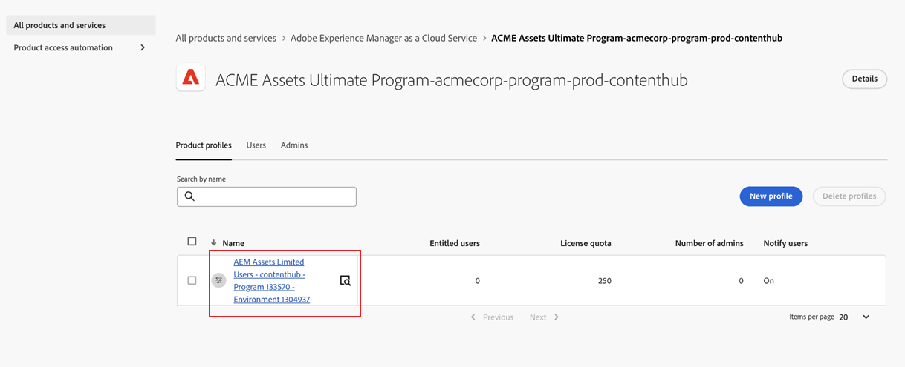
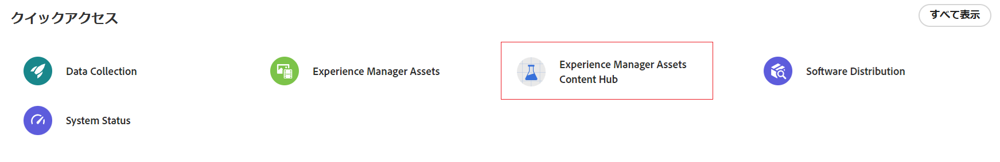

# コンテンツハブのデプロイ {#deploy-content-hub}

コンテンツハブは、Experience Manager Assets as a Cloud Service の一部として使用でき、組織とそのビジネスパートナーがオンブランドのコンテンツに簡単にアクセスできます。

Experience Manager Assets as a Cloud Service で承認済みとしてマークされたアセットは、コンテンツハブでのアセット配布に使用できます。

この記事では、ユーザーのニーズに基づいた権限のバリエーションを含む、ユーザーにコンテンツハブへのアクセスを提供するエンドツーエンドのワークフローについて説明します。

Experience Manager Assets 用のコンテンツハブを有効にする方法について詳しくは、次のビデオを参照してください。

>[!VIDEO](https://video.tv.adobe.com/v/3472936/?captions=jpn&learn=on){transcript=true}

コンテンツハブでの権限のバリエーションには、次が含まれます。

* [コンテンツハブユーザー](#onboard-content-hub-users)：コンテンツハブポータルでブランド承認済みアセットにアクセスできます。

* [コンテンツハブ管理者](#onboard-content-hub-administrator)：ブランド承認済みアセットへのアクセス、コンテンツハブへのアセットのアップロード、Adobe Express 統合による画像編集（Adobe Express 権限がある場合）に加えて、コンテンツハブの[設定ユーザーインターフェイス](/help/assets/configure-content-hub-ui-options.md)にアクセスできます。

* [アセットを追加する権限を持つコンテンツハブユーザー](#onboard-content-hub-users-add-assets)：コンテンツハブポータルでのブランド承認済みアセットへのアクセスに加えて、[コンテンツハブにアセットをアップロード](/help/assets/upload-brand-approved-assets.md)できます。

* [アセットを新しいバリエーションにリミックスする権限を持つコンテンツハブユーザー](#onboard-content-hub-users-remix-assets)：コンテンツハブポータルでのブランド承認済みアセットへのアクセスに加えて、[Adobe Express 統合](/help/assets/edit-images-content-hub.md)（Adobe Express 権限がある場合）も使用できます。

* [Experience Manager Assets ユーザー](#experience-manager-assets-users)：Experience Manager Assets as a Cloud Service でアセットを承認し、コンテンツハブで使用できます。

>[!NOTE]
>
>Content Hubにアクセスして使用できるのは、Assets UltimateのContent Hub制限付きユーザーが最大250人、Assets PrimeのContent Hub ユーザーが50人です。 ご不明な点がございましたら、Adobeの担当者にお問い合わせください。

次の表に、使用可能なコンテンツハブユーザータイプ、そのユーザーが持つ権限、およびこれらの権限を取得するのに必要な製品プロファイルの概要を示します。

| ユーザーの役割 | コンテンツハブユーザー | アセットを追加する権限を持つコンテンツハブユーザー | アセットをリミックスする権限を持つコンテンツハブユーザー | コンテンツハブ管理者 |
|---------------|----------|----------|-------------------------|---|
| **機能** |  |  |  |  |
| コンテンツハブポータルでブランド承認済みアセットにアクセス | ✓ | ✓ | ✓ | ✓ |
| コンテンツハブポータルからアセットをアップロード | − | ✓ | ✓ | ✓ |
| Adobe Express 統合を使用して画像を編集 | − | − | ✓ | − |
| コンテンツハブ設定 UI にアクセス | − | − | − | ✓ |
| **ユーザーは、次の製品プロファイル（Admin Console）に含まれている必要があります** |  |  |  |  |
| AEM／配信インスタンス／AEM Assets 制限付きユーザー | ✓ | ✓ | ✓ | ✓ |
| AEM／実稼動オーサーインスタンス／AEM ユーザー | − | ✓ | ✓ | − |
| AEM／実稼動オーサーインスタンス／AEM 管理者 | − | − | − | ✓ |
| Adobe Express | − | − | ✓ | − |
| **詳細情報** | 詳しくは、[コンテンツハブユーザー](#onboard-content-hub-users)を参照してください。 | 詳しくは、[アセットを追加する権限を持つコンテンツハブユーザー](#onboard-content-hub-users-add-assets)を参照してください。 | 詳しくは、[アセットを新しいバリエーションにリミックスする権限を持つコンテンツハブユーザー](#onboard-content-hub-users-remix-assets)を参照してください。 | 詳しくは、[コンテンツハブ管理者](#onboard-content-hub-administrator)を参照してください。 |

>[!NOTE]
>
>[Experience Manager Assets ユーザー](#experience-manager-assets-users)は、Experience Manager Assets as a Cloud Service 環境でアセットを承認し、コンテンツハブで使用できます。 これらのユーザーは、Admin Console を使用して、AEM／実稼動オーサーインスタンス／AEM ユーザーの製品プロファイルに追加する必要があります。

## 手順 1：Cloud Manager を使用して Experience Manager Assets のコンテンツハブを有効にする {#enable-content-hub}

コンテンツハブポータルにアクセスするには、管理者はまず Cloud Manager を使用して、Experience Manager Assets as a Cloud Service のコンテンツハブを有効にする必要があります。

### 権限 {#permissions-edit-program}

Cloud Manager でプログラムを編集するには、ビジネスオーナーの役割が必要です。 詳しくは、[プログラムの編集](/help/implementing/cloud-manager/getting-access-to-aem-in-cloud/editing-programs.md)を参照してください。

Experience Manager Assets 用のコンテンツハブを有効にするには、以下の手順を実行します。

1. Cloud Manager にログインします。 ログイン時に正しい組織を選択していることを確認します。 Cloud Manager に、すべてのプログラムがリストされます。

1. Experience Manager Assets as a Cloud Service プログラムに移動し、その他のオプションアイコン（。..）をクリックします。 「**[!UICONTROL プログラムを編集]**」を選択します。

   

1. [!UICONTROL プログラムを編集]ダイアログで、「**[!UICONTROL ソリューションとアドオン]**」タブを選択します。

1. 「**[!UICONTROL アセット]**」を展開し、「**[!UICONTROL コンテンツハブ]**」を選択します。
   

   >[!NOTE]
   >
   >コンテンツハブを選択した後に&#x200B;**[!UICONTROL 更新]**&#x200B;が有効になっていない場合は、プログラムの運用開始設定を指定していることを確認します。

1. 「**[!UICONTROL 更新]**」をクリックします。

これで、コンテンツハブが Experience Manager Assets as a Cloud Service で有効になります。 本番環境でコンテンツハブを有効にした後は、セルフサービス方式で無効にすることはできません。

Experience Manager Assets を初めて使用する場合は、「**[!UICONTROL プログラムを追加]**」をクリックし、プログラムの詳細（プログラム名、実稼動用の設定）を入力して、「**[!UICONTROL 続行]**」をクリックします。 次に、「**[!UICONTROL ソリューションとアドオン]**」タブで「**[!UICONTROL アセット]**」と「**[!UICONTROL コンテンツハブ]**」を選択できます。

### 下位環境でContent Hubを有効にする {#enable-content-hub-lower-environments}

AEM Assets ライセンスに基づいて、次のContent Hub クレジットを利用できます。

* Ultimate:3つのContent Hubクレジット

* Assets Prime: 1 Content Hub クレジット

* 既存のAssets as a Cloud Serviceのお客様：1 Content Hub クレジット

実稼動、開発、ステージなど、各環境でContent Hubを有効にするには、1つのクレジットを使用します。

下位環境でContent Hubを有効にするには：

1. [Cloud Manager を使用して Experience Manager Assets のコンテンツハブを有効にします](#enable-content-hub)。

1. 使用可能な環境（実稼動、開発、またはステージ）のリストを表示するには、プログラムカードをクリックします。

1. 有効にする必要がある環境をクリックします。 **[!UICONTROL Content Hub]** セクションに`Content Hub is available for activation`が表示されます。

   

1. **[!UICONTROL クリックして]**&#x200B;をアクティブ化します。 「**[!UICONTROL アクティブ化]**」をもう一度クリックして確認します。

   選択した環境でContent Hubが有効になっています。

### Admin Console のコンテンツハブのインスタンスと製品プロファイル{#content-hub-instance-product-profile}

[Cloud Manager を使用して Assets as a Cloud Service 用のコンテンツハブを有効](#enable-content-hub)にすると、Admin Console の AEM Assets as a Cloud Service 内に、サフィックスとして `delivery` が付いた新しいインスタンスが作成されます。

>[!NOTE]
>
>2024年8月14日（PT）より前にコンテンツハブをプロビジョニングした場合、新しいインスタンスはサフィックスとして `contenthub` を付けて作成されます。

コンテンツハブのインスタンス名には、`author` または `publish` がありません。

インスタンス名をクリックすると、コンテンツハブ製品プロファイルが表示されます。

>[!NOTE]
>
>2024年8月14日（PT）より前にコンテンツハブをプロビジョニングした場合、コンテンツハブ製品プロファイルには、`delivery` ではなく、`Limited Users` の後に `contenthub` が表示されます。

## 手順 2：コンテンツハブ管理者のオンボード {#onboard-content-hub-administrator}

コンテンツハブ管理者は、ブランド承認済みアセットへのアクセス、コンテンツハブへのアセットのアップロード、Adobe Express 統合による画像編集（Adobe Express 権限がある場合）に加えて、コンテンツハブの[設定ユーザーインターフェイス](/help/assets/configure-content-hub-ui-options.md)にアクセスできます。

コンテンツハブ管理者をオンボードするには：

1. [コンテンツハブユーザー製品プロファイルにアクセスしてクリックします](#content-hub-instance-product-profile)。

1. 「**[!UICONTROL ユーザーを追加]**」をクリックして、製品プロファイルにユーザーまたはユーザーグループを追加します。

1. 「**[!UICONTROL 保存]**」をクリックして、変更を保存します。

1. ユーザーをコンテンツハブ製品プロファイルに追加した後、Admin Console の製品のリストで AEM as a Cloud Service 製品名をクリックして、Experience Manager Assets 製品プロファイルにアクセスします。

1. AEM as a Cloud Service の実稼動オーサーインスタンスをクリックします。
   

   Admin Console には、AEM as a Cloud Service の 2 つの製品プロファイル（管理者とユーザー）が表示されます。
1. 管理者製品プロファイルをクリックし、「**[!UICONTROL ユーザーを追加]**」をクリックして、製品プロファイルにユーザーを追加します。
   

1. 「**[!UICONTROL 保存]**」をクリックして、変更を保存します。

## 手順 3：コンテンツハブユーザーのオンボード {#onboard-content-hub-users}

コンテンツハブユーザーは、ポータルで使用可能なアセットにアクセスできますが、新しいアセットを追加することや既存のアセットを変更できません。

コンテンツハブユーザーをオンボードするには：

1. [コンテンツハブユーザー製品プロファイルにアクセスしてクリックします](#content-hub-instance-product-profile)。

1. 「**[!UICONTROL ユーザーを追加]**」をクリックして、製品プロファイルにユーザーまたはユーザーグループを追加します。

1. 「**[!UICONTROL 保存]**」をクリックして、変更を保存します。

これで、これらのユーザーは、コンテンツハブポータルで使用可能なアセットにアクセスできます。

>[!NOTE]
>
>外部 ID プロバイダーとの同期など、すべての高度なエンタープライズ機能を使用できます。

### コンテンツハブへのアクセス方法 {#access-content-hub}

コンテンツハブには、次の方法でアクセスできます。

* 次のリンクを使用して、コンテンツハブにアクセスします。

  `https://experience.adobe.com/#/assets/contenthub`

* `experience.adobe com` にログオンし、「**[!UICONTROL クイックアクセス]**」セクションで使用可能な「**[!UICONTROL Experience Manager Assets コンテンツハブ]**」をクリックします。
  

* `experience.adobe com` にログオンし、製品スイッチャーで使用可能な「**[!UICONTROL Experience Manager Assets コンテンツハブ]**」をクリックします。
  

### ユーザーへのメール通知を無効にする {#disable-email-notifications}

ユーザーがコンテンツハブ製品プロファイルに追加された際に、管理者がユーザーに送信されるメール通知を無効にする必要がある場合：

製品プロファイル名の横にある検索アイコンをクリックし、**[!UICONTROL メールでユーザーに通知]**&#x200B;切替スイッチを無効にします。

## 手順 4：アセットを追加する権限を持つコンテンツハブユーザーのオンボード（オプション） {#onboard-content-hub-users-add-assets}

アセットを追加する権限を持つコンテンツハブユーザーは、[新しいブランド承認済みアセットをコンテンツハブにアップロード](/help/assets/upload-brand-approved-assets.md)できます。

ユーザーを追加する権限を持つコンテンツハブユーザーをオンボードするには：

1. [ユーザーをコンテンツハブ製品プロファイルに追加した後](#onboard-content-hub-users)、Admin Console の製品のリストで AEM as a Cloud Service 製品名をクリックして、Experience Manager Assets 製品プロファイルにアクセスします。

1. AEM as a Cloud Service の実稼動オーサーインスタンスをクリックします。
   

   Admin Console には、AEM as a Cloud Service の 2 つの製品プロファイル（管理者とユーザー）が表示されます。
1. ユーザー製品プロファイルをクリックし、「**[!UICONTROL ユーザーを追加]**」をクリックして、製品プロファイルにユーザーを追加します。
   

1. 「**[!UICONTROL 保存]**」をクリックして、変更を保存します。

## 手順 4：アセットを新しいバリエーションにリミックスする権限を持つコンテンツハブユーザーのオンボード（オプション） {#onboard-content-hub-users-remix-assets}

アセットを新しいバリエーションにリミックスする権限を持つコンテンツハブユーザーは、[Adobe Express を使用して既存のアセットを変更し、そのアセットをリポジトリに保存](/help/assets/edit-images-content-hub.md)できます。 Adobe Express を使用してアセットを編集できるのは、ユーザーが Adobe Express 権限を持っている場合のみです。

アセットを新しいバリエーションにリミックスする権限を持つコンテンツハブユーザーをオンボードするには：

1. [ユーザーをコンテンツハブ製品プロファイルに追加した後](#onboard-content-hub-users)、Admin Console の製品のリストで AEM as a Cloud Service 製品名をクリックして、Experience Manager Assets 製品プロファイルにアクセスします。

1. AEM as a Cloud Service の実稼動オーサーインスタンスをクリックします。
   

   Admin Console には、AEM as a Cloud Service の 2 つの製品プロファイル（管理者とユーザー）が表示されます。
1. ユーザー製品プロファイルをクリックし、「**[!UICONTROL ユーザーを追加]**」をクリックして、製品プロファイルにユーザーを追加します。
   

1. 「**[!UICONTROL 保存]**」をクリックして、変更を保存します。

## Experience Manager Assets ユーザー {#experience-manager-assets-users}

Experience Manager Assets ユーザーは、AEM as a Cloud Service 上のアセットを承認して、コンテンツハブで使用できます。

Experience Manager Assets ユーザーを設定するには：

1. Admin Console の製品のリストで AEM as a Cloud Service 製品名をクリックして、Experience Manager Assets 製品プロファイルにアクセスします。

1. AEM as a Cloud Service の実稼動オーサーインスタンスをクリックします。
   

   Admin Console には、AEM as a Cloud Service の 2 つの製品プロファイル（管理者とユーザー）が表示されます。
1. ユーザー製品プロファイルをクリックし、「**[!UICONTROL ユーザーを追加]**」をクリックして、製品プロファイルにユーザーを追加します。
   

1. 「**[!UICONTROL 保存]**」をクリックして、変更を保存します。

   >[!NOTE]
   >
   > Experience Manager Assets ユーザーの場合は、[コンテンツハブ製品プロファイル](#onboard-content-hub-users)に追加する必要はありません。

## 既存のAssets as a Cloud Serviceのお客様にContent Hubを有効にする {#enable-content-hub-exisitng-cs-customers}

既存のAssets as a Cloud Serviceのお客様には、250人のContent Hub Limited ユーザーがライセンスに含まれています。 Content Hubを有効にするには、次の手順を実行します。

1. [Cloud Manager を使用して Experience Manager Assets のコンテンツハブを有効にします](#enable-content-hub)。

1. [Content Hub制限付きユーザー](#onboard-content-hub-users)のオンボーディング。 これらのユーザーはポータルで利用可能なアセットにアクセスできますが、新しいアセットを追加したり、既存のアセットを変更したりすることはできません。

1. ユーザーがContent Hub ポータルにアセットを追加する必要がある場合は、それらを`AEM Users`製品プロファイルに追加します。 詳しくは、「[Content Hub ユーザーにアセットを追加する権限を付与してオンボーディングする](#onboard-content-hub-users-add-assets)」を参照してください。

1. ユーザーがContent Hub Configuration User Interfaceにアクセスする必要がある場合は、それらを`AEM Administrators`製品プロファイルに追加します。 詳しくは、[Content Hub管理者のオンボード &#x200B;](#onboard-content-hub-administrator)を参照してください。

関連する製品プロファイルにユーザーを追加しても適切な権限が付与されない場合は、Adobe担当者にお問い合わせください。

## よくある質問 {#faqs-deploy-content-hub}

### AEM Assets Content Hubへのアクセス方法と割り当て可能な権限を教えてください。

Content Hubの関連する商品プロファイルにユーザーを割り当てることで、Adobe Admin Consoleを介してAEM Assets Content Hubにユーザーを追加できます。

ユーザーは次の権限を使用できます。

* Content HubからContent Hub Portalにアクセスして、ブランド承認済みアセットにアクセスできます。

* Content Hub管理者は、ブランド承認済みアセットへのアクセス、Content Hubへのアセットのアップロード、Adobe Express統合による画像の編集に加えて、Content Hubの設定ユーザーインターフェイスにアクセスできます（Adobe Expressの使用権限がある場合）。

* アセットを追加する権限を持つContent Hub ユーザーは、Content Hub ポータルでブランド承認済みアセットにアクセスするだけでなく、Content Hubにアセットをアップロードできます。

* アセットをリミックスする権限を持つContent Hub ユーザーは、Content Hub ポータルでのブランド承認済みアセットへのアクセスに加えて、Adobe Express（Adobe Expressの使用権限がある場合）にアクセスできます。

### AEM Assets Content Hubでは、さまざまなタイプの利用者が利用できる様々な商品プロファイルはどれですか？

商品プロファイルは、AEM Assets Content Hubでさまざまなタイプのユーザーが利用できます。

* Content Hub ユーザー：AEM Assets制限付きユーザー

* Content Hub管理者：AEM Assets制限付きユーザー+ AEM管理者

* アセットを追加する権限を持つContent Hub ユーザー：AEM Assets制限付きユーザー+ AEM ユーザー

* アセットをリミックスする権限を持つContent Hub ユーザー：AEM Assets制限付きユーザー+ AEM ユーザー

### 管理者は、組織に対してAEM Assets Content Hubをどのように有効にできますか？

AEM Assets Content Hubを有効にするには、Cloud Managerにログインし、プログラムを選択または作成し、「ソリューションとアドオン」タブでAssetsとContent Hubを有効にし、プログラムを更新する必要があります。 これにより、Adobe Admin ConsoleにContent Hub インスタンスが作成され、ユーザーアクセスを管理できます。

### AEM Assetsに含まれているContent Hub制限付きユーザーの数 {#content-hub-limited-users-with-aem-assets}

[Assets Ultimate](/help/assets/assets-ultimate-overview.md)およびAssets as a Cloud Serviceには、それぞれ250人のContent Hub限定ユーザーが含まれます。一方、[Assets Prime](/help/assets/assets-prime.md)には50人のContent Hub限定ユーザーが含まれます。

### AEM Assets ライセンスで利用できるContent Hub クレジットの数を教えてください。

利用可能なContent Hub クレジットの数は、AEM Assets ライセンスによって異なります。

* Assets Ultimateには、3つのContent Hub クレジットが含まれています。

* Assets Primeには、1つのContent Hub クレジットが含まれています。

* 既存のAssets as a Cloud Serviceのお客様には、1つのContent Hub クレジットが付与されます。

### AEM Assets Content Hub クレジットはどのように使用されますか？

Content Hubが有効になっている環境ごとに1つのContent Hub クレジットが消費されます。 例えば、実稼動環境、開発環境、ステージ環境でContent Hubを有効にするには、3つのクレジットが必要です。

### 下位の環境でContent Hubを有効にできますか？

はい。 利用可能なAEM Assets クレジットがあれば、開発やステージなどの下位の環境でContent Hub Content Hubを有効にすることができます。 各下位の環境を有効にすると、1つのクレジットが消費されます。

### AEM Assets Content Hubで承認済みアセットにアクセスする権限を持つにはどうすればよいですか？

AEM Assets Content Hub ユーザーは、Content Hub ポータルからブランド承認済みアセットにアクセスできます。 Content Hub ユーザーになるには、AEM制限付きユーザー製品プロファイルに追加する必要があります。

### AEM Assets Content Hubでアセットをアップロードする権限を持つにはどうすればよいですか？

AEM Assets アセットを追加する権限を持つContent Hub ユーザーは、Content Hub ポータルでブランド承認済みアセットにアクセスするだけでなく、Content Hubにアセットをアップロードできます。 アセットを追加する権限を持つContent Hub ユーザーになるには、AEM限定ユーザーおよびAEM ユーザーの製品プロファイルに追加する必要があります。

### AEM Assets Content Hubの設定ユーザーインターフェイスにアクセスする権限を持つにはどうすればよいですか？

AEM Assets Content Hubの管理者は、ブランド承認済みアセットへのアクセス、Content Hubへのアセットのアップロード、Content Hubとの統合による画像の編集に加えて、Adobe Expressの設定ユーザーインターフェイスにアクセスできます（Adobe Expressの使用権限がある場合）。 Content Hub管理者になるには、AEMの制限付きユーザーおよびAEM管理者の製品プロファイルに追加する必要があります。

### AEM Assets Content HubでAdobe Expressを使用して画像を編集する権限を持つにはどうすればよいですか？

アセットをリミックスする権限を持つAEM Assets Content Hub ユーザーは、Content Hub ポータルでブランド承認済みアセットにアクセスするだけでなく、Adobe Express（Adobe Expressの使用権限を持っている場合）にもアクセスできます。 アセットをリミックスする権限を持つContent Hub ユーザーになるには、AEM限定ユーザーおよびAEM ユーザーの製品プロファイルに追加する必要があります。

**関連情報**

* [アセットを翻訳](/help/assets/translate-assets.md)
* [Assets HTTP API](/help/assets/mac-api-assets.md)
* [AEM Assets as a Cloud Service でサポートされているファイル形式](/help/assets/file-format-support.md)
* [アセットを検索](/help/assets/search-assets.md)
* [接続されたアセット](/help/assets/use-assets-across-connected-assets-instances.md)
* [アセットレポート](/help/assets/asset-reports.md)
* [メタデータスキーマ](/help/assets/metadata-schemas.md)
* [アセットをダウンロード](/help/assets/download-assets-from-aem.md)
* [メタデータを管理](/help/assets/manage-metadata.md)
* [Dynamic Media テンプレートの管理](/help/assets/dynamic-media/manage-dynamic-media-templates.md)
* [レポートの管理](/help/assets/manage-reports-assets-view.md)
* [検索ファセット](/help/assets/search-facets.md)
* [コレクションを管理](/help/assets/manage-collections.md)
* [メタデータの一括読み込み](/help/assets/metadata-import-export.md)
* [AEM および Dynamic Media へのアセットの公開](/help/assets/publish-assets-to-aem-and-dm.md)

