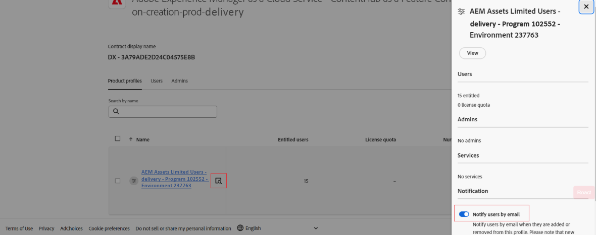

# コンテンツハブのデプロイ {#deploy-content-hub}

| [検索のベストプラクティス](/help/assets/search-best-practices.md) | [メタデータのベストプラクティス](/help/assets/metadata-best-practices.md) | [コンテンツハブ](/help/assets/product-overview.md) | [OpenAPI 機能を備えた Dynamic Media](/help/assets/dynamic-media-open-apis-overview.md) | [AEM Assets 開発者向けドキュメント](https://developer.adobe.com/experience-cloud/experience-manager-apis/) |
| ------------- | --------------------------- |---------|----|-----|

>[!AVAILABILITY]
>
>Content Hub ガイドがPDF形式で利用できるようになりました。 ガイド全体をダウンロードし、Adobe Acrobat AI アシスタントを使用して質問に答えます。
>
>[!BADGE Content Hub ガイドのPDF]{type=Informative url="https://helpx.adobe.com/content/dam/help/en/experience-manager/aem-assets/content-hub.pdf"}

Content Hubは、組織やビジネスパートナーがオンブランドのコンテンツにアクセスしやすくするために、Experience Manager Assetsas a Cloud Serviceの一部として利用できます。

Experience Manager Assetsのas a Cloud Serviceで承認済みとマークされたアセットは、Content Hubでアセットを配布することができます。

この記事では、必要に応じた権限のバリエーションなど、Content Hubへのアクセスをユーザーに提供するエンドツーエンドのワークフローを説明します。

Content Hubに対する権限には、次のような種類があります。

* [Content Hub ユーザー ](#onboard-content-hub-users): Content Hub ポータルでブランド承認済みアセットにアクセスします。

* [Content Hub管理者 ](#onboard-content-hub-administrator): ブランド承認済みアセットへのアクセス、Content Hubへのアセットのアップロード、画像を編集するためのAdobe Express統合（Adobe Express権限がある場合）に加えて、Content Hubの [ 設定ユーザーインターフェイス ](/help/assets/configure-content-hub-ui-options.md) にアクセスできます。

* [ アセットを追加する権限を持つContent Hub ユーザー ](#onboard-content-hub-users-add-assets):Content Hub ポータルでブランド承認済みアセットにアクセスできるだけでなく、Content Hubにアセットをアップロード ](/help/assets/upload-brand-approved-assets.md) できます [。

* [ アセットを新しいバリエーションに混在させる権限を持つContent Hub ユーザー ](#onboard-content-hub-users-remix-assets):Content Hub ポータルでブランド承認済みAdobe Expressにアクセスできるだけでなく、[Adobe Express統合 ](/help/assets/edit-images-content-hub.md) （アセット権限がある場合）を利用できます。

* [Experience Manager Assets ユーザー ](#experience-manager-assets-users): Experience Manager Assetsでアセットを承認して、それらのアセットをContent Hubで利用できるようにする機能のas a Cloud Service。

次の表に、使用可能なContent Hub ユーザータイプ、ユーザーの権限およびこれらの権限を取得するために必要な製品プロファイルの概要を示します。

| ユーザーの役割 | Content Hub ユーザー | アセットを追加する権限を持つContent Hub ユーザー | アセットを混在させる権限を持つContent Hub ユーザー | Content Hub管理者 |
|---------------|----------|----------|-------------------------|---|
| **機能** |
| Content Hub ポータルでブランド承認済みアセットにアクセスする | ✓ | ✓ | ✓ | ✓ |
| Content Hub ポータルからのアセットのアップロード | − | ✓ | ✓ | ✓ |
| Adobe Express統合を使用した画像の編集 | − | − | ✓ | − |
| Content Hub設定 UI へのアクセス | − | − | − | ✓ |
| **ユーザーはこれらの製品プロファイル （Admin Console）に存在する必要があります** |
| AEM /配信インスタンス / AEM Assetsの限定ユーザー | ✓ | ✓ | ✓ | ✓ |
| AEM/実稼動オーサーインスタンス/AEM ユーザー | − | ✓ | ✓ | − |
| AEM /実稼動オーサーインスタンス / AEM管理者 | − | − | − | ✓ |
| Adobe Express | − | − | ✓ | − |
| **詳細情報** | [Content Hub ユーザー ](#onboard-content-hub-users) を表示 | アセットを追加する権限を持つ [Content Hub ユーザーを参照してください ](#onboard-content-hub-users-add-assets) | アセットを新しいバリエーションに混在させる権限を持つ [Content Hub ユーザーを参照してください ](#onboard-content-hub-users-remix-assets) | [Content Hub管理者 ](#onboard-content-hub-administrator) を参照してください |

>[!NOTE]
>
[Experience Manager Assets ユーザー ](#experience-manager-assets-users)Experience Manager Assetsas a Cloud Service環境でアセットを承認して、それらのアセットをContent Hubで利用できるようにする機能があります。 これらのユーザーは、Admin Consoleを使用して、AEM/実稼動オーサーインスタンス/AEM ユーザー製品プロファイルに追加する必要があります。

## 手順 1:Cloud Managerを使用してContent Hub for Experience Manager Assetsを有効にする {#enable-content-hub}

Content Hub ポータルにアクセスするには、管理者はまずCloud Managerを使用してContent Hub for Experience Manager Assetsas a Cloud Serviceを有効にする必要があります。 次の手順を実行します。

1. Cloud Managerにログオンします。 ログイン時に適切な組織を選択していることを確認します。 Cloud Managerにすべてのプログラムが一覧表示されます。

1. Experience Manager Assetsas a Cloud Serviceプログラムに移動し、「その他のオプション」アイコン（...）をクリックして「**[!UICONTROL プログラムを編集]**」を選択します。

   

1. [!UICONTROL  プログラムを編集 ] ダイアログで、「**[!UICONTROL ソリューションとアドオン]** タブを選択します。

1. 「**[!UICONTROL Assets]**」を展開し、「**[!UICONTROL Content Hub]**」を選択します。
   

   >[!NOTE]
   >
   Content Hubを選択した後 **[!UICONTROL アップデート]** が有効になっていない場合は、プログラムの運用開始設定が指定されていることを確認してください。

1. 「**[!UICONTROL 更新]**」をクリックします。

Content HubがExperience Manager Assetsas a Cloud Serviceに対して有効になりました。 実稼動環境でContent Hubを有効にした後は、セルフサービス方式で無効にすることはできません。

>[!NOTE]
>
最大 250 人のContent Hub ユーザーがContent Hubにアクセスして使用できます。 その他の質問がある場合は、Adobeの担当者にお問い合わせください。

Experience Manager Assetsを初めて使用する場合は、「**[!UICONTROL プログラムを追加]**」をクリックし、プログラムの詳細（プログラム名、実稼動用に設定）を入力して、「**[!UICONTROL 続行]**」をクリックします。 その後、「{ ソリューションとアドオン ]**」タブで]** 0}Assets **[!UICONTROL と]** 2}Content Hub} を選択できます。**[!UICONTROL **[!UICONTROL 

### Admin Console時のContent Hub インスタンスと製品プロファイル{#content-hub-instance-product-profile}

[Cloud Managerを使用してAssetsas a Cloud Service用にContent Hubを有効にする ](#enable-content-hub) を行うと、Admin Console時にAEM Assetsas a Cloud Service内に新しいインスタンスが作成され、サフィックスに `delivery` が付きます。

>[!NOTE]
>
2024 年 8 月 14 日（PT）より前にContent Hubをプロビジョニングしている場合、新しいインスタンスは `contenthub` をサフィックスとして使用して作成されます。

Content Hubのインスタンス名には `author` や `publish` はありません。

インスタンス名をクリックして、Content Hub製品プロファイルを表示します。

>[!NOTE]
>
2024 年 8 月 14 日（PT）より前にContent Hubをプロビジョニングしている場合、Content Hub製品プロファイルには `delivery` ではなく `Limited Users` の後に記載さ `contenthub` ています。

## 手順 2:Content Hub管理者をオンボーディングする {#onboard-content-hub-administrator}

Content Hub管理者は、ブランド承認済みアセットへのアクセス、Content Hubへのアセットのアップロード、画像を編集するAdobe Express統合に加えて、Content Hubの [ 設定ユーザーインターフェイス ](/help/assets/configure-content-hub-ui-options.md) にアクセスできます（Adobe Expressの使用権限がある場合）。

Content Hub管理者をオンボーディングするには：

1. [Content Hub ユーザー製品プロファイルにアクセスしてクリックします ](#content-hub-instance-product-profile)。

1. 「**[!UICONTROL ユーザーを追加]**」をクリックして、ユーザーまたはユーザーグループを製品プロファイルに追加します。

1. 「**[!UICONTROL 保存]**」をクリックして、変更を保存します。

1. Content Hub製品プロファイルにユーザーを追加した後、Admin Console上の製品のリストでExperience Manager Assets製品名をクリックして、AEM as a Cloud Service製品プロファイルにアクセスします。

1. AEM as a Cloud Service用の実稼動オーサーインスタンスをクリックします。
   

   Admin Consoleには、AEM as a Cloud Service用の 2 つの製品プロファイル（Administrators と Users）が表示されます。
1. 管理者製品プロファイルをクリックし、**[!UICONTROL ユーザーを追加]** をクリックして、ユーザーを製品プロファイルに追加します。
   

1. 「**[!UICONTROL 保存]**」をクリックして、変更を保存します。

## 手順 3:Content Hub ユーザーのオンボーディング {#onboard-content-hub-users}

Content Hub ユーザーは、ポータルで使用可能なアセットにアクセスできますが、新しいアセットを追加したり、既存のアセットを変更したりすることはできません。

Content Hub ユーザーをオンボーディングするには：

1. [Content Hub ユーザー製品プロファイルにアクセスしてクリックします ](#content-hub-instance-product-profile)。

1. 「**[!UICONTROL ユーザーを追加]**」をクリックして、ユーザーまたはユーザーグループを製品プロファイルに追加します。

1. 「**[!UICONTROL 保存]**」をクリックして、変更を保存します。

これで、これらのユーザーは、Content Hub ポータルで使用可能なアセットにアクセスできます。

>[!NOTE]
>
外部 ID プロバイダーとの同期など、高度なエンタープライズ機能をすべて使用できます。

### Content Hubへのアクセス方法 {#access-content-hub}

Content Hubには、次の方法でアクセスできます。

* 次のリンクを使用してContent Hubにアクセスします。

  `https://experience.adobe.com/#/assets/contenthub`

* `experience.adobe com` にログオンし、「**[!UICONTROL クイックアクセス]**」セクションの {1 ]**Experience Manager Assets Content Hub} をクリックします。**[!UICONTROL 
  

* `experience.adobe com` にログオンし、製品スイッチャーで使用可能な **[!UICONTROL Experience Manager Assets Content Hub]** をクリックします。
  

### ユーザーへのメール通知を無効にする {#disable-email-notifications}

管理者が、ユーザーがContent Hub製品プロファイルに追加されたときに送信されるメール通知を無効にする必要がある場合：

製品プロファイル名の横にある検索アイコンをクリックし、「**[!UICONTROL メールでユーザーに通知]**」トグルを無効にします。

## 手順 4：アセットを追加する権限を持つContent Hub ユーザーをオンボーディングする（オプション） {#onboard-content-hub-users-add-assets}

アセットを追加する権限を持つContent Hub ユーザーは、[ ブランドが承認した新しいアセットをContent Hubにアップロード ](/help/assets/upload-brand-approved-assets.md) できます。

ユーザーを追加する権限でContent Hub ユーザーをオンボーディングするには：

1. [Content Hub製品プロファイルにユーザーを追加した後 ](#onboard-content-hub-users)、Admin Consoleされている製品のリストでAEM as a Cloud Service製品名をクリックして、Experience Manager Assets製品プロファイルにアクセスします。

1. AEM as a Cloud Service用の実稼動オーサーインスタンスをクリックします。
   

   Admin Consoleには、AEM as a Cloud Service用の 2 つの製品プロファイル（Administrators と Users）が表示されます。
1. ユーザー製品プロファイルをクリックし、「**[!UICONTROL ユーザーを追加]**」をクリックして、ユーザーを製品プロファイルに追加します。
   

1. 「**[!UICONTROL 保存]**」をクリックして、変更を保存します。

## 手順 4：アセットを新しいバリエーションに混在させる権限を持つContent Hub ユーザーをオンボーディングする（オプション） {#onboard-content-hub-users-remix-assets}

アセットを新しいバリエーションにリミックスする権限を持つContent Hub ユーザーは、[Adobe Expressを使用して既存のアセットを変更し、アセットをリポジトリに保存 ](/help/assets/edit-images-content-hub.md) できます。 Adobe Expressを使用したアセットの編集は、ユーザーがAdobe Express権限を持っている場合にのみ使用できます。

アセットを新しいバリエーションに混在させる権限を持つContent Hub ユーザーをオンボーディングするには：

1. [Content Hub製品プロファイルにユーザーを追加した後 ](#onboard-content-hub-users)、Admin Consoleされている製品のリストでAEM as a Cloud Service製品名をクリックして、Experience Manager Assets製品プロファイルにアクセスします。

1. AEM as a Cloud Service用の実稼動オーサーインスタンスをクリックします。
   

   Admin Consoleには、AEM as a Cloud Service用の 2 つの製品プロファイル（Administrators と Users）が表示されます。
1. ユーザー製品プロファイルをクリックし、「**[!UICONTROL ユーザーを追加]**」をクリックして、ユーザーを製品プロファイルに追加します。
   

1. 「**[!UICONTROL 保存]**」をクリックして、変更を保存します。

## Experience Manager Assets ユーザー {#experience-manager-assets-users}

Experience Manager Assets ユーザーは、Content Hubで使用できるように、AEM as a Cloud Service上のアセットを承認できます。

Experience Manager Assets ユーザーを設定するには：

1. Admin Console時の製品のリストでExperience Manager Assets製品名をクリックして、AEM as a Cloud Service製品プロファイルにアクセスします。

1. AEM as a Cloud Service用の実稼動オーサーインスタンスをクリックします。
   

   Admin Consoleには、AEM as a Cloud Service用の 2 つの製品プロファイル（Administrators と Users）が表示されます。
1. ユーザー製品プロファイルをクリックし、「**[!UICONTROL ユーザーを追加]**」をクリックして、ユーザーを製品プロファイルに追加します。
   

1. 「**[!UICONTROL 保存]**」をクリックして、変更を保存します。

   >[!NOTE]
   >
   Experience Manager Assets ユーザーの場合、[Content Hub製品プロファイル ](#onboard-content-hub-users) に追加される必要はありません。
