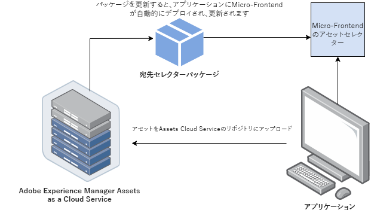
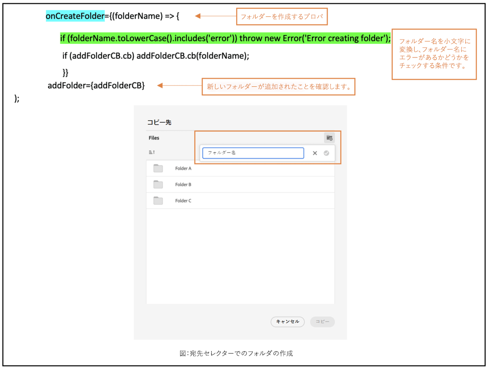
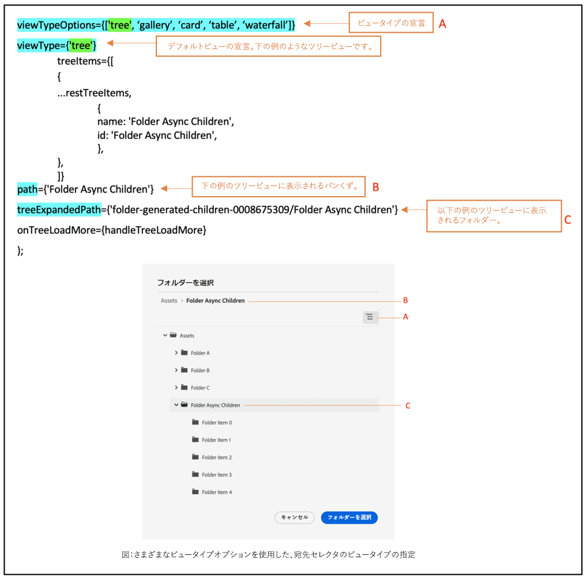
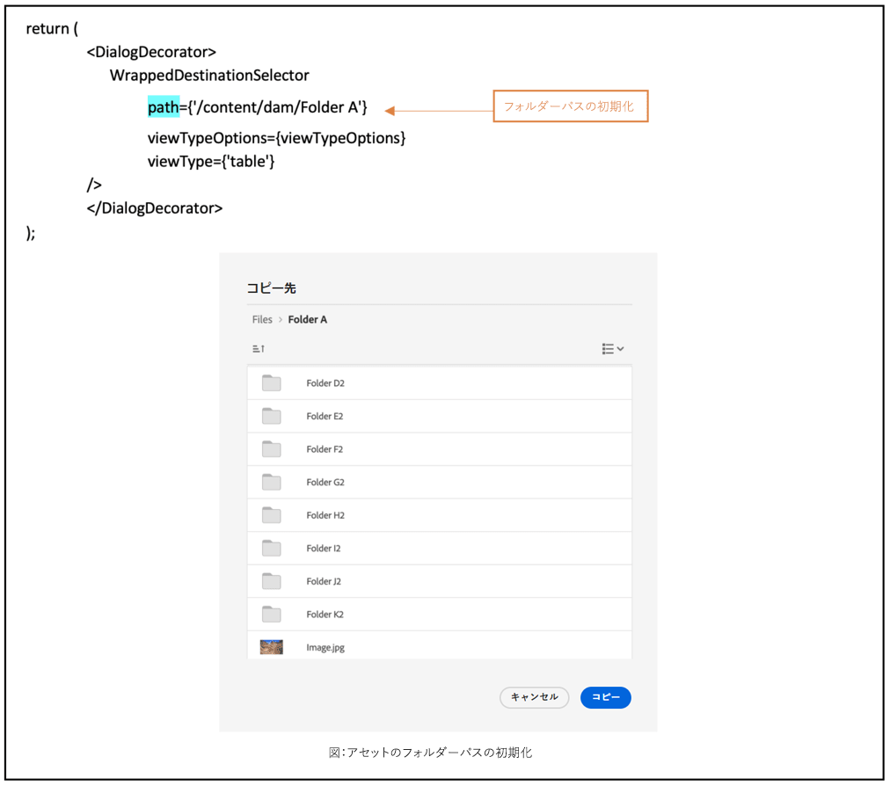

# マイクロフロントエンドの宛先セレクター {#Overview}

| [検索のベストプラクティス](/help/assets/search-best-practices.md) | [メタデータのベストプラクティス](/help/assets/metadata-best-practices.md) | [コンテンツハブ](/help/assets/product-overview.md) | [OpenAPI 機能を備えた Dynamic Media](/help/assets/dynamic-media-open-apis-overview.md) | [AEM Assets 開発者向けドキュメント](https://developer.adobe.com/experience-cloud/experience-manager-apis/) |
| ------------- | --------------------------- |---------|----|-----|

マイクロフロントエンドの宛先セレクターには、アプリケーション内に [!DNL Experience Manager Assets as a Cloud Service] リポジトリと簡単に統合できるユーザーインターフェイスがあります。[!DNL Experience Manager Assets as a Cloud Service] リポジトリ内の適切なフォルダーを検索または参照して、アプリケーションからアセットをアップロードできます。

宛先セレクターパッケージを使用すると、マイクロフロントエンドのユーザーインターフェイスをアプリケーションエクスペリエンスで利用できるようになります。パッケージのアップデートはすべて自動的に読み込まれ、アプリケーション内にデプロイされた最新の宛先セレクターが自動的に読み込まれます。



宛先セレクターには、次のような多くの利点があります。

* Vanilla JavaScript ライブラリを使用して、あらゆるアドビアプリケーションまたはアドビ以外のアプリケーションと簡単に統合できます。
* 宛先セレクターパッケージのアップデートがアプリケーションで使用可能な宛先セレクターに自動的にデプロイされるため、管理が簡単です。最新の修正内容を読み込むために、アプリケーション内でアップデートを行う必要がありません。
* アプリケーション内の宛先セレクターの表示を制御するプロパティを利用できるため、カスタマイズが容易です。
* 全文検索を使用して、フォルダーに素早く移動し、アプリケーションからアセットをアップロードできます。
* フォルダーの作成、フォルダーの昇順または降順で並べ替え、リスト、グリッド、ギャラリー、ウォーターフォール表示で表示する機能があります。

この記事では、統合シェルの下で [!DNL Adobe] アプリケーションと連携して宛先セレクターを使用する方法、または認証用に生成された imsToken が既にある場合に宛先セレクターを使用する方法について説明します。この記事では、これらのワークフローを非 SUSI フローと呼びます。

次のタスクを実行して宛先セレクターを [!DNL Experience Manager Assets as a Cloud Service] リポジトリと統合し、連携して使用します。

* [Vanilla JS を使用した宛先セレクターの統合](#integration-with-vanilla-js)
* [宛先セレクターの表示プロパティの定義](#destination-selector-properties)
* [宛先セレクターを使用](#using-destination-selector)

## Vanilla JS を使用した宛先セレクターの統合 {#integration-with-vanilla-js}

あらゆる [!DNL Adobe] アプリケーションまたはアドビ以外のアプリケーションを [!DNL Experience Manager Assets] as a [!DNL Cloud Service] リポジトリと統合し、アプリケーション内からアセットを選択できます。

統合は、宛先セレクターパッケージを読み込み、Vanilla JavaScript ライブラリを使用して Assets as a Cloud Service に接続することで行われます。アプリケーション内の `index.html` または適切なファイルを、次の目的で編集する必要があります。

* 認証の詳細を定義する
* Assets as a Cloud Service リポジトリにアクセスする
* 宛先セレクターの表示プロパティを設定する

次の場合は、一部の IMS プロパティを定義せずに認証を実行できます。

* [統合シェル](https://experienceleague.adobe.com/docs/experience-manager-cloud-service/content/overview/aem-cloud-service-on-unified-shell.html?lang=ja)の [!DNL Adobe] アプリケーションを統合している場合。
* 認証用に既に IMS トークンが生成されている場合。

## 前提条件 {#prerequisites}

アプリケーション実装内の `index.html` ファイルまたは同様のファイルで前提条件を定義して、[!DNL Experience Manager Assets] as a [!DNL Cloud Service] リポジトリにアクセスするための認証の詳細を定義します。前提条件は次のとおりです。

* imsOrg
* imsToken
* apikey

## インストール {#installation}

宛先セレクターは、ESM CDN 経由（例：[esm.sh](https://esm.sh/)／[skypack](https://www.skypack.dev/)）および [UMD](https://github.com/umdjs/umd) バージョン経由のいずれでも使用できます。

**UMD バージョン**&#x200B;を使用しているブラウザー（推奨）：

**UMD バージョン**&#x200B;を使用しているブラウザー（推奨）：

```
<script src="https://experience.adobe.com/solutions/CQ-assets-selectors/static-assets/resources/assets-selectors.js"></script>

<script>
  const { renderAssetSelector } = PureJSSelectors;
</script>
```

**ESM CDN バージョン**&#x200B;を使用している `import maps` 対応ブラウザー：

```
<script type="module">
  import { AssetSelector } from 'https://experience.adobe.com/solutions/CQ-assets-selectors/static-assets/resources/@assets/selectors/index.js'
</script>
```

**ESM CDN バージョン**&#x200B;を使用している Deno/Webpack Module Federation：

```
import { AssetSelector } from 'https://experience.adobe.com/solutions/CQ-assets-selectors/static-assets/resources/@assets/selectors/index.js'
```

### 選択した宛先 {#selected-destination}

宛先セレクターは、`onItemSelect`、`onTreeToggleItem` または `onTreeSelectionChange` から、オブジェクト（ディレクトリ、画像など）を含む選択されたディレクトリを含むコールバックを受け取ります。

**スキーマ構文**

```
interface SelectedDestination {
  id: string;
  children: SelectedDestination[];
  'repo:repositoryId': string;
  'dc:format': string;
  'repo:assetClass': string;
  'storage:directoryType': string;
  'storage:region': string;
  'repo:name': string;
  'repo:path': string;
  'repo:ancestors': string[];
  'repo:createDate': string;
  'storage:assignee':

  { type: string; id: string; }
  ;
  'repo:assetId': string;
  'aem:published': boolean;
  'repo:createdBy': string;
  'repo:state': string;
  'repo:id': string;
  'repo:modifyDate': string;
  _page:

  { orderBy: string; count: number; };
}
```

次の表に、選択された宛先の重要なプロパティの一部を示します。

| Property | タイプ | 説明 |
|---|---|---|
| *repo:repositoryId* | 文字列 | アセットが保存されるリポジトリの一意の ID。 |
| *repo:id* | 文字列 | アセットの一意の ID。 |
| *repo:assetClass* | 文字列 | アセットの分類（例：画像、ビデオ、ドキュメント）。 |
| *repo:name* | 文字列 | ファイル拡張子を含むアセットの名前。 |
| *repo:size* | 数値 | アセットのサイズ（バイト単位）。 |
| *repo:path* | 文字列 | リポジトリ内のアセットの場所。 |
| *repo:ancestors* | `Array<string>` | リポジトリ内のアセットの上位項目の配列。 |
| *repo:state* | 文字列 | リポジトリ内のアセットの現在のステータス（例：アクティブ、削除済みなど）。 |
| *repo:createdBy* | 文字列 | アセットを作成したユーザーまたはシステム。 |
| *repo:createDate* | 文字列 | アセットが作成された日時。 |
| *repo:modifiedBy* | 文字列 | アセットを最後に変更したユーザーまたはシステム。 |
| *repo:modifyDate* | 文字列 | アセットが最後に変更された日時。 |
| *dc:format* | 文字列 | アセットの形式。 |
| *_page* | orderBy：文字列; カウント; 数字; | ドキュメントのページ番号を含めます。 |

プロパティの完全なリストと詳細な例については、[宛先セレクターのコード例](https://github.com/adobe/aem-assets-selectors-mfe-examples)を参照してください。

### 非 SUSI フローの例 {#non-ims-vanilla}

この例では、統合シェルの下で [!DNL Adobe] アプリケーションを実行している場合、または認証用に生成された `imsToken` が既にある場合に、宛先セレクターを非 SUSI フローと連携して使用する方法を示します。

以下の例の _6～15 行目_&#x200B;に示されているように、`script` タグを使用して宛先セレクターパッケージをコードに含めます。スクリプトが読み込まれると、`PureJSSelectors` グローバル変数を使用できるようになります。_16～23 行目_&#x200B;に示されているように、宛先セレクターの[プロパティ](#destination-selector-properties)を定義します。`imsOrg` プロパティと `imsToken` プロパティは、いずれも非 SUSI フローでの認証に必要です。`handleSelection` プロパティは、選択したアセットを処理するために使用されます。_17 行目_&#x200B;で示されているように、宛先セレクターをレンダリングするには `renderDestinationSelector` 関数を呼び出します。_21～22 行目_&#x200B;に示されているように、宛先セレクターが `<div>` コンテナ要素に表示されます。

これらの手順に従うと、[!DNL Adobe] アプリケーションで宛先セレクターを非 SUSI フローと連携して使用できます。

```html {line-numbers="true"}
<!DOCTYPE html>
<html>
<head>
    <title>Destination Selector</title>
    <script src="https://experience.adobe.com/solutions/CQ-assets-selectors/assets/resources/assets-selectors.js"></script>
    <script>
        // get the container element in which we want to render the DestinationSelector component
        const container = document.getElementById('destination-selector-container');
        // imsOrg and imsToken are required for authentication in non-SUSI flow
        const destinationSelectorProps = {
            imsOrg: 'example-ims@AdobeOrg',
            imsToken: "example-imsToken",
            apiKey: "example-apiKey-associated-with-imsOrg",
            handleSelection: (assets: SelectedAssetType[]) => {},
        };
        // Call the `renderDestinationSelector` available in PureJSSelectors globals to render DestinationSelector
        PureJSSelectors.renderDestinationSelector(container, destinationselectorprops);
    </script>
</head>

<body>
    <div id="destination-selector-container" style="height: calc(100vh - 80px); width: calc(100vw - 60px); margin: -20px;">
    </div>
</body>

</html>
```

詳細な例は、[宛先セレクターのコード例](https://github.com/adobe/aem-assets-selectors-mfe-examples)を参照してください。

## 宛先セレクターのプロパティを使用する {#destination-selector-properties}

宛先セレクターのプロパティを使用して、宛先セレクターのレンダリング方法をカスタマイズできます。次の表に、宛先セレクターをカスタマイズして使用するために利用できるプロパティを示します。

| Property | タイプ | 必須 | デフォルト | 説明 |
|---|---|---|---|---|
| *imsOrg* | 文字列 | はい | | [!DNL Adobe Experience Manager] as a [!DNL Cloud Service] を組織にプロビジョニングする場合に割り当てられる Adobe Identity Management System（IMS）の ID です。`imsOrg` キーは、アクセスしようとしている組織が Adobe IMS 内にあるかどうかを認証するために必要です。 |
| *imsToken* | 文字列 | いいえ | | 認証に使用される IMS ベアラートークンです。SUSI フローを使用している場合、`imsToken` は必須ではありません。ただし、非 SUSI フローを使用している場合は必須です。 |
| *apiKey* | 文字列 | いいえ | | AEM Discovery サービスへのアクセスに使用する API キーです。SUSI フローを使用している場合、`apiKey` は必須ではありません。ただし、非 SUSI フローの場合は必須です。 |
| *rootPath* | 文字列 | いいえ | /content/dam/ | 宛先セレクターがアセットを表示する元のフォルダーパスです。`rootPath` はカプセル化の形式でも使用できます。例えば、次のパス `/content/dam/marketing/subfolder/` を指定すると、宛先セレクターでは親フォルダーをトラバースできず、子フォルダーのみが表示されます。 |
| *hasMore* | ブール値 | いいえ | | アプリケーションに表示するコンテンツが増えたら、このプロパティを使用して、コンテンツを読み込んでアプリケーションに表示するローダーを追加できます。コンテンツの読み込みが進行中であることを示すインジケーターです。 |
| *orgName* | ブール値 | いいえ | | AEM に関連付けられている組織の名前（おそらく orgID）です。 |
| *initRepoID* | 文字列 | いいえ | | デフォルトの初期ビューで使用するアセットリポジトリのパスです |
| *onCreateFolder* | 文字列 | いいえ | | この `onCreateFolder` プロパティを使用すると、アプリケーションに新しいフォルダーを追加するアイコンを追加できます。 |
| *onConfirm* | 文字列 | いいえ | | 「確認」ボタンを押したときのコールバックです。 |
| *confirmDisabled* | 文字列 | いいえ | | このプロパティは、「確認」ボタンの切り替えを制御します。 |
| *viewType* | 文字列 | いいえ | | `viewType` プロパティは、アセットの表示に使用するビューの指定に使用します。 |
| *viewTypeOptions* | 文字列 | いいえ | | このプロパティは、`viewType` プロパティに関連付けられています。アセットを表示する 1 つ以上のビューを指定できます。使用可能な viewTypeOptions は、リスト表示、グリッド表示、ギャラリー表示、ウォーターフォール表示、ツリー表示です。 |
| *itemNameFormatter* | 文字列 | いいえ | | このプロパティを使用すると、項目名を書式設定できます |
| *i18nSymbols* | `Object<{ id?: string, defaultMessage?: string, description?: string}>` | いいえ |  | OOTB 翻訳がアプリケーションのニーズを満たさない場合は、独自のローカライズされたカスタム値を `i18nSymbols` プロップ経由で渡すことができるインターフェイスを表示できます。このインターフェイスを介して値を渡すと、提供されたデフォルトの翻訳が上書きされ、代わりに独自の翻訳が使用されます。上書きを実行するには、上書きしたい `i18nSymbols` のキーに有効な[メッセージ記述子](https://formatjs.io/docs/react-intl/api/#message-descriptor)オブジェクトを渡す必要があります。 |
| *inlineAlertSetup* | 文字列 | いいえ | | アプリケーションに渡す警告メッセージを追加します。例えば、「このフォルダーにアクセスする権限がありません」という警告メッセージを追加します。 |
| *intl* | オブジェクト | いいえ | | 宛先セレクターはデフォルトの OOTB 翻訳を提供します。`intl.locale` プロップを介して有効なロケール文字列を指定することで、翻訳言語を選択できます。（例：`intl={{ locale: "es-es" }}` </br></br>）サポートされているロケール文字列は、言語名の標準規格を表す [ISO 639 - コード](https://www.iso.org/iso-639-language-codes.html)に従います。</br></br> サポートされているロケールの一覧：英語 - &#39;en-us&#39;（デフォルト）スペイン語 - &#39;es-es&#39; ドイツ語 - &#39;de-de&#39; フランス語 - &#39;fr-fr&#39; イタリア語 - &#39;it-it&#39; 日本語 - &#39;ja-jp&#39; 韓国語 - &#39;ko-kr&#39; ポルトガル語 - &#39;pt-br&#39; 中国語（簡体字） - &#39;zh-cn&#39; 中国語（繁体字） - &#39;zh-tw&#39; |

## 宛先セレクターのプロパティの使用例 {#usage-examples}

`index.html` ファイルで宛先セレクターの[プロパティ](#destination-selector-properties)を定義して、アプリケーション内の宛先セレクター表示をカスタマイズできます。

### 例 1：宛先セレクターでフォルダーを作成

宛先セレクターを使用すると、特定の場所にアセットのアップロード、移動またはコピー用のフォルダーを作成できます。



### 例 2：宛先セレクターの表示タイプを指定

宛先セレクターは、4 つの異なる表示（リスト表示、グリッド表示、ギャラリー表示、ウォーターフォール表示）で、様々なアセットの配列を表示します。デフォルトの表示タイプを指定するには、`viewType` プロパティを使用します。`viewTypeOptions` プロパティは `viewType` プロパティと併用して他の表示タイプを指定し、他の表示タイプオプションをドロップダウンに表示できるようにします。単一の引数を使用すると、オプションを 1 つだけ表示できます。



### 例 3：アセットフォルダーのパスを初期化

`path` プロパティを使用して、宛先セレクターがレンダリングされる際に自動的に表示されるフォルダー名を定義します。



## 宛先セレクターの使用 {#using-destination-selector}

宛先セレクターを設定し、[!DNL Adobe Experience Manager] as a [!DNL Cloud Service] アプリケーションで宛先セレクターの使用が認証されると、アセットを選択したり、その他の様々な操作を実行してリポジトリ内でアセットを検索したりできます。


* **A**：[検索バー](#search-bar)
* **B**：[並べ替え](#sorting)
* **C**：[アセット](#assets-repo)
* **D**：[接尾辞または接頭辞を追加](#add-suffix-or-prefix)
* **E**：[新しいフォルダーを作成](#create-new-folder)
* **F**：[表示](#types-of-view)
* **G**：[情報](#info)
* **H**：[フォルダーを選択](#select-folder)

### 検索バー {#search-bar}

宛先セレクターを使用すると、選択したリポジトリ内のアセットに対してフルテキスト検索を実行できます。例えば、検索バーにキーワード「`wave`」を入力すると、メタデータプロパティのいずれかでキーワード「`wave`」が記述されているアセットがすべて表示されます。

### 並べ替え {#sorting}

宛先セレクター内のアセットを、アセットの名前、寸法、サイズで並べ替えることができます。アセットを昇順または降順で並べ替えることもできます。

### アセットリポジトリ {#assets-repo}

宛先セレクターを使用すると、選択したリポジトリのデータを AEM アプリケーションで表示することもできます。`repositoryID` プロパティを使用して、宛先セレクターの最初のインスタンスに表示する宛先フォルダーのパスを初期化できます。

### 接尾辞または接頭辞を追加 {#add-suffix-or-prefix}

`optionsFormSetup` プロパティの例です。選択を確認するのに使用でき、`onConfirm` イベントで渡されます。

### フォルダーの作成 {#create-new-folder}

[!DNL Adobe Experience Manager] as a [!DNL Cloud Service] の宛先フォルダーにフォルダーを作成できます。

### 表示の種類 {#types-of-view}

宛先セレクターを使用すると、次の 4 つの異なるビューでアセットを表示できます。

*  [!UICONTROL **リスト表示**]：リスト表示では、スクロール可能なファイルとフォルダーが 1 列に表示されます。
*  [!UICONTROL **グリッド表示**]：グリッド表示では、スクロール可能なファイルとフォルダーが行と列のグリッドに表示されます。
*  [!UICONTROL **ギャラリー表示**]：ギャラリー表示では、ファイルやフォルダーが中央に固定された水平リストに表示されます。
*  [!UICONTROL **ウォーターフォール表示**]：ウォーターフォール表示では、ファイルやフォルダーが Bridge の形式で表示されます。

### 情報 {#info}

情報または情報アイコンを使用すると、選択したアセットのメタデータを表示できます。寸法、サイズ、説明、パス、変更日、作成日など、様々な詳細が含まれます。メタデータ情報は、アセットのアップロード時、コピー時、作成時に提供されます。

### フォルダーの選択 {#select-folder}

「フォルダーを選択」ボタンを使用すると、宛先セレクターの[プロパティ](#destination-selector-properties)に関連付けられた様々な操作を実行するためのアセットを選択できます。
