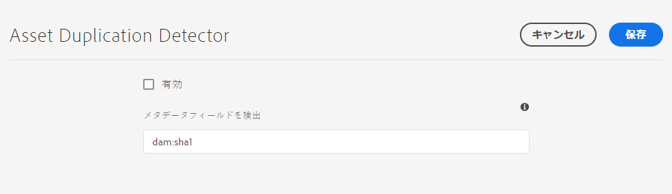

# 重複アセットの検出 {#detect-duplicate-assets}

| バージョン | 記事リンク |
| -------- | ---------------------------- |
| AEM 6.5 | [ここをクリックしてください](https://experienceleague.adobe.com/docs/experience-manager-65/assets/managing/duplicate-detection.html?lang=ja) |
| AEM as a Cloud Service | この記事 |

DAM ユーザーがリポジトリーに既に存在する 1 つ以上のアセットをアップロードした場合、[!DNL Experience Manager] は重複を検出し、ユーザーに通知します。重複の検出は、リポジトリーのサイズとアップロードされたアセットの数に応じてパフォーマンスに影響を与える可能性があるので、デフォルトで無効になっています。

この機能を有効にするには：

1. **[!UICONTROL ツール／アセット／アセット設定]**&#x200B;に移動します。

1. 「**[!UICONTROL Asset Duplication Detector]**」をクリックします。

1. [!UICONTROL Asset Duplication Detector] ページで「**[!UICONTROL 有効]**」をクリックします。

   「メタデータフィールドを検出」の値を `dam:sha1` に指定すると、ファイル名が異なる場合でも重複アセットが確実に検出されます。

1. 「**[!UICONTROL 保存]**」をクリックします。

   

>[!NOTE]
>
>`/apps/example/config.author/com.adobe.cq.assetcompute.impl.assetprocessor.AssetDuplicationDetector.cfg.json` 設定ファイル（OSGi 設定）を使用して Duplication Detector を設定してある場合は、それを引き続き使用できますが、アドビでは新しい手段を使用することをお勧めします。

有効にすると、Experience Manager は重複アセットの通知を Experience Manager インボックスに送信します。これは、複数の重複の集計結果です。ユーザーは、結果に基づいてアセットを削除することを選択できます。

>[!NOTE]
>
>アセットをリポジトリーにアップロードすると、Experience Manager は重複を検出し、最初の 100 個の重複アセットについて通知します。
