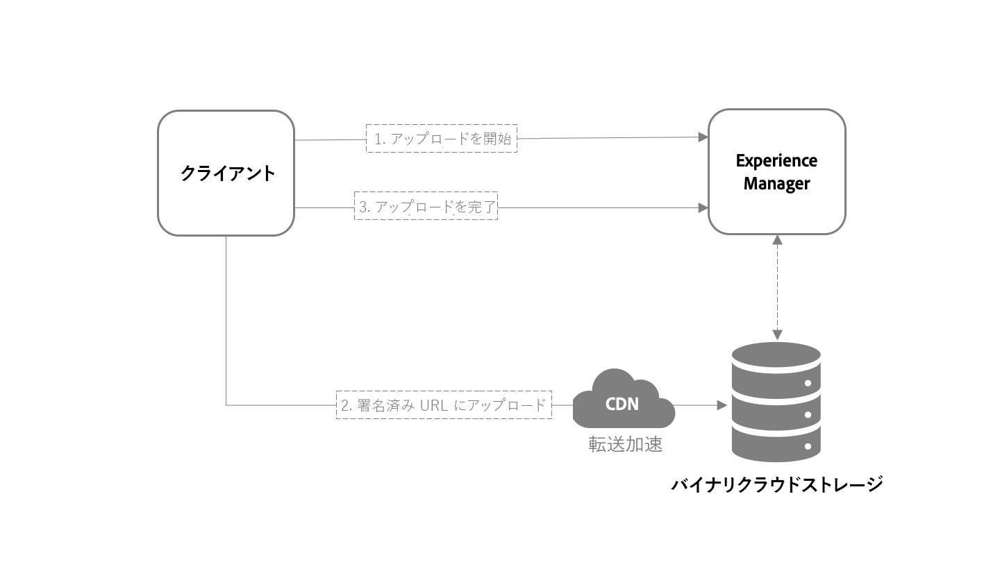

# [!DNL Assets] APIと開発者向けリファレンス資料 {#assets-cloud-service-apis}

この記事には、Cloud Serviceとしての開発者向けのリファレンス資料とリソース [!DNL Assets] が含まれています。 新しいアップロード方法、APIリファレンスおよび後処理ワークフローで提供されるサポートに関する情報が含まれます。

## アセットのアップロード {#asset-upload-technical}

[!DNL Experience Manager] をCloud Serviceに追加すると、アセットをリポジトリにアップロードするための新しい方法が提供されます。 ユーザーは、HTTP APIを使用して、アセットをクラウドストレージに直接アップロードできます。 バイナリファイルをアップロードする手順は次のとおりです。

1. [HTTPリクエストを送信します](#initiate-upload)。 新しいバイナリをアップロードする意図を [!DNL Experience Manage]またはデプロイメントに通知します。
1. [開始リクエストで提供される 1 つ以上の URI にバイナリのコンテンツを POST 送信します。](#upload-binary)
1. [HTTP リクエストを送信して、バイナリのコンテンツが正常にアップロードされたことをサーバーに通知します。](#complete-upload)



このアプローチは、アセットのアップロードのスケーラブルでパフォーマンスの高い処理を提供します。 6.5と比較した場合の違いは [!DNL Experience Manager] 次のとおりです。

* Binaries do not go through [!DNL Experience Manager], which is now simply coordinating the upload process with the binary cloud storage configured for the deployment.
* Binaryクラウドストレージは、コンテンツ配信ネットワーク(CDN)またはEdgeネットワークと連携します。 CDNは、クライアントに近いアップロードエンドポイントを選択します。 データが近くのエンドポイントまで短い距離に移動すると、特に地理的に分散したチームで、アップロードのパフォーマンスとユーザーの操作性が向上します。

>[!NOTE]
>
>この方法を実装するには、クライアントコードを参照して、オープンソースの [aem-uploadライブラリに実装してください](https://github.com/adobe/aem-upload)。

### アップロードの開始 {#initiate-upload}

HTTPPOSTリクエストを目的のフォルダーに送信します。 このフォルダーでアセットが作成または更新されます。 要求 `.initiateUpload.json` がバイナリファイルのアップロードを開始することを示すセレクターを含めます。 For example, the path to the folder where the asset should be created is `/assets/folder`. POSTリクエストはで `POST https://[aem_server]:[port]/content/dam/assets/folder.initiateUpload.json`す。

リクエスト本文のコンテンツタイプは、次のフィールドを含んだ `application/x-www-form-urlencoded` 形式のデータにする必要があります。

* `(string) fileName`：必須。に表示されるアセットの名前で [!DNL Experience Manager]す。
* `(number) fileSize`：必須。アップロードされるアセットのファイルサイズ（バイト単位）。

各バイナリに必須フィールドが含まれている限り、単一のリクエストを使用して複数のバイナリのアップロードを開始できます。成功した場合は、リクエストへの応答として、`201` ステータスコードと、次の形式の JSON データを含んだ本文が返されます。

```json
{
    "completeURI": "(string)",
    "folderPath": (string)",
    "files": [
        {
            "fileName": "(string)",
            "mimeType": "(string)",
            "uploadToken": "(string)",
            "uploadURIs": [
                "(string)"
            ]
        }
    ]
}
```

* `completeURI` （文字列）:バイナリのアップロードが完了したら、このURIを呼び出します。 URI は絶対 URI でも相対 URI でも構いません。クライアントはどちらでも処理できるはずです。つまり、値は `"https://author.acme.com/content/dam.completeUpload.json"` または `"/content/dam.completeUpload.json"` でも構いません。[アップロードの完了](#complete-upload)を参照してください。
* `folderPath` （文字列）:バイナリがアップロードされたフォルダーのフルパスです。
* `(files)` （配列）:長さと順序が、開始要求で提供されるバイナリリストの長さと順序と一致するリスト。
* `fileName`（文字列）：対応するバイナリの名前（開始リクエストで指定されたもの）。この値は、完了リクエストに含まれます。
* `mimeType` （文字列）:開始要求で指定された、対応するバイナリのMIMEタイプ。 この値は、完了リクエストに含まれます。
* `uploadToken`（文字列）：対応するバイナリのアップロードトークン。この値は、完了リクエストに含まれます。
* `uploadURIs`（配列）：バイナリコンテンツのアップロード先となる完全な URI を表す文字列のリストです（[バイナリのアップロード](#upload-binary)を参照）。
* `minPartSize`（数字）：複数の URI がある場合に各アップロード URI に提供されるデータの最小長（バイト単位）。
* `maxPartSize`（数字）：複数の URI がある場合に各アップロード URI に提供されるデータの最大長（バイト単位）。

### バイナリのアップロード {#upload-binary}

アップロードを開始した場合の出力には、1つ以上のアップロードURI値が含まれます。 複数のURIを指定した場合、クライアントはバイナリを部分に分割し、各部分のPOST要求を各URIに対して順に行います。 すべてのURIを使用します。 各パーツのサイズが、開始応答で指定された最小サイズと最大サイズの範囲内にあることを確認します。 CDNエッジノードを使用すると、要求されたバイナリのアップロードを高速化できます。

これを実現する可能性のある方法は、APIが提供するアップロードURIの数に基づいてパーツサイズを計算することです。 例えば、バイナリの合計サイズが20,000バイトで、アップロードURIの数が2であるとします。 次の手順に従います。

* 合計サイズを URI 数で除算して計算した各部分のサイズ：20,000 / 2 = 10,000.
* アップロード URI リストの最初の URI にバイナリの 0～9,999 バイトを POST 送信.
* アップロード URI リストの 2 番目の URI にバイナリの 10,000～19,999 バイトを POST 送信.

If the upload is successful, the server responds to each request with a `201` status code.

### アップロードの完了 {#complete-upload}

バイナリファイルのすべての部分がアップロードされたら、開始データから提供される完全な URI に HTTP POST リクエストを送信します。リクエスト本文のコンテンツタイプは、次のフィールドを含んだ `application/x-www-form-urlencoded` 形式のデータにする必要があります。

| フィールド | タイプ | 必須／未指定 | 説明 |
|---|---|---|---|
| `fileName` | String | 必須 | アセットの名前（開始データで提供されたもの）。 |
| `mimeType` | String | 必須 | バイナリの HTTP コンテンツタイプ（開始データで提供されたもの）。 |
| `uploadToken` | String | 必須 | バイナリのアップロードトークン（開始データで提供されたもの）。 |
| `createVersion` | Boolean | オプション | If `True` and an asset with the specified name exists, then [!DNL Experience Manager] creates a new version of the asset. |
| `versionLabel` | String | オプション | 新しいバージョンが作成される場合、アセットの新しいバージョンに関連付けられるラベル。 |
| `versionComment` | String | オプション | 新しいバージョンが作成される場合、そのバージョンに関連付けられたコメント。 |
| `replace` | Boolean | オプション | If `True` and an asset with the specified name exists, [!DNL Experience Manager] deletes the asset then re-create it. |

>!![NOTE]
If the asset exists and neither `createVersion` nor `replace` is specified, then [!DNL Experience Manager] updates the asset&#39;s current version with the new binary.

開始プロセスと同様に、完了リクエストデータには、複数のファイルに関する情報が含まれる場合があります。

バイナリのアップロードプロセスは、ファイルの完了 URL が呼び出されるまで実行されません。アセットは、アップロード処理の完了後に処理されます。 アセットのバイナリファイルが完全にアップロードされても、処理は開始しませんが、アップロード処理は完了しません。

成功した場合、サーバーは応答として `200` ステータスコードを返します。

### オープンソースアップロードライブラリ {#open-source-upload-library}

アップロードアルゴリズムの詳細や、独自のアップロードスクリプトやツールを作成するために、Adobeにはオープンソースのライブラリやツールが用意されています。

* [オープンソース aem-upload ライブラリ](https://github.com/adobe/aem-upload)。
* [オープンソースコマンドラインツール](https://github.com/adobe/aio-cli-plugin-aem).

### 非推奨（廃止予定）のアセットアップロード API {#deprecated-asset-upload-api}

<!-- #ENGCHECK review / update the list of deprecated APIs below. -->

新しいアップロード方法は、Cloud Serviceとしてのみサポートさ [!DNL Adobe Experience Manager] れます。 The APIs from [!DNL Adobe Experience Manager] 6.5 are deprecated. アセットやレンディションのアップロードまたは更新（あらゆるバイナリアップロード）に関連するメソッドは、次の API で非推奨（廃止予定）となりました。

* [Experience ManagerアセットHTTP API](mac-api-assets.md)
* `AssetManager`Java API（`AssetManager.createAsset(..)` など）

>[!MORELIKETHIS]
* [オープンソース aem-upload ライブラリ](https://github.com/adobe/aem-upload)。
* [オープンソースコマンドラインツール](https://github.com/adobe/aio-cli-plugin-aem).


## アセット処理ワークフローとアセット後処理ワークフロー {#post-processing-workflows}

In [!DNL Experience Manager], the asset processing is based on **[!UICONTROL Processing Profiles]** configuration that uses [asset microservices](asset-microservices-configure-and-use.md#get-started-using-asset-microservices). 処理には、開発者用の拡張機能は必要ありません。

後処理ワークフローの設定には、カスタム手順を指定した標準ワークフローを使用します。

## 後処理ワークフローでのワークフローステップのサポート {#post-processing-workflows-steps}

以前のバージョンからアップグレードしたお客様は、アセットの処理にアセットマイクロサービスを使用 [!DNL Experience Manager] できます。 クラウドネイティブのアセットマイクロサービスは、設定と使用が非常に簡単です。以前のバージョンの [!UICONTROL DAM アセットの更新]ワークフローで使用されるワークフロー手順の一部はサポートされていません。

[!DNL Experience Manager] をCloud Serviceがサポートするワークフロー手順は次のとおりです。

* `com.day.cq.dam.similaritysearch.internal.workflow.process.AutoTagAssetProcess`
* `com.day.cq.dam.core.impl.process.CreateAssetLanguageCopyProcess`
* `com.day.cq.wcm.workflow.process.CreateVersionProcess`
* `com.day.cq.dam.similaritysearch.internal.workflow.smarttags.StartTrainingProcess`
* `com.day.cq.dam.similaritysearch.internal.workflow.smarttags.TransferTrainingDataProcess`
* `com.day.cq.dam.core.impl.process.TranslateAssetLanguageCopyProcess`
* `com.day.cq.dam.core.impl.process.UpdateAssetLanguageCopyProcess`
* `com.adobe.cq.workflow.replication.impl.ReplicationWorkflowProcess`
* `com.day.cq.dam.core.impl.process.DamUpdateAssetWorkflowCompletedProcess`

次の技術ワークフローモデルは、asset microservicesに置き換えられるか、サポートが利用できません。

* `com.day.cq.dam.core.impl.process.DamMetadataWritebackWorkflowCompletedProcess`
* `com.day.cq.dam.core.process.DeleteImagePreviewProcess`
* `com.day.cq.dam.s7dam.common.process.DMEncodeVideoWorkflowCompletedProcess`
* `com.day.cq.dam.core.process.GateKeeperProcess`
* `com.day.cq.dam.core.process.AssetOffloadingProcess`
* `com.day.cq.dam.core.process.MetadataProcessorProcess`
* `com.day.cq.dam.core.process.XMPWritebackProcess`
* `com.adobe.cq.dam.dm.process.workflow.DMImageProcess`
* `com.day.cq.dam.s7dam.common.process.S7VideoThumbnailProcess`
* `com.day.cq.dam.scene7.impl.process.Scene7UploadProcess`
* `com.day.cq.dam.s7dam.common.process.VideoProxyServiceProcess`
* `com.day.cq.dam.s7dam.common.process.VideoThumbnailDownloadProcess`
* `com.day.cq.dam.s7dam.common.process.VideoUserUploadedThumbnailProcess`
* `com.day.cq.dam.core.process.CreatePdfPreviewProcess`
* `com.day.cq.dam.core.process.CreateWebEnabledImageProcess`
* `com.day.cq.dam.video.FFMpegThumbnailProcess`
* `com.day.cq.dam.core.process.ThumbnailProcess`
* `com.day.cq.dam.cameraraw.process.CameraRawHandlingProcess`
* `com.day.cq.dam.core.process.CommandLineProcess`
* `com.day.cq.dam.pdfrasterizer.process.PdfRasterizerHandlingProcess`
* `com.day.cq.dam.core.process.AddPropertyWorkflowProcess`
* `com.day.cq.dam.core.process.CreateSubAssetsProcess`
* `com.day.cq.dam.core.process.DownloadAssetProcess`
* `com.day.cq.dam.word.process.ExtractImagesProcess`
* `com.day.cq.dam.word.process.ExtractPlainProcess`
* `com.day.cq.dam.video.FFMpegTranscodeProcess`
* `com.day.cq.dam.ids.impl.process.IDSJobProcess`
* `com.day.cq.dam.indd.process.INDDMediaExtractProcess`
* `com.day.cq.dam.indd.process.INDDPageExtractProcess`
* `com.day.cq.dam.core.impl.lightbox.LightboxUpdateAssetProcess`
* `com.day.cq.dam.pim.impl.sourcing.upload.process.ProductAssetsUploadProcess`
* `com.day.cq.dam.core.process.ScheduledPublishBPProcess`
* `com.day.cq.dam.core.process.ScheduledUnPublishBPProcess`
* `com.day.cq.dam.core.process.SendDownloadAssetEmailProcess`
* `com.day.cq.dam.core.impl.process.SendTransientWorkflowCompletedEmailProcess`

<!-- PPTX source: slide in add-assets.md - overview of direct binary upload section of 
https://adobe-my.sharepoint.com/personal/gklebus_adobe_com/_layouts/15/guestaccess.aspx?guestaccesstoken=jexDC5ZnepXSt6dTPciH66TzckS1BPEfdaZuSgHugL8%3D&docid=2_1ec37f0bd4cc74354b4f481cd420e07fc&rev=1&e=CdgElS
-->

>[!MORELIKETHIS]
* [Cloud ServiceSDKとしてのExperience Cloud](/help/implementing/developing/introduction/aem-as-a-cloud-service-sdk.md)。

