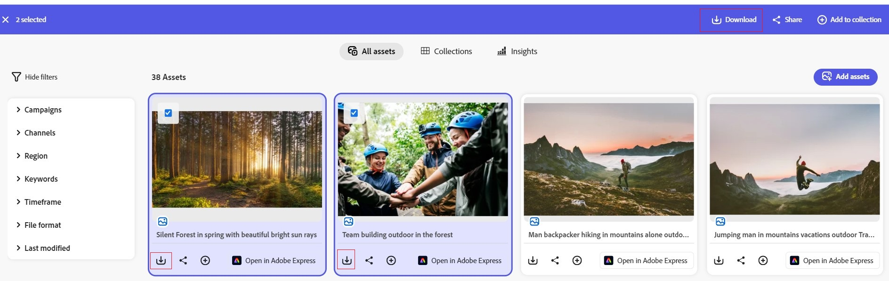

# Content Hubからのアセットのダウンロード {#download-assets}

<!--  -->

Content Hubでは、アセットをダウンロードして共有できます。 これらのアセットには、画像、ビデオ、またはその他のデジタルコンテンツが含まれる場合があります。 Content Hubは、効果的なアセット配布のためにアクセシビリティと適応性を強化します。

Content Hubでは、1 つまたは複数のアセットをダウンロードできます。 アセットの元のバージョンがダウンロードされます。

## アセットをダウンロード {#download-single-asset}

1. ダウンロードするアセットを選択します。
   
1. 「**[!UICONTROL ダウンロード]**」をクリックします。  または、アセットカードにある「ダウンロード」アイコンをクリックして、アセットをダウンロードすることもできます。
すべてのアセットが元のレンディションでダウンロードされます。
