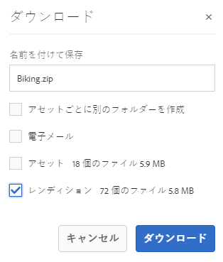

# AEM からのアセットのダウンロード {#download-assets-from-aem}

静的レンディションおよび動的レンディションを含むアセットをダウンロードできます。ダウンロードされたアセットは、ZIP ファイルにバンドルされています。書き出しジョブ用に圧縮する ZIP ファイルの最大サイズは 1 GB です。1 つの書き出しジョブに許可されるアセットの合計数は最大 500 個です。

>[!NOTE]
>
>アセットをダウンロードするためには、アセットのダウンロードを実行するワークフローを開始する権限が必要です。

アセットをダウンロードするには、アセットを見つけて選択し、ツールバーの&#x200B;**[!UICONTROL ダウンロード]**&#x200B;アイコンをタップまたはクリックします。表示されるダイアログで、ダウンロードオプションを指定します。

画像セット、スピンセット、混在メディアセット、カルーセルセットの各アセットタイプはダウンロードできません。

*図：AEM Assets からアセットをダウンロードする際に使用できるオプション*

次に、書き出し／ダウンロードのオプションを示します。動的レンディションは Dynamic Media 特有の機能であり、選択したアセットに加えてレンディションもその場で生成できます。このオプションは、Dynamic Media を有効にしている場合のみ利用できます。

| 書き出しまたはダウンロードのオプション | 説明 |
|---|---|
| [!UICONTROL Assets] | レンディションを含めずに、元の形式でアセットをダウンロードする場合に選択します。 |
| [!UICONTROL レンディション] | レンディションは、アセットのバイナリ表現です。アセットは、（アップロードされたファイルの）一次表現を持ちます。アセットは任意の数の追加の表現を持つことができます。<br>このオプションを選択すると、ダウンロードするレンディションを選択できます。使用できるレンディションは、選択したアセットによって異なります。 |
| [!UICONTROL 動的レンディション] | 動的レンディションでは、他のレンディションをその場で生成します。また、このオプションを選択する場合は、動的に作成するレンディションを画像プリセットリストから選択します。さらに、サイズ、測定単位、形式、カラースペース、解像度および画像の修飾子（例：画像の反転用）を選択できます。 |
| [!UICONTROL アセットごとに別のフォルダーを作成] | フォルダー階層を保持したままアセットをダウンロードするには、このオプションを選択します。デフォルトでは、フォルダー階層は無視され、すべてのアセットがローカルシステムの 1 つのフォルダーにダウンロードされます。 |

アセットにレンディションがある場合は、レンディションオプションを使用できます。アセットにサブアセットが含まれている場合は、サブアセットオプションを使用できます。

ダウンロードするフォルダーを選択すると、そのフォルダーの下位のアセットの階層全体がダウンロードされます。ダウンロードする各アセット（親フォルダーの下にネストされている子フォルダーのアセットを含む）を個々のフォルダーに格納するには、「**[!UICONTROL アセットごとに別のフォルダーを作成]**」を選択します。

## アセットダウンロードサーブレットの有効化 {#enable-asset-download-servlet}

AEM のデフォルトサーブレットを使用すると、認証されたユーザーは、表示可能なアセットの ZIP ファイルを作成するために任意のサイズの同時ダウンロード要求を発行することができますが、その結果、サーバーやネットワークに過剰な負荷をかけるおそれがあります。この機能で生じる可能性がある DoS リスクを軽減するために、パブリッシュインスタンスに対しては、`AssetDownloadServlet` OSGi コンポーネントがデフォルトで無効になっています。

例えば Asset Share Commons やポータルのような実装などを使用する場合に DAM からアセットをダウンロードできるようにするには、OSGi 設定を通じてサーブレットを手動で有効にします。日常的なダウンロードの要件に影響を与えない範囲で、許容ダウンロードサイズをできるだけ小さく設定することをお勧めします。この値を大きくすれば、パフォーマンスに影響を与える可能性があります。

1. 次のように、パブリッシュ実行モードを対象とする命名規則（`config.publish`）でフォルダーを作成します。

   `/apps/<your-app-name>/config.publish`

1. config フォルダーに、`nt:file` タイプのファイル `com.day.cq.dam.core.impl.servlet.AssetDownloadServlet.config` を新しく作成します。
1. `com.day.cq.dam.core.impl.servlet.AssetDownloadServlet.config` に以下を入力します。ダウンロードの最大サイズ（バイト単位）を `asset.download.prezip.maxcontentsize` の値として設定します。以下のサンプルでは、ZIP ダウンロードの最大サイズを 100 KB を超えないように設定しています。

   ```
   enabled=B"true"
   asset.download.prezip.maxcontentsize=I"102400"
   ```

## アセットダウンロードサーブレットの無効化 {#disable-asset-download-servlet}

AEM パブリッシュインスタンスの `Asset Download Servlet` を無効にするには、アセットダウンロード要求をすべてブロックするように Dispatcher 設定を更新します。サーブレットは、OSGi コンソールから手動で直接無効にすることもできます。

1. Dispatcher 設定を通じてアセットダウンロード要求をブロックするには、`dispatcher.any` 設定を編集し、[フィルターセクション](https://docs.adobe.com/content/help/en/experience-manager-dispatcher/using/configuring/dispatcher-configuration.html#defining-a-filter)に新しいルールを追加します。

   `/0100 { /type "deny" /url "*.assetdownload.zip/assets.zip*" }`

>[!MORELIKETHIS]
>
>* [DRM で保護されたアセットのダウンロード](drm.md)
>* [Windows または Mac OS デスクトップで AEM デスクトップアプリケーションを使用したアセットのダウンロード](https://helpx.adobe.com/jp/experience-manager/desktop-app/aem-desktop-app.html)
>* [サポートされている Adobe Creative Cloud アプリ内から Adobe Asset Link を使用したアセットのダウンロード](https://helpx.adobe.com/jp/enterprise/using/manage-assets-using-adobe-asset-link.html)


<!-- FULL ARTICLE ARCHIVE IS BELOW 

You can download assets including static and dynamic renditions. Alternatively, you can send emails with links to assets directly from AEM Assets. Downloaded assets are bundled in a ZIP file. The compressed ZIP file has a maximum file size of 1 GB for the export job. You are allowed a maximum of 500 total assets per export job.

>[!NOTE]
>
>Recipients of emails must be members of the `dam-users` group to access the ZIP download link in the email message. To be able to download the assets, the members must have permissions to launch workflows that trigger downloading of assets.

To download assets, navigate to an asset, select the asset, and tap/click the **[!UICONTROL Download]** icon from the toolbar. In the resulting dialog, specify your download options.

The asset types Image Sets, Spin Sets, Mixed Media Sets, and Carousel Sets cannot be downloaded.


*Figure: Available options when downloading assets from AEM Assets*

The following are the Export/Download options. Dynamic renditions are unique to Dynamic Media and let you generate renditions on-the-fly in addition to the asset you selected - that option is only available if you have Dynamic Media enabled.

|Export or download options|Descriptions|
|---|---|
| [!UICONTROL Assets]| Select this to download the asset in its original form without any renditions.|
| [!UICONTROL Renditions] |A rendition is the binary representation of an asset. Assets have a primary representation - that of the uploaded file. They can have any number of representations. <br> With this option, you can select the renditions you want downloaded. The renditions available depend on the asset you select.|
| [!UICONTROL Dynamic Renditions] |A dynamic rendition generates other renditions on-the-fly. When you select this option, you also select the renditions you want to create dynamically by selecting from the image presets list. In addition, you can select the size and unit of measurement, format, color space, resolution, and any image modifiers (for example to invert the image)|
| [!UICONTROL Email] |An email notification is sent to the user. Standard emails templates are available at the following locations:<ul><li>`/libs/settings/dam/workflow/notification/email/downloadasset`</li><li>`/libs/settings/dam/workflow/notification/email/transientworkflowcompleted`</li></ul> Templates that you customize during deployment should be present at these locations: <ul><li>`/apps/settings/dam/workflow/notification/email/downloadasset`</li><li>`/apps/settings/dam/workflow/notification/email/transientworkflowcompleted`</li></ul>You can store tenant-specific custom templates at these locations:<ul><li>`/conf/<tenant_specific_config_root>/settings/dam/workflow/notification/email/downloadasset`</li><li>`/conf/<tenant_specific_config_root>/settings/dam/workflow/notification/email/transientworkflowcompleted`</li></ul>|
| [!UICONTROL Create separate folder for each asset] |Select this to preserve the folder hierarchy while downloading assets. By default, the folder hierarchy is ignored and all assets are downloaded in one folder in your local system.|

The option renditions option is available if the asset has any renditions. The subassets option is available if the asset includes subassets.

When you select a folder to download, the complete asset hierarchy under the folder is downloaded. To include each asset you download (including assets in child folders nested under the parent folder) in an individual folder, select **[!UICONTROL Create separate folder for each asset]**.

## Enable asset download servlet {#enable-asset-download-servlet}

The default servlet in AEM allows authenticated users to issue arbitrarily-large, concurrent download requests for creating ZIP files of assets visible to them that can overload the server and the network. To mitigate potential DoS risks caused by this feature, `AssetDownloadServlet` OSGi component is disabled by default for publish instances.

To allow downloading assets from your DAM, say when using something like Asset Share Commons or other portal-like implementation, manually enable the servlet via an OSGi configuration. Adobe recommends setting the permissible download size as low as possible without affecting the day-to-day download requirements. A high value may impact performance.

1. Create a folder with a naming convention that targets the publish runmode, that is, `config.publish`:

   `/apps/<your-app-name>/config.publish`

1. In the config folder, create a new file of type `nt:file` named `com.day.cq.dam.core.impl.servlet.AssetDownloadServlet.config`.
1. Populate `com.day.cq.dam.core.impl.servlet.AssetDownloadServlet.config` with the following. Sets a maximum size (in bytes) for the download as value of `asset.download.prezip.maxcontentsize`. The below sample configures the maximum size of the ZIP download to not exceed 100 kB.

   ```
   enabled=B"true"
   asset.download.prezip.maxcontentsize=I"102400"
   ```

## Disable asset download servlet {#disable-asset-download-servlet}

The `Asset Download Servlet` can be disabled on an AEM Publish instances by updating the dispatcher configuration to block any asset download requests. The servlet can also be manually disabled via the OSGi console directly.

1. To block asset download requests via a dispatcher configuration edit the `dispatcher.any` configuration and add a new rule to the [filter section](https://docs.adobe.com/content/help/en/experience-manager-dispatcher/using/configuring/dispatcher-configuration.html#defining-a-filter).

   `/0100 { /type "deny" /url "*.assetdownload.zip/assets.zip*" }`

>[!MORELIKETHIS]
>
>* [Download DRM protected assets](drm.md)
>* [Download assets using AEM desktop app on Win or Mac desktop](https://helpx.adobe.com/experience-manager/desktop-app/aem-desktop-app.html)
>* [Download assets using Adobe Assets Link from within the supported Adobe Creative Cloud apps](https://helpx.adobe.com/enterprise/using/manage-assets-using-adobe-asset-link.html)


-->