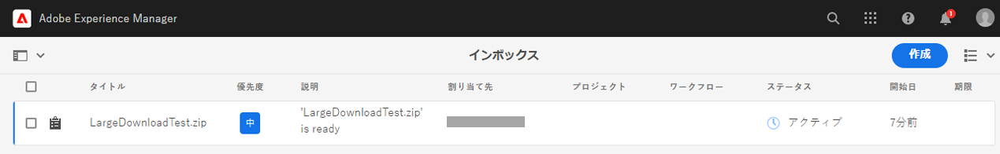
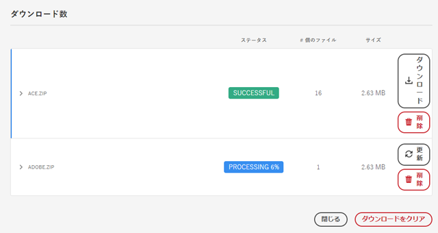

# [!DNL Adobe Experience Manager] からのアセットのダウンロード {#download-assets-from-aem}

| バージョン | 記事リンク |
| -------- | ---------------------------- |
| AEM 6.5 | [ここをクリックしてください](https://experienceleague.adobe.com/docs/experience-manager-65/assets/managing/download-assets-from-aem.html?lang=ja) |
| AEM as a Cloud Service | この記事 |

静的レンディションおよび動的レンディションを含むアセットをダウンロードできます。または、アセットへのリンクを含むメールを [!DNL Adobe Experience Manager Assets] から直接送信できます。ダウンロードされたアセットは、ZIP ファイルにバンドルされています。<!-- The compressed ZIP file has a maximum file size of 1 GB for the export job. A maximum of 500 total assets per export job are allowed. -->

<!--
>[!NOTE]
>
>Recipients of emails must be members of the `dam-users` group to access the ZIP download link in the email message. To be able to download the assets, the members must have permissions to launch workflows that trigger downloading of assets.
-->

画像セット、スピンセット、混合メディアセット、カルーセルセットの各アセットタイプはダウンロードできません。

次の方法を使用すると、Experience Manager からアセットをダウンロードできます。

<!-- * [Link Share](#link-share-download) -->

* [Adobe Experience Manager ユーザーインターフェイス](#download-assets)
* [Asset Share Commons](https://adobe-marketing-cloud.github.io/asset-share-commons/)
* [Brand Portal](https://experienceleague.adobe.com/docs/experience-manager-brand-portal/using/introduction/brand-portal.html?lang=ja)
* [デスクトップアプリケーション](https://experienceleague.adobe.com/docs/experience-manager-desktop-app/using/using.html?lang=ja#download-assets)

## [!DNL Experience Manager] インターフェイスを使用したアセットのダウンロード {#download-assets}

Experience Manager では、アセットの量とサイズに基づいてダウンロードエクスペリエンスを最適化します。サイズの小さいファイルはユーザーインターフェイスからリアルタイムでダウンロードされます。[!DNL Experience Manager] では、単一のアセットを ZIP アーカイブに格納するのではなく、元のファイルの単一のアセットリクエストを直接ダウンロードして、ダウンロードを高速化します。Experience Manager では、非同期リクエストによる大規模なダウンロードをサポートしています。100 GB を超えるダウンロードリクエストは、それぞれ最大 100 MB の複数の ZIP アーカイブに分割されます。

デフォルトでは、[!DNL Experience Manager] は、ダウンロードアーカイブの生成時に [[!DNL Experience Manager] インボックス](/help/sites-cloud/authoring/inbox.md)で通知をトリガーします。




### 大量のダウンロードに対するメール通知を有効にする {#enable-emails-for-large-downloads}

非同期ダウンロードは、次のいずれかの場合にトリガーされます。

* 10 個を超えるアセットがある場合
* ダウンロードサイズが 100 MB を超える場合
* ダウンロードの準備に 30 秒以上かかる場合

非同期ダウンロードがバックエンドで実行される間、ユーザーは Experience Manager で調査を続行し、さらに作業できます。Experience Manager のインボックス通知に加えて、Experience Manager ではメールを送信して、ダウンロードプロセスの完了時にユーザーに通知することができます。この機能を有効にするために、管理者は [SMTP サーバー接続を設定](https://experienceleague.adobe.com/docs/experience-manager-cloud-service/content/implementing/developing/development-guidelines.html?lang=ja#sending-email)することにより、メールサービスを設定できます。

メールサービスを設定すると、管理者とユーザーは、Experience Manager インターフェイスからメール通知を行えます。

メール通知を有効にする手順は次のとおりです。

1. [!DNL Experience Manager Assets] にログインします。
1. 右上隅のユーザーアイコンをクリックし、「**[!UICONTROL 環境設定]**」をクリックして ユーザーの環境設定ウィンドウを開きます。
1. 「**[!UICONTROL アセットのダウンロードのメール通知]**」チェックボックスをオンにして、「**[!UICONTROL 確定]**」をクリックします。

   


アセットをダウンロードするには、次の手順に従います。

1. [!DNL Experience Manager] ユーザーインターフェイスで、**[!UICONTROL アセット]**／**[!UICONTROL ファイル]**&#x200B;をクリックします。
1. ダウンロードするアセットに移動します。フォルダーを選択するか、フォルダー内の 1 つ以上のアセットを選択します。ツールバーの「**[!UICONTROL ダウンロード]**」をクリックします。

   ![ からアセットをダウンロードする際に使用できるオプション[!DNL Experience Manager Assets]](/help/assets/assets/asset-download1.png)

1. ダウンロードダイアログボックスで、目的のダウンロードオプションを選択します。

   | ダウンロードオプション | 説明 |
   |---|---|
   | **[!UICONTROL アセットごとに別のフォルダーを作成]** | このオプションを選択すると、アセットのダウンロード済みレンディションをすべて含むフォルダーをアセットごとに作成できます。このオプションを選択しない場合、各アセット（ダウンロード用に選択した場合はそのレンディションも含む）は、生成されたアーカイブの親フォルダーに格納されます。 |
   | **[!UICONTROL メール]** | （ダウンロードへのリンクを含む）メール通知を別のユーザーに送信する場合は、このオプションを選択します。受信者ユーザーは `dam-users` グループのメンバーである必要があります。次の場所にある標準のメールテンプレートを利用できます。<ul><li>`/libs/settings/dam/workflow/notification/email/downloadasset`</li><li>`/libs/settings/dam/workflow/notification/email/transientworkflowcompleted`</li></ul> デプロイメント時にカスタマイズしたテンプレートは、次の場所で利用できます。 <ul><li>`/apps/settings/dam/workflow/notification/email/downloadasset`。</li><li>`/apps/settings/dam/workflow/notification/email/transientworkflowcompleted`。</li></ul>テナント固有のカスタムテンプレートは、次の場所に保存できます。<ul><li>`/conf/<tenant_specific_config_root>/settings/dam/workflow/notification/email/downloadasset`。</li><li>`/conf/<tenant_specific_config_root>/settings/dam/workflow/notification/email/transientworkflowcompleted`。</li></ul> |
   | **[!UICONTROL アセット]** | このオプションを選択すると、アセットを元の形式でダウンロードできます。<br>オリジナルアセットにサブアセットがある場合は、サブアセットオプションを使用できます。 |
   | **[!UICONTROL レンディション]** | レンディションは、アセットのバイナリ表現です。アセットには、アップロードされたファイルの一次表現が含まれます。アセットは任意の数の追加の表現を持つことができます。<br>このオプションを選択すると、ダウンロードするレンディションを選択できます。使用できるレンディションは、選択したアセットによって異なります。 |
   | **[!UICONTROL スマート切り抜き]** | このオプションを選択すると、選択したアセットのすべてのスマート切り抜きレンディションが Adobe [!DNL Experience Manager] 内からダウンロードされます。スマート切り抜きレンディションを含む zip ファイルが作成され、ローカルコンピューターにダウンロードされます。 |
   | **[!UICONTROL 動的レンディション]** | 一連の代替レンディションをリアルタイムで生成するには、このオプションを選択します。また、このオプションを選択すると、動的に作成するレンディションを[画像プリセット](/help/assets/dynamic-media/image-presets.md)リストから選択します。<br>さらに、サイズ、測定単位、形式、カラースペース、解像度および、画像の反転用などのオプションの画像修飾子を選択できます。このオプションは、[!DNL Dynamic Media] を有効にしている場合にのみ使用できます。 |

1. ダイアログボックスで、「**[!UICONTROL ダウンロード]**」をクリックします。

   大量のダウンロードに対するメール通知が有効になっている場合は、アーカイブされた zip フォルダーのダウンロード URL を記載したメールがインボックスに表示されます。メールのダウンロードリンクをクリックして、zip アーカイブをダウンロードします。

   

   また、[!DNL Experience Manager] インボックスで通知を表示することもできます。

   

## リンク共有を使用して共有されたアセットのダウンロード {#link-share-download}

リンクを使用したアセットの共有は、関心のあるユーザーが [!DNL Assets] にログインしなくてもアセットを利用できるようにするための便利な方法です。[リンク共有機能](/help/assets/share-assets.md#sharelink)を参照してください。

ユーザーが共有リンクからアセットをダウンロードする場合、[!DNL Assets] では、高速で途切れないダウンロードを可能にする非同期サービスを使用します。ダウンロードされるアセットは、バックグラウンドで、扱いやすいファイルサイズの ZIP アーカイブにまとめられてインボックスのキューに入れられます。大容量のダウンロードの場合、ダウンロードは 100 GB のファイルに分割されます。

[!UICONTROL ダウンロードインボックス]には、各アーカイブの処理ステータスが表示されます。処理が完了したら、インボックスからアーカイブをダウンロードできます。



## アセットダウンロードサーブレットの有効化 {#enable-asset-download-servlet}

[!DNL Experience Manager] のデフォルトサーブレットを使用すると、認証済みユーザーは、任意の大きさの同時ダウンロードリクエストを発行してアセットの ZIP ファイルを作成することができます。ダウンロードの準備でパフォーマンスに影響が及ぶ場合や、サーバーやネットワークに過重な負荷がかかる場合があります。この機能で生じる可能性がある DoS に似たリスクを軽減するため、パブリッシュインスタンスに対して `AssetDownloadServlet` OSGi コンポーネントが無効になっています。オーサーインスタンスでダウンロード機能が必要ない場合は、オーサーインスタンスでサーブレットを無効にします。

例えば Asset Share Commons やポータルのような実装などを使用する場合に DAM からアセットをダウンロードできるようにするには、OSGi 設定を通じてサーブレットを手動で有効にします。日常的なダウンロードの要件に影響を与えない範囲で、許容ダウンロードサイズをできるだけ小さく設定することをお勧めします。この値を大きくすれば、パフォーマンスに影響を与える可能性があります。

1. 次のように、パブリッシュ実行モードを対象とする命名規則（`config.publish`）でフォルダーを作成します。

   `/apps/<your-app-name>/config.publish`

1. config フォルダーに、`nt:file` タイプのファイル `com.day.cq.dam.core.impl.servlet.AssetDownloadServlet.config` を作成します。
1. `com.day.cq.dam.core.impl.servlet.AssetDownloadServlet.config` に以下を入力します。ダウンロードの最大サイズ（バイト単位）を `asset.download.prezip.maxcontentsize` の値として設定します。以下のサンプルでは、100 KB を超えないように ZIP ダウンロードの最大サイズを設定しています。

   ```java
   enabled=B"true"
   asset.download.prezip.maxcontentsize=I"102400"
   ```

## アセットダウンロードサーブレットの無効化 {#disable-asset-download-servlet}

ダウンロード機能が必要ない場合は、サーブレットを無効にして、DoS に似たリスクを回避します。オーサーおよびパブリッシュインスタンスの `Asset Download Servlet` を無効にするには、アセットダウンロードリクエストをすべてブロックするように Dispatcher 設定をアップデートします。[!DNL Experience Manager]サーブレットは、OSGi コンソールから手動で直接無効にすることもできます。

1. Dispatcher 設定を通じてアセットダウンロード要求をブロックするには、`dispatcher.any` 設定を編集し、[フィルターセクション](https://experienceleague.adobe.com/docs/experience-manager-dispatcher/using/configuring/dispatcher-configuration.html?lang=ja#configuring)に新しいルールを追加します。

   `/0100 { /type "deny" /url "*.assetdownload.zip/assets.zip*" }`

## OnTime または OffTime レンディション {#on-off-time-rendition}

を有効にするには、以下を実行します。 `OnOffTimeAssetAccessFilter` サービスの場合は、OSGi 設定を作成する必要があります。 このサービスを使用すると、オン/オフタイム設定に基づいて、アセット自体に加えて、レンディションやメタデータへのアクセスをブロックできます。 OSGi 設定の対象は次のとおりです。 `com.day.cq.dam.core.impl.servlet.OnOffTimeAssetAccessFilter`. 次の手順に従います。

1. Git のプロジェクトコードで、設定ファイルを次の場所に作成します。 `/apps/system/config/com.day.cq.dam.core.impl.servlet.OnOffTimeAssetAccessFilter.cfg.json`. ファイルにはが含まれている必要があります `{}` をコンテンツとして指定し、対応する OSGi コンポーネントの空の OSGi 設定を示します。 このアクションを実行すると、サービスが有効になります。
1. この新しい設定を含むコードを、 [!DNL Cloud Manager].
1. デプロイすると、アセットのオン/オフタイム設定に従ってレンディションとメタデータにアクセスできるようになります。 現在の日時がオンタイムより前またはオフタイムより後の場合は、エラーメッセージが表示されます。
空の OSGi 設定の追加について詳しくは、この[ガイド](https://experienceleague.adobe.com/docs/experience-manager-cloud-service/content/implementing/deploying/configuring-osgi.html?lang=ja)を参照してください。

## ヒントと制限事項 {#tips-limitations}

* 空のフォルダーをダウンロードすると、 [!DNL Experience Manager] は、ZIP アーカイブの作成に関する成功メッセージを伝えますが、アーカイブは作成されません。

**関連情報**

* [アセットを翻訳](translate-assets.md)
* [Assets HTTP API](mac-api-assets.md)
* [AEM Assets as a Cloud Service でサポートされているファイル形式](file-format-support.md)
* [アセットを検索](search-assets.md)
* [接続されたアセット](use-assets-across-connected-assets-instances.md)
* [アセットレポート](asset-reports.md)
* [メタデータスキーマ](metadata-schemas.md)
* [メタデータを管理](manage-metadata.md)
* [検索ファセット](search-facets.md)
* [コレクションを管理](manage-collections.md)
* [メタデータの一括読み込み](metadata-import-export.md)
* [AEM および Dynamic Media へのアセットの公開](/help/assets/publish-assets-to-aem-and-dm.md)

>[!MORELIKETHIS]
>
>* [DRM で保護されたアセットのダウンロード](drm.md)
>* [Windows／Mac OS デスクトップで Adobe Experience Manager デスクトップアプリケーションを使用したアセットのダウンロード](https://experienceleague.adobe.com/docs/experience-manager-desktop-app/using/using.html?lang=ja)
>* [サポートされている Adobe Creative Cloud アプリ内から Adobe Asset Link を使用したアセットのダウンロード](https://helpx.adobe.com/jp/enterprise/using/manage-assets-using-adobe-asset-link.html)
