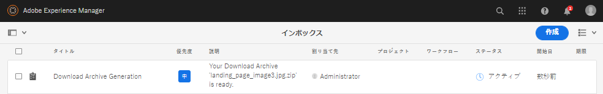

# [!DNL Adobe Experience Manager] からのアセットのダウンロード {#download-assets-from-aem}

静的レンディションおよび動的レンディションを含むアセットをダウンロードできます。または、アセットへのリンクを含む電子メールを [!DNL Adobe Experience Manager Assets] から直接送信できます。ダウンロードされたアセットは、ZIP ファイルにバンドルされています。書き出しジョブ用に圧縮する ZIP ファイルの最大サイズは 1 GB です。書き出しジョブあたり、最大で 500 個のアセットの合計を指定できます。

>[!NOTE]
>
>電子メールの受信者は、電子メールメッセージに含まれる ZIP ダウンロードリンクにアクセスするためには、`dam-users` グループのメンバーである必要があります。アセットをダウンロードするためには、アセットのダウンロードを起動するワークフローを開始する権限が必要です。

画像セット、スピンセット、混在メディアセット、カルーセルセットの各アセットタイプはダウンロードできません。

次の方法を使用して、Experience Managerアセットをダウンロードできます。

* [Experience Managerユーザーインターフェイス](#download-in-aem)
* アセットリンク共有ユーザーインターフェイス
* [アセット共有コモンズ](https://adobe-marketing-cloud.github.io/asset-share-commons/)
* [Brand Portal](https://experienceleague.adobe.com/docs/experience-manager-brand-portal/using/introduction/brand-portal.html)
* [デスクトップアプリ](https://experienceleague.adobe.com/docs/experience-manager-desktop-app/using/using.html#download-assets)

## AEMインターフェイスを使用したアセットのダウンロード {#download-in-aem}

非同期ダウンロードサービスは、大規模なアセットをシームレスにダウンロードするためのフレームワークを提供します。 ユーザーインターフェイスから小さなファイルがリアルタイムでダウンロードされます。 サイズの大きいファイルは非同期でダウンロードされ、受信トレイのExperience Manager通知を通じて完了が通知されます。 「Experience Manager受信トレイにつ [いて](https://experienceleague.adobe.com/docs/experience-manager-cloud-service/sites/authoring/getting-started/inbox.html)」を参照してください。



*図：インボックスを介したダウンロード通知 [!DNL Experience Manager] 。*

非同期ダウンロードは、次のいずれかの場合にトリガーされます。

* 10アセットを超える場合、または100 MBを超える量のアセットがダウンロードされる場合。
* ダウンロードの準備に30秒以上かかる場合。

アセットをダウンロードするには、次の手順に従います。

1. ユー [!DNL Experience Manager] ザーインターフェイスで、 **[!UICONTROL アセット]** / **[!UICONTROL ファイル]**&#x200B;をクリックします。
1. ダウンロードするアセットに移動します。 フォルダーを選択するか、フォルダー内の 1 つ以上のアセットを選択します。On the toolbar, click **[!UICONTROL Download]**.

   ![アセットを [!DNL Experience Manager Assets]](/help/assets/assets/asset-download1.png)

   *図：ダウンロードダイアログボックスのオプション*

1. ダウンロードダイアログボックスで、目的のダウンロードオプションを選択します。

   | ダウンロードオプション | 説明 |
   |---|---|
   | **[!UICONTROL アセットごとに別のフォルダーを作成]** | このオプションを選択すると、ダウンロードした各アセット（アセットの親フォルダーの下にネストされた子フォルダー内のアセットを含む）が、ローカルコンピューター上の 1 つのフォルダーに含まれます。このオプションを&#x200B;*選択しない場合*、デフォルトでは、フォルダー階層は無視され、すべてのアセットがローカルコンピューターの 1 つのフォルダーにダウンロードされます。 |
   | **[!UICONTROL 電子メール]** | 受信者に電子メール通知を送信する場合は、このオプションを選択します。次の場所にある標準の電子メールテンプレートを利用できます。<ul><li>`/libs/settings/dam/workflow/notification/email/downloadasset`.</li><li>`/libs/settings/dam/workflow/notification/email/transientworkflowcompleted`.</li></ul> デプロイメント時にカスタマイズしたテンプレートは、次の場所で利用できます。 <ul><li>`/apps/settings/dam/workflow/notification/email/downloadasset`.</li><li>`/apps/settings/dam/workflow/notification/email/transientworkflowcompleted`.</li></ul>テナント固有のカスタムテンプレートは、次の場所に保存できます。<ul><li>`/conf/<tenant_specific_config_root>/settings/dam/workflow/notification/email/downloadasset`.</li><li>`/conf/<tenant_specific_config_root>/settings/dam/workflow/notification/email/transientworkflowcompleted`.</li></ul> |
   | **[!UICONTROL アセット]** | レンディションを含めずに、元の形式でアセットをダウンロードする場合に、このオプションを選択します。<br>オリジナルアセットにサブアセットがある場合は、サブアセットオプションを使用できます。 |
   | **[!UICONTROL レンディション]** | レンディションは、アセットのバイナリ表現です。アセットは、（アップロードされたファイルの）一次表現を持ちます。アセットは任意の数の追加の表現を持つことができます。<br>このオプションを選択すると、ダウンロードするレンディションを選択できます。使用できるレンディションは、選択したアセットによって異なります。 |
   | **[!UICONTROL スマート切り抜き]** | Select this option to download all the smart crop renditions of the selected asset from within [!DNL Experience Manager]. スマート切り抜きレンディションを含む zip ファイルが作成され、ローカルコンピューターにダウンロードされます。 |
   | **[!UICONTROL 動的レンディション]** | 一連の代替レンディションをリアルタイムで生成するには、このオプションを選択します。また、このオプションを選択すると、動的に作成するレンディションを[画像プリセット](/help/assets/dynamic-media/image-presets.md)リストから選択します。<br>さらに、サイズ、測定単位、形式、カラースペース、解像度および、画像の反転用などのオプションの画像修飾子を選択できます。このオプションは、[!DNL Dynamic Media] を有効にしている場合にのみ使用できます。 |

1. In the dialog box, click **[!UICONTROL Download]**.

## アセットダウンロードサーブレットの有効化 {#enable-asset-download-servlet}

のデフォルトのサーブレットを使用すると、認証済みユーザは任意に大きい同時ダウンロード要求を発行して、アセットのZIPファイルを作成できます。 [!DNL Experience Manager] ダウンロードの準備には、パフォーマンスに影響する場合や、サーバーやネットワークに負荷がかかる場合があります。 To mitigate such potential DoS-like risks caused by this feature, `AssetDownloadServlet` OSGi component is disabled for publish instances.

例えば Asset Share Commons やポータルのような実装などを使用する場合に DAM からアセットをダウンロードできるようにするには、OSGi 設定を通じてサーブレットを手動で有効にします。日常的なダウンロードの要件に影響を与えない範囲で、許容ダウンロードサイズをできるだけ小さく設定することをお勧めします。この値を大きくすれば、パフォーマンスに影響を与える可能性があります。

1. 次のように、パブリッシュ実行モードを対象とする命名規則（`config.publish`）でフォルダーを作成します。

   `/apps/<your-app-name>/config.publish`

1. config フォルダーに、`nt:file` タイプのファイル `com.day.cq.dam.core.impl.servlet.AssetDownloadServlet.config` を新しく作成します。
1. `com.day.cq.dam.core.impl.servlet.AssetDownloadServlet.config` に以下を入力します。ダウンロードの最大サイズ（バイト単位）を `asset.download.prezip.maxcontentsize` の値として設定します。以下のサンプルでは、ZIP ダウンロードの最大サイズを 100 KB を超えないように設定しています。

   ```java
   enabled=B"true"
   asset.download.prezip.maxcontentsize=I"102400"
   ```

## アセットダウンロードサーブレットの無効化 {#disable-asset-download-servlet}

 パブリッシュインスタンスの `Asset Download Servlet` を無効にするには、アセットダウンロード要求をすべてブロックするように Dispatcher 設定を更新します。[!DNL Experience Manager]サーブレットは、OSGi コンソールから手動で直接無効にすることもできます。

1. Dispatcher 設定を通じてアセットダウンロード要求をブロックするには、`dispatcher.any` 設定を編集し、[フィルターセクション](https://experienceleague.adobe.com/docs/experience-manager-dispatcher/using/configuring/dispatcher-configuration.html#configuring)に新しいルールを追加します。

   `/0100 { /type "deny" /url "*.assetdownload.zip/assets.zip*" }`

>[!MORELIKETHIS]
>
>* [DRM で保護されたアセットのダウンロード](drm.md)
>* [WinまたはMacデスクトップでExperience Managerのデスクトップアプリを使用してアセットをダウンロードする](https://helpx.adobe.com/jp/experience-manager/desktop-app/aem-desktop-app.html)
>* [サポートされている Adobe Creative Cloud アプリ内から Adobe Asset Link を使用したアセットのダウンロード](https://helpx.adobe.com/jp/enterprise/using/manage-assets-using-adobe-asset-link.html)

