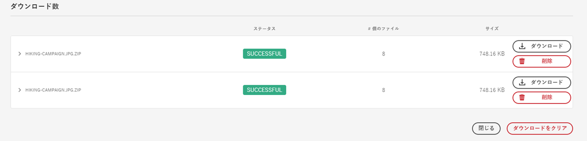

# [!DNL Adobe Experience Manager] からのアセットのダウンロード  {#download-assets-from-aem}

静的レンディションおよび動的レンディションを含むアセットをダウンロードできます。または、アセットへのリンクを含む電子メールを [!DNL Adobe Experience Manager Assets] から直接送信できます。ダウンロードされたアセットは、ZIP ファイルにバンドルされています。<!-- The compressed ZIP file has a maximum file size of 1 GB for the export job. A maximum of 500 total assets per export job are allowed. -->

>[!NOTE]
>
>電子メールの受信者は、電子メールメッセージに含まれる ZIP ダウンロードリンクにアクセスするためには、`dam-users` グループのメンバーである必要があります。アセットをダウンロードするためには、アセットのダウンロードを起動するワークフローを開始する権限が必要です。

画像セット、スピンセット、混在メディアセット、カルーセルセットの各アセットタイプはダウンロードできません。

Adobe Experience Manager アセットをダウンロードするには、次のいずれかの方法を使用します。

<!-- * [Link Share](#link-share-download) -->

* [Adobe Experience Manager ユーザーインターフェイス](#download-assets)
* [Asset Share Commons](https://adobe-marketing-cloud.github.io/asset-share-commons/)
* [Brand Portal](https://experienceleague.adobe.com/docs/experience-manager-brand-portal/using/introduction/brand-portal.html?lang=ja)
* [デスクトップアプリケーション](https://experienceleague.adobe.com/docs/experience-manager-desktop-app/using/using.html?lang=ja#download-assets)

## [!DNL Experience Manager] インターフェイスを使用したアセットのダウンロード  {#download-assets}

非同期ダウンロードサービスは、大規模なアセットをシームレスにダウンロードするためのフレームワークとなります。サイズの小さいファイルはユーザーインターフェイスからリアルタイムでダウンロードされます。[!DNL Experience Manager] は、元のファイルがダウンロードされた単一アセットのダウンロードをアーカイブしません。この機能により、ダウンロードを高速化できます。サイズの大きいファイルは非同期でダウンロードされ、[!DNL Experience Manager] はインボックスに届く通知によって完了を知らさます。「[ [!DNL Experience Manager] インボックスについて](/help/sites-cloud/authoring/getting-started/inbox.md)」を参照してください。


*図：[!DNL Experience Manager] インボックスによるダウンロード通知。*

非同期ダウンロードは、次のいずれかの場合にトリガーされます。

* アセット数が 10 を超える場合、または 100 MB を超えるアセットをダウンロードする場合。
* ダウンロードの準備に 30 秒以上かかる場合。

アセットをダウンロードするには、次の手順に従います。

1. Adobe [!DNL Experience Manager] ユーザーインターフェイスで、**[!UICONTROL アセット]**／**[!UICONTROL ファイル]**&#x200B;をクリックします。
1. ダウンロードするアセットに移動します。フォルダーを選択するか、フォルダー内の 1 つ以上のアセットを選択します。ツールバーの「**[!UICONTROL ダウンロード]**」をクリックします。

   ![ からアセットをダウンロードする際に使用できるオプション[!DNL Experience Manager Assets]](/help/assets/assets/asset-download1.png)

   *図：ダウンロードダイアログボックスのオプション*

1. ダウンロードダイアログボックスで、目的のダウンロードオプションを選択します。

   | ダウンロードオプション | 説明 |
   |---|---|
   | **[!UICONTROL アセットごとに別のフォルダーを作成]** | このオプションを選択すると、ダウンロードした各アセット（アセットの親フォルダーの下にネストされた子フォルダー内のアセットを含む）が、ローカルコンピューター上の 1 つのフォルダーに含まれます。このオプションを&#x200B;*選択しない場合*、デフォルトでは、フォルダー階層は無視され、すべてのアセットがローカルコンピューターの 1 つのフォルダーにダウンロードされます。 |
   | **[!UICONTROL 電子メール]** | 受信者に電子メール通知を送信する場合は、このオプションを選択します。次の場所にある標準の電子メールテンプレートを利用できます。<ul><li>`/libs/settings/dam/workflow/notification/email/downloadasset`。</li><li>`/libs/settings/dam/workflow/notification/email/transientworkflowcompleted`.</li></ul> デプロイメント時にカスタマイズしたテンプレートは、次の場所で利用できます。 <ul><li>`/apps/settings/dam/workflow/notification/email/downloadasset`。</li><li>`/apps/settings/dam/workflow/notification/email/transientworkflowcompleted`。</li></ul>テナント固有のカスタムテンプレートは、次の場所に保存できます。<ul><li>`/conf/<tenant_specific_config_root>/settings/dam/workflow/notification/email/downloadasset`。</li><li>`/conf/<tenant_specific_config_root>/settings/dam/workflow/notification/email/transientworkflowcompleted`。</li></ul> |
   | **[!UICONTROL アセット]** | レンディションを含めずに、元の形式でアセットをダウンロードする場合に、このオプションを選択します。<br>オリジナルアセットにサブアセットがある場合は、サブアセットオプションを使用できます。 |
   | **[!UICONTROL レンディション]** | レンディションは、アセットのバイナリ表現です。アセットは、（アップロードされたファイルの）一次表現を持ちます。アセットは任意の数の追加の表現を持つことができます。<br>このオプションを選択すると、ダウンロードするレンディションを選択できます。使用できるレンディションは、選択したアセットによって異なります。 |
   | **[!UICONTROL スマート切り抜き]** | このオプションを選択すると、選択したアセットのすべてのスマート切り抜きレンディションが Adobe [!DNL Experience Manager] 内からダウンロードされます。スマート切り抜きレンディションを含む zip ファイルが作成され、ローカルコンピューターにダウンロードされます。 |
   | **[!UICONTROL 動的レンディション]** | 一連の代替レンディションをリアルタイムで生成するには、このオプションを選択します。また、このオプションを選択すると、動的に作成するレンディションを[画像プリセット](/help/assets/dynamic-media/image-presets.md)リストから選択します。<br>さらに、サイズ、測定単位、形式、カラースペース、解像度および、画像の反転用などのオプションの画像修飾子を選択できます。このオプションは、[!DNL Dynamic Media] を有効にしている場合にのみ使用できます。 |

1. ダイアログボックスで、「**[!UICONTROL ダウンロード]**」をクリックします。

## リンク共有を使用して共有されたアセットのダウンロード {#link-share-download}

>[!NOTE]
>
>この機能は、リリース前のExperience Managerチャネルで使用できます。

リンクを使用したアセットの共有は、関心のある人が[!DNL Assets]にログインしなくても利用できる便利な方法です。 アセットを共有するURLを生成するには、[リンク共有機能](/help/assets/share-assets.md#sharelink)を使用します。

ユーザーが共有リンクからアセットをダウンロードする場合、[!DNL Assets]は非同期サービスを使用して、すばやく中断のないダウンロードを実現します。 ダウンロードされるアセットは、管理可能なファイルサイズのZIPアーカイブのインボックス内のバックグラウンドにキューに入れられます。 非常に大きなダウンロードの場合、ダウンロードは100 GBのファイルにまとめられます。

インボックスに各アーカイブの処理ステータスが表示されます。 処理が完了したら、インボックスからアーカイブをダウンロードできます。



## アセットダウンロードサーブレットの有効化 {#enable-asset-download-servlet}

Adobe [!DNL Experience Manager] のデフォルトサーブレットを使用すると、認証済みユーザーは、任意の大きさの同時ダウンロードリクエストを発行してアセットの ZIP ファイルを作成できます。ダウンロードの準備でパフォーマンスに影響が及ぶ場合や、サーバーやネットワークに過重な負荷がかかる場合があります。この機能で生じる可能性がある DoS に似たリスクを軽減するため、パブリッシュインスタンスに対して `AssetDownloadServlet` OSGi コンポーネントが無効になっています。オーサーインスタンスでダウンロード機能が必要ない場合は、オーサーインスタンスでサーブレットを無効にします。

例えば Asset Share Commons やポータルのような実装などを使用する場合に DAM からアセットをダウンロードできるようにするには、OSGi 設定を通じてサーブレットを手動で有効にします。日常的なダウンロードの要件に影響を与えない範囲で、許容ダウンロードサイズをできるだけ小さく設定することをお勧めします。この値を大きくすれば、パフォーマンスに影響を与える可能性があります。

1. 次のように、パブリッシュ実行モードを対象とする命名規則（`config.publish`）でフォルダーを作成します。

   `/apps/<your-app-name>/config.publish`

1. config フォルダーに、`nt:file` タイプのファイル `com.day.cq.dam.core.impl.servlet.AssetDownloadServlet.config` を新しく作成します。
1. `com.day.cq.dam.core.impl.servlet.AssetDownloadServlet.config` に以下を入力します。ダウンロードの最大サイズ（バイト単位）を `asset.download.prezip.maxcontentsize` の値として設定します。以下のサンプルでは、ZIP ダウンロードの最大サイズを 100 KB を超えないように設定しています。

   ```java
   enabled=B"true"
   asset.download.prezip.maxcontentsize=I"102400"
   ```

## アセットダウンロードサーブレットの無効化 {#disable-asset-download-servlet}

ダウンロード機能が必要ない場合は、サーブレットを無効にして、DoS に似たリスクを回避します。オーサーおよびパブリッシュインスタンスの `Asset Download Servlet` を無効にするには、アセットダウンロードリクエストをすべてブロックするように Dispatcher 設定をアップデートします。[!DNL Experience Manager]サーブレットは、OSGi コンソールから手動で直接無効にすることもできます。

1. Dispatcher 設定を通じてアセットダウンロード要求をブロックするには、`dispatcher.any` 設定を編集し、[フィルターセクション](https://experienceleague.adobe.com/docs/experience-manager-dispatcher/using/configuring/dispatcher-configuration.html?lang=ja#configuring)に新しいルールを追加します。

   `/0100 { /type "deny" /url "*.assetdownload.zip/assets.zip*" }`

>[!MORELIKETHIS]
>
>* [DRM で保護されたアセットのダウンロード](drm.md)
* [Windows／Mac OS デスクトップで Adobe Experience Manager デスクトップアプリケーションを使用したアセットのダウンロード](https://experienceleague.adobe.com/docs/experience-manager-desktop-app/using/using.html?lang=ja)
* [サポートされている Adobe Creative Cloud アプリ内から Adobe Asset Link を使用したアセットのダウンロード](https://helpx.adobe.com/jp/enterprise/using/manage-assets-using-adobe-asset-link.html)

