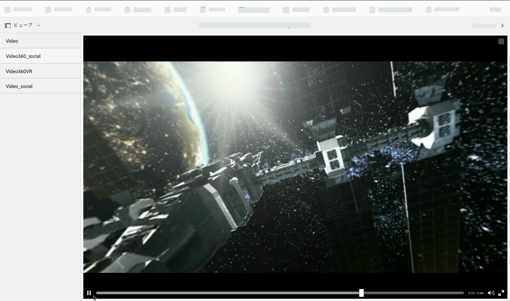
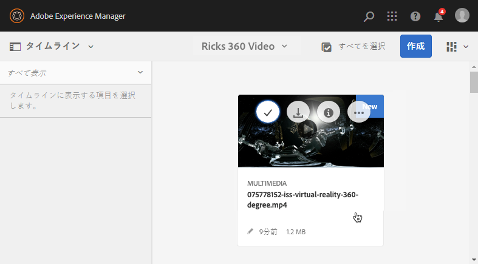
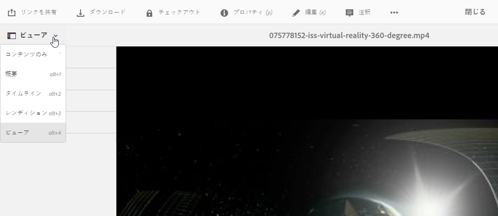
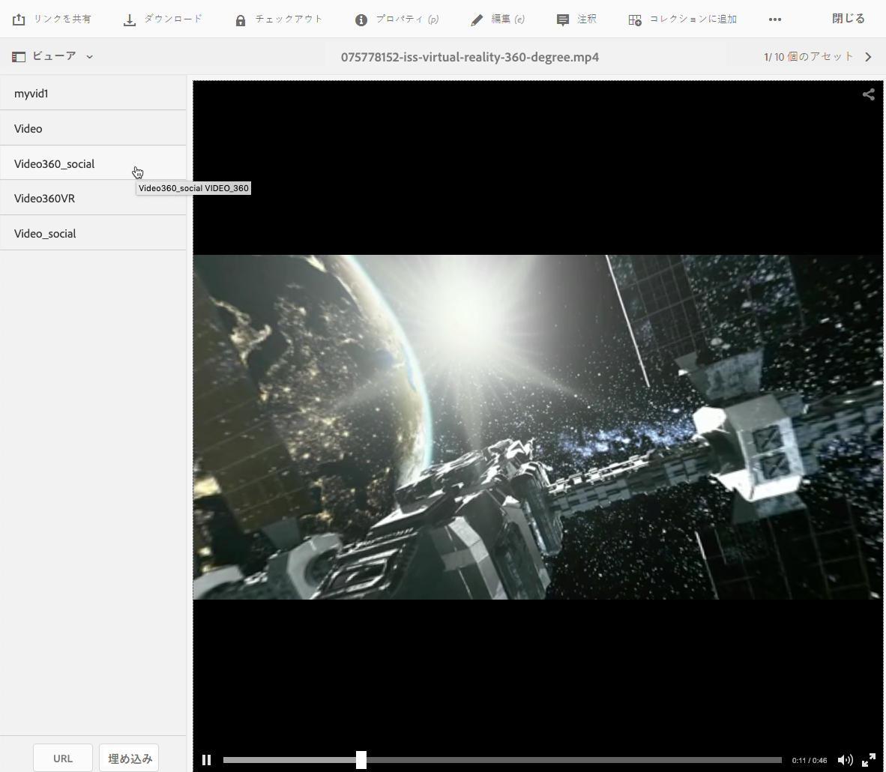
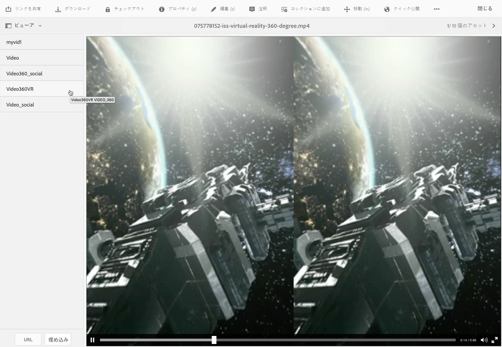

# 360/VR ビデオ {#vr-video}

<table>
    <tr>
        <td>
            <i> 新規 </i>Dynamic Media Prime<a href="/help/assets/dynamic-media/dm-prime-ultimate.md"><b>Ultimate</b></a>
        </td>
        <td>
            <i> 新規 </i> <a href="/help/assets/assets-ultimate-overview.md"><b>AEM AssetsUltimate</b></a>
        </td>
        <td>
            <i> 新規 </i> <a href="/help/assets/integrate-aem-assets-edge-delivery-services.md"><b>AEM AssetsとEdge Delivery Servicesの統合 </b></a>
        </td>
        <td>
            <i> 新規 </i><a href="/help/assets/aem-assets-view-ui-extensibility.md"><b>UI 拡張機能 </b></a>
        </td>
          <td>
            <i>Dynamic Media Prime</i>Ultimateの新 <a href="/help/assets/dynamic-media/enable-dynamic-media-prime-and-ultimate.md"><b> 能 </b></a>
        </td>
    </tr>
    <tr>
        <td>
            <a href="/help/assets/search-best-practices.md"><b>検索のベストプラクティス</b></a>
        </td>
        <td>
            <a href="/help/assets/metadata-best-practices.md"><b>メタデータのベストプラクティス</b></a>
        </td>
        <td>
            <a href="/help/assets/product-overview.md"><b>コンテンツハブ</b></a>
        </td>
        <td>
            <a href="/help/assets/dynamic-media-open-apis-overview.md"><b>OpenAPI 機能を備えた Dynamic Media</b></a>
        </td>
        <td>
            <a href="https://developer.adobe.com/experience-cloud/experience-manager-apis/"><b>AEM Assets 開発者向けドキュメント</b></a>
        </td>
    </tr>
</table>

360 度ビデオでは、すべての方向のビューが同時に記録されます。このタイプのビデオは、全方位カメラやカメラのコレクションを使用して撮影されます。フラットディスプレイでの再生時に、ユーザーは視野角を制御できます。また、モバイルデバイスでの再生では通常、デバイス組み込みのジャイロスコープ制御を適用します。

Dynamic Media には、360 ビデオアセット配信のネイティブサポートが含まれています。デフォルトでは、表示や再生のために追加の設定は必要ありません。360 ビデオは、.mp4、.mkv、.mov などの標準のビデオ拡張子を使用して配信します。最も一般的なコーデックは H.264 です。

360/VR ビデオビューアを使用して、エクイレクタングラー形式のビデオをレンダリングできます。その結果、室内、物件、場所、風景、医療処置などの臨場感あふれる表示を実現できます。

空間オーディオは現在サポートされていません。オーディオをステレオにミックスした場合、お客様がカメラの表示角度を変更してもバランス（L/R）は変化しません。

詳しくは、[AEM Assets での Dynamic Media 360 ビデオとカスタムビデオサムネールの使用](https://experienceleague.adobe.com/docs/experience-manager-learn/assets/dynamic-media/dynamic-media-360-video-custom-thumbnail-feature-video-use.html?lang=ja#dynamic-media)を参照してください。

詳しくは、[ビューアプリセットの管理](/help/assets/dynamic-media/managing-viewer-presets.md)を参照してください。

## 360 ビデオの再生 {#video-in-action}

「[Space Station 360](https://s7d1.scene7.com/s7viewers/html5/Video360Viewer.html?asset=Viewers/space_station_360-AVS)」を選択して、ブラウザーウィンドウを開き、360 度ビデオを視聴します。ビデオ再生中にポインターを新しい位置にドラッグすると、表示角度が変更されます。

*宇宙ステーション 360 のビデオフレーム*

## 360/VR ビデオと Adobe Premiere Pro {#vr-video-and-adobe-premiere-pro}

Adobe Premier Pro を使用して、360/VR フッテージを表示および編集できます。例えば、シーン内にロゴやテキストを適切に配置したり、エクイレクタングラー形式のメディアに特化して設計されたエフェクトやトランジションを適用したりできます。

[360/VR ビデオの編集](https://helpx.adobe.com/jp/premiere-pro/how-to/edit-360-vr-video.html)を参照してください。

## 360 ビデオビューアで使用するアセットのアップロード {#uploading-assets-for-use-with-the-video-viewer}

[!DNL Experience Manager] にアップロードされた 360 ビデオアセットには、通常のビデオアセットの場合と同じく、アセットページで「**マルチメディア**」というラベルが付けられます。

*アップロードされた 360 ビデオアセット（カード表示）。 アセットには「マルチメディア」というラベルが付けられます。*

**360 ビデオビューアで使用するアセットをアップロードするには：**

1. 360 ビデオアセット専用のフォルダーを作成します。
1. [フォルダーにアダプティブビデオプロファイルを適用します](/help/assets/dynamic-media/video-profiles.md#applying-a-video-profile-to-folders)。

   360 ビデオコンテンツをレンダリングする場合、ソースビデオの解像度とレンディションのエンコード解像度に関する要件が、標準の非 360 ビデオコンテンツの場合よりも高くなります。

   Dynamic Media に付属している、既製のアダプティブビデオプロファイルを使用してもかまいません。ただしその場合は、同じ設定でエンコードされた非 360 ビデオを非 360 ビデオビューアでレンダリングする場合と比べ、360 ビデオの品質のほうが低く感じられるようになります。したがって、高品質の 360 ビデオが必要な場合は、以下の操作を行ってください。

   * オリジナルの 360 ビデオコンテンツの解像度は、次のいずれかが理想的です。

      * 1080p - 1920 x 1080：フル HD または FHD 解像度と呼ばれます。
      * 2160p - 3840 x 2160：4K、UHD または Ultra HD 解像度と呼ばれます。この大きなディスプレイ解像度は、ハイエンドのテレビやコンピューターモニターでよく見られます。2160p 解像度がよく「4K」と呼ばれるのは、その幅が 4000 ピクセルに近いからです。つまり、そのピクセル数は 1080p の 4 倍になります。

   * より高品質のレンディションを含む[カスタムアダプティブビデオプロファイルを作成](/help/assets/dynamic-media/video-profiles.md#creating-a-video-encoding-profile-for-adaptive-streaming)します。例えば、次の 3 つの設定を含むアダプティブビデオプロファイルを作成できます。

      * width=auto; height=720; bitrate=2500 kbps
      * width=auto; height=1080; bitrate=5000 kbps
      * width=auto; height=1440; bitrate=6600 kbps

   * 360 ビデオアセット専用のフォルダー内の 360 ビデオコンテンツを処理します。

   このアプローチを使用する場合は、ユーザーのネットワークや CPU の要件も高くなります。

1. [フォルダーにビデオをアップロードします](/help/assets/manage-video-assets.md#upload-and-preview-video-assets)。

<!--

## Overriding the default aspect ratio of 360 videos  {#overriding-the-default-aspect-ratio-of-videos}

For an uploaded asset to qualify as a 360 video that you intend to use with the 360 Video viewer, the asset must have an aspect ratio of 2.

By default, AEM detects video as "360" if its aspect ratio (width/height) is 2.0. If you are an Administrator, you can override the default aspect ratio setting of 2 by setting the optional `s7video360AR` property in CRXDE Lite at the following:

* `/conf/global/settings/cloudconfigs/dmscene7/jcr:content`

  * **Property type**: Double
  * **Value**: floating-point aspect ratio, default 2.0.

After you set this property, it takes effect immediately on both existing videos and newly uploaded videos.

The aspect ratio applies to 360 video assets for the asset details page and the [Video 360 Media WCM component](/help/assets/dynamic-media/adding-dynamic-media-assets-to-pages.md#dynamic-media-components).

Start by uploading 360 Videos.

-->

## 360 ビデオのプレビュー {#previewing-video}

プレビューを使用すれば、360 ビデオがユーザーにどのように表示されるかを確認し、ビデオが期待どおりに動作していることを確認できます。

[ビューアプリセットの編集](/help/assets/dynamic-media/managing-viewer-presets.md#editing-viewer-presets)も参照してください。

360 ビデオの設定が完了したら、このビデオを公開できます。

[Web ページへのビデオビューアまたは画像ビューアの埋め込み](/help/assets/dynamic-media/embed-code.md)を参照してください。[Web アプリケーションへの URL のリンク](/help/assets/dynamic-media/linking-urls-to-yourwebapplication.md)を参照してください。インタラクティブコンテンツに相対 URL のリンク（特に [!DNL Experience Manager Sites] ページへのリンク）がある場合、URL ベースのリンク方法は使用できません。[ページへの Dynamic Media アセットの追加](/help/assets/dynamic-media/adding-dynamic-media-assets-to-pages.md)を参照してください。

**360 ビデオをプレビューするには:**

1. **[!UICONTROL Assets]** で、作成した既存の 360 ビデオに移動します。プレビューモードで開くには、360 ビデオアセットを選択します。

   

   ビデオをプレビューするには、360 ビデオアセットを選択します。

1. プレビューページで、ページの左上隅付近にあるドロップダウンリストを選択し、「**[!UICONTROL ビューア]**」を選択します。

   

   「ビューア」リストから **[!UICONTROL Video360_social]** を選択した後、次のいずれかの操作を行います。

   * 静的シーンの視野角を変更するには、ビデオ上でポインターをドラッグします。
   * 再生を開始するには、ビデオの&#x200B;**[!UICONTROL 再生]**&#x200B;ボタンを選択します。ビデオの再生中にビデオ上でポインターをドラッグすると、視野角を変更できます。

   *360 ビデオのスクリーンショット。*

   * 「ビューア」リストから **[!UICONTROL Video360VR]** を選択します。

     バーチャルリアリティ（VR）ビデオは、バーチャルリアリティヘッドセットで視聴する、没入感のあるビデオコンテンツです。通常のビデオと同様に、360 度ビデオカメラを使用してビデオを録画またはキャプチャする際、最初に VR ビデオを作成します。

   
   *360 VR ビデオのスクリーンショット。*

1. プレビューページの右上隅付近にある「**[!UICONTROL 閉じる]**」を選択します。

## 360 ビデオの公開 {#publishing-video}

360 ビデオを使用するには、まず公開する必要があります。360 ビデオを公開すると、URL と埋め込みコードがアクティベートされます。また、スケーラブルで効率の良い配信のために CDN と統合された Dynamic Media クラウドにも、360 ビデオが公開されます。

360 ビデオの公開方法について詳しくは、[Dynamic Media アセットの公開](/help/assets/dynamic-media/publishing-dynamicmedia-assets.md)を参照してください。[Web ページへのビデオビューアまたは画像ビューアの埋め込み](/help/assets/dynamic-media/embed-code.md)も参照してください。[Web アプリケーションへの URL のリンク](/help/assets/dynamic-media/linking-urls-to-yourwebapplication.md)も参照してください。インタラクティブコンテンツに相対 URL のリンク（特に [!DNL Experience Manager Sites] ページへのリンク）がある場合、URL ベースのリンク方法は使用できません。[ページへの Dynamic Media アセットの追加](/help/assets/dynamic-media/adding-dynamic-media-assets-to-pages.md)も参照してください。
