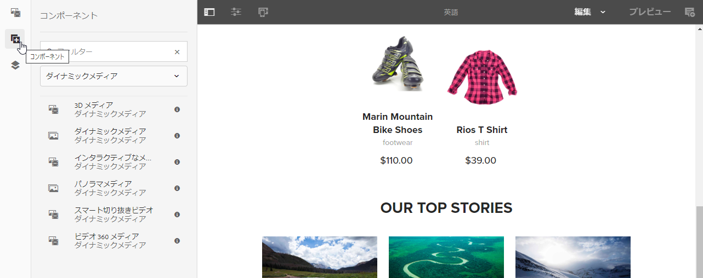
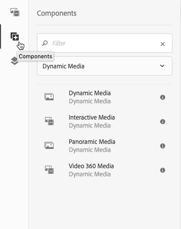

# ページへの Dynamic Media アセットの追加{#adding-dynamic-media-assets-to-pages}

Web サイトで使用するアセットに Dynamic Media 機能を追加するには、**Dynamic Media**、**インタラクティブメディア**、**パノラマメディア**、**ビデオ 360 メディア**&#x200B;のいずれかのコンポーネントをページに直接追加します。これをおこなうには、レイアウトモードに入り、Dynamic Media コンポーネントを有効にします。次に、これらのコンポーネントをページに追加し、そのコンポーネントにアセットを追加します。Dynamic Media コンポーネントはスマートです。追加しようとしているアセットが画像、ビデオのどちらなのかが検出され、それに応じて利用可能なオプションが変わります。

You add Dynamic Media assets directly to the page if you are using AEM as your WCM. If you are using a third-party for your WCM, either [link](/help/assets/dynamic-media/linking-urls-to-yourwebapplication.md) or [embed](/help/assets/dynamic-media/embed-code.md) your assets. For a responsive third-party web site, see [delivering optimized images to a responsive site](/help/assets/dynamic-media/responsive-site.md).

>[!NOTE]
>
>AEM のページに追加する前にアセットを公開する必要があります。[Dynamic Media アセットの公開](/help/assets/dynamic-media/publishing-dynamicmedia-assets.md)を参照してください。

## ページへの Dynamic Media コンポーネントの追加 {#adding-a-dynamic-media-component-to-a-page}

Dynamic Media、インタラクティブメディア、パノラマメディア、ビデオ 360 メディアのいずれかのコンポーネントを 1 つのページに追加することは、コンポーネントを任意のページに追加することと同じです。Dynamic Media コンポーネントについては、後の節で説明します。

**ページへの Dynamic Media コンポーネントの追加**

1. AEM で、Dynamic Media コンポーネントを追加するページを開きます。
1. In the left pane, tap the **[!UICONTROL Components]** icon, then filter for Dynamic Media.

   使用できるダイナミックメディアコンポーネントがない場合は、ダイナミックメディアコンポーネントを有効にするか、オンにする必要があります。 詳しくは [、「テンプレートの編集](/help/sites-cloud/authoring/features/templates.md) — テンプレート作成者」を参照してください。

   

1. **[!UICONTROL Dynamic Media]** コンポーネントをドラッグし、ページ上の目的の場所でドロップします。

   以下の例では、**[!UICONTROL ビデオ 360 メディア]**&#x200B;コンポーネントが使用されています。

   

1. コンポーネントの上に直接マウスポインターを置きます。コンポーネントが青色のボックスで囲まれた時点で 1 回タップすると、コンポーネントのツールバーが表示されます。Tap the **[!UICONTROL Configuration (wrench)]** icon.

   

1. ページにドロップした Dynamic Media コンポーネントに対応する設定ダイアログボックスが開きます。[必要に応じて、コンポーネントのオプションを設定します](/help/assets/dynamic-media/adding-dynamic-media-assets-to-pages.md#dynamic-media-components)。

   以下の例では、Dynamic Media **[!UICONTROL ビデオ 360 メディア]**&#x200B;コンポーネントのダイアログボックスと、「ビューアプリセット」ドロップダウンリストで利用可能なオプションが表示されています。

   

   Dynamic Media ビデオ 360 メディアコンポーネント。

1. 完了したら、ダイアログボックスの右上隅近くにあるチェックマークをタップして、変更を保存します。

## Dynamic Media コンポーネントのローカライズ {#localizing-dynamic-media-components}

Dynamic Media コンポーネントのローカライズの方法は 2 つあります。

* Within a web page in Sites, open **[!UICONTROL Properties]** and select the **[!UICONTROL Advanced]** tab. ローカライズに使用したい言語を選択します。

   

* サイトセレクターからページあるいはページグループを選択します。Tap **[!UICONTROL Properties]** and select the **[!UICONTROL Advanced]** tab. ローカライズに使用したい言語を選択します。

   >[!NOTE]
   >
   >Please note that not all languages available in the **[!UICONTROL Language]** menu currently have tokens assigned.

## 使用可能なダイナミックメディアコンポーネント {#dynamic-media-components}

「**[!UICONTROL コンポーネント]**」アイコンをタップし、「**[!UICONTROL Dynamic Media]**」でフィルタリングすると、Dynamic Media コンポーネントが利用可能になります。

利用可能な Dynamic Media コンポーネントは次のとおりです。

* **** Dynamic Media - 画像、ビデオ、eCatalog、スピンセットなどのアセットに使用します。
* **[!UICONTROL インタラクティブメディア]** — インタラクティブビデオ、インタラクティブ画像、カルーセルセットなどのインタラクティブアセットに使用します。
* **[!UICONTROL パノラマメディア]** — パノラマ画像またはパノラマVR画像アセットに使用します。
* **[!UICONTROL ビデオ360メディア]** - 360ビデオおよび360 VRビデオアセットに使用します。

>[!NOTE]
>
>これらのコンポーネントはデフォルトでは使用できないので、使用前にテンプレートエディターで使用可能にする必要があります。テンプレートエディターでコンポーネントを使用できるようになったら、他のAEMコンポーネントと同様に、コンポーネントをページに追加できます。

### コンポーネント：ダイナミックメディア {#dynamic-media-component}

ダイナミックメディアコンポーネントはスマートです。画像とビデオのどちらを追加するかに応じて、様々なオプションがあります。 このコンポーネントは画像プリセット、画像ベースのビューア（画像セット、スピンセット、混在メディアセットなど）およびビデオをサポートします。また、ビューアはレスポンシブで、画面のサイズは画面のサイズに基づいて自動的に変更されます。 すべてのビューアは HTML5 ビューアです。

>[!NOTE]
>
>Web ページに次のものが含まれている場合：
>
>* 同じページで使用されている Dynamic Media コンポーネントの複数のインスタンス。
>* 各インスタンスが同じアセットタイプを使用している。
>
>
そのページの各 Dynamic Media コンポーネントにそれぞれ異なるビューアプリセットを割り当てることは、サポートされないことに注意してください。
>
>一方、ページ内で、同じタイプのアセットを使用するすべての Dynamic Media コンポーネントで同じビューアプリセットを使用することは可能です。

Dynamic Media コンポーネントを追加したときに、「**[!UICONTROL Dynamic Media 設定]**」が空であるかアセットを適切に追加できない場合は、次の点を確認してください。

* 画像が pyramid tiff ファイルであること。Dynamic Media を有効にする前に読み込まれた画像には、pyramid tiff ファイルはありません。

#### 画像を操作する場合 {#when-working-with-images}

Dynamic Media コンポーネントでは、画像セット、スピンセット、混在メディアセットなどの動的イメージを追加できます。ズームイン、ズームアウト、スピンセット内での画像の回転（該当する場合）または別のタイプのセットからの画像の選択をおこなうことができます。

また、ビューアプリセット、画像プリセットまたは画像形式をコンポーネント内で直接設定することもできます。画像をレスポンシブにするために、ブレークポイントの設定かレスポンシブ画像プリセットの適用のいずれかを実行できます。

You can edit the following Dynamic Media Settings by tapping the **[!UICONTROL Edit]** icon in the component and then **[!UICONTROL Dynamic Media Settings]**.

>[!NOTE]
>
>デフォルトでは、Dynamic Media 画像コンポーネントはアダプティブです。画像コンポーネントを固定サイズにする場合は、そのコンポーネントで、「**[!UICONTROL 詳細]**」タブの「**[!UICONTROL 幅]**」と「**[!UICONTROL 高さ]**」を使用してサイズを設定します。

* **[!UICONTROL ビューアプリセット]**— ドロップダウンメニューから既存のビューアプリセットを選択します。 探しているビューアプリセットが表示されない場合は、表示できるように設定する必要があります。詳しくは、ビューアプリセットの管理を参照してください。画像プリセットを使用している場合は、ビューアプリセットを選択できません。逆の場合も同様です。

   これは、画像セット、スピンセットまたは混在メディアセットを表示している場合に唯一使用できるオプションです。表示されるビューアプリセットもスマートであり、関連するビューアプリセットのみが表示されます。

* **[!UICONTROL ビューア修飾子]**— ビューアの修飾子は、name=valueのペア（&amp;区切り文字）の形式で表示され、『ビューアリファレンスガイド』で概要を説明しているビューアを変更できます。 An example of a viewer modifier is `posterimage=img.jpg&caption=text.vtt,1` which sets a different image for the video thumbnail and associates a closed caption/subtitle file with the video.

* **[!UICONTROL 「画像プリセット]**」(Image preset) — ドロップダウンメニューから既存の画像プリセットを選択します。 探している画像プリセットが表示されない場合は、表示できるように設定する必要があります。画像プリセットの管理を参照してください。画像プリセットを使用している場合は、ビューアプリセットを選択できません。逆の場合も同様です。

   このオプションは、画像セット、スピンセットまたは混在メディアセットを表示している場合には使用できません。

* **[!UICONTROL 「画像修飾子]**」(Image Modifiers) — 追加の画像コマンドを指定して、画像効果を適用できます。 これらは画像プリセットと画像をサーブするコマンドリファレンスに記述されています。

   このオプションは、画像セット、スピンセットまたは混在メディアセットを表示している場合には使用できません。

* **[!UICONTROL ブレークポイント]**— レスポンシブサイトでこのアセットを使用する場合は、画像のブレークポイントを追加する必要があります。 画像のブレークポイントをコンマ（,）で区切って指定する必要があります。このオプションを使用できるのは、画像プリセットで高さまたは幅が定義されていないときです。

   このオプションは、画像セット、スピンセットまたは混在メディアセットを表示している場合には使用できません。

   You can edit the following Advanced Settings by tapping **[!UICONTROL Edit]** in the component.

* **[!UICONTROL 「タイトル]**」(Title) — イメージのタイトルを変更します。

* **[!UICONTROL 「代替テキスト]**」(Alt Text) — グラフィックをオフにしたユーザーの画像にタイトルを追加します。

   このオプションは、画像セット、スピンセットまたは混在メディアセットを表示している場合には使用できません。

* **[!UICONTROL URL、開く場所]**— リンクを開くアセットを設定できます。 「URL」と「次のウィンドウで開く」で、同じウィンドウで開くか新しいウィンドウで開くかを指定します。

   このオプションは、画像セット、スピンセットまたは混在メディアセットを表示している場合には使用できません。

* **[!UICONTROL 「幅]**」(Width) — 画像を固定サイズにする場合は、値をピクセル単位で入力します。 この値を空白のままにすると、アセットはアダプティブになります。

* **[!UICONTROL 「高さ]**」(Height) — 画像を固定サイズにする場合は、値をピクセル単位で入力します。 この値を空白のままにすると、アセットはアダプティブになります。

#### ビデオを操作する場合 {#when-working-with-video}

ダイナミックメディアコンポーネントを使用して、Webページにダイナミックビデオを追加します。コンポーネントを編集する際に、定義済みのビデオビューアプリセットを使用して、ページ上でビデオを再生するように選択できます。

You can edit the following Dynamic Media Settings by clicking **[!UICONTROL Edit]** in the component.

>[!NOTE]
>
>By default, the Dynamic Media video component is adaptive. If you want to make it a fixed size, set it in the component with the **[!UICONTROL Width]** and **[!UICONTROL Height]** in the **[!UICONTROL Advanced]** tab.

* **[!UICONTROLビューアプリセット**— ドロップダウンメニューから既存のビデオビューアプリセットを選択します。 探しているビューアプリセットが表示されない場合は、表示できるように設定する必要があります。詳しくは、ビューアプリセットの管理を参照してください。

* **[!UICONTROLビューア修飾子**— ビューア修飾子は、name=valueのペアを&amp;区切り文字で表し、『Adobe Viewers Reference Guide』で概要を説明しているようにビューアを変更できます。 An example of a viewer modifier is `posterimage=img.jpg&caption=text.vtt,1`

   ビューア修飾子を使用すると、例えば次のことが可能です。

   * キャプションファイルとビデオの関連付け：キャプシ [ョン](https://docs.adobe.com/content/help/en/dynamic-media-developer-resources/library/viewers-aem-assets-dmc/video/command-reference-url-video/r-html5-video-viewer-url-caption.html)
   * ナビゲーションファイルとビデオの関連付け：航 [法](https://docs.adobe.com/content/help/en/dynamic-media-developer-resources/library/viewers-aem-assets-dmc/video/command-reference-url-video/r-html5-video-viewer-url-navigation.html)
   You can edit the following Advanced Settings by clicking **[!UICONTROL Edit]** in the component.

* **[!UICONTROL Title**— ビデオのタイトルを変更します。

* **[!UICONTROL 「幅]**」(Width) — 画像を固定サイズにする場合は、値をピクセル単位で入力します。 この値を空白のままにすると、アセットはアダプティブになります。

* **[!UICONTROL 「高さ]**」(Height) — 画像を固定サイズにする場合は、値をピクセル単位で入力します。 この値を空白のままにすると、アセットはアダプティブになります。

#### スマート切り抜きを操作する場合 {#when-working-with-smart-crop}

ダイナミックメディアコンポーネントを使用して、Webページにスマート切り抜き画像アセットを追加します。 コンポーネントの編集時に、ページ上でビデオを再生するための事前定義済みのビデオビューアプリセットを使用するように選択できます。

AEM Assetsダイナ [ミックメディアでのスマート切り抜きの使用を参照してください。](https://docs.adobe.com/content/help/en/experience-manager-learn/assets/dynamic-media/smart-crop-feature-video-use.html)

[イメージプロファイル](/help/assets/dynamic-media/image-profiles.md)も参照してください。

You can edit the following Dynamic Media Setting by clicking **[!UICONTROL Edit]** in the component.

>[!NOTE]
>
>デフォルトでは、Dynamic Media 画像コンポーネントはアダプティブです。画像コンポーネントを固定サイズにする場合は、そのコンポーネントで、「**[!UICONTROL 詳細]**」タブの「**[!UICONTROL 幅]**」と「**[!UICONTROL 高さ]**」を使用してサイズを設定します。

* **[!UICONTROL 「画像修飾子]**」(Image Modifiers) — 追加の画像コマンドを指定して、画像効果を適用できます。 これらは画像プリセットと画像をサーブするコマンドリファレンスに記述されています。

   このオプションは、画像セット、スピンセットまたは混在メディアセットを表示している場合には使用できません。

   You can edit the following Advanced Settings by clicking **[!UICONTROL Edit]** in the component.

* **[!UICONTROL 「タイトル]**」(Title) — スマート切り抜き画像のタイトルを変更します。

* **[!UICONTROL 「代替テキスト]**」(Alt Text) — グラフィックをオフにしたユーザーのスマート切り抜き画像にタイトルを追加します。

   このオプションは、画像セット、スピンセットまたは混在メディアセットを表示している場合には使用できません。

* **[!UICONTROL URL、開く場所]**— リンクを開くアセットを設定できます。 「URL」と「次のウィンドウで開く」で、同じウィンドウで開くか新しいウィンドウで開くかを指定します。

   このオプションは、画像セット、スピンセットまたは混在メディアセットを表示している場合には使用できません。

* **[!UICONTROL 「幅]**」(Width) — 画像を固定サイズにする場合は、値をピクセル単位で入力します。 この値を空白のままにすると、アセットはアダプティブになります。

* **[!UICONTROL 「高さ]**」(Height) — 画像を固定サイズにする場合は、値をピクセル単位で入力します。 この値を空白のままにすると、アセットはアダプティブになります。

### コンポーネント：インタラクティブメディア {#interactive-media-component}

インタラクティブメディアコンポーネントは、インタラクティビティ（ホットスポットまたは画像マップ）を含むアセット用です。インタラクティブ画像、インタラクティブビデオまたはカルーセルバナーがある場合は、**[!UICONTROL インタラクティブメディア]**&#x200B;コンポーネントを使用します。

インタラクティブメディアコンポーネントはスマートです。画像とビデオのどちらを追加するかに応じて、様々なオプションがあります。 また、ビューアはレスポンシブで、画面のサイズは画面のサイズに基づいて自動的に変更されます。 すべてのビューアは HTML5 ビューアです。

>[!NOTE]
>
>Web ページに次のものが含まれている場合：
>
>* 同じページで使用されているインタラクティブメディアコンポーネントの複数のインスタンス。
>* 各インスタンスが同じアセットタイプを使用している。
>
>
そのページの各インタラクティブメディアコンポーネントにそれぞれ異なるビューアプリセットを割り当てることは、サポートされないことに注意してください。
>
>一方、ページ内で、同じタイプのアセットを使用するすべてのインタラクティブメディアコンポーネントで同じビューアプリセットを使用することは可能です。

You can edit the following **[!UICONTROL General]** settings by tapping **[!UICONTROL Edit]** in the component.

* **[!UICONTROL ビューアプリセット]**— ドロップダウンメニューから既存のビューアプリセットを選択します。 探しているビューアプリセットが表示されない場合は、表示できるように設定する必要があります。ビューアプリセットを使用するには、あらかじめ公開する必要があります。詳しくは、ビューアプリセットの管理を参照してください。

* **[!UICONTROL タイトル]**— ビデオのタイトルを変更します。

* **[!UICONTROL 「幅]**」(Width) — 画像を固定サイズにする場合は、値をピクセル単位で入力します。 この値を空白のままにすると、アセットはアダプティブになります。

* **[!UICONTROL 「高さ]**」(Height) — 画像を固定サイズにする場合は、値をピクセル単位で入力します。 この値を空白のままにすると、アセットはアダプティブになります。

   コンポーネントの「**[!UICONTROL 編集]**」をクリックして、次の&#x200B;**[!UICONTROL 買い物かごに追加]**&#x200B;設定を編集できます。

* **[!UICONTROL 「製品アセットを表示]**」(Show Product Asset) — デフォルトでは、この値が選択されています。 製品アセットには、コマースモジュールで定義された製品の画像が表示されます。製品アセットを表示しない場合はチェックマークをオフにします。

* **[!UICONTROL 製品価格の表示]**— デフォルトでは、この値が選択されています。 製品価格には、コマースモジュールで定義されたアイテムの価格が表示されます。製品価格を表示しない場合はチェックマークをオフにします。

* **[!UICONTROL 製品フォームを表示]**— デフォルトでは、この値は選択されていません。 製品フォームには、サイズや色など製品のバリエーションが含まれます。製品のバリエーションを表示しない場合はチェックマークをオフにします。

### コンポーネント：パノラマメディア {#panoramic-media-component}

パノラマメディアコンポーネントは、球パノラマ画像のアセット用です。このような画像では、室内、物件、場所、風景などをあらゆる角度から見ることができます。画像が球パノラマとして適格となるには、以下の一方または両方の条件を満たしている必要があります。

* 縦横比が 2:1 である必要があります。
* キーワードまたは( `equirectangular` +)または(`spherical` + `panorama`)でタグ付けし`spherical``panoramic`ます。 [タグの使用](/help/sites-cloud/authoring/features/tags.md)を参照してください。

Both the aspect ratio and keyword criteria apply to panoramic assets for the asset details page and the **[!UICONTROL Panoramic Media]** WCM component.

>[!NOTE]
>
>Web ページに次のものが含まれている場合：
>
>* Multiple instances of the **[!UICONTROL Panoramic Media]** component being used on the same page.
>* 各インスタンスが同じアセットタイプを使用している。
>
>
Be aware that assigning a different viewer preset to each **[!UICONTROL Panoramic Media]** component on that page is not supported.
>
>一方、ページ内で、同じタイプのアセットを使用するすべてのパノラマメディアコンポーネントで同じビューアプリセットを使用することは可能です。

You can edit the following setting by tapping **[!UICONTROL Configure]** in the component.

* **[!UICONTROL 「ビューアプリセット]**」(Viewer Preset) - 「ビューアプリセット」(Viewer Preset)ドロップダウンメニューから既存のビューアを選択します。

探しているビューアプリセットが表示されない場合は、そのビューアプリセットが公開されていることを確認してください。ビューアプリセットを使用するには、公開する必要があります。詳しくは、[ビューアプリセットの管理](/help/assets/dynamic-media/managing-viewer-presets.md)を参照してください。

### コンポーネント：ビデオ360メディア {#video-media-component}

Use the **[!UICONTROL Video 360 Media]** component to render equirectangular video on your web page for an immersive viewing experience of a room, property, location, landscape, or medical procedure.

フラットディスプレイでの再生時には、ユーザーは視野角を制御できます。また、モバイルデバイスでの再生では通常、デバイス組み込みのジャイロスコープ制御を利用します。

ビューアでは、360 ビデオアセットの配信をネイティブサポートしています。デフォルトでは、表示または再生するための追加設定は不要です。360 ビデオは、.mp4、.mkv、.mov といった標準のビデオ拡張子を使用して配信されます。最も一般的なコーデックは H.264 です。

You can edit the following setting by tapping **[!UICONTROL Configure]** in the component.

* **[!UICONTROL 「ビューアプリセット]**」(Viewer Preset) - 「ビューアプリセット」(Viewer Preset)ドロップダウンメニューから既存のビューアを選択します。 バーチャルリアリティグラスを使用するエンドユーザーには、Video360VR を使用します。基本的なビデオ再生コントロールとソーシャルメディア機能を含んでいます。基本的なビデオ再生コントロールを含む Video360_social を使用します。ビデオのレンダリングはステレオモードでおこなわれます。視点の手動制御はオフになり、ジャイロによる制御がオンになります。ソーシャルメディア機能はありません。

探しているビューアプリセットが表示されない場合は、そのビューアプリセットが公開されていることを確認してください。ビューアプリセットを使用するには、公開する必要があります。詳しくは、[ビューアプリセットの管理](/help/assets/dynamic-media/managing-viewer-presets.md)を参照してください。

### HTTP/2 を使用した Dynamic Media アセットの配信 {#using-http-to-delivery-dynamic-media-assets}

HTTP/2 は、ブラウザーとサーバーの交信を強化する、新しく更新された Web プロトコルです。このプロトコルを使用すれば、情報の伝送を高速化し、必要な処理能力を抑えることができます。HTTP/2 上で Dynamic Media アセットの配信が可能になり、応答時間と読み込み時間が短縮されました。

Dynamic Media アカウントでの HTTP/2 の使用方法について詳しくは、[コンテンツの HTTP2 配信](/help/assets/dynamic-media/http2faq.md)を参照してください。

>[!MORELIKETHIS]
>
>* [AEMダイナミックメディアでのビデオプレーヤーの使用](https://docs.adobe.com/content/help/en/experience-manager-learn/assets/dynamic-media/dynamic-media-video-player-feature-video-use.html)
>* [AEMダイナミックメディアでのインタラクティブビデオの使用](https://docs.adobe.com/content/help/en/experience-manager-learn/assets/dynamic-media/dynamic-media-interactive-video-feature-video-use.html)
>* [AEMダイナミックメディアを使用したアセットビューアについて](https://docs.adobe.com/content/help/en/experience-manager-learn/assets/dynamic-media/dynamic-media-viewer-feature-video-understand.html)
>* [AEMダイナミックメディアでのカスタムビデオサムネールの使用](https://docs.adobe.com/content/help/en/experience-manager-learn/assets/dynamic-media/dynamic-media-video-thumbnails-feature-video-use.html)
>* [AEM ダイナミックメディアでのカラーマネジメントについて](https://docs.adobe.com/content/help/en/experience-manager-learn/assets/dynamic-media/dynamic-media-color-management-technical-video-setup.html)
>* [AEMダイナミックメディアでの画像シャープの使用](https://docs.adobe.com/content/help/en/experience-manager-learn/assets/dynamic-media/dynamic-media-image-sharpening-feature-video-use.html)

