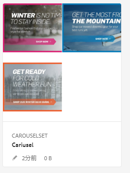
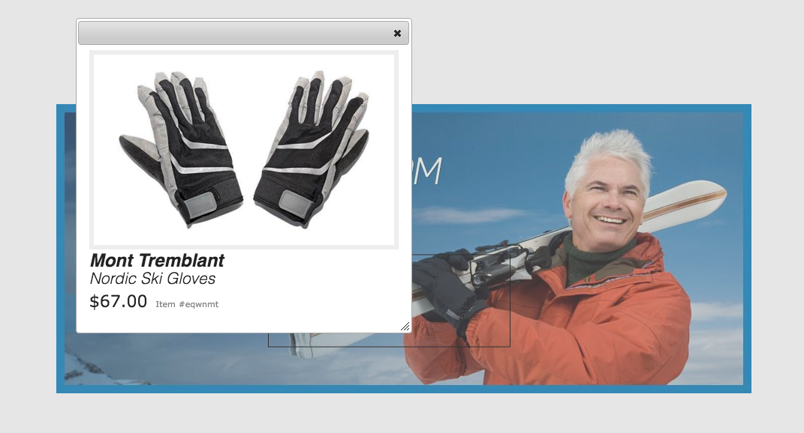
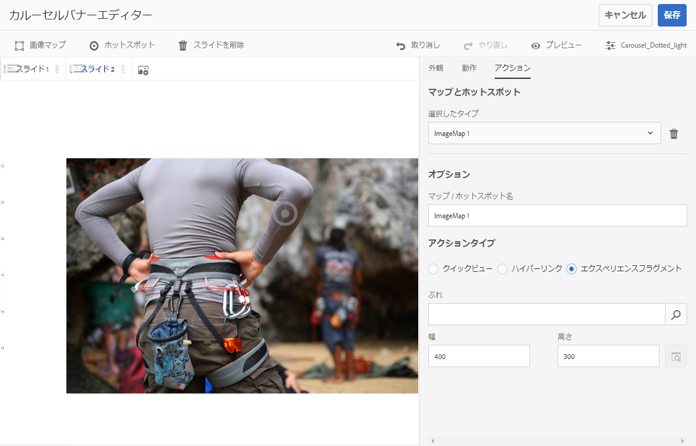
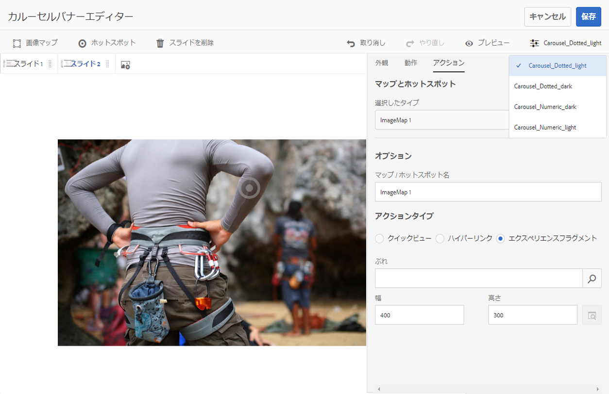

# カルーセルバナー{#carousel-banners}

カルーセルバナーを使用すると、回転するインタラクティブなプロモーションコンテンツをマーケティング担当者が簡単に作成して、任意の画面に配信できるようになり、コンバージョンを推進できます。

プロモーションバナーに表示するコンテンツの作成や変更には時間がかかるので、新しいコンテンツをすぐに公開したり、ターゲットを絞り込んだりする際に制約が生じます。カルーセルバナーを使用すると、回転するバナーの作成や変更、製品の詳細情報や関連するリソースにリンクするホットスポットなどのインタラクティビティの追加、任意の画面への配信を短時間でおこなうことができ、新しいプロモーションコンテンツを市場に迅速に届けることができます。

カルーセルバナーには「**[!UICONTROL CAROUSELSET]**」と表示されます。

Web サイトではカルーセルバナーは次のように表示されます。

ここで、ユーザーが番号をクリックして画像を切り替えることができます。また、カスタマイズできる間隔に基づいて自動的にスライドを切り替えることもできます。カルーセルバナーに追加する画像は、ホットスポットと画像マップの両方に対応しており、タップするか、ハイパーリンクに移動するか、クイックビューウィンドウにアクセスできます。

この例では、ユーザーは画像マップをタップまたはクリックして、手袋のクイックビューウィンドウにアクセスしました。

## カルーセルバナーの作成方法の視聴 {#watch-how-carousel-banners-are-created}

10 分 33 秒の[カルーセルバナーの作成方法](https://s7d5.scene7.com/s7viewers/html5/VideoViewer.html?videoserverurl=https://s7d5.scene7.com/is/content/&amp;emailurl=https://s7d5.scene7.com/s7/emailFriend&amp;serverUrl=https://s7d5.scene7.com/is/image/&amp;config=Scene7SharedAssets/Universal_HTML5_Video_social&amp;contenturl=https://s7d5.scene7.com/skins/&amp;asset=S7tutorials/InteractiveCarouselBanner)に関する説明を視聴してください。また、カルーセルバナーのプレビュー、編集および配信方法についても説明します。

>[!NOTE]
>
>管理者以外のユーザーは、カルーセルバナーを作成または編集できるように、**[!UICONTROL dam-users]** グループに追加される必要があります。作成や編集で問題が発生した場合、**[!UICONTROL dam-users]** グループにユーザーを追加できるシステム管理者に確認してください。

## クイックスタート：カルーセルバナー {#quick-start-carousel-banners}

すぐに使い始めるには：

1. [ホットスポットと画像マップの変数を識別します](#identifying-hotspot-and-image-map-variables)（AEM Assets と Dynamic Media の両方を使用するユーザーのみ）。

   まず、既存のクイックビュー実装で使用されている動的変数を識別します。こうすることで、AEM Assets でのカルーセルバナー作成プロセスでホットスポットと画像マップのデータを適切に入力できます。

<!-- LEAVE; COMMERCE BEING ADDED AGAIN IN THE FUTURE

   >[!NOTE]
   >
   >If you are an AEM Sites or Ecommerce customer, you can use the built-in feature to navigate to product pages and lookup the existing skus in the product catalog. You do not need to manually enter hotspot or image map variables.
   >
   >
   >If you are an AEM Assets and Dynamic Media customer, you will manually enter data for hotspots and image maps, and then integrate the published URL or Embed code with your third-party content management system.

-->

1. オプション：必要であれば、[カルーセルセットビューアプリセットを作成します](/help/assets/dynamic-media/managing-viewer-presets.md)。

   管理者は、独自のカルーセルビューアプリセットを作成して、カルーセルの動作と外観をカスタマイズできます。主な利点は、複数のカルーセルに対してこのカスタムビューアプリセットを再利用できることです。ただし、ユーザーがカルーセルを作成するときに、カルーセルの動作や外観を直接カスタマイズすることもできます。カルーセルで特定のデザインが求められるケースではこの方法が適しています。

1. [画像バナーをアップロードします](#uploading-image-banners)。

   インタラクティブにする画像バナーをアップロードします。

1. [カルーセルセットを作成します](#creating-carousel-sets)。

   カルーセルセットでは、ユーザーはバナー画像を切り替え、ホットスポットまたは画像マップをタップして関連するコンテンツにアクセスします。

   Assets でカルーセルセットを作成するには、「**[!UICONTROL 作成]**」をタップし、「**[!UICONTROL カルーセルセット]**」を選択します。アセットをスライドに追加し、「**[!UICONTROL 保存]**」をタップします。エディター内で、カルーセルの外観と動作を直接編集することもできます。

1. [画像バナーにホットスポットまたは画像マップを追加します。](#adding-hotspots-or-image-maps-to-an-image-banner)

   1 つ以上のホットスポットまたは画像マップを画像バナーに追加し、それぞれにアクション（リンクやクイックビュー、エクスペリエンスフラグメントなど）を関連付けます。ホットスポットまたは画像マップを追加した後は、カルーセルセットを公開してタスクを終了します。公開によって埋め込みコードが生成されます。これは、コピーして Web サイトのランディングページに適用するために使用できます。

   [（オプション）カルーセルバナーのプレビュー](#optional-previewing-carousel-banners)を参照してください。必要に応じて、カルーセルセットの表示を確認して、インタラクティビティをテストすることができます。

1. [カルーセルバナーを公開します。](#publishing-carousel-banners)

   他のアセットと同じようにカルーセルセットを公開します。Assets でカルーセルセットに移動し、選択して「**[!UICONTROL 公開]**」をタップします。カルーセルセットを公開すると、URL と埋め込み文字列がアクティベートされます。

1. 次のいずれかの操作をおこないます。

   * [Web サイトへのカルーセルバナーの追加](#adding-a-carousel-banner-to-your-website-page)Web サイトページにカルーセルバナーの URL またはコピーした埋め込みコードを追加できます。

      * [カルーセルバナーと既存のクイックビューの統合](#integrating-the-carousel-banner-with-an-existing-quickview)。サードパーティの Web コンテンツ管理システムを使用している場合は、新しいカルーセルバナーを、Web サイト上の既存のクイックビュー実装に統合する必要があります。
   * [AEM で Web サイトへのカルーセルバナーの追加](/help/assets/dynamic-media/adding-dynamic-media-assets-to-pages.md)AEM Sites のお客様は、インタラクティブメディアコンポーネントを使用して、カルーセルセットを AEM 内のページに直接追加できます。

カルーセルセットを編集する必要がある場合は、[カルーセルセットの編集](#editing-carousel-sets)を参照してください。また、[カルーセルセットのプロパティ](/help/assets/manage-digital-assets.md#editing-properties)を表示および編集することができます。

## ホットスポットと画像マップの変数の識別 {#identifying-hotspot-and-image-map-variables}

まず、既存のクイックビュー実装で使用されている動的変数を識別します。こうすることで、AEM Assets でのカルーセルセット作成プロセスでホットスポットまたは画像マップのデータを適切に入力できます。

AEM Assets 内のバナー画像にホットスポットまたは画像マップを追加する際に、各ホットスポットまたは画像マップに SKU とオプションの追加変数を割り当てる必要があります。これらの変数は、後でホットスポットまたは画像マップとクイックビューコンテンツを対応付けるために使用されます。

<!-- LEAVE; COMMERCE BEING ADDED LATER

>[!NOTE]
>
>If you are an AEM Sites and/or AEM Ecommerce customer, skip this step. You do not need to manually identify hotspot or image map variables; you can use the integration with Ecommerce for product integration. See information on [setting up eCommerce](/help/sites-cloud/administering/generic.md). In addition, you can use the Interactive component and add it to your web page.
>
>If you are an AEM Assets or Media customer, you publish the URL or Embed code and then integrate with your third-party content management system and identify hotspots and image maps manually.

-->

重要なのは、ホットスポットまたは画像マップのデータに関連付けられる変数の数とタイプを正しく識別することです。バナー画像に追加するそれぞれのホットスポットまたは画像マップは、既存のバックエンドシステム内で製品を一意に識別するための十分な情報を保持する必要があります。同時に、各ホットスポットまたは画像マップに、必要以上のデータを含めないようにしてください。必要以上のデータを含めると、データ入力プロセスが複雑になり、進行中のホットスポットまたは画像マップの管理でエラーが発生しやすくなるからです。

ホットスポットまたは画像マップのデータに使用する一連の変数を識別するには、様々な方法があります。

既存のクイックビュー実装を担当する IT スペシャリストに相談するだけで十分な場合もあります（通常、そのような IT スペシャリストは、システム内のクイックビューを識別するために必要な最小データセットを理解しています）。ただし、ほとんどの場合は、フロントエンドコードの既存の動作を分析するだけでもかまいません。

クイックビュー実装の大部分では、次の枠組みが使用されています。

* ユーザーは Web サイト上の特定のユーザーインターフェイス要素をアクティベートします。例えば、「**[!UICONTROL クイックビュー]**」ボタンをタップします。
* Web サイトでは、必要に応じて、クイックビューのデータまたはコンテンツを読み込むための Ajax リクエストをバックエンドに送信します。
* クイックビューのデータは、Web ページでのレンダリングに備えて、コンテンツに変換されます。
* 最後に、フロントエンドコードによってそのコンテンツが画面上に視覚的にレンダリングされます。

次に、クイックビュー機能が実装されている既存の Web サイトの各領域にアクセスしてクイックビューを起動し、そのクイックビューのデータまたはコンテンツを読み込むために Web ページから送信される Ajax URL をキャプチャします。

通常、専門のデバッグツールを使用する必要はありません。最新の Web ブラウザーには、十分なタスクを実行できる Web インスペクターが備わっています。Web インスペクターが搭載されている Web ブラウザーの例を次に示します。

* Google Chrome で、ブラウザーから送信されるすべての HTTP リクエストを参照するには、F12 キー（Windows）または Command + Option + I キー（Mac）を押してデベロッパーツールパネルを開き、「Network」タブをタップします。
* Firefox では、F12 キー（Windows）または Command + Option + I キー（Mac）を押して Firebug プラグインを有効にして「Net」タブを使用するか、組み込みの Inspector ツールとその「Network」タブを使用します。

ブラウザーでネットワーク監視をオンにして、ページ上でクイックビューを起動します。

次に、ネットワークログでクイックビューの Ajax URL を探し、記録された URL を今後の分析用にコピーします。クイックビューを起動するとほとんどの場合、サーバーに大量のリクエストが送信されます。通常、クイックビューの Ajax URL は、そのリクエストリストの最初のほうにあります。この URL には複雑なクエリ文字列部分またはパスが含まれ、その応答の MIME タイプは `text/xml`、`text/html`、`text/javascript` のいずれかになります。

このプロセスの実行中は、Web サイトの異なる領域（異なる製品カテゴリおよび製品タイプが含まれる領域）にアクセスすることが重要です。なぜなら、クイックビュー URL には、ある特定の Web サイトカテゴリに共通するが、Web サイトの異なる領域にアクセスした場合にのみ変化する部分が存在することがあるからです。

単純なケースでは、クイックビュー URL 内で変化する唯一の部分が製品 SKU となります。その場合、SKU の値が、ホットスポットまたは画像マップをバナー画像に追加するために必要になる唯一のデータです。

一方、複雑なケースでは、クイックビュー URL に SKU 以外の様々な要素が含まれます（カテゴリ ID、カラーコード、サイズコードなど）。その場合、各要素は、カルーセルバナー機能のホットスポットまたは画像マップのデータ定義内の個別の変数になります。

次のクイックビュー URL の例と、その結果となるホットスポットまたは画像マップの変数について見てみましょう。

<table>
 <tbody>
  <tr>
   <td>単一の SKU（クエリ文字列内）</td>
   <td>
記録されたクイックビューの URL：

    <ul>
     <li>
<code>https://server/json?productId=866558&amp;source=100</code>
 </li>
     <li>
<code>https://server/json?productId=1196184&amp;source=100</code>
 </li>
     <li>
<code>https://server/json?productId=1081492&amp;source=100</code>
 </li>
     <li>
<code>https://server/json?productId=1898294&amp;source=100</code>
 </li>
    </ul> 
この URL で変化する唯一の部分は <code>productId=</code> というクエリ文字列パラメーターの値であり、これが SKU 値であることは明白です。したがって、ホットスポットや画像マップには、次のような値が設定された SKU フィールドのみが必要になります。 <code>866558,</code> <code>1196184,</code> <code>1081492,</code> <code>1898294.</code>
 </td>
  </tr>
  <tr>
   <td>単一の SKU（URL パス内）</td>
   <td>
記録されたクイックビューの URL：

    <ul>
     <li>
<code>https://server/product/6422350843</code>
 </li>
     <li>
<code>https://server/product/1607745002</code>
 </li>
     <li>
<code>https://server/product/0086724882</code>
 </li>
    </ul> 
変化する部分はパスの最後の部分にあり、ホットスポット／画像マップの SKU 値（<strong><code>6422350843</code>、<code>1607745002,</code>、</strong><code>0086724882.</code>）になります
 </td>
  </tr>
  <tr>
   <td>SKU とカテゴリ ID（クエリ文字列内）</td>
   <td>
記録されたクイックビューの URL：

    <ul>
     <li>
<code>https://server/quickView/product/?category=1100004&amp;prodId=305466</code>
 </li>
     <li>
<code>https://server/quickView/product/?category=1100004&amp;prodId=310181</code>
 </li>
     <li>
<code>https://server/quickView/product/?category=1740148&amp;prodId=308706</code>
 </li>
    </ul> 
この場合、URL には変化する部分が 2 つあります。SKU が <code>prodId</code> パラメーターに、カテゴリ ID が <code>category=</code> パラメーターに格納されています。
 
そのため、ホットスポット／画像マップ定義はペアになります。つまり、SKU 値と、<code>categoryId</code> という追加の変数です。結果のペアは次のようになります。

    <ul>
     <li>
SKU が <strong><code>305466</code></strong>、<code>categoryId</code> が <code>1100004</code>。
 </li>
     <li>
SKU が <strong><code>310181</code></strong>、<code>categoryId</code> が <strong><code>1100004</code></strong>。
 </li>
     <li>
SKU が <strong><code>308706</code></strong>、<code>categoryId</code> が <strong><code>1740148</code></strong>。
 </li>
    </ul> </td>
  </tr>
 </tbody>
</table>

## 画像バナーのアップロード {#uploading-image-banners}

使用する画像を既にアップロードしている場合は、次の手順（[カルーセルセットの作成](#creating-carousel-sets)）に進んでください。カルーセルで使用される画像をアップロードする前に Dynamic Media を有効にしておく必要があることに注意してください。

画像バナーをアップロードするには、[アセットのアップロード](/help/assets/manage-digital-assets.md)を参照してください。

## カルーセルセットの作成 {#creating-carousel-sets}

>[!NOTE]
>
>管理者以外のユーザーは、カルーセルバナーを作成または編集できるように、**[!UICONTROL dam-users]** グループに追加される必要があります。作成や編集で問題が発生した場合、**[!UICONTROL dam-users]** グループにユーザーを追加できるシステム管理者に確認してください。

**カルーセルセットを作成するには**

1. Assets で、カルーセルセットを作成するフォルダーに移動し、**[!UICONTROL 作成／カルーセルセット]**&#x200B;をタップします。
1. カルーセルバナーエディターページで「**[!UICONTROL タップしてアセットセレクターを開く]**」をタップし、最初のスライドの画像を選択します。

   カルーセルバナーエディターページで次のいずれかをおこないます。

   * ページの左上隅付近にある「**[!UICONTROL スライドを追加]**」をタップします。

   * ページの中央付近にある「**[!UICONTROL タップしてアセットセレクターを開く]**」をタップします。
   カルーセルセットに含めるアセットをタップして選択します。選択済みのアセットにはチェックマークアイコンが付いています。作業が完了したら、ページの右上隅付近にある「**[!UICONTROL 選択]**」をタップします。

   アセットセレクターでは、キーワードを入力して **[!UICONTROL Enter]** キーをタップまたはクリックすることで、アセットを検索することができます。フィルターを適用して、検索結果を絞り込むこともできます。パス、コレクション、ファイルタイプおよびタグでフィルタリングできます。フィルターを選択してから、ツールバーの&#x200B;**[!UICONTROL フィルター]**&#x200B;アイコンをタップします。表示アイコンをタップし、**[!UICONTROL 列表示]**、**[!UICONTROL カード表示]**、**[!UICONTROL リスト表示]**&#x200B;のいずれかを選択してビューを変更します。

   詳しくは、[セレクターの操作](/help/assets/dynamic-media/working-with-selectors.md)を参照してください。

1. カルーセルセット内で回転させたい画像をすべて追加してしまうまで、スライドを追加し続けます。
1. （オプション）次のいずれかの操作をおこないます。

   * 必要に応じて、スライドをドラッグし、画像をセットのリスト内で並べ替えます。
   * 画像を削除するには、画像を選択し、「**[!UICONTROL スライドを削除]**」をタップします。

   * プリセットを適用するには、ページの右上隅付近にあるプリセットドロップダウンリストをタップし、セットに一度に適用するプリセットを選択します。
   スライドを削除するには、スライドをタップまたはクリックし、ツールバーの「**[!UICONTROL スライドを削除]**」をクリックします。スライドを移動するには、並べ替えアイコンをタップして、希望の場所まで移動します。

1. スライドに画像を追加した後で、ホットスポットまたは画像マップ（または両方）を画像に追加できます。[ホットスポットまたは画像マップの追加](#adding-hotspots-or-image-maps-to-an-image-banner)を参照してください。
1. カルーセルセットの視覚的デザインと動作を変更するには、「動作」タブと「外観」タブをタップまたはクリックし、カルーセルバナーの外観や特定のコンポーネントの動作を調整します。ビューアエディターの使用方法について詳しくは、[ビューアプリセットの管理](/help/assets/dynamic-media/viewer-presets.md)を参照してください。

   >[!NOTE]
   >
   >カルーセルバナーについて調整できるのは次のような項目です。
   >    * 1 つの画像が表示される時間。デフォルトでは、各画像は 9 秒間表示されます。
   >    * アニメーション.デフォルトでは、各スライドのトランジションはフェードです。これをスライドのトランジションに変更できます。
   >    * ボタンのスタイル。ユーザーは点または番号をタップしてバナーの画像を切り替えることができます。セットインジケーターボタンの表示位置（とスタイルが番号か点か）と大きさを変更できます。
   >    * 画像マップまたはホットスポットに使用されるアイコンのハイライトスタイルを変更します.
   >    * ビューアプリセットを編集する前に、そのプリセットのベースとして使用するスタイルを選択してください。そうしないと、ビューアプリセットの編集を開始した後、別のプリセットに切り替えることにした場合に、変更内容をすべて失うことになります。

   カルーセルバナーがどのように表示されるかをプレビューすることもできます。[（オプション）カルーセルバナーのプレビュー](#optional-previewing-carousel-banners)を参照してください。

1. 終了したら「**[!UICONTROL 保存]**」をタップします。

## 画像バナーへのホットスポットまたは画像マップの追加 {#adding-hotspots-or-image-maps-to-an-image-banner}

カルーセルセットエディターを使用して、ホットスポットまたは画像マップをバナーに追加できます。

ホットスポットまたは画像マップを追加する際に、クイックビューポップアップ表示、ハイパーリンクまたはエクスペリエンスフラグメントとして定義することができます。

[エクスペリエンスフラグメント](/help/sites-cloud/authoring/fundamentals/experience-fragments.md)を参照してください。

>[!NOTE]
>
>カルーセルバナーのソーシャルメディア共有ツールは、エクスペリエンスフラグメントにビューアを埋め込む場合はサポートされないことに注意してください。
>
>この問題を回避するには、ソーシャルメディア共有ツールのないビューアプリセットを使用または作成します。このようなビューアプリセットを使用すると、ビューアをエクスペリエンスフラグメントに正常に埋め込むことができます。

画像にホットスポットまたは画像マップを追加したら、忘れずに作業内容を保存してください。ページの右上隅にある「取り消し」および「やり直し」オプションは、現在の作成／編集セッションの間で有効です。

カルーセルバナーの作成が完了したら、プレビューを使用して、カルーセルバナーが顧客にどのように表示されるかを確認できます。

[（オプション）カルーセルバナーのプレビュー](#optional-previewing-carousel-banners)を参照してください。

>[!NOTE]
>
>[インタラクティブ画像](/help/assets/dynamic-media/interactive-images.md)またはカルーセルバナーの画像にホットスポットを追加すると、インタラクティブ画像かカルーセルバナーかにかかわらず、ホットスポット情報が同じメタデータの場所（画像に対して相対的な場所）に格納されます。つまり、どちらのビューアでも、同じ画像を定義済みのホットスポットデータと一緒に簡単に再利用できます。

>  ただし、カルーセルバナーでは、画像上の画像マップ（ホットスポットを含むことができる）がサポートされることに注意してください。インタラクティブ画像ではサポートされません。同じ画像を使用するインタラクティブ画像またはカルーセルバナーを作成する場合には、このことに注意してください。同じ画像の別のコピーを使用してインタラクティブ画像とカルーセルバナーを作成することをお勧めします。

>[!NOTE]
>
>ホットスポットを含むインタラクティブ画像を編集しているときに、画像を切り取ると、ホットスポットは削除されます。

<!-- See also [Adding Image Maps](/help/assets/image-maps.md). -->

**画像バナーにホットスポットまたは画像マップを追加するには**

1. Assets ビューで、インタラクティブにするカルーセルセットに移動します。
1. カルーセルセットを選択し、「**[!UICONTROL 編集]**」をタップします。カルーセルビューアエディターが開きます。
1. インタラクティブにするスライドを選択します。
1. ページの左上隅付近にある「**[!UICONTROL ホットスポット]**」または「**[!UICONTROL 画像マップ]**」をタップします。
1. 次のいずれかの操作をおこないます。

   * ホットスポットの場合：画像の上で、ホットスポットを表示する場所をタップします。
   * 画像マップの場合：画像上でクリックし、左上から右下にドラッグして画像マップ領域を作成します。画像マップのサイズを調整するには、隅をドラッグします。

   必要に応じて、ホットスポットまたは画像マップを別の場所にドラッグします。必要に応じて、他のホットスポットまたは画像マップを追加します。

   ホットスポットまたは画像マップを削除するには、「**[!UICONTROL アクション]**」タブをタップします。「**[!UICONTROL マップとホットスポット]**」見出しの下にある「**[!UICONTROL 選択したタイプ]**」ドロップダウンメニューから、削除するホットスポットまたは画像マップの名前を選択します。メニューの横にある&#x200B;**[!UICONTROL ごみ箱]**&#x200B;アイコンをタップし、「**[!UICONTROL 削除]**」をタップします。

1. 「名前」テキストフィールドにホットスポットまたは画像マップの名前を入力します。この名前は&#x200B;**[!UICONTROL マップとホットスポット]**&#x200B;ドロップダウンリストにも表示されます。名前を指定すると、後で変更を加える際に、ホットスポットまたは画像マップを特定しやすくなります。
1. 「**[!UICONTROL アクション]**」タブで次のいずれかの操作をおこないます。

   * 「**[!UICONTROL クイックビュー]**」をタップします。

      * AEM Sites のユーザーである場合は、製品ピッカーアイコン（虫眼鏡）をタップして、製品を選択ページを開きます。<!-- and Ecommerce customer-->使用する製品をタップしてから、ページの右上隅のチェックマークをタップして、カルーセルバナーエディターに戻ります。
      * AEM Sites のユーザーではない場合は次のようにします。<!-- or Ecommerce customer -->

         * これらの変数を定義するときは、[ホットスポットの変数の識別](#identifying-hotspot-and-image-map-variables)を参照してください。
         * 次に、SKU 値を手動で入力します。「SKU 値」テキストフィールドに、製品の SKU（Stock Keeping Unit）を入力します。SKU は、提供している製品またはサービスごとの一意の識別子です。入力した SKU 値によってクイックビューテンプレートの変数部分が自動的に入力され、タップされたホットスポットが特定の SKU のクイックビューに関連付けられます。
         * （オプション）クイックビュー内で製品をさらに識別するために必要になる他の変数がある場合は、「**[!UICONTROL 汎用変数を追加]**」をタップします。テキストフィールドに追加の変数を指定します。例えば、追加の変数として category=Mens などと指定します。

         * 詳しくは、[セレクターの操作](/help/assets/dynamic-media/working-with-selectors.md)を参照してください。
   * 「**[!UICONTROL ハイパーリンク]**」をタップします。

      * AEM Sites のユーザーである場合は、サイトセレクターアイコン（フォルダー）をタップして URL に移動します。

         >[!NOTE]
         >
         >インタラクティブコンテンツに相対 URL のリンク（特に AEM Sites ページへのリンク）がある場合、URL ベースのリンク方法は使用できません。

      * スタンドアロンユーザーである場合は、「HREF」テキストフィールドに、リンクされる Web ページへの完全な URL パスを指定します。

   このリンクを新しいブラウザータブで開く（推奨のデフォルト）か同じタブで開くかを指定してください。

   詳しくは、[セレクターの操作](/help/assets/dynamic-media/working-with-selectors.md)を参照してください。

   * 「**[!UICONTROL エクスペリエンスフラグメント]**」をタップします。

      * AEM Sites のユーザーである場合は、検索アイコン（虫眼鏡）をタップしてエクスペリエンスフラグメントページを開きます。使用するエクスペリエンスフラグメントをタップまたはクリックし、ページの右上隅にある「選択」をタップして、ホットスポット管理ページに戻ります。[エクスペリエンスフラグメント](/help/sites-cloud/authoring/fundamentals/experience-fragments.md)を参照してください。

      * エクスペリエンスフラグメントがバナーに表示されるときの幅と高さを指定します。

         >[!NOTE]
         >
         >カルーセルバナーのソーシャルメディア共有ツールは、エクスペリエンスフラグメントにビューアを埋め込む場合はサポートされないことに注意してください。

         この問題を回避するには、ソーシャルメディア共有ツールのないビューアプリセットを使用または作成します。このようなビューアプリセットを使用すると、ビューアをエクスペリエンスフラグメントに正常に埋め込むことができます。
   

   カルーセルバナーがどのように表示されるかをプレビューすることもできます。[（オプション）カルーセルバナーのプレビュー](#optional-previewing-carousel-banners)を参照してください。

1. 「**[!UICONTROL 保存]**」をタップします。
1. カルーセルセットを公開します。公開によって、Web サイトのページで使用できる、埋め込みコードまたは URL が生成されます。AEM Sites のユーザーである場合は、カルーセルセットを Web ページに直接追加できます。

   [アセットの公開](/help/assets/dynamic-media/publishing-dynamicmedia-assets.md)を参照してください。

   [Web サイトランディングページへのカルーセルセットの追加](#adding-a-carousel-banner-to-your-website-page)を参照してください。

## カルーセルセットの編集 {#editing-carousel-sets}

>[!NOTE]
>
>管理者以外のユーザーは、カルーセルバナーを作成または編集できるように、**[!UICONTROL dam-users]** グループに追加される必要があります。作成や編集で問題が発生した場合、**[!UICONTROL dam-users]** グループにユーザーを追加できるシステム管理者に確認してください。

カルーセルセットでは、次のような様々な編集タスクを実行できます。

* カルーセルセットにスライドを追加します。[セレクターの操作](/help/assets/dynamic-media/working-with-selectors.md)も参照してください。
* カルーセルセット内のスライドを並べ替えます。
* カルーセルセットのアセットを削除します。
* ビューアプリセットを適用します。
* カルーセルセットを削除します。
* ホットスポットや画像マップを追加または編集します。[セレクターの操作](/help/assets/dynamic-media/working-with-selectors.md)も参照してください。

**カルーセルセットを編集するには**

1. 次のいずれかの操作をおこないます。

   * カルーセルセットアセットの上にマウスポインターを置き、**[!UICONTROL 編集]**（鉛筆アイコン）をタップします。
   * カルーセルセットアセットの上にマウスポインターを置き、**[!UICONTROL 選択]**（チェックマークアイコン）をタップしてからツールバーの「**[!UICONTROL 編集]**」をタップします。

   * カルーセルセットアセットをタップし、ページの左上隅にある「**[!UICONTROL 編集]**」（鉛筆アイコン）をタップします。

1. カルーセルセットを編集するには、次のいずれかの操作をおこないます。

   * スライドを追加するには、**[!UICONTROL スライドを追加]**&#x200B;アイコンをタップし、そのスライドに追加するアセットの場所に移動して、チェックマークをタップまたはクリックします。
   * スライドを並べ替えるには、スライドを新しい位置までドラッグします（並べ替えアイコンを選択して項目を移動します）。
   * ホットスポットまたは画像マップを追加するには、ホットスポットまたは画像マップのアイコンをクリックし、[ホットスポットおよび画像マップの追加](#adding-hotspots-or-image-maps-to-an-image-banner)を参照してください。
   * カルーセルセットの外観や動作を編集するには、「**[!UICONTROL 外観]**」タブまたは「**[!UICONTROL 動作]**」タブをタップし、必要なオプションを設定します。
   * ホットスポットまたは画像マップを編集するには、対応するスライドの「**[!UICONTROL アクション]**」タブの下で、ホットスポットまたは画像マップを選択し、必要に応じて変更を加えます。
   * スライドを削除するには、スライドを選択し、ツールバーの「**[!UICONTROL スライドを削除]**」をタップします。
   * プリセットを適用するには、ページの右上隅付近にある「**[!UICONTROL プリセット]**」ドロップダウンリストをタップし、ビューアプリセットを選択します。
   * カルーセルセット全体を削除するには、カルーセルセットの場所に移動して選択し、「**[!UICONTROL 削除]**」をタップします。

   >[!NOTE]
   >
   >ホットスポットを含むインタラクティブ画像を編集しているときに、画像を切り取ると、ホットスポットは削除されます。

## （オプション）カルーセルバナーのプレビュー{#optional-previewing-carousel-banners}

プレビューを使用して、カルーセルバナーが顧客に対してどのように表示されるかを確認し、カルーセルバナーのホットスポットと画像マップをテストして動作が期待どおりであるかを確認することができます。

カルーセルバナーの設定が完了したら、このカルーセルバナーを公開できます。[Web ページへのビデオビューアまたは画像ビューアの埋め込み](/help/assets/dynamic-media/embed-code.md)を参照してください。[Web アプリケーションへの URL のリンク](/help/assets/dynamic-media/linking-urls-to-yourwebapplication.md)を参照してください。インタラクティブコンテンツに相対 URL のリンク（特に AEM Sites ページへのリンク）がある場合、URL ベースのリンク方法は使用できません。[ページへの Dynamic Media アセットの追加](/help/assets/dynamic-media/adding-dynamic-media-assets-to-pages.md)を参照してください。

カルーセルバナーは、カルーセルエディター（推奨）または&#x200B;**[!UICONTROL ビューア]**&#x200B;リストでプレビューできます。

**カルーセルバナーをプレビューするには**

1. **[!UICONTROL Assets]** で、作成したカルーセルバナーの場所に移動し、タップして開きます。
1. 「**[!UICONTROL 編集]**」をタップします。
1. ツールバーの右端にあるビューアプリセットリストで、カルーセルバナーをプレビューするビューアを選択します。

   

1. **[!UICONTROL プレビュー]**&#x200B;をタップします。
1. 画像上のホットスポットまたは画像マップをタップし、関連付けられたアクションをテストします。

**ビューアリストでカルーセルバナーをプレビューするには**

1. **[!UICONTROL Assets]** で、作成したカルーセルバナーの場所に移動し、タップして開きます。
1. プレビューページの左上隅付近にある「コンテンツ」アイコンをクリックします。
1. ページの左側のパネルにある「**[!UICONTROL ビューア]**」リストで、使用するカルーセルバナービューアプリセットの名前をタップします。
1. 画像上のホットスポットまたは画像マップをタップし、関連付けられたアクションをテストします。

## カルーセルバナーの公開 {#publishing-carousel-banners}

カルーセルを使用するには、公開する必要があります。カルーセルセットを公開すると、URL と埋め込みコードがアクティベートされます。これにより、スケーラブルで効率の良い配信を実現するため、CDN と統合された Dynamic Media クラウドにもカルーセルが公開されます。

>[!NOTE]
>
>ホットスポットを含む既存のインタラクティブ画像をカルーセルバナー用として使用する場合は、カルーセルバナーを公開した後で、そのインタラクティブ画像を別に公開する必要があります。
>また、カルーセルバナーで使用している公開済みインタラクティブ画像を変更する場合は、そのインタラクティブ画像を公開する必要があります。その後、変更がカルーセルバナーに反映されます。

カルーセルバナーの公開方法に関する情報については、[Dynamic Media アセットの公開](/help/assets/dynamic-media/publishing-dynamicmedia-assets.md)を参照してください。

## Web サイトページへのカルーセルバナーの追加 {#adding-a-carousel-banner-to-your-website-page}

バナー画像をアップロードしてカルーセルを作成し、ホットスポットまたは画像マップ（あるいは両方）を画像に追加し、カルーセルセットを公開したら、次は既存の Web サイトページにカルーセルを追加できます。

>[!NOTE]
>
>AEM Sites のユーザーである場合は、インタラクティブメディアコンポーネントをページにドラッグすることにより、カルーセルバナーをページに直接追加できます。[ページへの Dynamic Media アセットの追加](/help/assets/dynamic-media/adding-dynamic-media-assets-to-pages.md)を参照してください。

ただし、スタンドアロン AEM Assets のユーザーである場合は、この節で説明するようにカルーセルバナーを手動で Web サイトのランディングページに追加できます。

1. 公開済みのカルーセルバナーの埋め込みコードをコピーします。[Web ページへのビデオビューアまたは画像ビューアの埋め込み](/help/assets/dynamic-media/embed-code.md)を参照してください。

1. AEM Assets からコピーした埋め込みコードを Web ページに追加します。コピーされた埋め込みコードはレスポンシブです。つまり、ページの埋め込み領域に自動的に適応します。

## カルーセルバナーと既存のクイックビューの統合 {#integrating-the-carousel-banner-with-an-existing-quickview}

注意：この手順はスタンドアロン AEM Assets のユーザーのみに適用されます。

このプロセスの最後の手順は、カルーセルバナーを Web サイトの既存のクイックビュー実装に統合することです。すべてのクイックビュー実装は固有であり、フロントエンド IT 担当者の支援を受けた特別なアプローチが必要になります。

既存のクイックビュー実装は一般的に、Web ページ上で以下の順に発生する、相互に関連するアクションの連鎖となっています。

1. ユーザーは、Web サイトのユーザーインターフェイス内で、特定の要素を起動します。
1. フロントエンドコードは、手順 1 で起動されたユーザーインターフェイス要素に基づいてクイックビュー URL を取得します。
1. フロントエンドコードは、手順 2 で取得した URL を使用して Ajax リクエストを送信します。
1. バックエンドロジックは、対応するクイックビューのデータまたはコンテンツをフロントコードに送り返します。
1. フロントエンドコードは、そのクイックビューのデータまたはコンテンツを読み込みます。
1. （オプション）フロントエンドコードは、読み込んだクイックビューのデータを HTML 表現に変換します。
1. フロントエンドコードは、モーダルダイアログボックスまたはパネルを表示し、エンドユーザー向けに、画面上に HTML コンテンツをレンダリングします。

これらの呼び出しは、必ずしもそれぞれ独立した、Web ページのロジックから任意の手順で呼び出すことができるパブリックな API 呼び出しを表すわけではありません。むしろ、次の手順がすべて前の手順の最終フェーズ（コールバック）に潜むような連鎖的な呼び出しになっています。

カルーセルバナーが手順 1 と（部分的に）手順 2 を置き換えます。それに加えて、ユーザーがカルーセルバナー内のホットスポットまたは画像マップをクリックしたときに、そのユーザー操作がビューアによって処理されます。ビューアは、以前に追加されたすべてのホットスポットまたは画像マップのデータを含む Web ページにイベントを返します。

そのようなイベントハンドラーでは、フロントエンドコードは次の処理を実行します。

* カルーセルバナーから送出されるイベントをリッスンします。
* ホットスポットまたは画像マップのデータに基づいてクイックビュー URL を作成します。
* バックエンドからクイックビューを読み込み、画面上の表示用にレンダリングするプロセスを起動します。

AEM Assets によって返される埋め込みコードには、すぐに使用可能なイベントハンドラーが既に含まれ、コメントアウトされています。

そのため、必要な処理は、このコードのコメントアウトを解除し、ダミーのハンドラー本体を、特定の Web ページ専用のコードに置き換えることだけです。

クイックビュー URL の作成プロセスは、基本的に先ほど説明したホットスポットと画像マップの変数を識別するためのプロセスとは逆のプロセスになります。

[ホットスポットと画像マップの変数の識別](#identifying-hotspot-and-image-map-variables)を参照してください。

クイックビュー URL を起動してクイックビューパネルをアクティベートするための最後の手順では、おそらく IT 部門のフロントエンド IT 担当者の支援が必要になります。フロントエンド IT 担当者は、すぐに使用できるクイックビュー URL を含め、クイックビュー実装を適切な手順から正しく起動するための最適な方法について理解しています。

## クイックビューを使用したカスタムポップアップの作成 {#using-quickviews-to-create-custom-pop-ups}

[クイックビューを使用したカスタムポップアップの作成](/help/assets/dynamic-media/custom-pop-ups.md)を参照してください。