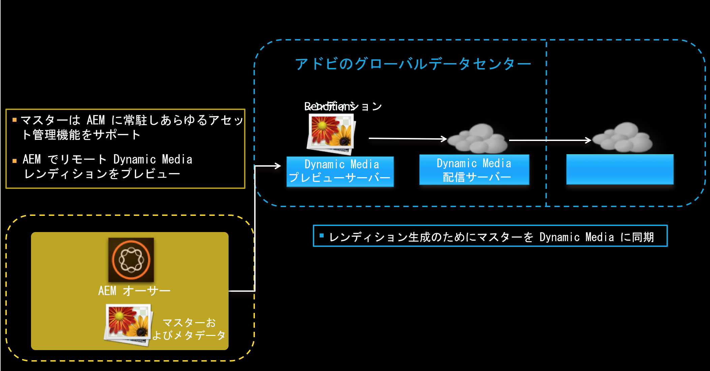
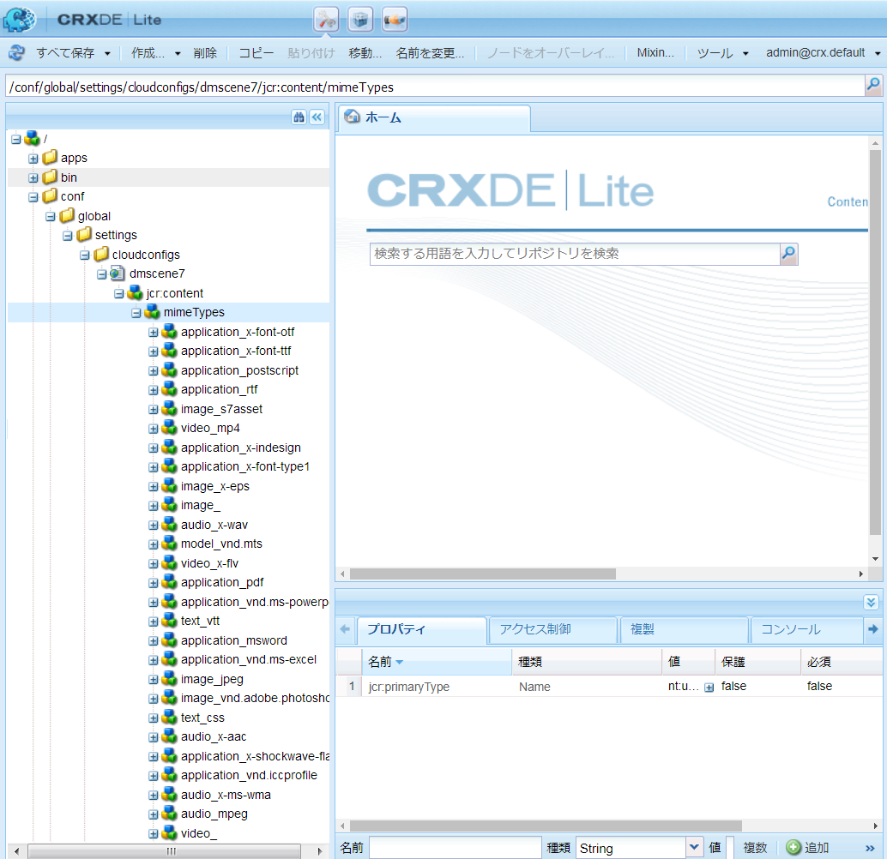
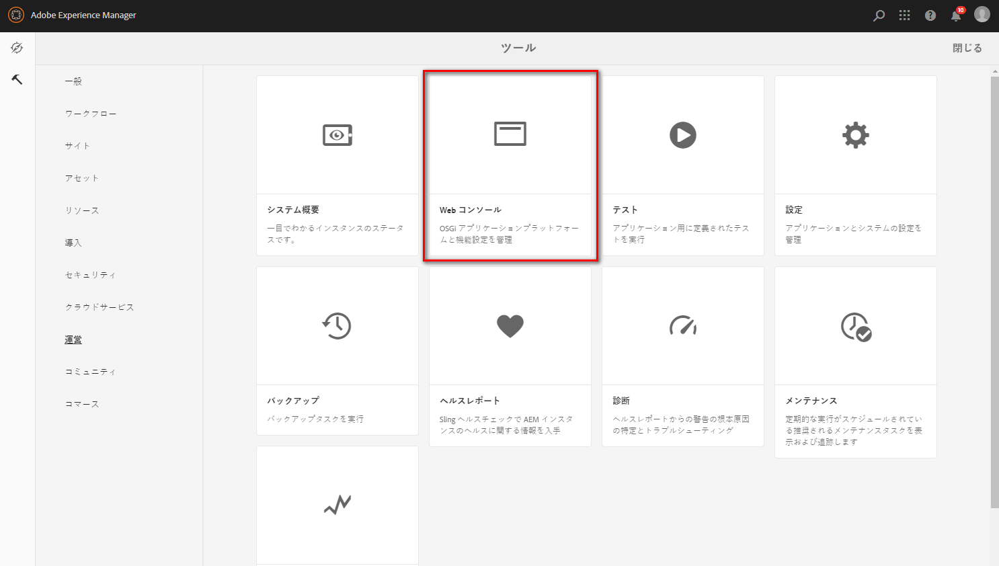
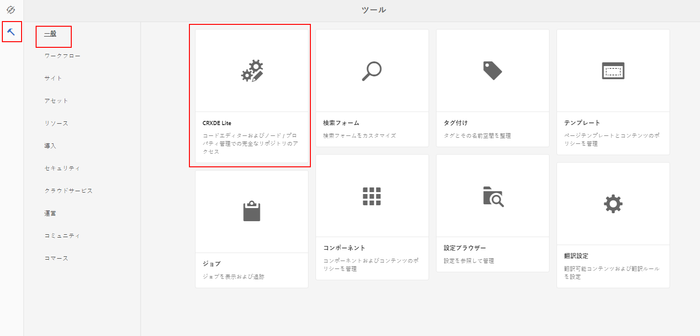
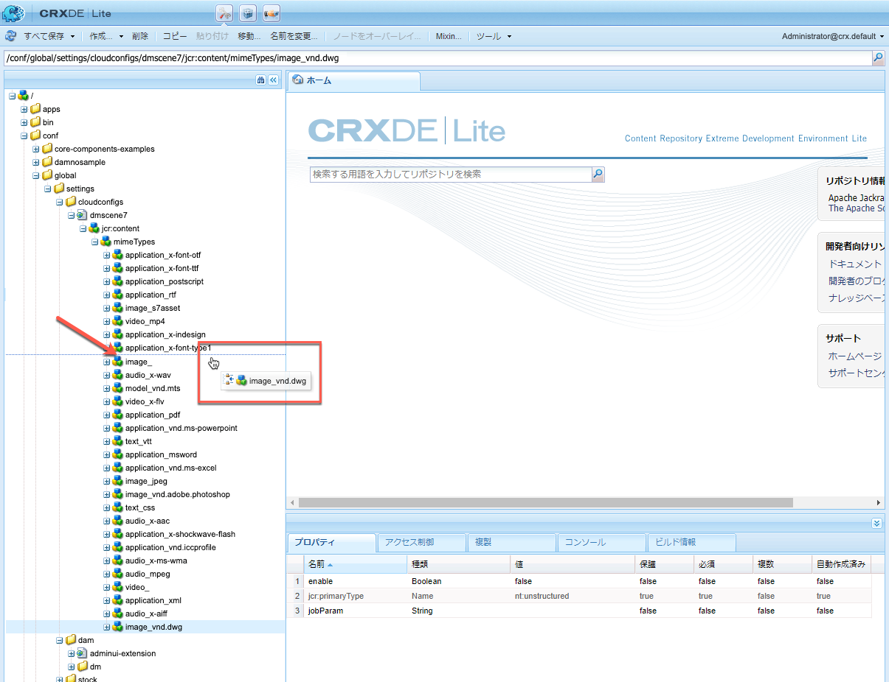
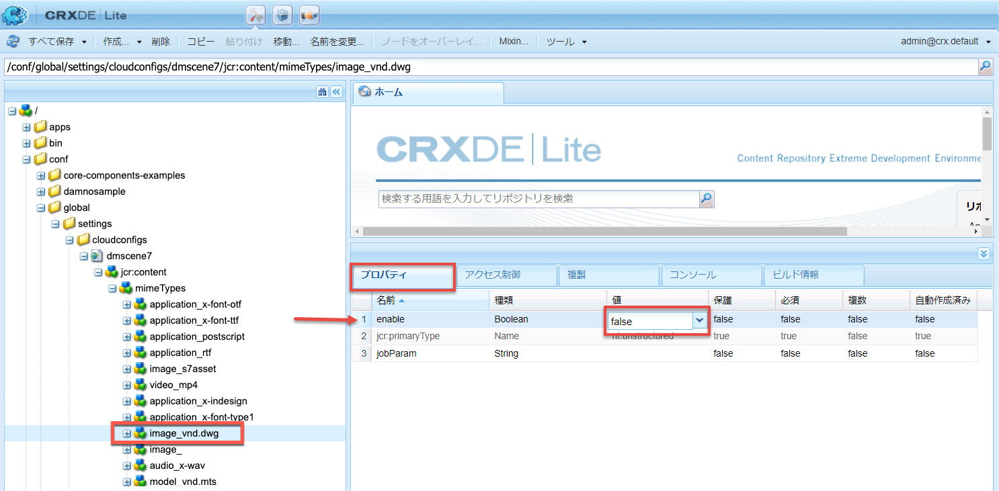

# Dynamic Media Cloud Service の設定について {#configuring-dynamic-media-scene-mode}

開発用、ステージング用、実稼動用など、複数の異なる環境向けに Adobe Experience Manager をセットアップして使用する場合は、それぞれの環境向けに Dynamic Media Cloud Services を設定する必要があります。

## Dynamic Media のアーキテクチャ図 {#architecture-diagram-of-dynamic-media-scene-mode}

以下のアーキテクチャ図に Dynamic Media の仕組みを示します。

新しいアーキテクチャでは、AEM は、プライマリソースアセットを担当し、アセットの処理および公開のための Dynamic Media と同期します。

1. プライマリソースアセットが AEM にアップロードされると、Dynamic Media にレプリケートされます。その時点で、Dynamic Media は、ビデオエンコーディングおよび画像の動的バリアントなど、すべてのアセットの処理とレンディションの生成を扱います。
1. レンディションが生成されると、AEM は、リモートの Dynamic Media レンディションに安全にアクセスおよびプレビューできます（バイナリは AEM インスタンスに送り返されません）。
1. コンテンツを公開および承認する準備ができると、Dynamic Media サービスがトリガーされ、コンテンツが配信サーバーにプッシュされて、CDN にコンテンツがキャッシュされます。



<!-- OBSOLETE CONTENT

## (Optional) Migrating Dynamic Media presets and configurations from 6.3 to 6.5 Zero Downtime {#optional-migrating-dynamic-media-presets-and-configurations-from-to-zero-downtime}

If you are upgrading AEM Dynamic Media from 6.3 to 6.4 or 6.5 (which now includes the ability for zero downtime deployments), you are required to run the following curl command to migrate all your presets and configurations from `/etc` to `/conf` in CRXDE Lite.

>[!NOTE]
>
>If you run your AEM instance in compatibility mode--that is, you have the compatibility packaged installed--you do not need to run these commands.

For all upgrades, either with or without the compatibility package, you can copy the default, out-of-the-box viewer presets that originally came with Dynamic Media by running the following Linux curl command:

`curl -u admin:admin -X POST https://<server_address>:<server_port>/libs/settings/dam/dm/presets/viewer.pushviewerpresets.json`

To migrate any custom viewer presets and configurations that you have created from `/etc` to `/conf`, run the following Linux curl command:

`curl -u admin:admin -X POST https://<server_address>:<server_port>/libs/settings/dam/dm/presets.migratedmcontent.json`

-->

## Cloud Services での新しい Dynamic Media 設定の作成 {#configuring-dynamic-media-cloud-services}

<!-- **Before you creating a Dynamic Media Configuration in Cloud Services**: After you receive your provisioning email with Dynamic Media credentials, you must [log in](https://www.adobe.com/marketing-cloud/experience-manager/scene7-login.html) to Dynamic Media Classic to change your password. The password provided in the provisioning email is system-generated and intended to be a temporary password only. It is important that you update the password so that Dynamic Media Cloud Service is set up with the correct credentials. -->

1. AEM で、AEM ロゴをタップして、グローバルナビゲーションコンソールにアクセスします。
1. コンソールの左側でツールアイコンをタップした後、**[!UICONTROL Cloud Services／Dynamic Media 設定]**&#x200B;をタップします。
1. Dynamic Media 設定ブラウザーページの左側のパネルで、「**[!UICONTROL グローバル]**」をタップし（「**[!UICONTROL グローバル]**」の左側にあるフォルダーアイコンをタップまたは選択しないでください）、次に、「**[!UICONTROL 作成]**」をタップします。
1. **[!UICONTROL Dynamic Media 設定を作成]**&#x200B;ページで、タイトル、Dynamic Media アカウントの電子メールアドレス、パスワードを入力し、地域を選択します。これらは、プロビジョニング電子メールでアドビから提供されます。この電子メールを受信していない場合は、サポートにお問い合わせください。
1. 「**[!UICONTROL Dynamic Media に接続]**」をクリックします。
1. **[!UICONTROL パスワードを変更]**&#x200B;ダイアログボックスの「**[!UICONTROL 新しいパスワード]**」フィールドに、8～25 文字の新しいパスワードを入力します。パスワードには、次のうち少なくとも 1 つを含める必要があります。

   * 大文字
   * 小文字
   * 数値
   * 特殊文字：`# $ & . - _ : { }`

   なお、「**[!UICONTROL 現在のパスワード]**」フィールドは意図的に事前入力されており、操作時には非表示になっています。

   必要に応じて、パスワードの目のアイコンをタップしてパスワードを表示し、入力または再入力したパスワードのスペルを確認できます。アイコンをもう一度タップすると、パスワードが非表示になります。

1. 「**[!UICONTROL パスワードの繰り返し]**」フィールドに新しいパスワードを再入力し、「**[!UICONTROL 完了]**」をタップします。

   新しいパスワードは、**[!UICONTROL Dynamic Media 設定を作成]**&#x200B;ページの右上隅にある「**[!UICONTROL 保存]**」をタップしたときに保存されます。

   **[!UICONTROL パスワードを変更]**&#x200B;ダイアログボックスで「**[!UICONTROL キャンセル]**」をタップした場合でも、「**[!UICONTROL 保存]**」をタップして新規作成の Dynamic Media 設定を保存する際に、新しいパスワードを入力する必要があります。

   [Dynamic Media のパスワードの変更](#change-dm-password)も参照してください。

1. 接続に成功したら、次のように設定できます。

   | プロパティ | 説明 |
   |---|---|
   | 会社 | Dynamic Media アカウントの名前です。異なるサブブランドや事業部、または異なるステージング／実稼動環境のために、複数の Dynamic Media アカウントを持っていることがあります。 |
   | 会社のルートフォルダーのパス | 会社のルートフォルダーパスです。 |
   | アセットの公開 | 次の 3 つのオプションから選択できます。<br>**[!UICONTROL 即時&#x200B;]**：アセットがアップロードされると、システムによってアセットが取り込まれ、URL／埋め込みがすぐに提供されます。アセットを公開するためにユーザーが操作する必要はありません。<br>**[!UICONTROL アクティベーション時]**：URL／埋め込みリンクが提供される前に、最初にアセットを明示的に公開する必要があります。<br>**[!UICONTROL 選択的公開&#x200B;]**：アセットは、セキュアなプレビューのためにのみ自動公開され、パブリックドメインでの配信のために DMS7 に公開することなく、明示的に AEM に公開することができます。今後、アドビは、相互に排他的なアセットを AEM に公開し、Dynamic Media に公開するこのオプションを拡張します。つまり、アセットを DMS7 に公開して、スマート切り抜きや動的レンディションなどの機能を使用できます。または、プレビュー用に AEM でのみアセットを公開することもできます。これらの同じアセットは、パブリックドメインでの配信のために DMS7 で公開されません。 |
   | プレビューサーバーを保護 | セキュアなレンディションプレビューサーバーへの URL パスを指定できます。つまり、レンディションが生成されると、AEM は、リモートの Dynamic Media レンディションに安全にアクセスしてプレビューできます（バイナリは AEM インスタンスに送り返されません）。<br>自社のサーバーまたは特別なサーバーを使用する特別な取り決めがない限り、この設定を指定されたとおりにしておくことをお勧めします。 |
   | すべてのコンテンツを同期 | デフォルトで選択されています。Dynamic Media との同期で、アセットを選択して含めるまたは除外する場合は、このオプションの選択を解除します。このオプションの選択を解除すると、次の 2 つの Dynamic Media 同期モードから選択できるようになります。<br>**[!UICONTROL Dynamic Media 同期モード]**<br>**[!UICONTROL デフォルトで有効&#x200B;]**：フォルダーを特別に除外するようにマークしない限り、設定はすべてのフォルダーにデフォルトで適用されます。<!-- you can then deselect the folders that you do not want the configuration applied to.--><br>**[!UICONTROL デフォルトで無効]**：選択したフォルダーを Dynamic Media と同期するように明示的にマークしない限り、設定はどのフォルダーにも適用されません。<br>選択したフォルダーを Dynamic Media と同期するようにマークするには、アセットフォルダーを選択した後、ツールバーで「**[!UICONTROL プロパティ]**」をタップします。「**[!UICONTROL 詳細]**」タブの **[!UICONTROL Dynamic Media 同期モード]**&#x200B;ドロップダウンリストで、次の 3 つのオプションから選択します。完了したら、「**[!UICONTROL 保存]**」をタップします。*注意：以前に「**すべてのコンテンツを同期**」を選択した場合、これら 3 つのオプションは使用できません。*&#x200B;関連項目：[Dynamic Media のフォルダーレベルでの選択的公開の設定。](/help/assets/dynamic-media/selective-publishing.md)<br>**[!UICONTROL 継承&#x200B;]**：フォルダーに明示的な同期値はなく、代わりに、上位フォルダーの 1 つまたはクラウド設定のデフォルトモードから同期値を継承します。継承された詳細なステータスは、ツールチップの要領で表示されます。<br>**[!UICONTROL サブフォルダーを有効にする]**：このサブツリー内のすべての項目を Dynamic Media との同期に含めます。フォルダー固有の設定は、クラウド設定内のデフォルトモードよりも優先されます。<br>**[!UICONTROL サブフォルダーに対して無効&#x200B;]**：このサブツリー内のすべての項目を Dynamic Media との同期から除外します。 |

   >[!NOTE]
   >
   >Dynamic Media ではバージョン管理はサポートされていません。また、遅延アクティベーションは、Dynamic Media 設定を編集ページの「**[!UICONTROL アセットを公開]**」が「**[!UICONTROL アクティベーション時]**」に設定されている場合にのみ、アセットが最初にアクティベートされるまでの間に限って適用されます。
   >
   >
   >アセットがアクティベートされるとすぐに、すべての更新が S7 配信にライブ公開されます。

   

1. 「**[!UICONTROL 保存]**」をタップします。Dynamic Media の新しいパスワードと設定が保存されます。「**[!UICONTROL キャンセル]**」をタップした場合、パスワードは更新されません。
1. **[!UICONTROL Dynamic Media の設定]**&#x200B;ダイアログボックスで、「**[!UICONTROL OK]**」をタップして設定を開始します。

   >[!IMPORTANT]
   >
   >新しい Dynamic Media 設定が完了したら、AEM のインボックス内にステータス通知が届きます。
   >
   >このインボックス通知は、設定が成功したかどうかを知らせるものです。
   > 詳しくは、[新しい Dynamic Media 設定のトラブルシューティング](#troubleshoot-dm-config)と[インボックス](/help/sites-cloud/authoring/getting-started/inbox.md)を参照してください。

1. Dynamic Media コンテンツを公開する前に安全にプレビューするには、AEM オーサーインスタンスを「許可リストに登録」して、Dynamic Media に接続する必要があります。この設定をおこなうには、以下を実行します。

   * Dynamic Media Classic アカウントにログインします（[http://www.adobe.com/jp/marketing-cloud/experience-manager/scene7-login.html](https://www.adobe.com/jp/marketing/experience-manager/scene7-login.html)）。資格情報とログオンは、プロビジョニング時にアドビから付与されたものです。この情報をお持ちでない場合は、テクニカルサポートにお問い合わせください。
   * ページ右上付近のナビゲーションバーで、**[!UICONTROL 設定／アプリケーション設定／公開設定／Image Server]** をクリックします。

   * Image Server 公開ページの「公開コンテキスト」ドロップダウンリストで、「**[!UICONTROL 画像サービングをテスト]**」を選択します。
   * 「クライアントアドレスフィルター」で、**[!UICONTROL 「追加」]**&#x200B;をタップします。
   * チェックボックスを選択してアドレスを有効（オン）にしてから、AEM オーサーインスタンスの IP アドレス（Dispatcher IP ではない）を入力します。
   * 「**[!UICONTROL 保存]**」をクリックします。

これで基本設定は完了です。Dynamic Media を使用する準備が整いました。

設定をさらにカスタマイズする場合は、[Dynamic Media での詳細設定](#optional-configuring-advanced-settings-in-dynamic-media-scene-mode)で示す任意のタスクをオプションで実行できます。

### 新しい Dynamic Media 設定のトラブルシューティング {#troubleshoot-dm-config}

新しい Dynamic Media 設定が完了したら、AEM のインボックス内にステータス通知が届きます。この通知は、以下の各インボックス画像に示すように、設定が成功したかどうかを知らせるものです。


[インボックス](/help/sites-cloud/authoring/getting-started/inbox.md)も参照してください。

**新しい Dynamic Media 設定のトラブルシューティングをおこなうには：**

1. AEM ページの右上隅付近にあるベルアイコンをタップし、「**[!UICONTROL すべて表示]**」をタップします。
1. インボックスページで成功通知をタップして、設定のステータスとログの概要を読み取ります。

   設定に失敗した場合は、次のスクリーンショットに示すような失敗通知をタップします。

   

1. **[!UICONTROL DMSETUP]**&#x200B;ページで、失敗を説明する設定詳細を確認します。特に、エラーメッセージやエラーコードは控えておいてください。この情報を示して、アドビカスタマーケアに問い合わせる必要があります。

   

### Dynamic Media のパスワードの変更 {#change-dm-password}

Dynamic Media でのパスワードの有効期限は、現在のシステム日付から 100 年間に設定されています。

パスワードには、次のうち少なくとも 1 つを含める必要があります。

* 大文字
* 小文字
* 数値
* 特殊文字：`# $ & . - _ : { }`

必要に応じて、パスワードの目のアイコンをタップしてパスワードを表示し、入力または再入力したパスワードのスペルを確認できます。アイコンをもう一度タップすると、パスワードが非表示になります。

変更したパスワードは、**[!UICONTROL Dynamic Media 設定を編集]**&#x200B;ページの右上隅にある「**[!UICONTROL 保存]**」をタップしたときに保存されます。

1. AEM で、AEM ロゴをタップして、グローバルナビゲーションコンソールにアクセスします。
1. コンソールの左側でツールアイコンをタップした後、**[!UICONTROL Cloud Services／Dynamic Media 設定]**&#x200B;をタップします。
1. Dynamic Media 設定ブラウザーページの左側のパネルで、「**[!UICONTROL グローバル]**」をタップし（「**[!UICONTROL グローバル]**」の左側にあるフォルダーアイコンをタップまたは選択しないでください）、次に、「**[!UICONTROL 編集]**」をタップします。
1. **[!UICONTROL Dynamic Media 設定を編集]**&#x200B;ページで「**[!UICONTROL パスワード]**」フィールドのすぐ下の「**[!UICONTROL パスワードを変更]**」をタップします。
1. **[!UICONTROL パスワードを変更]**&#x200B;ダイアログボックスで以下をおこないます。

   * 「**[!UICONTROL 新しいパスワード]**」フィールドに、新しいパスワードを入力します。

      なお、「**[!UICONTROL 現在のパスワード]**」フィールドは意図的に事前入力されており、操作時には非表示になっています。

   * 「**[!UICONTROL パスワードの繰り返し]**」フィールドに新しいパスワードを再入力し、「**[!UICONTROL 完了]**」をタップします。

1. **[!UICONTROL Dynamic Media 設定を編集]**&#x200B;ページの右上隅にある「**[!UICONTROL 保存]**」をタップしたあと、「**[!UICONTROL OK]**」をタップします。

## （オプション）Dynamic Media での詳細設定{#optional-configuring-advanced-settings-in-dynamic-media-scene-mode}

Dynamic Media のセットアップと設定をさらにカスタマイズしたり、パフォーマンスを最適化したりする場合は、次の&#x200B;**&#x200B;オプションタスクを 1 つまたは複数実行できます。

* [Dynamic Media 設定のセットアップと設定](#optional-setup-and-configuration-of-dynamic-media-scene-mode-settings)
* [（オプション）Dynamic Media のパフォーマンスの調整](#optional-tuning-the-performance-of-dynamic-media-scene-mode)

<!--

* [(Optional) Filtering assets for replication](#optional-filtering-assets-for-replication)

-->

### （オプション）Dynamic Media 設定のセットアップと設定 {#optional-setup-and-configuration-of-dynamic-media-scene-mode-settings}

Dynamic Media Classic（Scene7）のユーザーインターフェイスを使用して、Dynamic Media の設定を変更します。

上記のタスクの一部を実行するには、[http://www.adobe.com/jp/marketing-cloud/experience-manager/scene7-login.html](https://www.adobe.com/marketing-cloud/experience-manager/scene7-login.html) で Dynamic Media Classic（Scene7）にログインする必要があります。

セットアップおよび設定タスクには、次のものが含まれます。

* [Image Server の公開設定 ](#publishing-setup-for-image-server)
* [アプリケーションの一般設定の指定](#configuring-application-general-settings)
* [カラーマネジメントの設定](#configuring-color-management)
* [サポートされる形式でのMIMEタイプの編集](#editing-mime-types-for-supported-formats)
* [サポートされていない形式に対するMIME型の追加](#adding-mime-types-for-unsupported-formats)

<!-- * [Creating batch set presets to auto-generate Image Sets and Spin Sets](#creating-batch-set-presets-to-auto-generate-image-sets-and-spin-sets) -->

#### Image Server の公開設定     {#publishing-setup-for-image-server}

公開設定は、アセットがデフォルトで Dynamic Media からどのように配信されるかを決定します。設定が指定されていない場合、Dynamic Media は、公開設定で定義されたデフォルト設定に従ってアセットを配信します。例えば、解像度属性が含まれていない画像を配信するように要求した場合、画像は初期設定のオブジェクト解像度設定で配信されます。

公開設定を指定するには、Dynamic Media Classic で、**[!UICONTROL 設定／アプリケーション設定／公開設定／Image Server]** をクリックします。

Image Server 画面では、画像を配信するためのデフォルト設定を指定します。各設定の説明については、UI 画面を参照してください。

**[!UICONTROL 要求属性]** - これらの設定は、サーバーから配信できる画像を制限します。**[!UICONTROL 初期設定の要求属性]** - これらの設定は、画像のデフォルトの表示に関係します。**[!UICONTROL 共通のサムネール属性]** - これらの設定は、サムネール画像のデフォルトの表示に関係します。**[!UICONTROL カタログフィールドの初期設定]** - これらの設定は、画像の解像度とデフォルトのサムネールの種類に関係します。**[!UICONTROL カラーマネジメント属性]** - これらの設定は、使用する ICC カラープロファイルを決定します。**[!UICONTROL 互換性の属性]** - この設定により、後方互換性の確保のためにバージョン 3.6 の場合と同様に、テキストレイヤーの先頭と末尾の段落が処理されます。**[!UICONTROL ローカリゼーションサポート]** - これらの設定によって、複数のロケール属性を管理します。また、ロケールマップ文字列を指定することもできます。これにより、ビューアのツールチップで使用する言語を指定できます。**[!UICONTROL ローカリゼーションサポート]**&#x200B;の設定について詳しくは、[アセットのローカライゼーションを設定する場合の考慮事項](https://docs.adobe.com/content/help/ja-JP/dynamic-media-classic/using/intro/introduction.html)を参照してください。

#### アプリケーションの一般設定の指定 {#configuring-application-general-settings}

アプリケーションの一般設定ページを開くには、Dynamic Media Classic グローバルナビゲーションバーで、**[!UICONTROL 設定／アプリケーション設定／一般設定]**&#x200B;をクリックします。

**[!UICONTROL サーバー -]**&#x200B;アカウントのプロビジョニング時に、会社に割り当てられているサーバーが Dynamic Media によって自動的に提供されます。これらのサーバーは、Web サイトとアプリケーションの URL 文字列を生成するのに使用されます。これらの URL 呼び出しは、アカウントに固有です。AEM サポートによって明示的に指示されない限り、サーバー名は変更しないでください。**[!UICONTROL 画像を上書き]** - Dynamic Media は、2 つのファイルが同じ名前を持つことを許可しません。各項目の URL ID（ファイル名から拡張子を取り除いた部分）は一意である必要があります。これらのオプションは、置き換えるアセットのアップロード方法、つまり元のアセットを置き換えるか、重複させるかを指定します。重複するアセット名には「-1」が付けられます（例えば、chair.tif は chair-1.tif に変更されます）。これらのオプションは、元のアセットとは別のフォルダーにアップロードされるアセットや、元のアセットと異なるファイル名拡張子（JPG、TIF、PNG など）を持つアセットに影響を与えます。**[!UICONTROL 現在のフォルダーでベース名と拡張子が同じファイルを上書き]** - このオプションは最も厳格な置換規則です。置き換え画像を元の画像と同じフォルダーにアップロードし、置き換え画像と元の画像のファイル名拡張子が同じになっている必要があります。これらの要件が満たされない場合は、重複する画像が作成されます。AEM との一貫性を維持するには、｢**[!UICONTROL 現在のフォルダーでベース名と拡張子が同じファイルを上書き]**｣を常に選択します。**[!UICONTROL 任意のフォルダーでベース名と拡張子が同じファイルを上書き]** - 置き換え画像と元の画像のファイル名拡張子は同じになっている必要があります（例えば、chair.jpg は chair.jpg で置き換えられますが、chair.tif では置き換えられません）。ただし、置き換え画像を、元の画像と別のフォルダーにアップロードできます。更新された画像は新しいフォルダーにあり、元の場所のファイルはなくなります.
**[!UICONTROL 任意のフォルダーでベース名が同じファイルを上書き]** - このオプションは最も包括的な置換規則です。置き換え画像を、元の画像と別のフォルダーにアップロードでき、ファイル名拡張子が異なるファイルをアップロードして、元のファイルと置き換えることができます。元のファイルが別のフォルダーにある場合、置き換え画像は、アップロード先の新しいフォルダーに存在します。**[!UICONTROL 初期設定のカラープロファイル]** - 詳細については、[カラーマネジメントの設定](#configuring-color-management)を参照してください。デフォルトでは、アセットの詳細表示で「**[!UICONTROL レンディション]**」を選択した場合 15 個のレンディションが表示され、「**[!UICONTROL ビューア]**」を選択した場合 15 個のビューアプリセットが表示されます。この制限は増やすことができます。[表示する画像プリセット数を増減する](/help/assets/dynamic-media/managing-image-presets.md#increasing-or-decreasing-the-number-of-image-presets-that-display)または[表示するビューアプリセット数を増減する](/help/assets/dynamic-media/managing-viewer-presets.md#increasing-the-number-of-viewer-presets-that-display)を参照してください。

#### カラーマネジメントの設定 {#configuring-color-management}

Dynamic Media カラーマネジメントを使用すると、アセットをカラー補正できます。カラー補正により、取り込まれたアセットは、カラースペース（RGB、CMYK、グレー）および埋め込みカラープロファイルを維持します。動的レンディションを要求した場合、画像の色は、CMYK、RGB またはグレー出力を使用するターゲットのカラースペースに補正されます。[画像プリセットの設定](/help/assets/dynamic-media/managing-image-presets.md)を参照してください。

画像を要求する際にカラー補正を有効にするためのデフォルトのカラープロパティを設定するには：

1. プロビジョニング中に提供された資格情報を使用して、[Dynamic Media Classic にログイン](https://www.adobe.com/marketing-cloud/experience-manager/scene7-login.html)します。**[!UICONTROL 設定／アプリケーション設定]**&#x200B;に移動します。
1. 「**[!UICONTROL 公開設定]**」領域を展開して、「**[!UICONTROL Image Server]**」を選択します。パブリッシュインスタンスのデフォルトを設定する際に、「**[!UICONTROL 公開コンテキスト]**」を「**[!UICONTROL 画像サービング]**」に設定します。
1. 例えば「**[!UICONTROL カラーマネジメント属性]**」領域のプロパティなど、変更が必要なプロパティにスクロールします。次のカラー補正プロパティを設定できます。

   | プロパティ | 説明 |
   |---|---|
   | CMYK の初期設定カラースペース | 初期設定の CMYK カラープロファイルの名前。 |
   | グレースケールの初期設定のカラースペース | 初期設定のグレーカラープロファイルの名前。 |
   | RGB の初期設定カラースペース | 初期設定の RGB カラープロファイルの名前。 |
   | カラー変換レンダリングインテント | レンダリングインテントを指定します。指定できる値は、**[!UICONTROL 知覚的]**、**[!UICONTROL 相対的な色域を維持]**、**[!UICONTROL 彩度]**、**[!UICONTROL 絶対的な色域を維持です。]**&#x200B;アドビでは、デフォルトとして&#x200B;**[!UICONTROL 相対]**&#x200B;をお勧めします。 |

1. 「**[!UICONTROL 保存]**」をタップします。

例えば、**[!UICONTROL RGB の初期設定カラースペース]**&#x200B;を *sRGB* に、**[!UICONTROL CMYK の初期設定カラースペース]**&#x200B;を *WebCoated* に設定できます。

それには、次のようにします。

* RGB および CMYK 画像のカラー補正を有効にします。
* カラープロファイルを持たない RGB 画像は、*sRGB* カラースペースと見なされます。
* カラープロファイルを持たない CMYK 画像は、*WebCoated* カラースペースと見なされます。
* RGB 出力を返す動的レンディションは、RGB 出力を *sRGB* カラースペースで返します。
* CMYK 出力を返す動的レンディションは、CMYK 出力を *WebCoated* カラースペースで返します。

#### サポートされる形式のMIMEタイプの編集{#editing-mime-types-for-supported-formats}

ダイナミックメディアで処理されるアセットタイプを定義し、高度なアセット処理パラメーターをカスタマイズできます。 例えば、アセット処理パラメーターを指定して次のことができます。

* Adobe PDF を eCatalog アセットに変換する。
* Adobe Photoshop ドキュメント（.PSD）をパーソナライズ用のバナーテンプレートアセットに変換する。
* Adobe Illustrator ファイル（.AI）または Adobe Photoshop Encapsulated Postscript ファイル（.EPS）をラスタライズする。
* [ビデオ](/help/assets/dynamic-media/video-profiles.md) プロファイルと [](/help/assets/dynamic-media/image-profiles.md) イメージングプロファイルは、それぞれビデオおよび画像の処理を定義するために使用できます。

[アセットのアップロード](/help/assets/add-assets.md)を参照してください。

**サポートされる形式のMIMEタイプを編集するには**

1. AEM で、AEM ロゴをクリックしてグローバルナビゲーションコンソールにアクセスして、**[!UICONTROL 一般／CRXDE Lite]** をクリックします。
1. 左側のレールで、次の場所に移動します。

   `/conf/global/settings/cloudconfigs/dmscene7/jcr:content/mimeTypes`

   

1. mimeTypes フォルダーで、MIME タイプを選択します。
1. CRXDE Lite ページの右側の下部で、次の操作をおこないます。

   * **[!UICONTROL 有効]**&#x200B;フィールドを重複クリックします。 デフォルトでは、すべてのアセットの MIME タイプが有効になって（**[!UICONTROL true]** に設定されて）います。これは、処理に関してアセットが Dynamic Media に同期されることを意味します。このアセットのMIMEタイプを処理から除外する場合は、この設定を&#x200B;**[!UICONTROL false]**&#x200B;に変更します。

   * **[!UICONTROL jobParam]**&#x200B;を重複がクリックすると、関連するテキストフィールドが開きます。 特定の MIME タイプに使用可能な、許可されている処理パラメーター値のリストについては、[サポートされる MIME タイプ](/help/assets/file-format-support.md)を参照してください。

1. 次のいずれかの操作をおこないます。
   * 手順 3～4 を繰り返して、その他の MIME タイプを編集します。
   * CRXDE Lite ページのメニューバーで、「**[!UICONTROL すべて保存]**」をクリックします。

1. ページの左上隅で、「**[!UICONTROL CRXDE Lite]**」をタップして AEM に戻ります。

#### サポートされていない形式に対するMIMEタイプの追加{#adding-mime-types-for-unsupported-formats}

AEM Assets でサポートされていない形式のカスタム MIME タイプを追加できます。CRXDE Lite で追加する新しいノードが AEM によって削除されないようにするには、必ず `image_` より前に MIME タイプを移動し、その有効値が **[!UICONTROL false]** に設定されている必要があります。

**サポートされていない形式にMIMEタイプを追加するには**

1. AEM で、**[!UICONTROL ツール／運営／Web コンソール]**&#x200B;をタップします。

   

1. 新しいブラウザータブが開き、**[!UICONTROL Adobe Experience Manager Web コンソール設定]**&#x200B;ページが表示されます。

   

1. ページ上で、*Adobe CQ Scene7 Asset MIME type Service* という名前まで下にスクロールします。次のスクリーンショットを参照してください。名前の右側にある&#x200B;**[!UICONTROL 設定値を編集]**（鉛筆アイコン）をタップします。

   

1. **Adobe CQ Scene7 Asset MIME type Service** ページで、任意のプラス記号アイコン「+」をクリックします。新しい MIME タイプを追加する場合にクリックする、プラス記号のテーブルの場所はすぐわかります。

   

1. 空のテキストフィールドに追加した `DWG=image/vnd.dwg` を入力します。

   この `DWG=image/vnd.dwg` 例は、説明の目的でのみ使用します。ここで追加する MIME タイプは、その他のサポートされていない形式でもかまいません。

   

1. ページの右下隅にある「**[!UICONTROL 保存]**」をタップします。

   この時点で、Adobe Experience Manager Web コンソール設定ページが開いているブラウザータブを閉じることができます。

1. AEM コンソールを開いているブラウザータブに戻ります。
1. AEM で、**[!UICONTROL ツール／一般／CRXDE Lite]** をタップします。

   

1. 左側のレールで、次の場所に移動します。

   `conf/global/settings/cloudconfigs/dmscene7/jcr:content/mimeTypes`

1. `image_vnd.dwg` MIME タイプをドラッグし、次のスクリーンショットに示すように、ツリー内の `image_` の上にドロップします。

   

1. MIME タイプ `image_vnd.dwg` を選択したまま、「**[!UICONTROL プロパティ]**」タブの&#x200B;**[!UICONTROL 有効]**&#x200B;行の&#x200B;**[!UICONTROL 値]**&#x200B;列見出しの値をダブルクリックして、「**[!UICONTROL 値]**」ドロップダウンリストを開きます。
1. フィールドに `false` と入力します（または、ドロップダウンリストから「**[!UICONTROL false]**」を選択します）。

   

1. CRXDE Lite ページの左上隅付近にある「**[!UICONTROL すべて保存]**」をクリックします。

<!-- #### Creating batch set presets to auto-generate Image Sets and Spin Sets {#creating-batch-set-presets-to-auto-generate-image-sets-and-spin-sets}

Use batch set presets to automate the creation of image sets or spin sets while assets are uploaded to Dynamic Media.

First, define the naming convention for how assets should be grouped together in a set. You can then create a batch set preset which is a uniquely named, self-contained set of instructions that defines how to construct the set using images that match the defined naming conventions in the preset recipe.

When you upload files, Dynamic Media automatically creates a set with all files that match the defined naming convention in the active presets.

**Configuring default naming**

Create a default naming convention that is used in any batch set preset recipe. The default naming convention selected in the batch set preset definition may be all your company needs to batch-generate sets. A batch set preset is created to use the default naming convention that you define. You are able to create as many Batch Set presets with alternate, custom naming conventions needed for a particular set of content in cases where there is an exception to the company-defined default naming.

While setting up a default naming convention is not required to use batch set preset functionality, best practice recommends that you use the default naming convention to define as many elements of your naming convention that you want grouped in a set so you can streamline batch set creation.

As an alternative, note that you can use **[!UICONTROL View Code]** with no form fields available. In this view you create your naming convention definitions entirely using regular expressions.

Two elements are available for definition, Match and Base Name. These fields let you define all elements of a naming convention and identify the part of the convention used to name the set in which they are contained. A company’s individual naming convention may make use of one or more lines of definition for each of these elements. You can use as many lines for your unique definition and group them into distinct elements, such as for Main Image, Color element, Alternate View element, and Swatch element.

**To configure default naming**

1. Log on to your Dynamic Media Classic (Scene7) account: [https://www.adobe.com/marketing-cloud/experience-manager/scene7-login.html](https://www.adobe.com/marketing-cloud/experience-manager/scene7-login.html)

   Your credentials and logon were provided by Adobe at the time of provisioning. If you do not have this information, contact Technical Support.

1. On the navigation bar near the top of the page, tap **[!UICONTROL Setup > Application Setup > Batch Set Presets > Default Naming]**.
1. Select **[!UICONTROL View Form]** or **[!UICONTROL View Code]** to specify how you want to view and enter information about each element.

   You can select the **[!UICONTROL View Code]** check box to view the regular expression value building alongside your form selections. You are able to enter or alter these values to help define the elements of the naming convention, if the form view limits you for any reason. If your values are unable to be parsed in the form view, the form fields become inactive.

   >[!NOTE]
   >
   >De-activated form fields perform no validation that your regular expressions are correct. You see results of the regular expression you are building for each element after the Result line. The complete regular expression is visible at the bottom of the page.

1. Expand each element as necessary and enter the naming conventions you want to use.
1. As necessary, do any of the following:

    * Tap **[!UICONTROL Add]** to add another naming convention for an element.
    * Tap **[!UICONTROL Remove]** to delete a naming convention for an element.

1. Do one of the following:

    * Tap **[!UICONTROL Save As]** and type a name for the preset.
    * Tap **[!UICONTROL Save]** if you are editing an existing preset.

**Creating a Batch Set Preset**

Dynamic Media uses batch set presets to organize assets into sets of images (alternate images, color options, 360 spin) for display in viewers. The batch set presets automatically run alongside the asset upload processes in Dynamic Media.

You can create, edit, and manage your batch set presets. There are two forms of batch set preset definitions: one for a default naming convention that you might have set up, and one for custom naming conventions that you create on the fly.

You can use either the form field method to define a batch set preset or the code method, which lets you use regular expressions. As in Default Naming, you can choose View Code at the same time you are defining in the Form View and use regular expressions to build your definitions. Alternately, you can uncheck either view to use one or the other exclusively.

**To create a Batch Set Preset**

1. Log on to your Dynamic Media Classic (Scene7) account: [https://www.adobe.com/marketing-cloud/experience-manager/scene7-login.html](https://www.adobe.com/marketing-cloud/experience-manager/scene7-login.html)

   Your credentials and logon were provided by Adobe at the time of provisioning. If you do not have this information, contact Technical Support.

1. On the navigation bar near the top of the page, tap **[!UICONTROL Setup > Application Setup > Batch Set Presets > Batch Set Preset]**.

   Note that **[!UICONTROL View Form]**, as set in the upper-right corner of the Details page, is the default view.

1. In the Preset List panel, tap **[!UICONTROL Add]** to activate the definition fields in the Details panel on the right hand side of the screen.
1. In the Details panel, in the Preset Name field, type a name for the preset.
1. In the Batch Set Type drop-down menu, select a preset type.
1. Do one of the following:

    * If you are using a default naming convention that you previously set up under **[!UICONTROL Application Setup > Batch Set Presets > Default Naming]**, expand **[!UICONTROL Asset Naming Conventions]**, and then in the File Naming drop-down list, tap **[!UICONTROL Default]**.

    * To define a new naming convention as you set up the preset, expand **[!UICONTROL Asset Naming Conventions]**, and then in the File Naming drop-down list, click **[!UICONTROL Custom]**.

1. For Sequence order, define the order in which images are displayed after the set is grouped together in Dynamic Media.

   By default, your assets are ordered alphanumerically. However, you can use a comma-separated list of regular expressions to define the order.

1. For Set Naming and Creation Convention, specify the suffix or prefix to the base name you defined in the Asset Naming Convention. Also, define where the set will be created within the Dynamic Media folder structure.

   If you define large numbers of sets, you may prefer to keep these separate from the folders that contain the assets themselves. For example, you can create an Image Sets folder and place generated sets here.

1. In the Details panel, tap **[!UICONTROL Save]**.
1. Tap **[!UICONTROL Active]** next to the new preset name.

   Activating the preset ensures that when you upload assets to Dynamic Media, the batch set preset is applied to generate the set.

**Creating a Batch Set Preset for the auto-generation of a 2D Spin Set**

You can use the Batch Set Type **[!UICONTROL Multi-Axis Spin Set]** to create a recipe that automates the generation of 2D Spin Sets. The grouping of images uses Row and Column regular expressions so that the image assets are properly aligned in the corresponding location in the multi-dimensional array. There is no minimum or maximum number of rows or columns that you must have in a multi-axis spin set.

As an example, suppose you want to create a multi-axis spin set named `spin-2dspin`. You have a set of spin set images that contain three rows, with 12 images per row. The images are named as follows:

```
spin-01-01
 spin-01-02
 …
 spin-01-12
 spin-02-01
 …
 spin-03-12
```

With this information, your Batch Set Type recipe might be created as follows:


Grouping for the shared asset name part of the spinset is added to the **Match** field (as highlighted). The variable part of the asset name containing the row and column is added to the **Row** and **Column** fields, respectively.

When the Spin Set is uploaded and published, you would activate the name of the 2D Spin Set recipe that is listed under **Batch Set Presets** in the **Upload Job Options** dialog box.

**To create a Batch Set Preset for the auto-generation of a 2D Spin Set**

1. Log on to your Dynamic Media Classic (Scene7) account: [https://www.adobe.com/marketing-cloud/experience-manager/scene7-login.html](https://www.adobe.com/marketing-cloud/experience-manager/scene7-login.html)

   Your credentials and logon were provided by Adobe at the time of provisioning. If you do not have this information, contact Technical Support.

1. On the navigation bar near the top of the page, click **[!UICONTROL Setup > Application Setup] > [!UICONTROL Batch Set Presets] > [!UICONTROL Batch Set Preset]**.

   Note that **[!UICONTROL View Form]**, as set in the upper-right corner of the Details page, is the default view.

1. In the Preset List panel, click **[!UICONTROL Add]** to activate the definition fields in the Details panel on the right hand side of the screen.
1. In the Details panel, in the Preset Name field, type a name for the preset.
1. In the Batch Set Type drop-down menu, select **[!UICONTROL Asset Set]**.
1. In the Sub Type drop-down list, select **[!UICONTROL Multi-Axis Spin Set]**.
1. Expand **[!UICONTROL Asset Naming Conventions]**, and then in the File Naming drop-down list, click **[!UICONTROL Custom]**.
1. Use the **[!UICONTROL Match]** and, optionally, **[!UICONTROL Base Name]** attributes to define a regular expression for the naming of image assets that make up the grouping.

   For example, your literal Match regular expression might look like the following:

   `(w+)-w+-w+`

1. Expand **[!UICONTROL Row Column Position]**, and then define the name format for the position of the image asset within the 2D Spin Set array.

   Use the parenthesis to embrace the row or column position in the file name.

   For example, for your row regular expression, it might look like the following:

   `\w+-R([0-9]+)-\w+`

   or

   `\w+-(\d+)-\w+`

   For your column regular expression, it might look like the following:

   `\w+-\w+-C([0-9]+)`

   or

   `\w+-\w+-C(\d+)`

   Remember that these are only examples. You can create your regular expression however you want to suit your needs.

   >[!NOTE]
   >
   >If the combination of row and column regular expressions is unable to determine the position of the asset within the multi-dimensional spinset array, then that asset is not added to the set and an error is logged.

1. For Set Naming and Creation Convention, specify the suffix or prefix to the base name you defined in the Asset Naming Convention.

   Also, define where the spin set will be created within the Dynamic Media Classic folder structure.

   If you define large numbers of sets, you may prefer to keep these separate from the folders that contain the assets themselves. For example, create a Spin Sets folder to place generated sets here.

1. In the Details panel, click **[!UICONTROL Save]**.
1. Click **[!UICONTROL Active]** next to the new preset name.

   Activating the preset ensures that when you upload assets to Dynamic Media, the batch set preset is applied to generate the set. -->

### （オプション）Dynamic Media のパフォーマンスの調整 {#optional-tuning-the-performance-of-dynamic-media-scene-mode}

Dynamic Media <!--(with `dynamicmedia_scene7` run mode)--> のスムーズな実行を維持するために、アドビでは、次の同期パフォーマンス／拡張性の微調整のヒントをお勧めします。

* 様々なファイル形式の処理に対応する定義済みのジョブパラメーターを更新する。
* 事前定義済みの Granite のワークフロー（ビデオアセット）キューワーカースレッドを更新する。
* Granite の事前定義済みの一時的なワークフロー（画像および非ビデオアセット）キューワーカースレッドを更新する。
* Dynamic Media Classic サーバーへの最大アップロード接続数を更新する。

#### 様々なファイル形式の処理に対応する定義済みのジョブパラメーターを更新する

ジョブパラメータを調整して、ファイルアップロード時の処理を高速化できます。例えば、PSD ファイルをアップロードするものの、テンプレートとして処理しない場合は、レイヤー抽出を false（オフ）に設定できます。このような場合、調整されたジョブパラメータは `process=None&createTemplate=false` と表示されます。

PDF ファイル、Postscript ファイル、PSD ファイルには、以下の「調整済み」ジョブパラメーターを使用することをお勧めします。

| ファイルタイプ | 推奨されるジョブパラメーター |
| ---| ---|
| PDF | `pdfprocess=Rasterize&resolution=150&colorspace=Auto&pdfbrochure=false&keywords=false&links=false` |
| Postscript | `psprocess=Rasterize&psresolution=150&pscolorspace=Auto&psalpha=false&psextractsearchwords=false&aiprocess=Rasterize&airesolution=150&aicolorspace=Auto&aialpha=false` |
| PSD | `process=None&layerNaming=Layername&anchor=Center&createTemplate=false&extractText=false&extendLayers=false` |

<!-- To update any of these parameters, follow the steps in [Enabling MIME type-based Assets/Dynamic Media Classic upload job parameter support](#enabling-mime-type-based-assets-scene-upload-job-parameter-support). -->

#### Granite の一時的なワークフローキューの更新 {#updating-the-granite-transient-workflow-queue}

Granite の一時的なワークフローキューは、**[!UICONTROL DAM アセットの更新]**&#x200B;ワークフローに使用されます。Dynamic Media では、画像の取り込みおよび処理に使用されます。

**Granite の一時的なワークフローキューを更新するには：**

1. [https://&lt;server>/system/console/configMgr](https://localhost:4502/system/console/configMgr) に移動して、**Queue: Granite Transient Workflow Queue** を検索します。

   >[!NOTE]
   >
   >OSGi PID は動的に生成されるので、ダイレクト URL ではなく、テキスト検索が必要です。

1. 「**[!UICONTROL Maximum Parallel Jobs]**」フィールドで、目的の値に数値を変更します。

   ダイナミックメディアへの大量のファイルのアップロードを適切にサポートするには、**[!UICONTROL 並列ジョブの最大数]**&#x200B;を増やします。 正確な値は、ハードウェア容量に依存します。 初期移行または1回限りのバルクアップロードなど、特定のシナリオでは、大きな値を使用できます。 ただし、大きな値（コア数の2倍など）を使用すると、他の同時アクティビティに悪影響を及ぼす可能性があることに注意してください。 そのため、特定の使用事例に基づいて値をテストし、調整する必要があります。

<!--    By default, the maximum number of parallel jobs depends on the number of available CPU cores. For example, on a 4-core server, it assigns 2 worker threads. (A value between 0.0 and 1.0 is ratio based, or any numbers greater than 1 will assign the number of worker threads.)

   Adobe recommends that 32 **[!UICONTROL Maximum Parallel Jobs]** be configured to adequately support heavy upload of files to Dynamic Media Classic. -->


1. 「**[!UICONTROL 保存]**」をタップします。

#### Granite のワークフローキューの更新 {#updating-the-granite-workflow-queue}

Granite のワークフローキューは、一時的でないワークフローに使用されます。Dynamic Media では、**[!UICONTROL Dynamic Media エンコーディングビデオ]**&#x200B;ワークフローでビデオを処理するために使用されます。

Granite のワークフローキューを更新するには：:

1. `https://<server>/system/console/configMgr` に移動して、**Queue: Granite Workflow Queue** を検索します。

   >[!NOTE]
   >
   >OSGi PID は動的に生成されるので、ダイレクト URL ではなく、テキスト検索が必要です。

1. 「**[!UICONTROL Maximum Parallel Jobs]**」フィールドで、目的の値に数値を変更します。

   デフォルトでは、並列ジョブの最大数は、使用可能な CPU コア数によって異なります。例えば、4 コアサーバーでは、2 ワーカースレッドが割り当てられます。（0.0～1.0 の値は比率に基づき、1 より大きい数はワーカースレッドの数を割り当てます）。

   ほとんどの事例では、デフォルト設定の 0.5 で十分です。

   

1. 「**[!UICONTROL 保存]**」をタップします。

#### Scene7 アップロード接続の更新 {#updating-the-scene-upload-connection}

Scene7 アップロード接続の設定は、AEM Assets を Dynamic Media Classic サーバーと同期します。

Scene7 アップロード接続を更新するには：:

1. `https://<server>/system/console/configMgr/com.day.cq.dam.scene7.impl.Scene7UploadServiceImpl` に移動します。
1. 「**[!UICONTROL Number of connections]**」フィールドおよび「**[!UICONTROL Active job timeout]**」フィールドで、必要に応じて数値を変更します。

   「**[!UICONTROL Number of connections]**」設定は、AEM が Dynamic Media へのアップロードで許可される HTTP 接続の最大数を制御します。通常、事前定義済みの値の 10 接続で十分です。

   「**[!UICONTROL Active job timeout]**」設定は、アップロードされた Dynamic Media アセットが配信サーバーで公開されるまでの待機時間を決定します。デフォルトでは、この値は 2100 秒または 35 分です。

   ほとんどの事例では、2100 の設定で十分です。

   

1. 「**[!UICONTROL 保存]**」をタップします。

<!-- NOTE - OBSOLETE that customisations to replication agents to transform content are no longer used; the following content is obsolete now 

### (Optional) Filtering assets for replication {#optional-filtering-assets-for-replication}

In non-Dynamic Media deployments, you replicate *all* assets (both images and video) from your AEM author environment to the AEM publish node. This workflow is necessary because the AEM publish servers also deliver the assets.

However, in Dynamic Media deployments, because assets are delivered by way of the cloud service, there is no need to replicate those same assets to AEM publish nodes. Such a "hybrid publishing" workflow avoids extra storage costs and longer processing times to replicate assets. Other content, such as Site pages, continue to be served from the AEM publish nodes.

The filters provide a way for you to *exclude* assets from being replicated to the AEM publish node.

#### Using default asset filters for replication {#using-default-asset-filters-for-replication}

If you are using Dynamic Media for imaging and/or video, then you can use the default filters that we provide as-is. The following filters are active by default:

<table>
 <tbody>
  <tr>
   <td> </td>
   <td><strong>Filter</strong></td>
   <td><strong>Mimetype</strong></td>
   <td><strong>Renditions</strong></td>
  </tr>
  <tr>
   <td>Dynamic Media Image Delivery</td>
   <td><p>filter-images</p> <p>filter-sets</p> <p> </p> </td>
   <td><p>Starts with <strong>image/</strong></p> <p>Contains <strong>application/</strong> and ends with <strong>set</strong>.</p> </td>
   <td>The out-of-the-box "filter-images" (applies to single images assets, including interactive images) and "filter-sets" (applies to Spin Sets, Image Sets, Mixed Media Sets, and Carousel Sets) will:
    <ul>
     <li>Exclude from replication the original image and static image renditions.</li>
    </ul> </td>
  </tr>
  <tr>
   <td>Dynamic Media Video Delivery</td>
   <td>filter-video</td>
   <td>Starts with <strong>video/</strong></td>
   <td>The out-of-the-box "filter-video" will:
    <ul>
     <li>Exclude from replication the original video and static thumbnail renditions.<br /> <br /> </li>
    </ul> </td>
  </tr>
 </tbody>
</table>

>[!NOTE]
>
>Filters apply to mime types and cannot be path specific.

#### Customizing asset filters for replication {#customizing-asset-filters-for-replication}

1. In AEM, tap the AEM logo to access the global navigation console and tap the **[!UICONTROL Tools > General > CRXDE Lite]**.
1. In the left folder tree, navigate to `/etc/replication/agents.author/publish/jcr:content/damRenditionFilters` to review the filters.

   

1. To define the Mime Type for the filter, you can locate the Mime Type as follows:

   In the left rail, expand `content > dam > <locate_your_asset> > jcr:content > metadata`, and then in the table, locate `dc:format`.

   The following graphic is an example of an asset's path to `dc:format`.

   

   Notice that the `dc:format` for the asset `Fiji Red.jpg` is `image/jpeg`.

   To have this filter apply to all images, regardless of their format, set the value to `image/*` where `*` is a regular expression that is applied to all images of any format.

   To have the filter apply only to images of the type JPEG, enter a value of `image/jpeg`.

1. Define what renditions you want to include or exclude from replication.

   Characters that you can use to filter for replication include the following:

<table>
 <tbody>
  <tr>
   <td><strong>Character to use</strong></td>
   <td><strong>How it filters assets for replication</strong></td>
  </tr>
  <tr>
   <td>*</td>
   <td>Wildcard character<br /> </td>
  </tr>
  <tr>
   <td>+</td>
   <td>Includes assets for replication.</td>
  </tr>
  <tr>
   <td>-</td>
   <td>Excludes assets from replication.</td>
  </tr>
 </tbody>
</table>

   Navigate to `content/dam/<locate your asset>/jcr:content/renditions`.

   The following graphic is an example of an asset's renditions.

   

   If you only wanted to replicate the original, then you would enter `+original`.

   -->

