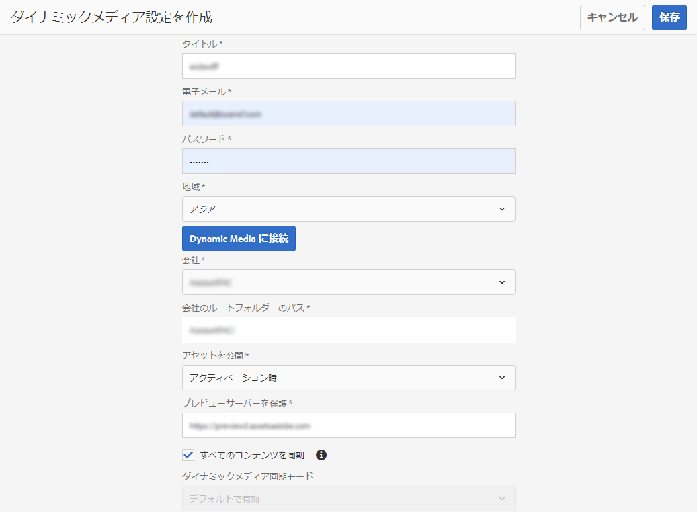

# Dynamic Media の設定 {#configuring-dynamic-media-scene-mode}

開発用、ステージング用、実稼動用など、様々な環境用に設定されたAdobe Experience Managerを使用する場合は、これらの環境のそれぞれに対してDynamic Media Cloud Servicesを設定する必要があります。

## Architecture diagram of Dynamic Media {#architecture-diagram-of-dynamic-media-scene-mode}

次のアーキテクチャ図は、ダイナミックメディアの仕組みを説明しています。

新しいアーキテクチャでは、AEM は、マスターアセットを担当し、アセットの処理および公開のための Dynamic Media と同期します。

1. マスターアセットが AEM にアップロードされると、Dynamic Media にレプリケートされます。その時点で、Dynamic Media は、ビデオエンコーディングおよび画像の動的バリアントなど、すべてのアセットの処理とレンディションの生成を扱います。
1. レンディションが生成されると、AEM は、リモートの Dynamic Media レンディションに安全にアクセスおよびプレビューできます（バイナリは AEM インスタンスに送り返されません）。
1. コンテンツを公開および承認する準備ができると、Dynamic Media サービスがトリガーされ、コンテンツが配信サーバーにプッシュされて、CDN にコンテンツがキャッシュされます。


<!-- OBSOLETE CONTENT

## (Optional) Migrating Dynamic Media presets and configurations from 6.3 to 6.5 Zero Downtime {#optional-migrating-dynamic-media-presets-and-configurations-from-to-zero-downtime}

If you are upgrading AEM Dynamic Media from 6.3 to 6.4 or 6.5 (which now includes the ability for zero downtime deployments), you are required to run the following curl command to migrate all your presets and configurations from `/etc` to `/conf` in CRXDE Lite.

>[!NOTE]
>
>If you run your AEM instance in compatibility mode--that is, you have the compatibility packaged installed--you do not need to run these commands.

For all upgrades, either with or without the compatibility package, you can copy the default, out-of-the-box viewer presets that originally came with Dynamic Media by running the following Linux curl command:

`curl -u admin:admin -X POST https://<server_address>:<server_port>/libs/settings/dam/dm/presets/viewer.pushviewerpresets.json`

To migrate any custom viewer presets and configurations that you have created from `/etc` to `/conf`, run the following Linux curl command:

`curl -u admin:admin -X POST https://<server_address>:<server_port>/libs/settings/dam/dm/presets.migratedmcontent.json`

-->

## Configuring Dynamic Media Cloud Service {#configuring-dynamic-media-cloud-services}

**ダイナミックメディアクラウドサービスを設定する前に**、ダイナミックメディアの資格情報を含むプロビジョニング電子メールを受け取ったら、 [Dynamic Media Classic](https://www.adobe.com/marketing-cloud/experience-manager/scene7-login.html) にログインしてパスワードを変更する必要があります。 プロビジョニング電子メールで提供されたパスワードは、システムが生成したもので、一時的なパスワードです。Dynamic Media クラウドサービスが正しい資格情報で設定されるように、パスワードを更新することが重要です。

Dynamic Media クラウドサービスを設定するには：

1. AEMで、AEMロゴをタップして、グローバルナビゲーションコンソールにアクセスします。
1. コンソールの左側にある「**[!UICONTROL ツール]**」見出しの下で、**[!UICONTROL クラウドサービス／Dynamic Media 設定]**&#x200B;をタップします。
1. Dynamic Media 設定ブラウザーページの左側のパネルで、「**[!UICONTROL グローバル]**」をタップし（「**[!UICONTROL グローバル]**」の左側にあるフォルダーアイコンをタップまたは選択しないでください）、次に、「**[!UICONTROL 作成]**」をタップします。
1. Dynamic Media 設定を作成ページで、タイトル、Dynamic Media アカウントの電子メールアドレス、パスワードを入力し、地域を選択します。これらは、プロビジョニング電子メールでアドビから提供されます。この電子メールを受信していない場合は、サポートにお問い合わせください。
1. 「**[!UICONTROL Dynamic Media に接続]**」をクリックします。

   >[!NOTE]
   >
   >Dynamic Media の資格情報を含むプロビジョニング電子メールを受信したら、Dynamic Media Classic に[ログイン](https://www.adobe.com/marketing-cloud/experience-manager/scene7-login.html)して、パスワードを変更してください。プロビジョニング電子メールで提供されたパスワードは、システムが生成したもので、一時的なパスワードです。Dynamic Media クラウドサービスが正しい資格情報で設定されるように、パスワードを更新することが重要です。

1. 接続が正常に完了したら、次を設定できます。

   * **[!UICONTROL 会社]** - Dynamic Media アカウントの名前です。様々なサブブランド、部門、異なるステージング/実稼働環境に対して、複数のダイナミックメディアアカウントを持つことができます。

   * **[!UICONTROL 会社のルートフォルダーのパス]**

   * **[!UICONTROL 「アセットを公開]** 」 **[!UICONTROL - 「すぐに]** 」オプションは、アセットがアップロードされると、アセットが取り込まれ、URL/埋め込みが即座に提供されることを意味します。 アセットを公開するためにユーザーが操作する必要はありません。The option **[!UICONTROL Upon Activation]** (default) means that you need to explicitly publish the asset first before a URL/Embed link is provided.

   * **[!UICONTROL プレビューサーバーを保護]** - セキュアなレンディションプレビューサーバーへの URL パスを指定できます。つまり、レンディションが生成されると、AEM は、リモートのDynamic Media レンディションに安全にアクセスしてプレビューできます（バイナリは AEM インスタンスに送り返されません）。 自社のサーバーまたは特別なサーバーを使用する特別な取り決めがない 限り、この設定を指定されたとおりにしておくことをお勧めします。

   * **[!UICONTROL すべてのコンテンツを同期]** — デフォルトで選択されています。 ダイナミックメディアとの同期にアセットを選択的に含めるか除外する場合は、このオプションの選択を解除します。 このオプションの選択を解除すると、次の2つのダイナミックメディア同期モードから選択できます。

   * **[!UICONTROL ダイナミックメディア同期モード]**
      * **[!UICONTROL 有効(デフォルト]** ) — フォルダーを特別に除外するようにマークしない限り、設定はすべてのフォルダーにデフォルトで適用されます。 <!-- you can then deselect the folders that you do not want the configuration applied to.-->
      * **[!UICONTROL デフォルトで無効]** — 選択したフォルダーをダイナミックメディアと同期するように明示的にマークするまで、設定はどのフォルダーにも適用されません。
選択したフォルダーを Dynamic Media と同期するようにマークするには、アセットフォルダーの「プロパティ」ページを開きます。Tap the **[!UICONTROL Details]** tab, then from the **[!UICONTROL Dynamic Media sync mode]** drop-down list, choose from the following three options, then save tap **[!UICONTROL Save]**.
         * **[!UICONTROL 継承]** — フォルダーに明示的な同期値がありません。代わりに、フォルダーは、上位フォルダーの1つ、またはクラウド設定のデフォルトモードから同期値を継承します。 継承された番組の詳細なステータスは、ツールヒントを通じて表示されます。
         * **[!UICONTROL サブフォルダーを有効にする]** — ダイナミックメディアと同期するために、このサブツリー内のすべてを含めます。 フォルダー固有の設定は、クラウド設定のデフォルトのモードより優先されます。
         * **[!UICONTROL サブフォルダーに対して無効]** — このサブツリー内のすべての項目をダイナミックメディアとの同期から除外します。
   >[!NOTE]
   >
   >Dynamic Media ではバージョン管理はサポートされていません。また、遅延アクティベーションは、Dynamic Media 設定を編集ページの「**[!UICONTROL アセットを公開]**」が「**[!UICONTROL アクティベーション時]**」に設定されている場合にのみ、アセットが最初にアクティベートされるまでの間に限って適用されます。
   >
   >
   >アセットがアクティベートされるとすぐに、すべての更新が S7 配信にライブ公開されます。

   

1. 「**[!UICONTROL 保存]**」をタップします。
1. Dynamic Media コンテンツを公開する前に安全にプレビューするには、AEM オーサーインスタンスを「ホワイトリストに登録」して、Dynamic Media に接続する必要があります。

   * Log on to your Dynamic Media Classic account: [https://www.adobe.com/marketing-cloud/experience-manager/scene7-login.html](https://www.adobe.com/marketing-cloud/experience-manager/scene7-login.html). 資格情報とログオンは、プロビジョニング時にアドビから付与されたものです。この情報をお持ちでない場合は、テクニカルサポートにお問い合わせください。
   * On the navigation bar near the top right of the page, click **[!UICONTROL Setup > Application Setup > Publish Setup > Image Server]**.

   * On the Image Server Publish page, in the Publish Context drop-down list, select **[!UICONTROL Test Image Serving]**.
   * For the Client Address Filter, tap **[!UICONTROL Add]**.
   * チェックボックスを選択してアドレスを有効（オン）にしてから、AEM オーサーインスタンスの IP アドレス（Dispatcher IP ではない）を入力します。
   * 「**[!UICONTROL 保存]**」をクリックします。

これで基本設定が完了しました。これで、ダイナミックメディアを使用する準備が整いました。

If you want to further customize your configuration, you can optionally complete any of the tasks under [Configuring Advanced Settings in Dynamic Media](#optional-configuring-advanced-settings-in-dynamic-media-scene-mode).

## (Optional) Configuring Advanced Settings in Dynamic Media{#optional-configuring-advanced-settings-in-dynamic-media-scene-mode}

If you want to further customize the configuration and setup of Dynamic Media, or optimize its performance, you can complete one or more of the following *optional* tasks:

* [ダイナミックメディアの設定と設定](#optional-setup-and-configuration-of-dynamic-media-scene-mode-settings)
* [（オプション）ダイナミックメディアのパフォーマンスの調整](#optional-tuning-the-performance-of-dynamic-media-scene-mode)

<!--

* [(Optional) Filtering assets for replication](#optional-filtering-assets-for-replication)

-->

### (Optional) Setup and configuration of Dynamic Media settings {#optional-setup-and-configuration-of-dynamic-media-scene-mode-settings}

ダイナミックメディアクラシック(Scene7)のユーザインターフェイスを使用して、ダイナミックメディアの設定を変更します。

Some of the tasks above require that you log into Dynamic Media Classic (Scene7) here: [https://www.adobe.com/marketing-cloud/experience-manager/scene7-login.html](https://www.adobe.com/marketing-cloud/experience-manager/scene7-login.html)

セットアップおよび設定タスクには、次のものが含まれます。

* [Image Server の公開設定](#publishing-setup-for-image-server)
* [アプリケーション全般設定の指定](#configuring-application-general-settings)
* [カラーマネジメントの設定](#configuring-color-management)
* [アセット処理の設定](#configuring-asset-processing)
* [サポートされていない形式のカスタムMIMEタイプの追加](#adding-custom-mime-types-for-unsupported-formats)
* [画像セットおよびスピンセットを自動生成するためのバッチセットプリセットの作成](#creating-batch-set-presets-to-auto-generate-image-sets-and-spin-sets)

#### Image Server の公開設定 {#publishing-setup-for-image-server}

公開設定は、アセットがデフォルトで Dynamic Media からどのように配信されるかを決定します。設定が指定されていない場合、Dynamic Media は、公開設定で定義されたデフォルト設定に従ってアセットを配信します。例えば、解像度属性が含まれていない画像を配信するように要求した場合、画像は初期設定のオブジェクト解像度設定で配信されます。

公開設定を指定するには、Dynamic Media Classic で、**[!UICONTROL 設定／アプリケーション設定／公開設定／Image Server]** をクリックします。

Image Server 画面では、画像を配信するためのデフォルト設定を指定します。各設定の説明については、UI 画面を参照してください。

* **[!UICONTROL 属性のリクエスト]** — これらの設定は、サーバーから配信できる画像に制限を設けます。
* **[!UICONTROL 初期設定の要求属性]** - これらの設定は、画像のデフォルトの表示に関係します。
* **[!UICONTROL 共通のサムネール属性]** - これらの設定は、サムネール画像のデフォルトの表示に関係します。
* **[!UICONTROL カタログフィールドの初期設定]**— これらの設定は、画像の解像度と初期設定のサムネールの種類に関係します。
* **[!UICONTROL カラーマネジメント属性]** — 使用するICCカラープロファイルは、次の設定によって決まります。
* **[!UICONTROL 互換性属性]** — この設定により、テキストレイヤーの先頭と末尾の段落が、後方互換性を保つためにバージョン3.6の場合と同じように扱われます。
* **[!UICONTROL ローカリゼーションサポート]** — これらの設定を使用して、複数のロケール属性を管理できます。 また、ロケールマップ文字列を指定することもできます。これにより、ビューアのツールチップで使用する言語を指定できます。For more information about setting up **Localization Support]**, see [Considerations when setting up localization of assets](https://help.adobe.com/en_US/scene7/using/WS997f1dc4cb0179f034e07dc31412799d19a-8000.html).

#### アプリケーション全般設定の指定 {#configuring-application-general-settings}

To open the Application General Settings page, in Dynamic Media Classic Global Navigation bar, click **[!UICONTROL Setup > Application Setup > General Settings]**.

* **[!UICONTROL サーバー]** — アカウントのプロビジョニング時に、Dynamic Mediaは自動的に会社に割り当てられたサーバーを提供します。 これらのサーバーは、Web サイトとアプリケーションの URL 文字列を生成するのに使用されます。これらの URL 呼び出しは、アカウントに固有です。AEMサポートから明示的に指示されない限り、サーバー名は変更しないでください。

* **[!UICONTROL 画像を上書き]** — ダイナミックメディアでは、2つのファイルに同じ名前を付けることはできません。 各項目の URL ID（ファイル名から拡張子を取り除いた部分）は一意である必要があります。次のオプションでは、置換アセットのアップロード方法を指定します。オリジナルを置き換えるか、複製するか。 重複するアセット名には「-1」が付けられます（例えば、chair.tif は chair-1.tif に変更されます）。これらのオプションは、元のアセットとは別のフォルダにアップロードされたアセットや、元のアセットとは異なるファイル名拡張子（JPG、TIF、PNGなど）を持つアセットに影響を与えます。

* **[!UICONTROL 現在のフォルダでベース名と拡張子が同じファイルを上書き]** — このオプションは、置き換えの最も厳格なルールです。 置き換え画像を元の画像と同じフォルダーにアップロードし、置き換え画像と元の画像のファイル名拡張子が同じになっている必要があります。これらの要件が満たされない場合は、複製が作成されます。

   >[!NOTE]
   >
   >To maintain consistency with AEM, always choose this setting: **Overwrite in current folder, same base image name/extension**

* **[!UICONTROL 任意のフォルダでベース名と拡張子が同じファイルを上書き]** — 置換画像と元の画像のファイル名拡張子が同じである必要があります（例えば、chair.jpgはchair.jpgを置き換え、chair.tifは置き換えません）。 ただし、置き換え画像を、元の画像と別のフォルダーにアップロードできます。更新された画像は新しいフォルダーにあり、元の場所のファイルはなくなります。
* **[!UICONTROL 任意のフォルダでベース名が同じアセットを上書き(拡張子に関係なく]** ) — このオプションは、最も包括的な置き換えルールです。 置き換え画像を、元の画像と別のフォルダーにアップロードでき、ファイル名拡張子が異なるファイルをアップロードして、元のファイルと置き換えることができます。元のファイルが別のフォルダーにある場合、置き換え画像は、アップロード先の新しいフォルダーに存在します。

* **[!UICONTROL 初期設定のカラープロファイル]** — 詳し [くは、カラーマネジメントの設定](#configuring-color-management) （英語のみ）を参照してください。

>[!NOTE]
>
>デフォルトでは、アセットの詳細表示で「**[!UICONTROL レンディション]**」を選択した場合 15 個のレンディションが表示され、「**[!UICONTROL ビューア]**」を選択した場合 15 個のビューアプリセットが表示されます。この制限は増やすことができます。[表示する画像プリセット数の増減](/help/assets/dynamic-media/managing-image-presets.md#increasing-or-decreasing-the-number-of-image-presets-that-display)または[表示するビューアプリセット数の増減](/help/assets/dynamic-media/managing-viewer-presets.md#increasing-the-number-of-viewer-presets-that-display)を参照してください。


#### カラーマネジメントの設定 {#configuring-color-management}

Dynamic Media カラーマネジメントを使用すると、アセットをカラー補正できます。カラー補正を使用すると、取り込んだアセットのカラースペース（RGB、CMYK、グレー）と埋め込みカラープロファイルが保持されます。 動的レンディションを要求した場合、画像の色は、CMYK、RGB またはグレー出力を使用するターゲットのカラースペースに補正されます。See [Configuring Image Presets](/help/assets/dynamic-media/managing-image-presets.md).

画像を要求する際にカラー補正を有効にするためのデフォルトのカラープロパティを設定するには：

1. プロビジョニング中に提供された資格情報を使用して、[Dynamic Media Classic にログイン](https://www.adobe.com/marketing-cloud/experience-manager/scene7-login.html)します。Navigate to **[!UICONTROL Setup > Application Setup]**.
1. 「**[!UICONTROL 公開設定]**」領域を展開して、「**[!UICONTROL Image Server]**」を選択します。パブリッシュインスタンスのデフォルトを設定する際に、「**[!UICONTROL 公開コンテキスト]**」を「**[!UICONTROL 画像サービング]**」に設定します。
1. Scroll to the property you need to change, for example a property in the **[!UICONTROL Color Management Attributes]** area.

   次のカラー補正プロパティを設定できます。

   * **[!UICONTROL CMYK初期設定カラースペース]** — 初期設定のCMYKカラープロファイルの名前
   * **[!UICONTROL Gray-Scale Default Color Space]** — デフォルトのグレーカラープロファイルの名前
   * **[!UICONTROL RGB Default Color Space]** — 初期設定のRGBカラープロファイルの名前
   * **[!UICONTROL [カラー変換レンダリングインテント]** ]：レンダリングインテントを指定します。 Acceptable values are: **[!UICONTROL perceptual]**, **[!UICONTROL relative colometric]**, **[!UICONTROL saturation]**, **[!UICONTROL absolute colometric]**. Adobe recommends **[!UICONTROL relative]]**as the default.

1. 「**[!UICONTROL 保存]**」をタップします。

例えば、**[!UICONTROL RGB の初期設定カラースペース]**&#x200B;を *sRGB* に、**[!UICONTROL CMYK の初期設定カラースペース]**&#x200B;を *WebCoated* に設定できます。

それには、次のようにします。

* RGB および CMYK 画像のカラー補正を有効にします。
* RGB images that do not have a color profile will be assumed to be in the *sRGB* color space.
* CMYK images that do not have a color profile will be assumed to be in *WebCoated* color space.
* RGB出力を返すダイナミックレンディションは、*sRGB *カラースペースで返します。
* Dynamic renditions that return CMYK output, will return it in the *WebCoated* color space.

#### アセット処理の設定 {#configuring-asset-processing}

Dynamic Media によって処理されるアセットタイプを定義して、高度なアセット処理パラメーターをカスタマイズできます。例えば、次の操作を行うために、アセット処理パラメータを指定できます。

* Adobe PDF を eCatalog アセットに変換する。
* Adobe Photoshop ドキュメント（.PSD）をパーソナライズ用のバナーテンプレートアセットに変換する。
* Adobe Illustrator ファイル（.AI）または Adobe Photoshop Encapsulated Postscript ファイル（.EPS）をラスタライズする。
* 注意：ビデオプロファイルと画像プロファイルは、それぞれビデオと画像の処理を定義するために使用できます。

[アセットのアップロード](/help/assets/add-assets.md)を参照してください。

**アセット処理を設定するには**

1. AEMで、AEMロゴをクリックしてグローバルナビゲーションコンソールにアクセスし、一般/CRXDE **[!UICONTROL Liteをクリックします]**。
1. 左側のレールで、次の場所に移動します。

   `/conf/global/settings/cloudconfigs/dmscene7/jcr:content/mimeTypes`

   

1. mimeTypes フォルダーで、MIME タイプを選択します。
1. CRXDE Lite ページの右側の下部で、次の操作をおこないます。

   * double-click the **[!UICONTROL enabled]** field. デフォルトでは、すべてのアセットの MIME タイプが有効になって（**[!UICONTROL true]** に設定されて）います。これは、処理に関してアセットが Dynamic Media に同期されることを意味します。If you wish to exclude this asset mime type from being processed, change this setting to **[!UICONTROL false]**.

   * **[!UICONTROL jobParam]** をダブルクリックして、関連するテキストフィールドを開きます。特定の MIME タイプに使用可能な、許可されている処理パラメーター値のリストについては、[サポートされる MIME タイプ](/help/assets/file-format-support.md)を参照してください。

1. 次のいずれかの操作をおこないます。

   * 手順 3～4 を繰り返して、その他の MIME タイプを編集します。
   * CRXDE Lite ページのメニューバーで、「**[!UICONTROL すべて保存]**」をクリックします。

1. In the upper-left corner of the page, tap **[!UICONTROL CRXDE Lite]** to return to AEM.

#### サポートされていない形式のカスタムMIMEタイプの追加 {#adding-custom-mime-types-for-unsupported-formats}

AEM Assets でサポートされていない形式のカスタム MIME タイプを追加できます。CRXDE Lite で追加する新しいノードが AEM によって削除されないようにするには、必ず MIME タイプを `image_` の前に移動し、その有効値を **[!UICONTROL false]** に設定する必要があります 。

**サポートされていない形式のカスタムMIMEタイプを追加するには**

1. From AEM, tap **[!UICONTROL Tools > Operations > Web Console]**.

   

1. 新しいブラウザータブが開き、 **[!UICONTROL Adobe Experience Manager Web Console Configurationページが表示されます]** 。

   

1. ページで、「*Adobe CQ Scene7 Asset MIME type Service*」という名前が表示されるまで下にスクロールします。次のスクリーンショットを参照してください。名前の右側にある「**[!UICONTROL 設定値を編集]**」（鉛筆アイコン）をタップします。

   

1. Adobe CQ Scene7 Asset MIME **type Serviceページで** 、任意のプラス記号アイコン&lt;+>をクリックします。 新しいMIMEタイプを追加するプラス記号をクリックしたテーブル内の場所は簡単です。

   

1. 追加し `DWG=image/vnd.dwg` た空のテキストフィールドに入力します。

   この例は説明の目的 `DWG=image/vnd.dwg` でのみ使用します。 ここで追加するMIMEタイプは、その他のサポートされていない形式でもかまいません。

   

1. In the lower-right corner of the page, tap **[!UICONTROL Save]**.

   この時点で、Adobe Experience Manager Web Console Configurationページが開いているブラウザータブを閉じることができます。

1. AEMコンソールを開いているブラウザータブに戻ります。
1. From AEM, tap **[!UICONTROL Tools > General > CRXDE Lite]**.

   

1. 左側のレールで、次の場所に移動します。

   `conf/global/settings/cloudconfigs/dmscene7/jcr:content/mimeTypes`

1. MIMEタイプをドラッグし、 `image_vnd.dwg` 次のスクリーンショッ `image_` トに示すように、ツリーの真上にドロップします。

   

1. MIME タイプ `image_vnd.dwg` を選択したまま、「**[!UICONTROL プロパティ]**」タブから、「**[!UICONTROL 有効]**」行の「**[!UICONTROL 値]**」列見出しで値をダブルクリックして&#x200B;**[!UICONTROL 値]**&#x200B;ドロップダウンリストを開きます。
1. フィー `false` ルドに入力します(ま **[!UICONTROL たはドロップダウン]** ・リストから「false」を選択します)。

   

1. CRXDE Lite ページの左上隅付近にある「**[!UICONTROL すべて保存]**」をクリックします。

#### 画像セットおよびスピンセットを自動生成するためのバッチセットプリセットの作成 {#creating-batch-set-presets-to-auto-generate-image-sets-and-spin-sets}

アセットを Dynamic Media にアップロードしながら画像セットやスピンセットを自動作成するには、バッチセットプリセットを使用します。

最初に、アセットをセットにグループ化するための命名規則を定義します。次に、バッチセットプリセットを作成できます。このプリセットは、プリセット手法で定義された命名規則に一致する画像を使用してセットの構成方法を定義する、固有の名前を持つ自己完結した命令のセットです。

ファイルをアップロードする際に、Dynamic Media によって、アクティブプリセット内の定義された命名規則に一致するすべてのファイルのセットが自動的に作成されます。

**デフォルトの命名規則の設定**

バッチセットプリセット手法で使用するデフォルトの命名規則を作成します。バッチセットプリセット定義で選択されたデフォルトの命名規則は、セットをバッチ生成するための会社の要件になる場合があります。バッチセットプリセットは、定義するデフォルトの命名規則を使用するために作成されます。会社が定義するデフォルトの命名規則に例外がある場合のために、特定のコンテンツのセットに必要な代替のカスタム命名規則を含むバッチセットプリセットを、必要なだけいくつでも作成できます。

デフォルトの命名規則を設定しなくてもバッチセットプリセット機能を使用できますが、バッチセット生成を効率化できるように、デフォルトの命名規則を使用して、セットにグループ化する命名規則の要素を必要なだけ定義することをお勧めします。

または、フォームフィールドを利用しないで、「**[!UICONTROL コードを表示]**」を使用することもできます。この表示では、正規表現を使用する命名規則の定義を作成します。

定義には、一致とベース名という 2 つの要素を使用できます。これらのフィールドでは、命名規則のすべての要素を定義して、要素が含まれるセットを命名するために使用される規則の一部を指定できます。会社の個別の命名規則では、これらの各要素について 1 つまたは複数の定義行を使用できます。独自の定義行を必要なだけ使用して、メイン画像、カラー要素、代替表示要素およびスウォッチ要素などの個別の要素にグループ化できます。

**デフォルトの名前を設定するには**

1. Log on to your Dynamic Media Classic (Scene7) account: [https://www.adobe.com/marketing-cloud/experience-manager/scene7-login.html](https://www.adobe.com/marketing-cloud/experience-manager/scene7-login.html)

   資格情報とログオンは、プロビジョニング時にアドビから付与されたものです。この情報をお持ちでない場合は、テクニカルサポートにお問い合わせください。

1. On the navigation bar near the top of the page, tap **[!UICONTROL Setup > Application Setup > Batch Set Presets > Default Naming]**.
1. 「**[!UICONTROL フォームを表示]**」または「**[!UICONTROL コードを表示]**」を選択し、各要素に関する情報の表示と入力の方法を指定します。

   You can select the **[!UICONTROL View Code]** check box to view the regular expression value building alongside your form selections. フォーム表示により制限を受ける場合、命名規則の要素を定義するために正規表現値を入力または変更できます。値をフォーム表示で解析できない場合は、フォームフィールドは非アクティブになります。

   >[!NOTE]
   >
   >非アクティブなフォームフィールドは、正規表現の正誤に関する検証を実行しません。「結果」行で各要素に作成する正規表現の結果を確認できます。完全な正規表現は、ページの一番下に表示されます。

1. 必要に応じて各要素を展開し、使用する命名規則を入力します。
1. 必要に応じて、次の操作をおこないます。

   * Tap **[!UICONTROL Add]** to add another naming convention for an element.
   * Tap **[!UICONTROL Remove]** to delete a naming convention for an element.

1. 次のいずれかの操作をおこないます。

   * Tap **[!UICONTROL Save As]** and type a name for the preset.
   * Tap **[!UICONTROL Save]** if you are editing an existing preset.

**バッチセットプリセットの作成**

Dynamic Media では、バッチセットプリセットを使用して、アセットをビューアで表示するための画像のセット（代替画像、カラーオプション、360 スピン）に整理します。バッチセットプリセットは、Dynamic Media でのアセットアップロード処理と同時に自動的に実行されます。

バッチセットプリセットを作成、編集および管理できます。バッチセットプリセット定義には、次の2つの形式があります。1つは、設定済みのデフォルトの命名規則、もう1つは、その場で作成するカスタムの命名規則です。

バッチセットプリセットを定義するフォームフィールドメソッドとコードメソッドのどちらかを使用できます（正規表現を使用できます）。デフォルトの名前では、「フォームを表示」での定義と同時に「コードを表示」を選択して、正規表現を使用して定義を作成できます。また、どちらかの表示をオフにして、一方の表示のみを使用することもできます。

**バッチセットプリセットを作成するには**

1. Log on to your Dynamic Media Classic (Scene7) account: [https://www.adobe.com/marketing-cloud/experience-manager/scene7-login.html](https://www.adobe.com/marketing-cloud/experience-manager/scene7-login.html)

   資格情報とログオンは、プロビジョニング時にアドビから付与されたものです。この情報をお持ちでない場合は、テクニカルサポートにお問い合わせください。

1. On the navigation bar near the top of the page, tap **[!UICONTROL Setup > Application Setup > Batch Set Presets > Batch Set Preset]**.

   詳細ページの右上隅に設定されている「**[!UICONTROL フォームを表示]**」は、デフォルトの表示です。

1. In the Preset List panel, tap **[!UICONTROL Add]** to activate the definition fields in the Details panel on the right hand side of the screen.
1. 詳細パネルの「プリセット名」フィールドに、プリセットの名前を入力します。
1. 「バッチセットの種類」ドロップダウンメニューで、プリセットの種類を選択します。
1. 次のいずれかの操作をおこないます。

   * If you are using a default naming convention that you previously set up under **[!UICONTROL Application Setup > Batch Set Presets > Default Naming]**, expand **[!UICONTROL Asset Naming Conventions]**, and then in the File Naming drop-down list, tap **[!UICONTROL Default]**.

   * プリセット設定時に新しい命名規則を定義するには、「**[!UICONTROL アセットの命名規則]**」を展開し、「ファイル名」ドロップダウンリストで「**[!UICONTROL カスタム]**」をクリックします。

1. 「シーケンスの順番」では、Dynamic Media でグループ化されたセットの画像の表示順を定義します。

   デフォルトでは、アセットはアルファベット順に並んでいます。ただし、コンマ区切りの正規表現リストを使用して順番を定義できます。

1. 命名規則と作成オプションの設定では、アセットの命名規則で定義したベース名にサフィックスとプレフィックスを指定します。また、Dynamic Media のフォルダー構造内のセットの作成場所を定義します。

   大量のセットを定義する場合は、アセット自体を含むフォルダーとは別にセットを保存することをお勧めします。例えば、画像セットフォルダーを作成して、そこに生成されたセットを配置できます。

1. In the Details panel, tap **[!UICONTROL Save]**.
1. Tap **[!UICONTROL Active]** next to the new preset name.

   プリセットをアクティブにすると、アセットを Dynamic Media にアップロードする際に、バッチセットプリセットを適用してセットを生成できます。

**2D スピンセットを自動生成するためのバッチセットプリセットの作成**

バッチセットの種類の&#x200B;**[!UICONTROL 多軸スピンセット]**&#x200B;を使用して、2D スピンセットの生成を自動化する手法を作成できます。画像のグループ化では行と列の正規表現を使用するので、画像アセットが多次元の配列の対応する場所に正しく配置されます。多軸スピンセットの行数または列数には、上限または下限はありません。

例として、`spin-2dspin` という名前の多軸スピンセットを作成します。1 行あたり 12 個の画像が含まれる 3 行のスピンセット画像セットがあります。画像の名前は次のとおりです。

```
spin-01-01
 spin-01-02
 …
 spin-01-12
 spin-02-01
 …
 spin-03-12
```

これらの情報から、このバッチセットの種類の手法は次のように指定して作成できます。


スピンセットのアセット名における共通部分のグループは、（ハイライト表示されているように）「**一致**」フィールドに追加しています。行と列を含むアセット名の可変部分は、それぞれ「**行**」フィールドと「**列**」フィールドに追加しています。

このスピンセットをアップロードして公開する際に、**アップロードオプションを設定**&#x200B;ダイアログボックスの&#x200B;**バッチセットプリセット**&#x200B;の下に表示される 2D スピンセット手法の名前をアクティブ化します。

**2Dスピンセットを自動生成するためのバッチセットプリセットを作成するには**

1. Log on to your Dynamic Media Classic (Scene7) account: [https://www.adobe.com/marketing-cloud/experience-manager/scene7-login.html](https://www.adobe.com/marketing-cloud/experience-manager/scene7-login.html)

   資格情報とログオンは、プロビジョニング時にアドビから付与されたものです。この情報をお持ちでない場合は、テクニカルサポートにお問い合わせください。

1. On the navigation bar near the top of the page, click **[!UICONTROL Setup > Application Setup > Batch Set Presets > Batch Set Preset**.

   詳細ページの右上隅に設定されている「**[!UICONTROL フォームを表示]**」は、デフォルトの表示です。

1. プリセットリストパネルの「**[!UICONTROL 追加]**」をクリックして、画面の右側にある詳細パネルの定義フィールドをアクティブにします。
1. 詳細パネルの「プリセット名」フィールドに、プリセットの名前を入力します。
1. 「バッチセットの種類」ドロップダウンメニューで、「**[!UICONTROL アセットセット]**」を選択します。
1. 「サブタイプ」ドロップダウンリストで、「**[!UICONTROL 多軸スピンセット]**」を選択します。
1. 「**[!UICONTROL アセットの命名規則]**」を展開し、「ファイル名」ドロップダウンリストで「**[!UICONTROL カスタム]**」をクリックします。
1. 「**[!UICONTROL 一致]**」およびオプションとして「**[!UICONTROL ベース名]**」の属性を使用して、グループを構成する画像アセットの命名に使用する正規表現を定義します。

   リテラル一致正規表現の例を次に示します。

   `(w+)-w+-w+`

1. 「**[!UICONTROL 行と列の位置]**」を展開し、2D スピンセット配列内の画像アセットの位置の名前形式を定義します。

   ファイル名内での行または列の位置は丸括弧で囲みます。

   行の正規表現の例を次に示します。

   `\w+-R([0-9]+)-\w+`

   「」または「」

   `\w+-(\d+)-\w+`

   列の正規表現の例を次に示します。

   `\w+-\w+-C([0-9]+)`

   「」または「」

   `\w+-\w+-C(\d+)`

   これらは例に過ぎません。必要に応じて独自の正規表現を作成できます。

   >[!NOTE]
   >
   >行と列の正規表現の組み合わせから、多次元スピンセットの配列内でアセットの位置を特定できない場合、そのアセットはセットに追加されず、エラーが記録されます。

1. 命名規則と作成オプションの設定では、アセットの命名規則で定義したベース名にサフィックスとプレフィックスを指定します。

   また、Dynamic Media Classic のフォルダー構造内のスピンセットの作成場所を定義します。

   大量のセットを定義する場合は、アセット自体を含むフォルダーとは別にセットを保存することをお勧めします。例えば、スピンセットフォルダーを作成して、そこに生成されたセットを配置します。

1. 詳細パネルで、「**[!UICONTROL 保存]**」をクリックします。
1. 新しいプリセット名の隣にある「**[!UICONTROL アクティブ]**」をクリックします。

   プリセットをアクティブにすると、アセットを Dynamic Media にアップロードする際に、バッチセットプリセットを適用してセットを生成できます。

### (Optional) Tuning the performance of Dynamic Media {#optional-tuning-the-performance-of-dynamic-media-scene-mode}

To keep Dynamic Media <!--(with `dynamicmedia_scene7` run mode)--> running smoothly, Adobe recommends the following synchronization performance/scalability fine-tuning tips:

* 事前定義済みの Granite のワークフロー（ビデオアセット）キューワーカースレッドを更新する。
* 定義済みのGranite一時ワークフロー（画像および非ビデオアセット）のキューワーカースレッドを更新します。
* Dynamic Media Classicサーバーへの最大アップロード接続数を更新します。

#### Granite の一時的なワークフローキューの更新 {#updating-the-granite-transient-workflow-queue}

The Granite Transit Workflow queue is used for the **[!UICONTROL DAM Update Asset]** workflow. Dynamic Media では、画像の取り込みおよび処理に使用されます。

**Granite Transient Workflowキューを更新するには**

1. Navigate to [https://&lt;server>/system/console/configMgr](https://localhost:4502/system/console/configMgr) and search for **Queue: Granite Transient Workflow Queue**.

   >[!NOTE]
   >
   >OSGi PIDは動的に生成されるので、ダイレクトURLの代わりにテキスト検索が必要です。

1. 「**[!UICONTROL Maximum Parallel Jobs]**」フィールドで、目的の値に数値を変更します。

   デフォルトでは、並列ジョブの最大数は、使用可能な CPU コア数によって異なります。例えば、4 コアサーバーでは、2 ワーカースレッドが割り当てられます。（0.0～1.0 の値は比率に基づき、1 より大きい数はワーカースレッドの数を割り当てます）。

   アドビでは、Dynamic Media Classic（Scene7）への大量のファイルのアップロードを適切にサポートするために、「**[!UICONTROL Maximum Parallel Jobs]**」を 32 に設定することをお勧めします。

   

1. 「**[!UICONTROL 保存]**」をタップします。

#### Granite のワークフローキューの更新 {#updating-the-granite-workflow-queue}

Graniteワークフローキューは、非一過性のワークフローで使用されます。 In Dynamic Media, it used to to process video with the **[!UICONTROL Dynamic Media Encode Video]** workflow.

**Graniteワークフローキューを更新するには**

1. Navigate to `https://<server>/system/console/configMgr` and search for **Queue: Granite Workflow Queue**.

   >[!NOTE]
   >
   >OSGi PIDは動的に生成されるので、ダイレクトURLの代わりにテキスト検索が必要です。

1. 「**[!UICONTROL Maximum Parallel Jobs]**」フィールドで、目的の値に数値を変更します。

   デフォルトでは、並列ジョブの最大数は、使用可能な CPU コア数によって異なります。例えば、4 コアサーバーでは、2 ワーカースレッドが割り当てられます。（0.0～1.0 の値は比率に基づき、1 より大きい数はワーカースレッドの数を割り当てます）。

   ほとんどの事例では、デフォルト設定の 0.5 で十分です。

   

1. 「**[!UICONTROL 保存]**」をタップします。

#### Scene7 アップロード接続の更新 {#updating-the-scene-upload-connection}

「Scene7アップロード接続」設定を使用すると、AEMアセットがDynamic Media Classicサーバに同期されます。

**Scene7のアップロード接続を更新するには**

1. `https://<server>/system/console/configMgr/com.day.cq.dam.scene7.impl.Scene7UploadServiceImpl` に移動します。
1. 「**[!UICONTROL Number of connections]**」フィールドおよび「**[!UICONTROL Active job timeout]**」フィールドで、必要に応じて数値を変更します。

   「**[!UICONTROL Number of connections]**」設定は、AEM が Dynamic Media へのアップロードで許可される HTTP 接続の最大数を制御します。通常、事前定義済みの値の 10 接続で十分です。

   The **[!UICONTROL Active job timeout]** setting determines the wait time for uploaded Dynamic Media assets to be published in delivery server. この値は、デフォルトで2100秒（35分）です。

   ほとんどの事例では、2100 の設定で十分です。

   

1. 「**[!UICONTROL 保存]**」をタップします。

<!-- NOTE - OBSOLETE that customisations to replication agents to transform content are no longer used; the following content is obsolete now 

### (Optional) Filtering assets for replication {#optional-filtering-assets-for-replication}

In non-Dynamic Media deployments, you replicate *all* assets (both images and video) from your AEM author environment to the AEM publish node. This workflow is necessary because the AEM publish servers also deliver the assets.

However, in Dynamic Media deployments, because assets are delivered by way of the cloud service, there is no need to replicate those same assets to AEM publish nodes. Such a "hybrid publishing" workflow avoids extra storage costs and longer processing times to replicate assets. Other content, such as Site pages, continue to be served from the AEM publish nodes.

The filters provide a way for you to *exclude* assets from being replicated to the AEM publish node.

#### Using default asset filters for replication {#using-default-asset-filters-for-replication}

If you are using Dynamic Media for imaging and/or video, then you can use the default filters that we provide as-is. The following filters are active by default:

<table>
 <tbody>
  <tr>
   <td> </td>
   <td><strong>Filter</strong></td>
   <td><strong>Mimetype</strong></td>
   <td><strong>Renditions</strong></td>
  </tr>
  <tr>
   <td>Dynamic Media Image Delivery</td>
   <td><p>filter-images</p> <p>filter-sets</p> <p> </p> </td>
   <td><p>Starts with <strong>image/</strong></p> <p>Contains <strong>application/</strong> and ends with <strong>set</strong>.</p> </td>
   <td>The out-of-the-box "filter-images" (applies to single images assets, including interactive images) and "filter-sets" (applies to Spin Sets, Image Sets, Mixed Media Sets, and Carousel Sets) will:
    <ul>
     <li>Exclude from replication the original image and static image renditions.</li>
    </ul> </td>
  </tr>
  <tr>
   <td>Dynamic Media Video Delivery</td>
   <td>filter-video</td>
   <td>Starts with <strong>video/</strong></td>
   <td>The out-of-the-box "filter-video" will:
    <ul>
     <li>Exclude from replication the original video and static thumbnail renditions.<br /> <br /> </li>
    </ul> </td>
  </tr>
 </tbody>
</table>

>[!NOTE]
>
>Filters apply to mime types and cannot be path specific.

#### Customizing asset filters for replication {#customizing-asset-filters-for-replication}

1. In AEM, tap the AEM logo to access the global navigation console and tap the **[!UICONTROL Tools > General > CRXDE Lite]**.
1. In the left folder tree, navigate to `/etc/replication/agents.author/publish/jcr:content/damRenditionFilters` to review the filters.

   

1. To define the Mime Type for the filter, you can locate the Mime Type as follows:

   In the left rail, expand `content > dam > <locate_your_asset> > jcr:content > metadata`, and then in the table, locate `dc:format`.

   The following graphic is an example of an asset's path to `dc:format`.

   

   Notice that the `dc:format` for the asset `Fiji Red.jpg` is `image/jpeg`.

   To have this filter apply to all images, regardless of their format, set the value to `image/*` where `*` is a regular expression that is applied to all images of any format.

   To have the filter apply only to images of the type JPEG, enter a value of `image/jpeg`.

1. Define what renditions you want to include or exclude from replication.

   Characters that you can use to filter for replication include the following:

<table>
 <tbody>
  <tr>
   <td><strong>Character to use</strong></td>
   <td><strong>How it filters assets for replication</strong></td>
  </tr>
  <tr>
   <td>*</td>
   <td>Wildcard character<br /> </td>
  </tr>
  <tr>
   <td>+</td>
   <td>Includes assets for replication.</td>
  </tr>
  <tr>
   <td>-</td>
   <td>Excludes assets from replication.</td>
  </tr>
 </tbody>
</table>

   Navigate to `content/dam/<locate your asset>/jcr:content/renditions`.

   The following graphic is an example of an asset's renditions.

   

   If you only wanted to replicate the original, then you would enter `+original`.

   -->

