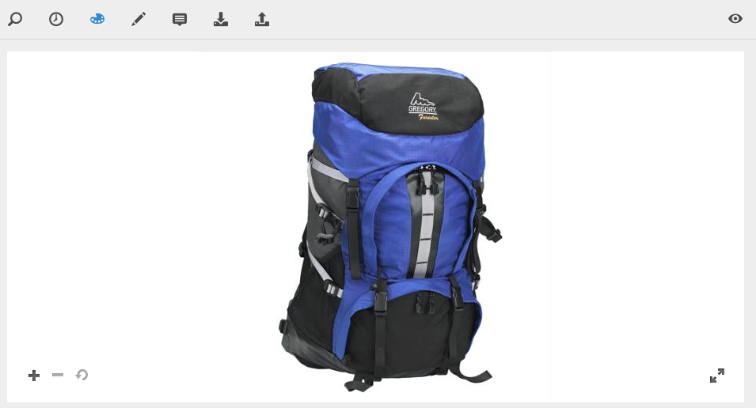

# Dynamic Media の操作 {#working-with-dynamic-media}

[Dynamic Media ](https://www.adobe.com/solutions/web-experience-management/dynamic-media.html)は、マーチャンダイジングおよびマーケティング用のリッチなビジュアルアセットをオンデマンドで配信するもので、これらのアセットは、Web、モバイルおよびソーシャルサイトでの利用に合わせて自動的に拡大縮小されます。Dynamic Mediaは、一連のプライマリソースアセットを使用して、グローバルで拡張性の高いパフォーマンスに最適化されたネットワークを通じて、リッチコンテンツの複数のバリエーションをリアルタイムで生成し、配信します。

Dynamic Media は、ズーム、360 度スピン、ビデオなどのインタラクティブな閲覧エクスペリエンスを提供します。Dynamic Media は Adobe Experience Manager デジタルアセット管理（AEM Assets）ソリューションのワークフローを独自に取り込むことで、デジタルキャンペーン管理プロセスを簡易化し、効率化します。

>[!NOTE]
>
>[Adobe Experience Manager および Dynamic Media の操作](https://helpx.adobe.com/jp/experience-manager/using/aem_dynamic_media.html)にコミュニティの記事があります。

## Dynamic Media の機能 {#what-you-can-do-with-dynamic-media}

Dynamic Media では、公開前のアセットを管理できます。一般的なアセットの操作方法については、[デジタルアセットの操作](/help/assets/manage-digital-assets.md)で詳しく説明しています。一般的なトピックには、アセットのアップロード、ダウンロード、編集および公開、プロパティの表示と編集、アセットの検索が含まれます。

Dynamic Media 限定の機能は次のとおりです。

* [カルーセルバナー](carousel-banners.md)
* [画像セット](image-sets.md)
* [インタラクティブ画像](interactive-images.md)
* [インタラクティブビデオ](interactive-videos.md)
* [混在メディアセット](mixed-media-sets.md)
* [パノラマ画像](panoramic-images.md)

* [スピンセット](spin-sets.md)
* [ビデオ](video.md)
* [Dynamic Media アセットの配信](delivering-dynamic-media-assets.md)
* [アセットの管理](managing-assets.md)
* [クイックビューを使用したカスタムポップアップの作成](custom-pop-ups.md)

[Dynamic Media の設定](administering-dynamic-media.md)も参照してください。

<!-- 

OBSOLETE UNTIL INTEGRATING SCENE7 TOPIC GETS A MAJOR UPDATE
>[!NOTE]
>
>To understand the differences between using Dynamic Media and integrating Dynamic Media Classic with AEM, see [Dynamic Media Classic integration versus Dynamic Media](/help/sites-cloud/administering/integrating-scene7.md#aem-scene-integration-versus-dynamic-media).

-->

## Dynamic Media が有効な場合と無効な場合の比較 {#dynamic-media-on-versus-dynamic-media-off}

Dynamic Media が有効（オン）になっているかどうかは、次の特徴から判断できます。

* アセットのダウンロードやプレビューで動的レンディションを使用できる。
* 画像セット、スピンセット、混在メディアセットを使用できる。
* PTIFF レンディションが作成されている。

Dynamic Media を有効にしている場合、画像アセットをクリックしたときのアセットのビューが異なります。Dynamic Media では、オンデマンドの HTML5 ビューアが使用されます。

### 動的レンディション {#dynamic-renditions}

「**[!UICONTROL 動的]**」の下にある画像プリセットやビューアプリセットなどの動的レンディションは、Dynamic Media が有効な場合に使用できます。

### 画像セット、スピンセット、混在メディアセット {#image-sets-spins-sets-mixed-media-sets}

画像セット、スピンセットおよび混在メディアセットは、Dynamic Media が有効な場合に使用できます。

### PTIFF レンディション {#ptiff-renditions}

Dynamic Media 対応のアセットには `pyramid.tiffs` が含まれています。

### アセットのビューの変化 {#asset-views-change}

Dynamic Media を有効にすると、「`+`」ボタンをクリックしてズームインし、「`-`」ボタンをクリックしてズームアウトすることができます。クリックまたはタップして、特定の領域にズームインすることもできます。元に戻すアイコンをクリックすると元のバージョンに戻ります。また、斜めの矢印をクリックすると、画像を全画面表示にすることができます。Dynamic Media を有効にした場合の画面は次のようになります。

Dynamic Media を無効にした場合は、次のようにズームイン、ズームアウトおよび元のサイズに戻す操作が可能です。

