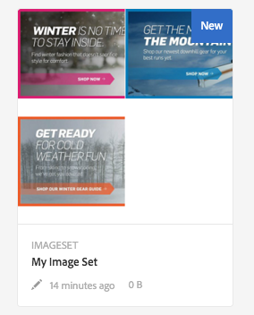

# Dynamic Media の操作 {#working-with-dynamic-media}

[Dynamic Media](https://business.adobe.com/jp/products/experience-manager/assets/dynamic-media.html) は、マーチャンダイジングおよびマーケティング用のリッチなビジュアルアセットをオンデマンドで配信するもので、これらのアセットは、Web、モバイルおよびソーシャルサイトでの利用に合わせて自動的に拡大縮小されます。Dynamic Media は、一連のプライマリソースアセットを使用し、パフォーマンスが最適化されスケーラビリティに優れたグローバルネットワーク経由で、複数のリッチコンテンツのバリエーションをリアルタイムで生成および配信します。

Dynamic Media は、ズーム、360 度スピン、ビデオなどのインタラクティブな閲覧エクスペリエンスを提供します。Dynamic Media は Adobe Experience Manager デジタルアセット管理（AEM Assets）ソリューションのワークフローを独自に取り込むことで、デジタルキャンペーン管理プロセスを簡易化し、効率化します。

<!-- 
>[!NOTE]
>
>A Community article is available on [Working with Adobe Experience Manager and Dynamic Media](https://helpx.adobe.com/experience-manager/using/aem_dynamic_media.html). 
-->

## Dynamic Media とは

Adobe Experience Manager (AEM) as a Cloud Service の Dynamic Media は、あらゆるデジタルプラットフォームにわたって画像やビデオなどのリッチメディアアセットを管理、配信、最適化できるように設計された強力なソリューションです。ユーザーのデバイスや画面サイズに基づいて、サイズ変更、切り抜き、品質の調整などのリアルタイム修正を可能にすることで、静的なメディアを動的で魅力的なエクスペリエンスに変換します。Dynamic Media を使用すると、デスクトップ、モバイル、タブレットのいずれを使用している場合でも、アセットは最高のビジュアルエクスペリエンスを提供するように自動的に適応します。

Dynamic Media の主なメリットは、メディア管理を合理化できることです。複数バージョンの画像やビデオを作成する必要はありません。Dynamic Media は、それぞれの状況に最も適した形式を提供することですべてを処理します。例えば、e コマース企業は 360 度の製品表示やズーム可能な画像を利用してインタラクティブなエクスペリエンスを作成したり、コンテンツ量の多い web サイトでは高速で高品質なビデオストリーミングを実現できます。その結果、読み込み時間が短縮され、より魅力的なユーザーエクスペリエンスが実現し、最終的には顧客満足度とコンバージョン率の向上につながります。

Dynamic Media は、AEM のデジタルアセット管理（DAM）システムとシームレスに統合され、メディアを保存、整理、デプロイする単一のプラットフォームを提供します。この一元化されたアプローチにより、チーム間の共同作業が簡素化し、アセットのパフォーマンスに関するリアルタイムのインサイトを得ることができます。魅力的なビジュアル配信に重点を置く場合でも、メディア主導のユーザーインタラクションを強化する場合でも、Dynamic Media は、あらゆるチャネルでコンテンツを最適化するのに役立ちます。そのため、デジタルプレゼンスの向上を目指す企業にとって不可欠なツールとなります。

## Dynamic Media の機能 {#what-you-can-do-with-dynamic-media}

Dynamic Media を使用すると、アセットを公開する前に管理できます。一般的なアセットの操作方法について詳しくはは、[デジタルアセットの操作](/help/assets/manage-digital-assets.md)を参照してください。一般的なトピックには、アセットのアップロード、ダウンロード、編集、公開と、プロパティの表示、編集、アセットの検索が含まれます。

Dynamic Media 限定の機能は次のとおりです。

* [カルーセルバナー](carousel-banners.md)
* [画像セット](image-sets.md)
* [インタラクティブ画像](interactive-images.md)
* [インタラクティブビデオ](interactive-videos.md)
* [混在メディアセット](mixed-media-sets.md)
* [パノラマ画像](panoramic-images.md)
* [スピンセット](spin-sets.md)
* [ビデオ](video.md)
* [Dynamic Media アセットの配信](delivering-dynamic-media-assets.md)
* [アセットの管理](managing-assets.md)
* [クイックビューを使用したカスタムポップアップウィンドウの作成](custom-pop-ups.md)

[Dynamic Media の設定](administering-dynamic-media.md)も参照してください。

<!-- 

OBSOLETE UNTIL INTEGRATING SCENE7 TOPIC GETS A MAJOR UPDATE
>[!NOTE]
>
>To understand the differences between using Dynamic Media and integrating Dynamic Media Classic with AEM, see [Dynamic Media Classic integration versus Dynamic Media](/help/sites-cloud/administering/integrating-scene7.md#aem-scene-integration-versus-dynamic-media).

-->

## Dynamic Media が有効な場合と無効な場合の比較 {#dynamic-media-on-versus-dynamic-media-off}

Dynamic Media が有効（オン）になっているかどうかは、次の特徴から判断できます。

* アセットのダウンロードやプレビューで動的レンディションを使用できる。
* 画像セット、スピンセット、混在メディアセットを使用できる。
* PTIFF レンディションが作成されている。

Dynamic Media を有効にしている場合、画像アセットをクリックしたときのアセットのビューが異なります。Dynamic Media では、オンデマンドの HTML5 ビューアが使用されます。

### 動的レンディション {#dynamic-renditions}

「**[!UICONTROL 動的]**」の下にある画像プリセットやビューアプリセットなどの動的レンディションは、Dynamic Media が有効な場合に使用できます。

### Dynamic Media の画像セット、スピンセット、混在メディアセット {#image-sets-spins-sets-mixed-media-sets}

画像セット、スピンセットおよび混在メディアセットは、Dynamic Media が有効な場合に使用できます。

### Dynamic Media 対応 PTIFF レンディション {#ptiff-renditions}

Dynamic Media 対応のアセットには `pyramid.tiffs` が含まれます。

### Dynamic Media アセットビューの変更 {#asset-views-change}

Dynamic Media を有効にした場合、`+` および `-` ボタンをクリックして、ズームインおよびズームアウトできます。また、特定のエリアにズームインすることもできます。「元に戻す」を選択すると元のバージョンに戻り、斜めの矢印をクリックして画像を全画面表示にすることができます。Dynamic Media を有効にした場合の画面は次のようになります。

Dynamic Media を無効にした場合は、次のようにズームイン、ズームアウトおよび元のサイズに戻す操作が可能です。

