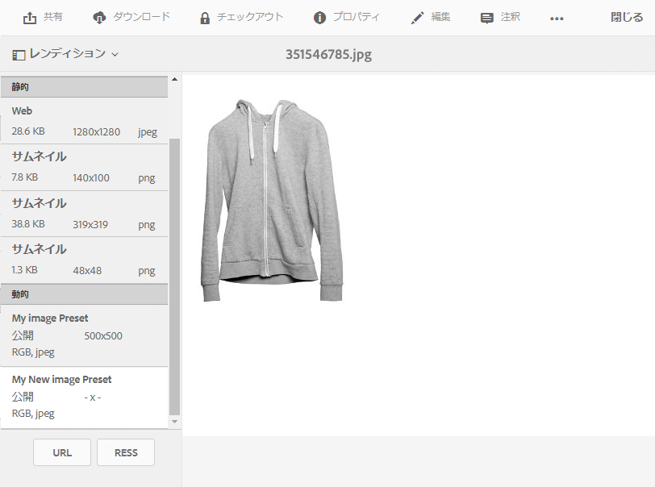

# Dynamic Media 画像プリセットの適用 {#applying-image-presets}

<table>
    <tr>
        <td>
            <i> 新規 </i>Dynamic Media Prime<a href="/help/assets/dynamic-media/dm-prime-ultimate.md"><b>Ultimate</b></a>
        </td>
        <td>
            <i> 新規 </i> <a href="/help/assets/assets-ultimate-overview.md"><b>AEM AssetsUltimate</b></a>
        </td>
        <td>
            <i> 新規 </i> <a href="/help/assets/integrate-aem-assets-edge-delivery-services.md"><b>AEM AssetsとEdge Delivery Servicesの統合 </b></a>
        </td>
        <td>
            <i> 新規 </i><a href="/help/assets/aem-assets-view-ui-extensibility.md"><b>UI 拡張機能 </b></a>
        </td>
          <td>
            <i>Dynamic Media Prime</i>Ultimateの新 <a href="/help/assets/dynamic-media/enable-dynamic-media-prime-and-ultimate.md"><b> 能 </b></a>
        </td>
    </tr>
    <tr>
        <td>
            <a href="/help/assets/search-best-practices.md"><b>検索のベストプラクティス</b></a>
        </td>
        <td>
            <a href="/help/assets/metadata-best-practices.md"><b>メタデータのベストプラクティス</b></a>
        </td>
        <td>
            <a href="/help/assets/product-overview.md"><b>コンテンツハブ</b></a>
        </td>
        <td>
            <a href="/help/assets/dynamic-media-open-apis-overview.md"><b>OpenAPI 機能を備えた Dynamic Media</b></a>
        </td>
        <td>
            <a href="https://developer.adobe.com/experience-cloud/experience-manager-apis/"><b>AEM Assets 開発者向けドキュメント</b></a>
        </td>
    </tr>
</table>

画像プリセットを使用すると、Assets は異なるサイズや異なる形式の画像、あるいは動的に生成された他の画像プロパティを設定した画像を動的に配信できます。書き出し時にプリセットを選択して、管理者が指定した仕様に合わせて画像を再フォーマットすることができます。

さらに、レスポンシブな画像プリセットを選択することもできます（画像プリセットを選択した後に「**[!UICONTROL RESS]**」ボタンを使用して指定します）。

[画像プリセットの作成と設定は管理者が行うことができます](managing-image-presets.md)。

>[!NOTE]
>
>スマートイメージングは、既存の画像プリセットと連携して動作します。配信の最後のミリ秒の情報を使用して、ブラウザーまたはネットワークの接続速度に基づいて、画像ファイルのサイズをさらに小さくします。詳しくは、[スマートイメージング](imaging-faq.md)を参照してください。

作成者は画像をプレビューするときに、いつでも画像プリセットを適用できます。

**Dynamic Media 画像プリセットを適用するには:**

1. アセットを開き、左パネルでドロップダウンリストを選択して、「**[!UICONTROL レンディション]**」を選択します。

   >[!NOTE]
   >
   >* 静的レンディションはウィンドウの上半分に表示されます。動的レンディションは下半分に表示されます。動的レンディションのみの場合は、URL を使用して画像を表示できます。「**[!UICONTROL URL]**」ボタンは、動的レンディションを選択した場合にのみ表示されます。「**[!UICONTROL RESS]**」ボタンは、レスポンシブ画像プリセットを選択した場合にのみ表示されます。
   >
   >* アセットの詳細表示で「**[!UICONTROL レンディション]**」を選択すると、多数のレンディションがシステムによって表示されます。表示されるプリセットの数を増やすことができます。[表示される画像プリセット数の引き上げ](managing-image-presets.md#increasing-or-decreasing-the-number-of-image-presets-that-display)を参照してください。

   

1. 次のいずれかの操作を行います。

   * 画像プリセットをプレビューするには、ダイナミックレンディションを選択します。
   * ポップアップウィンドウを表示するには、「**[!UICONTROL URL]**」、「**[!UICONTROL 埋め込み]**」、または「**[!UICONTROL RESS]**」を選択します。

   >[!NOTE]
   >
   >アセット&#x200B;*と*&#x200B;画像プリセットがまだ公開されていない場合、「**[!UICONTROL URL]**」ボタン（または該当する場合は「URL」ボタンと「RESS」ボタン）は使用できません。
   >
   >また、Dynamic Media S7 サーバーでは画像プリセットが自動的に公開されることにも注意してください。
