# Dynamic Media イメージプロファイル {#image-profiles}

画像をアップロードするときに、フォルダーにイメージプロファイルを適用することで、アップロード時に自動的に画像を切り抜くことができます。

>[!IMPORTANT]
>
>画像プロファイルはPDFファイルには適用されません。

## 切り抜きツールオプション {#crop-options}

<!-- CQDOC-16069 for the paragraph directly below -->

スマート切り抜きの座標は、縦横比に応じて異なります。 つまり、画像プロファイルの各種スマート切り抜き設定で、画像プロファイルに追加されたサイズの縦横比が同じ場合、同じ縦横比がダイナミックメディアに送信されます。 このため、同じ切り抜き領域を使用することをお勧めします。 これにより、画像プロファイルで使用される様々なサイズに影響を与えません。

作成する各スマート切り抜き生成には、追加の処理が必要になることに注意してください。 例えば、スマート切り抜きの縦横比を 6 つ以上追加すると、アセット取り込み速度が遅くなる可能性があります。また、システムの負荷が増大するおそれもあります。スマート切り抜きはフォルダーレベルで適用できるので、必要な場所で&#x200B;*のみ*&#x200B;フォルダーに使用することをお勧めします。

2つの画像切り抜きオプションから選択できます。 また、カラースウォッチと画像スウォッチの作成を自動化するオプションもあります。

<table>
 <tbody>
  <tr>
   <td><strong>オプション</strong></td>
   <td><strong>用途</strong></td>
   <td><strong>説明</strong></td>
  </tr>
  <tr>
   <td>ピクセル切り抜き</td>
   <td>画像サイズにのみ基づいて画像を一括で切り抜きます。</td>
   <td>
このオプションを使用するには、「切り抜きオプション」ドロップダウンリストで「<strong>ピクセル切り抜き</strong>」を選択します。
 
画像の各辺から切り抜くには、画像の任意の辺または四辺からの切り抜きのサイズ（ピクセル数）を入力します。画像がどれだけ切り抜かれるかは、画像ファイル内の ppi（1 インチあたりのピクセル数）の設定によって変わります。
 
イメージプロファイルのピクセル切り抜きは以下の方法で実行されます。  

    <ul>
     <li>値は「上」、「下」、「左」、「右」です。</li>
     <li>左上隅が 0,0 と見なされ、ここからピクセル切り抜きが計算されます。</li>
     <li>切り抜きの開始点：「左」が X、「上」が Y です。</li>
     <li>水平方向の計算：元の画像の水平方向のピクセルサイズから「左」と「右」を差し引きます。</li>
     <li>垂直方向の計算：垂直方向の高さ（ピクセル）から「上」と「下」を差し引きます。</li>
    </ul> 
例えば、4000 x 3000 ピクセルの画像があるとします。次の値を使用します。 [上] = 250、[下] = 500、[左] = 300、[右] = 700
 
左上 (300,250) から、(4000-300-700, 3000-250-500) つまり (3000,2250) のフィルスペースを使って切り抜きます。
 </td>
  </tr>
  <tr>
   <td>スマート切り抜き</td>
   <td>視焦点位置に基づいて画像を一括で切り抜きます。</td>
   <td>
スマート切り抜きでは、Adobe Sensei の人工知能の能力を利用して、自動的に画像を一括ですばやく切り抜きます。画面サイズに関係なく、あらゆる画像の焦点位置を自動的に検出して切り抜き、目的の箇所を抜き出します。
 
スマート切り抜きを使用するには、「切り抜きオプション」ドロップダウンリストで「<strong>スマート切り抜き</strong>」を選択し、「レスポンシブ画像の切り抜き」の右側で、この機能を有効（オン）にします。
 
大、中および小のデフォルトのブレークポイントサイズでは、通常、モバイル、タブレットデバイス、デスクトップおよびバナーで使用されるほとんどの画像のすべてのサイズに対応できます。大、中および小のデフォルト値は、必要に応じて編集できます。
 
ブレークポイントを追加するには、「<strong>切り抜きを追加</strong>」をクリックします。切り抜きを削除するには、ごみ箱アイコンをクリックします。
 </td>
  </tr>
  <tr>
   <td>カラーおよび画像スウォッチ</td>
   <td>各画像の画像スウォッチを一括で生成します。</td>
   <td>
<strong>注意</strong>：Dynamic Media Classic ではスマートスウォッチはサポートされません。
 
商品画像から色やテクスチャを示す高品質のスウォッチを自動的に検出して生成します。
 
カラーおよび画像スウォッチを使用するには、「切り抜きオプション」ドロップダウンリストで「<strong>スマート切り抜き</strong>」を選択し、「カラーおよび画像スウォッチ」の右側で、この機能を有効（オン）にします。「幅」と「高さ」テキストフィールドにピクセル値を入力します。
 
画像の切り抜きはすべてレンディションパネルから使用できますが、スウォッチを使用するには URL のコピー機能を利用しなければなりません。サイトでスウォッチをレンダリングするには、独自の表示コンポーネントを使用する必要があります（カルーセルバナーは例外です。カルーセルバナーで使用されるスウォッチについては、Dynamic Media が表示コンポーネントを提供します）。
 
<strong>画像スウォッチの使用</strong>
 
画像スウォッチの URL は簡単です。次のとおりです。
 
<code>/is/image/company/&lt;asset_name&gt;:Swatch</code>
 
ここでは、<code>:Swatch</code> がアセット要求に追加されています。
 
<strong>カラースウォッチの使用</strong>
 
カラースウォッチを使用するには、次のように <code>req=userdata</code> 要求を作成します。
 
<code>/is/image/&lt;company_name&gt;/&lt;swatch_asset_name&gt;:Swatch?req=userdata</code>
 
例えば、Dynamic Media Classic（Scene7）のスウォッチアセットは次のとおりです。
 
<code>https://my.company.com:8080/is/image/DemoCo/Sleek:Swatch</code>
 
スウォッチアセットの対応する <code>req=userdata</code> URL は次のとおりです。
 
<code>https://my.company.com:8080/is/image/DemoCo/Sleek:Swatch?req=userdata</code>
 
<code>req=userdata</code> 応答は次のとおりです。
 
<code class="code">SmartCropDef=Swatch
       SmartCropHeight=200.0
       SmartCropRect=0.421671,0.389815,0.0848564,0.0592593,200,200
       SmartCropType=Swatch
       SmartCropWidth=200.0
       SmartSwatchColor=0xA56DB2</code>
 
次の URL の例のように、XML 形式または JSON 形式の <code>req=userdata</code> 応答を要求することもできます。
 
<code>https://my.company.com:8080/is/image/DemoCo/Sleek:Swatch?req=userdata,xml</code>

<code>SmartSwatchColor</code>

</td></tr></tbody></table>

## アンシャープマスク {#unsharp-mask}

「**[!UICONTROL アンシャープマスク]**」を使用すると、ダウンサンプリングされた最終的な画像に対するシャープフィルター効果を細かく調整できます。効果の強さ、効果の半径（ピクセル単位）、無視されるコントラストのしきい値を調整できます。この効果では、Adobe Photoshop の「アンシャープマスク」フィルターと同じオプションが使用されます。

>[!NOTE]
>
>アンシャープマスクは、PTIFF（Pyramid TIFF）内のダウンスケールされたレンディション（50％以上ダウンサンプルされたもの）にのみ適用されます。つまり、ptiff内の最大サイズのレンディションは、サムネールなどの小さいサイズのレンディションは変更される（そしてアンシャープマスクが表示される）のに対し、アンシャープマスクの影響を受けません。

「**[!UICONTROL アンシャープマスク]**」には次のフィルタリングオプションがあります。

<table>
 <tbody>
  <tr>
   <td><strong>オプション</strong></td>
   <td><strong>説明</strong></td>
  </tr>
  <tr>
   <td>量</td>
   <td>端のピクセルに適用するコントラストを制御します。デフォルトは 1.75 です。高解像度の画像ではこの値を 5 まで増やすことができます。「量」は、フィルター強度の尺度だと考えてください。範囲は 0～5 です。</td>
  </tr>
  <tr>
   <td>半径</td>
   <td>シャープに作用する端のピクセル周辺のピクセル数を決定します。高解像度の画像の場合は、1～2 を入力します。小さい値は端のピクセルのみをシャープにし、大きい値は広範囲のピクセルをシャープにします。適切な値は画像のサイズによって異なります。デフォルト値は 0.2 です。範囲は 0～250 です。</td>
  </tr>
  <tr>
   <td>しきい値</td>
   <td>
アンシャープマスクフィルターが適用される場合のコントラストの範囲を指定します。つまり、このオプションは、シャープにされるピクセルが周囲の領域とどの程度違えば、そのピクセルをエッジのピクセルと見なしてシャープにするかを決定するものです。ノイズが入らないように、0～255 の範囲で様々な整数値を試してください。
 </td>
  </tr>
 </tbody>
</table>

シャープニングについては、[画像のシャープニング](/help/assets/dynamic-media/assets/s7_sharpening_images.pdf)を参照してください。

## Dynamic Media イメージプロファイルの作成 {#creating-image-profiles}

他のアセットタイプへの高度な処理パラメーターの定義については、[アセット処理の設定](config-dm.md#configuring-asset-processing)を参照してください。

[メタデータ、画像およびビデオを処理するためのプロファイル](/help/assets/dynamic-media/processing-profiles.md)を参照してください。

[処理プロファイルを使用するためのデジタルアセットの編成のベストプラクティス](/help/assets/dynamic-media/best-practices-for-file-management.md)を参照してください。

**Dynamic Media イメージプロファイルを作成するには**：

1. AEM のロゴをタップし、**[!UICONTROL ツール／アセット／イメージプロファイル]**&#x200B;に移動します。
1. 「**[!UICONTROL 作成]**」をタップクリックして、新しいイメージプロファイルを追加します。
1. プロファイル名を入力し、アンシャープマスクのほか、切り抜きとスウォッチのいずれかまたは両方の値を入力します。

   目的を具体的に表すプロファイル名を使用すると便利です。例えば、スウォッチのみを生成するプロファイルを作成する（つまり、スマート切り抜きが無効（オフ）になっていて、カラーと画像スウォッチが有効（オン）になっている）場合、「スマートスウォッチ」というプロファイル名を使用できます。

   [スマート切り抜きとスマートスウォッチオプション](#crop-options)および[アンシャープマスク](#unsharp-mask)も参照してください。

   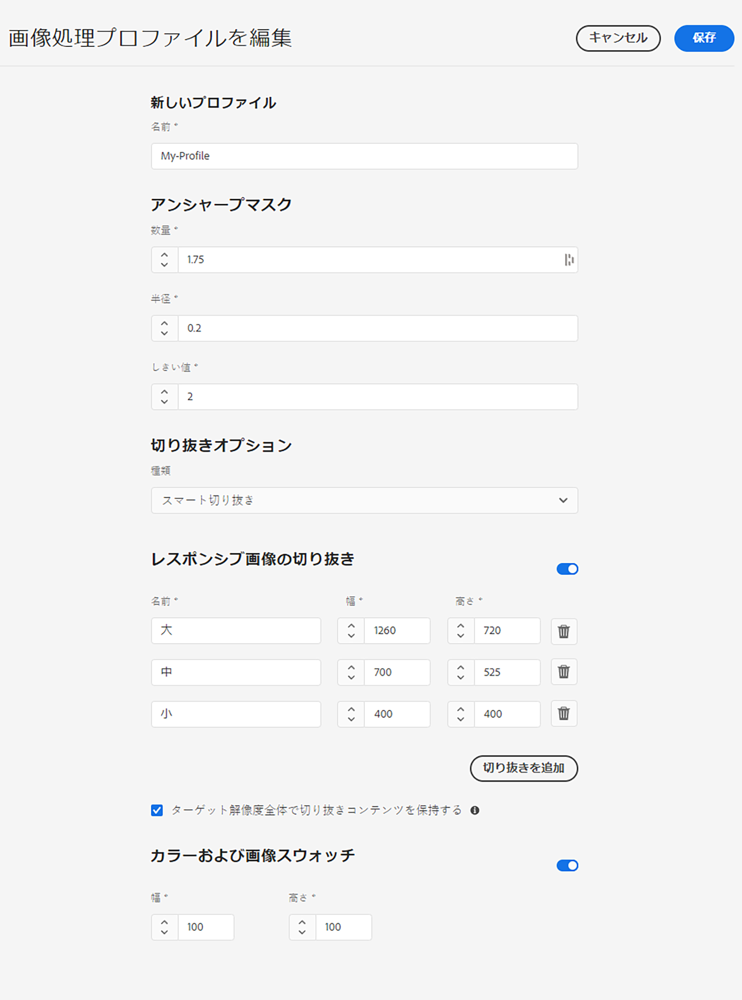

1. 「**[!UICONTROL 保存]**」をタップします。新しく作成されたプロファイルが、使用可能なプロファイルのリストに表示されます。

## Dynamic Media イメージプロファイルの編集または削除 {#editing-or-deleting-image-profiles}

1. AEM のロゴをタップし、**[!UICONTROL ツール／アセット／イメージプロファイル]**&#x200B;に移動します。
1. 編集または削除するイメージプロファイルを選択します。編集するには、「**[!UICONTROL 画像処理プロファイルを編集]**」を選択します。削除するには、「**[!UICONTROL 画像処理プロファイルを削除]**」を選択します。

   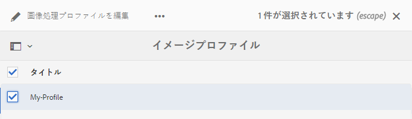

1. 編集の場合は、変更内容を保存します。削除の場合は、プロファイルの削除を確定します。

## Dynamic Media イメージプロファイルのフォルダーへの適用 {#applying-an-image-profile-to-folders}

フォルダーにイメージプロファイルを割り当てると、サブフォルダーは自動的に親フォルダーのプロファイルを継承します。つまり、フォルダーに 1 つのイメージプロファイルのみを適用すればよいことになります。そのため、アセットをアップロード、保存、使用およびアーカイブする場所のフォルダー構造については入念に検討してください。

フォルダーに異なるイメージプロファイルを割り当てた場合、新しいプロファイルが以前のプロファイルよりも優先されます。以前に存在していたフォルダーのアセットは変更されずに維持されます。新しいプロファイルは、その後にフォルダーに追加されるアセットに対して適用されます。

プロファイルが割り当てられているフォルダーには、ユーザーインターフェイス上でカード内に表示されたときに、そのプロファイルの名前が示されます。

<!-- When you add smart crop to an existing image profile, you need to re-trigger the [DAM Update Asset workflow](assets-workflow.md) if you want to generate crops for existing assets in your asset repository. -->

イメージプロファイルは、特定のフォルダーに適用することも、全アセットにグローバルに適用することもできます。

後で変更した既存のイメージプロファイルが存在するフォルダー内のアセットを再処理できます。[処理プロファイルを編集した後のフォルダー内のアセットの再処理](/help/assets/dynamic-media/processing-profiles.md#reprocessing-assets)を参照してください。

### 特定フォルダーへの Dynamic Media イメージプロファイルの適用 {#applying-image-profiles-to-specific-folders}

**[!UICONTROL ツール]**&#x200B;メニュー内から、またはフォルダー内にいる場合は「**[!UICONTROL プロパティ]**」から、特定のフォルダーにイメージプロファイルを適用できます。この節では、イメージプロファイルをフォルダーに適用するための方法を両方とも説明します。

既にプロファイルが割り当てられているフォルダーには、フォルダー名のすぐ下にプロファイルの名前が表示されます。

後で変更した既存のビデオプロファイルが存在するフォルダー内のアセットを再処理できます。[処理プロファイルを編集した後のフォルダー内のアセットの再処理](/help/assets/dynamic-media/processing-profiles.md#reprocessing-assets)を参照してください。

#### プロファイルユーザーインターフェイスを使用したフォルダーへの Dynamic Media イメージプロファイルの適用 {#applying-image-profiles-to-folders-from-profiles-user-interface}

1. AEM のロゴをタップし、**[!UICONTROL ツール／アセット／イメージプロファイル]**&#x200B;に移動します。
1. 1 つ以上のフォルダーに適用するイメージプロファイルを選択します。

   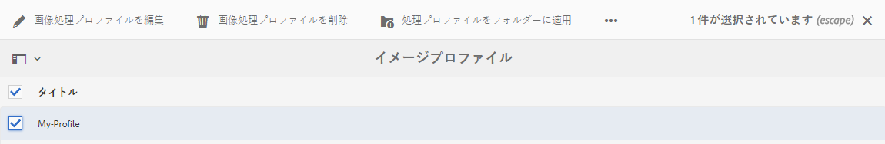

1. 「**[!UICONTROL 処理プロファイルをフォルダーに適用]**」をタップし、新規にアップロードするアセットを置くために使用するフォルダーを 1 つ以上選択し、「**[!UICONTROL 適用]**」をタップまたはクリックします。既にプロファイルが割り当てられているフォルダーには、フォルダー名のすぐ下にプロファイルの名前が表示されます。

#### プロパティを使用したフォルダーへの Dynamic Media イメージプロファイルの適用 {#applying-image-profiles-to-folders-from-properties}

1. AEM のロゴをタップし、「**[!UICONTROL アセット]**」に移動した後、イメージプロファイルを適用するフォルダーに移動します。
1. チェックマークをタップして対象のフォルダーを選択し、「**[!UICONTROL プロパティ]**」をタップします。
1. 「**[!UICONTROL イメージプロファイル]**」タブをタップします。「**[!UICONTROL プロファイル名]**」ドロップダウンリストからプロファイルを選択し、「**[!UICONTROL 保存して閉じる]**」をタップします。既にプロファイルが割り当てられているフォルダーには、フォルダー名のすぐ下にプロファイルの名前が表示されます。

   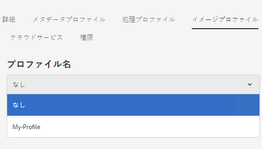

### Dynamic Media イメージプロファイルのフォルダーへのグローバルな適用 {#applying-an-image-profile-globally}

特定のフォルダーにプロファイルを適用できるだけでなく、グローバルにプロファイルを適用することもできます。これにより、AEM アセットにアップロードされている、すべてのフォルダー内にあるすべてのコンテンツに、選択したプロファイルを適用できます。

後で変更した既存のビデオプロファイルが存在するフォルダー内のアセットを再処理できます。[処理プロファイルを編集した後のフォルダー内のアセットの再処理](/help/assets/dynamic-media/processing-profiles.md#reprocessing-assets)を参照してください。

**Dynamic Media イメージプロファイルをグローバルに適用するには**：

1. 次のいずれかの操作をおこないます。

   * `https://&lt;AEM server&gt;/mnt/overlay/dam/gui/content/assets/foldersharewizard.html/content/dam` に移動して適切なプロファイル適用し、「**[!UICONTROL 保存]**」をタップします。

      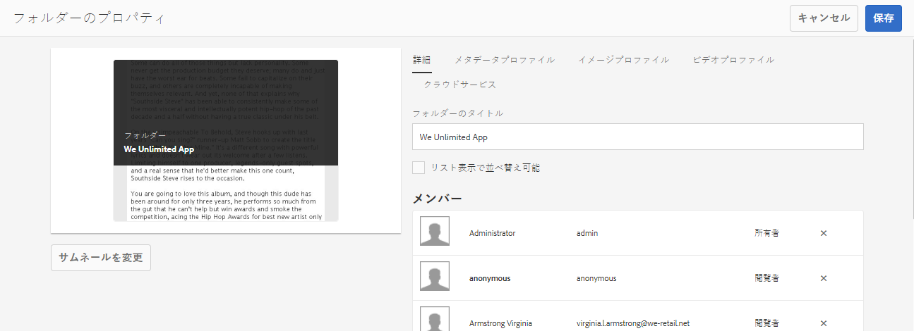

   * CRXDE Lite で、`/content/dam/jcr:content` ノードに移動します。

      プロパティ `imageProfile:/conf/global/settings/dam/adminui-extension/imageprofile/<name of image profile>` を追加し、「**[!UICONTROL すべて保存]**」をタップします。

      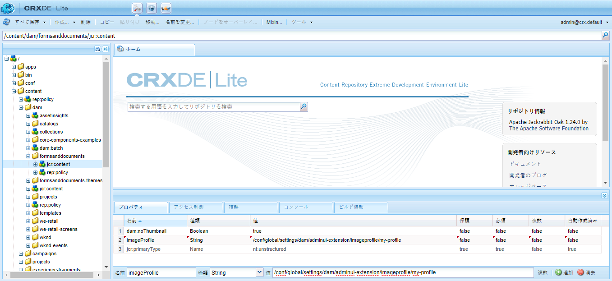

## 単一の画像のスマート切り抜きまたはスマートスウォッチの編集 {#editing-the-smart-crop-or-smart-swatch-of-a-single-image}

画像のスマート切り抜きウィンドウの位置の再調整またはサイズの変更を手動でおこなって、焦点位置を細かく調整することができます。

スマート切り抜きを編集して保存すると、その画像の切り抜きを使用しているすべての場所で変更が反映されます。

必要に応じてスマート切り抜きを再実行して、追加の切り抜きを再度生成することができます。

[複数の画像のスマート切り抜きまたはスマートスウォッチの編集](#editing-the-smart-crop-or-smart-swatch-of-multiple-images)も参照してください。

**単一画像のスマート切り抜きまたはスマートスウォッチを編集するには**：

1. AEM ロゴをタップし、**[!UICONTROL アセット]**&#x200B;に移動した後、スマート切り抜きまたはスマートスウォッチのイメージプロファイルが適用されているフォルダーに移動します。

1. フォルダーをタップして、その内容を開きます。
1. スマート切り抜きまたはスマートスウォッチを調整したい画像をタップます。
1. In the toolbar, tap **[!UICONTROL Smart Crop]**.

1. 次のいずれかの操作をおこないます。

   * ページの右上隅にあるスライダーバーを左右にドラッグして画像表示を拡大または縮小します。
   * 画像のコーナーハンドルをドラッグして、切り抜きまたはスウォッチの表示可能領域のサイズを調整します。
   * 画像上のボックスまたはスウォッチを新しい場所にドラッグします。画像スウォッチは編集できますが、カラースウォッチは静的です。
   * 画像の上部にある「**[!UICONTROL 元に戻す]**」をタップして、すべての編集作業を取り消し、元の切り抜きまたはスウォッチを復元します。

1. ページの右上にある「**[!UICONTROL 保存]**」をタップし、「**[!UICONTROL 閉じる]**」をタップして、アセットのフォルダーに戻ります。

## 複数の画像のスマート切り抜きまたはスマートスウォッチの編集 {#editing-the-smart-crop-or-smart-swatch-of-multiple-images}

スマート切り抜きを含んだイメージプロファイルをフォルダーに適用すると、そのフォルダー内のすべての画像に切り抜きが適用されます。必要に応じて、複数の画像のスマート切り抜きウィンドウの位置の再調整またはサイズの変更を&#x200B;*手動*&#x200B;でおこなって、その焦点位置を細かく調整することができます。

スマート切り抜きを編集して保存すると、その画像の切り抜きを使用しているすべての場所で変更が反映されます。

必要に応じてスマート切り抜きを再実行して、追加の切り抜きを再度生成することができます。

**複数画像のスマート切り抜きまたはスマートスウォッチを編集するには**：

1. AEM ロゴをタップし、**[!UICONTROL アセット]**&#x200B;に移動した後、スマート切り抜きまたはスマートスウォッチのイメージプロファイルが適用されているフォルダーに移動します。
1. フォルダーで、**[!UICONTROL その他のアクション]**（...）アイコンをタップし、「**[!UICONTROL スマート切り抜き]**」をタップします。

1. **[!UICONTROL スマート切り抜きを編集]**&#x200B;ページで、次のいずれかの操作をおこないます。

   * 画像の表示サイズを調整します。

       ブレークポイント名のドロップダウンリストの右側にあるスライダーバーを左右にドラッグして表示可能な画像表示のサイズを変更します。

      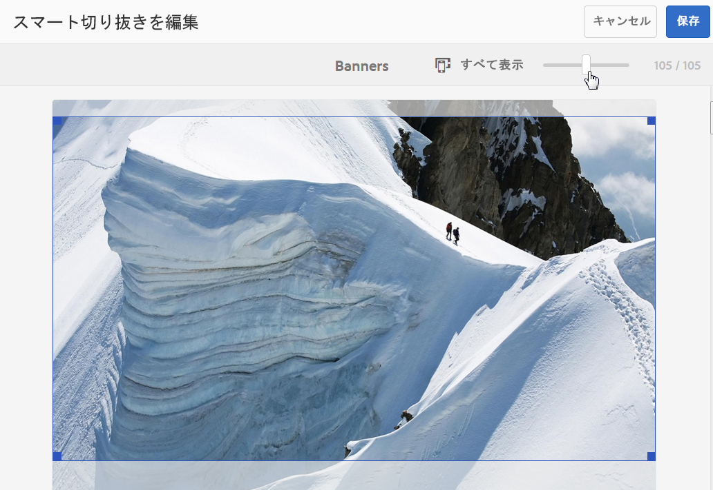

   * ブレークポイント名に基づいて表示可能な画像のリストを絞り込みます。以下の例では、「中」というブレークポイント名で画像を絞り込んでいます。

       ページの右上隅にあるドロップダウンリストから、ブレークポイント名を選択して、表示する画像を絞り込みます（上記の画像を参照してください）。

      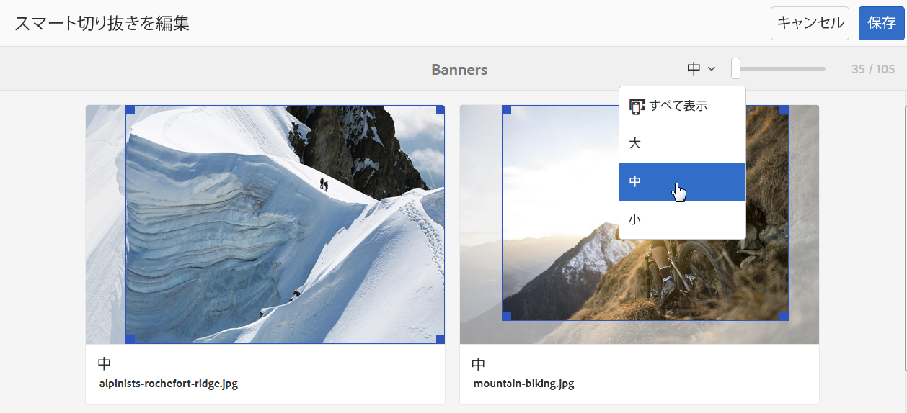

   * スマート切り抜きボックスのサイズを変更します。次のいずれかの操作をおこないます。

      * 画像にスマート切り抜きまたはスマートスウォッチのみが適用されている場合は、画像の切り抜きボックスのコーナーハンドルをドラッグして、切り抜きの表示可能領域のサイズを調整します。
      * 画像にスマート切り抜きとスマートスウォッチの両方が適用されている場合は、画像の切り抜きボックスのコーナーハンドルをドラッグして、切り抜きの表示可能領域のサイズを調整します。または、画像の下部にあるスマートスウォッチをタップまたはクリックしてから（カラースウォッチは静的です）、切り抜きボックスのコーナーハンドルをドラッグして、スウォッチの表示可能領域のサイズを調整します。

      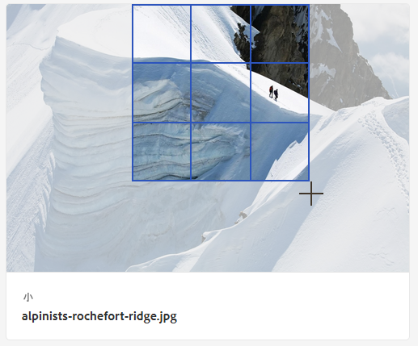

   * スマート切り抜きボックスを移動します。次のいずれかの操作をおこないます。

      * 画像にスマート切り抜きまたはスマートスウォッチのみが適用されている場合は、画像の切り抜きボックスを新しい場所にドラッグします。
      * 画像にスマート切り抜きとスマートスウォッチの両方が適用されている場合は、画像の切り抜きボックスを新しい場所にドラッグします。または、画像の下部にあるスマートスウォッチをタップまたはクリックしてから（カラースウォッチは静的です）、スマートスウォッチの切り抜きボックスを新しい場所にドラッグします。

      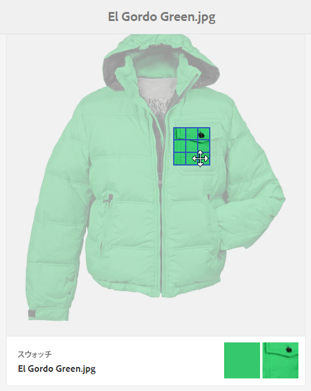

   * すべての編集作業を取り消し、元のスマート切り抜きまたはスマートスウォッチを復元します（現在の編集セッションにのみ適用されます）。

      画像の上にある「**[!UICONTROL 元に戻す]**」をタップします。

      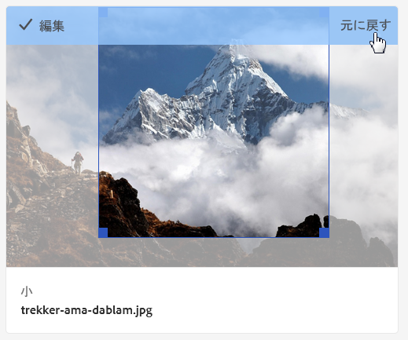

1. ページの右上隅にある「**[!UICONTROL 保存]**」をタップします。「**[!UICONTROL 閉じる]**」をタップして、アセットのフォルダーに戻ります。

## フォルダーからのイメージプロファイルの削除 {#removing-an-image-profile-from-folders}

フォルダーからイメージプロファイルを削除すると、サブフォルダーは自動的に親フォルダーのプロファイルの削除状態を継承します。ただし、フォルダー内で実行されたファイルの処理はそのまま維持されます。

**[!UICONTROL ツール]**&#x200B;メニュー内から、またはフォルダー内にいる場合は「**[!UICONTROL プロパティ]**」で、特定のフォルダーからイメージプロファイルを削除できます。この節では、イメージプロファイルをフォルダーから削除するための方法を両方とも説明します。

### プロファイルユーザーインターフェイスを使用したフォルダーからの Dynamic Media イメージプロファイルの削除 {#removing-image-profiles-from-folders-via-profiles-user-interface}

1. AEM のロゴをタップし、**[!UICONTROL ツール／アセット／イメージプロファイル]**&#x200B;に移動します。
1. 1 つ以上のフォルダーから削除するイメージプロファイルを選択します。
1. 「**[!UICONTROL フォルダーから処理プロファイルを削除]**」をタップし、プロファイルを削除するフォルダーを 1 つ以上選択して、「**[!UICONTROL 削除]**」をタップします。

   名前がフォルダー名の下に表示されなくなっていることで、イメージプロファイルがフォルダーに適用されていないことを確認できます。

### プロパティを使用したフォルダーからの Dynamic Media イメージプロファイルの削除 {#removing-image-profiles-from-folders-via-properties}

1. AEM のロゴをタップして「**[!UICONTROL アセット]**」に移動した後、イメージプロファイルを削除するフォルダーに移動します。
1. チェックマークをタップして対象のフォルダーを選択し、「**[!UICONTROL プロパティ]**」をタップします。
1. 「**[!UICONTROL イメージプロファイル]**」タブを選択します。
1. From the **[!UICONTROL Profile Name]** drop-down list, select **[!UICONTROL None]**, then tap **[!UICONTROL Save &amp; Close]**.

   既にプロファイルが割り当てられているフォルダーには、フォルダー名のすぐ下にプロファイルの名前が表示されます。
