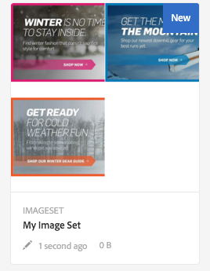

# 画像セット {#image-sets}

<table>
    <tr>
        <td>
            <i> 新規 </i>Dynamic Media Prime<a href="/help/assets/dynamic-media/dm-prime-ultimate.md"><b>Ultimate</b></a>
        </td>
        <td>
            <i> 新規 </i> <a href="/help/assets/assets-ultimate-overview.md"><b>AEM AssetsUltimate</b></a>
        </td>
        <td>
            <i> 新規 </i> <a href="/help/assets/integrate-aem-assets-edge-delivery-services.md"><b>AEM AssetsとEdge Delivery Servicesの統合 </b></a>
        </td>
        <td>
            <i> 新規 </i><a href="/help/assets/aem-assets-view-ui-extensibility.md"><b>UI 拡張機能 </b></a>
        </td>
          <td>
            <i>Dynamic Media Prime</i>Ultimateの新 <a href="/help/assets/dynamic-media/enable-dynamic-media-prime-and-ultimate.md"><b> 能 </b></a>
        </td>
    </tr>
    <tr>
        <td>
            <a href="/help/assets/search-best-practices.md"><b>検索のベストプラクティス</b></a>
        </td>
        <td>
            <a href="/help/assets/metadata-best-practices.md"><b>メタデータのベストプラクティス</b></a>
        </td>
        <td>
            <a href="/help/assets/product-overview.md"><b>コンテンツハブ</b></a>
        </td>
        <td>
            <a href="/help/assets/dynamic-media-open-apis-overview.md"><b>OpenAPI 機能を備えた Dynamic Media</b></a>
        </td>
        <td>
            <a href="https://developer.adobe.com/experience-cloud/experience-manager-apis/"><b>AEM Assets 開発者向けドキュメント</b></a>
        </td>
    </tr>
</table>

画像セットは、ユーザーに対して、統合された閲覧エクスペリエンスを提供します。ユーザーはサムネール画像をクリックすることで、アイテムの様々なビューを表示できます。画像セットによって、アイテムの代替的なビューを表示でき、ビューアでは画像をより近くで確認するためのズームツールを利用できます。

画像セットのバナーには、「`IMAGESET`」と表示されます。また、画像セットが公開される場合は、公開日（**[!UICONTROL ワールド]**&#x200B;アイコンで示される）がバナーに表示されます。また、最終変更日（**[!UICONTROL 鉛筆]**&#x200B;アイコン）表示されます。

画像セット内では、画像セットを作成してサムネールを追加することで、スウォッチを作成することもできます。

この使い方は、アイテムを異なる色、パターンまたは仕上がりで表示する場合に便利です。カラースウォッチを含む画像セットを作成するには、ユーザーに表示する色、パターンまたは仕上がりごとに画像を 1 つずつ用意する必要があります。また、カラー、パターン、仕上がりごとに 1 つのカラー、パターン、または仕上がりスウォッチが必要になります。

例えば、つばのカラーが赤、緑、青のキャップの画像を表示するとしましょう。この場合、同じキャップの 3 つのショットが必要です（それぞれのつばのカラーが、赤、緑、青）。また、赤、緑、青のカラースウォッチも必要です。カラースウォッチは、ユーザーがスウォッチセットビューアでクリックして、赤いつば、緑のつば、または青のつばのキャップを表示するためのサムネールとして機能します。

>[!NOTE]
>
>Assets ユーザーインターフェイスについては、[タッチ UI を使用したアセットの管理](/help/assets/manage-digital-assets.md)を参照してください。

画像セットを作成する際、アドビでは次のベストプラクティスを推奨し、次の制限を適用します。

| 制限タイプ | ベストプラクティス | 適用される制限 |
| --- | --- | --- |
| 1 セットあたりの重複アセット数 | 重複なし | 20 |
| 1 セットあたりの最大画像数 | 1 セットあたり 5～10 個の画像 | 1000 |

[Dynamic Media の制限](/help/assets/dynamic-media/limitations.md)も参照してください。

## クイックスタート：画像セット {#quick-start-image-sets}

すぐに使い始めるには：

1. （オプション）[バッチセットプリセットを作成](/help/assets/dynamic-media/batch-set-presets-dm.md)して、スピンセット画像のアップロード先となる新規フォルダーに適用します。

   バッチセットプリセットは、画像セットの作成を自動化するのに役立ちます。

   >[!IMPORTANT]
   >
   >バッチセットは、アセットの取り込みの一環として IPS（Image Production System）で作成されます。

1. [複数ビュー用のプライマリソース画像をアップロードします](#uploading-assets-in-image-sets)。

   画像セット用の画像をアップロードします。ユーザーは画像セットビューアで画像をズームできます。そのため、画像は慎重に選択してください。最大サイズで 2,000 ピクセル以上の画像を使用してください。

   画像セットでサポートされる形式のリストについては、 [Dynamic Media - サポートされるラスター画像形式](/help/assets/file-format-support.md#image-support-dynamic-media) を参照してください。

1. [画像セットを作成します](#creating-image-sets)。

   画像セットで、画像セットビューア内のサムネール画像をクリックします。

   Assets で画像セットを作成するには、 **[!UICONTROL 作成]**／**[!UICONTROL 画像セット]** を選択します。次に、画像を追加して「**[!UICONTROL 保存]**」をクリックします。

   詳しくは、[アップロード用の画像セットアセットの準備およびファイルのアップロード](#uploading-assets-in-image-sets)を参照してください。

   [セレクターの操作](/help/assets/dynamic-media/working-with-selectors.md)を参照してください。

1. 必要に応じて[画像セットビューアプリセット](/help/assets/dynamic-media/managing-viewer-presets.md)を追加します。

   管理者は、画像セットビューアプリセットを作成または編集できます。画像セットを特定のビューアプリセットで表示するには、画像セットを選択し、左側のレールのドロップダウンリストで「**[!UICONTROL ビューア]**」を選択します。

   ビューアプリセットを作成または編集するには、 **[!UICONTROL ツール]**／**[!UICONTROL アセット]**／**[!UICONTROL ビューアプリセット]** を選択します。

1. （オプション）バッチセットプリセットを使用して作成した[画像セットの表示](/help/assets/dynamic-media/image-sets.md#viewing-image-sets)
1. [画像セットをプレビューします](/help/assets/dynamic-media/previewing-assets.md)。

   画像セットを選択すると、プレビューできます。選択したビューアで画像セットを確認するには、サムネールアイコンを選択します。**[!UICONTROL ビューア]**&#x200B;メニューから様々なビューアを選択できます。このメニューは左パネルのドロップダウンメニューにあります。

1. [画像セットを公開します](/help/assets/dynamic-media/publishing-dynamicmedia-assets.md)。

   画像セットを公開すると、URL と埋め込み文字列がアクティベートされます。さらに、作成した[カスタムビューアプリセットを公開する](/help/assets/dynamic-media/managing-viewer-presets.md)必要があります。既製のビューアプリセットが既に公開されています。

1. [URL を Web アプリケーションにリンクする](/help/assets/dynamic-media/linking-urls-to-yourwebapplication.md)か、[ビデオビューアまたは画像ビューアを埋め込みます](/help/assets/dynamic-media/embed-code.md)。

   画像セットの URL 呼び出しが作成され、画像セットの公開後にそれらの URL 呼び出しがアクティベートされます。アセットをプレビューする際に、これらの URL をコピーできます。または、URL を Web サイトに埋め込むこともできます。

   画像セットを選択し、左パネルのドロップダウンリストで「**[!UICONTROL ビューア]**」を選択します。

   詳しくは、[Web ページへの画像セットのリンク](/help/assets/dynamic-media/linking-urls-to-yourwebapplication.md)および[ビデオビューアまたは画像ビューアの埋め込み](/help/assets/dynamic-media/embed-code.md)を参照してください。

画像セットを編集するには、[画像セットの編集](#editing-image-sets)を参照してください。を参照してください。また、[画像セットのプロパティ](/help/assets/manage-digital-assets.md#editing-properties)を表示および編集することができます。

セットの作成で問題が発生した場合は、[Dynamic Media のトラブルシューティング](/help/assets/dynamic-media/troubleshoot-dm.md#images-and-sets)の「画像とセット」を参照してください。

## 画像セット用のアセットのアップロード {#uploading-assets-in-image-sets}

まず、画像セット用の画像アセットをアップロードします。ユーザーは画像セットビューアで画像をズームできます。そのため、画像は慎重に選択してください。最適なズーム詳細には、最大サイズで 2,000 ピクセル以上の画像を使用してください。Dynamic Media では、各画像を最大 25 メガピクセルまでレンダリングできます。例えば、5,000 x 5,000 メガピクセルの画像や、その他のサイズの組み合わせを 25 メガピクセルまで使用できます。

<!-- Image Sets supports many image file formats, but lossless TIFF, PNG, and EPS images are recommended. -->

画像セットでサポートされる形式のリストについては、 [Dynamic Media - サポートされるラスター画像形式](/help/assets/file-format-support.md#image-support-dynamic-media) を参照してください。

画像セット用の画像のアップロードは、 [AEM Assets で他のアセットをアップロードする場合](/help/assets/manage-digital-assets.md#uploading-assets) と同様に実行できます。

### アップロード用の画像セットアセットの準備 {#preparing-image-set-assets-for-upload}

画像セットを作成する前に、画像のサイズと形式が正しいことを確認してください。

複数ビューの画像セットを作成するには、異なる視点から 1 つの項目を表示する画像、または同じ項目の異なる側面を表示する画像が必要になります。目標は、閲覧者がアイテムの外観や機能について全体的に把握できるように、アイテムの重要な特徴を際立たせることです。

ユーザーは画像セット内で画像をズームできるので、最大サイズで 2,000 ピクセル以上の画像を使用してください。Experience Manager Assets では多くの画像ファイル形式がサポートされますが、可逆圧縮 TIFF、PNG および EPS 画像の使用が推奨されます。

>[!NOTE]
>
>サムネールを使用して製品スウォッチを示す場合は、次の操作を行います。
>
>同じ画像を異なる色、パターンまたは仕上がりで表示するためのビネットまたは異なる写真を作成します。また、異なるカラー、パターン、仕上がりに対応するサムネールファイルも必要です。例えば、同じジャケットを黒、茶、緑で表示する画像セットを持つサムネールを表示するには、以下が必要です。
>
>* 同じジャケットの黒、茶、緑のショット。
>* 黒、茶、緑のサムネール。

## 画像セットの作成 {#creating-image-sets}

画像セットは、ユーザーインターフェイスまたは API 経由で作成できます。

>[!NOTE]
>
>[バッチセットプリセット](/help/assets/dynamic-media/batch-set-presets-dm.md)を使用して画像セットを自動的に作成することもできます。
>**重要：**&#x200B;バッチセットは、アセットの取り込みの一環として IPS（Image Production System）で作成されます。

画像セットに追加したアセットは、自動的に英数字順で追加されます。追加後に、手動でアセットの順番を変更したり、並べ替えたりすることができます。

>[!NOTE]
>
>ファイル名に「,」（コンマ）が含まれているアセットについては、画像セットはサポートされません。

画像セットを作成する際、アドビでは次のベストプラクティスを推奨し、次の制限を適用します。

| 制限タイプ | ベストプラクティス | 適用される制限 |
| --- | --- | --- |
| 1 セットあたりの重複アセット数 | 重複なし | 20 |
| 1 セットあたりの最大画像数 | 1 セットあたり 5～10 個の画像 | 1000 |

[Dynamic Media の制限](/help/assets/dynamic-media/limitations.md)も参照してください。

**画像セットを作成するには：**

1. Adobe Experience Managerで、Experience Manager ロゴを選択して、グローバルナビゲーションコンソールにアクセスします。
1. **[!UICONTROL ナビゲーション]**／**[!UICONTROL アセット]**&#x200B;を選択します。画像セットを作成する場所に移動し、**[!UICONTROL 作成]**／**[!UICONTROL 画像セット]**&#x200B;に移動して、画像セットエディターページを開きます。

   アセットを格納しているフォルダー内からセットを作成することもできます。

   

1. 画像セットエディターページの「**[!UICONTROL タイトル]**」フィールドに画像セットの名前を入力します。画像セットのバナーに名前が表示されます。必要に応じて、説明を入力します。

   

1. 次のいずれかの操作を行います。

   * 画像セットエディターページの左上隅付近にある「**[!UICONTROL アセットを追加]**」を選択します。

   * 画像セットエディターページの中央付近にある「**[!UICONTROL タップしてアセットセレクターを開く]**」を選択します。

   画像セットに含めるアセットを選択します。選択済みのアセットにはチェックマークアイコンが付きます。完了したら、ページの右上隅付近にある「**[!UICONTROL 選択]**」を選択します。

   アセットセレクターでは、キーワードを入力して **[!UICONTROL Enter]** キーを押すことで、アセットを検索することができます。フィルターを適用して、検索結果を絞り込むこともできます。パス、コレクション、ファイルタイプおよびタグでフィルタリングできます。フィルターを選択してから、ツールバーの **[!UICONTROL フィルター]** アイコンを選択します。表示アイコンを選択し、**[!UICONTROL 列表示]**、**[!UICONTROL カード表示]**、**[!UICONTROL リスト表示]**&#x200B;のいずれかを選択してビューを変更します。

   [セレクターの操作](/help/assets/dynamic-media/working-with-selectors.md)を参照してください。

   

1. 画像セットに追加したアセットは、自動的に英数字順で追加されます。追加後に、手動でアセットの順番を変更したり、並べ替えたりすることができます。

   必要に応じて、アセットのファイル名の右にあるアセットの並べ替えアイコンをドラッグして、画像をセットリスト内で上下に並べ替えます。

   

   サムネールまたはスウォッチを変更する場合は、画像の横の「**+**」**サムネール**&#x200B;アイコンをクリックし、必要なサムネールまたはスウォッチに移動します。すべての画像の選択が完了したら、「**[!UICONTROL 保存]**」をクリックします。

1. （オプション）次のいずれかの操作を行います。

   * 画像を削除するには、画像を選択し、「**[!UICONTROL アセットを削除]**」を選択します。

   * ページの右上隅付近にプリセットを適用するには、「]**プリセット**[!UICONTROL 」を選択した後、すべてのアセットに一度に適用するプリセットを選択します。

   >[!NOTE]
   >
   >画像セットを作成するときに、画像セットのサムネールを変更できます。または、画像セット内のアセットに基づいて Experience Manager が自動的にサムネールを選択するように設定することもできます。サムネールを選択するには、画像セットエディターページの「タイトル」フィールドの上にある「**[!UICONTROL サムネールを変更]**」を選択します。次に、任意の画像を選択します（他のフォルダーに移動して画像を探すこともできます）。サムネールを選択した状態で、Experience Manager で画像セットからサムネールを自動的に生成する場合は、「**[!UICONTROL 自動サムネールに]** **[!UICONTROL 切り替え]**」を選択します。

1. 「**[!UICONTROL 保存]**」をクリックします。作成した画像セットが、作成先のフォルダーに表示されます。

## 画像セットの表示 {#viewing-image-sets}

画像セットは、ユーザーインターフェイスで作成することも、[バッチセットプリセット](/help/assets/dynamic-media/batch-set-presets-dm.md)を使用して自動的に作成することもできます。

>[!IMPORTANT]
>
>バッチセットは、アセットの取り込みの一環として IPS（[Image Production System]）で作成されます。

ただし、バッチセットプリセットを使用して作成したセットは、ユーザーインターフェイスに表示&#x200B;*されません*。これらのセットは 3 つの異なる方法で表示できます（これらの方法は、画像セットをユーザーインターフェイスで作成した場合も使用できます）。

* アセットのプロパティを開きます。選択したアセットが参照されている、またはメンバーとして含まれているセットがプロパティで示されます。セット全体を表示するには、セット名を選択します。

  

* 任意のセットのメンバー画像で、**[!UICONTROL セット]**&#x200B;メニューを選択して、アセットがメンバーとして含まれているセットを表示します。

  

* 検索で、「**[!UICONTROL フィルター]**」を選択し、「**[!UICONTROL Dynamic Media]**」を展開して「**[!UICONTROL セット]**」を選択します。

  検索結果として、UI で手動で作成した一致するセットか、バッチセットプリセットを使用して自動的に作成した一致するセットが返されます。自動セットの場合、検索クエリは「Starts with」を使用して実行されます。この検索条件は、「Contains」を使用する Experience Manager とは異なります。フィルターを「**[!UICONTROL セット]**」に設定するのが、自動セットを検索する唯一の方法です。

  

>[!NOTE]
>
>[画像セットの編集](#editing-image-sets)の説明に従って、ユーザーインターフェイスを通じて画像セットを表示できます。

## 画像セットの編集 {#editing-image-sets}

画像セットには、次のような様々な編集タスクを実行できます。

* 画像セットへの画像の追加
* 画像セット内の画像の順序を変更します。
* 画像セットのアセットの削除
* ビューアプリセットを適用します。
* 画像セットを削除します。

**画像セットを編集するには:**

1. 次のいずれかの操作を行います。

   * 画像セットアセット上にマウスポインターを置き、 **[!UICONTROL 編集]** （鉛筆アイコン）を選択します。
   * 画像セットアセット上にマウスポインターを置き、 **[!UICONTROL 選択]** （チェックマークアイコン）を選択したあと、ツールバーの「**[!UICONTROL 編集]**」を選択します。
   * 画像セットアセットを選択してから、ツールバーの「**[!UICONTROL 編集]**」（鉛筆アイコン）をクリックします。

1. 画像セット内の画像を編集するには、次のいずれかの操作を行います。

   * アセットを並べ替えるには、画像を新しい位置までドラッグします（並べ替えアイコンを選択して項目を移動します）。
   * 項目を昇順または降順に並べ替えるには、列の見出しをクリックします。
   * アセットを追加する、または既存のアセットを更新するには、「**[!UICONTROL アセットを追加]**」をクリックします。アセットに移動して選択し、ページの右上隅付近にある「]**選択**[!UICONTROL 」を選択します。
     >[!NOTE]
     >
     >Experience Manager でサムネール用に使用されている画像を別の画像に置き換えて削除しても、元のアセットは表示されたままになります。
   * アセットを削除するには、アセットを選択して、「**[!UICONTROL アセットを削除]**」を選択します。
   * プリセットを適用するには、ページの右上隅付近にある「**[!UICONTROL プリセット]**」を選択し、ビューアプリセットを選択します。
   * サムネールを追加または変更するには、該当するアセットの右横にあるサムネールアイコンを選択します。新しいサムネールまたはスウォッチアセットに移動して選択し、「**[!UICONTROL 選択]**」を選択します。
   * 画像セット全体を削除するには、画像セットの場所に移動して画像セットを選択し、「**[!UICONTROL 削除]**」を選択します。

   >[!NOTE]
   >
   >画像セット内の画像を編集できます。セットに移動し、左パネルで「**[!UICONTROL メンバーを設定]**」を選択します。編集ウィンドウを開くには、アセット上の鉛筆アイコンを選択します。

1. 編集が完了したら、「**[!UICONTROL 保存]**」を選択します。

## 画像セットのプレビュー {#previewing-image-sets}

[アセットのプレビュー](/help/assets/dynamic-media/previewing-assets.md)を参照してください。

## 画像セットの公開 {#publishing-image-sets}

[アセットの公開](/help/assets/dynamic-media/publishing-dynamicmedia-assets.md)を参照してください。
