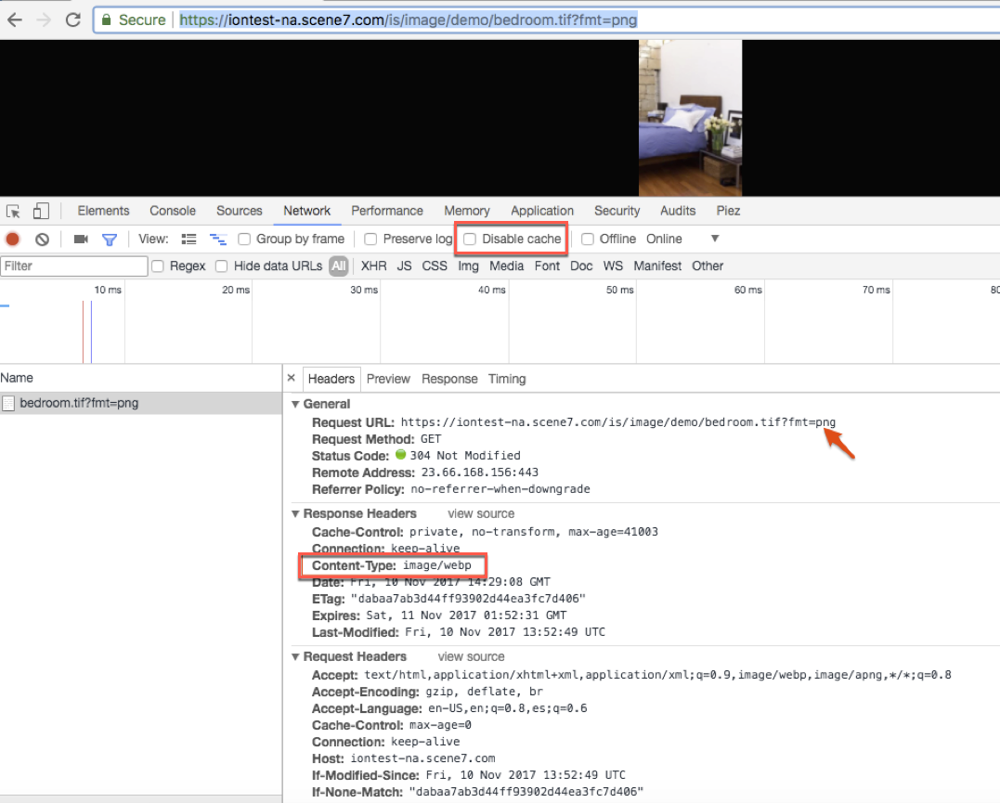

# スマートイメージング {#smart-imaging}

Adobe Sensei AI を活用したスマートイメージングが、各ユーザー固有の閲覧特性を適用して、ユーザーのエクスペリエンスに最適化された適切な画像を自動的に提供することで、パフォーマンスとエンゲージメントの向上を実現している仕組みを説明します。

## スマートイメージングについて {#about-smart-imaging}

スマートイメージングテクノロジーは、Adobe Sensei AI の機能を適用して、既存の「画像プリセット」と連携して動作します。クライアントのブラウザー機能に基づいて画像形式、サイズ、および画質を自動的に最適化し、画像配信のパフォーマンスを向上させます。

また、AVIF と WebP の両方のサポートに伴うスマートイメージングの改善により、LCP（コンテンツが豊富な最大のペイント）の Google Core Web Vital スコアが向上しました。

>[!IMPORTANT]
>
>スマートイメージングを使用するには、Adobe Experience Manager - Dynamic Media にバンドルされている標準搭載の CDN（コンテンツ配信ネットワーク）を使用する必要があります。この機能では、その他のカスタム CDN はサポートされません。

>[!TIP]
>
>Dynamic Media の&#x200B;[_スナップショット_](https://snapshot.scene7.com/)を使用して、Dynamic Media の画像修飾子とスマートイメージングのメリットを体験してみましょう。
>
>スナップショットは、最適化された動的な画像配信における Dynamic Media のパワーをわかりやすく伝えるために作られた、視覚的なデモツールです。テスト画像や Dynamic Media の URL を試して、様々な Dynamic Media 画像修飾子の出力を視覚的に観察し、次の項目に対するスマートイメージング最適化を確認します。
>
>* ファイルサイズ（WebP および AVIF 配信を使用）
>* ネットワーク帯域幅
>* DPR（デバイスのピクセル比）
>
>スナップショットの使用がどれほど簡単かを知るには、[スナップショットのトレーニングビデオ](https://experienceleague.adobe.com/ja/docs/experience-manager-learn/assets/dynamic-media/images/dynamic-media-snapshot)（3 分 17 秒）を再生してください。

スマートイメージングを、クラス最高のプレミアム CDN（コンテンツ配信ネットワーク）サービスと完全に統合することで、パフォーマンスを大幅にアップさせることができます。このサービスは、サーバー、ネットワーク、およびピアリングポイント間の最適なインターネットルートを見つけます。インターネットのデフォルトのルートを使用する代わりに、待ち時間が最も短く、パケット損失率が最も低いルートを見つけます。

次の画像アセットの例は、追加されたスマートイメージングの最適化を示しています。

| 画像（URL） | サムネール | サイズ（JPEG） | サイズ（WebP）（スマートイメージングを使用） | サイズ（AVIF）（スマートイメージングを使用） | WebP による削減率 | AVIF による削減率 |
|---|---|---|---|---|---|---|
| [画像 1](https://techsupport.scene7.com/is/image/TechSupport/SmartImaging_6?hei=500&amp;fmt=jpg&amp;qlt=85&amp;resmode=bisharp&amp;op_usm=5,0.125,5,0) |  | 145 KB | 106 KB | 90.2 KB | 26.89％ | 37.79％ |
| [画像 2](https://techsupport.scene7.com/is/image/TechSupport/SmartImaging_3?hei=500&amp;fmt=jpg&amp;qlt=85&amp;resmode=bisharp&amp;op_usm=5,0.125,5,0) |  | 412 KB | 346 KB | 113 KB | 16.01％ | 72.57％ |
| [画像 3](https://techsupport.scene7.com/is/image/TechSupport/SmartImaging_2?hei=500&amp;fmt=jpg&amp;qlt=85&amp;resmode=bisharp&amp;op_usm=5,0.125,5,0) |  | 221 KB | 189 KB | 87.1 KB | 14.47％ | 60.58％ |
| [画像 4](https://techsupport.scene7.com/is/image/TechSupport/SmartImaging_1?hei=500&amp;qlt=85&amp;resmode=bisharp&amp;op_usm=5,0.125,5,0) |  | 594 KB | 545 KB | 286 KB | 8.25％ | 51.85％ |

上記と同様に、アドビでも、より大きなサンプルセットを使用してテストを実行しました。AVIF 形式は WebP よりもサイズ削減率が 20％向上しました（WebP では JPEG に対して 27％の削減を実現）。視覚的な質はすべて同じです。全体的に見て、AVIF は JPEG よりも最大で平均 41％のサイズ削減を実現しています。

WebP および AVIF を PNG と比較すると、サイズ削減は WebP で 84％、AVIF で 87％となっています。また、WebP 形式も AVIF 形式も透明度と複数の画像アニメーションをサポートしているので、透明 PNG および GIF ファイルの代わりに使用できます。

[次世代の画像形式 WebP および AVIF による画像の最適化](https://blog.developer.adobe.com/image-optimisation-with-next-gen-image-formats-webp-and-avif-248c75afacc4)も参照してください。

<!-- HIDDEN ON MAY 19, 2022 BASED ON CQDOC-19280 On the mobile web, the challenges are compounded by two factors:

* Large variety of devices with different form factors and high-resolution displays.
* Constrained network bandwidth.

In terms of images, the goal is to serve the best quality images as efficiently as possible. -->

**スマートイメージングのメリット**

スマートイメージングは、ユーザーのブラウザー、デバイスのディスプレイおよびネットワーク状況に基づいてファイルサイズを自動的に最適化することで、画像配信を強化します。このアプローチにより、読み込み時間が短縮され、様々な環境での視聴エクスペリエンスが向上します。ページの読み込み時間のほとんどは画像によって占められるます。そのため、パフォーマンスの向上は次のようなビジネス KPI に大きな影響を及ぼす可能性があります。

* コンバージョン率の上昇。
* サイトでの滞在時間。
* サイトバウンス率の低下。

最新のスマートイメージングの主要なメリットには、次のものがあります。

* 次世代の AVIF 形式をサポートします。
* PNG から WebP および AVIF への変換で非可逆変換がサポートされるようになりました。PNG は可逆形式なので、以前配信されていた WebP および AVIF は可逆形式でした。
* [ブラウザーフォーマット変換](#bfc)
* [デバイスピクセル比](#dpr)
* [ネットワーク帯域幅](#bandwidth)

### ブラウザーフォーマット変換について {#bfc}

画像 URL に `bfc=on` を追加してブラウザーフォーマット変換を有効にすると、異なるブラウザー向けに JPEG と PNG が非可逆 AVIF、非可逆 WebP、非可逆 JPEGXR、非可逆 JPEG2000 に自動的に変換されます。これらの形式をサポートしていないブラウザーでは、スマートイメージングは引き続き JPEG または PNG を提供します。スマートイメージングは、形式の変更に伴い、新しい形式の画質を再計算します。

画像の URL に `bfc=off` を追加して、スマートイメージングをオフにできます。

Dynamic Media 画像サービングおよび画像レンダリング API の [bfc](https://experienceleague.adobe.com/ja/docs/dynamic-media-developer-resources/image-serving-api/image-serving-api/http-protocol-reference/command-reference/r-bfc) も参照してください。

### デバイスピクセル比の最適化について {#dpr}

デバイスピクセル比（DPR）は、CSS ピクセル比とも呼ばれ、デバイスの物理ピクセルと論理ピクセルの関係を表します。Retina ディスプレイの台頭に伴い、最新のモバイルデバイスのピクセル解像度が急速に増加しています。

デバイスピクセル比の最適化を有効にすると、画像が画面のネイティブ解像度でレンダリングされるので、画面が鮮明に見えます。

現在、ディスプレイのピクセル密度は Akamai CDN ヘッダー値から得られます。

| 画像の URL で使用できる値 | 説明 |
|---|---|
| `dpr=off` | 個々の画像 URL レベルで DPR の最適化をオフにします。 |
| `dpr=on,dprValue` | スマートイメージングで検出された DPR 値を、カスタム値（クライアント側のロジックまたはその他の手段で検出された値）でオーバーライドします。`dprValue` に指定可能な値は、0 より大きい任意の数です。 |

>[!NOTE]
>
>* 全社レベルの DPR 設定がオフの場合でも、`dpr=on,dprValue` を使用できます。
>* DPR の最適化により、結果の画像が Dynamic Media の MaxPix 設定より大きくなる場合、画像の縦横比を維持することで MaxPix の幅が常に認識されます。-->

| 要求された画像サイズ | デバイスピクセル比（dpr）の値 | 配信される画像サイズ |
|---|---|---|
| 816 x 500 | 1 | 816 x 500 |
| 816 x 500 | 2 | 1632 x 1000 |

[画像を操作する場合](/help/assets/dynamic-media/adding-dynamic-media-assets-to-pages.md#when-working-with-images)および[スマート切り抜きを操作する場合](/help/assets/dynamic-media/adding-dynamic-media-assets-to-pages.md#when-working-with-smart-crop)も参照してください。

### ネットワーク帯域幅の最適化について {#bandwidth}

ネットワーク帯域幅をオンにすると、実際のネットワーク帯域幅に基づいて、提供される画質が自動的に調整されます。ネットワーク帯域幅が不十分な場合、DPR（デバイスピクセル比）の最適化は、オンになっていても、自動的にオフになります。

会社は、画像の URL に `network=off` を追加して、個々の画像のネットワーク帯域幅の最適化を無効にできます。

| 画像の URL で使用できる値 | 説明 |
|---|---|
| `network=off` | 個々の画像 URL レベルでネットワーク帯域幅の最適化をオフにします。 |

DPR とネットワーク帯域幅の値は、バンドルされた CDN のクライアント側の検出値に基づいています。これらの値は不正確な場合があります。例えば、dpr=2 の iPhone5 と `dpr=3` の iPhone12 では、どちらも `dpr=2` と表示されます。それでも、高解像度デバイスの場合は、`dpr=1` を送信するより `dpr=2` を送信する方が適切です。この不正確さを克服する最善の方法は、クライアントサイドの DPR を使用して 100％正確な値を指定することです。また、これは、Apple か他のデバイスかに関わらず、発売された任意のデバイスで機能します。[クライアントサイドのデバイスピクセル比（DPR）を使用したスマートイメージングについて](/help/assets/dynamic-media/client-side-dpr.md)を参照してください。

**スマートイメージングのその他の主要なメリット**

* 最新のスマートイメージングを使用する Web ページの Google SEO ランキングを改善しました。
* 最適化されたコンテンツをすぐに提供（実行時）
* Adobe Sensei テクノロジーを使用して、イメージリクエストで指定された品質（`qlt`）に従って変換します。
* TTL（Time To Live）独立。以前は、スマートイメージングを機能させるには、最小 TTL 値 12 時間が必要でした。
* 以前は、元の画像と派生画像の両方がキャッシュされていて、キャッシュを無効にする 2 つの手順がありました。最新のスマートイメージングでは、派生画像のみがキャッシュされ、1 ステップでキャッシュを無効化できます。
* ルールセットでカスタムヘッダーを使用しているユーザーは、以前のバージョンのスマートイメージングとは異なってこれらのヘッダーがブロックされないので、最新のスマートイメージングのメリットが得られます。

## スマートイメージングの仕組み{#how-smart-imaging-works}

消費者が画像をリクエストすると、スマートイメージングは、そのユーザーの特性を分析し、ブラウザーに基づいて適切な形式に変換します。これらの形式変換は、視覚的忠実性を低下させない方法で行われます。スマートイメージングは、次のような方法で、ブラウザーの機能に基づいて、自動的に画像を別の形式に変換します。

* ブラウザーが AVIF 形式をサポートしている場合は、自動的に AVIF に変換します
* AVIF 変換がうまくいかなかった場合やブラウザーが AVIF をサポートしていない場合は、自動的に WebP に変換します
* Safari で WebP がサポートされていない場合は、自動的に JPEG2000 に変換します
* IE 9 以降については、または Edge で WebP がサポートされていない場合は、自動的に JPEGXR に変換します

  | 画像の形式 | サポートされているブラウザー |
  |---|---|
  | AVIF | [https://caniuse.com/avif](https://caniuse.com/avif) |
  | WebP | [https://caniuse.com/webp](https://caniuse.com/webp) |
  | JPEG 2000 | [https://caniuse.com/jpeg2000](https://caniuse.com/jpeg2000) |
  | JPEGXR | [https://caniuse.com/jpegxr](https://caniuse.com/jpegxr) |

* 上記形式をサポートしていないブラウザーの場合は、元々要求された画像形式が提供されます。

元の画像サイズがスマートイメージングの生成するサイズより小さい場合は、元の画像が提供されます。

## スマートイメージングでの画像形式のサポート{#image-format-support}

スマートイメージングでは次の画像形式がサポートされています。

* JPEG
* PNG

スマートイメージングは、新しい形式に変換する際に、JPEG の画像ファイル形式の画質を再計算します。

透明度をサポートしている PNG などの画像ファイル形式の場合は、非可逆の AVIF および WebP を配信するようにスマートイメージングを設定できます。スマートイメージングでは、非可逆の形式変換の場合、画像の URL で指定されている画質を使用します。それ以外の場合は、Dynamic Media の会社アカウントで設定されている画質を使用します。

## スマートイメージングでの画像サービングコマンドのサポート{#imaging-serving-command-support}

画像サービングコマンド `fmt` および `qlt` はサポートされていません。残りのコマンドはすべてサポートされます。

## スマートイメージングに関するよくある質問（FAQ）{#smart-imaging-faq}

+++**スマートイメージングにはライセンス費用がかかりますか？**

いいえ。スマートイメージングは、既存のライセンスに含まれています。この規則は、Dynamic Media Classic または Experience Manager Dynamic Media（オンプレミス、AMS、および Experience Manager as a Cloud Service）に当てはまります。

>[!IMPORTANT]
>
>Dynamic Media - ハイブリッドのユーザーはスマートイメージングを使用できません。

+++

+++**要求に対してスマートイメージングをオフにできますか？**

はい。次のいずれかの修飾子を追加して、スマートイメージングをオフにできます。

* `bfc=off`：ブラウザーフォーマット変換をオフにします。[ブラウザーフォーマット変換](#bfc)も参照してください。
* `dpr=off`：デバイスピクセル比の最適化をオフにします。[デバイスピクセル比](#dpr)も参照してください。
* `network=off`：ネットワーク帯域幅の最適化をオフにします。[ネットワーク帯域幅](#network)も参照してください。

+++

+++**スマートイメージングを「調整」できますか？**

はい。スマートイメージングには、有効または無効にできるオプションが次の 3 つあります。

* [ブラウザーフォーマット変換](#bfc)
* [デバイスピクセル比](#dpr)
* [ネットワーク帯域幅](#network)

+++

+++**スマートイメージングは既存の画像プリセットと連動しますか？**

スマートイメージングは、すべての画像設定を考慮しながら、既存の画像プリセットとシームレスに統合されます。

調整には、画像の形式、画質、またはその両方のみが含まれます。形式変換中、スマートイメージングは、プリセット設定に従って視覚的忠実性を完全に維持しますが、ファイルサイズは小さくなります。既存の URL またはプリセットに `bfc=on`、`dpr=on,dprValue`、`network=on`、または 3 つのパラメーター設定すべてを追加するのみで有効になります。

例えば、画像プリセットで 500 × 500 ピクセル、`quality=85`、`unsharp mask=0.1,1,5` の JPEG 形式が指定されているとします。スマートイメージングは、ユーザーが Chrome ブラウザーを使用しているかどうかを検出します。次に、同じ寸法（500 × 500）と JPEG の設定に一致するアンシャープマスクを持つ WebP に画像を変換します。次に、システムは WebP バージョンと JPEG バージョンのファイルサイズを比較し、小さいファイルをユーザーに提供します。

+++

<!-- OLD VERSION BELOW AS PER CQDOC-22085>
Yes. Smart Imaging works with your existing image presets and observes all your image settings. What changes is the image format, or the quality setting, or both. For format conversion, Smart Imaging maintains full visual fidelity as defined by your image preset settings, but at a smaller file size.

For example, suppose that an image preset is defined with JPEG format, size 500 x 500, quality=85, and unsharp mask=0.1,1,5. When Smart Imaging detects that a user is on a Chrome browser, the image is converted to WebP format, with size 500 x 500. And, unsharp mask=0.1,1,5 is at a WebP quality that matches a JPEG quality of 85 as close as possible. The footprint of that WebP conversion is compared with the JPEG, and the smaller of the two is returned. -->

<!-- QUESTION BELOW WAS REMOVED AS PER CQDOC-22085

+++**Do I have to change any URLs, image presets, or deploy new code on my site?**

No. Smart Imaging works seamlessly with your existing image URLs and image presets. In addition, Smart Imaging does not require you to add code to your website to detect a user's browser. All of this functionality is handled automatically.

<!-- Smart Imaging works seamlessly with your existing image URLs and image presets if you configure Smart Imaging on your existing custom domain. In addition, Smart Imaging does not require you to add any code on your website to detect a user's browser. It is all handled automatically.

In case you must configure a new custom domain to use Smart Imaging, the URLs must be updated to reflect this custom domain.

To understand pre-requisites for Smart Imaging, see [Am I eligible to use Smart Imaging?](#am-i-eligible-to-use-smart-imaging) -->

<!-- OLD As mentioned earlier, Smart Imaging supports only JPEG and PNG image formats. For other formats, you need to append the `bfc=off` modifier to the URL as described earlier. 

-->

+++**スマートイメージングは HTTPS で機能しますか？HTTP/2 ではどうですか？**

いずれの質問も、回答は「はい」です。スマートイメージングは、HTTP または HTTPS で配信された画像に対して機能します。また、HTTP/2 上でも機能します。
+++

+++**スマートイメージングを使用するための資格を私は満たしていますか？**

スマートイメージングは、すべてのお客様がすぐにご利用いただけます。既存の URL またはプリセットに `bfc=on`、`dpr=on,dprValue`、`network=on`、または 3 つのパラメーター設定すべてを追加するだけで、スマートイメージングのメリットを享受できます。

スマートイメージングをアクティベートするには、会社の Dynamic Media Classic または Experience Manager の Dynamic Media アカウントに、ライセンスの一部として Adobe バンドル CDN（コンテンツ配信ネットワーク）を含める必要があります。

+++

+++**アカウントのスマートイメージングを有効にするプロセスは何ですか？**

スマートイメージングの使用を開始するには、既存の URL またはプリセットに `bfc=on`、`dpr=on,dprValue`、`network=on`、または 3 つのパラメーター設定すべてを追加します。これらの変更を手動で行わない場合は、サポートケースを作成して、スマートイメージングをデフォルトで有効にできます。

サポートケースを作成する際に、アカウントでアクティブ化する次のスマートイメージング機能を指定します。

* ブラウザーフォーマット変換（WebP または AVIF）
* ネットワーク帯域幅の最適化

>[!NOTE]
>
>DPR では、正しい `dprValue` を判断するためにクライアントサイドの調整が必要です。したがって、アドビでは、`dpr=on,dprValue` を追加して URL 経由で DPR を有効にすることをお勧めします。

**アカウントでスマートイメージングを有効にするためのサポートケースを作成するには：**

1. [Admin Console を使用して、新しいサポートケースの作成を開始します](https://helpx.adobe.com/jp/enterprise/using/support-for-experience-cloud.html)。
1. サポートケースには、次の情報を記入してください。

   * **プライマリ連絡先の詳細：**

      * 名前、メールおよび電話番号を記入します。

   * **有効にするスマートイメージング機能：**

      * 自身のアカウントで必要な機能をリストします。

         * ブラウザーフォーマット変換：WebP または AVIF
         * ネットワーク帯域幅の最適化
         * DPR：DPR では、正しい `dprValue` を判断するためにクライアントサイドの調整が必要です。したがって、アドビでは、`dpr=on,dprValue` を追加して URL 経由で DPR を有効にすることをお勧めします。

   * **スマートイメージングのドメイン：**

      * *`company.com`* や *`mycompany.scene7.com`* など、関連するドメインをすべてリストします
      * スマートイメージングは、汎用ドメインとカスタムドメインの両方をサポートします。
      * ドメインを識別するには、[Dynamic Media Classic デスクトップアプリケーション](https://experienceleague.adobe.com/ja/docs/dynamic-media-classic/using/getting-started/signing-out#getting-started)を開き、会社のアカウントにログインします。

         1. **[!UICONTROL 設定]**／**[!UICONTROL アプリケーション設定]**／**[!UICONTROL 一般設定]**&#x200B;に移動します。
         1. 「**[!UICONTROL 公開サーバー名]**」フィールドを探して、ドメインを確認します。
         1. 別のプロバイダーが管理する CDN ではなく、アドビの CDN を使用していることを確認します。

   * **HTTP/2 サポートを示す：**

      * スマートイメージングを HTTP/2 上で機能させる必要があるかどうかを指定します。

1. アドビカスタマーサポートでは、リクエストされたスマートイメージング機能がデフォルトで有効になっているので、URL にパラメーターを手動で追加する必要はありません。
1. アドビでは、キャッシュによるパフォーマンスを最大化するために、有効期間（TTL）を 24 時間以上に設定することをお勧めします。
TTL を調整するには：

   1. **Dynamic Media Classic の場合：**
      1. **[!UICONTROL 設定]**／**[!UICONTROL アプリケーション設定]**／**[!UICONTROL 公開設定]**／**[!UICONTROL Image Server]** に移動します。
      1. 「**[!UICONTROL デフォルトのクライアントキャッシュの有効期間]**」の値を 24 時間以上に設定します。
   1. **Adobe Experience Manager の Dynamic Media の場合：**
      1. [こちらの手順](/help/assets/dynamic-media/config-dm.md)に従います。
      1. 「**[!UICONTROL 有効期限]**」の値を 24 時間以上に設定します。

+++

+++**アカウントでスマートイメージングが有効になるのはいつですか？**

カスタマーサポートは、待機リストに従って、受信した順にリクエストを処理します。

>[!NOTE]
>
>リードタイムが長くなる場合がありますが、それは、スマートイメージングを有効化するためには、アドビによるキャッシュのクリアが必要になるからです。そのため、処理できる移行の数は、常にほんの数件です。

+++

+++**スマートイメージングの使用に関してリスクはありますか？**

顧客の Web ページを表示するリスクはありません。ただし、スマートイメージングにトランジションすると、CDN キャッシュがクリアされます。この操作では、Dynamic Media Classic や Dynamic Media on Experience Manager の新しい構成に移行します。

最初の切り替え中、キャッシュが再構築されるまでの間は、アドビの起点サーバーにあるキャッシュされていない画像が直接ヒットします。このため、元のサーバーからリクエストをプルするときに許容できるパフォーマンスが維持されるように、アドビでは一度に少数の顧客の移行を処理するよう計画します。ほとんどのお客様の場合、キャッシュは CDN で 1〜2 日以内に完全に再構築されます。

+++

+++**スマートイメージングが機能するかどうかを確認できますか？**

はい。次の操作を実行できます。

1. アカウントにスマートイメージングが設定されたら、ブラウザーで、Dynamic Media Classic または Adobe Experience Manager - Dynamic Media の画像の URL を読み込みます。
1. Chrome ブラウザーで&#x200B;**[!UICONTROL 表示]**／**[!UICONTROL デベロッパー]**／**[!UICONTROL デベロッパーツール]**&#x200B;に移動して、デベロッパーパネルを開きます。または、別のブラウザーのデベロッパーツールを使用します。

1. デベロッパーツールを開いたときにキャッシュが無効化されるようにします。

   * Windows® では、デベロッパーツールパネルの設定に移動してから、「**[!UICONTROL キャッシュを無効にする（devtools が開いている間）]**」チェックボックスを選択します。
   * macOS では、デベロッパーパネルの「**[!UICONTROL ネットワーク]**」タブで、「**[!UICONTROL キャッシュを無効にする]**」を選択します。

1. コンテンツタイプが適切な形式に変換されるのを監視します。次のスクリーンショットは、Chrome 上で PNG 画像が動的に WebP に変換されているのを示しています。ドメインで AVIF が有効になっている場合は、コンテンツタイプに AVIF が表示されることも期待できます。
1. このテストを、様々なブラウザーやユーザー条件で繰り返します。

>[!NOTE]
>
>すべての画像が変換されるわけではありません。スマートイメージングは、変換がパフォーマンスを向上させる可能性があるかどうかを判断します。予期されるパフォーマンスゲインがない場合や、形式が JPEG や PNG でない場合、画像は変換されません。

+++

+++**スマートイメージングのメリットを知る方法はありますか？**

はい。スマートイメージングのメリットはスマートイメージングヘッダーで決まります。スマートイメージングが有効な場合は、画像を要求すると、**[!UICONTROL 応答ヘッダー]**&#x200B;の見出し下に `-X-Adobe-Smart-Imaging` が表示されます（下の例のハイライト表示された部分を参照）。

このヘッダーは次のことを示しています。

* スマートイメージングは会社向けに機能しています。
* 正の値は、変換が成功したことを意味します。この場合、新しい WebP 画像が返されます。
* 負の値は、変換が成功しなかったことを意味します。この場合、要求されたオリジナル画像が返されます（指定されていない場合は、デフォルトの JPEG）。
* 正の値は、要求された画像と新しい画像のバイト数の違いを示します。上記の例では、保存されたバイト数は 1 つの画像について `75048`（約 75 KB）です。
* 負の値は、要求された画像が新しい画像より小さいことを意味します。負のサイズの差が表示されますが、提供される画像は要求されたオリジナル画像のみです。

>[!NOTE]
>
>**X-Adobe-Smart-Imaging = -1 で WebP を配信中**
>
>`X-Adobe-Smart-Imaging` の値が -1 で、WebP がまだ配信中の場合、スマートイメージングはアクティブです。ただし、キャッシュが古いので、サイズのメリットは計算されませんでした。画像の URL で `cache=update` を（1 回だけ）使用して、この問題を修正できます。
>この修飾子の使用例を次に示します。
>`https://smartimaging.scene7.com/is/image/SmartImaging/sample1?cache=update`
>キャッシュ全体を無効にするには、サポートケースを作成する必要があります。

+++

+++**スマートイメージングで AVIF の最適化を無効にできますか？**

はい。WebP をデフォルトで提供する状態に戻す場合は、同様にサポートケースを作成します。通常どおり、画像の URL に `bfc=off` パラメーターを追加して、スマートイメージングをオフにできます。ただし、スマートイメージングの URL 修飾子で WebP または AVIF を選択することはできません。この機能は、会社アカウントレベルで維持管理されています。

+++

+++**Chrome web ブラウザーで fmt=tif の URL を使用している場合、リクエストが失敗するのはなぜですか？**

アカウントでスマートイメージングが有効になっていない場合、このエラーは発生しません。スマートイメージングは、JPEG 形式または PNG 形式でのみ機能します。

このエラーを回避するには、次のいずれかを行います。

* JPEG または PNG を指定する
* `fmt` 修飾子をまったく使用しない
* スマートイメージングで定義されているブラウザー優先設定形式を使用する。例えば、Chrome web ブラウザーには WebP を使用できます。

+++

+++**画像の URL から TIFF 画像をダウンロードできますか？**

はい。`fmt=tif` と `bfc=off` を画像の URL パスに追加します。

+++

+++**スマートイメージングは画像形式と画質の設定を管理しますか？**

はい。スマートイメージングでは、形式と画質の両方を使用します。画像の URL で要求された場合、残りのパラメーターは同じままです。

+++

+++**最低品質と最大品質の設定を指定できますか？**

いいえ。現在、そのようなプロビジョニングはありません。

+++

+++**スマートイメージングは画質の出力設定のパーセントを調整しますか？**

はい。スマートイメージングでは、画質（％単位）を自動的に調整します。この画質は、アドビで開発された機械学習アルゴリズムを使用して決定されます。このパーセントは、範囲固有のものではありません。

+++

+++**スマートイメージングで置換の対象となるのは JPEG および PNG 画像のみですか？**

はい。この機能は、JPEG と PNG でのみ機能します。

+++

+++**WebP ではなく JPEG 画像が Chrome に返されることがあるのはなぜですか？**

スマートイメージングは、変換が有益かどうかを判断します。変換が有益な場合にのみ、新しい画像を返します。

+++

+++**合成画像でデバイスピクセル比（dpr）機能が動作しないのはなぜですか？**

合成画像に含まれるレイヤーが多すぎると、位置修飾子の使用中に dpr 機能に影響が及ぶ場合があります。この問題は既知で、スマートイメージングの今後のリリースで修正される予定です。他のスマートイメージング機能が期待どおりに動作しない場合は、サポートケースを作成して問題を報告することができます。

+++

+++**スマートイメージングで PNG が可逆圧縮 WebP／AVIF に変換されるのはなぜですか？**

PNG は可逆形式なので、以前配信されていた WebP および AVIF は可逆形式でした。その結果、予想よりも大きいサイズになりました。スマートイメージングでは、非可逆変換をサポートするようになりました。画像リクエストで修飾子 `cache=update` を（1 回だけ）使用して、この問題を修正できます。この修飾子の使用例を次に示します。

`https://smartimaging.scene7.com/is/image/SmartImaging/sample1?cache=update`

キャッシュ全体を無効にするには、サポートケースを作成して、その作業を依頼する必要があります。

+++

+++**スマートイメージングで PNG の可逆変換を引き続き使用できますか？**

はい。スマートイメージングでは、画質レベルに応じた非可逆変換をサポートするようになりました。会社の設定を通じて画質を 100 に設定するか、画像の URL パスに `qlt=100` を追加して、可逆変換を引き続き使用できます。

+++

<!-- ## If Smart Imaging manages the quality settings, are there minimums and maximums I can set? For example, is it possible to set "no lower than 60" and "no greater than 80 quality"? {#minimum-maximum}

There is no such provisioning ability in the current Smart Imaging. -->

<!-- ## Sometimes a JPEG image is returned to Chrome instead of a WebP image. Why does that change happen? {#jpeg-webp}

Smart Imaging determines if the conversion is beneficial or not. It returns the new image only if the conversion results in a smaller file size with comparable quality.

How does Smart Imaging DPR optimization work with Adobe Experience Manager Sites components and Dynamic Media viewers?

* Experience Manager Sites Core Components are configured by default for DPR optimization. To avoid oversized images owing to server-side Smart Imaging DPR optimization, `dpr=off` is always added to Experience Manager Sites Core Components Dynamic Media images.
* Given Dynamic Media Foundation Component is configured by default for DPR optimization, to avoid oversized images owing to server-side Smart Imaging DPR optimization, `dpr=off` is always added to Dynamic Media Foundation Component images. Even if customer deselects DPR optimization in DM Foundation Component, server-side Smart Imaging DPR does not kick in. In summary, in the DM Foundation Component, DPR optimization comes into effect based on DM Foundation Component level setting only.
* Any viewer side DPR optimization works in tandem with server-side Smart Imaging DPR optimization, and does not result in over-sized images. In other words, wherever DPR is handled by the viewer, such as the main view only in a zoom-enabled viewer, the server-side Smart Imaging DPR values are not triggered. Likewise, wherever viewer elements, such as swatches and thumbnails, do not have DPR handling, the server-side Smart Imaging DPR value is triggered.

See also [When working with images](/help/assets/dynamic-media/adding-dynamic-media-assets-to-pages.md#when-working-with-images) and [When working with Smart Crop](/help/assets/dynamic-media/adding-dynamic-media-assets-to-pages.md#when-working-with-smart-crop).

>[!MORELIKETHIS]
>
>* [Image optimization with next generation image formats WebP and AVIF](https://medium.com/adobetech/image-optimisation-with-next-gen-image-formats-webp-and-avif-248c75afacc4). 
-->
