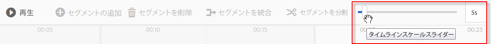
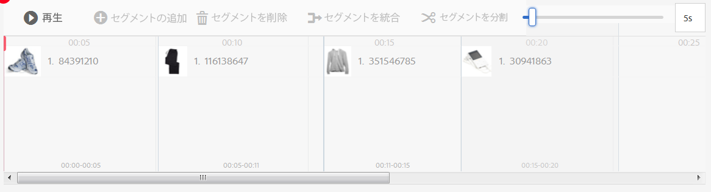
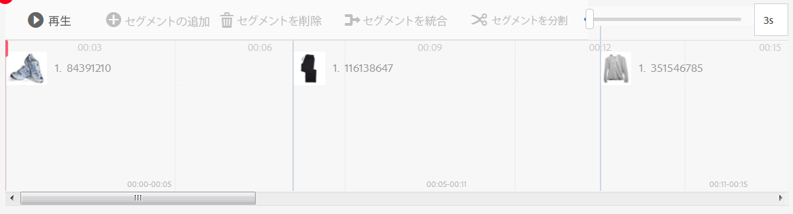
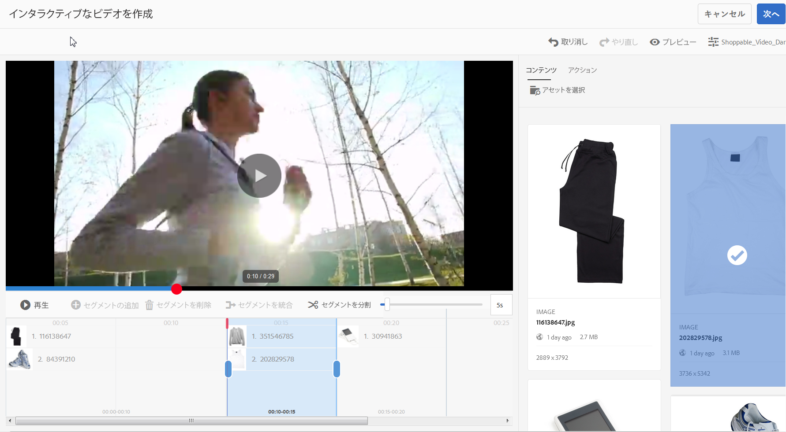
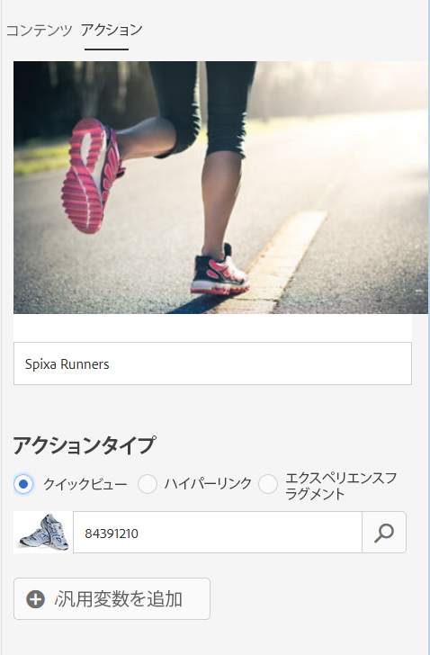
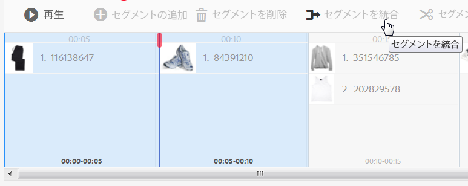
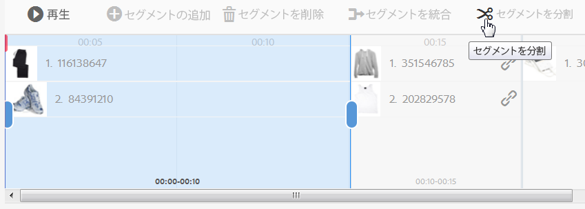

# インタラクティブビデオ{#interactive-videos}


インタラクティブなビデオは、ショッパブルビデオとも呼ばれ、ビデオから直接コンバージョンを推進するものを簡単に作成できます。ビデオに対する顧客エンゲージメントは、ビデオプレーヤーの隣のパネルでおこなわれ、関連するサービス、情報または製品のサムネールが、ビデオの特集に基づいてスクロール表示されます。顧客はサムネールをタップして、サービスを直接参照したり、買い物かごに商品を追加して即時に購入したり、Web ページを参照して詳細を確認したりできます。

ビデオが終了すると、コールトゥアクションを促すために、画像を使用して、すべてのサービスの概要が表示されます。顧客は、ここで欲しい商品をタップすることもできます。こうしたすぐに行動に移すことができる具体的なエクスペリエンスが顧客のエンゲージメントとコンバージョンを促します。

[インタラクティブ画像](/help/assets/dynamic-media/interactive-images.md)も参照してください。

## インタラクティブビデオの使用例  {#interactive-video-in-action}

インタラクティブなショッパブルビデオの動作を確認するには、「[ライブデモ](https://landing.adobe.com/jp/na/dynamic-media/ctir-2755/live-demos.html)」をクリックし、ページの「**[!UICONTROL ショッパブルメディア]**」見出しまでスクロールして、ショッパブルビデオをクリックして再生を開始します。

* 再生中にビデオ内で製品が使用されると、同じ製品のサムネール画像が右側に表示されます。

* サムネールをクリックするとビデオが一時停止され、その製品のクイックビューが開きます。例えば、ビデオ内の KitchenAid のサムネール画像をクリックすると、このミキサーの 360 度のスピンビューを見たり、細部を拡大表示したりすることができます。

[Dynamic Media でのインタラクティブビデオの使用](https://docs.adobe.com/content/help/ja-JP/experience-manager-learn/assets/dynamic-media/dynamic-media-interactive-video-feature-video-use.html)も参照してください。

<!-- 

There was a link here that showed the video frame of an interactive video and when the reader clicked the frame the video would play https://marketing.adobe.com/resources/help/en_US/dm/shoppable-video/AXIS/index.html. This now needs to call a new interactive video

-->

<!-- 

[A frame from an interactive, shoppable video](assets/chlimage_1-126.png) *A video frame capture from an interactive, shoppable video.*

-->

>[!NOTE]
>
>ユーザーがサムネール画像をクリックすると Web ページが開かれるようにインタラクティブビデオを作成した場合、一部のデバイスでは、ポップアップ Web ページがブロックされて開きません。そのようなケースでは、デバイスのポップアップブロック機能の設定を変更する必要があります。例えば、Apple iPhone 6 では&#x200B;**[!UICONTROL 設定／Safari／ポップアップブロック]**&#x200B;をタップして、コントロールを&#x200B;**[!UICONTROL オフ]**&#x200B;にスライドします。こうすると、インタラクティブビデオを再生してサムネールをクリックしたときに、ポップアップを開くかどうかを確認するメッセージが表示されます。同意すると Web ページが開きます。

### インタラクティブビデオの作成方法を見る  {#watch-how-interactive-videos-are-created}

[インタラクティブビデオの作成方法](https://s7d5.scene7.com/s7viewers/html5/VideoViewer.html?videoserverurl=https://s7d5.scene7.com/is/content/&amp;emailurl=https://s7d5.scene7.com/s7/emailFriend&amp;serverUrl=https://s7d5.scene7.com/is/image/&amp;config=Scene7SharedAssets/Universal_HTML5_Video_social&amp;contenturl=https://s7d5.scene7.com/skins/&amp;asset=S7tutorials/InteractiveVideo)[](https://outv.omniture.com?v=s4NHQ2dzqd7hIqWjeG2sIdyNWsTWyupA)を示す 7 分 30 秒のガイドをご覧ください（このビデオガイドの対象は Assets on Demand ですが、原則や手順は AEM Assets のインタラクティブビデオにも対応しています）。

### アドビカスタマーサクセスウェビナー {#adobe-customer-success-webinar}

[AEM Assets でのインタラクティブビデオの使用、リンク共有および YouTube での共有](https://adobecustomersuccess.adobeconnect.com/p1yxzdo4aec/)ウェビナーでは、インタラクティブビデオなどの機能を使用して、コンバージョン誘導イベントをビデオマーケティングコンテンツと連動させる方法を解説しています。

## クイックスタート：インタラクティブビデオ {#quick-start-interactive-videos}

次のワークフローの手順説明は、Dynamic Media 内のインタラクティブビデオをすぐに使い始めることを目的としたものです。

一部のクイックスタートタスク内には「**例**」という見出しがあります。これには次の、[まだインタラクティビティが追加されていない&#x200B;**&#x200B;最初の状態のデモ Web ページ](https://marketing.adobe.com/resources/help/en_US/dm/shoppable-video/john-lewis/landing-0.html)に基づく、簡単なチュートリアルが含まれています。

「**例**」では、Web サイトにインタラクティブビデオを統合する手順が説明されています。

「例」セクションの最後のチュートリアルを終えると、[インタラクティブビデオと完全統合された最終的なデモ Web ページはこのようになります](https://marketing.adobe.com/resources/help/en_US/dm/shoppable-video/john-lewis/landing-3.html)。


インタラクティブビデオの手順：

1. **（オプション）クイックビュー変数の特定** - まず、既存のクイックビュー実装で使用される動的変数を特定します。これらの変数を使用して、インタラクティブビデオを作成するときに、製品のサムネールを対応する製品のクイックビューにマッピングします。[（オプション）クイックビュー変数の特定](#optional-identifying-quickview-variables)を参照してください。
   **この手順は、次のすべてに該当する場合にのみ必要です**。
・クイックビューにトリガーしてビデオにインタラクティビティを追加したい。・eコマースソリューション（IBM Websphere Commerce、Elastic Path、hybris、Intershop など）から AEM に製品データを取り出すために、AEM の実装が** eコマース統合フレームワークを使用していない。

1. **（オプション）インタラクティブビデオのビューアプリセットの作成** - プレーヤーを構成する様々なコンポーネント（ビデオスクラバーやインタラクティブサムネールなど）の外観と動作をカスタマイズします。独自のインタラクティブビデオビューアプリセットの作成は、標準提供のインタラクティブビデオビューアプリセット（`Shoppable_Video_Light` または `Shoppable_Video_Dark`）を使用する場合には必要ありません。[新しいビューアプリセットの作成](/help/assets/dynamic-media/managing-viewer-presets.md#creating-a-new-viewer-preset)（これはオプション）と[インタラクティブビューアプリセットの作成に関する注意事項](/help/assets/dynamic-media/managing-viewer-presets.md#special-considerations-for-creating-an-interactive-viewer-preset)を参照してください。

1. **ビデオおよび関連する画像アセットのアップロード** - インタラクティブにするビデオと関連する画像をアップロードします。[ビデオおよび関連するサムネールアセットのアップロード](#uploading-a-video-and-its-associated-thumbnail-assets)を参照してください。

1. **ビデオへのインタラクティビティの追加** - ビデオに 1 つ以上の時間セグメントを追加します。次に、それらの時間セグメント内で画像サムネールを関連付けます。各画像サムネールを、ハイパーリンク、クイックビュー、エクスペリエンスフラグメントなどのアクションに割り当てます（インタラクティブコンテンツに相対 URL のリンク（特に AEM Sites ページへのリンク）がある場合、URL ベースのリンク方法は使用できません）。
インタラクティブビデオアセットを公開して作業は完了です。公開すると、最終的にコピーして Web サイトのランディングページ適用する、埋め込みコードまたは URL が作成されます。[ビデオへのインタラクティビティの追加](#adding-interactivity-to-your-video)を参照してください。[アセットの公開](/help/assets/dynamic-media/publishing-dynamicmedia-assets.md)を参照してください。

1. **AEM でのインタラクティブビデオの Web サイトへの追加** AEM Sites または AEM eCommerce（あるいは両方）を使用している場合、AEM でインタラクティブメディアコンポーネントを Web ページにドラッグすることで、インタラクティブビデオを Web ページに直接追加できます。[ページへの Dynamic Media アセットの追加を参照してください。](/help/assets/dynamic-media/adding-dynamic-media-assets-to-pages.md)
埋め込みコードまたは URL を使用して、インタラクティブビデオを Web サイトエクスペリエンスに統合します。[インタラクティブビデオの Web サイトへの統合](#integrating-an-interactive-video-with-your-website)を参照してください。サードパーティの WCM（Web Content Manager）を使用している場合は、新しいインタラクティブビデオを、Web サイトで使用されている既存のクイックビュー実装に統合する必要があります。[インタラクティブビデオの既存のクイックビューへの統合](#integrating-an-interactive-video-with-an-existing-quickview)を参照してください。
   [ページへのダイナミックメディアアセットの追加](/help/assets/dynamic-media/adding-dynamic-media-assets-to-pages.md)

## （オプション）クイックビュー変数の特定{#optional-identifying-quickview-variables}

>[!NOTE]
>
>このタスクが必要になるのは次に該当する場合のみです。
>* クイックビューをトリガーして、ビデオにインタラクティブ機能を追加する。
>* eコマースソリューション（IBM Websphere Commerce、Elastic Path、hybris、Intershop など）から AEM に製品データを取り出すために、AEM の実装が&#x200B;** eコマース統合フレームワークを使用していない。<!-- See [eCommerce concepts in AEM Assets](/help/sites-administering/concepts.md).-->

AEM の実装で AEM eCommerce を使用している場合は、このタスクをスキップして次のタスクに進みます。

最初に、インタラクティブビデオの作成プロセス中に製品サムネールを対応する製品クイックビューにマッピングできるように、既存のクイックビューの実装で使用している動的変数を特定します。

ビデオに時間セグメントを追加する際に、セグメントに追加する各サムネールに SKU と任意の追加の変数を割り当てます。こうした変数は、適切な製品クイックビューを表示するために後で使用されます。

製品クイックビューを一意にトリガーするために必要な変数を適切に特定することが重要です。

既存のクイックビューの実装を担当している IT 担当者に問い合わせれば済むこともあります。IT 担当者はおそらく、システム内のクイックビューを特定するために必要な最小限のデータセットを把握しています。ただし、ほとんどの場合は、フロントエンドコードの既存の動作を分析するだけでもかまいません。

クイックビュー実装の大部分では、次の枠組みが使用されています。

* ユーザーは Web サイト上の特定のユーザーインターフェイス要素をアクティベートします。例えば、「クイックビュー」ボタンをクリックします。
* Web サイトでは、必要に応じて、クイックビューのデータまたはコンテンツを読み込むための Ajax リクエストをバックエンドに送信します。
* クイックビューのデータは、Web ページでのレンダリングに備えて、コンテンツに変換されます。
* 最後に、フロントエンドコードによってそのコンテンツが画面上に視覚的にレンダリングされます。

そのため、このアプローチでは、クイックビューが実装されている既存の Web サイトの様々な部分にアクセスし、クイックビューをトリガーして、クイックビューのデータまたはコンテンツを読み込むために Web ページから送信された Ajax URL をキャプチャします。

通常、専門のデバッグツールを使用する必要はありません。最新の Web ブラウザーには、十分なタスクを実行できる Web インスペクターが備わっています。Web インスペクターが搭載されている Web ブラウザーの例を次に示します。

* Google Chrome で、ブラウザーから送信されるすべての HTTP リクエストを参照するには、**F12** キー（Windows）または **Command + Options + I** キー（Mac）を押してデベロッパーツールパネルを開き、「**Network**」タブをクリックします。

* Firefox では、**F12** キー（Windows）または **Command + Option + I** キー（Mac）を押して Firebug プラグインを有効にして「**[!UICONTROL Net]**」タブを使用するか、組み込みの Inspector ツールとその「Network」タブを使用します。

* Internet Explorer では、**F12** キーを押してデバッガーツールをアクティベートします。

ブラウザーでネットワーク監視をオンにして、ページ上でクイックビューをトリガーします。

次に、ネットワークログ内でクイックビューの·Ajax·URL·を見つけ、記録された·URL·を今後の分析のためにコピーします。クイックビューをトリガーするとほとんどの場合、大量のリクエストがサーバーに送信されます。クイックビューの·Ajax·URL·は通常、そのリスト内の最初のほうにあります。この URL には複雑なクエリ文字列部分またはパスが含まれ、その応答の MIME タイプは `text/html`、`text/xml`、`text/javascript` のいずれかになります。

このプロセスの実行中は、様々な製品カテゴリや製品タイプが含まれる Web サイトの様々な領域にアクセスすることが重要です。なぜなら、クイックビュー URL には、ある特定の Web サイトカテゴリに共通するが、Web サイトの異なる領域にアクセスした場合にのみ変化する部分が存在する場合があるからです。

単純なケースでは、クイックビュー URL 内で変化する唯一の部分が製品 SKU となります。この場合、AEM でサムネールをインタラクティブビデオの時間セグメントに追加するのに必要なデータは製品の SKU 値のみです。

一方、複雑なケースでは、クイックビュー URL に製品 SKU 以外の様々な要素が含まれます（カテゴリ ID、カラーコードなど）。その場合は、それぞれの要素が AEM のサムネールデータ定義で個別の変数になります。

次のクイックビュー URL の例と、その結果となるサムネールの変数について見てみましょう。

<table>
  <tbody>
  <tr>
    <td><p>単一の SKU（クエリ文字列内）</p> </td>
    <td><p>記録されたクイックビューの URL：</p>
    <ul>
      <li><p><code>https://server/json?productId=866558&amp;source=100</code></p> </li>
      <li><p><code>https://server/json?productId=1196184&amp;source=100</code></p> </li>
      <li><p><code>https://server/json?productId=1081492&amp;source=100</code></p> </li>
      <li><p><code>https://server/json?productId=1898294&amp;source=100</code></p> </li>
    </ul> <p>この URL で変化する唯一の部分は <code>productId=</code> というクエリ文字列パラメーターの値であり、これが SKU 値であることは明白です。したがって、サムネールでは、<strong><code>866558</code></strong>、<strong><code>1196184</code></strong>、<strong><code>1081492</code></strong>、<strong><code>1898294</code></strong> などの値が設定された SKU フィールドのみが必要になります。</p> </td>
  </tr>
  <tr>
    <td><p>単一の SKU（URL パス内）</p> </td>
    <td><p>記録されたクイックビューの URL：</p>
    <ul>
      <li><p><code>https://server/product/6422350843</code></p> </li>
      <li><p><code>https://server/product/1607745002</code></p> </li>
      <li><p><code>https://server/product/0086724882</code></p> </li>
    </ul> <p>パスの最後の要素が変化する部分であり、これが AEM サムネールの SKU 値（<strong><code>6422350843</code></strong>、<strong><code>1607745002</code></strong>、<strong><code>0086724882</code></strong>）になります。</p> </td>
  </tr>
  <tr>
    <td><p>SKU とカテゴリ ID（クエリ文字列内）</p> </td>
    <td><p>記録されたクイックビューの URL：</p>
    <ul>
      <li><p><code>https://server/quickView/product/?category=1100004&amp;prodId=305466</code></p> </li>
      <li><p><code>https://server/quickView/product/?category=1100004&amp;prodId=310181</code></p> </li>
      <li><p><code>https://server/quickView/product/?category=1740148&amp;prodId=308706</code></p> </li>
    </ul> <p>この場合、URL には変化する部分が 2 つあります。SKU が <code>prodId</code> パラメーターに、カテゴリ ID が <code>category=</code> パラメーターに格納されています。</p> <p>そのため、サムネール定義はペアになります。つまり、SKU 値と、<code>categoryId</code> という追加の変数です。結果のペアは次のようになります。</p>
    <ul>
      <li>SKU が <code>305466</code>、<code>categoryId</code> が  <code>1100004</code></li>
      <li>SKU が <code>310181</code>、<code>categoryId</code> が  <code>1100004</code></li>
      <li>SKU が <code>308706</code>、<code>categoryId</code> が  <code>1740148</code></li>
    </ul> <p> </p> </td>
  </tr>
  </tbody>
</table>

**例**

前述の方法をサンプルの Web サイトに適用すると、製品のサムネールがいくつも含まれる Web ページが生成され、「SEE MORE」ボタンが表示されます。

[https://marketing.adobe.com/resources/help/en_US/dm/shoppable-video/john-lewis/landing-0.html](https://marketing.adobe.com/resources/help/en_US/dm/shoppable-video/john-lewis/landing-0.html)

そのページのすべての製品のクイックビューをアクティベートすると、バックエンドに対して次のリストのクイックビューリクエストが作成されます。

* datafeed/candles-233396346.json
* datafeed/candles-233978050.json
* datafeed/candles-234024346.json
* datafeed/candles-234024356.json
* datafeed/candles-234024359.json
* datafeed/cushions-233939848.json
* datafeed/cushions-234019477.json
* datafeed/cushions-234019483.json
* datafeed/furniture-231747479.json
* datafeed/furniture-232625621.json
* datafeed/furniture-232625626.json
* datafeed/furniture-233939810.json
* datafeed/furniture-233939825.json
* datafeed/furniture-233939828.json
* datafeed/furniture-233939853.json
* datafeed/furniture-233940334.json
* datafeed/glassware-000064007.json
* datafeed/glassware-230722193.json
* datafeed/glassware-233916550.json
* datafeed/glassware-233916597.json

これらのサーバーコールを見ると、製品固有の情報がリクエストパスのみに含まれることがわかります。また、クエリ文字列がまったく使用されていないこと、2 つの異なるタイプのデータが含まれることもわかります。

* 最初のタイプは、candles、cushions、furniture、glassware です。これは「製品カテゴリ」と呼ばれます。
* 2 つ目のタイプは製品コード（233916597 など）です。これは「製品 SKU」と考えることができます。

この情報に基づいて、全体的なクイックビュー URL は次のようなパターンであることがわかります。

`/datafeed/$categoryId$-$SKU$.json`

こうした分析に基づいて、サムネールには `categoryId` と `SKU` の 2 つの変数を使用できるという結論が得られます。

これで、ビデオおよび関連するサムネールアセットをアップロードできます。

## （オプション）インタラクティブビデオのビューアプリセットの作成  {#optional-creating-an-interactive-video-viewer-preset}

デフォルトの標準提供インタラクティブビデオビューアプリセットタイプ（`Shoppable_Video_dark` または `Shoppable_Video_light`）を使用する予定がある場合は、このタスクをスキップして次に進むことができます。

オーサリング環境でサムネールをクリックすると、クイックビューダイアログボックスのプレビューが表示されます。


オプションで、インタラクティブビデオの独自のカスタムビューアプリセットを作成することもできます。特に、ビデオプレーヤーのスタイル設定、インタラクティブサムネールおよびビデオの最後に表示されるサムネールのグリッドビューを決定できます。

インタラクティブビデオのビューアプリセットにより、ビデオとユーザーが追加したすべてのセグメントが正しくレンダリングされます。また、プレビューモードで製品のサムネールをクリックすると、デフォルトのサンプルクイックビューが使用されるので、公開前にインタラクティビティをテストできます。

ビューアプリセットを保存すると、ビューアプリセットページでそのプリセットのステータスが自動的にオンに設定されます。このステータスは、そのプリセットが Dynamic Media コンポーネントに表示され、ビデオのプレビュー時に必ず使用されることを意味します。また、新しいビューアプリセットも忘れずに手動で公開してください。

[新しいビューアプリセットの作成](/help/assets/dynamic-media/managing-viewer-presets.md#creating-a-new-viewer-preset)を参照して、独自のインタラクティブビデオのビューアプリセットを作成します。

## ビデオおよび関連するサムネールアセットのアップロード {#uploading-a-video-and-its-associated-thumbnail-assets}

ビデオとサムネールアセットを既にアップロードしている場合は、[ビデオへのインタラクティブ機能の追加](#adding-interactivity-to-your-video)に進んでください。

誤ったビデオや画像をアップロードした場合、または必要でなくなったアップロード済みビデオや画像を削除したい場合は、[アセットの削除](/help/assets/manage-digital-assets.md#delete-assets)を参照してください。

ビデオおよび関連するサムネールアセットをアップロードするには：

1. 目的の 1 つ以上のフォルダーにビデオおよび関連するサムネールアセットをアップロードします。

   [アセットのアップロード](/help/assets/manage-digital-assets.md)を参照してください。
[FTP ジョブスケジューリングを使用したアセットのアップロード](/help/assets/manage-digital-assets.md)を参照してください。

   これで、ビデオにインタラクティブ機能を追加できます。

## ビデオへのインタラクティブ機能の追加 {#adding-interactivity-to-your-video}

「インタラクティブビデオを作成」ページで、インプレース Visual Editor を使用してビデオにタイムラインセグメントを追加します。

タイムラインセグメントを追加した後、各セグメントにサムネール画像を追加します。追加した各サムネールにアクションを適用します。例えば、サムネールにクイックビューを適用したり、サムネールにハイパーリンクやエクスペリエンスフラグメントを割り当てたりできます。

[エクスペリエンスフラグメント](/help/sites-cloud/authoring/fundamentals/experience-fragments.md)を参照してください。

>[!NOTE]
>
>インタラクティブビデオのソーシャルメディア共有ツールは、エクスペリエンスフラグメントにビューアを埋め込む場合はサポートされないことに注意してください。この問題を回避するには、ソーシャルメディア共有ツールのないビューアプリセットを使用または作成します。このようなビューアプリセットを使用すると、ビューアをエクスペリエンスフラグメントに正常に埋め込むことができます。

>[!NOTE]
>
>インタラクティブコンテンツに相対 URL のリンク（特に AEM Sites ページへのリンク）がある場合、URL ベースのリンク方法は使用できません。

ページの右上隅にある「取り消し」および「やり直し」オプションは、現在の作成／編集セッションの間で有効です。

インタラクティブビデオを保存すると、すぐにビデオがプレビューで開きます。そこから、インタラクティブビデオのビューアプリセットを選択し、ビデオを再生して、顧客にどのように表示されるかを確認できます。

ビデオにインタラクティブを追加するには：

1. Assets ビューで、インタラクティブにするアップロード済みのビデオに移動します。
1. 次のいずれかの操作をおこないます。

   * 画像の上にマウスポインターを置き、**[!UICONTROL 選択]**（チェックマークアイコン）をタップします。ツールバーの「**[!UICONTROL 編集]**」をタップします。

   * 画像の上にマウスポインターを置き、**[!UICONTROL その他のアクション]**（3 つのドットのアイコン）／**[!UICONTROL 編集]**&#x200B;をタップします。

   * 画像をタップして、詳細ビューページで画像を開きます。ツールバーの「**[!UICONTROL 編集]**」をタップします。

1. インタラクティブビデオを作成ページで、次のいずれかの操作をおこないます。

   * 「**[!UICONTROL 再生]**」ボタンをタップしてビデオの再生を開始します。取り上げたい特定の製品、サービスまたは詳細が表示されたら、ツールバーの「**[!UICONTROL セグメントを追加]**」をタップします。ビデオの最後に達するまで繰り返します。

       追加した各時間セグメントに 1 つ以上のサムネール画像を割り当て、それらのサムネールを、顧客が購入するためのクイックビュー製品ページや詳細情報のための Web ページにリンクできます。

   * 「**[!UICONTROL 再生]**」ボタンをタップし、ビデオの再生を開始します。ハイライト表示する特定の製品、サービスまたは詳細が表示されたら、「**[!UICONTROL 一時停止]**」をタップします。「**[!UICONTROL セグメントを追加]**」をタップします。

      ビデオの最後に到達するまで、セグメントを追加するタイムラインのポイントで、ビデオの再生と停止を続けます。

1. （オプション）**[!UICONTROL タイムラインスケールスライダー]**&#x200B;のバーを左にドラッグしてズームインするか、右にドラッグしてズームアウトし、追加したセグメントの表示レベルを制御します。

   

   ビデオの長さに応じた「セグメントの期間」のデフォルト値を次に示します。

   <table>
      <tbody>
        <tr>
        <td><strong>ビデオの長さ</strong></td>
        <td><strong>「セグメントの期間」のデフォルト値</strong></td>
        </tr>
        <tr>
        <td>3 分以上</td>
        <td>60 秒</td>
        </tr>
        <tr>
        <td>2～3 分</td>
        <td>30 秒</td>
        </tr>
        <tr>
        <td>1～2 分</td>
        <td>20 秒<br /> </td>
        </tr>
        <tr>
        <td>30～60 秒</td>
        <td>10 秒</td>
        </tr>
        <tr>
        <td>30 秒以下</td>
        <td>5 秒</td>
        </tr>
      </tbody>
    </table>

   ビデオのタイムラインは、使用できる最大限の画面領域を使用します。つまり、ブラウザーのサイズを変更しても、追加したセグメントは適切な幅を維持します。

   説明するために、次の 3 つのスクリーンショットでは同じビデオを使用しています。各セグメントの幅が「タイムラインスケール」の設定に応じて変化することに注意してください。

   

   スクリーンショット A

   上のスクリーンショット A は 29 秒の製品ビデオのデフォルト表示です。タイムラインスケールはデフォルトの 5 秒に設定されています。

   

   スクリーンショット B

   上のスクリーンショット B では、タイムスケールスライダーがデフォルトの 5 秒から 3 秒にドラッグされました。タイムラインスケールの各タイムスタンプが 3 秒間隔になっていることに注意してください。

   

   スクリーンショット C

   上のスクリーンショット C では、タイムラインスケール設定が 8 秒になっています。製品サムネールを含むセグメントの表示が縮小されていることに注意してください。このような縮小表示が役立つのは、ビデオが長く、通常はページの幅に収まらないセグメントの概要を確認する場合です。

1. （オプション）次のいずれかの操作をおこないます。

   * セグメントの開始時刻と終了時刻を調整します。

        セグメントを選択し、先頭または末尾の青い楕円形をドラッグして、開始時刻または終了時刻をそれぞれ調整します。表示されるビデオフレームは、調整に応じて、ビデオ内の対応する時刻に移動します。タイムラインセグメントの移動は、タイムライン内の隣接するセグメントに基づいて制限されます。調整できる最小セグメント時間は 1 秒です。

        次のナビゲーションショートカットを使用すると、ビデオのセグメントを簡単にチェックして微調整することができます。

      * セグメントの先頭に直接移動するには、先頭の青い楕円をタップします。
      * セグメントの末尾に直接移動するには、末尾の青い楕円をタップします。
      * セグメントの先頭からビデオを再生するには、セグメント全体をタップします。

   

   タイムラインセグメントの末尾の再配置

   * セグメントを削除するには

      タイムライン上にある最後のセグメントを選択し、ツールバーの「**[!UICONTROL セグメントを削除]**」をタップします。2 つ以上のセグメントを選択した場合、「セグメントを削除」機能は使えません。

      削除できるのは最後のセグメントのみです。例えば、タイムライン上のすべてのセグメントを削除したい場合、常に最後のセグメントを選択して「**[!UICONTROL セグメントを削除]**」をタップします。


1. 1 つまたは複数のサムネール画像を関連付ける時間セグメントを選択します。
1. ビデオの右側にある「**[!UICONTROL コンテンツ]**」タブをタップします。
1. 「コンテンツ」タブの下で「**[!UICONTROL アセットを選択]**」をタップし、ビデオで使用するすべての画像アセットを参照して選択します。選択したアセットは「コンテンツ」タブのアセットセレクターパネルに追加されます。

1. 「コンテンツ」タブの下にあるアセットセレクターで、次のいずれかの操作をおこないます。

   <table>
      <tbody>
        <tr>
        <td>選択したタイムラインセグメントにサムネールを関連付けるには</td>
        <td><p>右側のアセットセレクターパネルで画像をタップします。</p> <p>1 つのタイムラインセグメントに好きなだけサムネールを追加できます。選択した各画像について、アセットセレクターの画像の上にチェックマークが表示されます。</p> </td>
        </tr>
        <tr>
        <td>選択したタイムラインセグメントからサムネールを削除するには</td>
        <td><p>次のいずれかの操作をおこないます。</p>
          <ul>
          <li>アセットセレクターパネルで、チェックマークの付いている画像をタップして選択を解除します。画像アセットがタイムラインセグメントから削除されます。<br /> </li>
          <li>選択したタイムラインセグメントで、画像をタップし、ツールバーの「<strong>製品を削除</strong>」をタップします。</li>
          </ul> </td>
        </tr>
      </tbody>
    </table>

   

   アセットセレクターパネルで画像をタップすると、選択したタイムラインセグメントにその画像が追加されます。

1. 1 つのタイムラインセグメント内のサムネール画像を 1 つ選択し、「**[!UICONTROL アクション]**」タブをタップします。
1. 次のいずれかの操作をおこないます。
   <table> 
    <tbody> 
      <tr> 
      <td>選択したサムネール画像をクイックビューに関連付けるには</td> 
      <td><p>「アクションタイプ」の下で「<strong>クイックビュー</strong>」をタップします。</p> <p>AEM Sites または AEM eCommerce のユーザーである場合：</p> 
       <ul> 
       <li>「SKU 値」テキストフィールドには、選択した製品の SKU（Stock Keeping Unit）が既に設定されています。SKU は、提供している製品またはサービスごとの一意の識別子です。これは、AEM Commerce で画像が製品に関連付けられると自動的に設定されます。</li> 
       <li>設定済みの SKU が正しくない場合は、製品ピッカーアイコン（虫眼鏡）をタップまたはクリックして製品を選択ページを開きます。使用する製品をタップまたはクリックしてから、ページの右上隅のチェックマークをタップして、インタラクティブビデオエディターに戻ります。</li> 
       </ul> <p> <em></em>AEM Sites または AEM eCommerce のユーザーではない場合は次のようにします。</p> 
       <ul> 
       <li><a href="/help/assets/dynamic-media/carousel-banners.md#identifying-hotspot-and-image-map-variables">ホットスポットの変数の識別</a>を参照してください。これらの変数を定義する必要があります。 </li> 
       <li>デフォルトでは、この SKU フィールドでは画像アセットのファイル名を拡張子を付けずに使用します。SKU に基づいたファイルの名前が標準命名規則に従っている場合、特に編集する必要はありません。 </li> 
       <li>それ以外の場合は、デフォルト値を編集して、正しい SKU 値を入力します。「SKU 値」テキストフィールドに、製品の SKU（Stock Keeping Unit）を入力します。SKU は、提供している製品またはサービスごとの一意の識別子です。入力した SKU 値によってクイックビューテンプレートの変数部分が自動的に入力され、タップされた画像が特定の SKU のクイックビューに関連付けられます。</li> 
       </ul> <p>（オプション）クイックビュー内で製品をさらに識別するために必要になる他の変数がある場合は、「<strong>汎用変数を追加</strong>」をタップします。テキストフィールドに追加の変数を指定します。例えば、追加の変数として <code>category=Womens</code> などと指定します。</p> <p> </p> </td> 
      </tr> 
      <tr> 
      <td>選択したサムネール画像をハイパーリンクに関連付けるには</td> 
      <td><p>「アクションタイプ」の下の「<strong>ハイパーリンク</strong>」をタップして、次のいずれかを実行します。</p> 
       <ul> 
       <li>AEM Sites のユーザーである場合は、サイトセレクターアイコン（フォルダー）をタップして Web ページに移動します。インタラクティブコンテンツに相対 URL のリンク（特に AEM Sites ページへのリンク）がある場合、URL ベースのリンク方法は使用できません。</li> 
       <li>スタンドアロンの Dynamic Media ユーザーである場合は、「HREF」テキストフィールドに、リンクされる Web ページへの完全な URL パスを指定します。</li> 
       </ul> <p>このリンクを新しいブラウザータブで開くか現在のタブで開くかを指定してください。</p> </td> 
      </tr> 
      <tr> 
      <td>選択したサムネール画像をエクスペリエンスフラグメントに関連付けるには</td> 
      <td><p>「アクションタイプ」の下の「<strong>エクスペリエンスフラグメント</strong>」をタップし、次のいずれかを実行します。<p> 
       <ul> 
       <li>AEM Sites のユーザーである場合は、検索アイコン（虫眼鏡）をタップまたはクリックしてエクスペリエンスフラグメントページを開きます。エクスペリエンスフラグメントをタップまたはクリックし、ページの右上隅にある「<strong>選択</strong>」をタップして、前のページのアクションパネルに戻ります。<br /><a href="/help/sites-cloud/authoring/fundamentals/experience-fragments.md">エクスペリエンスフラグメント</a>を参照してください。</li> 
      </ul> 
       <ul> 
       <li>エクスペリエンスフラグメントがビデオの上に表示されるときの幅と高さを指定します。</li>
       </ul><strong>注意</strong>：インタラクティブビデオのソーシャルメディア共有ツールは、エクスペリエンスフラグメントにビューアを埋め込む場合はサポートされないことに注意してください。この問題を回避するには、ソーシャルメディア共有ツールのないビューアプリセットを使用または作成します。このようなビューアプリセットを使用すると、ビューアをエクスペリエンスフラグメントに正常に埋め込むことができます。</p></tr>&lt; 
      <tr> 
      <td>既にサムネール画像に割り当てられているアクションを編集するには</td> 
      <td>タイムラインセグメント内で、テキストラベルの右側にチェーンリンクが表示されているサムネール画像をタップします。チェーンリンクは、アクションが割り当てられていることを示します。「<strong>アクション</strong>」タブをタップして、変更をおこないます。</td> 
      </tr> 
      <tr> 
      <td>サムネール画像のテキストラベルを変更するには</td> 
      <td><p>デフォルトでは、テキストラベルはサムネール画像の <code>Title</code> メタデータフィールドを使用します。<code>Title</code>がない場合は、代わりにサムネール画像のファイル名が使用されますが、拡張子は付きません。</p> <p>サムネール画像のテキストラベルを変更するには、「<strong>アクション</strong>」タブで、表示される画像アセットのすぐ下に目的のテキストを入力します。下の図を参照してください。</p> <p>新しいテキストラベルが、ビデオプレーヤー自体と、タイムラインセグメントに表示されているサムネールテキストでのみ使用されていることに注目してください。ラベルの変更は、サムネール画像のタイトルメタデータフィールドとファイル名には影響しません。</p> </td> 
      </tr> 
      <tr> 
      <td>加えた変更を元に戻すには</td> 
      <td>ページの右上隅にある「<strong>取り消し</strong>」または「<strong>元に戻す</strong>」をタップします。</td> 
      </tr> 
    </tbody> 
   </table>

   

   新しいテキストラベルがサムネール画像に追加されています。

1. 次のいずれかの操作をおこないます。

   * 手順 6～11 を繰り返して、ビデオのタイムラインセグメントに複数のサムネール画像を追加します。
   * オプションの手順 13 をおこないます。

1. （オプション）次のいずれかの操作をおこないます。

   * **[!UICONTROL セグメントを統合]** ‐ 2 つの隣接したセグメントを（製品サムネールが割り当てられているものも割り当てられていないものも）1 つのセグメントに統合できます。

      タイムライン上で、1 つのセグメントに統合する 2 つ以上の連続したセグメントをタップします。下の図では 2 つの選択したセグメントに青い楕円形のドラッグハンドルが表示されていなことに留意してください。

      ツールバーの「**[!UICONTROL セグメントを統合]**」をタップします。
   

   選択した 5 秒のセグメント 2 つを 10 秒のセグメント 1 つに統合。

   * **[!UICONTROL セグメントを分割]** ‐ 1 つのセグメントを 2 つの均等な長さのセグメントに分割できます。セグメントに製品サムネールが割り当てられている場合、サムネールは左のセグメントに組み込まれます。

      タイムラインで、半分に分割したいセグメントをタップし、ツールバーで「**[!UICONTROL セグメントを分割]**」をタップします。

      2 つ以上のセグメントを選択すると、「**[!UICONTROL セグメントを分割]**」オプションは無効になります。
   

   選択した 10 秒のセグメントを 5 秒ずつのセグメント 2 つに分割。

1. **[!UICONTROL インタラクティブビデオを作成]**&#x200B;ページの右上隅付近に、現在選択されてビデオで使用されているビューアプリセットの名前が表示されます。その名前をタップして別のビューアプリセットを選択します。

   例えば、`Shoppable_Video_light` ビューアプリセットでは、ビデオが再生されるときに横に白い表示領域が現れます。この表示領域には、クリック可能なサムネール画像が再生中に表示されます。`Shoppable_Video_dark` ビューアプリセットでは、ビデオが再生されるときに横に黒い表示領域が現れます。

   インタラクティブビデオの独自のビューアプリセットを作成した場合は、そのプリセットもリストに表示されて選択できます。

   完了したら、「**[!UICONTROL 保存]**」をタップします。

   >[!NOTE]
   >
   >インタラクティブビデオを保存すると、関連付けられた `.vtt` ファイルも自動的に保存されます。`.vtt` ファイルは、**[!UICONTROL アセット]**&#x200B;のルートにある `_VTT` フォルダーに保存されます。インタラクティブビデオが Web サイト上で正しく再生されるには、それらのファイルとフォルダーが必要です。したがって、`_VTT` フォルダーやフォルダーのコンテンツを移動したり、編集したり削除しないでください。

1. インタラクティブビデオを公開します。公開すると、最終的にコピーして Web サイトに貼り付ける埋め込みコードまたは URL が作成されます。

   クイックビューを使用したインタラクティビティを追加した場合は、埋め込みコードのみを使用します。ハイパーリンクされた Web ページを使用したインタラクティビティを追加した場合は、公開された URL を使用することもできます。ただし、インタラクティブコンテンツに相対 URL のリンク（特に AEM Sites ページへのリンク）がある場合、URL ベースのリンク方法は使用できません。

   [アセットの公開](publishing-dynamicmedia-assets.md)を参照してください。

   >[!NOTE]
   >
   >クイックビューを含むショッパブルビデオを公開するには、ビデオに関連する各画像アセットをコマース領域から個別に公開してください。

   タイムラインセグメントを追加し、インタラクティブビデオを公開したので、既存の Web サイトのランディングページにビデオを追加する準備が整いました。[インタラクティブビデオの Web サイトへの統合](#integrating-an-interactive-video-with-your-website)を参照してください。

## インタラクティブビデオアセットの公開 {#publishing-interactive-video-assets}

インタラクティブビデオアセットの公開方法について詳しくは、[アセットの公開](/help/assets/dynamic-media/publishing-dynamicmedia-assets.md)を参照してください。

## インタラクティブビデオの Web サイトへの統合 {#integrating-an-interactive-video-with-your-website}

ビデオをアップロードし、タイムラインセグメントを追加して、インタラクティブビデオを公開したら、既存の Web サイトにビデオを追加する準備は完了です。

AEM Sites のユーザーである場合は、インタラクティブメディアコンポーネントをページにドラッグすることによりインタラクティブビデオを追加できます。[ページへの Dynamic Media アセットの追加](/help/assets/dynamic-media/adding-dynamic-media-assets-to-pages.md)を参照してください。

スタンドアロン AEM Assets のユーザーである場合は、この節で説明するようにインタラクティブビデオを手動で Web サイトに追加できます。

1. 公開済みのインタラクティブビデオの埋め込みコードまたは URL をコピーします。[Web ページへのビデオビューアまたは画像ビューアの埋め込み](/help/assets/dynamic-media/embed-code.md)を参照してください。クイックビューを使用したインタラクティビティを追加した場合は、埋め込みコードのみを使用します。ハイパーリンクされた Web ページを使用したインタラクティビティを追加した場合は、公開された URL を使用することもできます。ただし、インタラクティブコンテンツに相対 URL のリンク（特に AEM Sites ページへのリンク）がある場合、URL ベースのリンク方法は使用できません。

1. ターゲットの Web ページのコードで、静的なビデオの場所を特定します。

1. 静的なビデオを削除し、AEM Assets からコピーしたそのままの埋め込みコードまたは URL でコードを置き換えます。
コピーした埋め込みコードはレスポンシブ環境用に設定されているので、以前に静的なビデオが使用していた領域に自動的に収まります。

>[!NOTE]
>
>そのため、ハイパーリンクされた Web ページのみを使用したインタラクティビティを追加した場合は、これで完了です。
>一方、クイックビューをトリガーするインタラクティビティを追加した場合は、インタラクティブビデオの隣のサムネールは表示専用であり、まだ既存のクイックビューと統合されていません。そのような場合は、インタラクティブビデオを Web サイトの既存のクイックビューと統合する必要があります。

**例**

次のデモ Web サイトを例として使用します。

[https://marketing.adobe.com/resources/help/en_US/dm/shoppable-video/john-lewis/landing-0.html](https://marketing.adobe.com/resources/help/en_US/dm/shoppable-video/john-lewis/landing-0.html)

次に示すのは標準のビデオ埋め込みコードです。

```xml
<style type="text/css">
 #s7video_div.s7videoviewer{
   width:100%;
   height:auto;
 }
</style>

<script type="text/javascript" src="https://demos-pub.assetsadobe.com/etc/dam/viewers/s7viewers/html5/js/VideoViewer.js"></script>
<div id="s7video_div"></div>
<script type="text/javascript">
 var s7videoviewer = new s7viewers.VideoViewer({
  "containerId" : "s7video_div",
  "params" : {
   "serverurl" : "https://adobedemo62-h.assetsadobe.com/is/image",
   "contenturl" : "https://demos-pub.assetsadobe.com/",
   "config" : "/etc/dam/presets/viewer/Video",
   "config2": "/etc/dam/presets/analytics",
   "videoserverurl": "https://gateway-na.assetsadobe.com/DMGateway/public/demoCo",
   "posterimage": "/content/dam/marketing/shoppable-video/john-lewis/shoppable-video-john-lewis-2014.mp4",
   "asset" : "/content/dam/marketing/shoppable-video/john-lewis/shoppable-video-john-lewis-2014.mp4" }
 }).init();
</script>
```

統合は、ビデオ埋め込みコードを削除して、AEM のインタラクティブビデオ埋め込みコードで置き換えるだけで簡単にできます。次の URL で結果を確認できます。ページに存在するインタラクティブビデオが表示されますが、既存のクイックビューにまだ統合されていません。

[https://marketing.adobe.com/resources/help/ja_JP/dm/shoppable-video/john-lewis/landing-1.html](https://marketing.adobe.com/resources/help/en_US/dm/shoppable-video/john-lewis/landing-1.html)

## インタラクティブビデオの既存のクイックビューへの統合  {#integrating-an-interactive-video-with-an-existing-quickview}

>[!NOTE]
>
>このタスクはスタンドアロン AEM Assets のユーザーのみに適用されます。

このプロセスの最後の手順は、Web サイトで使用されている既存のクイックビュー実装にインタラクティブビデオを統合することです。すべてのケースで機能する統合のソリューションはありません。すべてのクイックビュー実装は固有のものです。そのため、フロントエンド IT 担当者の支援を受けた特別なアプローチが必要になります。

既存のクイックビュー実装は一般的に、Web ページ上で以下の順に発生する、相互に関連するアクションの連鎖となっています。

1. ユーザーは、Web サイトのユーザーインターフェイス内で、特定の要素を起動します。
1. フロントエンドコードは、手順 1 で起動されたユーザーインターフェイス要素に基づいてクイックビュー URL を取得します。
1. フロントエンドコードは、手順 2 で取得した URL を使用して AJAX リクエストを送信します。
1. バックエンドロジックは、対応するクイックビューのデータまたはコンテンツをフロントコードに送り返します。
1. フロントエンドコードは、そのクイックビューのデータまたはコンテンツを読み込みます。
1. （オプション）フロントエンドコードは、読み込んだクイックビューのデータを HTML 表現に変換します。
1. フロントエンドコードは、モーダルダイアログボックスまたはパネルを表示し、エンドユーザー向けに、画面上に HTML コンテンツをレンダリングします。

これらの呼び出しは、必ずしもそれぞれ独立した、Web ページのロジックから任意の手順で呼び出すことができるパブリックな API 呼び出しを表すわけではありません。むしろ、次の手順がすべて前の手順の最終フェーズ（コールバック）に潜むような連鎖的な呼び出しになっています。

インタラクティブビデオが手順 1 と（部分的に）手順 2 を置き換えます。それに加えて、ユーザーがインタラクティブビデオ内のサムネールをクリックしたときに、そのユーザー操作がビューアによって処理されます。ビューアは、AEM に以前に追加されたすべてのサムネールデータを含む Web ページに、イベントを返します。

そのようなイベントハンドラーでは、フロントエンドコードは次の処理を実行します。

* インタラクティブビデオから送出されるイベントをリッスンします。
* サムネールデータに基づいてクイックビュー URL を作成します。
* バックエンドからクイックビューを読み込み、画面上の表示用にレンダリングするプロセスを起動します。

また、インタラクティブビデオビューアでは、全画面操作モードもサポートされます。全画面表示でエンドユーザーがサムネールをクリックすると、クイックビューがトリガーされます。この機能を実現するためには、クイックビューモーダルダイアログボックスがビューアのコンテナにアタッチされるようにフロントエンドコードを変更します。ドキュメントの Body またはその他の Web ページ要素（ビューアが全画面モードになっているときに使用できない）を追加しないでください。このジョブを実行するコードは、ビューアがページに読み込まれた後で送信されるもう 1 つのビューアコールバックをリッスンする必要があります。

AEM によって返される埋め込みコードには、すぐに使用可能なイベントハンドラーが既に含まれています。次のハイライトされたコードスニペットのように、コメントアウトされています。

```xml
<style type="text/css">
 #s7interactivevideo_div.s7interactivevideoviewer{
   width:100%;
   height:auto;
 }
</style>
<script type="text/javascript" src="https://demos-pub.assetsadobe.com/etc/dam/viewers/s7viewers/html5/js/InteractiveVideoViewer.js"></script>

<div id="s7interactivevideo_div"></div>
<script type="text/javascript">
 var s7interactivevideoviewer = new s7viewers.InteractiveVideoViewer({
  "containerId" : "s7interactivevideo_div",
  "params" : {
   "serverurl" : "https://adobedemo62-h.assetsadobe.com/is/image",
   "contenturl" : "https://demos-pub.assetsadobe.com/",
   "config" : "/etc/dam/presets/viewer/Shoppable_Video_light",
   "config2": "/etc/dam/presets/analytics",
   "videoserverurl": "https://gateway-na.assetsadobe.com/DMGateway/public/demoCo",
   "interactivedata": "content/dam/_VTT/marketing/shoppable-video/john-lewis/shoppable-video-john-lewis-2014.mp4.svideo.vtt",
   "VideoPlayer.contenturl": "https://adobedemo62-h.assetsadobe.com/is/content",
   "asset" : "/content/dam/marketing/shoppable-video/john-lewis/shoppable-video-john-lewis-2014.mp4" }
 })
 /* // Example of interactive video event for quickview.
   s7interactivevideoviewer.setHandlers({
   "quickViewActivate": function(inData) {
     var sku=inData.sku; //SKU for product ID
    //To pass other parameter from the hotspot, you need to add custom parameter during the hotspot setup as parameterName=value
    loadQuickView(sku); //Replace this call with your quickview plugin
    //Please refer to your quickviewer plugin for the quickview call
    },
"initComplete":function() {
    //--- Attach quickview popup to viewer container so popup will work in fullscreen mode ---
    var popup = document.getElementById('quickview_div'); // get custom quickview container
    popup.parentNode.removeChild(popup); // remove it from current DOM
    var sdkContainerId = s7interactivevideoviewer.getComponent("container").getInnerContainerId(); // get viewer container component
    var inner_container = document.getElementById(sdkContainerId);
    inner_container.appendChild(popup); //Attach custom quickview container to viewer
    }
   });
 */
 s7interactivevideoviewer.init();
</script>
```

そのため、必要な処理は、このハイライトされたコードスニペットのコメントアウトを解除し、ダミーのハンドラー本体を、特定の Web ページ専用のコードに置き換えることだけです。

標準の埋め込みコードには、2 つのデフォルトコールバックハンドラー、`quickViewActivate` と `initComplete` が含まれています。`quickViewActivate` ハンドラーがトリガーされるのは、ビューアでサムネールがクリックされるときです。これを使用して、ビューアをクイックビューのアクティベートロジックに統合します。`initComplete` ハンドラーは、ビューアがページに読み込まれるときに 1 回だけトリガーされます。このハンドラーは、Web ページ DOM でのクイックビューダイアログボックスの位置を調整するために使用されます。

クイックビュー URL の作成プロセスは、このトピックで既に説明したサムネールの変数を識別するためのプロセスと逆になります。前に識別したクイックビュー URL の例を使用して、クイックビュー URL の各ケースでの作成方法を確認できます。

<table>
  <tbody>
  <tr>
    <td><p>単一の SKU（クエリ文字列内）</p> </td>
    <td><code class="code">s7interactivevideoviewer.setHandlers({
      "quickViewActivate": function(inData) {
      var quickViewUrl = "https://server/json?productId=" + inData.sku + "&amp;source=100";
      },
      });</code></td>
  </tr>
  <tr>
    <td>単一の SKU（URL パス内）</td>
    <td><code class="code">s7interactivevideoviewer.setHandlers({
      "quickViewActivate": function(inData) {
      var quickViewUrl = "https://server/product/" + inData.sku;
      },
      });</code></td>
  </tr>
  <tr>
    <td><p>SKU とカテゴリ ID（クエリ文字列内）</p> </td>
    <td><code class="code">s7interactivevideoviewer.setHandlers({
      "quickViewActivate": function(inData) {
      var quickViewUrl = "https://server/quickView/product/?category=" + inData.categoryId + "&amp;prodId=" + inData.sku;
      },
      });</code></td>
  </tr>
  </tbody>
</table>

クイックビュー URL をトリガーしてクイックビューパネルをアクティベートするための最後の手順では、おそらく IT 部門のフロントエンド IT 担当者の支援が必要になります。フロントエンド IT 担当者は、すぐに使用できるクイックビュー URL を含め、クイックビュー実装を適切な手順から正しくトリガーするための最適な方法について理解しています。

これらの手順をデモ Web サイトに適用してインタラクティブビデオをクイックビューのコードに統合する方法を確認できます。このトピックでは先ほど、クイックビュー URL の構造を次のように識別しました。

```xml
/datafeed/$CategoryId$-$SKU$.json
```

この URL は `quickViewActivate` ハンドラー内で簡単に再構成できます。次のように、ビューアのコードを介してハンドラーに渡される `categoryId` オブジェクト内の `sku` フィールドと `inData` フィールドを使用します。

```xml
var sku=inData.sku;
var categoryId=inData.categoryId;
var quickViewUrl = "datafeed/" + categoryId + "-" + sku + ".json";
```

このデモ Web サイトは、単純な `loadQuickView()` 関数呼び出しを使用してクイックビューダイアログボックスを起動しています。この関数は、1 つの引数（クイックビューデータの URL）のみを受け取ります。したがって、インタラクティブビデオを統合するために必要な最後の手順は、`quickViewActivate` ハンドラーに次のコード行を追加することです。

```xml
loadQuickView(quickViewUrl);
```

最後に、クイックビューダイアログボックスがビューアのコンテナ要素にアタッチされていることを確認します。デフォルトの埋め込みコードにはこの機能を実現するためのサンプルステップが含まれています。ビューアのコンテナ要素への参照を取得するには、次のコード行を使用できます。

```xml
var sdkContainerId = s7interactivevideoviewer.getComponent("container").getInnerContainerId(); // get viewer container component
var inner_container = document.getElementById(sdkContainerId);
```

ここで、`inner_container` が、ビューアによって管理される `DIV` 要素への参照です。ダイアログボックスをこの `DIV` の子にしようとしています。

実際にモーダルダイアログボックス要素を探して前述のコンテナにアタッチする手順は、ケースごとに異なります。ここでも、必要なクイックビュー実装に詳しいフロントエンド開発者の助けを借りることをお勧めします。

サンプル Web サイトの場合、クイックビューモーダルダイアログボックスは `DIV` として実装され、クイックビューモーダル ID がドキュメント `BODY` に直接アタッチされています。このため、このダイアログをビューアのコンテナに移動するコードは、次のとおり単純です。

```xml
var sdkContainerId = s7interactivevideoviewer.getComponent("container").getInnerContainerId(); // get viewer container component
var inner_container = document.getElementById(sdkContainerId);
inner_container.appendChild(document.getElementById("quickview-modal"));
```

完全なソースコードは以下のようになります。

```xml
<style type="text/css">
 #s7interactivevideo_div.s7interactivevideoviewer{
   width:100%;
   height:auto;
 }
</style>
<script type="text/javascript" src="https://demos-pub.assetsadobe.com/etc/dam/viewers/s7viewers/html5/js/InteractiveVideoViewer.js"></script>

<div id="s7interactivevideo_div"></div>
<script type="text/javascript">
 var s7interactivevideoviewer = new s7viewers.InteractiveVideoViewer({
  "containerId" : "s7interactivevideo_div",
  "params" : {
   "serverurl" : "https://adobedemo62-h.assetsadobe.com/is/image",
   "contenturl" : "https://demos-pub.assetsadobe.com/",
   "config" : "/etc/dam/presets/viewer/Shoppable_Video_light",
   "videoserverurl": "https://gateway-na.assetsadobe.com/DMGateway/public/demoCo",
   "interactivedata": "content/dam/_VTT/marketing/shoppable-video/john-lewis/shoppable-video-john-lewis-2014.mp4.svideo.vtt",
   "VideoPlayer.contenturl": "https://adobedemo62-h.assetsadobe.com/is/content",
   "asset" : "/content/dam/marketing/shoppable-video/john-lewis/shoppable-video-john-lewis-2014.mp4" }
 })
 // Example of interactive video event for quickview.
   s7interactivevideoviewer.setHandlers({
   "quickViewActivate": function(inData) {
     var sku=inData.sku; //SKU for product ID
     var categoryId=inData.categoryId; //categoryId
    var quickViewUrl = "datafeed/" + categoryId + "-" + sku + ".json";
    loadQuickView(quickViewUrl);
    },
   "initComplete":function() {
    //--- Attach quickview popup to viewer container so popup will work in fullscreen mode ---
    var sdkContainerId = s7interactivevideoviewer.getComponent("container").getInnerContainerId(); // get viewer container component
    var inner_container = document.getElementById(sdkContainerId);
    inner_container.appendChild(document.getElementById("quickview-modal"));
    }
   });
 s7interactivevideoviewer.init();
</script>
```

インタラクティブビデオが完全に統合された最終的なデモ Web サイトは次のようになります。

[https://marketing.adobe.com/resources/help/en_US/dm/shoppable-video/john-lewis/landing-3.html](https://marketing.adobe.com/resources/help/en_US/dm/shoppable-video/john-lewis/landing-3.html)

## クイックビューを使用したカスタムポップアップの作成 {#using-quickviews-to-create-custom-pop-ups}

[クイックビューを使用したカスタムポップアップの作成](/help/assets/dynamic-media/custom-pop-ups.md)を参照してください。
-->