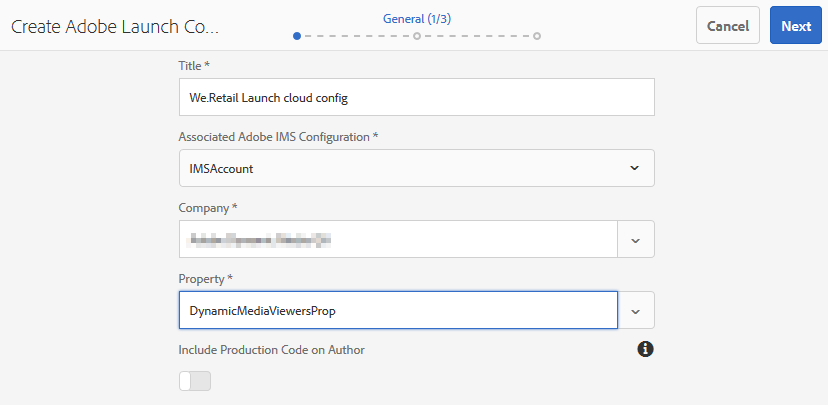

# Dynamic Media ビューアと Adobe Analytics および Adobe Launch の統合 {#integrating-dynamic-media-viewers-with-adobe-analytics-and-adobe-launch}

## Adobe Analytics と Adobe Launch との Dynamic Media ビューアの統合とは {#what-is-dynamic-media-viewers-integration-with-adobe-analytics-and-adobe-launch}

Dynamic Media ビューア 5.13 の最近のリリースと共に、Adobe Launch の新しい *Dynamic Media ビューア*&#x200B;拡張機能を使用すると、Dynamic Media、Adobe Analytics、Adobe Launch のユーザーは、Adobe Launch 設定で Dynamic Media ビューア固有のイベントとデータを使用できます。

この統合により、Adobe Analytics を使用して、Web サイト上での Dynamic Media ビューアの使用状況を追跡できます。同時に、アドビまたはサードパーティ製の他の Launch 拡張機能を持つビューアによって公開されたイベントやデータを使用できます。

拡張機能について詳しくは、Experience Platform Launch ユーザーガイドの[アドビ拡張機能](https://docs.adobe.com/content/help/ja-JP/launch/using/extensions-ref/overview.html)を参照してください。

**このドキュメントの対象読者**：サイト管理者、AEM プラットフォームの開発者および操作者。

### 統合の制限 {#limitations-of-the-integration}

* Dynamic Media ビューアの Adobe Launch 統合は、AEM オーサーノードでは機能しません。公開されるまで、WCM ページからのトラッキングを表示することはできません。
* Dynamic Media ビューアの Adobe Launch 統合は、「ポップアップ」操作モードではサポートされません。このモードでは、ビューアの URL は、アセットの詳細ページの「URL」ボタンを使用して取得されます。
* Adobe Launch 統合は、（`config2=` パラメーターを介して）従来のビューア Analytics 統合とは同時に使用することはできません。
* ビデオトラッキングのサポートは、[トラッキングの概要](https://docs.adobe.com/content/help/ja-JP/media-analytics/using/sdk-implement/track-av-playback/track-core-overview.html)で説明されているように、コア再生トラッキングのみに制限されます。具体的には、QoS、広告、チャプター／セグメント、エラーのトラッキングはサポートされていません。
* データ要素のストレージデュレーション設定は、*Dynamic Media ビューア*&#x200B;拡張機能を使用したデータ要素ではサポートされません。ストレージデュレーションは **[!UICONTROL None]** に設定する必要があります。

### 統合の事例 {#use-cases-for-the-integration}

Adobe Launch の統合の主な事例は、AEM Assets と AEM Sites の両方を使用するお客様です。そのような場合、AEM オーサーノードと Adobe Launch の標準統合を設定し、Site インスタンスを Adobe Launch プロパティに関連付けることができます。その後、Site ページに追加された Dynamic Media WCM コンポーネントは、ビューアのデータとイベントを追跡します。

[AEM Site での Dynamic Media ビューアのトラッキングについて](https://wiki.corp.adobe.com/display/~oufimtse/Dynamic+Media+Viewers+integration+with+Adobe+Launch#DynamicMediaViewersintegrationwithAdobeLaunch-TrackingDynamicMediaViewersinAEMSites)を参照してください。

統合が支える 2 番目の事例は、AEM Assets のみ、または Dynamic Media Classic を使用するお客様です。その場合、ビューアの埋め込みコードを取得して、Web サイトページに追加します。次に、Adobe Launch から Adobe Launch ライブラリ実稼動用 URL を取得し、Web ページのコードに手動で追加します。

[埋め込みコードを使用した Dynamic Media ビューアのトラッキングについて](https://wiki.corp.adobe.com/display/~oufimtse/Dynamic+Media+Viewers+integration+with+Adobe+Launch#DynamicMediaViewersintegrationwithAdobeLaunch-TrackingDynamicMediaViewersusingEmbedcode)を参照してください。

## 統合でのデータとイベントのトラッキングの仕組み {#how-data-and-event-tracking-works-in-the-integration}

この統合では、*Adobe Analytics* と *Adobe Analytics for Audio and Video* という、2 種類の独立したタイプの Dynamic Media ビューアのトラッキングを利用します。

### Adobe Analytics を使用したトラッキングについて {#about-tracking-using-adobe-analytics}

Adobe Analytics を使用すると、エンドユーザーが Web サイト上で Dynamic Media ビューアとやり取りしたときに実行したアクションを追跡できます。また、Adobe Analytics では、ビューア固有のデータも追跡できます。例えば、ビューの読み込みイベントを、アセット名、発生したズーム操作、ビデオ再生操作などと共に追跡して記録できます。

Adobe Launch では、データ要素&#x200B;**&#x200B;とルール&#x200B;**&#x200B;の概念が連携して、Adobe Analytics のトラッキングを有効にします。

#### Adobe Launch のデータ要素について {#about-data-elements-in-adobe-launch}

Adobe Launch のデータ要素は、名前の付いたプロパティです。このプロパティの値は、静的に定義されるか、Web ページの状態や Dynamic Media ビューアのデータに基づいて動的に計算されます。

データ要素の定義で使用できるオプションは、Adobe Launch プロパティにインストールされる拡張機能のリストによって異なります。「コア」拡張機能はプレインストールされ、任意の設定で初期状態で使用できます。この「コア」拡張機能を使用すると、cookie、JavaScript コード、クエリ文字列、その他多くのソースから取得した値を持つデータ要素を定義できます。

Adobe Analytics でトラッキングをおこなう場合は、[拡張機能のインストールとセットアップ](#installing-and-setup-of-extensions)で説明されているように、いくつか追加の拡張機能をインストールする必要があります。Dynamic Media ビューア拡張機能には、Dynamic Viewer イベントの引数である値のデータ要素を定義する機能が追加されています。例えば、ビューアのタイプや、読み込み時にビューアから報告されたアセット名、エンドユーザーがズームしたときに報告されるズームレベルなどが参照できます。

Dynamic Media ビューア拡張機能は、データ要素の値を自動的に最新の状態に保ちます。

定義したデータ要素は、データ要素ピッカーウィジェットを使用して、Adobe Launch UI のその他の場所で使用できます。特に、Dynamic Media ビューアのトラッキングを目的として定義されたデータ要素は、ルール内の Adobe Analytics 拡張機能の変数設定アクションで参照されます（以下を参照）。

詳しくは、Experience Platform Launch ユーザーガイドの[データ要素](https://docs.adobe.com/content/help/ja-JP/launch/using/reference/manage-resources/data-elements.html)を参照してください。

#### Adobe Launch のルールについて {#about-rules-in-adobe-launch}

Adobe Launch のルールは、ルールを構成する、イベント&#x200B;**、条件&#x200B;**、アクション&#x200B;**&#x200B;という 3 つの領域を定義する非依存型の設定です。

* イベント&#x200B;**（if）は、ルールをトリガーするタイミングを Adobe Launch に知らせます。
* 条件&#x200B;**（if）は、ルールのトリガー時に許可または禁止する追加の制限事項を Adobe Launch に知らせます。
* アクション&#x200B;**（then）は、ルールがトリガーされた場合に、Adobe Launch に対して何をおこなうかを指示します。

イベント、条件、アクションのセクションで使用できるオプションは、Adobe Launch プロパティにインストールされている拡張機能によって異なります。コア&#x200B;**&#x200B;拡張機能はプレインストールされており、どのような設定でも初期状態ですぐに使用できます。この拡張機能では、イベントについては、フォーカスの変更、キーの押下、フォームの送信といった、基本的なブラウザーレベルのアクションなどのオプションがいくつか用意されています。また、条件についても、cookie の値、ブラウザータイプなどのオプションが用意されています。アクションについては、カスタムコードオプションのみ使用できます。

Adobe Analytics でトラッキングをおこなう場合は、[拡張機能のインストールとセットアップ](#installing-and-setup-of-extensions)で説明されているように、いくつか追加の拡張機能をインストールする必要があります。具体的には以下のとおりです。

* Dynamic Media ビューア拡張機能は、サポートされるイベントのリストを、ビューアの読み込み、アセットの入れ替え、ズームイン、ビデオ再生など、Dynamic Media ビューアに固有のイベントに拡張します。
* Adobe Analytics 拡張機能は、サポートされるアクションのリストを拡張し、データをトラッキングサーバーに送信するために必要な、変数設定&#x200B;**&#x200B;とビーコン送信&#x200B;**&#x200B;という 2 つのアクションが用意されています。

Dynamic Media ビューアを追跡するには、次のいずれかのタイプを使用できます。

* Dynamic Media ビューア拡張機能、コア拡張機能またはその他の拡張機能からのイベント。
* ルール定義の条件。または、条件領域を空のままにすることもできます。

アクションセクションでは、*変数設定*&#x200B;アクションが必要です。このアクションは、Adobe Analytics にデータを使用してトラッキング変数を設定する方法を知らせます。同時に、*変数設定*&#x200B;アクションは、トラッキングサーバーに何も送信しません。

*変数設定*&#x200B;アクションに続けて、*ビーコン送信*&#x200B;アクションを使用する必要があります。*ビーコン送信*&#x200B;アクションは、実際に Analytics トラッキングサーバーにデータを送信します。*変数設定*&#x200B;と&#x200B;*ビーコン送信*&#x200B;アクションは、いずれも Adobe Analytics 拡張機能から得られます。

詳しくは、Experience Platform Launch ユーザーガイドの[ルール](https://docs.adobe.com/content/help/ja-JP/launch/using/reference/manage-resources/rules.html)を参照してください。

#### サンプル設定 {#sample-configuration}

以下の Adobe Launch のサンプル設定で、ビューアの読み込み時にアセット名を追跡する方法を示します。

1. 「**[!UICONTROL データ要素]**」タブで、Dynamic Media ビューア拡張機能から `LOAD` イベントの `asset` パラメーターを参照するデータ要素 `AssetName` を定義します。

   

1. 「**[!UICONTROL ルール]**」タブで、ルール *TrackAssetOnLoad* を定義します。

   このルールでは、「**[!UICONTROL イベント]**」フィールドは、Dynamic Media ビューア拡張機能の **[!UICONTROL LOAD]** イベントを使用します。

   

1. アクション設定には、Adobe Analytics 拡張機能の 2 つのアクションタイプがあります。

   変数設定&#x200B;**&#x200B;は、選択した分析変数を `AssetName` データ要素の値にマップします。

   *ビーコン送信*&#x200B;は、Adobe Analytics にトラッキング情報を送信します。

   

1. ルール設定結果は次のようになります。

   

### Adobe Analytics for Audio and Video について {#about-adobe-analytics-for-audio-and-video}

Experience Cloud アカウントが Adobe Analytics for Audio and Video を使用するよう登録されている場合、*Dynamic Media ビューア*&#x200B;拡張機能の設定でビデオのトラッキングを有効にするだけで十分です。ビデオ指標が Adobe Analytics で使用できるようになります。ビデオトラッキングは、Adobe Media Analytics for Audio and Video 拡張機能の有無に依存します。

詳しくは、[拡張機能のインストールとセットアップ](#installing-and-setup-of-extensions)を参照してください。

現在、ビデオトラッキングのサポートは、[トラッキングの概要](https://docs.adobe.com/content/help/ja-JP/media-analytics/using/sdk-implement/track-av-playback/track-core-overview.html)で説明されているように、「コア再生」トラッキングのみに制限されます。具体的には、QoS、広告、チャプター／セグメント、エラーのトラッキングはサポートされていません。

## Dynamic Media ビューア拡張機能の使用 {#using-the-dynamic-media-viewers-extension}

「[統合の事例](#use-cases-for-the-integration)」で説明したように、AEM Sites の新規 Adobe Launch 統合で、埋め込みコードを使用して Dynamic Media ビューアを追跡できます。

### AEM Sites での Dynamic Media ビューアのトラッキング {#tracking-dynamic-media-viewers-in-aem-sites}

AEM Sites で Dynamic Media ビューアを追跡するには、[すべての統合ピースの設定](#configuring-all-the-integration-pieces)で説明している手順をすべて実行する必要があります。具体的には、IMS 設定と Adobe Launch クラウド設定を作成する必要があります。

適切な設定に従って、Dynamic Media でサポートされる WCM コンポーネントを使用してサイトページに追加した Dynamic Media ビューアは、Adobe Analytics、Adobe Analytics for Video、またはその両方に対するデータを自動的に追跡します。

詳しくは、[Adobe Sites 使用によるページへの Dynamic Media アセットの追加](/help/assets/dynamic-media/adding-dynamic-media-assets-to-pages.md)を参照してください。

### 埋め込みコードを使用した Dynamic Media ビューアのトラッキング {#tracking-dynamic-media-viewers-using-embed-code}

AEM Sites を使用していない、または AEM Sites 以外の Web ページに Dynamic Media ビューアを埋め込んでいる、またはその両方に該当するお客様は、引き続き Adobe Launch 統合を使用できます。

[Adobe Analytics の設定](#configuring-adobe-analytics-for-the-integration)および [Adobe Launch の設定](#configuring-adobe-launch-for-the-integration)の設定手順を実行する必要があります。ただし、AEM 関連の設定手順は不要です。

適切な設定をおこなえば、Dynamic Media ビューアを使用した Web ページに Adobe Launch サポートを追加できます。

Adobe Launch ライブラリの埋め込みコードの使用方法について詳しくは、[Adobe Launch の埋め込みコードの追加](https://docs.adobe.com/content/help/en/launch/using/implement/configure/implement-the-launch-install-code.html)を参照してください。

AEM Dynamic Media の埋め込みコード機能の使用方法について詳しくは、[Web ページへのビデオビューアまたは画像ビューアの埋め込み](/help/assets/dynamic-media/embed-code.md)を参照してください。

**埋め込みコードを使用して Dynamic Media ビューアを追跡するには**

1. Dynamic Media ビューアを埋め込む Web ページを準備します。
1. 最初に Adobe Launch にログインして、Adobe Launch ライブラリの埋め込みコードを取得します（[Adobe Launch の設定](#configuring-adobe-launch-for-the-integration)を参照）。
1. **[!UICONTROL プロパティ]**&#x200B;をクリックし、「**[!UICONTROL 環境]**」タブをクリックします。
1. Web ページの環境に関連する環境レベルを取得します。次に、「**[!UICONTROL インストール]**」列のボックスアイコンをクリックします。
1. **[!UICONTROL Web インストール手順]**&#x200B;ダイアログボックスで、Adobe Launch ライブラリの埋め込みコード全体と、それを囲む `<script/>` タグをコピーします。

## Dynamic Media ビューア拡張機能リファレンスガイド {#reference-guide-for-the-dynamic-media-viewers-extension}

### Dynamic Media ビューアの設定について {#about-the-dynamic-media-viewers-configuration}

次の条件のすべてに当てはまる場合、Dynamic Media ビューア拡張機能は Adobe Launch ライブラリと自動的に統合されます。

* Adobe Launch ライブラリのグローバルオブジェクト（`_satellite`）がページに存在する。
* Dynamic Media ビューア拡張機能の `_dmviewers_v001()` 関数が、`_satellite` で定義されている。

* `config2=` ビューアパラメーターが指定されていない。つまり、ビューアが従来の Analytics 統合を使用していない。

さらに、ビューアの設定で `launch=0` パラメーターを指定して、ビューアで Adobe Launch の統合を明示的に無効にするオプションもあります。このパラメーターのデフォルト値は `1` です。

### Dynamic Media ビューア拡張機能の設定 {#configuring-the-dynamic-media-viewers-extension}

Dynamic Media ビューア拡張機能の唯一の設定オプションは、**[!UICONTROL Adobe Media Analytics for Audio and Video を有効にする]**&#x200B;です。

このオプションを選択する（有効にする、または「オンにする」）と、Adobe Media Analytics for Audio and Video 拡張機能がインストールされ、適切に設定されている場合、ビデオ再生指標は Adobe Analytics for Audio and Video ソリューションに送信されます。このオプションを無効にすると、ビデオトラッキングがオフになります。

Adobe Media Analytics for Audio and Video 拡張機能をインストール&#x200B;*せずに*&#x200B;このオプションを有効にした場合、このオプションは無効になります。

### Dynamic Media ビューア拡張機能のデータ要素について {#about-data-elements-in-the-dynamic-media-viewers-extension}

Dynamic Media ビューア拡張機能で提供されるデータ要素タイプは、「**[!UICONTROL データ要素タイプ]**」ドロップダウンリストの&#x200B;**[!UICONTROL ビューアイベント]**&#x200B;のみです。

選択すると、データ要素エディターは、次の 2 つのフィールドを含むフォームをレンダリングします。

* **[!UICONTROL DM ビューアイベントデータタイプ]** - 引数を持つ Dynamic Media ビューア拡張機能でサポートされるすべてのビューアイベントと、特別な **[!UICONTROL COMMON]** 項目を識別するドロップダウンリスト。**[!UICONTROL COMMON]** 項目は、ビューアから送信されるすべてのタイプのイベントに共通するイベントパラメーターのリストを表します。
* **[!UICONTROL トラッキングパラメーター-]** - 選択した Dynamic Media ビューアイベントの引数。

各ビューアタイプでサポートされるイベントのリストについては、[Dynamic Media ビューアリファレンスガイド](https://docs.adobe.com/content/help/ja-JP/dynamic-media-developer-resources/library/viewers-aem-assets-dmc/c-html5-s7-aem-asset-viewers.translate.html)を参照し、特定のビューアセクションに移動して、サブセクションの Adobe Analytics トラッキングのサポートをクリックします。現在、Dynamic Media ビューアリファレンスガイドでは、イベントの引数について説明していません。

次に、Dynamic Media ビューアの&#x200B;*データ要素*&#x200B;のライフサイクルを考えてみましょう。このようなデータ要素の値は、対応する Dynamic Media ビューアイベントがページで発生した後に設定されます。例えば、データ要素が **[!UICONTROL LOAD]** イベントとその「asset」引数を指す場合、このようなデータ要素の値は、ビューアが初めて LOAD イベントを実行した後で有効なデータを受け取ります。データ要素が **[!UICONTROL ZOOM]** イベントとその「scale」引数を指す場合、このようなデータ要素の値は、ビューアが初めて **[!UICONTROL ZOOM]** イベントを送信するまで空のままです。

同様に、ビューアがページ上の対応するイベントを送信すると、データ要素の値は自動的に更新されます。値の更新は、特定のイベントがルール設定で指定されていない場合でもおこなわれます。例えば、ZOOM イベントの「scale」パラメーターに対してデータ要素 **[!UICONTROL ZoomScale]** が定義されているが、ルール設定に存在する唯一のルールが **[!UICONTROL LOAD]** イベントによってトリガーされる場合、ユーザーがビューア内でズームを実行するたびに **[!UICONTROL ZoomScale]** の値が更新されます。

Dynamic Media ビューアは Web ページ上で一意の識別子を持ちます。データ要素は、値自体と、値が入力されたビューアを追跡します。つまり、同じページに複数のビューアがあり、**[!UICONTROL LOAD]** イベントとその「asset」引数を指す **[!UICONTROL AssetName]** データ要素がある場合、**[!UICONTROL AssetName]** データ要素は、ページに読み込まれた各ビューアに関連付けられたアセット名のコレクションを保持します。

データ要素から返される正確な値は、コンテキストによって異なります。Dynamic Media ビューアイベントによってトリガーされたルール内でデータ要素が要求された場合、ルールを開始したビューアに対してデータ要素の値が返されます。また、その他の Adobe Launch 拡張機能からイベントによってトリガーされたルール内でデータ要素が要求された場合、データ要素の値は、このデータ要素を更新する最後の値となったビューアからの値になります。

**次のサンプル設定を考えてみましょう**。

* 2 つの Dynamic Media ズームビューアを持つ Web ページ。これらのビューアを、*viewer1* および *viewer2* と呼ぶことにします。

* **[!UICONTROL ZoomScale]** データ要素は、**[!UICONTROL ZOOM]** イベントとその「scale」引数を指します。
* **[!UICONTROL TrackPan]** ルールには、次の情報が含まれます。

   * Dynamic Media ビューアの **[!UICONTROL PAN]** イベントをトリガーとして使用。
   * **[!UICONTROL ZoomScale]** データ要素の値を Adobe Analytics に送信。

* 
   * **[!UICONTROL TrackKey]** ルールには、次の情報が含まれます。

   * Adobe Launch のコア拡張機能のキー押下イベントをトリガーとして使用。
   * **[!UICONTROL ZoomScale]** データ要素の値を Adobe Analytics に送信。

ここで、エンドユーザーが 2 つのビューアで Web ページを読み込んだとします。*viewer1* では 50％の拡大率でズームインし、次に、*viewer2* では 25％の拡大率でズームインします。*viewer1* では、画像がパンされ、最後にキーボードのキーが押されます。

エンドユーザーのアクティビティによって、Adobe Analytics に対して次の 2 つのトラッキングコールが実行されます。

* 最初の呼び出しは、ユーザーが *viewer1* でパンしたときに **[!UICONTROL TrackPan]** ルールがトリガーされることから発生します。この呼び出しでは、ルールが *viewer1* によってトリガーされたことをデータ要素が認識し、対応するスケール値が取得されるので、**[!UICONTROL ZoomScale]** データ要素の値として 50％が送信されます。
* 2 回目の呼び出しは、ユーザーがキーボードのキーを押したときに **[!UICONTROL TrackKey]** ルールがトリガーされるので発生します。ルールをトリガーしたのがビューアでなかったので、この呼び出しでは **[!UICONTROL ZoomScale]** データ要素の値として 25％が送信されます。このようにして、データ要素は最新の値を返します。

上記のサンプル設定は、データ要素の値の寿命にも影響します。Dynamic Media ビューアで管理されるデータ要素の値は、Web ページにビューア自体が配置された後でも、Adobe Launch ライブラリコードに保存されます。つまり、Dynamic Media ビューア拡張機能以外からトリガーされるルールがあり、そのようなデータ要素を参照する場合、ビューアが Web ページに存在しなくなっても、データ要素は最後に認識された値を返します。

いずれの場合も、Dynamic Media ビューアによって駆動されるデータ要素の値は、ローカルストレージやサーバーに保存されません。代わりに、クライアント側の Adobe Launch ライブラリにのみ保存されます。Web ページがリロードされると、このようなデータ要素の値は消去されます。

一般に、データ要素エディターでは、[ストレージ期間の選択](https://docs.adobe.com/content/help/ja-JP/launch/using/reference/manage-resources/data-elements.html#create-a-data-element)がサポートされます。ただし、Dynamic Media ビューア拡張機能を使用するデータ要素は、ストレージ期間「**[!UICONTROL なし]**」オプションのみサポートします。その他の値はユーザーインターフェイスで設定可能ですが、この場合、データ要素の動作は定義されていません。拡張機能は、データ要素の値を独自に管理します。データ要素は、ビューアのライフサイクル全体でビューアのイベント引数の値を維持します。

### Dynamic Media ビューア拡張機能のルールについて {#about-rules-in-the-dynamic-media-viewers-extension}

ルールエディターで、イベントエディターの新しい設定オプションが追加されます。また、事前に設定されたデータ要素を使用する代わりに、アクションエディターでイベントパラメーターを手動で参照する簡略オプションも用意されています。

#### イベントエディターについて {#about-the-events-editor}

Dynamic Media ビューア拡張機能によって、イベントエディターで&#x200B;**[!UICONTROL ビューアイベント]**&#x200B;と呼ばれる新しい&#x200B;**[!UICONTROL イベントタイプ]**&#x200B;が追加されます。

選択すると、イベントエディターによって「**[!UICONTROL Dynamic Media ビューアイベント]**」ドロップダウンがレンダリングされ、Dynamic Media ビューアでサポートされる使用可能なイベントがすべて表示されます。

#### アクションエディターについて {#about-the-actions-editor}

Dynamic Media ビューア拡張機能を使用すると、Dynamic Media ビューアのイベントパラメーターを使用して、Adobe Analytics 拡張機能の変数設定エディターで分析変数にマッピングできます。

最も簡単な方法は、次の 2 つの手順を実行することです。

* まず、1 つ以上のデータ要素を定義します。各データ要素は、Dynamic Media ビューアイベントのパラメーターを表します。
* 最後に、Adobe Analytics 拡張機能の変数設定エディターで、データ要素ピッカーアイコン（3 つの重なったディスク）をクリックし、データ要素を選択ダイアログボックスを開き、データ要素を選択します。

ただし、別の方法を使用して、データ要素の作成をスキップすることは可能です。Analytics の変数割り当ての「**[!UICONTROL 値]**」入力フィールドにイベント引数の完全修飾名を入力し、パーセント記号（％）で囲んで、Dynamic Media ビューアイベントから引数を直接参照できます。例：

`%event.detail.dm.LOAD.asset%`

データ要素を使用する場合と、直接イベント引数の参照を使用する場合では、重要な違いがあることに注意してください。データ要素の場合、どのイベントが変数設定アクションをトリガーしても、ルールをトリガーするイベントは、ダイナミックビューアとは無関係にすることができます（例えば、コア拡張機能から Web ページをマウスクリックする場合）。ただし、直接引数参照を使用する場合は、ルールをトリガーするイベントが、参照するイベント引数に対応していることを確認することが重要です。

例えば、`%event.detail.dm.LOAD.asset%` の参照は、ルールが Dynamic Media ビューア拡張機能の **[!UICONTROL LOAD]** イベントによってトリガーされる場合、正しいアセット名を返します。ただし、他のイベントの場合は空の値を返します。

次の表に、Dynamic Media ビューアイベントと、サポートされている引数を示します。

<table>
 <tbody>
  <tr>
   <td>ビューアのイベント名</td>
   <td>引数の参照</td>
  </tr>
  <tr>
   <td><code>COMMON</code></td>
   <td><code>%event.detail.dm.objID%</code></td>
  </tr>
  <tr>
   <td> </td>
   <td><code>%event.detail.dm.compClass%</code></td>
  </tr>
  <tr>
   <td> </td>
   <td><code>%event.detail.dm.instName%</code></td>
  </tr>
  <tr>
   <td> </td>
   <td><code>%event.detail.dm.timeStamp%</code></td>
  </tr>
  <tr>
   <td><code>BANNER</code> </td>
   <td><code>%event.detail.dm.BANNER.asset%</code></td>
  </tr>
  <tr>
   <td> </td>
   <td><code>%event.detail.dm.BANNER.frame%</code></td>
  </tr>
  <tr>
   <td> </td>
   <td><code>%event.detail.dm.BANNER.label%</code></td>
  </tr>
  <tr>
   <td><code>HREF</code></td>
   <td><code>%event.detail.dm.HREF.rollover%</code></td>
  </tr>
  <tr>
   <td><code>ITEM</code></td>
   <td><code>%event.detail.dm.ITEM.rollover%</code></td>
  </tr>
  <tr>
   <td><code>LOAD</code></td>
   <td><code>%event.detail.dm.LOAD.applicationname%</code></td>
  </tr>
  <tr>
   <td><strong> </strong></td>
   <td><code>%event.detail.dm.LOAD.asset%</code></td>
  </tr>
  <tr>
   <td><strong> </strong></td>
   <td><code>%event.detail.dm.LOAD.company%</code></td>
  </tr>
  <tr>
   <td><strong> </strong></td>
   <td><code>%event.detail.dm.LOAD.sdkversion%</code></td>
  </tr>
  <tr>
   <td><strong> </strong></td>
   <td><code>%event.detail.dm.LOAD.viewertype%</code></td>
  </tr>
  <tr>
   <td><strong> </strong></td>
   <td><code>%event.detail.dm.LOAD.viewerversion%</code></td>
  </tr>
  <tr>
   <td><code>METADATA</code></td>
   <td><code>%event.detail.dm.METADATA.length%</code></td>
  </tr>
  <tr>
   <td> </td>
   <td><code>%event.detail.dm.METADATA.type%</code></td>
  </tr>
  <tr>
   <td><code>MILESTONE</code></td>
   <td><code>%event.detail.dm.MILESTONE.milestone%</code></td>
  </tr>
  <tr>
   <td><code>PAGE</code></td>
   <td><code>%event.detail.dm.PAGE.frame%</code></td>
  </tr>
  <tr>
   <td> </td>
   <td><code>%event.detail.dm.PAGE.label%</code></td>
  </tr>
  <tr>
   <td><code>PAUSE</code></td>
   <td><code>%event.detail.dm.PAUSE.timestamp%</code></td>
  </tr>
  <tr>
   <td><code>PLAY</code></td>
   <td><code>%event.detail.dm.PLAY.timestamp%</code></td>
  </tr>
  <tr>
   <td><code>SPIN</code></td>
   <td><code>%event.detail.dm.SPIN.framenumber%</code></td>
  </tr>
  <tr>
   <td><code>STOP</code></td>
   <td><code>%event.detail.dm.STOP.timestamp%</code></td>
  </tr>
  <tr>
   <td><code>SWAP</code></td>
   <td><code>%event.detail.dm.SWAP.asset%</code></td>
  </tr>
  <tr>
   <td><code>SWATCH</code></td>
   <td><code>%event.detail.dm.SWATCH.frame%</code></td>
  </tr>
  <tr>
   <td> </td>
   <td><code>%event.detail.dm.SWATCH.label%</code></td>
  </tr>
  <tr>
   <td><code>TARG</code></td>
   <td><code>%event.detail.dm.TARG.frame%</code></td>
  </tr>
  <tr>
   <td> </td>
   <td><code>%event.detail.dm.TARG.label%</code></td>
  </tr>
  <tr>
   <td><code>ZOOM</code></td>
   <td><code>%event.detail.dm.ZOOM.scale%</code></td>
  </tr>
 </tbody>
</table>

## すべての統合ピースの設定 {#configuring-all-the-integration-pieces}

**始める前に**

この節を読む前に、すべてのドキュメントを十分に確認し、統合について包括的に理解しておくことをお勧めします。

ここでは、Dynamic Media ビューアを Adobe Analytics および Adobe Analytics for Audio and video と統合するために必要な設定手順について説明します。Dynamic Media ビューア拡張機能を Adobe Launch の他の目的で使用することは可能ですが、ここでは扱いません。

次のアドビ製品で統合を設定します。

* Adobe Analytics - トラッキング変数とレポートを設定します。
* Adobe Launch - ビューアトラッキングを有効にするプロパティ、1 つ以上のルールおよび 1 つ以上のデータ要素を定義します。

さらに、この統合ソリューションを AEM Sites で使用する場合は、次の設定もおこなう必要があります。

* Adobe I/O コンソール - Adobe Launch 用に統合が作成されます。
* AEM オーサーノード - IMS 設定および Adobe Launch クラウド設定

設定の一環として、Adobe Analytics と Adobe Launch が既に有効になっている Adobe Experience Cloud の会社にアクセスできることを確認してください。

## 統合のための Adobe Analytics の設定 {#configuring-adobe-analytics-for-the-integration}

Adobe Analytics を設定した後、統合のために次の設定がおこなわれます。

* レポートスイートが配置され、選択される。
* Analytics 変数がトラッキングデータを受け取るために使用可能になる。
* Adobe Analytics 内で収集されたデータを表示するレポートが使用可能になる。

[Analytics 導入ガイド](https://docs.adobe.com/content/help/ja-JP/analytics/implementation/home.html)も参照してください。

**統合のために Adobe Analytics を設定するには**：

1. まず、Experience Cloud [ホームページ](https://exc-home.experiencecloud.adobe.com/exc-home/home.html#/)から Adobe Analytics にアクセスします。メニューバーで、ページの右上隅付近にあるソリューションアイコン（3 x 3 のドットテーブル）をクリックし、**[!UICONTROL Analytics]** をクリックします。

   

   次に、レポートスイートを選択します。

### レポートスイートの選択 {#selecting-a-report-suite}

1. Adobe Analytics ページの右上隅近くの「**[!UICONTROL レポートの検索]**」フィールドの右側にあるドロップダウンリストから、適切なレポートスイートを選択します。複数のレポートスイートが使用可能で、どれを使用するか不明な場合は、Adobe Analytics 管理者が使用するレポートスイートを選択するのに役立ちます。

   下の図では、ユーザーが *DynamicMediaViewersExtensionDoc* という名前のレポートスイートを作成し、ドロップダウンリストから選択しています。レポートスイート名は説明用です。最終的に選択するレポートスイートの名前は異なります。

   使用できるレポートスイートがない場合は、設定を続行する前に、ユーザーまたは Adobe Analytics 管理者がレポートスイートを作成する必要があります。

   [レポートとレポートスイート](https://docs.adobe.com/content/help/ja-JP/analytics/admin/manage-report-suites/report-suites-admin.html)および[レポートスイートの作成](https://docs.adobe.com/content/help/ja-JP/analytics/admin/admin-console/create-report-suite.html)を参照してください。

   Adobe Analytics では、**[!UICONTROL 管理者／レポートスイート]**&#x200B;でレポートスイートを管理します。

   

   Adobe Analytics 変数を設定します。

### Adobe Analytics 変数の設定 {#setting-up-adobe-analytics-variables}

1. Web ページ上の Dynamic Media ビューアの動作を追跡するために使用する、1 つ以上の Adobe Analytics 変数を指定します。

   Adobe Analytics でサポートされている任意のタイプの変数を使用できます。変数タイプ（カスタムトラフィック [prop] や、コンバージョン [eVar] など）に関する決定は、Adobe Analytics 実装の特定のニーズによっておこなう必要があります。

   [prop と eVar の概要](https://docs.adobe.com/content/help/ja-JP/analytics/implementation/vars/page-vars/evar.html)を参照してください。

   このドキュメントの目的では、カスタムトラフィック（prop）変数のみが使用されます。これは、Web ページでアクションが発生してから数分以内にアナリティクスレポートで使用できるようになるためです。

   新しいカスタムトラフィック変数を有効にするには、Adobe Analytics のツールバーで、**[!UICONTROL 管理者／レポートスイート]**&#x200B;をクリックします。

1. **[!UICONTROL レポートスイート管理]**&#x200B;ページで正しいレポートを選択し、ツールバーで&#x200B;**[!UICONTROL 設定を編集／トラフィック／トラフィック変数]**&#x200B;をクリックします。
1. ここで、未使用の変数を取得し、わかりやすい名前を付け（**[!UICONTROL ビューアアセット（prop 30）]**）、「有効」列のコンボボックスを「有効」に変更します。

   次のスクリーンショットは、ビューアが使用するアセット名を追跡するためのカスタムトラフィック変数（**[!UICONTROL prop30]**）の例です。

   

1. 変数リストの下部で、「**[!UICONTROL 保存]**」をクリックします。

### レポートの設定 {#setting-up-a-report}

1. 一般に、Adobe Analytics でのレポートの設定は、特定のプロジェクトのニーズに左右されます。したがって、詳細なレポート設定は、この統合の範囲外です。

   ただし、**[Adobe Analytics 変数の設定](#setting-up-adobe-analytics-variables)**でカスタムトラフィック変数を設定すると、カスタムトラフィックレポートが Adobe Analytics で自動的に使用可能になることはわかります。

   例えば、**[!UICONTROL ビューアアセット（prop 30）]**&#x200B;変数のレポートは、**[!UICONTROL カスタムトラフィック／カスタムトラフィック 21～30／ビューアアセット（prop 30）]**&#x200B;下のレポートメニューから使用できます。

   **[!UICONTROL ビューアアセット（prop 30）]**&#x200B;を作成した直後にこのレポートを表示すると、データが表示されません。これは、統合のこの時点で予想されることです。

   

## 統合のための Adobe Launch の設定 {#configuring-adobe-launch-for-the-integration}

Adobe Launch を設定した後、統合に対して次の設定がおこなわれます。

* すべての設定をまとめるための新しいプロパティの作成。
* 拡張機能のインストールとセットアップ。プロパティにインストールされたすべての拡張機能のクライアント側コードは、1 つのライブラリにまとめられる。このライブラリは後で Web ページで使用されます。
* データ要素とルールの設定。この設定は、Dynamic Media ビューアから取得するデータ、トラッキングロジックをトリガーするタイミング、Adobe Analytics でビューアのデータを送信する場所を定義するものです。
* ライブラリの公開。

**統合のために Adobe Launch を設定するには**：

1. まず、Experience Cloud の[ホームページ](https://exc-home.experiencecloud.adobe.com/exc-home/home.html#/)から Adobe Launch にアクセスします。メニューバーで、ページの右上隅付近にあるソリューションアイコン（3 x 3 ドットのテーブル）をクリックし、**[!UICONTROL Launch]** をクリックします。

   [Adobe Launch を直接開く](https://launch.adobe.com/)こともできます。

   

### Adobe Launch でのプロパティの作成 {#creating-a-property-in-adobe-launch}

Adobe Launch のプロパティは、すべての設定をまとめた名前付き設定です。構成設定のライブラリが様々な環境レベル（開発、ステージングおよび実稼動）で生成され、公開されます。

[プロパティの作成](https://docs.adobe.com/content/help/en/launch/using/implement/configure/create-a-property.html)も参照してください。

1. Adobe Launch で、**[!UICONTROL 新しいプロパティ]**&#x200B;をクリックします。
1. **[!UICONTROL プロパティを作成]**&#x200B;ダイアログボックスの「**[!UICONTROL 名前]**」フィールドに、Web サイトのタイトルなど、わかりやすい名前を入力します。例：`DynamicMediaViewersProp.`
1. 「**[!UICONTROL ドメイン]**」フィールドに、Web サイトのドメインを入力します。
1. 使用したい拡張機能（この場合は *Dynamic Media ビューア*）がまだリリースされていない場合に備えて、「**[!UICONTROL 詳細オプション]**」ドロップダウンで、**[!UICONTROL 拡張機能の開発用に設定（後で変更できません）]**&#x200B;を有効にします。

   

1. 「**[!UICONTROL 保存]**」をクリックします。

   新しく作成されたプロパティをクリックし、*拡張機能のインストールとセットアップ*&#x200B;に進みます。

### 拡張機能のインストールとセットアップ {#installing-and-setup-of-extensions}

Adobe Launch で使用可能なすべての拡張機能は、**[!UICONTROL 拡張機能／カタログ]**&#x200B;に一覧表示されます。

拡張機能をインストールするには、「**[!UICONTROL インストール]**」をクリックします。必要に応じて、1 回限りの拡張機能の設定を実行し、「**[!UICONTROL 保存]**」をクリックします。

必要に応じて、次の拡張機能をインストールし、設定する必要があります。

* （必須）*Experience Cloud ID サービス*&#x200B;拡張機能

追加の設定は必要ありません。提案されたあらゆる値を受け入れます。完了したら、必ず「**[!UICONTROL 保存]**」をクリックします。

詳しくは、[Experience Cloud ID サービス拡張機能](https://docs.adobe.com/content/help/ja-JP/launch/using/extensions-ref/adobe-extension/id-service-extension/overview.html)を参照してください。

* （必須）*Adobe Analytics 拡張機能*

この拡張機能を設定するには、まず Adobe Analytics の&#x200B;**[!UICONTROL 管理者／レポートスイート]**&#x200B;の「**[!UICONTROL レポートスイート ID]** 」列見出しにある、レポートスイート ID が必要です。

（デモ目的でのみ、以下のスクリーンショットで **[!UICONTROL DynamicMediaViewersExtensionDoc]** レポートスイートのレポートスイート ID が使用されます。この ID は、以前の[レポートスイートの選択](#selecting-a-report-suite)で作成および使用されていました）

拡張機能のインストールページで、「**[!UICONTROL 開発レポートスイート]**」フィールド、「**[!UICONTROL ステージングレポートスイート]**」フィールド、「**[!UICONTROL 実稼動レポートスイート]**」フィールドに、レポートスイート ID を入力します。

*ビデオトラッキングを使用する予定の場合のみ、次の項目を設定します。*

**[!UICONTROL 拡張機能のインストール]**&#x200B;ページで、「**[!UICONTROL 一般]**」を展開し、「トラッキングサーバー」を指定します。トラッキングサーバーはテンプレート `<trackingNamespace>.sc.omtrdc.net` に従います。`<trackingNamespace>` は、プロビジョニング電子メールで取得した情報です。

「**[!UICONTROL 保存]**」をクリックします。

詳しくは、[Adobe Analytics 拡張機能](https://docs.adobe.com/content/help/ja-JP/launch/using/extensions-ref/adobe-extension/analytics-extension/overview.html)を参照してください。

* （オプション。ビデオトラッキングが必要な場合のみ必須）*Adobe Media Analytics for Audio and Video* 拡張機能

「トラッキングサーバー」フィールドに入力します。*Adobe Media Analytics for Audio and Video* 拡張機能のトラッキングサーバーは、Adobe Analytics で使用されるトラッキングサーバーとは異なります。これはテンプレート `<trackingNamespace>.hb.omtrdc.net` に従います。`<trackingNamespace>` は、プロビジョニング電子メールの情報です。

その他のフィールドはオプションです。

詳しくは、[Adobe Media Analytics for Audio and Video 拡張機能](https://docs.adobe.com/content/help/ja-JP/launch/using/extensions-ref/adobe-extension/media-analytics-extension/overview.html)を参照してください。

* （必須）** Dynamic Media ビューア拡張機能

**[!UICONTROL ビデオ分析を有効にする]**&#x200B;を選択して、ビデオハートビートトラッキングを有効（オン）にします。

このドキュメントの作成時点では、*Dynamic Media ビューア*&#x200B;拡張機能は、開発用に Adobe Launch プロパティが作成されている場合にのみ使用できます。

詳しくは、[Adobe Launch でのプロパティの作成](#creating-a-property-in-adobe-launch)を参照してください。

拡張機能のインストールと設定が完了すると、少なくとも次の 5 つの拡張機能（ビデオをトラッキングしていない場合は 4 つ）が拡張機能／インストール領域に表示されます。

### データ要素とルールの設定 {#setting-up-data-elements-and-rules}

Adobe Launch で、Dynamic Media ビューアのトラッキングに必要なデータ要素とルールを作成します。

Adobe Launch を使用したトラッキングの概要については、[統合でのデータとイベントのトラッキングの仕組み](#how-data-and-event-tracking-works-in-the-integration)を参照してください。

ビューアの読み込み時にアセット名を追跡する方法を示す Adobe Launch のサンプル設定については、[サンプル設定](#sample-configuration)を参照してください。

拡張機能の機能について詳しくは、[Dynamic Media ビューア拡張機能の設定](#configuring-the-dynamic-media-viewers-extension)を参照してください。

### ライブラリの公開 {#publishing-a-library}

Adobe Launch の設定（プロパティ、拡張機能、ルール、データ要素の設定を含む）を変更するには、そのような変更を&#x200B;*公開*&#x200B;する必要があります。Adobe Launch での公開は、プロパティ設定の「公開」タブから実行します。

Adobe Launch には、複数の開発環境、1 つのステージング環境、1 つの実稼動環境が存在する場合があります。デフォルトでは、AEM の Adobe Launch クラウド設定は、AEM オーサーノードを Adobe Launch のステージング環境に、AEM パブリッシュノードを Adobe Launch の実稼動環境にポイントします。この配置は、デフォルトの AEM 設定で、Adobe Launch ライブラリを AEM オーサーで使用するためにステージング環境に公開し、AEM パブリッシュで使用できるように実稼動環境に公開する必要があることを意味します。

Adobe Launch 環境について詳しくは、[環境](https://docs.adobe.com/content/help/ja-JP/launch/using/reference/publish/environments.html)を参照してください。

ライブラリの公開には、次の 2 つの手順を実行します。

* 必要な変更（新しい変更や更新）をすべてライブラリに含めて、新しいライブラリを追加して構築。
* 様々な環境レベルでのライブラリの移動（開発からステージングおよび実稼動へ）。

#### 新しいライブラリの追加と構築 {#adding-and-building-a-new-library}

1. Adobe Launch で初めて「公開」タブを開くと、ライブラリリストは空になります。

   左の列で、「**[!UICONTROL 新しいライブラリを追加]**」をクリックします。

   

1. 新しいライブラリを作成ページの「**[!UICONTROL 名前]**」フィールドに、新しいライブラリのわかりやすい名前を入力します。例：

   *DynamicMediaViewersLib*

   「環境」ドロップダウンリストから、環境レベルを選択します。最初は、選択できるのは開発レベルのみです。ページの左下近くにある「**[!UICONTROL 変更されたすべてのリソースを追加]**」をクリックします。

   

1. ページの右上隅にある「**[!UICONTROL 開発用に保存してビルド]**」をクリックします。

   数分でライブラリが作成され、使用できる状態になります。

   

   >[!NOTE]
   >
   >次回 Adobe Launch の設定を変更する場合は、**[!UICONTROL プロパティ]**&#x200B;設定の下の「**[!UICONTROL 公開]**」タブに移動し、以前に作成したライブラリをクリックします。
   >
   >
   >ライブラリの公開画面で、「**[!UICONTROL 変更されたすべてのリソースを追加]**」をクリックし、「**[!UICONTROL 開発用に保存してビルド]**」をクリックします。

#### 環境レベルでのライブラリの移動 {#moving-a-library-up-through-environment-levels}

1. 新しいライブラリが追加されると、そのライブラリはまず開発環境に配置されます。これをステージング環境レベル（「送信済み」列に対応）に移動するには、ライブラリのドロップダウンメニューで「**[!UICONTROL 承認用に送信]**」をクリックします。

   

1. 確認ダイアログボックスで、「**[!UICONTROL 送信]**」をクリックします。

   ライブラリが「送信済み」列に移動した後、ライブラリのドロップダウンメニューで、「**[!UICONTROL ステージング用にビルド]**」をクリックします。

   

1. 同様のプロセスに従って、ステージング環境から実稼動環境（「公開済み」列）にライブラリを移動します。

   まず、ドロップダウンメニューの「**[!UICONTROL 公開の承認]**」をクリックします。

   

1. ドロップダウンメニューの「**[!UICONTROL ビルドして実稼動環境に公開]**」をクリックします。

   

   Adobe Launch での公開プロセスについて詳しくは、[公開](https://docs.adobe.com/content/help/ja-JP/launch/using/reference/publish/overview.html)を参照してください。

## 統合のための Adobe Experience Manager の設定 {#configuring-adobe-experience-manager-for-the-integration}

<!-- Prerequisites lost below should be verified by Sasha -->

前提条件：

* AEM は、オーサーインスタンスとパブリッシュインスタンスの両方を実行します。
* AEM オーサーノードは Dynamic Media で設定されます。<!-- Scene7 run mode (dynamicmedia_s7) -->
* Dynamic Media WCM コンポーネントは AEM Sites で有効になっています。

AEM 設定は、次の 2 つの主な手順で構成されます。

* AEM IMS の設定。
* Adobe Launch クラウドの設定。

### AEM IMS の設定 {#configuring-aem-ims}

1. AEM オーサーで、ツールアイコン（ハンマー）をクリックし、**[!UICONTROL セキュリティ／Adobe IMS 設定]**&#x200B;をクリックします。

   

1. Adobe IMC 設定ページの左上隅付近にある「**[!UICONTROL 作成]**」をクリックします。
1. **[!UICONTROL Adobe IMS テクニカルアカウント設定]**&#x200B;ページの「**[!UICONTROL クラウドソリューション]**」ドロップダウンリストで、「**[!UICONTROL Adobe Launch]**」をクリックします。
1. 「**[!UICONTROL 新しい証明書を作成]**」を有効にし、テキストフィールドに証明書に意味のある値を入力します。例えば、*AdobeLaunchIMSCert* と入力します。「**[!UICONTROL 証明書を作成]**」をクリックします。

   次の情報メッセージが表示されます。

   *有効なアクセストークンを取得するには、新しい証明書の公開鍵を Adobe I/O のテクニカルアカウントに追加する必要があります。*

   「**[!UICONTROL OK]**」をクリックして、情報ダイアログボックスを閉じます。

   

1. 「**[!UICONTROL 公開鍵をダウンロード]**」をクリックして、公開鍵ファイル（`*.crt`）をローカルシステムにダウンロードします。

   >[!NOTE]
   >
   >この時点で、**[!UICONTROL Adobe IMS テクニカルアカウント設定ページを***&#x200B;開いたまま&#x200B;***にします。ページは]**&#x200B;閉じずに&#x200B;******、「***次へ***」もクリックしません。このページには、手順の後半で戻ってきます。

   

1. 新しいブラウザータブで、[Adobe I/O コンソール](https://console.adobe.io/integrations)に移動します。

1. **[!UICONTROL Adobe I/O コンソール統合]**&#x200B;ページの右上隅近くにある「**[!UICONTROL 新規の統合]**」をクリックします。
1. **[!UICONTROL 統合の新規作成]**&#x200B;ダイアログボックスで、「**[!UICONTROL API へのアクセス]**」ラジオボタンが選択されていることを確認し、「**[!UICONTROL 続行]**」をクリックします。

   

1. **[!UICONTROL 統合の新規作成]**&#x200B;の 2 ページ目で、「**[!UICONTROL Experience Platform Launch API]**」ラジオボタンを有効（オン）にします。ページの右下隅にある「**[!UICONTROL 続行]**」をクリックします。

   

1. **[!UICONTROL 統合の新規作成]**&#x200B;の 3 ページ目で、次の操作をおこないます。

   * 「**[!UICONTROL 名前]**」フィールドにわかりやすい名前を入力します。例えば、*DynamicMediaViewersIO* と入力します。

   * 「**[!UICONTROL 説明]**」フィールドに、統合の説明を入力します。

   * 「**[!UICONTROL 公開鍵証明書]**」領域に、この手順で以前にダウンロードした公開鍵ファイル（`*.crt`）をアップロードします。

   * 「**[!UICONTROL Experience Platform Launch API 用の役割を選択]**」の見出しの下から「**[!UICONTROL 管理者]**」を選択します。

   * 「**[!UICONTROL Experience Platform Launch API 用の製品プロファイルを 1 つ以上選択]**」の見出しの下から、**[!UICONTROL Launch - &lt;your_company_name>]**&#x200B;という名前の製品プロファイルを選択します。

   

1. 「**[!UICONTROL 統合を作成]**」をクリックします。
1. **[!UICONTROL 統合が作成された]**&#x200B;ページで、「**[!UICONTROL 統合の詳細を続行]**」をクリックします。

   

1. 次のような統合の詳細ページが表示されます。

   >[!NOTE]
   >
   >***この統合の詳細ページは開いたままにします***。「**[!UICONTROL 概要]**」タブと「**[!UICONTROL JWT]**」タブの様々な情報がすぐに必要になります。

   
   _統合の詳細ページ_

1. 前に開いておいた **[!UICONTROL Adobe IMS テクニカルアカウント設定]**&#x200B;ページに戻ります。ページの右上隅にある「**[!UICONTROL 次へ]**」をクリックして、**[!UICONTROL Adobe IMS テクニカルアカウント設定]**&#x200B;ウィンドウで&#x200B;**[!UICONTROL アカウント]**&#x200B;ページを開きます。

   前に誤ってページを閉じてしまった場合は、AEM オーサーに戻って、**[!UICONTROL ツール／セキュリティ／Adobe IMS 設定]**&#x200B;をクリックします。「**[!UICONTROL 作成]**」をクリックします。「**[!UICONTROL クラウドソリューション]**」ドロップダウンリストから、「**[!UICONTROL Adobe Launch]**」を選択します。「**[!UICONTROL 証明書]**」ドロップダウンリストで、以前に作成した証明書の名前を選択します。

   
   _Adobe IMS テクニカルアカウント設定 - 証明書ページ_

1. **[!UICONTROL アカウント]**&#x200B;ページには 5 つのフィールドがあり、前の手順の統合の詳細ページから情報を使用して入力する必要があります。

   
   _Adobe IMS テクニカルアカウント設定 - アカウントページ_

1. **[!UICONTROL アカウント]**&#x200B;ページで以下のフィールドに入力します。

   * **[!UICONTROL タイトル]** - 説明的なアカウントのタイトルを入力します。
   * **[!UICONTROL 認証サーバー]** - 以前に開いた統合の詳細ページに戻ります。「**[!UICONTROL JWT]**」タブをクリックします。次に示すように、サーバー名（パスを除く）をコピーします。

（サーバー名の例は説明用です）   **[!UICONTROL アカウント]**ページに戻り、その名前を各フィールドに貼り付けます。
例：`https://ims-na1.adobelogin.com/`（サーバー名の例は説明用です）。

   
   _統合の詳細ページ - 「JWT」タブ_

1. **[!UICONTROL API キー]** - 統合の詳細ページに戻ります。「**[!UICONTROL 概要]**」タブをクリックし、「**[!UICONTROL API キー（クライアント ID）]**」フィールドの右にある「**[!UICONTROL コピー]**」をクリックします。

   **[!UICONTROL アカウント]**&#x200B;ページに戻り、キーを各フィールドに貼り付けます。

   
   _統合の詳細ページ_

1. **[!UICONTROL クライアントシークレット]** - 統合の詳細ページに戻ります。「**[!UICONTROL 概要]**」タブで、「**[!UICONTROL クライアントシークレットを取得]**」をクリックします。「**[!UICONTROL クライアントシークレット]**」フィールドの右側の「**[!UICONTROL コピー]**」をクリックします。

   **[!UICONTROL アカウント]**&#x200B;ページに戻り、キーを各フィールドに貼り付けます。

1. **[!UICONTROL ペイロード]** - 統合の詳細ページに戻ります。「**[!UICONTROL JWT]**」タブの「JWT ペイロード」フィールドで、JSON オブジェクトコード全体をコピーします。

   **[!UICONTROL アカウント]**&#x200B;ページに戻り、コードを各フィールドに貼り付けます。

   
   _統合の詳細ページ - 「JWT」タブ_

   すべてのフィールドに値が入力されたアカウントページは、次のようになります。

   

1. ****&#x200B;アカウントページの右上隅にある「**[!UICONTROL 作成]**」をクリックします。

   AEM IMS が設定され、**[!UICONTROL Adobe IMS 設定]**&#x200B;に新しい IMSAccount が表示されます。

   

## 統合のための Adobe Launch クラウドの設定 {#configuring-adobe-launch-cloud-for-the-integration}

1. AEM オーサーの左上隅近くにあるツールアイコン（ハンマー）をクリックし、**[!UICONTROL Cloud Services／Adobe Launch 設定]**&#x200B;をクリックします。

   

1. Adobe Launch 設定&#x200B;**[!UICONTROL ページの左パネルで]**、Adobe Launch 設定を適用する AEM のサイトを選択します。

   以下のスクリーンショットでは、**[!UICONTROL We.Retail]** サイトが選択されています。

   

1. ページの左上隅近くにある「**[!UICONTROL 作成]**」をクリックします。
1. **[!UICONTROL Adobe Launch 設定の作成]**&#x200B;ウィンドウの&#x200B;**[!UICONTROL 一般]**&#x200B;ページ（1/3 ページ）で、次のフィールドに入力します。

   * **[!UICONTROL タイトル]** - 説明的な設定のタイトルを入力します。例： `We.Retail Launch cloud configuration`

   * **[!UICONTROL 関連付けられた Adobe IMS 設定]** - [AEM IMS の設定で前に作成した IMS 設定を選択します](#configuring-aem-ims)。

   * **[!UICONTROL 会社]** - 「**[!UICONTROL 会社]**」ドロップダウンリストから、Experience Cloud の会社を選択します。リストが自動的に入力されます。

   * **[!UICONTROL プロパティ]** - 「プロパティ」ドロップダウンリストから、以前に作成した Adobe Launch プロパティを選択します。リストが自動的に入力されます。
   すべてのフィールドに入力すると、**[!UICONTROL 一般]**&#x200B;ページは次のようになります。

   

1. 左上隅近くにある「**[!UICONTROL 次へ]**」をクリックします。
1. **[!UICONTROL Adobe Launch 設定の作成]**&#x200B;ウィンドウの&#x200B;**[!UICONTROL ステージング]**&#x200B;ページ（2/3 ページ）で、次のフィールドに入力します。

   「**[!UICONTROL ライブラリ URI]**」フィールドで、Adobe Launch ライブラリのステージングバージョンの場所を確認します。AEM はこのフィールドに自動的に入力します。

   説明用として、この手順では、Adobe CDN にデプロイされた Adobe Launch ライブラリを使用します。

   >[!NOTE]
   >
   >自動入力されたライブラリ URI（Uniform Resource Identifier）の形式に誤りがないか確認します。必要に応じて、URI がプロトコル相対 URI を表すように修正します。つまり、ダブルスラッシュから始まります。
   >
   >
   >例：`//assets.adobetm.com/launch-xxxx`

   **[!UICONTROL ステージング]**&#x200B;ページは次のようになります。「**[!UICONTROL アーカイブ]**」オプションと「**[!UICONTROL ライブラリを非同期にロード]**」オプションは設定されて&#x200B;***いません***。

   

1. 右上隅近くにある「**[!UICONTROL 次へ]**」をクリックします。
1. 必要に応じて、**[!UICONTROL Adobe Launch 設定の作成]**&#x200B;ウィンドウの&#x200B;**[!UICONTROL 実稼動]**&#x200B;ページ（3/3 ページ）で、前の&#x200B;**[!UICONTROL ステージング]**&#x200B;ページでおこなったのと同様に、自動入力された実稼動 URI を修正します。
1. 右上隅近くにある「**[!UICONTROL 作成]**」をクリックします。

   これで、新しい Adobe Launch クラウド設定が作成され、Web サイトの横に表示されます。

1. 新しい Adobe Launch クラウド設定を選択します（設定タイトルを選択すると、設定タイトルの左側にチェックマークが表示されます）。ツールバーの「**[!UICONTROL 公開]**」をクリックします。

   

現在、AEM オーサーは、Dynamic Media ビューアと Adobe Launch の統合をサポートしていません。

ただし、AEM パブリッシュノードではサポートされています。AEM パブリッシュは、Adobe Launch クラウド設定のデフォルト設定を使用して、Adobe Launch の実稼動環境を使用します。そのため、テスト中は毎回、開発環境から実稼動環境に Adobe Launch ライブラリの更新をプッシュする必要があります。

上記の AEM パブリッシュ用の Adobe Launch クラウド設定で、Adobe Launch ライブラリの開発 URL またはステージング URL を指定することで、この制限を回避できます。これにより、AEM パブリッシュノードは Adobe Launch ライブラリの開発版またはステージング版を使用するようになります。

Adobe Launch クラウドの設定について詳しくは、[Adobe I/O を使用した AEM と Adobe Launch の統合](https://helpx.adobe.com/jp/experience-manager/using/aem_launch_adobeio_integration.html)を参照してください。