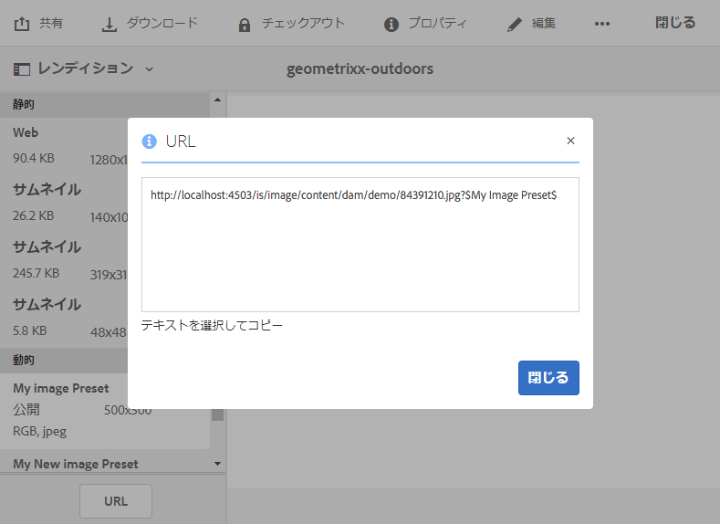
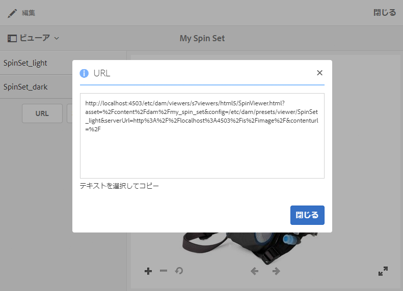

# Web アプリケーションへの URL のリンク {#linking-urls-to-your-web-application}

Web サイトやアプリケーションは、URL コールによって Dynamic Media のサービスにアクセスします。アセットの公開後、Dynamic Media によって、そのアセットを参照する URL 文字列がアクティベートされます。これらの URL を Web ブラウザーに貼り付けてテストすることができます。

AEM を WCM として使用&#x200B;*していない*&#x200B;場合に限り、URL へのリンクを使用します。ビデオプレーヤーをポップアップウィンドウまたはモーダルウィンドウとして配信する場合には、（埋め込みではなく）リンク機能を使用します。AEM を WCM として使用している場合は、[ページに直接アセットを追加します。](adding-dynamic-media-assets-to-pages.md)

Web ページやアプリケーションにこれらの URL 文字列を配置するには、Dynamic Media からコピーします。

>[!NOTE]
>
>URL 文字列は、アセットの動的レンディションでのみ使用できます。現時点では、Dynamic Media サーバーではなく DAM に存在する静的アセットには URL 文字列を使用できません。静的なレンディションに対しては「URL」ボタンが表示されません。

[Web ページへのビデオビューアまたは画像ビューアの埋め込み](embed-code.md)も参照してください。

[Web アプリケーションへの YouTube URL のリンク](video.md)も参照してください。

[レスポンシブサイト用に最適化された画像の配信](responsive-site.md)も参照してください。

[アセットのアップロード](/help/assets/manage-digital-assets.md#uploading-assets)も参照してください。

## アセットの URL の取得 {#obtaining-a-url-for-an-asset}

画像プリセットまたはビューアプリセットによって生成された URL 文字列を取得できます。URL をコピーしたらクリップボードに配置されるので、必要に応じて Web サイトのページまたはアプリケーションに貼り付けることができます。

>[!NOTE]
>
>URL は、選択したアセットを公開するまではコピーできません。また、ビューアプリセットまたは画像プリセットを公開する必要もあります。
>
>[アセットの公開](publishing-dynamicmedia-assets.md)を参照してください。
>
>[ビューアプリセットの公開](managing-viewer-presets.md#publishing-viewer-presets)を参照してください。
>
>[画像プリセットの公開](managing-image-presets.md#publishing-image-presets)を参照してください。

URL 文字列を取得するには複数の方法があります。以下の手順では、使用できる方法の 1 つを紹介します。

**アセットの URL を取得するには**

1. 画像プリセット URL またはビューアプリセット URL をコピーする&#x200B;*公開済み*&#x200B;のアセットの場所に移動し、そのアセットをタップして開きます。

   URL をコピーするには、その&#x200B;*前に*&#x200B;アセットを&#x200B;*公開*&#x200B;しておく必要があります。また、ビューアプリセットまたは画像プリセットを公開する必要もあります。

   [アセットの公開](publishing-dynamicmedia-assets.md)を参照してください。

   [ビューアプリセットの公開](managing-viewer-presets.md#publishing-viewer-presets)を参照してください。

   [画像プリセットの公開](managing-image-presets.md#publishing-image-presets)を参照してください。

1. 選択したアセットに応じて、次のいずれかの操作をおこないます。

   * 画像を選択した場合は、ドロップダウンメニューで「**[!UICONTROL レンディション]**」をタップします。

      「**[!UICONTROL 動的]**」ヘッダーの下にあるプリセット名をタップすると、右側のフレームにレンディションが表示されます。「動的」ヘッダーを表示するには、場合によってはレンディションリストをスクロールする必要があります。

      左側のレールの下部にある「**[!UICONTROL URL]**」をタップします。

      

   * スピンセット、画像セット、カルーセルセットまたはビデオを選択した場合は、ドロップダウンメニューで「**[!UICONTROL ビューア]**」をタップします。

      左側のレールで、ビューアプリセット名をタップします。セットまたはビデオのプレビューが別のページで開きます。

      左側のレールの下部にある「**[!UICONTROL URL]**」をタップします。

      

1. テキストを選択し、Web ブラウザーにコピーしてアセットをプレビューするか、Web コンテンツページに追加します。

   URL ウィンドウを閉じるには、「**[!UICONTROL X]**」をタップするか、「**[!UICONTROL 閉じる]**」をタップします。

## 静的アセットの URL の取得 {#obtaining-a-url-for-a-static-asset}

Dynamic Media は静的アセットの配信をサポートします。静的アセットとは、画像やビデオに留まらない追加アセットです。配信がサポートされる静的アセットの形式は以下のとおりです。

* 3D ファイル
* アニメーション GIF
* オーディオファイル
* CSS
* JavaScript（会社が独自ドメインで設定されている場合）
* PDF
* SVG
* XML
* ZIP

**静的アセットの URL を取得するには**

1. URL をコピーする「公開済み」の静的アセットの場所に移動し、アセットをタップして開きます。

   URL をコピーするには、その&#x200B;*前に*&#x200B;静的アセットを&#x200B;*公開*&#x200B;しておく必要があります。

   [アセットの公開](publishing-dynamicmedia-assets.md)を参照してください。

1. 以下のいずれかの方法で、公開済みの静的アセットの URL を取得します。

   * `The URL of the published static is the following:`

      * `https://*<server_name>*/is/content/*<company_name>*/*<static_asset_filename>*.*<extension>*`

         例： `https://aem.com/is/content/adobe/image.gif`
   * **[!UICONTROL アセット／動的レンディション]**&#x200B;をタップし、静的アセットの動的レンディションをタップして URL をコピーします。

      コピーした URL を変更して、`is/image/` の代わりにパスの `is/content` を使用します。

## 公開されたビデオレンディションのビデオ URL の取得 {#obtaining-a-video-url-for-a-published-video-rendition}

1. AEM で、**[!UICONTROL ツール／デプロイメント／クラウド／Cloud Services]** に移動します。
1. **[!UICONTROL Cloud Services]** ページで、「**[!UICONTROL Dynamic Media Cloud Services]**」見出しまでスクロールダウンして、「**[!UICONTROL 設定を表示]**」をタップします。
1. 「**[!UICONTROL 利用可能な設定]**」の下で、必要な設定をタップします。

1. **[!UICONTROL Dynamic Media クラウドの設定]**&#x200B;ページの「**[!UICONTROL ビデオサービスの URL]**」の下で、URL パス全体をコピーします。コピーした URL パスは後の手順で必要になります。

   例えば、URL パスは、次のように表示されることがあります。

   `https://s7athens.macromedia.com:9090/DMGateway/`

   （このパスは説明のために便宜的に示しています。コピーする実際のパスではありません。）

1. 「**[!UICONTROL 登録 ID]**」の下で、ID の最後の部分にある顧客名をコピーします。

   例えば、登録 ID が `87654321|MyCompany` の場合、顧客名は `MyCompany` です。

1. ページの左上隅付近で、「**[!UICONTROL Cloud Services]**」をタップしてから「AEM」アイコンをタップし、**[!UICONTROL 一般／CRXDE Lite]** に移動します。
1. JCR（Java コンテンツリポジトリ）のビデオレンディションパス全体をコピーします。

   例えば、ビデオのレンディションパスは、次のように表示されることがあります。

   `/_renditions_/0bd/0bd28743-a616-4fe6-92aa-6eae7c2112f/avs/Momentum_1080-0x720-2600k.mp4`

   （このパスは説明のために便宜的に示しています。コピーする実際のパスではありません。）

1. コピーした情報を次の順序に並べて、完全な URL パスを作成します。

   `<Video_Service_URL>/public/<Customer_name_from_Registration_ID>/<Video_rendition_path>`

   例えば、これまでの手順のサンプルのパスと顧客名を使用すると、完成したパスは次のようになります。

   `https://s7athens.macromedia.com:9090/DMGateway/public/MyCompany/_renditions_/0bd/0bd28743-a616-4fe6-92aa-6eae7c2112ff/avs/Momentum_1080-0x720-2600k.mp4`

   これは、公開されたビデオレンディションの完全なビデオ URL です。

## アダプティブストリーミング（HLS）用のビデオ URL の取得  {#obtaining-a-video-url-for-adaptive-streaming-hls}

1. AEM で、**[!UICONTROL ツール／デプロイメント／クラウド／Cloud Services]** に移動します。
1. **[!UICONTROL Cloud Services]** ページで、「**[!UICONTROL Dynamic Media Cloud Services]**」見出しまでスクロールダウンして、「**[!UICONTROL 設定を表示]**」をタップします。
1. 「**[!UICONTROL 利用可能な設定]**」の下で、必要な設定をタップします。
1. **[!UICONTROL Dynamic Media Cloud Services を設定]**&#x200B;ページで、以下の作業をおこないます。

   * 「**[!UICONTROL ビデオサービスの URL]**」の下で、URL パス全体をコピーします。コピーした URL パスは後の手順で必要になります。例えば、URL パスは、次のように表示されることがあります。

   `https://gateway-na.assetsadobe.com/DMGateway/`

   （このパスは説明のために便宜的に示しています。コピーする実際のパスではありません。）

   * 「**[!UICONTROL 登録 ID]**」の下で、ID の最後の部分にある顧客名をコピーします。コピーした顧客名は後の手順で必要になります。

      例えば、登録 ID が `87654321|demoCo` の場合、コピーする顧客名は `demoCo` です。

1. 使用しているビデオ配信プロトコルに基づいて、それぞれのプロトコルセレクターをコピーします。コピーしたプロトコルセレクターは後の手順で必要になります。

   <table>
    <tbody>
      <tr>
      <td><strong>使用しているビデオ配信プロトコル</strong></td>
      <td><strong>使用するプロトコルセレクター</strong></td>
      </tr>
      <tr>
      <td>
HTTP
 
HTTP（セキュアでないビデオ配信）を使用している場合は、前にコピーしたビデオサービス URL 値の <code>https</code> を <code>http</code> に変更してください。
 </td>
      <td><code>public/</code></td>
      </tr>
      <tr>
      <td>HTTPS</td>
      <td><code>public-ssl/</code></td>
      </tr>
    </tbody>
   </table>

1. Dynamic Media で処理される AEM のビデオアセットのフルパスをコピーします。コピーしたビデオアセットのパスは後の手順で必要になります。

   次に例を示します。

   `/content/dam/marketing/MyVideo.mp4`

1. これまでの手順でコピーしたすべての要素を以下の順に組み合わせて、文字列を作成します。

   &lt; `video service URL`>&lt; `protocol selector`>&lt; `customer name`>&lt; `video asset path`>

   例えば、これまでの手順の例からコピーした情報を使用すると、以下のような文字列になります。

   `https://gateway-na.assetsadobe.com/DMGateway/public-ssl/demoCo/content/dam/marketing/MyVideo.mp4`

1. 文字列の最後に `.m3u8` を付けて URL を完成させます。例えば、前の手順の文字列に `.m3u8` を付けると、完全な URL パスは以下のようになります。

   `https://gateway-na.assetsadobe.com/DMGateway/public-ssl/demoCo/content/dam/marketing/MyVideo.mp4.m3u8`

## HTTP/2 を使用した Dynamic Media アセットの配信 {#using-http-to-deliver-your-dynamic-media-assets}

HTTP/2 は、ブラウザーとサーバーの交信を強化する、新しく更新された Web プロトコルです。このプロトコルを使用すれば、情報の伝送を高速化し、必要な処理能力を抑えることができます。HTTP/2 上で Dynamic Media アセットの配信が可能になり、応答時間と読み込み時間が短縮されました。

Dynamic Media アカウントでの HTTP/2 の使用方法について詳しくは、[コンテンツの HTTP/2 配信](http2faq.md)を参照してください。
